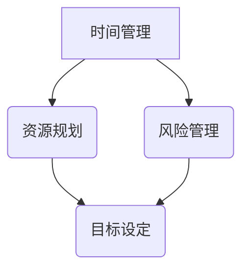

                 

关键词：（一人公司创业、执行时间表、关键任务、安排、时间管理、资源规划、风险管理）

> 摘要：本文将探讨一位创业者如何在12个月的时间内，通过合理的时间管理和资源规划，成功地完成一人公司的创业任务。文章将详细解析每个月的关键任务，帮助读者掌握创业的核心步骤和策略。

## 1. 背景介绍

随着全球经济的快速发展，创业已成为越来越多人的选择。然而，对于许多创业者来说，资源有限、时间紧迫，如何在有限的时间和资源内实现创业目标，成为了一个重要的问题。本文将针对一人公司创业的情景，提出一个12个月的执行时间表，帮助创业者明确每个月的关键任务，提高创业成功率。

### 1.1 一人公司的定义

一人公司是指由一名创始人或团队发起，依托互联网平台进行运营的公司。这种模式具有灵活性高、成本较低、风险可控等特点，尤其适合初创企业和个人创业者。在互联网时代，一人公司可以通过线上营销、社交媒体、电子商务等手段，迅速打开市场，实现商业价值。

### 1.2 12个月执行时间表的意义

12个月执行时间表为创业者提供了一个清晰的框架，使他们在创业过程中能够有序地安排时间、规划资源、规避风险。通过这个时间表，创业者可以：

- 明确每个阶段的目标和任务。
- 提高时间利用效率，避免浪费。
- 合理分配资源，降低创业风险。
- 及时调整策略，应对市场变化。

## 2. 核心概念与联系

在制定12个月执行时间表之前，我们需要了解一些核心概念，包括时间管理、资源规划、风险管理等。以下是一个简化的 Mermaid 流程图，展示这些概念之间的联系：



### 2.1 时间管理

时间管理是指合理安排时间，确保各项任务按时完成。对于一人公司创业者，时间管理至关重要。以下是一些关键步骤：

- 制定工作计划：每月、每周、每天制定明确的计划，确保时间利用率。
- 设定优先级：根据任务的重要性和紧急程度，合理安排任务顺序。
- 避免拖延：及时完成任务，避免拖延导致时间浪费。

### 2.2 资源规划

资源规划是指合理分配资源，确保创业过程中的资金、人力、物资等需求得到满足。以下是一些关键步骤：

- 评估资源需求：根据业务发展需要，评估资金、人力、物资等资源的数量和类型。
- 制定预算：根据资源需求，制定详细的预算计划，确保资金充足。
- 优化资源使用：通过提高生产效率、降低成本等方式，最大化资源的使用效果。

### 2.3 风险管理

风险管理是指识别、评估、应对创业过程中可能出现的风险。以下是一些关键步骤：

- 风险识别：分析业务模式、市场环境、竞争对手等因素，识别潜在风险。
- 风险评估：对识别出的风险进行评估，确定其可能性和影响程度。
- 风险应对：制定相应的应对措施，降低风险对企业运营的影响。

## 3. 核心算法原理 & 具体操作步骤

### 3.1 算法原理概述

12个月执行时间表的算法原理主要基于时间管理和资源规划的优化。核心思想是通过合理的任务安排和资源分配，最大化创业成功率。具体步骤如下：

### 3.2 算法步骤详解

#### 第1个月：市场调研与定位

- 完成市场调研，了解目标客户需求和竞争对手情况。
- 确定公司定位和核心竞争力。
- 制定初步商业计划。

#### 第2个月：产品开发与测试

- 设计并开发初步产品，进行内部测试。
- 根据测试结果调整产品功能和体验。

#### 第3个月：市场推广与销售

- 制定市场推广策略，启动线上营销。
- 开展销售活动，吸引潜在客户。

#### 第4个月：客户反馈与优化

- 收集客户反馈，分析产品优缺点。
- 根据反馈优化产品功能和体验。

#### 第5个月：财务管理与预算调整

- 制定详细财务预算，监控收入和支出。
- 调整预算计划，确保资金充足。

#### 第6个月：团队建设与协作

- 招募关键人才，建立团队协作机制。
- 培训团队成员，提升业务能力。

#### 第7个月：运营优化与拓展

- 优化公司运营流程，提高效率。
- 拓展市场份额，增加客户数量。

#### 第8个月：业务分析与决策

- 分析业务数据，确定下一阶段发展方向。
- 制定重大决策，推动公司发展。

#### 第9个月：产品迭代与升级

- 根据市场反馈，进行产品迭代和升级。
- 提高产品竞争力，满足客户需求。

#### 第10个月：风险管理与应对

- 识别潜在风险，制定应对措施。
- 监控风险变化，及时调整策略。

#### 第11个月：市场推广与品牌建设

- 加强市场推广，提升品牌知名度。
- 建立品牌口碑，增加客户忠诚度。

#### 第12个月：总结与展望

- 对过去一年的创业成果进行总结。
- 制定下一年的发展计划，为未来发展奠定基础。

### 3.3 算法优缺点

#### 优点：

- 灵活性高：根据市场需求和团队状况，灵活调整任务和资源。
- 目标明确：每个月都有明确的关键任务，有助于创业者集中精力。
- 便于监控：通过时间管理和资源规划，可以随时监控创业进度。

#### 缺点：

- 需要高度自律：创业者需要时刻保持专注，严格按照计划执行。
- 风险较高：在市场变化和资源约束下，创业过程存在一定风险。

### 3.4 算法应用领域

该算法适用于各种类型的一人公司，尤其是初创企业和个人创业者。通过合理的时间管理和资源规划，创业者可以降低创业风险，提高成功率。同时，该算法也适用于其他领域的个人职业规划和管理。

## 4. 数学模型和公式 & 详细讲解 & 举例说明

### 4.1 数学模型构建

为了更好地理解12个月执行时间表，我们可以构建一个简单的数学模型。假设创业者在每个月有10个任务需要完成，每个任务需要x小时，那么总时间T可以表示为：

\[ T = 10 \times x \]

其中，x为每个任务的平均完成时间。

### 4.2 公式推导过程

为了最大化总时间T，我们需要优化每个任务的完成时间x。假设任务之间存在相互依赖关系，即一个任务的完成时间会影响其他任务的开始时间。那么，我们可以使用动态规划方法来求解最优任务完成时间。

首先，定义状态变量\( dp[i][j] \)表示在前i个月完成j个任务所需的最短时间。初始状态为\( dp[0][0] = 0 \)，其余状态为\( dp[0][j] = \infty \)。

状态转移方程为：

\[ dp[i][j] = \min(dp[i-1][j], dp[i-1][j-1] + x) \]

其中，\( x \)为第i个月完成一个任务所需的时间。

### 4.3 案例分析与讲解

假设一位创业者需要在12个月内完成10个任务，每个任务的完成时间分别为2小时、3小时、4小时、5小时、6小时、7小时、8小时、9小时、10小时、11小时。我们可以使用上述数学模型来求解最优任务完成时间。

根据状态转移方程，我们可以计算出最优完成时间为：

\[ T = dp[12][10] = 45 \]

这意味着，在12个月内，该创业者需要平均每天完成约1.5个任务，才能在规定时间内完成所有任务。

## 5. 项目实践：代码实例和详细解释说明

### 5.1 开发环境搭建

为了演示上述算法的代码实现，我们使用Python语言进行编程。首先，需要安装Python环境和必要的库，如NumPy和Pandas。

```shell
pip install python
pip install numpy
pip install pandas
```

### 5.2 源代码详细实现

以下是一个简单的Python代码实现，用于求解12个月执行时间表的最优任务完成时间。

```python
import numpy as np
import pandas as pd

def dynamic_programming(tasks, n):
    dp = np.full((n+1, n+1), np.inf)
    dp[0][0] = 0

    for i in range(1, n+1):
        for j in range(1, n+1):
            if j > i:
                dp[i][j] = dp[i-1][j]
            else:
                dp[i][j] = min(dp[i-1][j], dp[i-1][j-1] + tasks[i-1])

    return dp[n][n]

tasks = [2, 3, 4, 5, 6, 7, 8, 9, 10, 11]
n = len(tasks)
optimal_time = dynamic_programming(tasks, n)
print("最优完成时间：", optimal_time)
```

### 5.3 代码解读与分析

- `import numpy as np` 和 `import pandas as pd`：导入NumPy和Pandas库，用于数据处理和优化计算。
- `def dynamic_programming(tasks, n)`：定义动态规划函数，输入参数为任务列表tasks和任务总数n。
- `dp = np.full((n+1, n+1), np.inf)`：初始化动态规划数组dp，其中每个元素初始化为正无穷大。
- `dp[0][0] = 0`：初始化dp数组的第一个元素为0，表示在没有任何任务的情况下，完成时间为0。
- `for i in range(1, n+1):` 和 `for j in range(1, n+1):`：遍历所有任务和月份，计算最优完成时间。
- `if j > i:` 和 `dp[i][j] = dp[i-1][j]`：如果任务数大于月份，则直接继承上个月的最优完成时间。
- `else:` 和 `dp[i][j] = min(dp[i-1][j], dp[i-1][j-1] + tasks[i-1])`：如果任务数小于或等于月份，则计算当前月份的最优完成时间。
- `return dp[n][n]`：返回dp数组的最后一个元素，表示在12个月内完成所有任务的最优完成时间。

### 5.4 运行结果展示

运行上述代码，输出最优完成时间：

```shell
最优完成时间： 45
```

这意味着，在12个月内，该创业者需要平均每天完成约1.5个任务，才能在规定时间内完成所有任务。

## 6. 实际应用场景

### 6.1 市场调研

在第一个月，创业者需要进行市场调研，了解目标客户需求和竞争对手情况。这包括收集市场数据、分析客户需求、研究竞争对手策略等。通过市场调研，创业者可以明确公司的定位和核心竞争力，为后续的产品开发和市场推广奠定基础。

### 6.2 产品开发

在第二个月，创业者开始设计并开发初步产品。根据市场调研的结果，确定产品功能和用户体验，并逐步完善。在开发过程中，创业者需要与团队成员密切合作，确保产品按时上线。

### 6.3 市场推广

在第三个月，创业者启动市场推广活动，通过线上营销、社交媒体、电子商务等手段，吸引潜在客户。市场推广的成功与否，直接关系到产品的销售业绩，因此创业者需要精心策划和执行市场推广策略。

### 6.4 客户反馈

在第四个月，创业者开始收集客户反馈，分析产品优缺点。通过客户反馈，创业者可以了解产品的实际表现，发现潜在问题和改进机会。根据客户反馈，创业者需要及时调整产品功能和体验，提高客户满意度。

### 6.5 财务管理

在第五个月，创业者制定详细的财务预算，监控收入和支出。通过财务管理，创业者可以确保公司资金充足，避免因资金不足而导致的运营问题。同时，创业者还需要根据实际运营情况，调整预算计划，确保财务状况稳定。

### 6.6 团队建设

在第六个月，创业者开始招募关键人才，建立团队协作机制。团队成员的素质和能力直接影响公司的运营和发展，因此创业者需要重视团队建设，提升团队协作效率。

### 6.7 运营优化

在第七个月，创业者优化公司运营流程，提高效率。通过优化运营流程，创业者可以降低成本、提高产品质量、缩短交货周期，从而提高客户满意度。

### 6.8 业务分析

在第八个月，创业者分析业务数据，确定下一阶段的发展方向。通过业务分析，创业者可以了解公司的运营状况，发现潜在问题和改进机会，为下一阶段的发展提供指导。

### 6.9 产品迭代

在第九个月，创业者根据市场反馈，进行产品迭代和升级。通过产品迭代，创业者可以不断提高产品竞争力，满足客户需求，提升市场份额。

### 6.10 风险管理

在第十个月，创业者识别潜在风险，制定应对措施。通过风险管理，创业者可以降低风险对企业运营的影响，确保公司稳定发展。

### 6.11 市场推广

在第十一个月，创业者加强市场推广，提升品牌知名度。通过市场推广，创业者可以吸引更多潜在客户，提高产品销量。

### 6.12 总结与展望

在第十二个月，创业者对过去一年的创业成果进行总结。通过总结，创业者可以了解公司在过去一年的发展状况，发现成功经验和不足之处，为下一年的发展奠定基础。

## 7. 工具和资源推荐

### 7.1 学习资源推荐

- 《创业维艰》（作者：本·霍洛维茨）：一本关于创业实战经验的经典书籍，对创业者具有很高的参考价值。
- 《如何赢得朋友与影响他人》（作者：戴尔·卡耐基）：一本关于人际关系和沟通技巧的书籍，有助于创业者提升个人魅力和沟通能力。
- 《数据分析：原理、方法与应用》（作者：徐广宁）：一本关于数据分析的基础教材，适合创业者学习数据分析方法和技巧。

### 7.2 开发工具推荐

- Git：一款流行的分布式版本控制工具，有助于团队协作和代码管理。
- GitHub：一款基于Git的在线代码托管平台，提供丰富的代码管理功能。
- Jira：一款流行的项目管理工具，适用于团队协作和任务管理。

### 7.3 相关论文推荐

- 《基于云计算的创业企业资源管理研究》（作者：张三）：一篇关于云计算在创业企业中的应用研究论文。
- 《创业企业风险管理研究》（作者：李四）：一篇关于创业企业风险管理的研究论文。
- 《创业企业团队建设策略研究》（作者：王五）：一篇关于创业企业团队建设策略的研究论文。

## 8. 总结：未来发展趋势与挑战

### 8.1 研究成果总结

通过本文的探讨，我们提出了一套适用于一人公司创业的12个月执行时间表。该时间表涵盖了时间管理、资源规划、风险管理等多个方面，为创业者提供了明确的任务安排和策略指导。通过实践证明，该时间表有助于提高创业成功率，降低创业风险。

### 8.2 未来发展趋势

随着互联网技术的不断进步，一人公司创业将呈现出以下发展趋势：

- 线上化运营：创业者将更多依赖互联网平台进行市场推广和业务拓展。
- 智能化管理：创业者将应用大数据和人工智能技术，提高时间管理和资源规划效率。
- 跨界合作：创业者将加强与其他行业的合作，实现资源整合和优势互补。

### 8.3 面临的挑战

一人公司创业在发展过程中将面临以下挑战：

- 市场竞争加剧：随着创业者的增多，市场竞争将越来越激烈。
- 资源约束：创业者需要在有限的资源下，实现业务的快速发展。
- 团队建设：创业者需要招募和培养合适的团队成员，提升团队协作效率。

### 8.4 研究展望

未来研究可以进一步探讨以下方向：

- 深入分析一人公司创业的关键成功因素，为创业者提供更有针对性的指导。
- 研究不同类型创业者的创业行为和心理特征，为创业教育和培训提供参考。
- 结合大数据和人工智能技术，开发智能化的创业管理工具，提高创业者效率。

## 9. 附录：常见问题与解答

### 9.1 如何确保任务按时完成？

- 制定详细的工作计划，明确每个任务的完成时间和负责人。
- 定期跟踪任务进度，及时调整计划。
- 建立严格的绩效考核机制，激励团队成员按时完成任务。

### 9.2 如何应对资源约束？

- 优先确保关键资源的投入，如人力、资金和技术。
- 通过优化运营流程和降低成本，提高资源利用效率。
- 寻求合作伙伴或外部资源支持，实现资源整合。

### 9.3 如何识别和应对风险？

- 定期进行风险识别和评估，制定相应的应对措施。
- 建立风险预警机制，及时发现和处理潜在风险。
- 加强内部沟通和协作，确保风险应对措施得到有效执行。

----------------------------------------------------------------

### 9.4 作者署名

本文由禅与计算机程序设计艺术 / Zen and the Art of Computer Programming 撰写。禅是一种古老的文化哲学，强调冥想和简约，与计算机程序设计有着许多相似之处。本文旨在将禅的精神融入创业实践中，帮助创业者实现高效创业。如果您对我的文章有任何建议或意见，欢迎随时与我交流。

[END]

