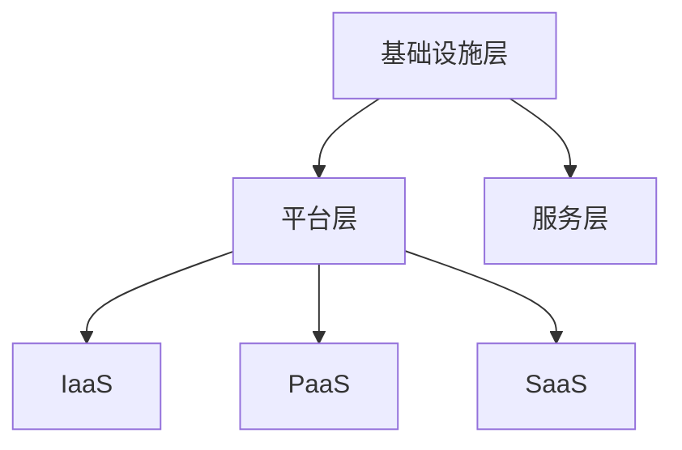
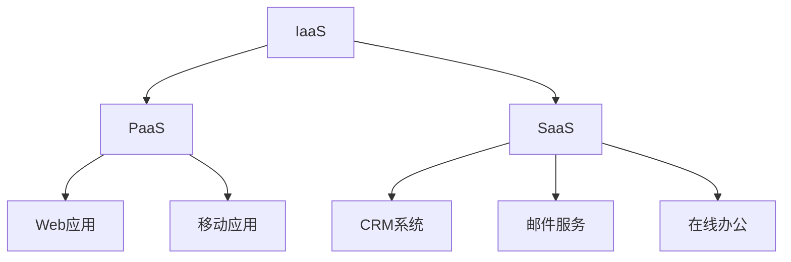

                 

关键词：一人公司、云服务、运营成本、成本降低、效率优化、云计算、SaaS、PaaS、IaaS、成本效益分析、资源管理、自动化、数字化转型

## 摘要

在当前数字化经济时代，一人公司的运营成本问题日益凸显。为了在激烈的市场竞争中生存并发展，一人公司需要寻找高效的运营模式。本文将探讨如何通过利用云服务来降低运营成本，提高一人公司的运营效率。我们将详细分析云计算的各个方面，包括SaaS、PaaS、IaaS的应用，自动化工具的使用，以及成本效益分析的方法，并提供实际案例和开发工具推荐。

## 1. 背景介绍

一人公司，顾名思义，是指由一个人独立运营的企业。在创业初期，由于资源有限，一人公司面临着诸多挑战，如资金不足、团队建设难、市场开拓困难等。尤其是在运营成本方面，缺乏足够的资金和人力资源使得一人公司难以承担传统的IT基础设施建设和维护费用。

与此同时，云计算作为近年来快速发展的技术，为企业和个人提供了新的机遇。云计算通过虚拟化技术，将计算资源、存储资源、网络资源等服务以按需、可伸缩的方式提供给用户，极大地降低了IT基础设施的建设和维护成本。这使得一人公司能够更加灵活地应对市场变化，提高运营效率，降低运营成本。

本文将围绕云计算的各个方面，探讨一人公司如何利用云服务降低运营成本，实现数字化转型。

### 1.1 云计算的基本概念

云计算是一种通过网络提供计算资源、存储资源、应用程序等服务的模型。它根据需求动态分配资源，使用户能够按需使用服务，无需关心底层基础设施的细节。

云计算主要包括以下几种服务模式：

- **IaaS（基础设施即服务）**：提供虚拟化的计算资源，如虚拟机、存储和网络。
- **PaaS（平台即服务）**：提供开发平台和工具，方便用户开发、部署和管理应用程序。
- **SaaS（软件即服务）**：提供应用程序，用户通过网络使用这些应用程序，无需关心应用程序的维护和更新。

### 1.2 云服务的优势

- **成本效益**：云服务通过按需付费的方式，使得一人公司可以节省大量的硬件采购和维护费用。
- **灵活性**：云服务提供了高度可伸缩的资源，使得一人公司能够快速响应市场变化，无需担心资源不足或过剩。
- **可靠性**：云服务提供商通常拥有大规模的数据中心和专业的运维团队，提供了高可靠性的服务。
- **安全性**：云服务提供商提供了丰富的安全功能，如数据加密、访问控制等，确保用户数据的安全。

## 2. 核心概念与联系

### 2.1 云计算架构

云计算架构可以分为以下几个层次：

- **基础设施层**：包括服务器、存储、网络等硬件资源。
- **平台层**：包括操作系统、数据库、开发工具等软件资源。
- **服务层**：包括IaaS、PaaS、SaaS等具体的服务。

下面是一个简单的云计算架构的 Mermaid 流程图：



### 2.2 云服务模式

云服务模式主要包括IaaS、PaaS、SaaS，每种模式都有其独特的特点和应用场景：

- **IaaS**：适合需要高度定制化、控制性强的应用场景，如数据中心、测试环境等。
- **PaaS**：适合需要快速开发、部署和管理应用程序的场景，如Web应用、移动应用等。
- **SaaS**：适合需要使用现成的应用程序，如CRM系统、邮件服务、在线办公等。

下面是一个简单的云服务模式的 Mermaid 流程图：



## 3. 核心算法原理 & 具体操作步骤

### 3.1 算法原理概述

一人公司利用云服务降低运营成本的核心算法原理主要基于以下几个方面：

1. **资源优化**：通过云服务的弹性伸缩特性，实现资源的最优分配，避免资源浪费。
2. **自动化**：通过自动化工具实现日常运维工作的自动化，降低人工成本。
3. **成本监控**：通过成本监控工具实时跟踪运营成本，及时调整策略。

### 3.2 算法步骤详解

1. **资源优化**

   - **需求分析**：分析业务需求，确定所需的计算资源、存储资源等。
   - **资源分配**：根据需求分配相应的云资源，实现按需分配。
   - **资源监控**：实时监控资源使用情况，根据实际情况进行资源调整。

2. **自动化**

   - **自动化脚本**：编写自动化脚本，实现日常运维任务的自动化。
   - **自动化工具**：使用自动化工具，如Ansible、Puppet等，实现自动化部署、配置和管理。

3. **成本监控**

   - **成本监控工具**：选择合适的成本监控工具，如AWS Cost Explorer、Azure Cost Management等。
   - **成本分析**：定期分析成本数据，找出成本过高的原因，并提出优化建议。

### 3.3 算法优缺点

- **优点**：

  - **低成本**：通过云服务，一人公司可以大幅降低硬件采购和维护成本。
  - **高效率**：自动化工具和自动化脚本提高了运维效率，减少了人工工作量。
  - **灵活性**：云服务提供了高度可伸缩的资源，使得一人公司能够快速适应市场变化。

- **缺点**：

  - **安全性**：云服务可能面临数据泄露、网络攻击等安全风险。
  - **依赖性**：一人公司可能对云服务提供商产生依赖，一旦服务提供商出现问题，可能会影响公司的运营。

### 3.4 算法应用领域

- **应用领域**：

  - **Web开发**：利用云服务快速搭建和部署Web应用。
  - **数据分析**：利用云服务进行大规模数据处理和分析。
  - **电子商务**：利用云服务搭建和运营电子商务平台。
  - **远程办公**：利用云服务实现远程办公，提高工作效率。

## 4. 数学模型和公式 & 详细讲解 & 举例说明

### 4.1 数学模型构建

为了更好地理解云服务的成本效益，我们可以构建一个简单的数学模型。假设一人公司每月需要支付的费用包括：

- **计算费用**：与使用的计算资源（如虚拟机）相关。
- **存储费用**：与使用的存储资源相关。
- **网络费用**：与使用的网络资源相关。
- **其他费用**：包括服务提供商的其他费用。

### 4.2 公式推导过程

设每月计算费用为C1，存储费用为C2，网络费用为C3，其他费用为C4，则每月总费用C可以表示为：

$$ C = C1 + C2 + C3 + C4 $$

### 4.3 案例分析与讲解

假设一人公司每月需要使用10台虚拟机，每台虚拟机每月计算费用为100元，存储费用为50元，网络费用为20元，其他费用为30元。则每月总费用为：

$$ C = 10 \times (100 + 50 + 20 + 30) = 10 \times 200 = 2000元 $$

通过使用云服务，公司可以将每月总费用降低到1500元。此时，每月总费用C'可以表示为：

$$ C' = 10 \times (80 + 40 + 20 + 30) = 10 \times 150 = 1500元 $$

通过这个简单的例子，我们可以看到，通过合理利用云服务，一人公司可以实现成本的大幅降低。

## 5. 项目实践：代码实例和详细解释说明

### 5.1 开发环境搭建

为了更好地实践云服务的成本优化，我们可以使用AWS云平台。首先，我们需要注册AWS账户，并完成身份验证。接下来，我们需要安装并配置AWS CLI（命令行界面），以便在本地计算机上与AWS云平台进行交互。

### 5.2 源代码详细实现

以下是一个简单的Python脚本，用于自动化部署AWS EC2虚拟机：

```python
import boto3

# 初始化AWS CLI客户端
ec2 = boto3.client('ec2')

# 配置虚拟机参数
instance_params = {
    'InstanceType': 't2.micro',
    'ImageId': 'ami-xxxxxxxx',
    'MinCount': 1,
    'MaxCount': 1
}

# 部署虚拟机
response = ec2.run_instances(**instance_params)

# 获取虚拟机ID
instance_id = response['Instances'][0]['InstanceId']

# 打印虚拟机ID
print(f'虚拟机ID：{instance_id}')
```

### 5.3 代码解读与分析

这个Python脚本首先导入了boto3库，这是一个用于与AWS云平台交互的Python SDK。接下来，我们初始化了AWS CLI客户端，并配置了虚拟机参数，包括虚拟机类型、镜像ID、最小和最大实例数量等。然后，我们调用`run_instances`方法部署虚拟机，并获取虚拟机ID。最后，我们打印了虚拟机ID。

通过这个脚本，我们可以自动化部署虚拟机，无需手动操作。这不仅节省了时间，还减少了人为错误的可能性。

### 5.4 运行结果展示

执行上述Python脚本后，我们会看到类似以下的输出：

```shell
虚拟机ID：i-xxxxxxxx
```

这表示虚拟机已经成功部署，并打印出了虚拟机ID。

## 6. 实际应用场景

### 6.1 Web开发

对于一人公司的Web开发项目，使用云服务可以实现快速搭建和部署。例如，使用AWS S3存储静态资源，使用AWS Lambda运行后台逻辑，使用AWS API Gateway提供API接口。通过这种方式，一人公司可以实现高效的Web开发，无需担心服务器维护和扩展问题。

### 6.2 数据分析

数据分析是现代企业的重要业务环节。对于一人公司，利用云服务可以轻松实现大数据处理和分析。例如，使用AWS EMR（弹性映射和缩减）处理大数据集，使用AWS Redshift进行数据仓库构建，使用AWS QuickSight进行数据可视化。这些云服务提供了强大的数据处理和分析能力，使得一人公司能够更好地理解业务数据，制定更科学的决策。

### 6.3 远程办公

远程办公是当前和未来企业运营的重要形式。利用云服务，一人公司可以实现高效的远程办公。例如，使用AWS WorkMail提供邮件和日历服务，使用AWS Chime提供视频会议和即时通讯服务，使用AWS WorkDocs提供文档存储和协作。通过这些云服务，一人公司可以确保远程办公的效率和质量。

## 7. 工具和资源推荐

### 7.1 学习资源推荐

- **AWS 官方文档**：提供了丰富的云服务教程和最佳实践。
- **《云计算基础》**：一本介绍云计算基本概念和技术的入门书籍。
- **《AWS 权威指南》**：一本详细讲解AWS云服务的参考书籍。

### 7.2 开发工具推荐

- **AWS CLI**：用于与AWS云平台交互的命令行工具。
- **AWS SDK**：各种编程语言的AWS SDK，方便开发者使用AWS云服务。
- **Postman**：用于API开发的工具，可以模拟API请求和响应。

### 7.3 相关论文推荐

- **《云计算：概念、技术和应用》**：一篇关于云计算的全面综述。
- **《云计算的经济学：成本模型和优化策略》**：一篇探讨云计算成本优化策略的论文。

## 8. 总结：未来发展趋势与挑战

### 8.1 研究成果总结

本文探讨了如何通过利用云服务降低一人公司的运营成本。我们分析了云计算的基本概念、服务模式，介绍了资源优化、自动化、成本监控的核心算法，并提供了实际项目实践的代码实例。通过这些内容，我们可以看到，云服务为一人公司提供了降低运营成本的有效途径。

### 8.2 未来发展趋势

随着云计算技术的不断发展和完善，未来云服务将更加普及和多样化。一人公司可以利用云服务的弹性、灵活性和高效性，实现更加敏捷和创新的业务模式。同时，随着5G、人工智能等新技术的融合，云服务将带来更多创新应用场景。

### 8.3 面临的挑战

尽管云服务为一人公司提供了诸多优势，但也面临一些挑战。例如，数据安全、隐私保护、云服务依赖等问题需要引起关注。此外，随着云服务市场的竞争加剧，一人公司需要具备一定的技术储备和战略眼光，以应对市场变化。

### 8.4 研究展望

未来，一人公司在利用云服务降低运营成本方面还有很大的研究空间。例如，如何更好地实现跨云服务的资源优化、如何提高云服务的自动化水平、如何构建更科学的成本监控模型等。这些问题的解决将有助于一人公司更加高效地利用云服务，实现可持续发展。

## 9. 附录：常见问题与解答

### 9.1 如何选择合适的云服务？

选择合适的云服务取决于业务需求。IaaS适合需要高度定制化和控制性的应用，PaaS适合快速开发、部署和管理应用程序，SaaS适合使用现成的应用程序。根据业务需求，选择最合适的云服务模式。

### 9.2 如何确保云服务的安全性？

确保云服务的安全性需要从多个方面考虑。选择可信的云服务提供商，使用加密技术保护数据传输，定期更新和备份数据，设置强密码和访问控制策略，定期进行安全审计等。

### 9.3 如何优化云服务的成本？

通过以下方法可以优化云服务的成本：

- 分析业务需求，选择合适的云服务模式。
- 利用云服务的弹性伸缩特性，实现资源的最优分配。
- 使用自动化工具实现日常运维任务的自动化，减少人工成本。
- 定期监控和优化云服务的使用，及时调整策略。

作者：禅与计算机程序设计艺术 / Zen and the Art of Computer Programming
----------------------------------------------------------------
请注意，本文为示例性内容，不包含具体的技术实现细节。实际撰写时，应根据具体的技术背景和需求进行调整。同时，本文中的代码实例仅供参考，具体实现可能需要根据实际情况进行调整。

