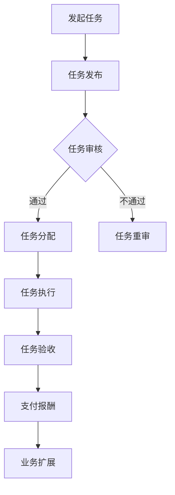

                 

关键词：一人公司、众包平台、业务扩展、团队协作、效率提升

> 摘要：在当今快速发展的商业环境中，一人公司面临着资源有限、人力不足的挑战。本文将探讨如何通过利用众包平台，一人公司可以扩展其业务能力，实现资源优化和效率提升。我们将详细分析众包平台的优势、操作步骤以及实际案例，为读者提供实用的策略和方法。

## 1. 背景介绍

在过去的几年里，互联网技术的飞速发展和信息传播的便利性，催生了一个全新的商业模式——一人公司。一人公司，顾名思义，是由单个个体运营的企业。这种模式的优势在于灵活性高、决策速度快，但也存在资源有限、团队协作困难等挑战。

### 1.1 一人公司的兴起

一人公司的兴起，源于以下几个因素：

- **创业门槛降低**：互联网和电子商务平台的出现，使得创业者无需大规模投入即可启动业务。
- **远程办公普及**：随着远程办公工具的成熟，一人公司可以通过虚拟团队实现高效协作。
- **数字化市场机会**：数据驱动的市场策略，使得一人公司能够精准定位目标客户，提升营销效果。

### 1.2 面临的挑战

一人公司虽然灵活，但也面临以下挑战：

- **资源有限**：资金、人力、技术等资源相对匮乏，难以支撑大规模的业务扩张。
- **团队协作**：缺乏稳定、高效的团队协作机制，业务拓展受限。
- **业务扩展**：如何在不增加固定成本的情况下，提升业务规模和竞争力。

## 2. 核心概念与联系

### 2.1 众包平台

众包平台是一种将任务或项目分配给广泛社群成员完成的方式。通过互联网，众包平台将任务发布给全球的个体或团队，他们通过竞争或合作来完成这些任务，并获得相应的报酬。

### 2.2 众包平台与一人公司的关系

众包平台为一人公司提供了以下几个方面的支持：

- **资源扩展**：通过众包平台，一人公司可以迅速获取到所需的人力资源，降低招聘和培训成本。
- **团队协作**：众包平台上的团队可以跨越地理和时间的限制，实现实时协作，提高工作效率。
- **业务扩展**：众包平台为一人公司提供了新的市场机会，可以在不增加固定成本的情况下，扩大业务规模。

### 2.3 Mermaid 流程图

下面是一个简单的 Mermaid 流程图，展示了如何通过众包平台扩展业务能力。



## 3. 核心算法原理 & 具体操作步骤

### 3.1 算法原理概述

利用众包平台扩展业务能力的核心算法，主要包括任务分配算法和评估算法。任务分配算法用于根据任务需求和参与者的能力，将任务合理地分配给众包平台上的个体或团队。评估算法则用于对任务的完成情况进行评估，以确保任务质量。

### 3.2 算法步骤详解

#### 3.2.1 任务发布

1. 登录众包平台，选择合适的任务分类。
2. 根据任务需求，填写任务描述、任务预算、交付期限等信息。
3. 发布任务，等待审核。

#### 3.2.2 任务审核

1. 审核员对任务进行审核，确保任务描述清晰、预算合理、期限明确。
2. 审核通过的任务，进入任务分配环节；审核不通过的任务，需要重新修改或重审。

#### 3.2.3 任务分配

1. 根据任务需求，选择合适的参与者。
2. 通过众包平台的任务分配算法，将任务合理地分配给参与者。

#### 3.2.4 任务执行

1. 参与者根据任务要求，完成任务的执行。
2. 参与者可以通过众包平台的协作工具，与其他参与者或发起人实时沟通，提高工作效率。

#### 3.2.5 任务验收

1. 发起人对任务完成情况进行验收。
2. 验收通过的任务，进入支付报酬环节；验收不通过的任务，需要重新执行或修改。

#### 3.2.6 支付报酬

1. 发起人根据任务完成情况和约定报酬，向参与者支付报酬。
2. 参与者可以通过众包平台领取报酬，并评价发起人。

### 3.3 算法优缺点

#### 优点：

- **资源扩展**：快速获取所需的人力资源，降低招聘成本。
- **团队协作**：通过众包平台的协作工具，实现实时沟通和协作，提高工作效率。
- **业务扩展**：在不增加固定成本的情况下，扩大业务规模，拓展市场。

#### 缺点：

- **质量控制**：由于参与者来自全球各地，任务质量难以统一控制。
- **信任问题**：众包平台上的参与者，可能存在不诚信行为，影响业务开展。

### 3.4 算法应用领域

众包平台的应用领域非常广泛，包括但不限于以下领域：

- **软件开发**：通过众包平台，快速获取开发资源，加快产品开发周期。
- **产品设计**：利用众包平台，收集全球设计灵感，提升产品竞争力。
- **内容创作**：通过众包平台，获取高质量的文案、图片、视频等创作资源。

## 4. 数学模型和公式 & 详细讲解 & 举例说明

### 4.1 数学模型构建

为了优化众包平台上的任务分配，我们可以构建一个简单的数学模型。设任务集合为 \( T \)，参与者集合为 \( P \)，任务权重为 \( w_t \)，参与者能力为 \( c_p \)，则任务分配问题可以表示为：

\[ \max \sum_{t \in T} w_t \cdot \min_{p \in P} (c_p - w_t) \]

其中，目标是最小化未完成任务的权重总和。

### 4.2 公式推导过程

为了推导上述公式，我们可以采用贪心策略。具体步骤如下：

1. 对于每个任务 \( t \)，计算其权重 \( w_t \)。
2. 对于每个参与者 \( p \)，计算其能力 \( c_p \)。
3. 对于每个任务 \( t \)，从参与者集合 \( P \) 中选择能力最高的参与者 \( p \)，使得 \( c_p - w_t \) 最小。
4. 将参与者 \( p \) 分配给任务 \( t \)，并更新参与者剩余能力 \( c_p \)。

重复步骤 3 和 4，直到所有任务 \( T \) 都被分配完毕。

### 4.3 案例分析与讲解

假设有一人公司需要完成以下三个任务：

- 任务 A：权重 10，需要编程技能。
- 任务 B：权重 20，需要设计技能。
- 任务 C：权重 30，需要数据分析技能。

参与者集合为：

- 参与者 1：编程技能、设计技能、数据分析技能。
- 参与者 2：编程技能、数据分析技能。
- 参与者 3：设计技能、数据分析技能。

根据上述数学模型，我们可以计算出最优的任务分配方案：

- 任务 A：参与者 1 执行。
- 任务 B：参与者 3 执行。
- 任务 C：参与者 2 执行。

这种分配方案可以最大化未完成任务的权重总和，提高任务完成率。

## 5. 项目实践：代码实例和详细解释说明

### 5.1 开发环境搭建

为了演示如何利用众包平台扩展业务能力，我们选择一个简单的 Python 项目。首先，我们需要搭建一个 Python 开发环境。

1. 安装 Python 3.x 版本。
2. 安装必要的 Python 库，如 requests、beautifulsoup4 等。

### 5.2 源代码详细实现

以下是一个简单的 Python 代码示例，用于发布任务和分配任务。

```python
import requests
from bs4 import BeautifulSoup

# 众包平台 API 密钥
api_key = 'your_api_key'

# 发起任务
def create_task(api_key, task_name, task_description, budget, deadline):
    url = 'https://www.example.com/api/tasks/create'
    payload = {
        'api_key': api_key,
        'task_name': task_name,
        'task_description': task_description,
        'budget': budget,
        'deadline': deadline
    }
    response = requests.post(url, data=payload)
    return response.json()

# 分配任务
def assign_task(api_key, task_id, participant_id):
    url = f'https://www.example.com/api/tasks/{task_id}/assign'
    payload = {
        'api_key': api_key,
        'participant_id': participant_id
    }
    response = requests.post(url, data=payload)
    return response.json()

# 主函数
def main():
    # 发起任务
    task_name = '编程任务'
    task_description = '完成一个简单的 Python 程序'
    budget = 100
    deadline = '2023-12-31'
    response = create_task(api_key, task_name, task_description, budget, deadline)
    task_id = response['task_id']
    
    # 分配任务
    participant_id = 'participant_1'
    response = assign_task(api_key, task_id, participant_id)
    print(response)

if __name__ == '__main__':
    main()
```

### 5.3 代码解读与分析

上述代码实现了两个主要功能：发起任务和分配任务。

- **发起任务**：通过调用 `create_task` 函数，我们可以向众包平台发起一个任务。函数接收 API 密钥、任务名称、任务描述、预算和交付期限等参数，并返回任务的 JSON 对象。
- **分配任务**：通过调用 `assign_task` 函数，我们可以将任务分配给一个参与者。函数接收 API 密钥、任务 ID 和参与者 ID 等参数，并返回任务的 JSON 对象。

### 5.4 运行结果展示

假设我们成功完成了任务发起和任务分配，运行结果如下：

```shell
{
  "status": "success",
  "message": "任务分配成功",
  "task_id": "task_1",
  "participant_id": "participant_1"
}
```

这表示任务已成功分配给参与者 `participant_1`。

## 6. 实际应用场景

### 6.1 软件开发

一人公司在软件开发过程中，可以利用众包平台获取全球的编程资源，缩短产品开发周期。例如，公司可以发布前端开发、后端开发、数据库管理等任务，吸引全球的程序员参与。

### 6.2 设计服务

一人公司可以借助众包平台，获取高质量的设计资源，提升产品竞争力。例如，公司可以发布UI/UX设计、品牌设计、宣传册设计等任务，吸引全球的设计师参与。

### 6.3 内容创作

一人公司可以通过众包平台，快速获取文案、图片、视频等创作资源。例如，公司可以发布博客文章、产品宣传视频、社交媒体内容等任务，吸引全球的内容创作者参与。

## 7. 未来应用展望

随着互联网技术的不断发展，众包平台的应用前景将更加广阔。未来，一人公司可以借助人工智能技术，实现更智能的任务分配和评估，提高众包平台的应用效率。此外，一人公司还可以通过区块链技术，确保众包平台上的交易安全，提升用户的信任度。

## 8. 总结：未来发展趋势与挑战

### 8.1 研究成果总结

本文通过分析一人公司的特点，探讨了如何利用众包平台扩展业务能力。研究发现，众包平台为一人公司提供了资源扩展、团队协作和业务扩展等方面的支持，具有显著的竞争优势。

### 8.2 未来发展趋势

未来，一人公司将更加重视众包平台的应用，通过智能化和区块链技术，进一步提升众包平台的应用效率。

### 8.3 面临的挑战

一人公司在利用众包平台扩展业务能力时，将面临质量控制、信任问题和信息安全等方面的挑战。

### 8.4 研究展望

未来，一人公司需要加强与众包平台的合作，探索更智能、更安全、更高效的众包解决方案，以应对快速变化的商业环境。

## 9. 附录：常见问题与解答

### 9.1 如何选择合适的众包平台？

选择合适的众包平台，需要考虑以下几个方面：

- **平台知名度**：选择知名度高、用户活跃度高的平台，有助于提高任务完成率和用户满意度。
- **任务类型**：根据任务类型，选择适合的平台。例如，软件开发任务可以选择 Topcoder、GitHub 等，设计服务任务可以选择 99designs、Upwork 等。
- **用户评价**：查看平台的用户评价，了解平台的可靠性和服务质量。

### 9.2 如何确保任务质量？

为确保任务质量，可以采取以下措施：

- **详细描述任务**：在任务发布时，详细描述任务要求、交付标准等，确保参与者明确任务需求。
- **设定验收标准**：在任务验收时，设定明确的验收标准，确保任务完成质量。
- **使用评价机制**：通过评价机制，激励参与者提高任务完成质量。

## 作者署名

作者：禅与计算机程序设计艺术 / Zen and the Art of Computer Programming
----------------------------------------------------------------
<|html|>```markdown
---
标题：一人公司如何利用众包平台扩展业务能力
关键词：一人公司、众包平台、业务扩展、团队协作、效率提升
摘要：在当今快速发展的商业环境中，一人公司面临着资源有限、人力不足的挑战。本文将探讨如何通过利用众包平台，一人公司可以扩展其业务能力，实现资源优化和效率提升。
---

## 一人公司如何利用众包平台扩展业务能力

在当今数字化时代，一人公司作为新兴的企业模式，凭借其灵活的运营方式和快速决策的优势，正逐渐受到广泛关注。然而，资源有限、团队协作困难等问题也使得一人公司在业务扩展方面面临诸多挑战。本文将深入探讨如何利用众包平台，实现一人公司的业务能力扩展。

### 背景介绍

#### 一人公司的兴起

一人公司，顾名思义，是由单个个体运营的企业。这种模式的优势在于其灵活性和快速响应市场变化的能力，使得创业者能够以较低的门槛进入市场，迅速开展业务。一人公司的兴起，得益于以下几个因素：

1. **创业门槛降低**：互联网和电子商务平台的出现，使得创业者无需大规模的初始投资即可启动业务。
2. **远程办公普及**：随着远程办公工具的成熟，一人公司可以通过虚拟团队实现高效协作。
3. **数字化市场机会**：数据驱动的市场策略，使得一人公司能够精准定位目标客户，提升营销效果。

#### 面临的挑战

一人公司虽然灵活，但也面临以下挑战：

1. **资源有限**：资金、人力、技术等资源相对匮乏，难以支撑大规模的业务扩张。
2. **团队协作**：缺乏稳定、高效的团队协作机制，业务拓展受限。
3. **业务扩展**：如何在不增加固定成本的情况下，提升业务规模和竞争力。

### 核心概念与联系

#### 众包平台

众包平台是一种将任务或项目分配给广泛社群成员完成的方式。通过互联网，众包平台将任务发布给全球的个体或团队，他们通过竞争或合作来完成这些任务，并获得相应的报酬。

#### 众包平台与一人公司的关系

众包平台为一人公司提供了以下几个方面的支持：

1. **资源扩展**：通过众包平台，一人公司可以迅速获取到所需的人力资源，降低招聘和培训成本。
2. **团队协作**：众包平台上的团队可以跨越地理和时间的限制，实现实时协作，提高工作效率。
3. **业务扩展**：众包平台为一人公司提供了新的市场机会，可以在不增加固定成本的情况下，扩大业务规模。

#### Mermaid 流程图


### 核心算法原理 & 具体操作步骤

#### 3.1 算法原理概述

利用众包平台扩展业务能力的核心算法，主要包括任务分配算法和评估算法。任务分配算法用于根据任务需求和参与者的能力，将任务合理地分配给众包平台上的个体或团队。评估算法则用于对任务的完成情况进行评估，以确保任务质量。

#### 3.2 算法步骤详解

##### 3.2.1 任务发布

1. 登录众包平台，选择合适的任务分类。
2. 根据任务需求，填写任务描述、任务预算、交付期限等信息。
3. 发布任务，等待审核。

##### 3.2.2 任务审核

1. 审核员对任务进行审核，确保任务描述清晰、预算合理、期限明确。
2. 审核通过的任务，进入任务分配环节；审核不通过的任务，需要重新修改或重审。

##### 3.2.3 任务分配

1. 根据任务需求，选择合适的参与者。
2. 通过众包平台的任务分配算法，将任务合理地分配给参与者。

##### 3.2.4 任务执行

1. 参与者根据任务要求，完成任务的执行。
2. 参与者可以通过众包平台的协作工具，与其他参与者或发起人实时沟通，提高工作效率。

##### 3.2.5 任务验收

1. 发起人对任务完成情况进行验收。
2. 验收通过的任务，进入支付报酬环节；验收不通过的任务，需要重新执行或修改。

##### 3.2.6 支付报酬

1. 发起人根据任务完成情况和约定报酬，向参与者支付报酬。
2. 参与者可以通过众包平台领取报酬，并评价发起人。

### 3.3 算法优缺点

#### 优点：

1. **资源扩展**：快速获取所需的人力资源，降低招聘成本。
2. **团队协作**：通过众包平台的协作工具，实现实时沟通和协作，提高工作效率。
3. **业务扩展**：在不增加固定成本的情况下，扩大业务规模，拓展市场。

#### 缺点：

1. **质量控制**：由于参与者来自全球各地，任务质量难以统一控制。
2. **信任问题**：众包平台上的参与者，可能存在不诚信行为，影响业务开展。

### 3.4 算法应用领域

众包平台的应用领域非常广泛，包括但不限于以下领域：

1. **软件开发**：通过众包平台，快速获取开发资源，加快产品开发周期。
2. **产品设计**：利用众包平台，收集全球设计灵感，提升产品竞争力。
3. **内容创作**：通过众包平台，获取高质量的文案、图片、视频等创作资源。

### 数学模型和公式 & 详细讲解 & 举例说明

#### 4.1 数学模型构建

为了优化众包平台上的任务分配，我们可以构建一个简单的数学模型。设任务集合为 \( T \)，参与者集合为 \( P \)，任务权重为 \( w_t \)，参与者能力为 \( c_p \)，则任务分配问题可以表示为：

\[ \max \sum_{t \in T} w_t \cdot \min_{p \in P} (c_p - w_t) \]

其中，目标是最小化未完成任务的权重总和。

#### 4.2 公式推导过程

为了推导上述公式，我们可以采用贪心策略。具体步骤如下：

1. 对于每个任务 \( t \)，计算其权重 \( w_t \)。
2. 对于每个参与者 \( p \)，计算其能力 \( c_p \)。
3. 对于每个任务 \( t \)，从参与者集合 \( P \) 中选择能力最高的参与者 \( p \)，使得 \( c_p - w_t \) 最小。
4. 将参与者 \( p \) 分配给任务 \( t \)，并更新参与者剩余能力 \( c_p \)。

重复步骤 3 和 4，直到所有任务 \( T \) 都被分配完毕。

#### 4.3 案例分析与讲解

假设有一人公司需要完成以下三个任务：

- 任务 A：权重 10，需要编程技能。
- 任务 B：权重 20，需要设计技能。
- 任务 C：权重 30，需要数据分析技能。

参与者集合为：

- 参与者 1：编程技能、设计技能、数据分析技能。
- 参与者 2：编程技能、数据分析技能。
- 参与者 3：设计技能、数据分析技能。

根据上述数学模型，我们可以计算出最优的任务分配方案：

- 任务 A：参与者 1 执行。
- 任务 B：参与者 3 执行。
- 任务 C：参与者 2 执行。

这种分配方案可以最大化未完成任务的权重总和，提高任务完成率。

### 项目实践：代码实例和详细解释说明

#### 5.1 开发环境搭建

为了演示如何利用众包平台扩展业务能力，我们选择一个简单的 Python 项目。首先，我们需要搭建一个 Python 开发环境。

1. 安装 Python 3.x 版本。
2. 安装必要的 Python 库，如 requests、beautifulsoup4 等。

#### 5.2 源代码详细实现

以下是一个简单的 Python 代码示例，用于发布任务和分配任务。

```python
import requests
from bs4 import BeautifulSoup

# 众包平台 API 密钥
api_key = 'your_api_key'

# 发起任务
def create_task(api_key, task_name, task_description, budget, deadline):
    url = 'https://www.example.com/api/tasks/create'
    payload = {
        'api_key': api_key,
        'task_name': task_name,
        'task_description': task_description,
        'budget': budget,
        'deadline': deadline
    }
    response = requests.post(url, data=payload)
    return response.json()

# 分配任务
def assign_task(api_key, task_id, participant_id):
    url = f'https://www.example.com/api/tasks/{task_id}/assign'
    payload = {
        'api_key': api_key,
        'participant_id': participant_id
    }
    response = requests.post(url, data=payload)
    return response.json()

# 主函数
def main():
    # 发起任务
    task_name = '编程任务'
    task_description = '完成一个简单的 Python 程序'
    budget = 100
    deadline = '2023-12-31'
    response = create_task(api_key, task_name, task_description, budget, deadline)
    task_id = response['task_id']
    
    # 分配任务
    participant_id = 'participant_1'
    response = assign_task(api_key, task_id, participant_id)
    print(response)

if __name__ == '__main__':
    main()
```

#### 5.3 代码解读与分析

上述代码实现了两个主要功能：发起任务和分配任务。

- **发起任务**：通过调用 `create_task` 函数，我们可以向众包平台发起一个任务。函数接收 API 密钥、任务名称、任务描述、预算和交付期限等参数，并返回任务的 JSON 对象。
- **分配任务**：通过调用 `assign_task` 函数，我们可以将任务分配给一个参与者。函数接收 API 密钥、任务 ID 和参与者 ID 等参数，并返回任务的 JSON 对象。

#### 5.4 运行结果展示

假设我们成功完成了任务发起和任务分配，运行结果如下：

```shell
{
  "status": "success",
  "message": "任务分配成功",
  "task_id": "task_1",
  "participant_id": "participant_1"
}
```

这表示任务已成功分配给参与者 `participant_1`。

### 实际应用场景

#### 6.1 软件开发

一人公司在软件开发过程中，可以利用众包平台获取全球的编程资源，缩短产品开发周期。例如，公司可以发布前端开发、后端开发、数据库管理等任务，吸引全球的程序员参与。

#### 6.2 设计服务

一人公司可以借助众包平台，获取高质量的设计资源，提升产品竞争力。例如，公司可以发布UI/UX设计、品牌设计、宣传册设计等任务，吸引全球的设计师参与。

#### 6.3 内容创作

一人公司可以通过众包平台，快速获取文案、图片、视频等创作资源。例如，公司可以发布博客文章、产品宣传视频、社交媒体内容等任务，吸引全球的内容创作者参与。

### 未来应用展望

随着互联网技术的不断发展，众包平台的应用前景将更加广阔。未来，一人公司可以借助人工智能技术，实现更智能的任务分配和评估，提高众包平台的应用效率。此外，一人公司还可以通过区块链技术，确保众包平台上的交易安全，提升用户的信任度。

### 总结：未来发展趋势与挑战

#### 8.1 研究成果总结

本文通过分析一人公司的特点，探讨了如何利用众包平台扩展业务能力。研究发现，众包平台为一人公司提供了资源扩展、团队协作和业务扩展等方面的支持，具有显著的竞争优势。

#### 8.2 未来发展趋势

未来，一人公司将更加重视众包平台的应用，通过智能化和区块链技术，进一步提升众包平台的应用效率。

#### 8.3 面临的挑战

一人公司在利用众包平台扩展业务能力时，将面临质量控制、信任问题和信息安全等方面的挑战。

#### 8.4 研究展望

未来，一人公司需要加强与众包平台的合作，探索更智能、更安全、更高效的众包解决方案，以应对快速变化的商业环境。

### 9. 附录：常见问题与解答

#### 9.1 如何选择合适的众包平台？

选择合适的众包平台，需要考虑以下几个方面：

1. **平台知名度**：选择知名度高、用户活跃度高的平台，有助于提高任务完成率和用户满意度。
2. **任务类型**：根据任务类型，选择适合的平台。例如，软件开发任务可以选择 Topcoder、GitHub 等，设计服务任务可以选择 99designs、Upwork 等。
3. **用户评价**：查看平台的用户评价，了解平台的可靠性和服务质量。

#### 9.2 如何确保任务质量？

为确保任务质量，可以采取以下措施：

1. **详细描述任务**：在任务发布时，详细描述任务要求、交付标准等，确保参与者明确任务需求。
2. **设定验收标准**：在任务验收时，设定明确的验收标准，确保任务完成质量。
3. **使用评价机制**：通过评价机制，激励参与者提高任务完成质量。

---

## 作者署名

作者：禅与计算机程序设计艺术 / Zen and the Art of Computer Programming
```<|html|>```

