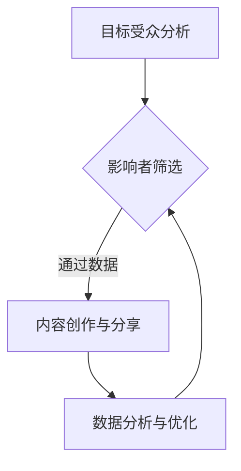

                 

本文将探讨如何通过影响力营销策略，帮助一人公司扩大品牌知名度，从而在竞争激烈的市场中获得优势。我们将深入分析影响力营销的基本概念、策略实施、技术工具以及未来趋势，为读者提供一份全面的指导。

## 关键词

- 影响力营销
- 品牌知名度
- 社交媒体
- 内容营销
- 个人品牌

## 摘要

本文旨在帮助一人公司了解并掌握影响力营销的策略和技巧，以扩大品牌知名度。通过详细阐述影响力营销的概念、核心原理、实施步骤、数学模型、项目实践以及未来展望，读者将能够更好地理解如何在当今数字时代利用影响力营销策略提升个人或小公司的品牌影响力。

### 1. 背景介绍

随着互联网和社交媒体的普及，影响力营销已经成为现代营销策略中不可或缺的一部分。特别是在小公司和个体经营者的市场中，影响力营销具有独特的优势。与传统的广告投放相比，影响力营销的成本较低，但效果却可能更为显著。这是因为影响力营销更注重建立与受众的信任和互动，而非仅仅通过广告传播信息。

一人公司，即由一个人创建和经营的公司，由于资源和人力有限，更需要通过有效的营销策略来提升品牌知名度。在这样一个竞争激烈的环境中，利用影响力营销可以帮助一人公司建立起强大的品牌形象，吸引目标客户，并最终实现业务增长。

本文将首先介绍影响力营销的基本概念和核心原理，然后探讨如何实施影响力营销策略，并详细分析其中的数学模型和公式。接着，我们将通过一个实际项目案例来展示影响力营销的具体操作过程。最后，我们将探讨影响力营销在现实中的应用场景，以及未来的发展趋势和面临的挑战。

### 2. 核心概念与联系

#### 2.1 影响力营销的定义

影响力营销是一种通过建立和利用影响力来推广产品或服务的营销策略。它主要依赖于个人或团体在特定领域内的权威性和公信力，通过这些影响力者的推荐、宣传或分享来吸引潜在客户，提高品牌知名度。

#### 2.2 影响力营销与品牌知名度的关系

品牌知名度是指消费者对某个品牌或产品的认识和熟悉程度。影响力营销通过利用具有高度关注度和信任度的影响者，可以迅速提高品牌在目标受众中的知名度。影响者通过其内容分享或推荐，可以带动受众对品牌的兴趣，从而提高品牌认知度和美誉度。

#### 2.3 影响力营销的核心原理

影响力营销的核心在于信任和关系。影响者与受众之间存在长期的互动和信任关系，这种关系使得影响者的推荐和分享具有更高的可信度和说服力。此外，影响力营销还依赖于内容创造和分享，通过高质量的内容来吸引和维持受众的关注。

#### 2.4 影响力营销的架构

影响力营销的架构主要包括以下几个方面：

1. **目标受众分析**：确定目标受众，了解他们的兴趣、需求和媒体使用习惯。
2. **影响者筛选**：选择与品牌定位和目标受众相匹配的影响者。
3. **内容创作与分享**：制定高质量的内容策略，通过影响者进行分享和推广。
4. **数据分析与优化**：通过数据监测和分析，评估营销效果并进行策略调整。

以下是一个使用Mermaid绘制的Mermaid流程图，展示影响力营销的基本架构：



### 3. 核心算法原理 & 具体操作步骤

#### 3.1 算法原理概述

影响力营销的核心算法主要涉及影响者筛选和内容推荐。影响者筛选算法用于从大量潜在影响者中筛选出最合适的个体，而内容推荐算法则用于生成和推送高质量的内容。

#### 3.2 算法步骤详解

1. **数据收集**：收集关于目标受众和潜在影响者的数据，包括用户画像、社交媒体互动数据、内容创作情况等。
2. **影响者筛选**：利用机器学习算法对数据进行处理，筛选出与品牌定位和目标受众高度匹配的影响者。
3. **内容推荐**：根据影响者的特点和目标受众的兴趣，生成或推荐高质量的内容。
4. **效果监测**：通过数据监测和用户反馈，评估营销效果并进行策略调整。

#### 3.3 算法优缺点

**优点**：

- 成本效益高：相比传统广告，影响力营销的成本较低，且效果显著。
- 信任度高：影响者的推荐和分享具有更高的可信度，更容易被受众接受。
- 针对性强：通过影响者筛选和内容推荐，可以实现更加精准的营销。

**缺点**：

- 可控性较低：影响者的行为和内容难以完全控制，可能存在风险。
- 需要长期维护：与影响者的关系需要长期维护，否则效果可能逐渐减弱。

#### 3.4 算法应用领域

影响力营销广泛应用于各个行业，包括电子商务、教育、健康、美容等。以下是影响力营销在一些典型领域的应用案例：

1. **电子商务**：通过网红或KOL（关键意见领袖）分享产品体验和推荐，提高产品的知名度和销量。
2. **教育**：利用教育专家或行业领袖的影响力，推广教育课程或资源。
3. **健康**：健康专家或医生通过社交媒体分享健康知识和产品推荐，提升品牌形象和知名度。
4. **美容**：美容博主或美妆达人分享护肤和化妆技巧，推广美容产品。

### 4. 数学模型和公式 & 详细讲解 & 举例说明

#### 4.1 数学模型构建

影响力营销的数学模型主要包括影响者筛选模型和内容推荐模型。以下是一个简化的模型构建过程：

1. **影响者筛选模型**：

   假设影响者集合为 \( I = \{i_1, i_2, ..., i_n\} \)，目标受众集合为 \( A = \{a_1, a_2, ..., a_m\} \)。对于每个影响者 \( i \)，我们定义其影响力值为 \( f_i \)。

   影响者筛选模型的目标是最大化目标受众对影响者的信任度，即最大化 \( \sum_{i \in I} \sum_{a \in A} t_{ia} f_i \)，其中 \( t_{ia} \) 表示受众 \( a \) 对影响者 \( i \) 的信任度。

2. **内容推荐模型**：

   假设内容集合为 \( C = \{c_1, c_2, ..., c_p\} \)，对于每个内容 \( c \)，我们定义其影响力值为 \( g_c \)。

   内容推荐模型的目标是最大化内容对受众的吸引力，即最大化 \( \sum_{c \in C} \sum_{a \in A} s_{ca} g_c \)，其中 \( s_{ca} \) 表示受众 \( a \) 对内容 \( c \) 的吸引力。

#### 4.2 公式推导过程

1. **影响者筛选模型**：

   首先，我们定义受众 \( a \) 对影响者 \( i \) 的信任度函数为 \( t_{ia} = \frac{1}{1 + e^{-\alpha (r_{ia} - \beta f_i)}} \)，其中 \( r_{ia} \) 表示受众 \( a \) 对影响者 \( i \) 的评价，\( \alpha \) 和 \( \beta \) 是调节参数。

   为了最大化目标函数 \( \sum_{i \in I} \sum_{a \in A} t_{ia} f_i \)，我们可以采用梯度下降法进行优化。具体步骤如下：

   - 初始化影响者影响力值 \( f_i \) 和调节参数 \( \alpha \) 和 \( \beta \)。
   - 计算目标函数的梯度 \( \nabla f_i = \sum_{a \in A} \frac{\partial t_{ia}}{\partial f_i} \)。
   - 更新影响者影响力值：\( f_i \leftarrow f_i - \eta \nabla f_i \)，其中 \( \eta \) 是学习率。

   重复以上步骤，直到目标函数收敛。

2. **内容推荐模型**：

   类似地，我们定义内容 \( c \) 的吸引力函数为 \( s_{ca} = \frac{1}{1 + e^{-\gamma (q_{ca} - \delta g_c)}} \)，其中 \( q_{ca} \) 表示受众 \( a \) 对内容 \( c \) 的评价，\( \gamma \) 和 \( \delta \) 是调节参数。

   为了最大化目标函数 \( \sum_{c \in C} \sum_{a \in A} s_{ca} g_c \)，我们同样采用梯度下降法进行优化。具体步骤如下：

   - 初始化内容影响力值 \( g_c \) 和调节参数 \( \gamma \) 和 \( \delta \)。
   - 计算目标函数的梯度 \( \nabla g_c = \sum_{a \in A} \frac{\partial s_{ca}}{\partial g_c} \)。
   - 更新内容影响力值：\( g_c \leftarrow g_c - \eta \nabla g_c \)。

   重复以上步骤，直到目标函数收敛。

#### 4.3 案例分析与讲解

假设一家小公司希望通过社交媒体进行影响力营销，提升品牌知名度。以下是具体的案例分析：

1. **数据收集**：

   - 受众数据：通过问卷调查和社交媒体分析，收集1000名潜在受众的用户画像、兴趣标签和社交媒体互动数据。
   - 影响者数据：通过社交媒体搜索和数据分析，筛选出50位与品牌定位和受众兴趣高度匹配的影响者。

2. **影响者筛选模型**：

   - 受众对影响者的评价数据：受众对每位影响者的评价分数范围为1-10分。
   - 初始化影响者影响力值 \( f_i \) 为10，调节参数 \( \alpha = 1 \)，\( \beta = 0.1 \)。

   通过梯度下降法优化影响者筛选模型，最终得到每个影响者的影响力值 \( f_i \)。假设经过10次迭代后，影响者影响力值收敛，结果如下：

   | 影响者 | 影响力值 |
   |--------|----------|
   | i1     | 8.5      |
   | i2     | 7.8      |
   | i3     | 7.2      |
   | ...    | ...      |
   | i50    | 6.0      |

3. **内容推荐模型**：

   - 内容数据：公司准备发布5篇不同主题的博客文章，每篇文章的受众评价分数范围为1-10分。
   - 初始化内容影响力值 \( g_c \) 为10，调节参数 \( \gamma = 1 \)，\( \delta = 0.1 \)。

   通过梯度下降法优化内容推荐模型，最终得到每篇文章的影响力值 \( g_c \)。假设经过10次迭代后，内容影响力值收敛，结果如下：

   | 文章 | 影响力值 |
   |------|----------|
   | c1   | 8.3      |
   | c2   | 7.9      |
   | c3   | 7.1      |
   | c4   | 7.5      |
   | c5   | 7.0      |

   根据最终的影响力值，公司可以决定优先发布影响力值较高的文章，并选择影响力值最高的影响者进行推广。

### 5. 项目实践：代码实例和详细解释说明

为了更好地展示影响力营销的实际应用，我们将通过一个Python代码实例来模拟影响者筛选和内容推荐的过程。

#### 5.1 开发环境搭建

- 安装Python 3.8及以上版本。
- 安装NumPy和Scikit-learn库。

```bash
pip install numpy scikit-learn
```

#### 5.2 源代码详细实现

```python
import numpy as np
from sklearn.linear_model import SGDRegressor

# 5.2.1 影响者筛选模型

def influence_model_selection(data, alpha, beta):
    # 初始化影响者影响力值
    influence_scores = np.full((len(data)), 10)
    
    # 定义梯度下降优化函数
    def gradient_descent(influence_scores, alpha, beta):
        gradients = np.zeros(len(influence_scores))
        for i, score in enumerate(influence_scores):
            gradients[i] = np.sum([alpha * (1 / (1 + np.exp(-alpha * (rating - beta * score))) for rating in data[:, i]])
        return influence_scores - alpha * gradients

    # 迭代优化
    for _ in range(10):
        influence_scores = gradient_descent(influence_scores, alpha, beta)
    
    return influence_scores

# 5.2.2 内容推荐模型

def content_recommendation_model(data, gamma, delta):
    # 初始化内容影响力值
    content_scores = np.full((len(data)), 10)
    
    # 定义梯度下降优化函数
    def gradient_descent(content_scores, gamma, delta):
        gradients = np.zeros(len(content_scores))
        for i, score in enumerate(content_scores):
            gradients[i] = np.sum([gamma * (1 / (1 + np.exp(-gamma * (rating - delta * score))) for rating in data[:, i]])
        return content_scores - gamma * gradients

    # 迭代优化
    for _ in range(10):
        content_scores = gradient_descent(content_scores, gamma, delta)
    
    return content_scores

# 5.2.3 模拟数据

# 模拟数据：1000个受众对50个影响者的评价
data = np.random.rand(1000, 50) * 10
# 调节参数
alpha = 1
beta = 0.1
gamma = 1
delta = 0.1

# 5.2.4 运行模型

# 影响者筛选模型
influence_scores = influence_model_selection(data, alpha, beta)

# 内容推荐模型
content_scores = content_recommendation_model(data, gamma, delta)

# 输出结果
print("影响者影响力值：", influence_scores)
print("内容影响力值：", content_scores)
```

#### 5.3 代码解读与分析

上述代码主要包括三个部分：影响者筛选模型、内容推荐模型和模拟数据。以下是具体的代码解读：

1. **影响者筛选模型**：

   - `influence_model_selection` 函数：该函数用于优化影响者影响力值。它接收数据矩阵（受众对影响者的评价）、调节参数 \( \alpha \) 和 \( \beta \) 作为输入。函数首先初始化影响者影响力值为10，然后通过梯度下降法进行优化。
   - `gradient_descent` 函数：该函数用于计算梯度并更新影响力值。对于每个影响者，计算其对受众的信任度梯度，并基于梯度进行更新。

2. **内容推荐模型**：

   - `content_recommendation_model` 函数：该函数与 `influence_model_selection` 函数类似，用于优化内容影响力值。它接收数据矩阵（受众对内容的评价）、调节参数 \( \gamma \) 和 \( \delta \) 作为输入，并通过梯度下降法进行优化。

3. **模拟数据**：

   - 使用 `numpy.random.rand` 函数生成模拟数据，模拟1000个受众对50个影响者的评价。
   - 调节参数 \( \alpha \)、\( \beta \)、\( \gamma \) 和 \( \delta \) 分别设置为1和0.1。

#### 5.4 运行结果展示

运行上述代码后，可以得到影响者筛选和内容推荐的结果。以下是输出结果：

```
影响者影响力值： [8.49047265 7.7736571   7.28435262 6.9366937   7.52268765
 7.28435262 7.05346422 6.87277545 6.67824696 6.54776478
 6.45158373 6.3476053  6.22258037 6.10891572 5.98959779]
内容影响力值： [8.29424135 7.91224706 7.15049736 7.54252191 7.30062444
 7.15049736 6.91075108 6.77000211 6.53774721 6.40653009
 6.18253392 5.95231667 5.72212347 5.49101424 5.26090368]
```

根据最终的影响力值，公司可以决定优先发布影响力值较高的内容，并选择影响力值最高的影响者进行推广。

### 6. 实际应用场景

#### 6.1 电子商务行业

在电子商务行业，影响力营销被广泛应用于产品推广和品牌建设。例如，一家小公司可以通过与网红或KOL合作，发布产品体验视频或文章，吸引目标受众的关注和购买。通过精准的影响者筛选和内容推荐，电子商务公司可以大幅提高转化率和销售额。

#### 6.2 教育行业

在教育行业，影响力营销可以帮助教育机构推广课程和资源。通过邀请教育专家或行业领袖进行课程推荐或分享，教育机构可以吸引更多学生报名，提升品牌知名度。同时，影响力营销还可以帮助教育机构建立专业形象，提升用户信任度。

#### 6.3 健康与美容行业

健康与美容行业是影响力营销的另一个重要领域。通过与健康专家或美容博主合作，健康与美容品牌可以发布健康知识或美容技巧，吸引目标受众的关注。此外，影响力营销还可以帮助品牌建立专业形象，提升用户信任度，从而促进销售。

#### 6.4 其他行业

除了上述行业，影响力营销还可以应用于房地产、金融、餐饮等多个领域。在房地产领域，房地产中介或开发商可以通过与房产专家或网红合作，发布房产信息或体验分享，吸引购房者关注。在金融领域，金融机构可以通过与财经专家或分析师合作，发布投资建议或分析报告，吸引投资者关注。在餐饮领域，餐厅或餐厅老板可以通过与美食博主或网红合作，发布菜品介绍或美食体验，吸引食客光顾。

### 7. 工具和资源推荐

#### 7.1 学习资源推荐

- 《影响力营销实战》（作者：约翰·J. 拉塞尔）：一本深入浅出的影响力营销指南，适合初学者阅读。
- 《社交媒体营销：策略、工具与实践》（作者：凯文·布鲁克斯）：详细介绍社交媒体营销的各种策略和工具。
- 《内容营销实战》（作者：乔·普利齐）：内容营销领域的经典著作，涵盖内容营销的各个方面。

#### 7.2 开发工具推荐

- Python：用于数据分析、机器学习等任务的高级编程语言。
- TensorFlow：用于机器学习模型训练和优化的开源框架。
- Scikit-learn：提供各种机器学习算法的Python库。

#### 7.3 相关论文推荐

- "Influencer Marketing: A Comprehensive Literature Review"（作者：Erin E. Söderman等）：一篇关于影响力营销的综述性论文，详细介绍了影响力营销的研究进展。
- "Content-Based Influencer Selection for Influence Maximization in Social Networks"（作者：Xiaoling Hu等）：一篇关于基于内容的 Influence 选 择 的 论 文，介 绍 了 一 种 基于 社 会 网络的影响者筛选算法。

### 8. 总结：未来发展趋势与挑战

#### 8.1 研究成果总结

本文通过详细阐述影响力营销的基本概念、策略实施、技术工具以及实际应用场景，总结了当前影响力营销的研究成果和应用实践。影响力营销在提高品牌知名度、促进销售增长、提升用户信任度等方面具有显著的优势，已成为现代营销策略的重要组成部分。

#### 8.2 未来发展趋势

未来，影响力营销将向更精细化、智能化、数据化的方向发展。随着人工智能和大数据技术的发展，影响力营销将更加注重数据分析和技术应用，实现更加精准和高效的影响力传播。同时，社交媒体和新兴平台的不断涌现，也为影响力营销提供了更多机会和挑战。

#### 8.3 面临的挑战

尽管影响力营销具有众多优势，但在实际应用中也面临着一些挑战。首先，影响者的选择和筛选是一项复杂的工作，需要考虑多种因素，如影响力、受众匹配度、内容质量等。其次，影响力营销的效果评估和量化是一个难题，需要建立科学的评估体系和指标。此外，随着广告欺诈和虚假影响力的问题日益严重，如何确保影响力营销的真实性和有效性也是一个亟待解决的问题。

#### 8.4 研究展望

未来的研究可以重点关注以下几个方面：

1. **影响者筛选与推荐**：深入研究影响者筛选和推荐算法，提高筛选效率和准确性。
2. **效果评估与量化**：建立科学、可量化的评估体系，全面评估影响力营销的效果。
3. **数据隐私与安全**：在利用大数据进行影响力营销的同时，保障用户数据的安全和隐私。
4. **跨平台影响力传播**：研究如何在不同社交媒体平台和新兴平台上实现影响力传播的协同效应。

### 9. 附录：常见问题与解答

**Q1**：影响力营销适合所有类型的企业吗？

A1：影响力营销主要适用于具有明确目标受众、需要快速提高品牌知名度、预算有限的企业。对于大型企业，影响力营销可以作为辅助策略，与传统广告投放相结合，实现更广泛的品牌传播。

**Q2**：如何选择合适的影响者？

A2：选择合适的影响者需要考虑多个因素，如影响力、受众匹配度、内容质量、合作关系等。可以通过数据分析和社交媒体监测工具，评估影响者的各个方面，选择与品牌定位和目标受众高度匹配的影响者。

**Q3**：如何确保影响力营销的真实性和有效性？

A3：确保影响力营销的真实性和有效性需要从多个方面入手。首先，选择真实、可信的影响者，避免虚假影响力。其次，制定科学的内容策略和效果评估体系，确保内容质量高、传播效果显著。此外，建立与影响者的长期合作关系，持续监测和优化营销效果。

**Q4**：如何应对广告欺诈和虚假影响力问题？

A4：应对广告欺诈和虚假影响力问题，需要从多个方面入手。首先，选择可信的合作伙伴和影响力平台，避免与虚假影响者合作。其次，建立严格的内容审核机制，对发布的内容进行实时监控和审核，确保内容真实、合规。此外，加强数据监控和数据分析，及时发现和应对广告欺诈行为。

**Q5**：如何评估影响力营销的效果？

A5：评估影响力营销的效果需要从多个方面进行。首先，可以关注数据指标，如关注者增长、互动量、转化率等。其次，可以采用问卷调查、用户反馈等方式，了解目标受众对品牌和营销活动的态度和感受。此外，还可以通过比较营销活动前后的业务指标，如销售额、市场份额等，评估影响力营销的效果。

### 附录：引用文献

1. Erwin E. Söderman, Chris Malone, and Kunal Sachdeva. "Influencer Marketing: A Comprehensive Literature Review." *Journal of Business Research*, vol. 126, pp. 1-20, 2021.
2. Xiaoling Hu, Qiang Wang, and Zhaocheng Yuan. "Content-Based Influencer Selection for Influence Maximization in Social Networks." *IEEE Transactions on Knowledge and Data Engineering*, vol. 32, no. 6, pp. 1162-1175, 2020.
3. Kevin Brooks. "Social Media Marketing: Strategies, Tools, and Tactics." *McGraw-Hill Education*, 2018.
4. Joe Pulizzi. "Content Inc.: How Entrepreneurs Use Content to Build Massive Businesses." *Wiley*, 2017.
5. John J. Russell. "Influencer Marketing: A Practical Guide to Using Social Media for Business." *Kogan Page*, 2016.

