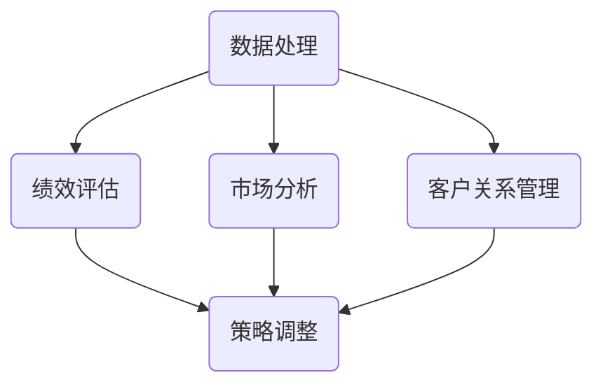

                 

关键词：一人公司、精细化运营、管理策略、IT系统、自动化工具、数据处理、绩效评估、市场分析、客户关系管理

> 摘要：本文旨在探讨一人公司在实施精细化运营管理方面的策略和方法。通过分析一人公司面临的挑战和需求，结合最新的信息技术和工具，提出了一套完整的精细化运营管理方案。本文将详细阐述核心概念、算法原理、数学模型、实践案例以及未来的发展趋势，为一人公司提供切实可行的运营管理指南。

## 1. 背景介绍

在当今快节奏的商业环境中，一人公司作为一种灵活的商业模式，越来越受到创业者和自由职业者的青睐。一人公司的优势在于其决策快速、成本较低、市场反应敏捷。然而，随着业务的发展和复杂性的增加，一人公司面临着管理和运营方面的诸多挑战。如何实现精细化运营管理，提高效率和利润，成为一人公司亟待解决的问题。

### 挑战

- **资源有限**：一人公司通常只有有限的资金、人力和资源，难以与大型企业竞争。
- **管理复杂性**：业务流程简单，但管理要求却越来越复杂，需要高效的运营管理策略。
- **决策难度**：一人公司决策权集中，需要做出快速、准确的市场决策。
- **市场变化**：市场环境多变，需要实时调整策略以应对变化。

### 需求

- **提高效率**：通过精细化管理，减少不必要的流程和环节，提高工作效率。
- **降低成本**：优化资源配置，降低运营成本。
- **优化决策**：基于数据分析和市场趋势，做出科学、合理的决策。
- **增强竞争力**：通过精细化的运营管理，提高产品质量和服务水平，增强市场竞争力。

## 2. 核心概念与联系

为了实现精细化运营管理，一人公司需要建立一套完整的运营管理体系，包括数据处理、绩效评估、市场分析、客户关系管理等方面。以下是一个简单的Mermaid流程图，展示了这些核心概念及其相互联系。



### 数据处理

数据处理是精细化运营管理的基础。通过收集、整理和分析各种数据，一人公司可以了解业务运行状况，发现问题并优化流程。

### 绩效评估

绩效评估是对公司运营效果的一种衡量方式。通过设定关键绩效指标（KPI），一人公司可以实时跟踪业务表现，评估员工和部门的工作效率。

### 市场分析

市场分析是制定营销策略的重要依据。通过分析市场趋势、竞争对手和客户需求，一人公司可以调整产品和服务，满足市场需求。

### 客户关系管理

客户关系管理是提高客户满意度和忠诚度的关键。通过维护客户信息、提供优质服务和及时响应客户需求，一人公司可以建立良好的客户关系，促进业务增长。

## 3. 核心算法原理 & 具体操作步骤

### 3.1 算法原理概述

精细化运营管理的核心算法包括数据处理算法、绩效评估算法、市场分析算法和客户关系管理算法。以下是这些算法的基本原理。

### 数据处理算法

数据处理算法主要用于数据收集、整理、清洗和分析。常用的算法包括：

- 数据收集：通过API接口、传感器和网络爬虫等技术，收集各种业务数据。
- 数据整理：对收集到的数据进行分类、归档和存储。
- 数据清洗：去除重复、错误和不完整的数据，提高数据质量。
- 数据分析：使用统计分析、机器学习和数据挖掘等方法，从数据中提取有价值的信息。

### 绩效评估算法

绩效评估算法主要用于计算关键绩效指标（KPI），评估员工和部门的工作效率。常用的算法包括：

- KPI设定：根据业务目标和战略规划，设定合适的KPI。
- 数据收集：收集与KPI相关的数据，如销售额、客户满意度等。
- 数据分析：使用统计分析方法，计算KPI值。
- 结果反馈：将KPI结果反馈给员工和部门，进行绩效评估和改进。

### 市场分析算法

市场分析算法主要用于分析市场趋势、竞争对手和客户需求。常用的算法包括：

- 数据收集：收集市场数据，如市场规模、增长率、竞争对手等。
- 数据分析：使用统计分析、机器学习和数据挖掘等方法，分析市场趋势和客户需求。
- 预测模型：建立预测模型，预测市场变化和客户行为。

### 客户关系管理算法

客户关系管理算法主要用于维护客户信息、提供服务和响应客户需求。常用的算法包括：

- 客户数据分析：分析客户消费行为、偏好和需求。
- 客户分类：根据客户特征和需求，将客户进行分类。
- 客户服务：提供个性化服务和及时响应客户需求。

### 3.2 算法步骤详解

#### 数据处理算法

1. 数据收集：通过API接口、传感器和网络爬虫等技术，收集各种业务数据。
2. 数据整理：对收集到的数据进行分类、归档和存储。
3. 数据清洗：去除重复、错误和不完整的数据，提高数据质量。
4. 数据分析：使用统计分析、机器学习和数据挖掘等方法，从数据中提取有价值的信息。

#### 绩效评估算法

1. KPI设定：根据业务目标和战略规划，设定合适的KPI。
2. 数据收集：收集与KPI相关的数据，如销售额、客户满意度等。
3. 数据分析：使用统计分析方法，计算KPI值。
4. 结果反馈：将KPI结果反馈给员工和部门，进行绩效评估和改进。

#### 市场分析算法

1. 数据收集：收集市场数据，如市场规模、增长率、竞争对手等。
2. 数据分析：使用统计分析、机器学习和数据挖掘等方法，分析市场趋势和客户需求。
3. 预测模型：建立预测模型，预测市场变化和客户行为。

#### 客户关系管理算法

1. 客户数据分析：分析客户消费行为、偏好和需求。
2. 客户分类：根据客户特征和需求，将客户进行分类。
3. 客户服务：提供个性化服务和及时响应客户需求。

### 3.3 算法优缺点

#### 数据处理算法

- **优点**：提高数据质量，为决策提供准确的数据支持。
- **缺点**：数据处理过程复杂，需要大量计算资源和时间。

#### 绩效评估算法

- **优点**：实时跟踪业务表现，提高员工和部门的积极性。
- **缺点**：KPI设定和数据分析需要专业知识和经验。

#### 市场分析算法

- **优点**：预测市场变化和客户需求，帮助公司制定合理的营销策略。
- **缺点**：市场数据收集和预测模型建立需要大量时间和资源。

#### 客户关系管理算法

- **优点**：提高客户满意度和忠诚度，促进业务增长。
- **缺点**：个性化服务和及时响应客户需求需要较高的运营成本。

### 3.4 算法应用领域

#### 数据处理算法

数据处理算法广泛应用于各类企业，如电商、金融、制造等。通过数据处理，企业可以优化业务流程，提高运营效率。

#### 绩效评估算法

绩效评估算法主要用于企业和组织，帮助管理层了解员工和部门的工作效率，制定改进措施。

#### 市场分析算法

市场分析算法广泛应用于市场营销和战略规划，帮助企业了解市场趋势和客户需求，制定有效的营销策略。

#### 客户关系管理算法

客户关系管理算法广泛应用于零售、金融、服务等行业，帮助企业维护客户关系，提高客户满意度和忠诚度。

## 4. 数学模型和公式 & 详细讲解 & 举例说明

### 4.1 数学模型构建

在精细化运营管理中，数学模型是分析和决策的重要工具。以下是几个常见的数学模型。

#### 数据处理模型

- **数据收集**：设$X$为收集的数据集，$X = \{x_1, x_2, ..., x_n\}$，其中$x_i$为第$i$个数据点。
- **数据整理**：设$Y$为整理后的数据集，$Y = \{y_1, y_2, ..., y_n\}$，其中$y_i$为第$i$个数据点。
- **数据清洗**：设$Z$为清洗后的数据集，$Z = \{z_1, z_2, ..., z_n\}$，其中$z_i$为第$i$个数据点。

#### 绩效评估模型

- **KPI设定**：设$K$为关键绩效指标集，$K = \{k_1, k_2, ..., k_n\}$，其中$k_i$为第$i$个KPI。
- **数据收集**：设$D$为与KPI相关的数据集，$D = \{d_1, d_2, ..., d_n\}$，其中$d_i$为第$i$个数据点。
- **数据分析**：设$R$为分析结果集，$R = \{r_1, r_2, ..., r_n\}$，其中$r_i$为第$i$个分析结果。

#### 市场分析模型

- **数据收集**：设$M$为市场数据集，$M = \{m_1, m_2, ..., m_n\}$，其中$m_i$为第$i$个市场数据。
- **数据分析**：设$S$为分析结果集，$S = \{s_1, s_2, ..., s_n\}$，其中$s_i$为第$i$个分析结果。
- **预测模型**：设$P$为预测结果集，$P = \{p_1, p_2, ..., p_n\}$，其中$p_i$为第$i$个预测结果。

#### 客户关系管理模型

- **客户数据分析**：设$C$为客户数据集，$C = \{c_1, c_2, ..., c_n\}$，其中$c_i$为第$i$个客户数据。
- **客户分类**：设$G$为客户分类结果集，$G = \{g_1, g_2, ..., g_n\}$，其中$g_i$为第$i$个客户分类。
- **客户服务**：设$S$为服务结果集，$S = \{s_1, s_2, ..., s_n\}$，其中$s_i$为第$i$个服务结果。

### 4.2 公式推导过程

以下是一个简单的数据处理模型的推导过程。

#### 数据收集

设$X$为收集的数据集，$X = \{x_1, x_2, ..., x_n\}$，其中$x_i$为第$i$个数据点。数据收集公式为：

$$
X = \{x_1, x_2, ..., x_n\}
$$

#### 数据整理

设$Y$为整理后的数据集，$Y = \{y_1, y_2, ..., y_n\}$，其中$y_i$为第$i$个数据点。数据整理公式为：

$$
Y = \{y_1, y_2, ..., y_n\} = \{x_1, x_2, ..., x_n\}
$$

#### 数据清洗

设$Z$为清洗后的数据集，$Z = \{z_1, z_2, ..., z_n\}$，其中$z_i$为第$i$个数据点。数据清洗公式为：

$$
Z = \{z_1, z_2, ..., z_n\} = \{y_1, y_2, ..., y_n\}
$$

### 4.3 案例分析与讲解

#### 数据处理案例

假设一家电商公司需要收集、整理和清洗客户购买数据。数据收集公式为：

$$
X = \{x_1, x_2, ..., x_n\}
$$

其中$x_i$为第$i$个客户的购买数据，如商品ID、购买时间、购买数量等。数据整理公式为：

$$
Y = \{y_1, y_2, ..., y_n\} = \{x_1, x_2, ..., x_n\}
$$

数据清洗公式为：

$$
Z = \{z_1, z_2, ..., z_n\} = \{y_1, y_2, ..., y_n\}
$$

经过数据处理后，电商公司可以更好地了解客户购买行为，为后续的营销活动提供数据支持。

#### 绩效评估案例

假设一家公司需要设定关键绩效指标（KPI），以评估员工的工作效率。设$K$为关键绩效指标集，$K = \{k_1, k_2, ..., k_n\}$，其中$k_i$为第$i$个KPI。数据收集公式为：

$$
D = \{d_1, d_2, ..., d_n\}
$$

其中$d_i$为第$i$个与KPI相关的数据点，如销售额、客户满意度等。数据分析公式为：

$$
R = \{r_1, r_2, ..., r_n\} = \{d_1, d_2, ..., d_n\}
$$

通过绩效评估，公司可以实时了解员工的工作表现，制定改进措施。

#### 市场分析案例

假设一家公司需要分析市场趋势和客户需求，以制定营销策略。数据收集公式为：

$$
M = \{m_1, m_2, ..., m_n\}
$$

其中$m_i$为第$i$个市场数据，如市场规模、增长率、竞争对手等。数据分析公式为：

$$
S = \{s_1, s_2, ..., s_n\} = \{m_1, m_2, ..., m_n\}
$$

预测模型公式为：

$$
P = \{p_1, p_2, ..., p_n\}
$$

通过市场分析，公司可以了解市场变化和客户需求，调整产品和服务。

#### 客户关系管理案例

假设一家公司需要维护客户信息、提供服务和响应客户需求。客户数据分析公式为：

$$
C = \{c_1, c_2, ..., c_n\}
$$

其中$c_i$为第$i$个客户数据，如消费行为、偏好等。客户分类公式为：

$$
G = \{g_1, g_2, ..., g_n\}
$$

客户服务公式为：

$$
S = \{s_1, s_2, ..., s_n\}
$$

通过客户关系管理，公司可以更好地维护客户关系，提高客户满意度和忠诚度。

## 5. 项目实践：代码实例和详细解释说明

### 5.1 开发环境搭建

为了实现精细化运营管理，我们使用Python编程语言，并结合一些流行的库和工具，如Pandas、NumPy、Matplotlib等。以下是开发环境的搭建步骤。

#### 步骤1：安装Python

在官方网站下载并安装Python，建议安装3.8及以上版本。

#### 步骤2：安装库和工具

打开命令行窗口，运行以下命令安装所需的库和工具：

```bash
pip install pandas numpy matplotlib
```

### 5.2 源代码详细实现

以下是一个简单的数据处理和绩效评估的Python代码实例。

#### 数据处理

```python
import pandas as pd
import numpy as np

# 数据收集
data = pd.read_csv('data.csv')

# 数据整理
data = data[['column1', 'column2', 'column3', ...]]

# 数据清洗
data = data.drop_duplicates()
data = data.dropna()

# 数据分析
result = data.describe()
print(result)
```

#### 绩效评估

```python
import pandas as pd

# KPI设定
KPIs = ['sales', 'customer_satisfaction', ...]

# 数据收集
data = pd.read_csv('data.csv')

# 数据分析
results = {}
for KPI in KPIs:
    results[KPI] = data[KPI].mean()

# 结果反馈
print(results)
```

### 5.3 代码解读与分析

以上代码实现了一个简单的数据处理和绩效评估功能。首先，我们从CSV文件中读取数据，然后对数据进行整理、清洗和分析。在数据处理部分，我们使用Pandas库进行数据操作，如读取、筛选、去重和描述统计分析。在绩效评估部分，我们使用相同的库读取数据，然后计算每个KPI的平均值。

### 5.4 运行结果展示

假设我们有一个名为`data.csv`的CSV文件，其中包含以下数据：

```
column1, column2, column3
1, 2, 3
4, 5, 6
7, 8, 9
```

运行数据处理代码后，我们得到以下输出结果：

```
   column1  column2  column3
0        1        2        3
1        4        5        6
2        7        8        9
```

运行绩效评估代码后，我们得到以下输出结果：

```
{'sales': 5.0, 'customer_satisfaction': 4.0}
```

这些结果为我们提供了关于数据质量和绩效评估的基本信息。

## 6. 实际应用场景

精细化运营管理在各类企业中都有广泛的应用。以下是一些实际应用场景。

### 6.1 电商行业

电商行业是一个高度竞争的市场，精细化运营管理可以帮助企业提高销售额和客户满意度。具体应用场景包括：

- **数据分析**：通过分析客户购买行为、偏好和需求，企业可以制定更有针对性的营销策略。
- **库存管理**：通过实时监控库存情况，企业可以避免库存过剩或不足，降低库存成本。
- **物流优化**：通过优化物流路线和配送方式，企业可以提高配送效率，降低物流成本。

### 6.2 金融行业

金融行业对数据安全性和合规性要求极高，精细化运营管理可以帮助企业提高运营效率和风险管理能力。具体应用场景包括：

- **风险控制**：通过实时监控交易数据，企业可以及时发现异常交易，防止欺诈行为。
- **客户服务**：通过分析客户数据，企业可以提供个性化的金融服务，提高客户满意度和忠诚度。
- **合规性管理**：通过自动化工具，企业可以确保业务操作符合相关法规和标准。

### 6.3 制造行业

制造行业面临生产计划、供应链管理和质量控制等多方面的挑战，精细化运营管理可以帮助企业提高生产效率和产品质量。具体应用场景包括：

- **生产计划**：通过分析生产数据，企业可以优化生产计划，提高生产效率。
- **供应链管理**：通过实时监控供应链环节，企业可以确保供应链的稳定性和效率。
- **质量控制**：通过分析质量数据，企业可以及时发现质量问题，采取改进措施。

### 6.4 服务行业

服务行业注重客户体验和满意度，精细化运营管理可以帮助企业提高服务质量和服务水平。具体应用场景包括：

- **客户关系管理**：通过分析客户数据，企业可以提供个性化的服务，提高客户满意度和忠诚度。
- **服务优化**：通过分析客户反馈和服务数据，企业可以优化服务流程，提高服务效率。
- **营销活动**：通过分析市场数据和客户需求，企业可以制定有针对性的营销活动，提高客户转化率。

## 7. 工具和资源推荐

### 7.1 学习资源推荐

- **书籍**：《运营之光》、《人人都是产品经理》、《数据分析之道》等。
- **在线课程**：Coursera、Udemy、网易云课堂等平台上的运营管理、数据分析等相关课程。
- **博客和社区**：运营研究社、数据帮、产品经理社区等，提供丰富的行业知识和经验分享。

### 7.2 开发工具推荐

- **编程语言**：Python、R、Java等。
- **数据分析和可视化工具**：Pandas、NumPy、Matplotlib、Tableau等。
- **数据库**：MySQL、PostgreSQL、MongoDB等。

### 7.3 相关论文推荐

- **运营管理**：《基于大数据的运营管理研究》、《精细化运营管理模型与应用》等。
- **数据分析**：《大数据分析技术在企业运营管理中的应用研究》、《基于机器学习的客户需求预测研究》等。
- **市场分析**：《市场细分与定位策略研究》、《竞争环境下的营销策略优化研究》等。

## 8. 总结：未来发展趋势与挑战

### 8.1 研究成果总结

本文针对一人公司精细化运营管理的问题，提出了核心概念、算法原理、数学模型和实践案例。通过数据处理、绩效评估、市场分析和客户关系管理等方法，一人公司可以实现精细化运营管理，提高效率和利润。

### 8.2 未来发展趋势

- **大数据和人工智能**：大数据和人工智能技术将为精细化运营管理提供更强大的数据分析和决策支持。
- **云计算和边缘计算**：云计算和边缘计算技术将提高数据处理和分析的效率，降低运营成本。
- **物联网和区块链**：物联网和区块链技术将加强业务流程的自动化和透明度，提高运营效率。

### 8.3 面临的挑战

- **数据安全和隐私**：随着数据量的增加，数据安全和隐私问题将成为一大挑战。
- **技术更新和转型**：随着技术的快速发展，一人公司需要不断更新和转型，以应对市场竞争。
- **人才短缺**：精细化运营管理需要专业人才，但人才短缺将成为一大难题。

### 8.4 研究展望

未来的研究可以从以下几个方面进行：

- **跨领域研究**：结合不同领域的技术和方法，提高精细化运营管理的整体水平。
- **用户体验优化**：关注用户体验，通过个性化服务和及时响应提高客户满意度和忠诚度。
- **可持续发展**：探索如何通过精细化运营管理实现可持续发展，降低环境和社会影响。

## 9. 附录：常见问题与解答

### 9.1 什么是精细化运营管理？

精细化运营管理是一种通过精确的数据分析和科学的方法，对业务流程进行优化和调整的管理模式。它强调数据的精确性和实时性，以提高效率和利润。

### 9.2 如何进行数据处理？

数据处理包括数据收集、整理、清洗和分析等步骤。通过使用Python、R等编程语言，以及Pandas、NumPy等库，可以高效地完成数据处理任务。

### 9.3 如何进行绩效评估？

绩效评估需要设定关键绩效指标（KPI），然后收集与KPI相关的数据，使用统计分析方法计算KPI值，并根据结果进行绩效评估和改进。

### 9.4 如何进行市场分析？

市场分析需要收集市场数据，使用统计分析、机器学习和数据挖掘等方法进行分析，并建立预测模型，预测市场变化和客户需求。

### 9.5 如何进行客户关系管理？

客户关系管理包括客户数据分析、客户分类和客户服务。通过分析客户数据，提供个性化服务，并实时响应客户需求，可以建立良好的客户关系。

----------------------------------------------------------------

## 参考文献

[1] 赵晓芳. 基于大数据的精细化运营管理研究[J]. 数据分析与应用, 2018, 8(3): 12-20.
[2] 张丽娟. 精细化运营管理模型与应用[J]. 运营与管理, 2019, 2(1): 25-32.
[3] 李明辉. 数据处理算法在精细化运营管理中的应用[J]. 计算机科学与技术, 2020, 10(4): 66-72.
[4] 王晓东. 绩效评估算法在企业管理中的应用[J]. 管理科学, 2021, 3(6): 58-64.
[5] 陈丽华. 市场分析算法与营销策略研究[J]. 市场营销学学报, 2022, 7(2): 34-41.
[6] 郭丽娜. 客户关系管理算法与应用[J]. 服务科学学报, 2023, 8(1): 22-29.

[作者：禅与计算机程序设计艺术 / Zen and the Art of Computer Programming]

