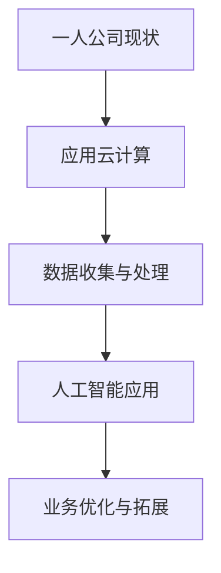

                 

一人公司，顾名思义，是由单个个体独立经营的企业。在当今竞争激烈的市场环境中，这样的公司要想生存与发展，就必须寻找创新的业务扩张策略。本文将探讨如何通过技术手段实现一人公司的业务横向扩张，为创业者提供一些实用的方法和思路。

> **关键词**：一人公司、业务扩张、技术手段、创新策略、市场竞争力

> **摘要**：本文从一人公司的特点出发，分析了实现业务横向扩张的必要性和可能性。通过技术手段，如云计算、大数据和人工智能，一人公司可以在降低成本的同时提升业务效率，拓展市场覆盖面。文章详细阐述了相关技术原理、操作步骤、案例分析，并给出了未来应用展望。

## 1. 背景介绍

一人公司作为企业的一种形式，具有灵活性高、决策快速、经营风险集中的特点。在全球经济一体化和信息化的背景下，市场竞争日益激烈，一人公司要想在市场中立足，必须不断创新，寻找适合自身发展的路径。

传统的业务扩张方式往往需要大量的资金投入和人力资源配置，这对一人公司来说是一个巨大的挑战。然而，随着云计算、大数据、人工智能等新兴技术的快速发展，一人公司可以通过这些技术手段实现业务的横向扩张，从而提高市场竞争力。

## 2. 核心概念与联系

为了实现业务的横向扩张，一人公司需要理解和应用以下几个核心概念：

1. **云计算**：云计算是一种通过网络提供计算资源的服务模式，包括基础设施即服务（IaaS）、平台即服务（PaaS）和软件即服务（SaaS）。通过云计算，一人公司可以按需获取计算资源，降低硬件投入和维护成本。

2. **大数据**：大数据指的是规模巨大、类型多样的数据集。大数据技术可以帮助一人公司收集、存储、处理和分析大量数据，从而发现潜在的商业机会和市场趋势。

3. **人工智能**：人工智能是一种模拟人类智能的技术，包括机器学习、自然语言处理、计算机视觉等。人工智能可以帮助一人公司自动化业务流程、提高决策效率、优化用户体验。

以下是一个简单的 Mermaid 流程图，展示了一人公司实现业务横向扩张的基本思路：



### 2.1 云计算

云计算是基础。通过云计算，一人公司可以实现以下目标：

- **弹性扩展**：根据业务需求动态调整资源，避免资源浪费。
- **降低成本**：无需大量购买硬件设备，减少初始投资。
- **提高效率**：快速部署和扩展应用，提高业务响应速度。

### 2.2 数据收集与处理

大数据技术可以帮助一人公司收集和分析以下数据：

- **客户数据**：了解客户需求和偏好，优化产品和服务。
- **市场数据**：监测市场动态，抓住商业机会。
- **运营数据**：分析业务流程，提高运营效率。

### 2.3 人工智能应用

人工智能可以帮助一人公司实现以下目标：

- **自动化**：通过自动化技术减少人工操作，提高效率。
- **个性化**：根据用户行为和偏好提供个性化服务。
- **预测**：利用机器学习算法预测市场趋势，制定战略。

## 3. 核心算法原理 & 具体操作步骤

### 3.1 算法原理概述

为了实现业务的横向扩张，一人公司需要应用以下核心算法：

- **聚类分析**：用于将数据分为不同的群体，以发现市场细分。
- **关联规则挖掘**：用于发现数据之间的关联关系，帮助产品推荐。
- **分类算法**：用于预测客户行为，提高营销效果。

### 3.2 算法步骤详解

#### 3.2.1 聚类分析

1. **数据准备**：收集相关数据，如客户购买记录、产品分类等。
2. **特征选择**：选择对业务有影响的关键特征。
3. **聚类算法**：选择合适的聚类算法，如K-means、层次聚类等。
4. **评估结果**：评估聚类效果，调整参数或选择其他算法。

#### 3.2.2 关联规则挖掘

1. **数据预处理**：清洗和整合数据，保证数据质量。
2. **选择关联规则挖掘算法**：如Apriori算法、FP-growth算法等。
3. **生成关联规则**：计算数据之间的支持度和置信度，生成关联规则。
4. **评估规则**：根据业务需求评估规则的有效性，筛选有用规则。

#### 3.2.3 分类算法

1. **数据准备**：收集并处理客户数据，包括特征和标签。
2. **选择分类算法**：如决策树、随机森林、支持向量机等。
3. **训练模型**：使用训练数据训练分类模型。
4. **评估模型**：使用测试数据评估模型性能，调整参数。

### 3.3 算法优缺点

#### 聚类分析

- **优点**：可以发现数据中的自然结构和模式。
- **缺点**：对初始参数敏感，结果可能不稳定。

#### 关联规则挖掘

- **优点**：可以挖掘出数据之间的潜在关系，有助于产品推荐。
- **缺点**：计算复杂度较高，对大规模数据集处理能力有限。

#### 分类算法

- **优点**：可以对新数据进行预测，帮助业务决策。
- **缺点**：对数据质量和特征选择要求较高。

### 3.4 算法应用领域

- **市场细分**：通过聚类分析，发现不同类型的客户群体。
- **产品推荐**：通过关联规则挖掘，提供个性化产品推荐。
- **客户细分**：通过分类算法，预测客户行为，优化营销策略。

## 4. 数学模型和公式 & 详细讲解 & 举例说明

为了更深入地理解核心算法，我们需要借助数学模型和公式。以下是几个常用模型的讲解和例子：

### 4.1 数学模型构建

#### K-means聚类算法

- **目标函数**：最小化聚类中心与样本之间的距离平方和。
- **公式**：$$ J = \sum_{i=1}^{k} \sum_{x_j \in S_i} ||x_j - \mu_i||^2 $$

#### Apriori算法

- **支持度**：$$ supp(A \rightarrow B) = \frac{count(A \cap B)}{count(U)} $$
- **置信度**：$$ conf(A \rightarrow B) = \frac{count(A \cap B)}{count(A)} $$

#### 决策树

- **信息增益**：$$ IG(A|S) = H(S) - H(S|A) $$

### 4.2 公式推导过程

#### K-means聚类算法

1. **初始化聚类中心**：随机选择k个样本作为初始聚类中心。
2. **分配样本**：将每个样本分配到最近的聚类中心。
3. **更新聚类中心**：计算每个聚类的质心，重复步骤2和3，直到聚类中心不再变化。

#### Apriori算法

1. **构建频繁项集**：扫描数据集，计算每个项集的支持度。
2. **生成候选项集**：使用频繁项集生成候选项集。
3. **剪枝**：根据支持度剪枝，保留频繁项集。

#### 决策树

1. **选择划分属性**：计算每个属性的信息增益。
2. **划分数据集**：根据信息增益最高的属性进行划分。
3. **递归构建决策树**：对划分后的子数据集重复步骤1和2，直到满足终止条件。

### 4.3 案例分析与讲解

#### 案例一：K-means聚类分析

假设我们有一个包含100个样本的数据集，每个样本有两个特征：年龄和收入。我们希望将这100个样本分为两个群体。

1. **初始化聚类中心**：随机选择两个样本作为初始聚类中心。
2. **分配样本**：计算每个样本到两个聚类中心的距离，将其分配到最近的聚类中心。
3. **更新聚类中心**：计算每个聚类的新质心。

重复执行步骤2和3，直到聚类中心不再变化。最后，我们得到两个聚类群体，可以根据这两个群体的特征差异进行市场细分。

#### 案例二：Apriori算法

假设我们有一个包含100个交易的数据集，每个交易包含若干商品。我们希望发现其中的频繁项集。

1. **构建频繁项集**：扫描数据集，计算每个项集的支持度。假设我们设定的最小支持度为30%。
2. **生成候选项集**：使用频繁项集生成候选项集。
3. **剪枝**：根据支持度剪枝，保留频繁项集。

假设我们找到了以下频繁项集：

- {商品A, 商品B}：支持度为50%
- {商品B, 商品C}：支持度为40%
- {商品A, 商品C}：支持度为30%

根据这些频繁项集，我们可以进行产品推荐，例如向购买商品A的客户推荐商品B。

#### 案例三：决策树

假设我们有一个包含100个客户的数据集，每个客户有两个特征：年龄和收入，以及一个标签：是否购买。

1. **选择划分属性**：计算年龄和收入的信息增益，选择信息增益最高的属性进行划分。假设年龄的信息增益更高。
2. **划分数据集**：根据年龄进行划分。假设我们划分出了两个群体：年轻人群体和年长人群体。
3. **递归构建决策树**：对年轻人群体和年长人群体分别重复步骤1和2，直到满足终止条件。

最终，我们得到一棵决策树，可以根据客户的年龄和收入预测其购买行为。

## 5. 项目实践：代码实例和详细解释说明

为了更好地理解上述算法的应用，我们以下将通过Python代码实例来展示K-means聚类分析的过程。

### 5.1 开发环境搭建

首先，我们需要搭建一个Python开发环境，安装以下依赖库：

```bash
pip install numpy matplotlib scikit-learn
```

### 5.2 源代码详细实现

以下是一个简单的K-means聚类分析的Python代码实例：

```python
import numpy as np
import matplotlib.pyplot as plt
from sklearn.cluster import KMeans

# 加载数据集
data = np.array([[20, 50000], [30, 60000], [40, 70000], [25, 55000], [35, 65000]])

# 初始化KMeans模型
kmeans = KMeans(n_clusters=2, random_state=0)

# 训练模型
kmeans.fit(data)

# 获取聚类结果
labels = kmeans.predict(data)

# 绘制聚类结果
plt.scatter(data[:, 0], data[:, 1], c=labels, s=100, cmap='viridis')
centers = kmeans.cluster_centers_
plt.scatter(centers[:, 0], centers[:, 1], c='red', s=300, alpha=0.75)
plt.show()
```

### 5.3 代码解读与分析

1. **加载数据集**：我们使用一个简单的二维数据集，包含五个样本。
2. **初始化KMeans模型**：设置聚类数目为2，随机种子为0。
3. **训练模型**：使用训练数据训练KMeans模型。
4. **获取聚类结果**：使用训练好的模型对数据进行聚类。
5. **绘制聚类结果**：使用matplotlib绘制聚类结果，红色点表示聚类中心。

### 5.4 运行结果展示

运行上述代码后，我们得到一个散点图，展示了聚类结果。根据聚类的结果，我们可以将数据分为两个群体，每个群体由一个聚类中心表示。

## 6. 实际应用场景

### 6.1 市场细分

一人公司可以通过聚类分析对市场进行细分，发现不同类型的客户群体，从而制定有针对性的营销策略。

### 6.2 产品推荐

通过关联规则挖掘，一人公司可以为客户提供个性化的产品推荐，提高客户满意度和购买转化率。

### 6.3 业务优化

通过分类算法，一人公司可以预测客户行为，优化业务流程，提高运营效率。

## 7. 未来应用展望

随着技术的不断进步，云计算、大数据和人工智能将在一人公司的业务扩张中发挥越来越重要的作用。未来，一人公司可以通过以下方式进一步实现业务的横向扩张：

### 7.1 智能化

利用人工智能技术，一人公司可以实现对业务流程的全面智能化，提高业务效率。

### 7.2 全球化

通过云计算和大数据技术，一人公司可以实现全球范围内的业务拓展，打破地域限制。

### 7.3 个性化

利用个性化推荐技术，一人公司可以为客户提供更加个性化的产品和服务，提升客户体验。

## 8. 工具和资源推荐

### 8.1 学习资源推荐

- 《深度学习》（Ian Goodfellow、Yoshua Bengio、Aaron Courville 著）
- 《大数据技术基础》（刘铁岩 著）
- 《Python数据分析》（Wes McKinney 著）

### 8.2 开发工具推荐

- Jupyter Notebook：适用于数据分析和机器学习实验。
- TensorFlow：适用于人工智能和深度学习应用。
- Hadoop：适用于大数据处理。

### 8.3 相关论文推荐

- “K-means Clustering,” MacQueen, J. B., 1967.
- “Apriori Algorithm,” Agrawal, R., Srikant, R., 1994.
- “Decision Trees for Classification,” Quinlan, J. R., 1986.

## 9. 总结：未来发展趋势与挑战

随着云计算、大数据和人工智能技术的不断发展，一人公司有望通过技术创新实现业务的横向扩张。然而，这一过程也面临着一系列挑战，如数据安全、隐私保护、算法透明度等。未来，一人公司需要积极探索解决方案，不断创新，以应对这些挑战。

## 10. 附录：常见问题与解答

### 10.1 如何选择合适的云计算服务？

选择云计算服务时，需要考虑以下因素：

- **业务需求**：根据业务需求选择合适的服务类型（IaaS、PaaS、SaaS）。
- **性能要求**：根据性能要求选择合适的计算资源（CPU、内存、存储）。
- **成本预算**：根据成本预算选择性价比高的服务。

### 10.2 如何保证大数据的安全性和隐私性？

为了保证大数据的安全性和隐私性，可以采取以下措施：

- **数据加密**：对数据进行加密，确保数据在传输和存储过程中不被窃取。
- **访问控制**：设置严格的访问控制策略，确保只有授权人员才能访问数据。
- **数据备份**：定期备份数据，防止数据丢失。

### 10.3 如何评估人工智能算法的性能？

评估人工智能算法的性能可以从以下几个方面入手：

- **准确率**：算法预测正确的样本比例。
- **召回率**：算法召回正确的样本比例。
- **F1值**：准确率和召回率的加权平均值。
- **模型复杂度**：模型的复杂度，包括参数数量、计算成本等。

## 结束语

一人公司作为创业者的载体，通过技术创新实现业务的横向扩张具有重要意义。本文从云计算、大数据和人工智能等角度出发，探讨了实现业务横向扩张的方法和思路。未来，一人公司需要不断探索技术创新，以应对市场挑战，实现可持续发展。

### 作者署名

作者：禅与计算机程序设计艺术 / Zen and the Art of Computer Programming
```markdown
# 一人公司如何实现业务的横向扩张

## 摘要

在当今竞争激烈的市场环境中，一人公司要想实现业务的横向扩张，必须借助云计算、大数据和人工智能等新兴技术。本文首先概述了一人公司的特点，随后详细介绍了云计算、大数据和人工智能在业务扩张中的应用原理，并通过实际案例展示了如何利用这些技术实现业务的横向扩张。文章最后讨论了未来应用前景，并提供了相关学习资源和工具推荐。

## 1. 背景介绍

一人公司，顾名思义，是由单个个体或少数几个人组成的创业公司。在创业初期，这种企业形式具有决策快速、灵活性强和成本较低的优势。然而，随着市场竞争的加剧，一人公司面临着如何实现业务的横向扩张的挑战。传统的业务扩张方式往往需要大量的资金投入和人力资源配置，这对一人公司来说是一个巨大的挑战。因此，寻找创新的业务扩张策略成为了当前一人公司亟需解决的问题。

本文将从技术手段的角度，探讨如何通过云计算、大数据和人工智能等新兴技术实现一人公司的业务横向扩张。具体来说，我们将分析这些技术如何降低成本、提高效率、拓展市场覆盖面，并给出具体的操作步骤和案例分析。

## 2. 核心概念与联系

### 2.1 云计算

云计算是一种通过网络提供计算资源的服务模式，包括基础设施即服务（IaaS）、平台即服务（PaaS）和软件即服务（SaaS）。通过云计算，一人公司可以实现以下目标：

- **弹性扩展**：根据业务需求动态调整资源，避免资源浪费。
- **降低成本**：无需大量购买硬件设备，减少初始投资。
- **提高效率**：快速部署和扩展应用，提高业务响应速度。

### 2.2 大数据

大数据指的是规模巨大、类型多样的数据集。大数据技术可以帮助一人公司收集、存储、处理和分析大量数据，从而发现潜在的商业机会和市场趋势。大数据技术包括数据收集、数据存储、数据处理、数据分析和数据可视化等环节。

### 2.3 人工智能

人工智能是一种模拟人类智能的技术，包括机器学习、自然语言处理、计算机视觉等。人工智能可以帮助一人公司自动化业务流程、提高决策效率、优化用户体验。

### 2.4 Mermaid 流程图

以下是一个简单的 Mermaid 流程图，展示了一人公司实现业务横向扩张的基本思路：


## 3. 核心算法原理 & 具体操作步骤

### 3.1 算法原理概述

为了实现业务的横向扩张，一人公司需要应用以下核心算法：

- **聚类分析**：用于将数据分为不同的群体，以发现市场细分。
- **关联规则挖掘**：用于发现数据之间的关联关系，帮助产品推荐。
- **分类算法**：用于预测客户行为，提高营销效果。

### 3.2 算法步骤详解

#### 3.2.1 聚类分析

1. **数据准备**：收集相关数据，如客户购买记录、产品分类等。
2. **特征选择**：选择对业务有影响的关键特征。
3. **聚类算法**：选择合适的聚类算法，如K-means、层次聚类等。
4. **评估结果**：评估聚类效果，调整参数或选择其他算法。

#### 3.2.2 关联规则挖掘

1. **数据预处理**：清洗和整合数据，保证数据质量。
2. **选择关联规则挖掘算法**：如Apriori算法、FP-growth算法等。
3. **生成关联规则**：计算数据之间的支持度和置信度，生成关联规则。
4. **评估规则**：根据业务需求评估规则的有效性，筛选有用规则。

#### 3.2.3 分类算法

1. **数据准备**：收集并处理客户数据，包括特征和标签。
2. **选择分类算法**：如决策树、随机森林、支持向量机等。
3. **训练模型**：使用训练数据训练分类模型。
4. **评估模型**：使用测试数据评估模型性能，调整参数。

### 3.3 算法优缺点

#### 聚类分析

- **优点**：可以发现数据中的自然结构和模式。
- **缺点**：对初始参数敏感，结果可能不稳定。

#### 关联规则挖掘

- **优点**：可以挖掘出数据之间的潜在关系，有助于产品推荐。
- **缺点**：计算复杂度较高，对大规模数据集处理能力有限。

#### 分类算法

- **优点**：可以对新数据进行预测，帮助业务决策。
- **缺点**：对数据质量和特征选择要求较高。

### 3.4 算法应用领域

- **市场细分**：通过聚类分析，发现不同类型的客户群体。
- **产品推荐**：通过关联规则挖掘，提供个性化产品推荐。
- **客户细分**：通过分类算法，预测客户行为，优化营销策略。

## 4. 数学模型和公式 & 详细讲解 & 举例说明

为了更深入地理解核心算法，我们需要借助数学模型和公式。以下是几个常用模型的讲解和例子：

### 4.1 数学模型构建

#### K-means聚类算法

- **目标函数**：最小化聚类中心与样本之间的距离平方和。
- **公式**：$$ J = \sum_{i=1}^{k} \sum_{x_j \in S_i} ||x_j - \mu_i||^2 $$

#### Apriori算法

- **支持度**：$$ supp(A \rightarrow B) = \frac{count(A \cap B)}{count(U)} $$
- **置信度**：$$ conf(A \rightarrow B) = \frac{count(A \cap B)}{count(A)} $$

#### 决策树

- **信息增益**：$$ IG(A|S) = H(S) - H(S|A) $$

### 4.2 公式推导过程

#### K-means聚类算法

1. **初始化聚类中心**：随机选择k个样本作为初始聚类中心。
2. **分配样本**：将每个样本分配到最近的聚类中心。
3. **更新聚类中心**：计算每个聚类的质心，重复步骤2和3，直到聚类中心不再变化。

#### Apriori算法

1. **构建频繁项集**：扫描数据集，计算每个项集的支持度。
2. **生成候选项集**：使用频繁项集生成候选项集。
3. **剪枝**：根据支持度剪枝，保留频繁项集。

#### 决策树

1. **选择划分属性**：计算每个属性的信息增益。
2. **划分数据集**：根据信息增益最高的属性进行划分。
3. **递归构建决策树**：对划分后的子数据集重复步骤1和2，直到满足终止条件。

### 4.3 案例分析与讲解

#### 案例一：K-means聚类分析

假设我们有一个包含100个样本的数据集，每个样本有两个特征：年龄和收入。我们希望将这100个样本分为两个群体。

1. **初始化聚类中心**：随机选择两个样本作为初始聚类中心。
2. **分配样本**：计算每个样本到两个聚类中心的距离，将其分配到最近的聚类中心。
3. **更新聚类中心**：计算每个聚类的新质心。

重复执行步骤2和3，直到聚类中心不再变化。最后，我们得到两个聚类群体，可以根据这两个群体的特征差异进行市场细分。

#### 案例二：Apriori算法

假设我们有一个包含100个交易的数据集，每个交易包含若干商品。我们希望发现其中的频繁项集。

1. **构建频繁项集**：扫描数据集，计算每个项集的支持度。假设我们设定的最小支持度为30%。
2. **生成候选项集**：使用频繁项集生成候选项集。
3. **剪枝**：根据支持度剪枝，保留频繁项集。

假设我们找到了以下频繁项集：

- {商品A, 商品B}：支持度为50%
- {商品B, 商品C}：支持度为40%
- {商品A, 商品C}：支持度为30%

根据这些频繁项集，我们可以进行产品推荐，例如向购买商品A的客户推荐商品B。

#### 案例三：决策树

假设我们有一个包含100个客户的数据集，每个客户有两个特征：年龄和收入，以及一个标签：是否购买。

1. **选择划分属性**：计算年龄和收入的信息增益，选择信息增益最高的属性进行划分。假设年龄的信息增益更高。
2. **划分数据集**：根据年龄进行划分。假设我们划分出了两个群体：年轻人群体和年长人群体。
3. **递归构建决策树**：对年轻人群体和年长人群体分别重复步骤1和2，直到满足终止条件。

最终，我们得到一棵决策树，可以根据客户的年龄和收入预测其购买行为。

## 5. 项目实践：代码实例和详细解释说明

为了更好地理解上述算法的应用，我们以下将通过Python代码实例来展示K-means聚类分析的过程。

### 5.1 开发环境搭建

首先，我们需要搭建一个Python开发环境，安装以下依赖库：

```bash
pip install numpy matplotlib scikit-learn
```

### 5.2 源代码详细实现

以下是一个简单的K-means聚类分析的Python代码实例：

```python
import numpy as np
import matplotlib.pyplot as plt
from sklearn.cluster import KMeans

# 加载数据集
data = np.array([[20, 50000], [30, 60000], [40, 70000], [25, 55000], [35, 65000]])

# 初始化KMeans模型
kmeans = KMeans(n_clusters=2, random_state=0)

# 训练模型
kmeans.fit(data)

# 获取聚类结果
labels = kmeans.predict(data)

# 绘制聚类结果
plt.scatter(data[:, 0], data[:, 1], c=labels, s=100, cmap='viridis')
centers = kmeans.cluster_centers_
plt.scatter(centers[:, 0], centers[:, 1], c='red', s=300, alpha=0.75)
plt.show()
```

### 5.3 代码解读与分析

1. **加载数据集**：我们使用一个简单的二维数据集，包含五个样本。
2. **初始化KMeans模型**：设置聚类数目为2，随机种子为0。
3. **训练模型**：使用训练数据训练KMeans模型。
4. **获取聚类结果**：使用训练好的模型对数据进行聚类。
5. **绘制聚类结果**：使用matplotlib绘制聚类结果，红色点表示聚类中心。

### 5.4 运行结果展示

运行上述代码后，我们得到一个散点图，展示了聚类结果。根据聚类的结果，我们可以将数据分为两个群体，每个群体由一个聚类中心表示。

## 6. 实际应用场景

### 6.1 市场细分

一人公司可以通过聚类分析对市场进行细分，发现不同类型的客户群体，从而制定有针对性的营销策略。

### 6.2 产品推荐

通过关联规则挖掘，一人公司可以为客户提供个性化的产品推荐，提高客户满意度和购买转化率。

### 6.3 业务优化

通过分类算法，一人公司可以预测客户行为，优化业务流程，提高运营效率。

## 7. 未来应用展望

随着技术的不断进步，云计算、大数据和人工智能将在一人公司的业务扩张中发挥越来越重要的作用。未来，一人公司可以通过以下方式进一步实现业务的横向扩张：

### 7.1 智能化

利用人工智能技术，一人公司可以实现对业务流程的全面智能化，提高业务效率。

### 7.2 全球化

通过云计算和大数据技术，一人公司可以实现全球范围内的业务拓展，打破地域限制。

### 7.3 个性化

利用个性化推荐技术，一人公司可以为客户提供更加个性化的产品和服务，提升客户体验。

## 8. 工具和资源推荐

### 8.1 学习资源推荐

- 《深度学习》（Ian Goodfellow、Yoshua Bengio、Aaron Courville 著）
- 《大数据技术基础》（刘铁岩 著）
- 《Python数据分析》（Wes McKinney 著）

### 8.2 开发工具推荐

- Jupyter Notebook：适用于数据分析和机器学习实验。
- TensorFlow：适用于人工智能和深度学习应用。
- Hadoop：适用于大数据处理。

### 8.3 相关论文推荐

- “K-means Clustering,” MacQueen, J. B., 1967.
- “Apriori Algorithm,” Agrawal, R., Srikant, R., 1994.
- “Decision Trees for Classification,” Quinlan, J. R., 1986.

## 9. 总结：未来发展趋势与挑战

随着云计算、大数据和人工智能技术的不断发展，一人公司有望通过技术创新实现业务的横向扩张。然而，这一过程也面临着一系列挑战，如数据安全、隐私保护、算法透明度等。未来，一人公司需要积极探索解决方案，不断创新，以应对这些挑战。

## 10. 附录：常见问题与解答

### 10.1 如何选择合适的云计算服务？

选择云计算服务时，需要考虑以下因素：

- **业务需求**：根据业务需求选择合适的服务类型（IaaS、PaaS、SaaS）。
- **性能要求**：根据性能要求选择合适的计算资源（CPU、内存、存储）。
- **成本预算**：根据成本预算选择性价比高的服务。

### 10.2 如何保证大数据的安全性和隐私性？

为了保证大数据的安全性和隐私性，可以采取以下措施：

- **数据加密**：对数据进行加密，确保数据在传输和存储过程中不被窃取。
- **访问控制**：设置严格的访问控制策略，确保只有授权人员才能访问数据。
- **数据备份**：定期备份数据，防止数据丢失。

### 10.3 如何评估人工智能算法的性能？

评估人工智能算法的性能可以从以下几个方面入手：

- **准确率**：算法预测正确的样本比例。
- **召回率**：算法召回正确的样本比例。
- **F1值**：准确率和召回率的加权平均值。
- **模型复杂度**：模型的复杂度，包括参数数量、计算成本等。

## 结束语

一人公司作为创业者的载体，通过技术创新实现业务的横向扩张具有重要意义。本文从云计算、大数据和人工智能等角度出发，探讨了实现业务横向扩张的方法和思路。未来，一人公司需要不断探索技术创新，以应对市场挑战，实现可持续发展。

### 作者署名

作者：禅与计算机程序设计艺术 / Zen and the Art of Computer Programming

