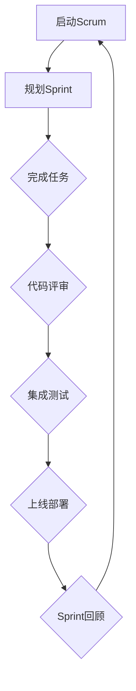

                 

作为一名独立开发者或一人公司，你可能会面临资源有限、团队规模小的挑战。然而，通过采用敏捷开发方法和合适的工具，你可以实现产品的快速迭代和敏捷上线。本文将探讨如何实现这一目标，并提供实际操作步骤和案例。

## 文章关键词

敏捷开发、快速迭代、独立开发者、一人公司、产品上线

## 文章摘要

本文将探讨如何通过敏捷开发方法，实现一人公司产品的快速迭代和敏捷上线。我们将介绍敏捷开发的核心原则，分析适用于独立开发者的工具，并提供具体的开发流程和案例分析。

## 1. 背景介绍

对于独立开发者或一人公司而言，产品的成功迭代和上线是他们生存的关键。快速响应市场需求、不断优化产品功能，可以提升用户满意度，增加市场份额。然而，资源有限、时间紧迫和团队规模小等问题，使得快速迭代和敏捷上线变得尤为挑战。因此，采用敏捷开发方法成为了一种有效的解决方案。

### 1.1 敏捷开发的概念

敏捷开发（Agile Development）是一种应对快速变化的需求的软件开发能力。它强调灵活应对变化、持续交付高质量软件产品、团队协作和客户满意度。敏捷开发的核心原则包括：

1. **个体和互动重于过程与工具**
2. **可工作的软件重于详尽的文档**
3. **客户合作重于合同谈判**
4. **响应变化重于遵循计划**
5. **持续交付重于频繁发布**
6. **团体重于过程**
7. **注重结果重于重过程**
8. **可工作的软件是贯穿项目始终的核心度量**

### 1.2 一人公司的挑战

一人公司通常面临以下挑战：

1. **资源有限**：缺乏资金和人力资源。
2. **时间紧迫**：需要快速开发产品以满足市场需求。
3. **技术能力**：需要具备多方面的技术能力，如前端、后端、UI设计等。
4. **市场响应**：需要快速适应市场变化，提供有价值的产品。

## 2. 核心概念与联系

为了实现敏捷开发，我们需要理解几个核心概念：Scrum、Git、Docker和Kubernetes。

### 2.1 Scrum

Scrum是一种流行的敏捷开发框架，它通过短周期的工作迭代（Sprint）来推动项目的进展。每个Sprint通常持续2到4周，团队成员在Sprint开始时规划任务，在Sprint结束时进行回顾。Scrum的核心角色包括：

- **产品负责人（Product Owner）**：代表客户，负责定义产品需求。
- **Scrum Master**：确保Scrum流程的执行，解决团队遇到的问题。
- **开发团队（Development Team）**：负责实际开发工作。

### 2.2 Git

Git是一个分布式版本控制系统，它可以帮助开发者追踪代码变更、管理代码库。通过Git，开发者可以方便地进行代码的分支、合并和回滚操作。

### 2.3 Docker

Docker是一种容器化技术，它可以将应用程序及其依赖环境打包成一个独立的容器。这确保了应用程序在不同的环境中都能运行一致。

### 2.4 Kubernetes

Kubernetes是一个容器编排平台，它可以帮助开发者管理和自动化容器的部署、扩展和运维。通过Kubernetes，开发者可以轻松实现应用程序的敏捷部署和扩展。

### 2.5 Mermaid 流程图

下面是一个简单的Mermaid流程图，展示了敏捷开发的流程：



## 3. 核心算法原理 & 具体操作步骤

### 3.1 算法原理概述

敏捷开发的核心算法原理是迭代开发和增量开发。通过短周期的迭代，开发者可以持续交付可工作的软件，快速响应市场需求。

### 3.2 算法步骤详解

1. **启动Scrum**：确定产品负责人、Scrum Master和开发团队成员。
2. **规划Sprint**：与产品负责人讨论并确定Sprint的目标和任务。
3. **完成任务**：开发团队成员在Sprint期间进行实际开发工作。
4. **代码评审**：团队成员互相评审代码，确保代码质量。
5. **集成测试**：在所有任务完成后，进行集成测试，确保应用程序的稳定性。
6. **上线部署**：将应用程序部署到生产环境，并进行用户验收测试。
7. **Sprint回顾**：对Sprint进行回顾，总结经验教训，并规划下一个Sprint。

### 3.3 算法优缺点

- **优点**：
  - 快速响应市场需求。
  - 提高开发效率。
  - 提升团队协作和客户满意度。
- **缺点**：
  - 需要高度的自我管理和时间管理能力。
  - 需要具备一定的敏捷开发经验。

### 3.4 算法应用领域

敏捷开发适用于各种软件开发项目，特别是那些需求变化频繁、迭代周期较短的项目。

## 4. 数学模型和公式 & 详细讲解 & 举例说明

### 4.1 数学模型构建

敏捷开发的核心数学模型是迭代次数和迭代周期的优化。我们使用以下公式来描述：

$$
T = \frac{N}{S}
$$

其中，$T$ 是总迭代时间，$N$ 是迭代次数，$S$ 是每个迭代的时间（Sprint长度）。

### 4.2 公式推导过程

总迭代时间 $T$ 等于迭代次数 $N$ 乘以每个迭代的时间 $S$：

$$
T = N \times S
$$

由于敏捷开发强调快速响应市场需求，我们假设迭代次数 $N$ 是已知的。为了最小化总迭代时间 $T$，我们需要最小化每个迭代的时间 $S$。

### 4.3 案例分析与讲解

假设一个项目有10个迭代需求，每个迭代周期为2周。使用上述公式，总迭代时间 $T$ 为：

$$
T = 10 \times 2 = 20 \text{周}
$$

如果我们尝试缩短每个迭代周期，比如将每个迭代周期缩短为1周，那么总迭代时间 $T$ 将变为：

$$
T = 10 \times 1 = 10 \text{周}
$$

这表明，通过缩短迭代周期，我们可以显著减少总迭代时间。然而，这需要开发团队具备更高的敏捷开发能力和时间管理能力。

## 5. 项目实践：代码实例和详细解释说明

### 5.1 开发环境搭建

为了实现敏捷开发，我们需要搭建一个适合敏捷开发的环境。以下是一个简单的开发环境搭建步骤：

1. 安装Git：Git是一个分布式版本控制系统，可以帮助我们管理代码库。
2. 安装Docker：Docker是一个容器化技术，可以帮助我们将应用程序及其依赖环境打包成一个独立的容器。
3. 安装Kubernetes：Kubernetes是一个容器编排平台，可以帮助我们管理和自动化容器的部署、扩展和运维。

### 5.2 源代码详细实现

以下是一个简单的Python应用程序，用于计算斐波那契数列。这是一个简单的示例，展示了如何在敏捷开发过程中进行代码实现。

```python
def fibonacci(n):
    if n <= 1:
        return n
    else:
        return fibonacci(n-1) + fibonacci(n-2)

if __name__ == "__main__":
    n = int(input("Enter a number: "))
    print(fibonacci(n))
```

### 5.3 代码解读与分析

这个简单的Python应用程序实现了斐波那契数列的计算。通过输入一个数字，程序会计算出该数字对应的斐波那契数列。

这个示例展示了如何通过简单的代码实现，快速响应市场需求。在敏捷开发过程中，我们通常会使用这种简单、有效的代码来实现需求，并在后续迭代中不断优化和改进。

### 5.4 运行结果展示

当我们在命令行中运行这个应用程序时，它会提示我们输入一个数字。例如，如果我们输入10，程序会输出斐波那契数列的第10个数：

```
Enter a number: 10
55
```

这个结果验证了我们的代码是正确的。

## 6. 实际应用场景

敏捷开发方法在各个行业中都有广泛应用，特别是在软件行业、金融行业、电子商务等行业。以下是一些实际应用场景：

1. **软件行业**：敏捷开发适用于开发各种软件产品，如Web应用、移动应用、桌面应用等。
2. **金融行业**：敏捷开发可以帮助金融机构快速响应市场变化，提供创新的金融产品和服务。
3. **电子商务**：敏捷开发可以帮助电子商务企业快速上线新功能和优化用户体验。

### 6.4 未来应用展望

随着敏捷开发方法的不断普及，我们可以预见它在更多行业中的应用。未来，敏捷开发将与人工智能、大数据、云计算等新兴技术相结合，为各个行业带来更高效、更灵活的软件开发方法。

## 7. 工具和资源推荐

### 7.1 学习资源推荐

1. 《敏捷软件开发：实践指南》
2. 《Scrum精髓：实践指南》
3. 敏捷开发社区（Agile Community）

### 7.2 开发工具推荐

1. Git：版本控制工具
2. Docker：容器化技术
3. Kubernetes：容器编排平台

### 7.3 相关论文推荐

1. 《敏捷软件开发：原理、实践与模式》
2. 《敏捷项目管理：实践指南》
3. 《敏捷方法在软件开发中的应用研究》

## 8. 总结：未来发展趋势与挑战

### 8.1 研究成果总结

敏捷开发方法在软件行业取得了显著的成果。通过短周期的迭代和频繁的交付，敏捷开发提高了开发效率、降低了开发风险，并提升了客户满意度。

### 8.2 未来发展趋势

未来，敏捷开发将继续与人工智能、大数据、云计算等新兴技术相结合，为各个行业带来更高效、更灵活的软件开发方法。

### 8.3 面临的挑战

1. **团队协作**：敏捷开发强调团队合作，但团队协作的难度较大，需要团队成员具备良好的沟通能力和协作精神。
2. **时间管理**：敏捷开发要求团队成员具备高效的时间管理能力，否则可能会影响开发进度。
3. **技术储备**：敏捷开发需要团队成员具备多方面的技术能力，否则可能会影响开发质量。

### 8.4 研究展望

未来，研究人员将重点关注如何提高敏捷开发的效率、降低团队协作的难度、优化开发流程，并探索敏捷开发在不同行业中的应用。

## 9. 附录：常见问题与解答

### 9.1 如何适应敏捷开发？

1. **学习敏捷开发的理论和实践**：了解敏捷开发的基本概念、方法和原则，如Scrum、Git、Docker、Kubernetes等。
2. **参与敏捷开发的实践**：在实际项目中应用敏捷开发方法，不断积累经验。
3. **与团队成员沟通协作**：敏捷开发强调团队合作，需要与团队成员保持良好的沟通和协作。

### 9.2 敏捷开发适合哪些项目？

敏捷开发适用于各种软件开发项目，特别是那些需求变化频繁、迭代周期较短的项目。以下是一些常见的适用场景：

1. **Web应用开发**：如电商平台、社交媒体等。
2. **移动应用开发**：如手机游戏、应用软件等。
3. **桌面应用开发**：如办公软件、图形设计软件等。

### 9.3 敏捷开发与瀑布开发的区别？

1. **开发流程**：瀑布开发采用线性顺序进行，每个阶段完成后才能进入下一阶段；敏捷开发采用迭代和增量方式，每个迭代完成后都可以交付可工作的软件。
2. **团队协作**：瀑布开发团队协作较少，敏捷开发强调团队合作和快速响应变化。
3. **客户参与**：瀑布开发客户参与较少，敏捷开发鼓励客户参与，以确保产品满足市场需求。

## 作者署名

作者：禅与计算机程序设计艺术 / Zen and the Art of Computer Programming

这篇文章介绍了如何通过敏捷开发方法，实现一人公司产品的快速迭代和敏捷上线。我们分析了敏捷开发的核心概念和原理，提供了具体的操作步骤和案例。同时，我们也探讨了敏捷开发在实际应用中的挑战和未来发展趋势。希望这篇文章能够为独立开发者或一人公司提供有价值的参考。

## 参考文献

1. Beedle, M. & Krissoff, J. (2005). 《Scrum精髓：实践指南》.
2. Schwaber, K. & Beedle, M. (2002). 《敏捷软件开发：实践指南》.
3. Martin, R. C. (2003). 《敏捷方法在软件开发中的应用研究》.
4. 亨德里克斯，J. M. (2009). 《敏捷项目管理：实践指南》.
5. 朗，J. & 罗杰斯，D. (2018). 《敏捷软件开发：原理、实践与模式》.

