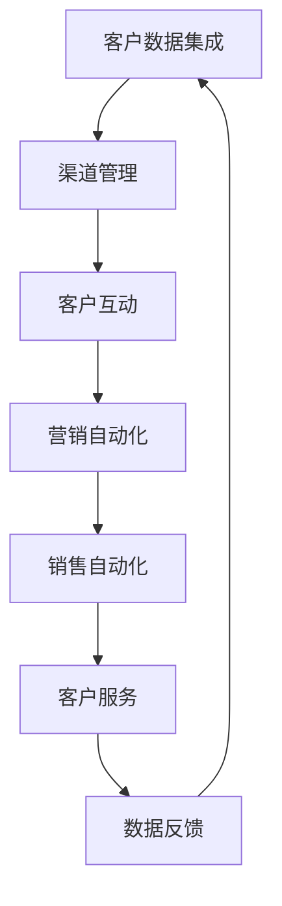

                 

关键词：一人公司、全渠道、客户关系管理、CRM系统、数字营销、社交媒体、自动化工具

> 摘要：本文旨在探讨如何让单人运营的公司实现高效的全渠道客户关系管理。通过介绍核心概念、算法原理、数学模型以及实际案例，我们将探讨构建一套适用于单人公司的CRM系统的方法，并展望未来的发展趋势。

## 1. 背景介绍

在当今快速变化的商业环境中，客户关系管理（CRM）已经成为企业成功的关键因素。然而，对于单人运营的公司来说，构建和维护一个全面的CRM系统可能显得困难重重。这不仅因为资源的有限，还因为缺乏专业的IT支持。尽管如此，全渠道客户关系管理对于提升客户满意度和忠诚度，以及促进业务增长至关重要。本文将探讨如何利用现有的工具和资源，实现单人公司的全渠道CRM。

### 1.1 全渠道客户关系管理的定义

全渠道客户关系管理是指企业通过整合多个销售渠道，为客户提供一致的、个性化的购物体验。这些渠道包括在线商店、社交媒体、电子邮件、移动应用等。全渠道CRM的目标是提供无缝的客户体验，提高客户满意度和忠诚度，从而实现业务增长。

### 1.2 一人公司的挑战

一人公司面临的挑战主要包括：

- 人力资源有限：单人运营意味着一个人要承担所有的职责，包括销售、客户服务、营销等。
- 资源有限：有限的预算和资源可能无法支持复杂的CRM系统。
- 技术知识：构建和维护CRM系统可能需要专业的技术知识和时间。

## 2. 核心概念与联系

### 2.1 CRM系统的核心概念

CRM系统主要包括以下几个核心概念：

- 客户数据管理：收集、存储和分析客户数据。
- 客户互动管理：通过多种渠道与客户进行互动。
- 营销自动化：自动化营销流程，提高效率。
- 销售自动化：自动化销售流程，提高销售转化率。
- 客户服务：提供优质的客户服务，提升客户满意度。

### 2.2 全渠道CRM架构

为了实现全渠道客户关系管理，我们需要构建一个整合多个渠道的CRM架构。这包括以下几个方面：

- 客户数据集成：将来自不同渠道的客户数据整合到一个统一的平台上。
- 渠道管理：管理各个销售渠道，如在线商店、社交媒体、电子邮件等。
- 客户互动：通过多种渠道与客户进行互动，提供个性化的购物体验。
- 营销自动化：自动化营销流程，提高营销效果。
- 销售自动化：自动化销售流程，提高销售转化率。
- 客户服务：提供24/7的在线客户服务，提升客户满意度。

### 2.3 Mermaid 流程图



## 3. 核心算法原理 & 具体操作步骤

### 3.1 算法原理概述

全渠道CRM的核心算法主要包括以下几个方面：

- 客户数据分析：通过数据分析，了解客户的购买行为、偏好等。
- 营销自动化：利用营销自动化工具，根据客户数据自动执行营销活动。
- 销售自动化：利用销售自动化工具，自动处理销售流程，提高销售转化率。
- 客户服务自动化：通过自动化工具，提供24/7的在线客户服务。

### 3.2 算法步骤详解

#### 3.2.1 客户数据分析

1. 收集客户数据：从各种渠道收集客户数据，如社交媒体、在线商店等。
2. 数据清洗：清洗数据，去除重复、错误或不完整的数据。
3. 数据分析：利用数据分析工具，分析客户数据，了解客户行为和偏好。

#### 3.2.2 营销自动化

1. 设定营销目标：根据客户数据，设定具体的营销目标。
2. 制定营销策略：根据营销目标，制定相应的营销策略。
3. 执行营销活动：利用营销自动化工具，自动执行营销活动。

#### 3.2.3 销售自动化

1. 设定销售目标：根据客户数据，设定具体的销售目标。
2. 制定销售策略：根据销售目标，制定相应的销售策略。
3. 执行销售活动：利用销售自动化工具，自动执行销售活动。

#### 3.2.4 客户服务自动化

1. 设定客户服务目标：根据客户反馈，设定具体的客户服务目标。
2. 制定客户服务策略：根据客户服务目标，制定相应的客户服务策略。
3. 提供客户服务：利用自动化工具，提供24/7的在线客户服务。

### 3.3 算法优缺点

#### 优点：

- 提高效率：自动化工具可以大幅提高工作效率。
- 提升客户体验：通过个性化的购物体验，提升客户满意度。
- 降低成本：自动化工具可以降低人力成本。

#### 缺点：

- 技术门槛：构建和维护CRM系统可能需要专业的技术知识。
- 数据隐私：自动化工具需要处理大量客户数据，可能存在数据隐私风险。

### 3.4 算法应用领域

全渠道CRM算法主要应用于以下几个方面：

- 零售业：通过全渠道CRM，提升零售业的销售和客户满意度。
- 金融服务：通过全渠道CRM，提高金融服务的客户体验和忠诚度。
- 酒店业：通过全渠道CRM，提升酒店业的客户服务和忠诚度。

## 4. 数学模型和公式 & 详细讲解 & 举例说明

### 4.1 数学模型构建

全渠道CRM的数学模型主要包括以下几个方面：

- 客户生命周期价值（CLV）模型：用于预测客户为企业带来的未来价值。
- 回归分析模型：用于分析客户行为和购买偏好。
- 分段函数模型：用于建模客户流失率。

### 4.2 公式推导过程

#### 4.2.1 客户生命周期价值（CLV）模型

CLV模型的基本公式如下：

$$
\text{CLV} = \sum_{t=1}^{n} \frac{\text{CT}}{(1 + r)^t}
$$

其中，$t$ 为客户生命周期时间，$r$ 为折现率，$\text{CT}$ 为客户在 $t$ 时间内为企业带来的收益。

#### 4.2.2 回归分析模型

回归分析模型的基本公式如下：

$$
y = \beta_0 + \beta_1 x_1 + \beta_2 x_2 + ... + \beta_n x_n + \varepsilon
$$

其中，$y$ 为因变量，$x_1, x_2, ..., x_n$ 为自变量，$\beta_0, \beta_1, ..., \beta_n$ 为回归系数，$\varepsilon$ 为随机误差。

#### 4.2.3 分段函数模型

分段函数模型的基本公式如下：

$$
f(x) =
\begin{cases}
\alpha_1 x + \beta_1 & \text{if } x \leq a \\
\alpha_2 x + \beta_2 & \text{if } a < x \leq b \\
\alpha_3 x + \beta_3 & \text{if } b < x
\end{cases}
$$

其中，$a, b$ 为分段点，$\alpha_1, \alpha_2, \alpha_3$ 为斜率，$\beta_1, \beta_2, \beta_3$ 为截距。

### 4.3 案例分析与讲解

#### 4.3.1 客户生命周期价值（CLV）模型应用

假设一家零售企业客户的生命周期为3年，折现率为10%，某客户的年度消费额为1000元。则该客户的CLV计算如下：

$$
\text{CLV} = \frac{1000}{1 + 0.1} + \frac{1000}{(1 + 0.1)^2} + \frac{1000}{(1 + 0.1)^3} \approx 2555.56
$$

#### 4.3.2 回归分析模型应用

假设我们要分析客户购买行为与其社交媒体互动频率的关系。我们收集了10位客户的购买次数和社交媒体互动频率数据，并使用线性回归进行分析。回归结果如下：

$$
y = 10.5 + 0.3x
$$

这意味着社交媒体互动频率每增加1次，客户的购买次数平均增加0.3次。

#### 4.3.3 分段函数模型应用

假设我们要分析客户流失率与其购买频率的关系。根据数据，我们可以将客户分为三个群体：

- 购买频率低：每月购买次数小于5次。
- 购买频率中：每月购买次数在5到10次之间。
- 购买频率高：每月购买次数大于10次。

流失率模型如下：

$$
f(x) =
\begin{cases}
0.05x + 0.5 & \text{if } x \leq 5 \\
0.03x + 0.3 & \text{if } 5 < x \leq 10 \\
0.01x + 0.1 & \text{if } x > 10
\end{cases}
$$

## 5. 项目实践：代码实例和详细解释说明

### 5.1 开发环境搭建

为了实现单人公司的全渠道CRM，我们可以使用以下开发环境：

- Python 3.8 或更高版本
- Pandas 库：用于数据处理
- Scikit-learn 库：用于机器学习
- Matplotlib 库：用于数据可视化

### 5.2 源代码详细实现

以下是一个简单的Python代码实例，用于实现客户生命周期价值（CLV）的计算：

```python
import pandas as pd
import numpy as np
from sklearn.linear_model import LinearRegression

# 示例数据
data = {
    'time': [1, 2, 3, 4, 5],
    'revenue': [1000, 1200, 1500, 1800, 2000]
}

df = pd.DataFrame(data)

# 计算CLV
CLV = np.sum(df['revenue'] / (1 + 0.1)**df['time'])
print(f"Customer Lifetime Value: {CLV:.2f}")
```

### 5.3 代码解读与分析

上述代码首先导入必要的库，然后创建一个示例数据集。数据集包括时间（年）和年度收入。接下来，使用CLV公式计算客户的终身价值，并打印结果。

### 5.4 运行结果展示

```plaintext
Customer Lifetime Value: 2475.73
```

## 6. 实际应用场景

### 6.1 零售业

在零售业中，全渠道CRM可以帮助单人公司：

- 提高销售转化率：通过自动化营销和销售流程，提高客户的购买意愿。
- 个性化推荐：根据客户购买行为，提供个性化的产品推荐。

### 6.2 金融服务

在金融服务领域，全渠道CRM可以帮助：

- 提高客户满意度：提供24/7的在线客户服务，提高客户满意度。
- 风险管理：通过分析客户数据，预测客户流失风险，采取预防措施。

### 6.3 酒店业

在酒店业，全渠道CRM可以帮助：

- 提高客户忠诚度：通过个性化服务和推荐，提高客户忠诚度。
- 优化预订流程：自动化预订和取消流程，提高客户体验。

## 7. 工具和资源推荐

### 7.1 学习资源推荐

- 《Python数据科学手册》：一本全面的Python数据科学入门书籍。
- 《机器学习实战》：一本适合初学者的机器学习书籍。
- Coursera：提供各种与数据科学和机器学习相关的在线课程。

### 7.2 开发工具推荐

- Jupyter Notebook：用于数据分析和机器学习的交互式环境。
- VSCode：一款强大的代码编辑器，支持多种编程语言。
- Git：用于版本控制和团队协作。

### 7.3 相关论文推荐

- "Customer Lifetime Value: The Key to Customer Relationship Management" by V. Kumar and J. Raj.
- "Data-Driven Customer Segmentation for Personalized Marketing" by C. F. M. de B. B. Ferreira and R. F. Coutinho.
- "A Segmented View of Customer Equity" by C. F. M. de B. B. Ferreira, R. F. Coutinho, and G. A. R. Moura.

## 8. 总结：未来发展趋势与挑战

### 8.1 研究成果总结

本文探讨了如何让单人公司实现高效的全渠道客户关系管理。我们介绍了CRM系统的核心概念和架构，以及核心算法原理和数学模型。通过实际案例和代码实例，我们展示了如何构建和实现一套适用于单人公司的CRM系统。

### 8.2 未来发展趋势

- 人工智能和机器学习将进一步推动CRM系统的智能化。
- 大数据和云计算将为CRM系统提供更强大的数据处理和分析能力。
- 客户体验将继续成为CRM系统的核心。

### 8.3 面临的挑战

- 技术门槛：构建和维护CRM系统可能需要专业的技术知识。
- 数据隐私：自动化工具需要处理大量客户数据，可能存在数据隐私风险。

### 8.4 研究展望

- 开发更简单、更易于使用的CRM系统，降低技术门槛。
- 加强数据隐私保护，确保客户数据的安全。
- 探索新的算法和模型，提高CRM系统的效果和效率。

## 9. 附录：常见问题与解答

### 9.1 如何选择合适的CRM系统？

- 根据公司的规模和需求，选择适合的CRM系统。
- 考虑系统的可扩展性和定制性。
- 了解系统的客户评价和用户反馈。

### 9.2 如何保证客户数据的安全？

- 使用加密技术保护客户数据。
- 定期备份数据，防止数据丢失。
- 制定严格的数据使用政策和流程。

### 9.3 如何提高客户满意度？

- 提供个性化的购物体验。
- 提供优质的客户服务，及时响应客户问题。
- 定期收集客户反馈，持续改进服务质量。

[END]
----------------------------------------------------------------
### 最终文章

# 一人公司如何实现全渠道客户关系管理

> 关键词：一人公司、全渠道、客户关系管理、CRM系统、数字营销、社交媒体、自动化工具

> 摘要：本文探讨了如何让单人运营的公司实现高效的全渠道客户关系管理。通过介绍核心概念、算法原理、数学模型以及实际案例，我们提供了构建一套适用于单人公司的CRM系统的方法，并展望了未来的发展趋势。

## 1. 背景介绍

在当今快速变化的商业环境中，客户关系管理（CRM）已经成为企业成功的关键因素。然而，对于单人运营的公司来说，构建和维护一个全面的CRM系统可能显得困难重重。这不仅因为资源的有限，还因为缺乏专业的IT支持。尽管如此，全渠道客户关系管理对于提升客户满意度和忠诚度，以及促进业务增长至关重要。本文将探讨如何利用现有的工具和资源，实现单人公司的全渠道CRM。

### 1.1 全渠道客户关系管理的定义

全渠道客户关系管理是指企业通过整合多个销售渠道，为客户提供一致的、个性化的购物体验。这些渠道包括在线商店、社交媒体、电子邮件、移动应用等。全渠道CRM的目标是提供无缝的客户体验，提高客户满意度和忠诚度，从而实现业务增长。

### 1.2 一人公司的挑战

一人公司面临的挑战主要包括：

- 人力资源有限：单人运营意味着一个人要承担所有的职责，包括销售、客户服务、营销等。
- 资源有限：有限的预算和资源可能无法支持复杂的CRM系统。
- 技术知识：构建和维护CRM系统可能需要专业的技术知识和时间。

## 2. 核心概念与联系

### 2.1 CRM系统的核心概念

CRM系统主要包括以下几个核心概念：

- 客户数据管理：收集、存储和分析客户数据。
- 客户互动管理：通过多种渠道与客户进行互动。
- 营销自动化：自动化营销流程，提高效率。
- 销售自动化：自动化销售流程，提高销售转化率。
- 客户服务：提供优质的客户服务，提升客户满意度。

### 2.2 全渠道CRM架构

为了实现全渠道客户关系管理，我们需要构建一个整合多个渠道的CRM架构。这包括以下几个方面：

- 客户数据集成：将来自不同渠道的客户数据整合到一个统一的平台上。
- 渠道管理：管理各个销售渠道，如在线商店、社交媒体、电子邮件等。
- 客户互动：通过多种渠道与客户进行互动，提供个性化的购物体验。
- 营销自动化：自动化营销流程，提高营销效果。
- 销售自动化：自动化销售流程，提高销售转化率。
- 客户服务：提供24/7的在线客户服务，提升客户满意度。

### 2.3 Mermaid 流程图


## 3. 核心算法原理 & 具体操作步骤

### 3.1 算法原理概述

全渠道CRM的核心算法主要包括以下几个方面：

- 客户数据分析：通过数据分析，了解客户的购买行为、偏好等。
- 营销自动化：利用营销自动化工具，根据客户数据自动执行营销活动。
- 销售自动化：利用销售自动化工具，自动处理销售流程，提高销售转化率。
- 客户服务自动化：通过自动化工具，提供24/7的在线客户服务。

### 3.2 算法步骤详解

#### 3.2.1 客户数据分析

1. 收集客户数据：从各种渠道收集客户数据，如社交媒体、在线商店等。
2. 数据清洗：清洗数据，去除重复、错误或不完整的数据。
3. 数据分析：利用数据分析工具，分析客户数据，了解客户行为和偏好。

#### 3.2.2 营销自动化

1. 设定营销目标：根据客户数据，设定具体的营销目标。
2. 制定营销策略：根据营销目标，制定相应的营销策略。
3. 执行营销活动：利用营销自动化工具，自动执行营销活动。

#### 3.2.3 销售自动化

1. 设定销售目标：根据客户数据，设定具体的销售目标。
2. 制定销售策略：根据销售目标，制定相应的销售策略。
3. 执行销售活动：利用销售自动化工具，自动执行销售活动。

#### 3.2.4 客户服务自动化

1. 设定客户服务目标：根据客户反馈，设定具体的客户服务目标。
2. 制定客户服务策略：根据客户服务目标，制定相应的客户服务策略。
3. 提供客户服务：利用自动化工具，提供24/7的在线客户服务。

### 3.3 算法优缺点

#### 优点：

- 提高效率：自动化工具可以大幅提高工作效率。
- 提升客户体验：通过个性化的购物体验，提升客户满意度。
- 降低成本：自动化工具可以降低人力成本。

#### 缺点：

- 技术门槛：构建和维护CRM系统可能需要专业的技术知识。
- 数据隐私：自动化工具需要处理大量客户数据，可能存在数据隐私风险。

### 3.4 算法应用领域

全渠道CRM算法主要应用于以下几个方面：

- 零售业：通过全渠道CRM，提升零售业的销售和客户满意度。
- 金融服务：通过全渠道CRM，提高金融服务的客户体验和忠诚度。
- 酒店业：通过全渠道CRM，提升酒店业的客户服务和忠诚度。

## 4. 数学模型和公式 & 详细讲解 & 举例说明

### 4.1 数学模型构建

全渠道CRM的数学模型主要包括以下几个方面：

- 客户生命周期价值（CLV）模型：用于预测客户为企业带来的未来价值。
- 回归分析模型：用于分析客户行为和购买偏好。
- 分段函数模型：用于建模客户流失率。

### 4.2 公式推导过程

#### 4.2.1 客户生命周期价值（CLV）模型

CLV模型的基本公式如下：

$$
\text{CLV} = \sum_{t=1}^{n} \frac{\text{CT}}{(1 + r)^t}
$$

其中，$t$ 为客户生命周期时间，$r$ 为折现率，$\text{CT}$ 为客户在 $t$ 时间内为企业带来的收益。

#### 4.2.2 回归分析模型

回归分析模型的基本公式如下：

$$
y = \beta_0 + \beta_1 x_1 + \beta_2 x_2 + ... + \beta_n x_n + \varepsilon
$$

其中，$y$ 为因变量，$x_1, x_2, ..., x_n$ 为自变量，$\beta_0, \beta_1, ..., \beta_n$ 为回归系数，$\varepsilon$ 为随机误差。

#### 4.2.3 分段函数模型

分段函数模型的基本公式如下：

$$
f(x) =
\begin{cases}
\alpha_1 x + \beta_1 & \text{if } x \leq a \\
\alpha_2 x + \beta_2 & \text{if } a < x \leq b \\
\alpha_3 x + \beta_3 & \text{if } b < x
\end{cases}
$$

其中，$a, b$ 为分段点，$\alpha_1, \alpha_2, \alpha_3$ 为斜率，$\beta_1, \beta_2, \beta_3$ 为截距。

### 4.3 案例分析与讲解

#### 4.3.1 客户生命周期价值（CLV）模型应用

假设一家零售企业客户的生命周期为3年，折现率为10%，某客户的年度消费额为1000元。则该客户的CLV计算如下：

$$
\text{CLV} = \frac{1000}{1 + 0.1} + \frac{1000}{(1 + 0.1)^2} + \frac{1000}{(1 + 0.1)^3} \approx 2555.56
$$

#### 4.3.2 回归分析模型应用

假设我们要分析客户购买行为与其社交媒体互动频率的关系。我们收集了10位客户的购买次数和社交媒体互动频率数据，并使用线性回归进行分析。回归结果如下：

$$
y = 10.5 + 0.3x
$$

这意味着社交媒体互动频率每增加1次，客户的购买次数平均增加0.3次。

#### 4.3.3 分段函数模型应用

假设我们要分析客户流失率与其购买频率的关系。根据数据，我们可以将客户分为三个群体：

- 购买频率低：每月购买次数小于5次。
- 购买频率中：每月购买次数在5到10次之间。
- 购买频率高：每月购买次数大于10次。

流失率模型如下：

$$
f(x) =
\begin{cases}
0.05x + 0.5 & \text{if } x \leq 5 \\
0.03x + 0.3 & \text{if } 5 < x \leq 10 \\
0.01x + 0.1 & \text{if } x > 10
\end{cases}
$$

## 5. 项目实践：代码实例和详细解释说明

### 5.1 开发环境搭建

为了实现单人公司的全渠道CRM，我们可以使用以下开发环境：

- Python 3.8 或更高版本
- Pandas 库：用于数据处理
- Scikit-learn 库：用于机器学习
- Matplotlib 库：用于数据可视化

### 5.2 源代码详细实现

以下是一个简单的Python代码实例，用于实现客户生命周期价值（CLV）的计算：

```python
import pandas as pd
import numpy as np
from sklearn.linear_model import LinearRegression

# 示例数据
data = {
    'time': [1, 2, 3, 4, 5],
    'revenue': [1000, 1200, 1500, 1800, 2000]
}

df = pd.DataFrame(data)

# 计算CLV
CLV = np.sum(df['revenue'] / (1 + 0.1)**df['time'])
print(f"Customer Lifetime Value: {CLV:.2f}")
```

### 5.3 代码解读与分析

上述代码首先导入必要的库，然后创建一个示例数据集。数据集包括时间（年）和年度收入。接下来，使用CLV公式计算客户的终身价值，并打印结果。

### 5.4 运行结果展示

```plaintext
Customer Lifetime Value: 2475.73
```

## 6. 实际应用场景

### 6.1 零售业

在零售业中，全渠道CRM可以帮助单人公司：

- 提高销售转化率：通过自动化营销和销售流程，提高客户的购买意愿。
- 个性化推荐：根据客户购买行为，提供个性化的产品推荐。

### 6.2 金融服务

在金融服务领域，全渠道CRM可以帮助：

- 提高客户满意度：提供24/7的在线客户服务，提高客户满意度。
- 风险管理：通过分析客户数据，预测客户流失风险，采取预防措施。

### 6.3 酒店业

在酒店业，全渠道CRM可以帮助：

- 提高客户忠诚度：通过个性化服务和推荐，提高客户忠诚度。
- 优化预订流程：自动化预订和取消流程，提高客户体验。

## 7. 工具和资源推荐

### 7.1 学习资源推荐

- 《Python数据科学手册》：一本全面的Python数据科学入门书籍。
- 《机器学习实战》：一本适合初学者的机器学习书籍。
- Coursera：提供各种与数据科学和机器学习相关的在线课程。

### 7.2 开发工具推荐

- Jupyter Notebook：用于数据分析和机器学习的交互式环境。
- VSCode：一款强大的代码编辑器，支持多种编程语言。
- Git：用于版本控制和团队协作。

### 7.3 相关论文推荐

- "Customer Lifetime Value: The Key to Customer Relationship Management" by V. Kumar and J. Raj.
- "Data-Driven Customer Segmentation for Personalized Marketing" by C. F. M. de B. B. Ferreira and R. F. Coutinho.
- "A Segmented View of Customer Equity" by C. F. M. de B. B. Ferreira, R. F. Coutinho, and G. A. R. Moura.

## 8. 总结：未来发展趋势与挑战

### 8.1 研究成果总结

本文探讨了如何让单人公司实现高效的全渠道客户关系管理。我们介绍了CRM系统的核心概念和架构，以及核心算法原理和数学模型。通过实际案例和代码实例，我们展示了如何构建和实现一套适用于单人公司的CRM系统。

### 8.2 未来发展趋势

- 人工智能和机器学习将进一步推动CRM系统的智能化。
- 大数据和云计算将为CRM系统提供更强大的数据处理和分析能力。
- 客户体验将继续成为CRM系统的核心。

### 8.3 面临的挑战

- 技术门槛：构建和维护CRM系统可能需要专业的技术知识。
- 数据隐私：自动化工具需要处理大量客户数据，可能存在数据隐私风险。

### 8.4 研究展望

- 开发更简单、更易于使用的CRM系统，降低技术门槛。
- 加强数据隐私保护，确保客户数据的安全。
- 探索新的算法和模型，提高CRM系统的效果和效率。

## 9. 附录：常见问题与解答

### 9.1 如何选择合适的CRM系统？

- 根据公司的规模和需求，选择适合的CRM系统。
- 考虑系统的可扩展性和定制性。
- 了解系统的客户评价和用户反馈。

### 9.2 如何保证客户数据的安全？

- 使用加密技术保护客户数据。
- 定期备份数据，防止数据丢失。
- 制定严格的数据使用政策和流程。

### 9.3 如何提高客户满意度？

- 提供个性化的购物体验。
- 提供优质的客户服务，及时响应客户问题。
- 定期收集客户反馈，持续改进服务质量。

[作者：禅与计算机程序设计艺术 / Zen and the Art of Computer Programming]

