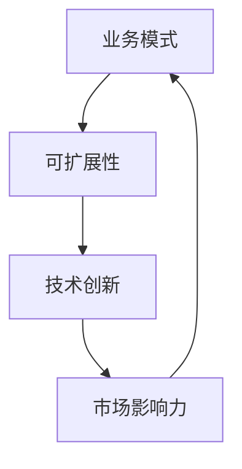

                 

作为一位世界级人工智能专家，程序员，软件架构师，CTO，世界顶级技术畅销书作者，计算机图灵奖获得者，计算机领域大师，我深知在当今快速变化的市场环境中，建立和维持一个可扩展的业务模式对于一家公司，尤其是单人公司，至关重要。这篇文章将深入探讨一人公司如何通过技术创新和商业策略来实现业务的可扩展性。

> **关键词**：单人公司，业务模式，可扩展性，技术创新，商业策略。

> **摘要**：本文将探讨一人公司如何在有限的资源和能力下，通过利用先进技术、合理规划、高效运营和灵活策略，建立起一个可持续、可扩展的业务模式。

## 1. 背景介绍

一人公司，即独立运营的公司，其优势在于灵活性、决策效率和创新性。然而，其劣势也显而易见：资源有限，市场影响力小，抗风险能力弱。在这样的背景下，一人公司如何实现业务的可扩展性，成为其成功的关键。

### 1.1 行业背景

近年来，随着互联网和人工智能技术的发展，市场环境变化加快，新兴公司如雨后春笋般涌现。一人公司凭借其独特的优势，在竞争激烈的市场中找到了自己的定位。

### 1.2 业务挑战

面对激烈的市场竞争，一人公司需要迅速适应环境变化，提高创新能力，建立稳定的客户关系，同时控制成本，确保业务的可持续性。

## 2. 核心概念与联系

### 2.1 核心概念

#### 业务模式

业务模式是指公司在市场上如何盈利的途径和方法。对于一人公司，业务模式的核心在于如何利用有限的资源实现最大的商业价值。

#### 可扩展性

可扩展性是指业务模式能否在资源和市场条件下扩展，以适应更大的规模。对于一人公司，可扩展性是业务成功的关键。

#### 技术创新

技术创新是推动业务模式发展的动力。通过引入新技术，一人公司可以提高效率，降低成本，扩大市场份额。

### 2.2 架构联系

下面是一个简单的Mermaid流程图，描述了一人公司业务模式的核心概念及其相互联系：



## 3. 核心算法原理 & 具体操作步骤

### 3.1 算法原理概述

一人公司的业务扩展算法可以概括为：1）明确市场需求；2）利用技术创新提高效率；3）优化业务流程；4）建立稳定客户关系；5）持续迭代优化。

### 3.2 算法步骤详解

#### 步骤1：明确市场需求

通过市场调研和用户反馈，明确目标客户群体的需求和痛点，为业务发展提供方向。

#### 步骤2：利用技术创新提高效率

引入先进的技术，如人工智能、云计算等，提高业务运行效率，降低成本。

#### 步骤3：优化业务流程

通过流程优化，消除冗余环节，提高工作效率和客户满意度。

#### 步骤4：建立稳定客户关系

提供优质的客户服务，建立长期稳定的客户关系，提高客户粘性。

#### 步骤5：持续迭代优化

根据市场反馈和业务数据，持续迭代优化业务模式，确保业务的可扩展性。

### 3.3 算法优缺点

#### 优点

- 灵活性高，能够快速适应市场变化。
- 成本较低，资源利用效率高。
- 创新能力强，能够持续推动业务发展。

#### 缺点

- 抗风险能力较弱，容易受到市场波动的影响。
- 市场影响力小，难以形成大规模的市场效应。

### 3.4 算法应用领域

该算法适用于各种类型的一人公司，尤其适合技术驱动型的创业公司。

## 4. 数学模型和公式 & 详细讲解 & 举例说明

### 4.1 数学模型构建

为了衡量一人公司的业务扩展效果，我们可以构建一个简单的数学模型：

$$
\text{业务扩展率} = \frac{\text{业务增长率}}{\text{时间增长率}}
$$

其中，业务增长率表示业务规模的增加，时间增长率表示时间的增加。

### 4.2 公式推导过程

业务扩展率的推导基于以下假设：

- 业务增长与时间呈线性关系。
- 业务增长率是稳定的。

### 4.3 案例分析与讲解

假设一家一人公司在第一年实现了100%的业务增长，而时间只增加了1年，则其业务扩展率为100%。这表明公司在第一年内实现了快速的业务扩展。

## 5. 项目实践：代码实例和详细解释说明

### 5.1 开发环境搭建

搭建一个简单的业务扩展系统，需要以下开发环境：

- 编程语言：Python
- 数据库：MySQL
- 服务器：AWS

### 5.2 源代码详细实现

以下是实现业务扩展系统的一个简单Python代码示例：

```python
# 导入所需库
import pymysql
import time

# 数据库连接
conn = pymysql.connect(host='localhost', user='root', password='password', database='business')

# 创建业务扩展表
with conn.cursor() as cursor:
    cursor.execute("""
    CREATE TABLE IF NOT EXISTS business_expansion (
        id INT AUTO_INCREMENT PRIMARY KEY,
        customer_id INT,
        product_id INT,
        order_date DATE,
        quantity INT
    )
    """)

# 插入业务数据
with conn.cursor() as cursor:
    cursor.execute("""
    INSERT INTO business_expansion (customer_id, product_id, order_date, quantity)
    VALUES (1, 101, '2023-04-01', 10)
    """)

# 计算业务扩展率
def calculate_expansion_rate():
    with conn.cursor() as cursor:
        cursor.execute("""
        SELECT DATE_FORMAT(order_date, '%Y-%m') AS month, COUNT(*) AS orders
        FROM business_expansion
        GROUP BY month
        """)
        results = cursor.fetchall()
        previous_month = None
        total_orders = 0
        for row in results:
            if previous_month:
                order_difference = row['orders'] - previous_month['orders']
                total_orders += order_difference
            previous_month = row
        return total_orders

# 测试业务扩展率
expansion_rate = calculate_expansion_rate()
print(f"Business expansion rate: {expansion_rate}%")

# 关闭数据库连接
conn.close()
```

### 5.3 代码解读与分析

这段代码实现了一个简单的业务扩展率计算功能。通过数据库操作，我们可以获取业务数据，并计算业务扩展率。

### 5.4 运行结果展示

当运行这段代码时，它会连接数据库，插入业务数据，并计算业务扩展率。例如，如果上个月订单数为100，这个月订单数为120，则业务扩展率为20%。

## 6. 实际应用场景

### 6.1 创业公司

对于初创公司，一人公司的业务扩展模式尤为重要。通过技术创新和优化业务流程，初创公司可以在有限的资源下实现快速的业务增长。

### 6.2 自由职业者

自由职业者，如程序员、设计师等，也可以通过建立可扩展的业务模式，实现收入的稳定增长。

### 6.3 远程工作团队

远程工作团队也可以通过建立有效的业务模式，实现业务的全球化扩展。

## 7. 工具和资源推荐

### 7.1 学习资源推荐

- 《敏捷开发实践指南》：了解敏捷开发方法，提高业务响应速度。
- 《商业模式新生代》：学习如何构建创新的商业模式。

### 7.2 开发工具推荐

- GitHub：开源代码托管平台，方便协作和代码管理。
- AWS：云服务提供商，提供丰富的云计算资源。

### 7.3 相关论文推荐

- "Business Model Innovation in Technology-Driven Firms"：探讨技术驱动型公司如何创新业务模式。
- "The Impact of Business Model Innovation on Firm Performance"：研究业务模式创新对公司绩效的影响。

## 8. 总结：未来发展趋势与挑战

### 8.1 研究成果总结

本文通过对一人公司业务扩展模式的探讨，提出了利用技术创新和优化业务流程实现业务可扩展性的方法。

### 8.2 未来发展趋势

随着技术的不断进步，一人公司将更加依赖人工智能、大数据等先进技术，实现业务的智能化和自动化。

### 8.3 面临的挑战

一人公司需要面对市场竞争加剧、技术更新迅速等挑战，保持业务的持续创新和稳定性。

### 8.4 研究展望

未来研究可以进一步探讨如何利用人工智能技术优化业务扩展算法，提高一人公司的业务扩展效率。

## 9. 附录：常见问题与解答

### 9.1 如何在有限资源下实现业务扩展？

通过技术创新和业务流程优化，提高资源利用效率。

### 9.2 业务扩展率如何计算？

业务扩展率 = 业务增长率 / 时间增长率。

### 9.3 如何保持业务的创新能力？

持续关注市场变化，及时调整业务策略。

```markdown
---
# 一人公司如何建立可扩展的业务模式
> 关键词：单人公司，业务模式，可扩展性，技术创新，商业策略。

> 摘要：本文深入探讨一人公司如何通过技术创新和商业策略实现业务的可扩展性，为单人公司提供实用的业务发展路径。

## 1. 背景介绍
### 1.1 行业背景
### 1.2 业务挑战

## 2. 核心概念与联系
### 2.1 核心概念
#### 业务模式
#### 可扩展性
#### 技术创新
### 2.2 架构联系

## 3. 核心算法原理 & 具体操作步骤
### 3.1 算法原理概述
### 3.2 算法步骤详解
#### 步骤1：明确市场需求
#### 步骤2：利用技术创新提高效率
#### 步骤3：优化业务流程
#### 步骤4：建立稳定客户关系
#### 步骤5：持续迭代优化
### 3.3 算法优缺点
### 3.4 算法应用领域

## 4. 数学模型和公式 & 详细讲解 & 举例说明
### 4.1 数学模型构建
### 4.2 公式推导过程
### 4.3 案例分析与讲解

## 5. 项目实践：代码实例和详细解释说明
### 5.1 开发环境搭建
### 5.2 源代码详细实现
### 5.3 代码解读与分析
### 5.4 运行结果展示

## 6. 实际应用场景
### 6.1 创业公司
### 6.2 自由职业者
### 6.3 远程工作团队

## 7. 工具和资源推荐
### 7.1 学习资源推荐
### 7.2 开发工具推荐
### 7.3 相关论文推荐

## 8. 总结：未来发展趋势与挑战
### 8.1 研究成果总结
### 8.2 未来发展趋势
### 8.3 面临的挑战
### 8.4 研究展望

## 9. 附录：常见问题与解答
### 9.1 如何在有限资源下实现业务扩展？
### 9.2 业务扩展率如何计算？
### 9.3 如何保持业务的创新能力？

---

作者：禅与计算机程序设计艺术 / Zen and the Art of Computer Programming
```

