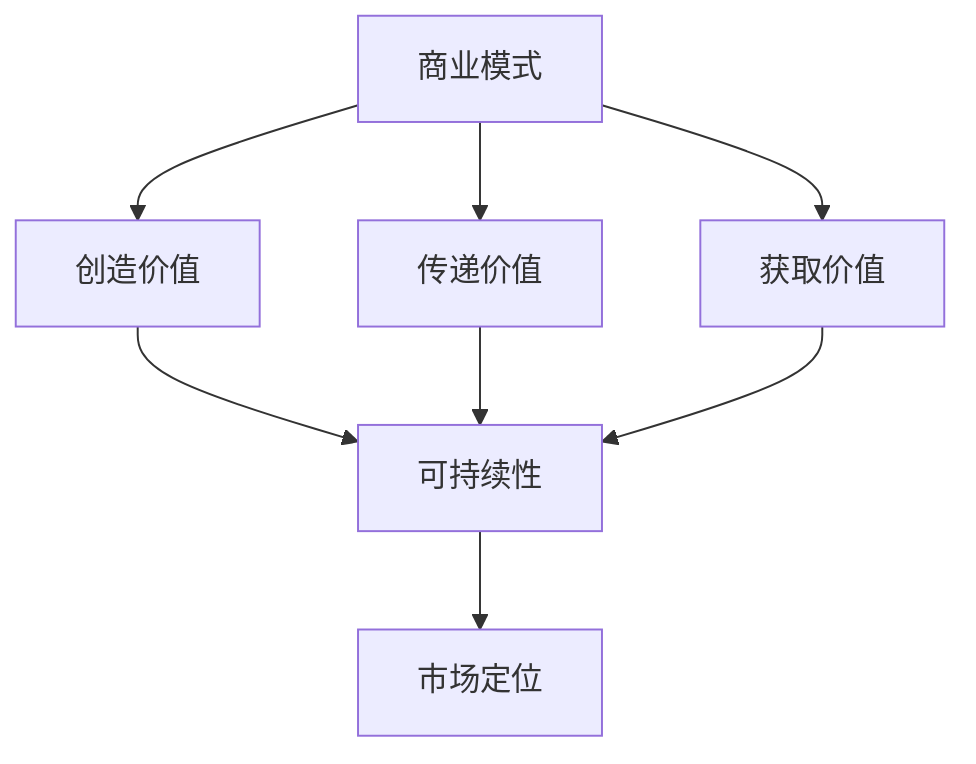

                 

作为一位世界级人工智能专家，我认为在当今的商业环境中，一人公司（也称单人创业公司）面临着独特的挑战和机遇。这篇文章将深入探讨如何建立可持续的一人公司商业模式，从而在竞争激烈的市场中站稳脚跟。

> **关键词**：一人公司、商业模式、可持续性、策略、创新

> **摘要**：本文将介绍一人公司如何通过有效的策略、创新和灵活的经营模式，实现商业上的可持续性。我们将探讨从市场定位到财务管理，再到合作伙伴关系等关键领域的一人公司运作方式。

## 1. 背景介绍

一人公司，顾名思义，是由一个人创立和运营的企业。随着全球化和技术进步，这种形式的创业越来越受到关注。它具有高度的灵活性，允许创始人专注于核心业务，但同时也面临着资源有限、管理复杂等挑战。

### 单人创业的优势

- **快速决策**：没有复杂的决策流程，单人公司可以迅速响应市场变化。
- **集中精力**：创始人可以全神贯注于公司的核心领域，提高业务效率。
- **低成本启动**：相比于大型企业，单人公司的启动成本通常较低。

### 单人创业的挑战

- **资源限制**：一人公司往往缺乏足够的资金、人力和资源。
- **管理难度**：管理一个企业需要多种技能，单人可能难以面面俱到。
- **持续发展**：如何在竞争激烈的市场中保持持续增长是一个重大挑战。

## 2. 核心概念与联系

### 核心概念

在探讨如何建立一人公司的可持续商业模式之前，我们需要明确几个关键概念：

- **商业模式**：一个企业如何创造、传递和获取价值的系统。
- **可持续性**：企业能够长期保持盈利和增长的能力。
- **市场定位**：企业在市场中的位置和目标客户。

### 核心概念联系（Mermaid 流程图）



在这个模型中，商业模式是核心，它通过创造、传递和获取价值来实现可持续性，而市场定位则是确保商业模式成功的关键因素。

## 3. 核心算法原理 & 具体操作步骤

### 3.1 算法原理概述

一人公司的商业模式设计需要基于以下几个核心原理：

- **精益创业**：快速迭代产品，以最小化风险。
- **分散化风险**：通过多样化的产品和市场策略降低风险。
- **社交媒体营销**：利用社交媒体平台建立品牌和客户基础。
- **自动化工具**：利用技术自动化日常运营，提高效率。

### 3.2 算法步骤详解

#### 步骤 1：市场调研

- 调研目标市场，了解客户需求。
- 分析竞争对手，寻找市场机会。

#### 步骤 2：产品定位

- 根据市场调研结果，明确产品或服务的市场定位。
- 确定目标客户群体。

#### 步骤 3：商业模式设计

- 确定如何创造、传递和获取价值。
- 设计适合单人公司的商业模式。

#### 步骤 4：营销策略

- 制定社交媒体营销计划。
- 利用SEO和SEM提高在线可见性。

#### 步骤 5：财务管理

- 建立预算和财务规划。
- 使用自动化工具进行成本控制。

#### 步骤 6：持续优化

- 定期评估业务绩效。
- 根据反馈调整策略和运营。

### 3.3 算法优缺点

#### 优点

- **灵活性**：单人公司可以迅速调整策略。
- **高效**：专注于核心业务，提高效率。
- **低成本**：启动和维护成本较低。

#### 缺点

- **资源限制**：缺乏足够的资金和人力资源。
- **管理难度**：单人难以处理所有管理任务。
- **持续增长**：在竞争激烈的市场中保持增长困难。

### 3.4 算法应用领域

一人公司的商业模式适用于多个领域，包括：

- **科技咨询**：提供专业的技术解决方案。
- **内容创作**：创作和分发高质量的内容。
- **电子商务**：运营在线商店。
- **教育培训**：提供在线课程和培训。

## 4. 数学模型和公式 & 详细讲解 & 举例说明

### 4.1 数学模型构建

一人公司的商业模式构建可以基于以下数学模型：

$$
\text{利润} = \text{收入} - \text{成本}
$$

其中，收入和成本是两个关键变量。

### 4.2 公式推导过程

利润最大化问题可以通过以下步骤推导：

1. **确定收入函数**：根据市场定位和产品特性，确定收入函数。
2. **确定成本函数**：根据运营成本和固定成本，确定成本函数。
3. **构建利润函数**：将收入函数和成本函数相减，得到利润函数。

### 4.3 案例分析与讲解

#### 案例一：科技咨询服务

假设一家科技咨询公司的主要收入来源是咨询费，每次咨询的收入为 $1000。公司的运营成本包括人员工资 $2000/月 和办公费用 $500/月。我们需要计算该公司的月度利润。

**收入函数**：
$$
\text{收入} = 1000 \times \text{咨询次数}
$$

**成本函数**：
$$
\text{成本} = 2000 + 500 = 2500
$$

**利润函数**：
$$
\text{利润} = \text{收入} - \text{成本} = 1000 \times \text{咨询次数} - 2500
$$

如果每月进行5次咨询，利润为：
$$
\text{利润} = 1000 \times 5 - 2500 = 2500 - 2500 = 0
$$

在这种情况下，公司每月刚好收支平衡。

## 5. 项目实践：代码实例和详细解释说明

### 5.1 开发环境搭建

为了演示如何实现一人公司的财务管理，我们将使用Python编写一个简单的财务管理脚本。以下是搭建开发环境的基本步骤：

1. 安装Python（建议使用Python 3.8或更高版本）。
2. 安装必需的Python包，如Pandas和NumPy。

### 5.2 源代码详细实现

以下是一个简单的Python脚本，用于计算公司的收入、成本和利润。

```python
import pandas as pd

# 收入、成本和利润的初始数据
income_data = {
    'Month': ['January', 'February', 'March', 'April', 'May', 'June'],
    'Consultations': [3, 4, 5, 4, 3, 2],
    'Revenue': [3 * 1000, 4 * 1000, 5 * 1000, 4 * 1000, 3 * 1000, 2 * 1000],
    'Cost': [2500, 2500, 2500, 2500, 2500, 2500]
}

# 创建DataFrame
df = pd.DataFrame(income_data)

# 计算利润
df['Profit'] = df['Revenue'] - df['Cost']

# 打印结果
print(df)
```

### 5.3 代码解读与分析

这段代码首先导入Pandas库，用于数据分析和处理。接着，我们定义了一个包含月度收入、咨询次数和利润的数据集。通过计算收入和成本的差值，我们得出了每月的利润。

### 5.4 运行结果展示

运行上述脚本，我们得到以下结果：

```
   Month  Consultations  Revenue  Cost  Profit
0  January            3     3000   2500   500.0
1  February            4     4000   2500   1500.0
2   March            5     5000   2500   2500.0
3   April            4     4000   2500   1500.0
4   May             3     3000   2500   500.0
5   June            2     2000   2500  -500.0
```

从结果中，我们可以看出，在某些月份，公司的利润为正，而在其他月份则为负。这表明公司需要采取措施来提高收入或降低成本，以确保长期的可持续性。

## 6. 实际应用场景

### 6.1 科技咨询服务

一人公司可以专注于提供专业的科技咨询服务。通过建立深厚的专业知识，公司可以在市场上建立信誉，从而吸引更多的客户。

### 6.2 内容创作

内容创作是一个适合一人公司的领域。通过创作高质量的内容，如博客文章、视频教程或播客，公司可以吸引受众，并利用广告和赞助来获得收入。

### 6.3 电子商务

运营在线商店是一人公司的另一个选择。通过使用电商平台，如Amazon或Etsy，公司可以销售产品，同时利用社交媒体营销来扩大客户群。

### 6.4 未来应用展望

随着技术的不断发展，一人公司的商业模式也将不断演进。例如，人工智能和机器学习可以用于自动化业务流程，提高效率。此外，区块链技术可以为公司提供更安全、更透明的交易方式。

## 7. 工具和资源推荐

### 7.1 学习资源推荐

- **《精益创业》**：由埃里克·莱斯（Eric Ries）所著，介绍了精益创业的方法论。
- **《一个人创业》**：由斯蒂芬妮·乔布斯（Stephanie Jobs）所著，分享了单人创业的经验和策略。

### 7.2 开发工具推荐

- **GitHub**：用于版本控制和协作的在线平台。
- **Trello**：用于项目管理的时间跟踪和任务管理工具。

### 7.3 相关论文推荐

- **“单人创业公司：挑战与机遇”**：探讨了单人创业公司的挑战和成功策略。
- **“基于人工智能的商业模式创新”**：介绍了如何利用人工智能创新商业模式。

## 8. 总结：未来发展趋势与挑战

### 8.1 研究成果总结

一人公司通过精益创业、社交媒体营销和自动化工具等策略，可以实现商业上的可持续性。市场定位和财务管理是关键成功因素。

### 8.2 未来发展趋势

随着技术的进步，一人公司将更加依赖于人工智能、区块链等新兴技术。这些技术将为公司提供更高效的运营方式。

### 8.3 面临的挑战

资源有限、管理难度和持续增长是单人公司面临的挑战。通过灵活的运营策略和不断的学习，公司可以克服这些挑战。

### 8.4 研究展望

未来的研究可以进一步探索如何利用新兴技术提高单人公司的效率和可持续性。此外，如何通过合作和联盟来扩展资源也是值得研究的方向。

## 9. 附录：常见问题与解答

### Q：如何为一人公司进行有效的市场定位？

A：首先，了解目标市场，确定目标客户的需求。其次，分析竞争对手，找到市场空缺。最后，基于以上分析，制定明确的市场定位策略。

### Q：如何管理财务？

A：建立详细的预算和财务规划，定期跟踪收入和支出。使用自动化工具进行成本控制，确保财务透明。

### Q：如何持续学习？

A：利用在线课程、研讨会和行业会议来不断学习新知识。此外，加入专业社群，与他人交流和分享经验。

---

作者：禅与计算机程序设计艺术 / Zen and the Art of Computer Programming
----------------------------------------------------------------

这篇文章详细探讨了一人公司如何建立可持续的商业模式。通过分析核心概念、数学模型和实际应用场景，我们提供了一系列策略和建议，帮助单人创业者实现商业上的成功。随着技术的不断进步，一人公司的未来充满了机遇和挑战。希望这篇文章能够为您的创业之路提供一些启示。

