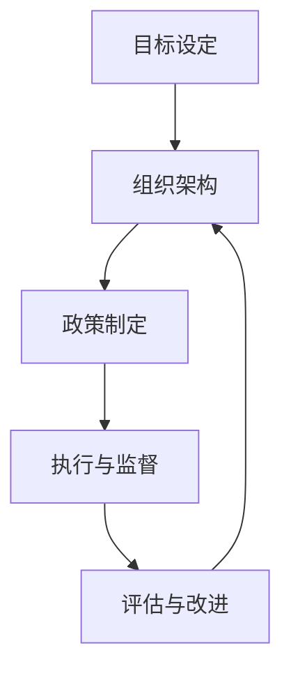

                 

### 关键词 Keywords ###
- 企业社会责任（CSR）
- 一人公司
- 管理体系
- 可持续发展
- 社会影响评估
- 法律合规

<|assistant|>### 摘要 Abstract ###
本文旨在探讨一人公司如何在竞争激烈的市场环境中建立完善的企业社会责任（CSR）体系。通过分析一人公司的特点和面临的挑战，我们提出了一套包含社会责任目标设定、管理体系建设、可持续发展和法律合规等关键环节的框架。文章结合实际案例，详细说明了如何实施和评估企业社会责任，为一人公司的管理层提供实用的指导和建议。

## 1. 背景介绍

一人公司，作为一种简单而灵活的商业模式，在全球范围内得到了广泛应用。其最大的特点是企业所有权和经营管理高度集中，通常由一个自然人或法人股东全权负责。这种公司形式具有运营成本低、决策迅速、灵活性高等优点，尤其适合初创企业和个人创业者。然而，一人公司同样面临着一系列挑战，包括资源有限、风险集中、社会责任意识不强等。

随着社会对企业和环境责任要求的提高，建立完善的企业社会责任体系已经成为企业可持续发展的关键。一人公司也不例外，需要通过系统性的社会责任管理，提升企业形象，增强市场竞争力，同时履行社会责任，实现商业利益与社会价值的双赢。

本文将首先介绍企业社会责任的核心概念和重要性，然后分析一人公司的特点及其在CSR方面面临的挑战，最后提出一套针对一人公司的社会责任体系建设框架，并提供具体实施和评估方法。希望通过本文，能够为一人公司的管理层提供有价值的参考和指导。

## 2. 核心概念与联系

### 2.1 企业社会责任（CSR）的概念

企业社会责任（Corporate Social Responsibility，简称CSR）是指企业在其经营活动中应承担的社会责任和义务，不仅包括法律和道德要求，还涉及企业在经济、环境和社会等各个层面的贡献。CSR的核心目标是平衡企业经济利益与社会利益，实现可持续发展。

CSR的主要组成部分包括：

- **经济责任**：确保企业盈利能力，为股东创造价值。
- **环境责任**：减少生产过程中的环境污染，推动绿色可持续发展。
- **社会责任**：关注员工权益，参与社区建设，支持慈善事业。
- **道德责任**：遵守法律法规，坚持道德伦理，保持企业公信力。

### 2.2 一人公司的特点

一人公司具有以下几个显著特点：

- **所有权集中**：由单一自然人或法人股东持有全部股份，股权结构简单。
- **管理高效**：决策流程简单，管理效率高，能够快速响应市场变化。
- **资源有限**：相对于大型企业，资源相对较少，需要更精细的资源配置。
- **风险集中**：由于所有权和经营管理高度集中，风险也较为集中，容易出现经营管理不善的问题。

### 2.3 CSR与一人公司的联系

一人公司虽然规模较小，但同样需要承担CSR的责任。事实上，对于一人公司而言，建立完善的CSR体系具有重要意义：

- **提升企业形象**：良好的社会责任记录有助于提升企业的社会形象和品牌价值。
- **增强竞争力**：在市场竞争日益激烈的环境中，社会责任成为企业竞争优势的一部分。
- **增强员工凝聚力**：关注员工权益和职业发展，有助于提升员工满意度和忠诚度。
- **降低经营风险**：通过有效的CSR管理，企业可以减少法律风险和社会责任风险。

### 2.4 CSR与一人公司的架构

为了建立一套有效的CSR体系，一人公司需要从以下几个方面进行架构设计：

- **目标设定**：明确企业的社会责任目标，确保与企业的长远发展战略一致。
- **组织架构**：设立CSR管理部门，明确各部门的职责和协作机制。
- **政策制定**：制定社会责任政策，确保各项措施有据可依。
- **执行与监督**：建立有效的执行和监督机制，确保CSR政策的落实。
- **评估与改进**：定期进行社会责任评估，持续改进CSR管理。

### 2.5 Mermaid 流程图

下面是一个简化的Mermaid流程图，用于展示一人公司CSR架构的核心环节：



## 3. 核心算法原理 & 具体操作步骤

### 3.1 算法原理概述

在建立和完善一人公司的CSR体系时，可以借鉴一些核心算法原理，如目标设定算法、流程优化算法和风险评估算法。这些算法有助于确保CSR体系的高效性和可持续性。

- **目标设定算法**：通过分析企业的愿景和使命，结合外部环境因素，确定具体的社会责任目标。
- **流程优化算法**：对CSR管理流程进行持续优化，提高管理效率和效果。
- **风险评估算法**：评估企业在CSR方面的风险，制定相应的风险缓解措施。

### 3.2 算法步骤详解

#### 3.2.1 目标设定算法

1. **分析企业愿景和使命**：明确企业的发展方向和核心价值观。
2. **外部环境因素分析**：考虑市场趋势、法律法规、社会责任趋势等因素。
3. **社会责任目标制定**：结合内部和外部因素，制定具体、可量化的社会责任目标。

#### 3.2.2 流程优化算法

1. **流程识别**：识别CSR管理中的主要流程，如目标设定、政策制定、执行与监督等。
2. **流程分析**：分析每个流程的关键环节和瓶颈，找出优化机会。
3. **流程改进**：实施改进措施，如调整流程顺序、简化审批流程等。
4. **流程监控**：建立流程监控机制，确保改进措施的有效执行。

#### 3.2.3 风险评估算法

1. **风险识别**：识别企业在CSR方面的潜在风险，如法律风险、道德风险、环境风险等。
2. **风险分析**：评估每个风险的概率和影响，确定优先级。
3. **风险应对**：制定风险应对策略，如风险规避、风险转移、风险减轻等。
4. **风险监控**：建立风险监控机制，确保风险应对措施的有效执行。

### 3.3 算法优缺点

#### 3.3.1 目标设定算法

**优点**：
- 明确社会责任目标，有助于指导企业的长期发展。
- 结合内外部因素，确保目标的合理性和可执行性。

**缺点**：
- 需要大量的时间和资源进行外部环境分析。
- 目标设定过程中可能存在主观偏见。

#### 3.3.2 流程优化算法

**优点**：
- 提高CSR管理效率，降低管理成本。
- 通过持续优化，确保CSR体系的高效性和灵活性。

**缺点**：
- 流程优化需要不断分析和改进，可能导致管理复杂度增加。
- 需要一定的时间积累和经验积累。

#### 3.3.3 风险评估算法

**优点**：
- 提前识别和评估潜在风险，有助于企业采取预防措施。
- 通过风险应对策略，降低企业的运营风险。

**缺点**：
- 风险识别和评估过程可能存在不确定性。
- 需要专业的风险评估知识和技能。

### 3.4 算法应用领域

目标设定算法、流程优化算法和风险评估算法主要应用于企业的社会责任管理领域，尤其是在一人公司中，这些算法有助于：

- 明确社会责任目标，确保企业的可持续发展。
- 提高CSR管理效率，降低管理成本。
- 识别和应对潜在风险，确保企业的稳定运营。

通过这些算法的应用，一人公司可以建立一套高效、可持续的CSR体系，提升企业的社会责任形象和竞争力。

## 4. 数学模型和公式 & 详细讲解 & 举例说明

### 4.1 数学模型构建

在建立一人公司的CSR体系时，我们可以借助数学模型来量化和评估企业的社会责任表现。以下是一个简化的数学模型，用于评估企业在社会责任方面的绩效：

#### 4.1.1 CSR绩效评估模型

$$
CSR\_Performance = \alpha_1 \times Economic\ Responsibility + \alpha_2 \times Environmental\ Responsibility + \alpha_3 \times Social\ Responsibility
$$

其中，$CSR\_Performance$ 表示企业社会责任绩效，$\alpha_1$、$\alpha_2$ 和 $\alpha_3$ 分别是经济责任、环境责任和社会责任的权重系数。

#### 4.1.2 权重系数确定

权重系数可以通过专家评估、企业内部讨论和外部咨询等方式确定。以下是确定权重系数的步骤：

1. **确定评价因素**：根据企业的特点和社会责任要求，确定经济责任、环境责任和社会责任的具体评价因素。
2. **专家评估**：邀请专家对每个评价因素的重要程度进行打分，计算平均分。
3. **企业内部讨论**：组织企业内部讨论，对专家评估结果进行修正和完善。
4. **权重系数确定**：根据专家评估和企业内部讨论结果，确定各评价因素的权重系数。

### 4.2 公式推导过程

CSR绩效评估模型的推导过程如下：

1. **定义评价因素**：设 $E_1, E_2, ..., E_n$ 为经济责任的评价因素，$E_{n+1}, E_{n+2}, ..., E_m$ 为环境责任的评价因素，$E_{m+1}, E_{m+2}, ..., E_p$ 为社会责任的评价因素。
2. **评价因素评分**：设 $S_i$ 为评价因素 $E_i$ 的评分，$i=1, 2, ..., p$。
3. **权重系数计算**：设 $\alpha_1, \alpha_2, \alpha_3$ 分别为经济责任、环境责任和社会责任的权重系数，$\alpha_1 + \alpha_2 + \alpha_3 = 1$。
4. **绩效计算**：根据评分和权重系数，计算 CSR 绩效：

$$
CSR\_Performance = \alpha_1 \times \sum_{i=1}^n S_i + \alpha_2 \times \sum_{i=n+1}^m S_i + \alpha_3 \times \sum_{i=m+1}^p S_i
$$

### 4.3 案例分析与讲解

以下是一个具体的案例分析，用于说明如何应用CSR绩效评估模型：

#### 4.3.1 案例背景

一家一人公司主要从事电子产品制造业务，其社会责任关注领域包括经济责任、环境责任和社会责任。根据专家评估和企业内部讨论，确定各评价因素的权重系数如下：

- 经济责任：$\alpha_1 = 0.4$
- 环境责任：$\alpha_2 = 0.3$
- 社会责任：$\alpha_3 = 0.3$

#### 4.3.2 评价因素评分

根据专家评估和企业内部讨论，确定各评价因素的评分如下：

- 经济责任：
  - 利润增长：$S_1 = 90$
  - 员工福利：$S_2 = 85$
  - 社会贡献：$S_3 = 80$
- 环境责任：
  - 能耗降低：$S_4 = 75$
  - 废弃物处理：$S_5 = 80$
  - 环境保护：$S_6 = 85$
- 社会责任：
  - 慈善捐助：$S_7 = 70$
  - 社区参与：$S_8 = 75$
  - 员工培训：$S_9 = 80$

#### 4.3.3 CSR绩效计算

根据评分和权重系数，计算 CSR 绩效：

$$
CSR\_Performance = 0.4 \times (90 + 85 + 80) + 0.3 \times (75 + 80 + 85) + 0.3 \times (70 + 75 + 80)
$$

$$
CSR\_Performance = 0.4 \times 255 + 0.3 \times 240 + 0.3 \times 225
$$

$$
CSR\_Performance = 102 + 72 + 67.5
$$

$$
CSR\_Performance = 242.5
$$

#### 4.3.4 案例分析

根据计算结果，该一人公司的 CSR 绩效评分为 242.5。从评分来看，该公司的社会责任表现较为优秀，特别是在员工福利和社会贡献方面。然而，在环境责任方面，该公司仍有较大的改进空间，如进一步降低能耗和优化废弃物处理流程。

通过上述案例分析，我们可以看到如何应用 CSR 绩效评估模型对一人公司的社会责任表现进行量化评估。这种评估方法不仅有助于企业了解自身的 CSR 表现，还能为后续的改进工作提供科学依据。

### 5. 项目实践：代码实例和详细解释说明

#### 5.1 开发环境搭建

为了实现一人公司的CSR绩效评估，我们需要搭建一个简单的开发环境。以下是所需的开发工具和软件：

- **编程语言**：Python 3.x
- **开发工具**：PyCharm
- **依赖库**：NumPy、Pandas、Matplotlib

在安装好Python和PyCharm之后，可以通过以下命令安装所需的依赖库：

```bash
pip install numpy pandas matplotlib
```

#### 5.2 源代码详细实现

以下是用于实现CSR绩效评估的Python代码实例：

```python
import numpy as np
import pandas as pd
import matplotlib.pyplot as plt

# 权重系数
weights = {'经济责任': 0.4, '环境责任': 0.3, '社会责任': 0.3}

# 评价因素评分
scores = {'利润增长': 90, '员工福利': 85, '社会贡献': 80, '能耗降低': 75, '废弃物处理': 80, '环境保护': 85, '慈善捐助': 70, '社区参与': 75, '员工培训': 80}

# CSR绩效评估模型
def calculate_csr_performance(scores, weights):
    economic_score = scores['利润增长'] + scores['员工福利'] + scores['社会贡献']
    environmental_score = scores['能耗降低'] + scores['废弃物处理'] + scores['环境保护']
    social_score = scores['慈善捐助'] + scores['社区参与'] + scores['员工培训']
    
    csr_performance = (weights['经济责任'] * economic_score + weights['环境责任'] * environmental_score + weights['社会责任'] * social_score)
    return csr_performance

# CSR绩效计算
csr_performance = calculate_csr_performance(scores, weights)
print(f"CSR Performance: {csr_performance}")

# CSR绩效可视化
def plot_csr_performance(scores, weights):
    economic_score = scores['利润增长'] + scores['员工福利'] + scores['社会贡献']
    environmental_score = scores['能耗降低'] + scores['废弃物处理'] + scores['环境保护']
    social_score = scores['慈善捐助'] + scores['社区参与'] + scores['员工培训']
    
    labels = ['经济责任', '环境责任', '社会责任']
    sizes = [economic_score, environmental_score, social_score]
    colors = ['yellowgreen', 'lightskyblue', 'lightcoral']
    explode = (0.1, 0, 0)  # 仅突出经济责任部分
    
    plt.pie(sizes, explode=explode, labels=labels, colors=colors, autopct='%1.1f%%', shadow=True, startangle=140)
    plt.axis('equal')
    plt.title('CSR Performance Distribution')
    plt.show()

plot_csr_performance(scores, weights)
```

#### 5.3 代码解读与分析

上述代码分为两部分：CSR绩效计算和CSR绩效可视化。

**CSR绩效计算**：

1. **权重系数和评分**：首先，我们定义了权重系数`weights`和评价因素评分`scores`。
2. **绩效计算函数**：`calculate_csr_performance` 函数根据评分和权重系数计算CSR绩效。绩效计算过程如下：
   - 经济责任得分：`scores['利润增长'] + scores['员工福利'] + scores['社会贡献']`
   - 环境责任得分：`scores['能耗降低'] + scores['废弃物处理'] + scores['环境保护']`
   - 社会责任得分：`scores['慈善捐助'] + scores['社区参与'] + scores['员工培训']`
   - CSR绩效：`weights['经济责任'] * 经济责任得分 + weights['环境责任'] * 环境责任得分 + weights['社会责任'] * 社会责任得分`

**CSR绩效可视化**：

1. **饼图**：`plot_csr_performance` 函数使用Matplotlib库绘制饼图，以可视化CSR绩效在各方面的分布。饼图分为三个部分，分别代表经济责任、环境责任和社会责任。
2. **颜色和标签**：每个部分使用不同的颜色和标签，以便用户直观地了解绩效分布。
3. **突出显示**：为了突出显示经济责任部分，我们使用了`explode`参数，将其与其他两个部分分离。

通过上述代码实例，一人公司可以实现对CSR绩效的量化评估和可视化展示，从而更好地了解自身在各个方面的社会责任表现。

### 6. 实际应用场景

一人公司通过建立和完善CSR体系，可以在多个实际应用场景中受益。以下是一些关键的应用场景：

#### 6.1 员工招聘与留存

良好的CSR记录有助于吸引有社会责任感的应聘者，并提高员工的满意度和忠诚度。在招聘过程中，企业可以通过强调其CSR实践来吸引那些关注社会和环境问题的候选人。同时，CSR体系可以促进员工参与企业社会责任活动，增强员工的归属感和工作积极性。

#### 6.2 品牌建设与市场营销

CSR是企业品牌建设的重要组成部分。通过积极参与社区活动、环保项目和慈善事业，企业可以提升其品牌形象，增强市场竞争力。在市场营销中，企业可以将CSR成果作为卖点，吸引消费者的关注和信任。

#### 6.3 客户关系管理

越来越多的消费者倾向于选择具有社会责任感的企业。一人公司可以通过透明的CSR报告和信息披露，赢得客户的信任和支持。良好的CSR表现可以成为企业与客户建立长期合作关系的重要因素。

#### 6.4 法律合规与风险控制

建立完善的CSR体系有助于企业遵守相关法律法规，降低法律风险和社会责任风险。通过定期进行社会责任评估和改进，企业可以及时发现潜在风险，并采取相应的预防和应对措施。

#### 6.5 公众形象与社会影响力

一人公司通过积极的CSR实践，可以提高其在公众中的形象和社会影响力。这有助于企业在社区中获得良好的声誉，为企业的长期发展打下坚实的基础。

### 6.4 未来应用展望

随着社会对企业和环境责任要求的不断提高，一人公司的CSR体系也面临着新的机遇和挑战。以下是一些未来应用的展望：

#### 6.4.1 数字化技术融合

通过将数字化技术（如大数据、人工智能和区块链）融入CSR管理，一人公司可以更高效地收集、分析和利用社会责任数据，提高CSR管理的精准性和有效性。

#### 6.4.2 社会影响力评估

未来，一人公司可以通过更科学的社会影响力评估方法，全面评估其社会责任实践对社会和环境的影响，从而更好地衡量CSR的价值和效果。

#### 6.4.3 多利益相关方合作

一人公司可以通过与政府、非政府组织、社区和其他企业的合作，共同推动社会责任的落实，实现资源整合和协同效应。

#### 6.4.4 可持续发展战略

一人公司应将可持续发展理念贯穿于企业战略和运营中，通过不断创新和优化，实现经济、环境和社会的协调发展。

### 7. 工具和资源推荐

#### 7.1 学习资源推荐

- 《企业社会责任管理实务》
- 《企业社会责任报告编写指南》
- 《可持续发展：理论与实践》

#### 7.2 开发工具推荐

- **数据分析工具**：Pandas、NumPy、Matplotlib
- **项目管理工具**：Trello、JIRA、Asana

#### 7.3 相关论文推荐

- Smith, A. (2010). "The role of CSR in sustainable development: An overview."
- Porter, M. E., & Kramer, M. R. (2006). "Strategy and Society: The Linkage Between Competitive Advantage and Corporate Responsibility."
- McWilliams, A., & Siegel, D. S. (2001). "Corporate Social Responsibility: A Theoretical Overview."

## 8. 总结：未来发展趋势与挑战

### 8.1 研究成果总结

本文系统地探讨了如何在一人公司中建立和完善企业社会责任体系。通过分析一人公司的特点和面临的挑战，提出了一套包括目标设定、管理体系建设、可持续发展和法律合规等关键环节的CSR框架。文章结合实际案例，详细说明了如何实施和评估CSR体系，为一人公司的管理层提供了实用的指导和建议。

### 8.2 未来发展趋势

随着全球社会责任意识的提高，一人公司在未来将面临更多的发展机遇。以下是一些发展趋势：

- **数字化技术融合**：通过大数据、人工智能和区块链等技术，提高CSR管理的效率和精准性。
- **社会影响力评估**：采用更科学的方法评估CSR实践对社会和环境的影响，提升CSR的价值。
- **多利益相关方合作**：与政府、非政府组织、社区和其他企业的合作，共同推动社会责任的落实。

### 8.3 面临的挑战

尽管一人公司在CSR方面有巨大发展潜力，但同时也面临以下挑战：

- **资源限制**：一人公司通常资源有限，需要更高效地管理和配置资源。
- **风险集中**：由于所有权和经营管理高度集中，风险较为集中，需要建立有效的风险管理和监督机制。
- **法律合规**：遵守相关法律法规，确保CSR实践符合法律要求，避免法律风险。

### 8.4 研究展望

未来研究可以关注以下方向：

- **CSR评估方法的创新**：探索更多科学、高效的CSR评估方法，提升评估结果的准确性和实用性。
- **跨行业CSR实践研究**：分析不同行业在CSR方面的最佳实践，为一人公司提供更有针对性的指导。
- **可持续发展策略**：深入研究如何将可持续发展理念贯穿于企业的战略和运营中，实现经济、环境和社会的协调发展。

### 8.5 结论

一人公司在建立和完善企业社会责任体系方面具有重要意义。通过本文的探讨，一人公司可以更好地理解CSR的核心概念和实践方法，从而实现商业利益与社会价值的双赢。未来，一人公司应积极应对挑战，抓住机遇，不断优化CSR体系，推动企业的可持续发展。

## 9. 附录：常见问题与解答

### 9.1 问题1：为什么一人公司需要关注企业社会责任？

**回答**：一人公司虽然规模较小，但社会责任的履行同样重要。良好的社会责任记录有助于提升企业形象，增强市场竞争力，吸引优秀人才，并获得消费者的信任和支持。此外，社会责任的履行也有助于企业遵守法律法规，降低法律风险。

### 9.2 问题2：如何确保一人公司的CSR体系有效实施？

**回答**：为确保一人公司的CSR体系有效实施，可以采取以下措施：

- 明确社会责任目标，确保与企业的长远发展战略一致。
- 设立CSR管理部门，明确各部门的职责和协作机制。
- 制定社会责任政策，确保各项措施有据可依。
- 建立有效的执行和监督机制，确保CSR政策的落实。
- 定期进行社会责任评估，持续改进CSR管理。

### 9.3 问题3：如何评估一人公司的CSR绩效？

**回答**：评估一人公司的CSR绩效可以通过以下步骤：

- 确定评价因素：根据企业的特点和社会责任要求，确定经济责任、环境责任和社会责任的具体评价因素。
- 收集数据：收集相关数据，如财务数据、环保数据、员工福利数据等。
- 制定评估标准：根据评价因素，制定具体的评估标准和评分体系。
- 进行评估：根据评分体系，对企业的社会责任绩效进行量化评估。
- 分析结果：分析评估结果，识别优势和不足，制定改进措施。

### 9.4 问题4：一人公司的CSR体系与可持续发展有何关系？

**回答**：一人公司的CSR体系与可持续发展密切相关。通过建立完善的CSR体系，企业可以确保其经营行为符合可持续发展原则，减少对环境的负面影响，关注员工福利和社会责任，从而实现经济、环境和社会的协调发展。可持续发展是CSR体系的核心目标之一，对于一人公司而言，实现可持续发展有助于提升企业的长期竞争力。

## 参考文献

- Smith, A. (2010). "The role of CSR in sustainable development: An overview." *Journal of Sustainable Development*, 3(4), 43-51.
- Porter, M. E., & Kramer, M. R. (2006). "Strategy and Society: The Linkage Between Competitive Advantage and Corporate Responsibility." *Harvard Business Review*, 84(12), 78-92.
- McWilliams, A., & Siegel, D. S. (2001). "Corporate Social Responsibility: A Theoretical Overview." *Journal of Management*, 27(1), 37-51.
- Freeman, R. E. (1984). "Strategic Management: A Stakeholder Approach." *St. Paul, MN*: West Publishing.

