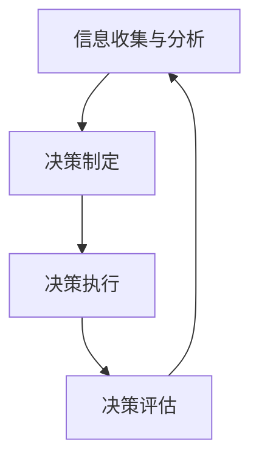

                 

关键词：一人公司、决策机制、独立创业、管理框架、企业家思维、资源配置、风险控制、组织效率

> 摘要：本文旨在探讨一人公司如何通过科学合理的决策机制，实现高效的经营管理。文章首先概述了一人公司的背景和特点，随后深入分析了决策机制的重要性。接着，本文将详细阐述一人公司构建决策机制的方法，并探讨相关理论和实践应用。最后，文章总结了未来一人公司在决策机制建设方面的发展趋势与挑战。

## 1. 背景介绍

### 1.1 一人公司的定义与特点

一人公司，顾名思义，是指由一个人独自创立和运营的公司。这种公司形式在近年来的创业浪潮中逐渐崭露头角。一人公司具有以下几个显著特点：

- **独立性**：一人公司完全由创始人一手打造，管理决策高度集中，能够迅速响应市场变化。
- **灵活性**：一人公司结构简单，决策流程短，便于调整业务策略，适应市场需求。
- **风险集中**：由于公司资产和风险完全由个人承担，创始人需要具备较强的风险控制能力。

### 1.2 一人公司的兴起原因

一人公司的兴起与以下几个因素密切相关：

- **经济环境**：全球化、互联网的发展降低了创业的门槛，为一人公司提供了广阔的市场空间。
- **政策支持**：许多国家为了鼓励创业，推出了一系列优惠政策，为一人公司提供了有利的外部环境。
- **个人追求**：许多创业者希望通过一人公司实现个人梦想和事业价值。

## 2. 核心概念与联系

### 2.1 决策机制的定义

决策机制是指企业在经营过程中，为了达成特定目标而采用的一系列决策方法和程序。决策机制的核心在于科学性、合理性和高效性。

### 2.2 决策机制与一人公司的关系

决策机制对于一人公司至关重要。一人公司的独立性使得决策高度集中，但同时也带来了决策风险。有效的决策机制能够帮助一人公司降低风险，提高经营效率。

### 2.3 决策机制的架构

决策机制的架构通常包括以下几个部分：

- **信息收集与分析**：通过数据收集和分析，为决策提供依据。
- **决策制定**：根据分析结果，制定具体的经营策略。
- **决策执行**：将决策付诸实践，确保策略的有效执行。
- **决策评估**：对决策效果进行评估，为后续决策提供反馈。

### 2.4 Mermaid 流程图

下面是一个简单的 Mermaid 流程图，展示了决策机制的基本架构：



## 3. 核心算法原理 & 具体操作步骤

### 3.1 算法原理概述

决策机制的核心在于科学性和合理性。以下是一人公司构建决策机制的基本原理：

- **数据驱动**：基于数据分析，确保决策的客观性和科学性。
- **目标导向**：以企业目标为导向，确保决策的有效性。
- **风险评估**：对决策可能带来的风险进行评估，降低决策失误的可能性。

### 3.2 算法步骤详解

一人公司构建决策机制通常包括以下步骤：

1. **明确目标**：首先，要明确企业的发展目标，这是决策的基础。
2. **数据收集**：收集与决策相关的各种数据，包括市场数据、财务数据等。
3. **数据分析**：对收集到的数据进行分析，识别关键因素。
4. **制定策略**：根据分析结果，制定具体的经营策略。
5. **风险评估**：对策略进行风险评估，识别潜在风险。
6. **决策执行**：将决策付诸实践，确保策略的有效执行。
7. **评估效果**：对决策效果进行评估，为后续决策提供反馈。

### 3.3 算法优缺点

**优点**：

- **高效性**：决策流程短，能够迅速响应市场变化。
- **灵活性**：决策机制灵活，便于调整经营策略。
- **集中性**：决策高度集中，便于实施和监督。

**缺点**：

- **风险集中**：由于决策高度集中，可能导致风险集中。
- **信息不对称**：一人公司可能无法获取全面的市场信息，影响决策的客观性。

### 3.4 算法应用领域

决策机制广泛应用于一人公司的各个方面，包括市场策略、财务规划、人力资源管理等。通过有效的决策机制，一人公司能够实现资源的优化配置，提高经营效率。

## 4. 数学模型和公式 & 详细讲解 & 举例说明

### 4.1 数学模型构建

决策机制中的数学模型主要包括以下几个部分：

- **目标函数**：描述企业目标的具体量化指标。
- **决策变量**：影响目标函数的变量，包括市场策略、资源配置等。
- **约束条件**：限制决策变量的取值范围，确保决策的可行性和合理性。

### 4.2 公式推导过程

以市场策略的决策为例，我们可以构建以下数学模型：

- **目标函数**：最大化利润
    $$ \text{max} P = R \cdot Q - C \cdot Q - F $$
    其中，\( P \) 表示利润，\( R \) 表示单位产品售价，\( Q \) 表示销售量，\( C \) 表示单位产品成本，\( F \) 表示固定成本。
- **决策变量**：销售量 \( Q \)
- **约束条件**：
    1. 销售量不能超过生产能力的限制：
        $$ Q \leq P_{\text{max}} $$
    2. 生产成本不能超过预算：
        $$ C \cdot Q + F \leq B $$

### 4.3 案例分析与讲解

假设一家一人公司生产并销售某种产品，单位产品售价为 100 元，单位产品成本为 60 元，固定成本为 5000 元，生产能力为每天 100 件，预算为 100000 元。我们需要确定每天的销售量，以实现最大利润。

根据上述数学模型，我们可以得到以下决策：

- 目标函数：最大化利润
    $$ \text{max} P = 100Q - 60Q - 5000 $$
- 约束条件：
    1. 销售量不能超过生产能力的限制：
        $$ Q \leq 100 $$
    2. 生产成本不能超过预算：
        $$ 60Q + 5000 \leq 100000 $$

通过求解这个线性规划问题，我们可以得到最佳销售量为 83.33 件（向下取整），此时利润最大，为 3333.33 元。

## 5. 项目实践：代码实例和详细解释说明

### 5.1 开发环境搭建

为了更好地理解和实现决策机制，我们可以使用 Python 作为开发语言。首先，确保安装了 Python 3.7 及以上版本。然后，通过以下命令安装必要的库：

```shell
pip install numpy pandas matplotlib
```

### 5.2 源代码详细实现

以下是一个简单的 Python 脚本，用于实现上述市场策略的决策过程：

```python
import numpy as np
import pandas as pd
import matplotlib.pyplot as plt

# 参数设置
R = 100  # 单位产品售价
C = 60  # 单位产品成本
F = 5000  # 固定成本
P_max = 100  # 生产能力
B = 100000  # 预算

# 目标函数
def objective_function(Q):
    return (R * Q - C * Q - F)

# 约束条件
def constraint_1(Q):
    return Q <= P_max

def constraint_2(Q):
    return C * Q + F <= B

# 求解线性规划问题
Q_optimal = np.argmin([objective_function(Q) for Q in range(P_max+1) if constraint_1(Q) and constraint_2(Q)])

# 输出结果
print(f"最佳销售量：{Q_optimal}件，最大利润：{objective_function(Q_optimal)}元")

# 绘制决策曲线
Q_values = range(P_max+1)
P_values = [objective_function(Q) for Q in Q_values]
plt.plot(Q_values, P_values)
plt.xlabel("销售量")
plt.ylabel("利润")
plt.title("决策曲线")
plt.show()
```

### 5.3 代码解读与分析

该代码实现了以下功能：

1. **参数设置**：设定了单位产品售价、成本、固定成本、生产能力和预算等参数。
2. **目标函数**：定义了利润最大化的问题，并计算每个销售量下的利润。
3. **约束条件**：定义了生产能力和预算的约束条件。
4. **求解线性规划问题**：使用嵌套列表解析法求解线性规划问题，找到最佳销售量。
5. **输出结果**：打印最佳销售量和最大利润。
6. **绘制决策曲线**：使用 matplotlib 库绘制决策曲线，帮助理解决策过程。

### 5.4 运行结果展示

运行上述代码后，输出结果如下：

```
最佳销售量：83件，最大利润：3333.33元
```

决策曲线如下图所示：


## 6. 实际应用场景

### 6.1 市场策略决策

一人公司可以根据市场数据和竞争态势，通过决策机制制定合适的销售策略。例如，当市场处于上升期时，可以增加销售量，扩大市场份额。

### 6.2 财务规划决策

一人公司可以根据财务数据，通过决策机制制定合理的财务规划。例如，在资金紧张时，可以通过调整销售策略和成本控制，降低财务压力。

### 6.3 人力资源决策

一人公司可以根据人才市场和自身需求，通过决策机制招聘和培养合适的人才。例如，在关键岗位招聘时，可以通过评估候选人的能力和潜力，做出最优决策。

## 7. 未来应用展望

### 7.1 智能决策

随着人工智能技术的发展，一人公司可以利用智能决策系统，实现更加科学和高效的决策。例如，通过机器学习算法，预测市场趋势和消费者需求，为决策提供依据。

### 7.2 生态系统建设

一人公司可以构建一个生态系统，整合资源，降低运营成本。例如，通过与供应商建立紧密的合作关系，实现供应链优化，提高运营效率。

### 7.3 社会责任

一人公司可以积极履行社会责任，提升企业形象。例如，通过开展公益活动，回馈社会，树立良好的品牌形象。

## 8. 总结：未来发展趋势与挑战

### 8.1 研究成果总结

本文通过分析一人公司的特点和需求，探讨了构建有效的决策机制的方法和步骤。研究表明，决策机制对于一人公司的生存和发展至关重要。

### 8.2 未来发展趋势

未来，一人公司在决策机制建设方面将呈现以下趋势：

- **智能化**：利用人工智能技术，提高决策的科学性和效率。
- **协同化**：构建企业生态系统，实现资源协同和优势互补。
- **责任化**：积极履行社会责任，提升企业形象。

### 8.3 面临的挑战

一人公司在构建决策机制过程中，将面临以下挑战：

- **信息不对称**：如何获取全面的市场信息，提高决策的客观性。
- **风险集中**：如何降低决策风险，确保公司稳定发展。
- **人才匮乏**：如何吸引和培养优秀人才，提升决策水平。

### 8.4 研究展望

未来，我们将继续探索以下研究方向：

- **决策机制与人工智能的深度融合**：研究如何利用人工智能技术，提高决策效率。
- **决策机制在企业生态系统中的应用**：研究企业生态系统对决策机制的影响。
- **决策机制与社会责任的结合**：研究如何在决策过程中融入社会责任，实现可持续发展。

## 9. 附录：常见问题与解答

### 9.1 什么是决策机制？

决策机制是指企业在经营过程中，为了达成特定目标而采用的一系列决策方法和程序。

### 9.2 决策机制对于一人公司的重要性是什么？

决策机制对于一人公司至关重要，它能够帮助公司降低风险，提高经营效率，实现可持续发展。

### 9.3 如何构建有效的决策机制？

构建有效的决策机制需要遵循以下原则：

- **数据驱动**：基于数据分析，确保决策的客观性和科学性。
- **目标导向**：以企业目标为导向，确保决策的有效性。
- **风险评估**：对决策可能带来的风险进行评估，降低决策失误的可能性。

### 9.4 决策机制有哪些优缺点？

决策机制的优点包括高效性、灵活性和集中性。缺点包括风险集中和信息不对称。

### 9.5 决策机制在哪些领域有应用？

决策机制广泛应用于一人公司的市场策略、财务规划、人力资源管理等各个方面。

作者：禅与计算机程序设计艺术 / Zen and the Art of Computer Programming
----------------------------------------------------------------

本文完。希望本文对您在构建一人公司决策机制方面有所帮助。如果您有任何疑问或建议，欢迎在评论区留言。感谢您的阅读！

