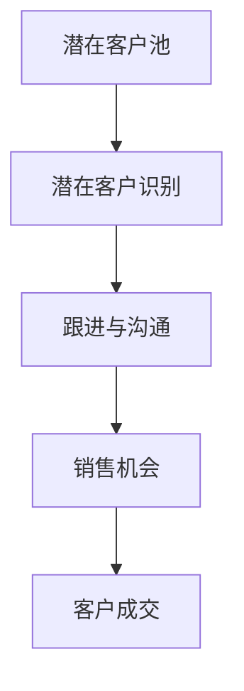

                 

 销售漏斗是现代营销和销售管理中至关重要的一环。它帮助企业分析、优化销售过程，从而提高转化率和销售额。对于一人公司或小型企业来说，构建一个有效的销售漏斗尤为重要，因为它直接影响企业的生存和发展。本文将探讨一人公司如何建立和维护一个高效的销售漏斗，以实现业务增长。

## 关键词

- 销售漏斗
- 一人公司
- 营销策略
- 转化率
- 销售流程

## 摘要

本文将介绍如何针对一人公司构建一个有效的销售漏斗。我们将详细讨论销售漏斗的概念、核心组件，以及如何通过优化这些组件来实现业务增长。此外，文章还将提供一些实用的工具和资源，帮助读者更好地理解和应用销售漏斗的理念。

### 1. 背景介绍

销售漏斗是一个描述销售过程的模型，它将潜在客户转化为忠实客户的各个阶段表示为一个漏斗形状。每个阶段都代表着潜在客户的数量减少，最终实现销售。对于一人公司来说，这意味着需要关注每个阶段的效率，确保潜在客户能够顺利通过漏斗。

建立有效的销售漏斗需要考虑以下几个方面：

- **目标设定**：明确销售目标和预期收益。
- **市场调研**：了解目标市场和潜在客户的需求。
- **内容营销**：提供有价值的内容，吸引潜在客户。
- **客户关系管理**：维护良好的客户关系，提高客户满意度和忠诚度。
- **数据分析**：持续监控和优化销售漏斗的各个阶段。

### 2. 核心概念与联系

要构建一个有效的销售漏斗，首先需要理解其核心概念和组成部分。以下是销售漏斗的主要组件及其相互关系：

#### 2.1 潜在客户池

潜在客户池是销售漏斗的起点，包含了所有潜在的目标客户。这些客户可能是通过搜索引擎、社交媒体、广告或其他渠道找到的。

#### 2.2 潜在客户识别

潜在客户识别是筛选潜在客户的过程，目的是识别出最有潜力的客户。这可以通过分析客户的兴趣、行为和需求来实现。

#### 2.3 跟进与沟通

跟进与沟通是将潜在客户转化为机会的关键步骤。通过定期联系和沟通，了解客户需求，提供定制化的解决方案，从而提高转化率。

#### 2.4 销售机会

销售机会是潜在客户经过沟通和跟进后，有购买意愿的客户。此时，销售人员需要制定个性化的销售策略，促成交易。

#### 2.5 客户成交

客户成交是销售漏斗的最后一步，即成功实现销售。企业需要关注成交后的客户满意度，以促进复购和口碑传播。

以下是一个简单的销售漏斗流程图，用Mermaid语言表示：



### 3. 核心算法原理 & 具体操作步骤

#### 3.1 算法原理概述

销售漏斗的核心算法原理是基于客户行为和需求分析，通过不断优化销售流程，提高转化率和销售额。具体来说，包括以下步骤：

- **数据收集**：收集潜在客户的行为数据，如访问网站、下载资料、参与活动等。
- **数据分析**：分析数据，识别潜在客户的特点和需求。
- **客户分类**：根据分析结果，将潜在客户进行分类，为后续沟通和跟进提供依据。
- **沟通策略**：制定个性化的沟通策略，提高客户满意度和转化率。
- **效果评估**：监控销售漏斗的各个阶段，评估效果并不断优化。

#### 3.2 算法步骤详解

1. **数据收集**：
   - 通过网站分析工具（如Google Analytics）收集潜在客户的行为数据。
   - 设立自定义事件，记录用户的重要行为，如点击、下载、咨询等。

2. **数据分析**：
   - 分析用户行为数据，识别潜在客户的特点和需求。
   - 利用数据可视化工具（如Tableau）呈现数据，帮助理解数据。

3. **客户分类**：
   - 根据数据分析结果，将潜在客户分为高潜力、中潜力、低潜力三类。
   - 为不同类型的客户制定不同的沟通策略。

4. **沟通策略**：
   - 为高潜力客户制定个性化的沟通策略，提供定制化的解决方案。
   - 对于中潜力客户，提供一般性的解决方案，同时保持联系，等待时机。
   - 对于低潜力客户，适当减少沟通频率，降低成本。

5. **效果评估**：
   - 定期评估销售漏斗的各个阶段，如潜在客户识别率、跟进成功率、销售机会转化率等。
   - 分析数据，找出问题所在，不断优化销售流程。

#### 3.3 算法优缺点

**优点**：

- **提高转化率**：通过分析客户行为和需求，提高销售漏斗的各个阶段的转化率。
- **降低成本**：优化销售流程，减少无效沟通和资源浪费。
- **提高客户满意度**：提供个性化解决方案，提升客户满意度和忠诚度。

**缺点**：

- **数据依赖性**：算法效果取决于数据质量和数量，需要持续收集和更新数据。
- **需要专业知识和技能**：构建和维护销售漏斗需要一定的专业知识和技能。

#### 3.4 算法应用领域

销售漏斗算法广泛应用于各类企业，尤其适用于：

- **B2B行业**：企业客户需求复杂，销售周期较长，销售漏斗有助于优化销售流程。
- **高价值产品**：如大型设备、软件系统等，销售漏斗可以帮助企业提高销售额。
- **新兴市场**：新兴市场客户需求多变，销售漏斗有助于快速响应市场变化。

### 4. 数学模型和公式 & 详细讲解 & 举例说明

销售漏斗中的数学模型主要用于计算转化率和销售预测。以下是一些常用的公式和例子：

#### 4.1 数学模型构建

1. **转化率**：

$$
\text{转化率} = \frac{\text{成交客户数}}{\text{潜在客户数}} \times 100\%
$$

2. **销售预测**：

$$
\text{销售额} = \text{潜在客户数} \times \text{平均客单价} \times \text{成交率}
$$

#### 4.2 公式推导过程

1. **转化率**：

   转化率是指潜在客户转化为成交客户的比例。假设有100个潜在客户，其中20个成功成交，则转化率为：

   $$
   \text{转化率} = \frac{20}{100} \times 100\% = 20\%
   $$

2. **销售预测**：

   销售预测是基于潜在客户数量、平均客单价和成交率计算的。假设有1000个潜在客户，平均客单价为1000元，成交率为10%，则预计销售额为：

   $$
   \text{销售额} = 1000 \times 1000 \times 10\% = 100,000 \text{元}
   $$

#### 4.3 案例分析与讲解

假设一家一人公司A，其潜在客户数为1000人，平均客单价为5000元，成交率为5%。现在我们要预测公司A的预计销售额。

1. **转化率计算**：

   $$
   \text{转化率} = 5\%
   $$

2. **销售预测**：

   $$
   \text{销售额} = 1000 \times 5000 \times 5\% = 250,000 \text{元}
   $$

通过以上计算，我们可以预测公司A的预计销售额为250,000元。这为公司的销售目标和资源分配提供了重要的参考。

### 5. 项目实践：代码实例和详细解释说明

为了更好地理解销售漏斗的构建过程，我们将通过一个简单的Python代码实例来演示如何计算转化率和销售预测。

#### 5.1 开发环境搭建

首先，我们需要搭建一个简单的Python开发环境。以下是步骤：

1. 安装Python 3.x版本（建议使用Anaconda）。
2. 安装必要的库，如NumPy、Pandas等。

#### 5.2 源代码详细实现

以下是一个简单的Python代码示例，用于计算转化率和销售预测：

```python
import numpy as np

# 潜在客户数
potential_customers = 1000

# 平均客单价
average_order_value = 5000

# 成交率
conversion_rate = 0.05

# 成交客户数
customers_converted = potential_customers * conversion_rate

# 销售额
sales = customers_converted * average_order_value

print(f"成交客户数：{customers_converted}人")
print(f"预计销售额：{sales}元")
```

#### 5.3 代码解读与分析

1. **导入库**：首先，我们导入NumPy库，用于进行数学计算。
2. **设置变量**：设置潜在客户数、平均客单价和成交率。
3. **计算成交客户数**：根据成交率计算成交客户数。
4. **计算销售额**：根据成交客户数和平均客单价计算销售额。
5. **输出结果**：打印成交客户数和预计销售额。

通过以上代码，我们可以快速计算出一人公司的预计销售额，为销售决策提供依据。

### 6. 实际应用场景

销售漏斗在各类企业中都有广泛应用，以下是一些实际应用场景：

#### 6.1 B2B企业

B2B企业通常客户需求复杂，销售周期较长。销售漏斗可以帮助企业分析客户行为，优化销售流程，提高转化率和销售额。

#### 6.2 高价值产品

对于高价值产品，如大型设备、软件系统等，销售漏斗可以帮助企业识别潜在客户，制定个性化销售策略，提高成交率。

#### 6.3 新兴市场

在新兴市场，客户需求多变，竞争激烈。销售漏斗可以帮助企业快速响应市场变化，提高市场占有率。

### 6.4 未来应用展望

随着大数据、人工智能等技术的发展，销售漏斗的应用前景将更加广阔。未来，销售漏斗有望实现以下发展趋势：

#### 6.4.1 自动化

通过自动化技术，销售漏斗的各个环节可以实现自动化处理，提高效率，降低成本。

#### 6.4.2 个性化

人工智能技术可以帮助企业实现个性化销售，提供定制化的解决方案，提高客户满意度。

#### 6.4.3 可视化

可视化技术将使销售漏斗更加直观，方便企业实时监控和调整销售策略。

### 7. 工具和资源推荐

为了更好地构建和维护销售漏斗，以下是一些实用的工具和资源推荐：

#### 7.1 学习资源推荐

- 《销售漏斗与销售管理》
- 《大数据营销：构建智能销售漏斗》

#### 7.2 开发工具推荐

- Google Analytics：用于收集和分析潜在客户行为数据。
- HubSpot：提供全面的销售漏斗管理工具。

#### 7.3 相关论文推荐

- “The Impact of Sales Funnel on Sales Performance”
- “Using Sales Funnel to Enhance Customer Experience”

### 8. 总结：未来发展趋势与挑战

销售漏斗作为一种有效的销售管理工具，在未来将继续发挥重要作用。然而，随着市场环境的不断变化，企业需要不断优化和调整销售漏斗，以适应新的挑战和机遇。

#### 8.1 研究成果总结

本文介绍了销售漏斗的概念、构建方法及其应用。通过数学模型和实际案例，我们展示了如何计算转化率和销售预测，为企业提供销售决策支持。

#### 8.2 未来发展趋势

未来，销售漏斗将在以下几个方面实现发展趋势：

- 自动化
- 个性化
- 可视化

#### 8.3 面临的挑战

企业在构建和维护销售漏斗时，将面临以下挑战：

- 数据质量
- 技术更新
- 竞争压力

#### 8.4 研究展望

为进一步优化销售漏斗，未来研究可以从以下方面展开：

- 如何提高数据质量
- 如何更好地实现自动化和个性化
- 如何应对市场环境的变化

### 9. 附录：常见问题与解答

**Q：如何提高销售漏斗的转化率？**

A：提高销售漏斗的转化率可以从以下几个方面入手：

- 分析客户需求，提供定制化解决方案。
- 优化沟通策略，提高客户满意度。
- 加强售后服务，提高客户忠诚度。
- 不断测试和优化销售流程。

**Q：销售漏斗适用于所有企业吗？**

A：销售漏斗适用于各类企业，尤其是B2B、高价值产品和新兴市场。然而，对于一些小众市场或特定领域，可能需要根据实际情况进行调整。

**Q：如何选择合适的销售漏斗工具？**

A：选择合适的销售漏斗工具应考虑以下因素：

- 功能是否全面
- 是否易于使用
- 是否支持数据分析和可视化
- 是否有良好的客户评价

通过以上解答，希望能帮助读者更好地理解和应用销售漏斗的理念。建立和维护一个有效的销售漏斗，将为企业带来持续的业务增长。

## 作者署名

本文作者：禅与计算机程序设计艺术 / Zen and the Art of Computer Programming

---
本文基于一人公司的特点，详细探讨了如何建立有效的销售漏斗。通过对核心概念、算法原理、数学模型和实际应用场景的讲解，为读者提供了全面的指导。未来，随着技术的不断发展，销售漏斗将在企业和市场中发挥更大的作用。希望本文能为您的业务增长提供有益的启示。

