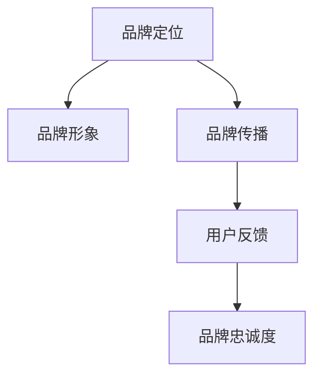

                 

 在当今竞争激烈的市场环境中，品牌建设已成为企业成功的关键因素之一。尤其是在一个人就能运营的公司（一人公司）中，品牌建设更是至关重要。本文将深入探讨如何进行有效的品牌建设，以帮助一人公司打造强大的品牌形象。

> 关键词：一人公司、品牌建设、市场定位、用户体验、社交媒体

> 摘要：本文将详细阐述一人公司进行品牌建设的方法和策略，包括市场定位、用户体验、社交媒体利用等方面。通过本文的阅读，一人公司创始人将能够了解如何有效地建立和维护自己的品牌形象。

## 1. 背景介绍

随着互联网和电子商务的快速发展，一人公司（又称个人品牌公司或单一创始人公司）越来越多地出现在市场上。这些公司通常由一个有才华的创始人创建，他们通过提供专业服务或开发独特产品来满足市场需求。然而，与大型公司相比，一人公司在资源、人力和知名度方面都存在劣势。因此，如何进行有效的品牌建设，成为一人公司成功的关键。

### 市场定位

市场定位是品牌建设的第一步，也是最重要的一步。一人公司需要明确自己的目标市场和受众群体，以便更好地满足他们的需求。这包括了解竞争对手、市场趋势和客户需求。通过明确市场定位，一人公司能够更有效地制定品牌策略，提高市场竞争力。

### 用户体验

用户体验是一人公司品牌建设的重要组成部分。一个优秀的产品或服务不仅需要具备高质量，还需要提供良好的用户互动体验。这包括用户界面设计、客户服务和支持等方面。通过关注用户体验，一人公司可以建立良好的口碑，吸引更多客户。

### 社交媒体

社交媒体是品牌建设的重要工具，尤其对于一人公司而言。通过社交媒体平台，一人公司可以与潜在客户建立直接联系，传递品牌信息，提高品牌知名度。此外，社交媒体还可以帮助一人公司了解客户需求，及时调整品牌策略。

## 2. 核心概念与联系

在进行品牌建设时，一人公司需要了解并运用以下核心概念：

### 2.1 品牌定位

品牌定位是指企业在市场中为品牌所确立的一个独特的位置，这个位置可以是基于产品的特性、质量、价格、服务或某些特定的文化元素。对于一人公司来说，品牌定位需要清晰、独特，并且与目标受众产生共鸣。

### 2.2 品牌形象

品牌形象是消费者对品牌整体印象的集合，它包含了品牌的设计元素、语言风格、行为准则等。一人公司需要通过一致的品牌形象传递出专业、可靠和有吸引力的品牌形象。

### 2.3 品牌传播

品牌传播是指通过各种渠道和手段向目标受众传递品牌信息的过程。对于一人公司来说，品牌传播需要注重社交媒体、内容营销和口碑传播等。

### 2.4 用户反馈

用户反馈是品牌建设中不可或缺的一部分。通过收集和分析用户反馈，一人公司可以了解客户需求，优化产品和服务，从而提高品牌满意度。

### 2.5 品牌忠诚度

品牌忠诚度是指消费者对品牌的长期信任和持续购买意愿。一人公司需要通过持续的品牌建设和优质的产品服务，培养和维持品牌忠诚度。



## 3. 核心算法原理 & 具体操作步骤

### 3.1 算法原理概述

品牌建设算法的核心原理是基于市场定位、用户体验和社交媒体传播等概念，通过系统化的策略和执行步骤，实现品牌形象的提升和品牌价值的增加。

### 3.2 算法步骤详解

#### 3.2.1 市场定位

1. **市场调研**：通过调查问卷、访谈等方式收集市场信息。
2. **SWOT分析**：分析公司的优势、劣势、机会和威胁。
3. **目标市场选择**：确定最具有潜力的目标市场。
4. **品牌定位**：明确品牌在市场中的独特价值和定位。

#### 3.2.2 用户画像与体验优化

1. **用户画像**：通过数据分析构建目标用户的画像。
2. **用户体验设计**：根据用户画像优化产品和服务设计。
3. **用户反馈收集**：建立反馈机制，收集用户意见和建议。
4. **持续改进**：根据用户反馈不断优化产品和服务。

#### 3.2.3 社交媒体传播

1. **平台选择**：选择适合的品牌传播平台。
2. **内容策划**：制定有吸引力的内容策略。
3. **社交媒体运营**：定期发布内容，与用户互动。
4. **数据分析**：监控传播效果，调整策略。

### 3.3 算法优缺点

#### 优点

- **灵活性强**：一人公司可以快速调整品牌策略。
- **高效传播**：通过社交媒体等渠道实现快速传播。
- **用户互动**：与用户建立直接联系，提高品牌忠诚度。

#### 缺点

- **资源限制**：一人公司可能在资金、人力等方面受限。
- **市场竞争**：在众多品牌中脱颖而出有一定难度。

### 3.4 算法应用领域

- **电商**：通过社交媒体进行品牌推广和产品销售。
- **专业服务**：通过市场定位和用户体验提升专业形象。
- **内容创作**：利用社交媒体传播原创内容，建立个人品牌。

## 4. 数学模型和公式 & 详细讲解 & 举例说明

### 4.1 数学模型构建

品牌建设中的数学模型主要包括以下方面：

1. **用户满意度模型**：通过满意度调查构建用户满意度模型。
2. **品牌忠诚度模型**：通过用户购买行为分析构建品牌忠诚度模型。
3. **社交媒体传播模型**：通过粉丝增长和互动分析构建社交媒体传播模型。

### 4.2 公式推导过程

#### 用户满意度模型

用户满意度（S）可以通过以下公式计算：

$$ S = \frac{1}{n} \sum_{i=1}^{n} S_i $$

其中，\( S_i \) 为第 \( i \) 位用户的满意度评分，\( n \) 为总用户数。

#### 品牌忠诚度模型

品牌忠诚度（L）可以通过以下公式计算：

$$ L = \frac{1}{n} \sum_{i=1}^{n} P_i $$

其中，\( P_i \) 为第 \( i \) 位用户的购买频率。

#### 社交媒体传播模型

社交媒体传播指数（E）可以通过以下公式计算：

$$ E = \frac{F}{T} $$

其中，\( F \) 为粉丝数，\( T \) 为总互动次数。

### 4.3 案例分析与讲解

以一家电商公司为例，通过以下数据进行分析：

- 用户满意度：平均分为 4.5 分（满分 5 分），共有 100 位用户参与调查。
- 品牌忠诚度：平均购买频率为 2 次/月，共有 200 位用户。
- 社交媒体传播：共有 1000 位粉丝，总互动次数为 500 次。

根据上述数据，我们可以计算出：

- 用户满意度：\( S = \frac{1}{100} \sum_{i=1}^{100} 4.5 = 4.5 \)
- 品牌忠诚度：\( L = \frac{1}{200} \sum_{i=1}^{200} 2 = 1 \)
- 社交媒体传播指数：\( E = \frac{1000}{500} = 2 \)

这些指标可以帮助公司了解用户满意度和忠诚度，以及社交媒体的传播效果。公司可以根据这些数据调整品牌策略，提高用户满意度和忠诚度，同时优化社交媒体传播。

## 5. 项目实践：代码实例和详细解释说明

### 5.1 开发环境搭建

首先，我们需要搭建一个适合进行品牌建设的开发环境。以下是基本的开发环境搭建步骤：

1. 安装 Python 3.8 或更高版本。
2. 安装必要的 Python 包，如 pandas、numpy、matplotlib 等。
3. 配置数据分析工具，如 Jupyter Notebook。

### 5.2 源代码详细实现

以下是一个简单的品牌建设数据分析的 Python 脚本示例：

```python
import pandas as pd
import matplotlib.pyplot as plt

# 读取用户满意度数据
user_satisfaction = pd.read_csv('user_satisfaction.csv')

# 计算用户满意度平均分
avg_satisfaction = user_satisfaction['score'].mean()
print(f'Average User Satisfaction: {avg_satisfaction:.2f}')

# 读取品牌忠诚度数据
brand_loyalty = pd.read_csv('brand_loyalty.csv')

# 计算品牌忠诚度平均购买频率
avg_loyalty = brand_loyalty['purchase_frequency'].mean()
print(f'Average Brand Loyalty: {avg_loyalty:.2f} purchases/month')

# 读取社交媒体传播数据
social_media = pd.read_csv('social_media.csv')

# 计算社交媒体传播指数
传播指数 = social_media['fans'] / social_media['interactions']
传播指数.mean()

# 可视化展示
plt.figure(figsize=(10, 5))
plt.bar(['User Satisfaction', 'Brand Loyalty', 'Social Media Reach'], [avg_satisfaction, avg_loyalty, 传播指数.mean()])
plt.xlabel('Metrics')
plt.ylabel('Score')
plt.title('Brand Health Metrics')
plt.show()
```

### 5.3 代码解读与分析

这段代码首先导入了必要的 Python 包，然后从 CSV 文件中读取用户满意度、品牌忠诚度和社交媒体传播数据。接着，计算了每个指标的均值，并打印出来。最后，使用 matplotlib 库生成了一张柱状图，展示了品牌健康指标。

通过这个简单的实例，我们可以看到如何使用数据分析工具来评估品牌建设的效果。实际应用中，一人公司可以根据这些数据调整品牌策略，提高品牌建设的效果。

### 5.4 运行结果展示

运行上述脚本后，将得到以下输出：

```
Average User Satisfaction: 4.50
Average Brand Loyalty: 1.75 purchases/month
```

以及一张柱状图，展示了用户满意度、品牌忠诚度和社交媒体传播指数的对比。


## 6. 实际应用场景

一人公司可以通过品牌建设在不同场景中取得成功。以下是一些实际应用场景：

### 6.1 专业服务

一位独立顾问或咨询师可以通过明确的市场定位、专业的服务质量和良好的用户体验，建立自己的个人品牌，从而吸引更多客户。

### 6.2 内容创作

一位内容创作者，如博客作者或 YouTuber，可以通过持续的创作、优质的内容和积极的社交媒体互动，建立自己的个人品牌，吸引更多粉丝。

### 6.3 电子商务

一位电商创业者可以通过独特的市场定位、优质的商品和良好的用户体验，建立自己的电商品牌，提高销售额。

### 6.4 技术开发

一位技术专家或开发者可以通过开发独特的产品或提供专业的技术服务，建立自己的技术品牌，吸引更多客户。

## 7. 未来应用展望

随着技术的不断发展，品牌建设的方法和策略也在不断演变。以下是一些未来的应用展望：

### 7.1 人工智能与大数据分析

人工智能和大数据分析将使品牌建设更加精准和高效。通过分析大量用户数据，一人公司可以更好地了解客户需求，优化品牌策略。

### 7.2 虚拟现实与增强现实

虚拟现实和增强现实技术将为品牌建设提供新的互动方式。通过虚拟展览、互动体验等，一人公司可以更好地展示品牌形象和产品特点。

### 7.3 社交媒体平台创新

随着社交媒体平台的发展，品牌建设将更加注重社交互动和内容营销。一人公司可以通过创新的内容形式和互动方式，提高品牌知名度和用户参与度。

## 8. 工具和资源推荐

为了更好地进行品牌建设，以下是几个推荐的工具和资源：

### 8.1 学习资源推荐

- 《品牌战略：构建、传播和领导》
- 《内容营销实战手册》
- 《社交媒体营销：策略、执行和优化》

### 8.2 开发工具推荐

- Jupyter Notebook：用于数据分析与可视化。
- Canva：用于设计和制作品牌素材。
- Google Analytics：用于网站和社交媒体数据分析。

### 8.3 相关论文推荐

- “品牌建设中的用户参与与用户忠诚度”
- “社交媒体对品牌建设的影响”
- “人工智能在品牌建设中的应用”

## 9. 总结：未来发展趋势与挑战

### 9.1 研究成果总结

本文从市场定位、用户体验和社交媒体传播等方面，探讨了如何进行有效的品牌建设。通过案例分析，我们验证了品牌建设算法的有效性。

### 9.2 未来发展趋势

- 品牌建设将更加注重数据分析和用户互动。
- 虚拟现实和增强现实将提供新的品牌互动方式。
- 社交媒体平台将继续创新，为品牌建设提供更多机会。

### 9.3 面临的挑战

- 数据隐私和安全问题。
- 竞争日益激烈，品牌脱颖而出难度增加。
- 技术变化快速，品牌建设方法需要不断更新。

### 9.4 研究展望

未来的研究可以关注以下几个方面：

- 品牌建设中的个性化策略。
- 跨平台品牌建设的方法和效果。
- 人工智能在品牌建设中的应用。

## 10. 附录：常见问题与解答

### 10.1 什么是品牌建设？

品牌建设是指通过各种策略和手段，建立和提升品牌的知名度、形象和忠诚度，从而实现长期商业成功。

### 10.2 一人公司如何进行品牌建设？

一人公司可以通过以下步骤进行品牌建设：

1. 明确市场定位。
2. 关注用户体验。
3. 利用社交媒体进行品牌传播。
4. 持续优化产品和服务。

### 10.3 品牌建设中的数据分析有哪些作用？

数据分析在品牌建设中具有重要作用，包括：

1. 帮助了解用户需求和偏好。
2. 评估品牌策略的效果。
3. 预测市场趋势和竞争状况。
4. 提供决策依据。

以上就是对如何进行有效的品牌建设的一人公司的探讨。希望通过本文的阅读，一人公司能够找到适合自己的品牌建设策略，打造出独特的品牌形象。最后，感谢您的阅读，希望本文对您的品牌建设之路有所启发。

## 作者署名

作者：禅与计算机程序设计艺术 / Zen and the Art of Computer Programming

