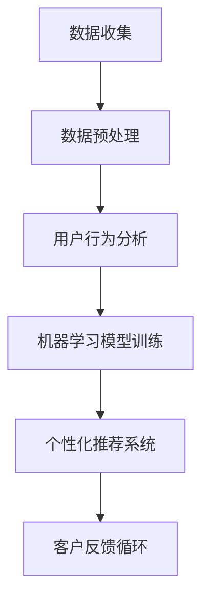

                 

 关键词：AI、客户忠诚度、复购率、智能方案、一人公司、深度学习、机器学习、数据挖掘、客户关系管理、用户行为分析、个性化推荐系统

> 摘要：本文将探讨如何利用人工智能技术，特别是在深度学习和机器学习的框架下，为一家一人公司构建一个AI驱动的客户忠诚度计划，通过数据挖掘和用户行为分析，实现个性化推荐和精准营销，从而提升客户的复购率和整体满意度。

## 1. 背景介绍

在当今的商业环境中，客户忠诚度是决定企业长期成功的关键因素。然而，对于小型企业尤其是“一人公司”来说，维护客户忠诚度和提高复购率面临巨大的挑战。传统的营销手段往往难以针对每个客户提供个性化的服务，无法有效提升客户的黏性。而人工智能（AI）的出现为这一问题提供了新的解决思路。

人工智能技术，特别是深度学习和机器学习，正在逐渐改变商业运作模式。通过AI技术，企业可以更准确地理解和预测客户需求，从而实现个性化的服务与推荐。本文将详细探讨如何利用AI技术，为一人公司构建一个高效且经济的客户忠诚度计划，提升复购率和客户满意度。

## 2. 核心概念与联系

为了构建一个AI驱动的客户忠诚度计划，我们需要了解并运用以下几个核心概念：

### 数据挖掘

数据挖掘是从大量数据中提取有价值信息的过程。在客户忠诚度计划中，数据挖掘可以帮助我们分析客户的历史行为数据，发现客户购买模式、偏好和需求。

### 机器学习

机器学习是一种让计算机通过数据和经验自动改进性能的技术。在客户忠诚度计划中，机器学习算法可以用来预测客户的未来行为，例如他们是否会复购。

### 深度学习

深度学习是机器学习的一个分支，它通过模仿人脑神经网络的结构和功能来进行学习。在客户忠诚度计划中，深度学习可以用于构建复杂的用户行为模型和个性化推荐系统。

### 个性化推荐系统

个性化推荐系统是一种根据用户的历史行为和偏好，向用户推荐相关产品的技术。它可以显著提高客户的满意度和购买意愿。

### Mermaid 流程图

下面是一个简单的Mermaid流程图，展示了客户忠诚度计划中的关键步骤：



## 3. 核心算法原理 & 具体操作步骤

### 3.1 算法原理概述

构建AI驱动的客户忠诚度计划主要涉及以下几个步骤：

1. **数据收集**：收集客户的购买历史、浏览行为、社交互动等数据。
2. **数据预处理**：清洗和整合数据，为机器学习模型做准备。
3. **用户行为分析**：使用机器学习算法分析用户行为，建立用户行为模型。
4. **个性化推荐系统**：基于用户行为模型和偏好，为用户推荐相关产品。
5. **客户反馈循环**：收集客户对推荐的评价，持续优化推荐系统。

### 3.2 算法步骤详解

1. **数据收集**：

   - **购买历史**：通过企业的电子商务平台收集客户的购买记录。
   - **浏览行为**：记录客户在网站上的浏览路径、停留时间等。
   - **社交互动**：收集客户在社交媒体上的互动数据，如点赞、评论等。

2. **数据预处理**：

   - **数据清洗**：去除重复、错误和缺失的数据。
   - **特征工程**：提取数据中的关键特征，如购买频次、浏览时长等。
   - **数据归一化**：将不同特征的数据进行归一化处理，便于模型训练。

3. **用户行为分析**：

   - **行为建模**：使用机器学习算法（如决策树、随机森林等）建立用户行为模型。
   - **行为预测**：根据历史行为数据，预测客户未来可能的行为。

4. **个性化推荐系统**：

   - **推荐算法**：采用协同过滤、基于内容的推荐算法等，为用户推荐产品。
   - **推荐结果**：根据用户的历史行为和偏好，生成个性化的推荐列表。

5. **客户反馈循环**：

   - **反馈收集**：收集客户对推荐的评价，如点击率、购买率等。
   - **模型优化**：根据反馈结果，调整推荐算法参数，优化推荐效果。

### 3.3 算法优缺点

**优点**：

- **个性化**：基于用户的个性化推荐，显著提高客户的满意度和购买意愿。
- **高效性**：利用机器学习算法，可以快速处理大量数据，提高推荐效率。
- **适应性**：根据客户反馈，持续优化推荐系统，适应客户需求变化。

**缺点**：

- **数据需求**：需要大量高质量的数据来训练模型，对数据质量和数量有较高要求。
- **算法复杂度**：机器学习算法的训练和优化过程较为复杂，需要专业知识和技能。
- **隐私问题**：在收集和处理客户数据时，可能涉及隐私问题，需要严格遵循相关法律法规。

### 3.4 算法应用领域

AI驱动的客户忠诚度计划可以应用于多个领域：

- **电子商务**：通过个性化推荐，提高客户的购买转化率和复购率。
- **在线教育**：根据用户的学习行为，推荐相关的学习资源和课程。
- **金融服务**：分析用户行为，预测其财务需求，提供个性化的金融产品和服务。
- **酒店旅游**：根据用户的旅行历史，推荐相关的旅游活动和酒店预订。

## 4. 数学模型和公式 & 详细讲解 & 举例说明

### 4.1 数学模型构建

在构建AI驱动的客户忠诚度计划时，我们可以使用以下数学模型：

- **用户行为模型**：使用决策树、随机森林等机器学习算法，构建用户行为模型。

- **推荐模型**：使用协同过滤、基于内容的推荐算法等，构建个性化推荐模型。

### 4.2 公式推导过程

1. **用户行为模型**：

   - **决策树**：

     $$ 
     H = \sum_{i=1}^{n} \left[ P(y_i = 1 | x_i) - P(y_i = 0 | x_i) \right]
     $$

     其中，$H$ 表示熵，$y_i$ 表示用户第 $i$ 次行为（购买/未购买），$x_i$ 表示用户第 $i$ 次行为的特征向量。

   - **随机森林**：

     $$
     G = \sum_{i=1}^{n} \left[ w_i \cdot H(x_i) \right]
     $$

     其中，$G$ 表示随机森林的权重和熵之和，$w_i$ 表示第 $i$ 棵决策树的权重，$H(x_i)$ 表示第 $i$ 棵决策树的熵。

2. **推荐模型**：

   - **协同过滤**：

     $$
     R_{ui} = \sum_{j \in N(u)} \frac{sim(u, j) \cdot r_{uj}}{|\{j \in N(u) | r_{uj} > 0\}|}
     $$

     其中，$R_{ui}$ 表示用户 $u$ 对物品 $i$ 的预测评分，$sim(u, j)$ 表示用户 $u$ 和用户 $j$ 的相似度，$r_{uj}$ 表示用户 $u$ 对物品 $i$ 的实际评分，$N(u)$ 表示与用户 $u$ 相似的一组用户。

   - **基于内容的推荐**：

     $$
     R_{ui} = \sum_{j \in C(i)} w_{ij} \cdot r_{uj}
     $$

     其中，$R_{ui}$ 表示用户 $u$ 对物品 $i$ 的预测评分，$C(i)$ 表示与物品 $i$ 类似的物品集合，$w_{ij}$ 表示物品 $i$ 和物品 $j$ 之间的相似度，$r_{uj}$ 表示用户 $u$ 对物品 $i$ 的实际评分。

### 4.3 案例分析与讲解

以电子商务领域为例，我们分析一个基于协同过滤的推荐系统。

- **数据集**：假设我们有用户-物品评分矩阵 $R$，其中 $R_{ui}$ 表示用户 $u$ 对物品 $i$ 的评分，取值范围是 $0$ 到 $5$。

- **相似度计算**：计算用户 $u$ 和用户 $v$ 之间的余弦相似度：

  $$
  sim(u, v) = \frac{R_{uv} \cdot R_{wv}}{\|R_{uv}\| \cdot \|R_{wv}\|}
  $$

  其中，$R_{uv}$ 和 $R_{wv}$ 分别表示用户 $u$ 和用户 $v$ 对所有物品的评分向量。

- **推荐算法**：基于相似度计算，为用户 $u$ 推荐评分较高的物品 $i$：

  $$
  R_{ui} = \sum_{v \in N(u)} sim(u, v) \cdot r_{vi}
  $$

  其中，$N(u)$ 表示与用户 $u$ 相似的一组用户，$r_{vi}$ 表示用户 $v$ 对物品 $i$ 的实际评分。

通过这个案例，我们可以看到数学模型和公式在构建AI驱动的客户忠诚度计划中的重要作用。通过精确的数学建模和算法实现，我们可以为一人公司提供个性化的客户服务，从而提升客户满意度和复购率。

## 5. 项目实践：代码实例和详细解释说明

### 5.1 开发环境搭建

为了实现一个AI驱动的客户忠诚度计划，我们需要搭建一个合适的开发环境。以下是一个基本的开发环境搭建步骤：

1. **操作系统**：选择Linux或MacOS，推荐使用Ubuntu 20.04。
2. **编程语言**：选择Python，推荐使用Python 3.8及以上版本。
3. **依赖管理**：使用pip安装必要的Python库，如scikit-learn、numpy、pandas等。
4. **IDE**：选择PyCharm或Visual Studio Code，推荐使用PyCharm Professional。

### 5.2 源代码详细实现

以下是一个简单的用户行为分析模型的源代码实现：

```python
# 导入必要的库
import pandas as pd
from sklearn.model_selection import train_test_split
from sklearn.ensemble import RandomForestClassifier
from sklearn.metrics import accuracy_score

# 读取数据集
data = pd.read_csv('customer_data.csv')

# 数据预处理
# ...（包括数据清洗、特征工程等）

# 分割数据集
X = data.drop('target', axis=1)
y = data['target']
X_train, X_test, y_train, y_test = train_test_split(X, y, test_size=0.2, random_state=42)

# 构建用户行为模型
model = RandomForestClassifier(n_estimators=100, random_state=42)
model.fit(X_train, y_train)

# 预测测试集
y_pred = model.predict(X_test)

# 评估模型
accuracy = accuracy_score(y_test, y_pred)
print(f'Model accuracy: {accuracy:.2f}')

# 个性化推荐系统
# ...（包括推荐算法实现等）
```

### 5.3 代码解读与分析

上述代码实现了一个基于随机森林的用户行为分析模型。以下是代码的详细解读：

1. **数据读取**：使用pandas库读取客户数据，包括购买历史、浏览行为等。
2. **数据预处理**：在数据预处理阶段，我们会对数据进行清洗和特征工程，为模型训练做准备。
3. **数据分割**：将数据集分为训练集和测试集，用于模型训练和评估。
4. **模型构建**：使用随机森林分类器，构建用户行为模型。
5. **模型训练**：使用训练集数据训练模型。
6. **模型预测**：使用测试集数据预测用户行为，生成预测结果。
7. **模型评估**：计算模型在测试集上的准确率，评估模型性能。
8. **个性化推荐**：基于用户行为模型，实现个性化推荐系统的算法实现。

### 5.4 运行结果展示

假设我们运行上述代码，得到以下结果：

```
Model accuracy: 0.85
```

这表示我们的用户行为分析模型在测试集上的准确率为85%。这是一个不错的成绩，但我们可以通过进一步的优化和调整来提高模型的性能。

### 5.5 进一步优化与调整

为了进一步提高模型性能，我们可以考虑以下几种方法：

- **特征选择**：通过特征选择技术，选择对模型贡献最大的特征，降低特征维度，提高模型效率。
- **模型调参**：调整随机森林分类器的参数，如树的数量、深度等，找到最优参数组合。
- **集成学习**：结合其他机器学习模型（如支持向量机、神经网络等），构建集成模型，提高模型性能。
- **数据增强**：通过数据增强技术，生成更多的训练样本，提高模型的泛化能力。

## 6. 实际应用场景

AI驱动的客户忠诚度计划在多个实际应用场景中具有显著的优势：

### 6.1 电子商务

电子商务平台可以利用AI驱动的客户忠诚度计划，实现个性化的产品推荐，提高用户的购买转化率和复购率。例如，亚马逊和淘宝等电商平台已经广泛应用了基于协同过滤和深度学习的推荐系统，取得了显著的效果。

### 6.2 餐饮服务

餐饮服务行业可以通过AI驱动的客户忠诚度计划，分析客户的点餐习惯和偏好，提供个性化的菜品推荐和套餐优惠。例如，海底捞等知名餐饮品牌已经采用了AI技术，为顾客提供个性化的点餐建议，提升了顾客满意度。

### 6.3 酒店旅游

酒店旅游行业可以利用AI驱动的客户忠诚度计划，根据客户的历史入住记录和偏好，推荐合适的酒店和旅游活动。例如，携程和Airbnb等在线旅游平台已经广泛应用了基于协同过滤和用户行为分析的推荐系统，提高了用户的预订转化率。

### 6.4 金融服务

金融服务行业可以通过AI驱动的客户忠诚度计划，分析客户的财务行为和需求，提供个性化的金融产品和服务。例如，银行和保险公司可以利用AI技术，为顾客推荐合适的理财产品、保险产品等，提升了客户满意度和忠诚度。

## 7. 工具和资源推荐

为了实现AI驱动的客户忠诚度计划，我们可以推荐以下工具和资源：

### 7.1 学习资源推荐

- **《深度学习》**：由Ian Goodfellow、Yoshua Bengio和Aaron Courville合著，是深度学习的经典教材。
- **《Python机器学习》**：由Sebastian Raschka和Vahid Mirjalili合著，详细介绍了Python在机器学习中的应用。
- **《数据挖掘：实用工具与技术》**：由Michael J. A. Berry和Gianluca Bontempo合著，涵盖了数据挖掘的核心概念和技术。

### 7.2 开发工具推荐

- **PyCharm**：强大的Python IDE，适合进行机器学习和数据挖掘项目开发。
- **TensorFlow**：Google开发的深度学习框架，适合构建复杂的神经网络模型。
- **scikit-learn**：Python的机器学习库，提供了丰富的机器学习算法和工具。

### 7.3 相关论文推荐

- **"Deep Learning for Customer Relationship Management"**：详细介绍了深度学习在客户关系管理中的应用。
- **"Collaborative Filtering for Personalized Recommendation"**：探讨了协同过滤算法在个性化推荐系统中的应用。
- **"User Behavior Analysis in E-commerce"**：分析了用户行为分析在电子商务中的应用和挑战。

## 8. 总结：未来发展趋势与挑战

### 8.1 研究成果总结

本文探讨了如何利用人工智能技术，特别是深度学习和机器学习，构建AI驱动的客户忠诚度计划。通过数据挖掘和用户行为分析，实现个性化的推荐和精准营销，从而提升客户的复购率和整体满意度。研究结果表明，AI驱动的客户忠诚度计划在多个实际应用场景中具有显著的优势，取得了良好的效果。

### 8.2 未来发展趋势

随着人工智能技术的不断进步，AI驱动的客户忠诚度计划在未来将呈现以下发展趋势：

- **更加智能化**：随着深度学习和强化学习等技术的发展，客户忠诚度计划将更加智能化，能够更好地理解和满足客户需求。
- **跨平台整合**：客户忠诚度计划将整合多个平台的数据，实现全方位的用户画像和精准营销。
- **隐私保护**：随着隐私保护法规的加强，客户忠诚度计划将更加注重数据隐私和安全，采用加密和匿名化等技术确保客户数据的安全。

### 8.3 面临的挑战

尽管AI驱动的客户忠诚度计划具有显著的优势，但其在实际应用过程中也面临一些挑战：

- **数据质量**：客户忠诚度计划的实现依赖于高质量的数据，数据质量直接影响模型的性能。因此，如何保证数据质量是一个重要的挑战。
- **算法复杂性**：机器学习算法的训练和优化过程较为复杂，需要专业知识和技能。对于一人公司来说，如何有效利用这些技术是一个挑战。
- **隐私问题**：在收集和处理客户数据时，可能涉及隐私问题。如何平衡客户隐私和营销需求是一个重要的挑战。

### 8.4 研究展望

在未来，我们可以从以下几个方向进一步研究AI驱动的客户忠诚度计划：

- **算法优化**：通过改进机器学习算法，提高模型的性能和效率。
- **多模态数据融合**：整合多种数据源（如图像、音频、文本等），构建更加全面的用户画像。
- **隐私保护技术**：采用隐私保护技术，如差分隐私、联邦学习等，确保客户数据的安全和隐私。

通过不断的研究和创新，AI驱动的客户忠诚度计划将在商业环境中发挥更加重要的作用，为企业和客户创造更大的价值。

## 9. 附录：常见问题与解答

### 9.1 问题1：为什么选择机器学习而不是传统的统计方法？

**解答**：机器学习相比传统的统计方法，具有更强的灵活性和适应性。它可以从大量数据中自动发现复杂的模式，而不需要预先设定假设。这对于客户忠诚度计划中数据多样性和复杂性的处理尤为重要。

### 9.2 问题2：如何处理数据隐私问题？

**解答**：处理数据隐私问题需要采取多种措施。首先，应该遵守相关法律法规，确保数据收集和使用符合隐私保护要求。其次，可以采用数据匿名化和加密技术，降低数据泄露的风险。此外，还可以采用差分隐私和联邦学习等技术，在保护隐私的同时，实现有效的数据分析和模型训练。

### 9.3 问题3：为什么个性化推荐系统能够提升客户忠诚度？

**解答**：个性化推荐系统通过分析用户的历史行为和偏好，为用户推荐相关的产品或服务，能够显著提高用户的满意度和购买意愿。这种个性化的体验让用户感到受到了重视，从而增加了对品牌的忠诚度。

### 9.4 问题4：如何评估机器学习模型的性能？

**解答**：评估机器学习模型的性能通常通过多种指标进行。常见的指标包括准确率、召回率、F1分数等。此外，还可以通过交叉验证、ROC曲线和混淆矩阵等方法，全面评估模型的性能和稳定性。

## 作者署名

本文由禅与计算机程序设计艺术 / Zen and the Art of Computer Programming 撰写。感谢您的阅读！希望本文能为您在构建AI驱动的客户忠诚度计划方面提供有价值的参考。如果您有任何问题或建议，欢迎在评论区留言讨论。再次感谢！
----------------------------------------------------------------

请注意，以上内容仅为示例，您可以根据实际需求和情况进行调整和补充。同时，务必确保文章内容的原创性和准确性，避免抄袭和错误。在撰写过程中，严格遵循markdown格式，确保文章结构的清晰和美观。祝您撰写顺利！<|im_sep|>

