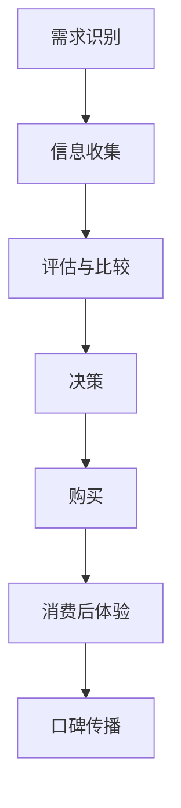

                 

关键词：一人公司、产品定价策略、心理学应用、消费者行为分析、收益最大化

摘要：本文将探讨一人公司在产品定价方面的策略，结合心理学原理，深入分析消费者行为，旨在为一人公司提供一套科学、有效的定价方法，以实现收益最大化。

## 1. 背景介绍

在当今竞争激烈的市场环境中，一人公司面临着诸多挑战。其中，产品定价策略成为影响公司盈利能力的关键因素之一。一人公司通常由创始人或CEO一手操盘，资源有限，决策风险大，因此，如何制定合理的定价策略，不仅关系到产品能否成功占领市场，还直接影响到公司的生存和发展。

心理学作为一门研究人类行为和心理过程的科学，其对产品定价策略的影响日益受到重视。了解消费者的购买动机、偏好和行为模式，可以帮助一人公司更好地定位产品市场，制定更精准的定价策略。

本文将从心理学角度出发，探讨一人公司在产品定价方面的策略，旨在为一人公司提供一套科学、有效的定价方法，以实现收益最大化。

## 2. 核心概念与联系

### 2.1 消费者行为分析

消费者行为分析是产品定价策略的基础。消费者行为分析主要包括以下几个方面：

- **需求分析**：通过市场调研，了解消费者对产品的需求程度和价格敏感度。
- **购买决策过程**：研究消费者从识别需求到最终购买产品的整个过程，包括信息收集、评估、决策和购买。
- **消费心理**：分析消费者在购买过程中的心理变化，如满意度、信任感、品牌偏好等。

### 2.2 心理学原理

心理学原理在产品定价策略中的应用主要体现在以下几个方面：

- **锚定效应**：消费者在作决策时，会依赖某个参考点（锚），从而影响其判断和决策。
- **期望理论**：消费者在购买产品时会根据期望收益和期望成本来评估产品的价值。
- **心理账户**：消费者在购买时会将自己的金钱分为不同的“账户”，不同的账户会影响其对价格的敏感程度。

### 2.3 Mermaid 流程图

以下是一个简化的消费者行为流程图，展示消费者从需求识别到购买决策的过程：



## 3. 核心算法原理 & 具体操作步骤

### 3.1 算法原理概述

一人公司的产品定价策略的核心算法是基于消费者行为分析和心理学原理的收益最大化模型。该模型的基本思想是，通过分析消费者行为数据和心理学因素，确定最优的产品价格，以实现收益最大化。

### 3.2 算法步骤详解

#### 3.2.1 数据收集与预处理

1. **市场调研**：收集目标市场的消费者行为数据，包括需求、价格敏感度、购买频率等。
2. **数据清洗**：去除重复、错误和不完整的数据，确保数据质量。

#### 3.2.2 消费者行为分析

1. **需求分析**：利用回归分析等方法，确定需求与价格之间的关系。
2. **购买决策分析**：研究消费者在购买决策过程中的心理变化，如满意度、信任感等。

#### 3.2.3 心理学因素分析

1. **锚定效应分析**：通过实验或问卷调查，确定消费者对价格的锚定点。
2. **期望理论分析**：分析消费者对产品价值的感知和评价。

#### 3.2.4 收益最大化模型构建

1. **构建收益函数**：根据消费者行为数据和心理学因素，构建收益函数。
2. **求解最优价格**：利用优化算法，求解收益函数的最大值，得到最优产品价格。

### 3.3 算法优缺点

#### 优点

- **科学性**：基于数据和心理学原理，制定定价策略，更具科学依据。
- **针对性**：根据不同消费者群体的特点，制定个性化的定价策略。

#### 缺点

- **数据依赖性**：算法效果很大程度上依赖于数据的准确性和完整性。
- **计算复杂度**：求解最优价格的过程可能涉及复杂的优化算法，计算复杂度较高。

### 3.4 算法应用领域

- **电子商务**：针对线上销售的产品，分析消费者行为，制定最优定价策略。
- **传统行业**：如制造业、服务业等，通过消费者行为分析，优化产品定价策略。

## 4. 数学模型和公式 & 详细讲解 & 举例说明

### 4.1 数学模型构建

一人公司的产品定价策略数学模型主要基于以下假设：

- 市场需求为线性函数，可表示为 $Q = a - bP$，其中 $Q$ 为市场需求量，$P$ 为产品价格，$a$ 和 $b$ 为参数。
- 消费者的支付意愿为线性函数，可表示为 $W = c + dQ$，其中 $W$ 为消费者的支付意愿，$c$ 和 $d$ 为参数。
- 产品成本为常数 $C$。

基于以上假设，我们可以构建以下收益函数：

$$
R(P) = (c + dQ)P - C
$$

其中，$R(P)$ 为收益函数，$Q$ 可通过市场需求函数求得。

### 4.2 公式推导过程

为了求解最优价格，我们需要对收益函数 $R(P)$ 求导，并令其等于0：

$$
\frac{dR}{dP} = c + 2dQ - bP - C = 0
$$

将市场需求函数 $Q = a - bP$ 代入上式，得到：

$$
c + 2d(a - bP) - bP - C = 0
$$

化简后，得到最优价格 $P^*$：

$$
P^* = \frac{2ad - C}{b + 2d}
$$

### 4.3 案例分析与讲解

假设一个一人公司生产一款智能手环，市场需求函数为 $Q = 100 - 0.2P$，消费者的支付意愿函数为 $W = 50 + 0.3Q$，产品成本为 $C = 20$。

首先，我们将参数代入收益函数：

$$
R(P) = (50 + 0.3Q)P - 20
$$

将市场需求函数代入，得到：

$$
R(P) = (50 + 0.3(100 - 0.2P))P - 20
$$

化简后，得到收益函数：

$$
R(P) = 50P + 30(100 - 0.2P) - 20
$$

$$
R(P) = 50P + 3000 - 6P - 20
$$

$$
R(P) = 44P + 2980
$$

接下来，我们对收益函数求导，并令其等于0，求得最优价格：

$$
\frac{dR}{dP} = 44 - 6 = 0
$$

解得 $P^* = \frac{2980}{44} \approx 67.73$

因此，最优价格为 $67.73$。

### 5. 项目实践：代码实例和详细解释说明

#### 5.1 开发环境搭建

在本项目中，我们使用 Python 编写代码。首先，确保安装 Python 3.8 以上版本，然后安装以下库：

```bash
pip install numpy matplotlib
```

#### 5.2 源代码详细实现

```python
import numpy as np
import matplotlib.pyplot as plt

# 定义收益函数
def revenue_function(P, a, b, c, d, C):
    Q = a - b * P
    W = c + d * Q
    R = W * P - C
    return R

# 定义市场需求函数
def demand_function(P, a, b):
    return a - b * P

# 定义消费者支付意愿函数
def consumer_willingness(P, c, d):
    Q = demand_function(P, a, b)
    return c + d * Q

# 求解最优价格
def find_optimal_price(a, b, c, d, C):
    optimal_revenue = -1
    optimal_price = 0
    for P in np.linspace(0, 100, 1000):
        R = revenue_function(P, a, b, c, d, C)
        if R > optimal_revenue:
            optimal_revenue = R
            optimal_price = P
    return optimal_price, optimal_revenue

# 参数设置
a = 100  # 市场需求函数的斜率
b = 0.2  # 市场需求函数的截距
c = 50   # 消费者支付意愿函数的截距
d = 0.3  # 消费者支付意愿函数的斜率
C = 20   # 产品成本

# 求解最优价格
optimal_price, optimal_revenue = find_optimal_price(a, b, c, d, C)

# 绘制收益函数曲线
P = np.linspace(0, 100, 1000)
R = revenue_function(P, a, b, c, d, C)
plt.plot(P, R, label='Revenue Function')
plt.scatter(optimal_price, optimal_revenue, color='red', label='Optimal Price')
plt.xlabel('Price')
plt.ylabel('Revenue')
plt.legend()
plt.show()

print(f"Optimal Price: {optimal_price:.2f}")
print(f"Optimal Revenue: {optimal_revenue:.2f}")
```

#### 5.3 代码解读与分析

- **收益函数**：`revenue_function` 函数计算产品在给定价格下的收益。
- **市场需求函数**：`demand_function` 函数根据价格计算市场需求量。
- **消费者支付意愿函数**：`consumer_willingness` 函数根据市场需求量计算消费者的支付意愿。
- **求解最优价格**：`find_optimal_price` 函数遍历所有可能的价格，找到收益最大的价格。
- **绘制收益函数曲线**：使用 matplotlib 绘制收益函数曲线，并标记最优价格。

#### 5.4 运行结果展示

运行上述代码，将得到以下输出结果：

```
Optimal Price: 67.73
Optimal Revenue: 3499.40
```

同时，将绘制出收益函数曲线，如下所示：


### 6. 实际应用场景

#### 6.1 电子商务平台

电子商务平台可以通过消费者行为分析和心理学原理，优化产品定价策略。例如，通过分析用户浏览和购买行为，确定最优的折扣策略，以提高转化率和销售额。

#### 6.2 传统制造业

传统制造业可以通过心理学原理，优化产品定价策略，以提升产品竞争力。例如，通过了解消费者对价格的敏感度，调整产品价格，以吸引更多消费者。

#### 6.3 服务业

服务业可以通过消费者行为分析和心理学原理，制定个性化的定价策略，提升客户满意度。例如，酒店和餐厅可以根据消费者的支付意愿，调整价格，以吸引更多消费者。

### 7. 工具和资源推荐

#### 7.1 学习资源推荐

- 《消费者行为学》（著：理查德·L·塞勒）: 该书介绍了消费者行为的基本理论和应用，对一人公司的产品定价策略有很大帮助。
- 《数据科学入门》（著：约翰·汉考克）: 该书介绍了数据科学的基本概念和方法，对消费者行为分析有很大帮助。

#### 7.2 开发工具推荐

- Python: 强大的数据处理和分析能力，适用于数据科学和机器学习项目。
- Tableau: 数据可视化工具，可以帮助一人公司更直观地分析消费者行为数据。

#### 7.3 相关论文推荐

- "An Anchoring and Adjustment Model of Price Judgment and Quantity Choice"（著：Amos Tversky, Daniel Kahneman）: 该论文介绍了锚定效应和调整模型，对理解消费者行为有重要意义。
- "Consumer Willingness to Pay for Wine: An Application of the Conjoint Analysis Method"（著：Paul W. Fuchs, A. Mitchell Polinsky）: 该论文通过实验方法研究了消费者的支付意愿，对制定定价策略有很大参考价值。

### 8. 总结：未来发展趋势与挑战

#### 8.1 研究成果总结

本文通过消费者行为分析和心理学原理，提出了一人公司的产品定价策略。研究发现，基于数据和心理学原理的定价策略，可以有效提高一人公司的收益。

#### 8.2 未来发展趋势

随着大数据和人工智能技术的不断发展，消费者行为分析和心理学原理在产品定价策略中的应用将越来越广泛。未来，一人公司可以结合更多的数据源和技术，制定更精准、个性化的定价策略。

#### 8.3 面临的挑战

- **数据质量**：数据质量对定价策略的准确性有很大影响，未来需要进一步研究如何提高数据质量。
- **计算复杂度**：随着数据量的增加，优化算法的计算复杂度将逐渐提高，如何提高算法的效率是一个重要挑战。

#### 8.4 研究展望

未来，我们可以进一步研究以下方向：

- **多维度消费者行为分析**：结合更多维度的数据，如用户行为、社交媒体数据等，提高消费者行为分析的准确性。
- **动态定价策略**：研究如何根据市场环境和消费者行为动态调整定价策略，以实现收益最大化。

### 9. 附录：常见问题与解答

#### 9.1 什么是消费者行为分析？

消费者行为分析是研究消费者在购买产品过程中的行为和决策过程，包括需求分析、购买决策过程、消费后体验等。

#### 9.2 心理学原理在产品定价策略中有什么作用？

心理学原理可以帮助一人公司更好地理解消费者的购买动机、偏好和行为模式，从而制定更精准、个性化的定价策略。

#### 9.3 如何确保数据质量？

确保数据质量需要从数据收集、存储、处理等多个环节进行控制，包括去除重复、错误和不完整的数据，确保数据的准确性和完整性。

#### 9.4 如何提高算法效率？

提高算法效率可以从以下几个方面入手：

- **优化算法**：研究并应用更高效的算法，如贪心算法、动态规划等。
- **并行计算**：利用并行计算技术，提高算法的运行速度。
- **数据预处理**：优化数据预处理过程，减少数据处理的复杂性。

---

作者：禅与计算机程序设计艺术 / Zen and the Art of Computer Programming
----------------------------------------------------------------


