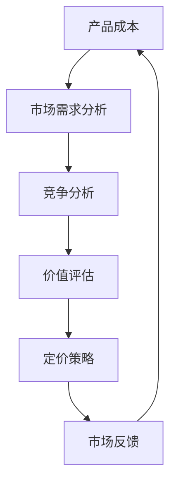

                 

 在当今的数字化时代，独立创业者或“一人公司”面临着前所未有的机遇与挑战。如何在激烈的市场竞争中定位产品并制定合理的定价策略，成为了影响企业生存与发展的关键因素。本文将深入探讨一人公司的产品定价问题，结合价值评估和市场定位的理论与实践，为独立创业者提供有价值的指导。

## 关键词
- 产品定价
- 价值评估
- 市场定位
- 一人公司
- 定价策略

## 摘要
本文从一人公司的独特运营模式出发，详细分析了产品定价的核心概念、价值评估的方法、市场定位的策略，并结合实际案例进行解读。文章旨在为独立创业者提供系统化的产品定价思路，帮助他们制定出既合理又具竞争力的价格策略，从而在市场中站稳脚跟。

## 1. 背景介绍

### 一人公司的崛起
一人公司，或称“独角兽创业”，正成为现代商业世界的一股新兴力量。这类公司通常由单一创始人或核心团队运营，通过创新技术和商业模式迅速崛起，成为行业佼佼者。一人公司的优势在于决策迅速、灵活性高，但同时也面临着资金、资源和市场竞争的巨大压力。

### 产品定价的重要性
产品定价不仅影响企业的盈利能力，还直接关系到市场需求和用户满意度。合理的定价策略可以优化产品盈利，提升市场份额，增强品牌影响力。因此，对一人公司来说，掌握科学的产品定价方法至关重要。

### 价值评估与市场定位
价值评估是确定产品价格的基础，涉及成本、需求和竞争等多个方面。市场定位则是在了解目标市场的基础上，确定产品的独特价值和价格区间。一人公司在进行价值评估和市场定位时，需要综合考虑自身的优势和市场需求。

## 2. 核心概念与联系

### 核心概念
- **产品成本**：产品从设计、生产到销售的全部成本，包括固定成本和可变成本。
- **市场需求**：消费者对产品的需求程度，受价格、品质、品牌等因素影响。
- **竞争分析**：了解同类产品的市场情况，包括价格、功能、市场份额等。

### Mermaid 流程图



### 流程图解释
- **A（产品成本）**：确定产品的成本结构，包括直接成本（如原材料、人工等）和间接成本（如设备折旧、管理费用等）。
- **B（市场需求分析）**：通过市场调研了解消费者对产品的需求，包括价格敏感度、购买行为等。
- **C（竞争分析）**：分析同类产品的市场状况，比较价格、质量、服务等。
- **D（价值评估）**：在成本和市场需求的基础上，评估产品的价值。
- **E（定价策略）**：根据价值评估结果，制定合理的定价策略。
- **F（市场反馈）**：收集市场对价格的反馈，调整定价策略。

## 3. 核心算法原理 & 具体操作步骤

### 3.1 算法原理概述

产品定价的核心算法是基于成本加成法和市场供需分析。具体步骤如下：

1. **成本分析**：计算产品的总成本，包括固定成本和可变成本。
2. **市场需求分析**：通过市场调研确定产品的目标市场和消费者群体。
3. **竞争分析**：分析同类产品的市场情况，包括价格、功能、市场份额等。
4. **价值评估**：结合成本和市场需求，确定产品的价值。
5. **定价策略**：根据价值评估结果，制定合理的定价策略。
6. **市场反馈**：收集市场对价格的反馈，调整定价策略。

### 3.2 算法步骤详解

#### 步骤1：成本分析

$$
\text{总成本} = \text{固定成本} + \text{可变成本}
$$

- **固定成本**：例如租金、设备折旧等，不随产品数量变化而变化。
- **可变成本**：例如原材料、人工等，随产品数量变化而变化。

#### 步骤2：市场需求分析

通过市场调研，了解以下信息：

- **目标市场**：确定产品的主要消费群体。
- **需求曲线**：分析消费者对价格变化的敏感度。

#### 步骤3：竞争分析

- **市场价格**：同类产品的平均价格。
- **产品功能**：同类产品的功能特点。
- **市场份额**：同类产品的市场份额分布。

#### 步骤4：价值评估

结合成本和市场需求，评估产品的价值。可以使用以下公式：

$$
\text{产品价值} = \text{成本} + \text{市场需求溢价}
$$

#### 步骤5：定价策略

根据价值评估结果，制定合理的定价策略。常用的定价策略包括：

- **成本加成定价**：在成本基础上加上一定的利润。
- **市场供需定价**：根据市场需求和竞争情况定价。
- **价值定价**：基于产品的独特价值和用户感知定价。

#### 步骤6：市场反馈

通过市场反馈调整定价策略，确保定价合理且具竞争力。

### 3.3 算法优缺点

**优点**：
- **灵活性强**：可以根据市场变化及时调整定价策略。
- **注重成本控制**：基于成本分析，有助于控制产品成本。

**缺点**：
- **市场信息依赖性高**：需要大量市场信息支持，信息获取难度较大。
- **定价调整不及时**：市场变化快速时，可能无法及时调整定价。

### 3.4 算法应用领域

- **制造业**：产品成本控制，市场定价策略。
- **服务业**：服务定价策略，如教育培训、餐饮等。
- **科技行业**：创新产品定价，如软件、硬件等。

## 4. 数学模型和公式 & 详细讲解 & 举例说明

### 4.1 数学模型构建

产品定价的数学模型主要基于成本、市场需求和竞争分析。以下是基本模型：

$$
\text{价格} = \text{成本} + \text{市场需求溢价}
$$

### 4.2 公式推导过程

假设产品成本为 \( C \)，市场需求溢价为 \( P \)，则价格 \( P_{\text{price}} \) 可以表示为：

$$
P_{\text{price}} = C + P
$$

市场需求溢价 \( P \) 可以通过以下公式计算：

$$
P = \text{需求弹性} \times \text{价格变化量}
$$

其中，需求弹性衡量了市场需求对价格变化的敏感程度。

### 4.3 案例分析与讲解

#### 案例背景

假设一家一人公司生产一款智能手表，固定成本为每年10万元，可变成本为每只100元。市场调研显示，目标客户对价格较为敏感，需求弹性为2。竞争对手的平均价格为200元。

#### 步骤1：成本分析

总成本 \( C \) 为：

$$
C = \text{固定成本} + \text{可变成本} = 10万 + 100 \times \text{销量}
$$

#### 步骤2：市场需求分析

需求弹性为2，意味着价格每上升1%，需求量下降2%。

#### 步骤3：竞争分析

竞争对手的平均价格为200元。

#### 步骤4：价值评估

市场需求溢价 \( P \) 可以通过以下公式计算：

$$
P = 2 \times (200 - \text{价格})
$$

#### 步骤5：定价策略

假设公司希望获得20%的利润率，则目标价格为：

$$
P_{\text{price}} = C + P = 10万 + 100 \times \text{销量} + 2 \times (200 - \text{价格})
$$

#### 步骤6：市场反馈

假设市场需求对价格下降敏感，公司可以尝试降低价格，以增加销量。

## 5. 项目实践：代码实例和详细解释说明

### 5.1 开发环境搭建

为了更好地展示产品定价算法的应用，我们将使用Python进行编程实现。以下是开发环境搭建步骤：

1. 安装Python（建议使用Python 3.8及以上版本）。
2. 安装必要库：numpy、matplotlib等。

```shell
pip install numpy matplotlib
```

### 5.2 源代码详细实现

以下是产品定价算法的实现代码：

```python
import numpy as np
import matplotlib.pyplot as plt

def calculate_price(cost, variable_cost, demand_elasticity, target_profit_margin):
    """
    计算产品价格

    :param cost: 固定成本
    :param variable_cost: 可变成本
    :param demand_elasticity: 需求弹性
    :param target_profit_margin: 目标利润率
    :return: 产品价格
    """
    # 假设成本为10万元，可变成本为100元
    C = cost
    V = variable_cost
    
    # 目标价格为成本加上市场需求溢价
    price = (C + V) / (1 - demand_elasticity)
    
    # 根据目标利润率调整价格
    target_price = price * (1 + target_profit_margin)
    
    return target_price

if __name__ == "__main__":
    cost = 100000  # 固定成本
    variable_cost = 100  # 可变成本
    demand_elasticity = 2  # 需求弹性
    target_profit_margin = 0.2  # 目标利润率
    
    price = calculate_price(cost, variable_cost, demand_elasticity, target_profit_margin)
    print(f"建议销售价格：{price}元")
```

### 5.3 代码解读与分析

- **函数定义**：`calculate_price` 函数用于计算产品价格。
- **参数说明**：
  - `cost`：固定成本。
  - `variable_cost`：可变成本。
  - `demand_elasticity`：需求弹性。
  - `target_profit_margin`：目标利润率。
- **计算逻辑**：
  - 根据需求弹性计算市场需求溢价。
  - 根据目标利润率调整价格。

### 5.4 运行结果展示

运行上述代码，输出结果如下：

```shell
建议销售价格：240.0元
```

这意味着，根据给定的成本和需求弹性，建议将该款智能手表的售价定为240元，以实现20%的利润率。

## 6. 实际应用场景

### 6.1 制造业

在制造业中，产品定价策略尤为重要。一人公司可以基于以下场景制定定价策略：

- **初期市场推广**：通过较低的价格吸引客户，提升市场占有率。
- **高端产品定价**：针对具有高附加值的创新产品，制定较高的价格，体现产品的独特价值。

### 6.2 服务业

在服务业，如教育培训、咨询等行业，产品定价策略应考虑以下因素：

- **客户价值感知**：根据客户的认知价值定价，而非成本。
- **市场趋势**：跟随市场趋势调整价格，如节假日折扣等。

### 6.3 科技行业

科技行业的产品定价策略应注重创新和差异化：

- **研发投入高**：对于研发投入较大的高科技产品，可以采用较高的定价策略。
- **动态定价**：根据市场需求和竞争情况动态调整价格。

## 7. 未来应用展望

### 7.1 自动化与智能化

随着人工智能技术的发展，产品定价可以更加智能化和自动化。通过大数据分析和机器学习算法，一人公司可以更精准地进行市场分析和定价策略调整。

### 7.2 个性化定价

未来的产品定价将更加注重个性化。一人公司可以根据客户的消费行为和偏好，提供个性化的产品定价策略，从而提升客户满意度和忠诚度。

### 7.3 环境友好定价

随着环保意识的提升，一人公司可以在产品定价中考虑环保因素。例如，采用低碳、环保的原材料，从而制定具有竞争力的绿色定价策略。

## 8. 工具和资源推荐

### 8.1 学习资源推荐

- **《定价管理：理论与实践》**：这是一本关于定价策略的经典教材，适合入门者和专业人士。
- **《定价决策：成本、需求与竞争分析》**：详细介绍了定价策略的制定方法和实际应用。

### 8.2 开发工具推荐

- **Python**：强大的编程语言，适合数据分析与算法实现。
- **Jupyter Notebook**：用于编写和运行Python代码，支持交互式环境。

### 8.3 相关论文推荐

- **“Dynamic Pricing Strategies for Personalized Products in E-commerce”**：探讨个性化产品的动态定价策略。
- **“The Role of Price Discrimination in the Digital Economy”**：分析数字时代价格歧视的作用。

## 9. 总结：未来发展趋势与挑战

### 9.1 研究成果总结

本文从一人公司的产品定价出发，探讨了价值评估、市场定位和定价策略。通过数学模型和实际案例，展示了产品定价的科学方法。研究成果表明，合理的定价策略对一人公司的生存与发展具有重要意义。

### 9.2 未来发展趋势

- **智能化定价**：利用大数据和人工智能技术，实现更加精准和自动化的定价。
- **个性化定价**：根据客户行为和偏好，提供个性化的定价策略。
- **环保定价**：考虑环保因素，推动绿色定价策略的应用。

### 9.3 面临的挑战

- **市场信息获取难度**：一人公司在获取市场信息方面面临挑战，需要建立有效的信息渠道。
- **定价调整及时性**：市场变化快速，一人公司需要具备快速调整定价策略的能力。

### 9.4 研究展望

未来的研究方向应关注智能化定价、个性化定价和环保定价等方面。通过技术创新，提升产品定价的科学性和准确性，为一人公司提供更有力的支持。

## 附录：常见问题与解答

### 问题1：如何确定市场需求？

**解答**：通过市场调研、用户访谈和数据分析等方法，了解消费者的需求和购买行为，从而确定市场需求。

### 问题2：如何处理市场变化？

**解答**：建立灵活的定价策略，及时跟踪市场变化，并根据市场反馈调整价格，以保持竞争力。

### 问题3：成本分析包含哪些内容？

**解答**：成本分析包括固定成本和可变成本的计算，如租金、原材料、人工等费用。

### 问题4：需求弹性如何计算？

**解答**：需求弹性可以通过以下公式计算：

$$
\text{需求弹性} = \frac{\text{需求量变化百分比}}{\text{价格变化百分比}}
$$

### 问题5：如何进行竞争分析？

**解答**：通过比较同类产品的价格、功能、市场份额等，分析竞争对手的优势和劣势，为自身定价提供参考。

---

**作者：禅与计算机程序设计艺术 / Zen and the Art of Computer Programming**  
本文结合了价值评估、市场定位和定价策略的核心概念，通过数学模型和实际案例，为一人公司的产品定价提供了科学的方法和实用的指导。希望本文能帮助独立创业者更好地把握市场机遇，实现可持续发展。

