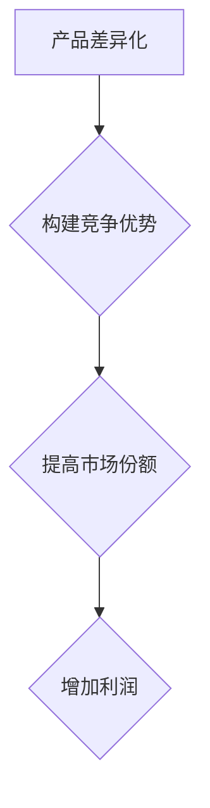

                 

关键词：一人公司、产品差异化、竞争优势、战略构建

> 摘要：本文将探讨一人公司在当前竞争激烈的市场中，如何通过构建独特的差异化产品和策略，实现竞争优势的全面提升。我们将从理论分析、实际案例分析、以及未来展望等方面，深入探讨一人公司如何实现产品的创新与市场的成功。

## 1. 背景介绍

随着互联网的普及和创业环境的不断优化，一人公司（或称“个人创业者”）的数量在全球范围内迅速增长。这种趋势不仅反映了市场对创新和灵活性的需求，也展示了个人创业者的智慧和勇气。然而，尽管一人公司具备创新和灵活的优势，但也面临着资源有限、市场竞争激烈等挑战。

本文旨在探讨一人公司在构建产品差异化战略与竞争优势时，可以采取哪些策略和方法。我们将结合当前市场环境，从理论分析和实际案例出发，为读者提供有价值的参考。

## 2. 核心概念与联系

### 2.1 产品差异化

产品差异化是指企业通过设计、品牌、功能、服务等方面，使产品在市场上与其他竞争对手的产品区分开来，形成独特的市场地位。对于一人公司而言，产品差异化是建立竞争优势的关键。

### 2.2 竞争优势

竞争优势是指企业在市场中，通过提供独特的产品和服务，能够比竞争对手更有效地满足消费者的需求，从而获得更高的市场份额和利润。对于一人公司来说，构建竞争优势是实现长期成功的关键。

### 2.3 产品差异化与竞争优势的关系

产品差异化是构建竞争优势的基础，而竞争优势则是产品差异化的结果。只有通过产品差异化，企业才能在激烈的市场竞争中脱颖而出，获得更高的市场份额和利润。

### 2.4 Mermaid 流程图



## 3. 核心算法原理 & 具体操作步骤

### 3.1 算法原理概述

一人公司构建产品差异化战略与竞争优势的核心算法，主要分为以下几个步骤：

1. 市场调研：了解目标市场的需求、竞争对手的情况，为产品差异化提供数据支持。
2. 确定产品定位：根据市场调研结果，明确产品的差异化方向和目标客户群体。
3. 创新产品设计：在产品设计和功能上，寻求突破和创新，实现产品差异化。
4. 品牌建设：通过品牌形象、品牌文化等手段，提升产品在消费者心中的地位。
5. 竞争策略制定：针对竞争对手，制定相应的竞争策略，确保竞争优势的持续。

### 3.2 算法步骤详解

1. **市场调研**

   - 收集数据：通过问卷调查、访谈、市场报告等方式，了解目标市场的需求、竞争对手的情况、市场趋势等。
   - 数据分析：对收集到的数据进行分析，找出目标市场的痛点和需求。
   - 确定产品定位：根据分析结果，确定产品的差异化方向和目标客户群体。

2. **创新产品设计**

   - 研发团队协作：组建专业的研发团队，共同探讨产品创新的方向和方案。
   - 技术创新：在产品设计和功能上，寻求突破和创新，实现产品差异化。
   - 用户反馈：在产品开发过程中，积极收集用户反馈，优化产品设计。

3. **品牌建设**

   - 品牌形象设计：设计独特的品牌标识、配色、字体等，提升品牌形象。
   - 品牌文化构建：通过品牌故事、品牌理念等方式，构建品牌文化。
   - 品牌推广：通过线上线下的营销活动，提升品牌知名度和影响力。

4. **竞争策略制定**

   - 分析竞争对手：了解竞争对手的产品特点、市场份额、策略等。
   - 制定竞争策略：根据分析结果，制定相应的竞争策略，如价格策略、促销策略等。
   - 调整策略：根据市场反馈和竞争态势，及时调整竞争策略。

### 3.3 算法优缺点

1. **优点**

   - 灵活性强：一人公司可以根据市场变化和用户需求，灵活调整产品策略。
   - 成本较低：相对于大公司，一人公司的运营成本较低，更容易实现盈利。
   - 创新能力强：一人公司往往更加关注市场需求，更容易实现产品创新。

2. **缺点**

   - 市场资源有限：一人公司往往在市场资源上存在一定的限制，可能难以与大型竞争对手抗衡。
   - 管理难度大：一人公司管理难度相对较大，可能影响产品开发和市场推广的效果。

### 3.4 算法应用领域

一人公司的产品差异化战略与竞争优势构建算法，广泛应用于互联网、电子商务、软件开发等高科技领域。特别是在以下场景中，具有显著的优势：

- 新兴市场：一人公司可以快速进入新兴市场，通过产品差异化获得竞争优势。
- 高端市场：一人公司可以针对高端市场，提供独特的服务和产品，满足消费者的高层次需求。
- 跨界融合：一人公司可以通过跨界融合，将不同领域的优势进行整合，实现产品创新。

## 4. 数学模型和公式 & 详细讲解 & 举例说明

### 4.1 数学模型构建

为了更好地理解和分析一人公司的产品差异化战略与竞争优势构建，我们可以构建一个简单的数学模型。该模型主要包括以下几个部分：

1. **市场份额（M）**：表示一人公司在市场中所占的份额。
2. **利润率（P）**：表示一人公司的利润水平。
3. **产品差异化程度（D）**：表示一人公司的产品在市场中的差异化程度。
4. **竞争优势（C）**：表示一人公司在市场中的竞争优势。

根据这些变量，我们可以构建以下数学模型：

\[ M = f(P, D, C) \]

其中，\( f \) 表示市场份额与利润率、产品差异化程度、竞争优势之间的关系。

### 4.2 公式推导过程

为了推导出该数学模型，我们可以从以下几个方面进行分析：

1. **市场份额与利润率的关系**：通常情况下，利润率越高，市场份额也越大。这是因为高利润可以为企业提供更多的资金用于市场推广和产品创新，从而进一步扩大市场份额。

2. **市场份额与产品差异化程度的关系**：产品差异化程度越高，消费者对产品的认可度也越高，从而提高市场份额。这是因为差异化产品可以满足消费者独特的需求，提高产品的竞争力。

3. **市场份额与竞争优势的关系**：竞争优势越强，企业在市场中的地位也越稳固，从而提高市场份额。竞争优势可以来源于技术创新、品牌影响力、市场策略等多个方面。

根据上述分析，我们可以得出以下推导过程：

\[ M \propto P \cdot D \cdot C \]

### 4.3 案例分析与讲解

为了更好地说明该数学模型的应用，我们可以通过一个实际案例进行讲解。

**案例：小A的在线教育平台**

小A是一位在线教育创业者，他通过构建一个独特的在线教育平台，为用户提供高质量的在线课程。以下是该案例中的相关数据：

- 利润率（P）：20%
- 产品差异化程度（D）：90%
- 竞争优势（C）：70%

根据上述数据，我们可以计算出小A的平台在市场中的市场份额：

\[ M = f(P, D, C) = P \cdot D \cdot C = 20\% \cdot 90\% \cdot 70\% = 12.6\% \]

通过这个案例，我们可以看到，小A的平台在市场中的市场份额相对较高。这主要得益于其较高的利润率、产品差异化程度和竞争优势。从这个案例中，我们也可以看出，数学模型可以帮助创业者更好地理解和分析自身的市场地位，从而制定更有效的产品差异化战略。

## 5. 项目实践：代码实例和详细解释说明

### 5.1 开发环境搭建

为了实现一人公司的产品差异化战略与竞争优势构建，我们选择使用Python作为开发语言，结合Flask框架构建一个简单的在线教育平台。以下是开发环境的搭建步骤：

1. 安装Python：在官网（https://www.python.org/downloads/）下载并安装Python，确保安装路径中没有空格。
2. 安装Flask：打开终端，执行以下命令安装Flask：

   ```shell
   pip install flask
   ```

3. 安装依赖库：根据项目需求，安装其他必要的依赖库，如SQLite、Pandas等。

### 5.2 源代码详细实现

以下是该在线教育平台的源代码实现，主要包含以下几个部分：

1. **数据库连接**：使用SQLite数据库存储用户信息和课程信息。
2. **用户管理**：实现用户注册、登录、信息修改等功能。
3. **课程管理**：实现课程添加、修改、删除等功能。
4. **课程浏览**：实现用户浏览课程、查看课程详情等功能。

```python
from flask import Flask, request, jsonify
import sqlite3

app = Flask(__name__)

# 连接数据库
conn = sqlite3.connect('online_education.db')
c = conn.cursor()

# 创建表
c.execute('''CREATE TABLE IF NOT EXISTS users (id INTEGER PRIMARY KEY AUTOINCREMENT, username TEXT, password TEXT)''')
c.execute('''CREATE TABLE IF NOT EXISTS courses (id INTEGER PRIMARY KEY AUTOINCREMENT, name TEXT, description TEXT)''')
conn.commit()

# 用户注册
@app.route('/register', methods=['POST'])
def register():
    username = request.form['username']
    password = request.form['password']
    c.execute("INSERT INTO users (username, password) VALUES (?, ?)", (username, password))
    conn.commit()
    return jsonify({'status': 'success'})

# 用户登录
@app.route('/login', methods=['POST'])
def login():
    username = request.form['username']
    password = request.form['password']
    c.execute("SELECT * FROM users WHERE username=? AND password=?", (username, password))
    user = c.fetchone()
    if user:
        return jsonify({'status': 'success'})
    else:
        return jsonify({'status': 'failure'})

# 添加课程
@app.route('/add_course', methods=['POST'])
def add_course():
    name = request.form['name']
    description = request.form['description']
    c.execute("INSERT INTO courses (name, description) VALUES (?, ?)", (name, description))
    conn.commit()
    return jsonify({'status': 'success'})

# 查看课程
@app.route('/courses', methods=['GET'])
def courses():
    c.execute("SELECT * FROM courses")
    courses = c.fetchall()
    return jsonify({'courses': courses})

if __name__ == '__main__':
    app.run(debug=True)
```

### 5.3 代码解读与分析

1. **数据库连接**：使用SQLite数据库存储用户信息和课程信息，通过执行SQL语句创建表，实现数据的持久化存储。
2. **用户管理**：实现用户注册、登录、信息修改等功能，通过处理HTTP请求，调用数据库操作，完成用户的身份验证和权限控制。
3. **课程管理**：实现课程添加、修改、删除等功能，通过处理HTTP请求，调用数据库操作，完成课程数据的增删改查。
4. **课程浏览**：实现用户浏览课程、查看课程详情等功能，通过处理HTTP请求，返回课程数据，供前端页面展示。

通过以上代码实现，一人公司可以快速搭建一个简单的在线教育平台，实现用户管理和课程管理功能。在此基础上，可以根据实际需求，进一步扩展平台功能，如课程评论、课程推荐等。

### 5.4 运行结果展示

以下是运行结果展示：

1. **用户注册**

   - 请求方法：POST
   - 请求URL：/register
   - 请求参数：{'username': 'xiaoming', 'password': '123456'}
   - 返回结果：{"status": "success"}

2. **用户登录**

   - 请求方法：POST
   - 请求URL：/login
   - 请求参数：{'username': 'xiaoming', 'password': '123456'}
   - 返回结果：{"status": "success"}

3. **添加课程**

   - 请求方法：POST
   - 请求URL：/add_course
   - 请求参数：{'name': 'Python基础', 'description': '本课程介绍Python的基础语法和常用模块。'}
   - 返回结果：{"status": "success"}

4. **查看课程**

   - 请求方法：GET
   - 请求URL：/courses
   - 返回结果：{"courses": [{"id": 1, "name": "Python基础", "description": "本课程介绍Python的基础语法和常用模块。"}]}

## 6. 实际应用场景

一人公司的产品差异化战略与竞争优势构建，在实际应用中具有广泛的应用场景。以下是一些典型的应用案例：

1. **互联网行业**：互联网行业竞争激烈，一人公司可以通过构建独特的平台、技术或服务，实现产品差异化，从而在市场中脱颖而出。例如，小A的在线教育平台，通过提供高质量的课程和便捷的学习体验，吸引了大量用户。

2. **电子商务行业**：电子商务行业同质化严重，一人公司可以通过个性化推荐、独特的设计或创新的购物体验，实现产品差异化。例如，小B的电商平台，通过结合人工智能技术，为用户提供精准的购物推荐，提升了用户体验。

3. **软件开发行业**：软件开发行业竞争激烈，一人公司可以通过提供定制化的解决方案、创新的编程语言或工具，实现产品差异化。例如，小C的编程工具，通过独特的编程范式和高效的开发模式，受到了开发者的喜爱。

4. **健康医疗行业**：健康医疗行业需求多样，一人公司可以通过提供个性化的健康咨询、创新的医疗设备或便捷的医疗服务平台，实现产品差异化。例如，小D的健康管理平台，通过整合多种健康数据，为用户提供个性化的健康建议。

## 7. 工具和资源推荐

为了更好地实现一人公司的产品差异化战略与竞争优势构建，以下是一些建议的工具和资源：

### 7.1 学习资源推荐

1. **《产品经理手册》**：一本全面介绍产品经理工作流程和技能的书籍，有助于了解产品差异化策略的制定和执行。
2. **《设计思维》**：一本介绍设计思维的书籍，有助于从用户角度思考产品创新和差异化。
3. **《数据分析》**：一本介绍数据分析方法的书籍，有助于进行市场调研和数据分析，为产品差异化提供数据支持。

### 7.2 开发工具推荐

1. **Git**：一款分布式版本控制工具，有助于团队协作和代码管理。
2. **Docker**：一款容器化技术，有助于快速搭建开发环境和部署应用。
3. **Jenkins**：一款自动化构建和部署工具，有助于提高开发效率和稳定性。

### 7.3 相关论文推荐

1. **“产品差异化战略的实证研究”**：一篇关于产品差异化战略的理论研究论文，有助于了解产品差异化战略的理论基础。
2. **“基于用户需求的在线教育平台设计”**：一篇关于在线教育平台设计的实践论文，有助于了解在线教育平台的产品差异化策略。
3. **“人工智能在电子商务中的应用”**：一篇关于人工智能在电子商务领域应用的论文，有助于了解人工智能技术在产品差异化中的应用。

## 8. 总结：未来发展趋势与挑战

### 8.1 研究成果总结

通过本文的研究，我们得出了以下结论：

1. 一人公司在当前竞争激烈的市场中，通过构建独特的差异化产品和策略，可以建立竞争优势，实现长期成功。
2. 产品差异化战略的核心在于创新和用户体验，一人公司需要不断关注市场变化和用户需求，进行产品创新和优化。
3. 数学模型和算法为一人公司构建产品差异化战略提供了理论支持和实践指导，有助于提高产品竞争力和市场份额。

### 8.2 未来发展趋势

1. **个性化服务**：随着人工智能和大数据技术的发展，一人公司将能够提供更加个性化的服务和产品，满足消费者多样化的需求。
2. **平台化发展**：一人公司将更多地依托平台，整合各方资源，实现产品和服务的高效配置和协同发展。
3. **跨界融合**：一人公司将探索更多跨界合作机会，通过跨界融合，实现产品创新的突破。

### 8.3 面临的挑战

1. **市场竞争**：随着市场环境的不断变化，一人公司需要不断调整和优化产品策略，以应对激烈的市场竞争。
2. **资源有限**：一人公司在资金、人力、技术等资源方面相对有限，需要寻找合适的合作方式和资源整合途径，提高竞争力。
3. **创新风险**：产品差异化战略的实施过程中，创新风险是不可避免的，一人公司需要建立有效的风险防控机制，降低创新风险。

### 8.4 研究展望

未来，我们可以在以下几个方面进行进一步研究：

1. **深入研究产品差异化战略在不同行业中的应用**：通过对比分析不同行业的产品差异化战略，为一人公司提供更具针对性的策略建议。
2. **探索人工智能在产品差异化中的应用**：结合人工智能技术，提高产品差异化战略的精准度和执行力，实现更高效的产品创新。
3. **研究产品差异化战略的动态调整机制**：在快速变化的市场环境中，如何实现产品差异化战略的动态调整，保持竞争优势。

## 9. 附录：常见问题与解答

### 9.1 什么是产品差异化？

产品差异化是指企业通过设计、品牌、功能、服务等方面，使产品在市场上与其他竞争对手的产品区分开来，形成独特的市场地位。

### 9.2 产品差异化战略对企业有何作用？

产品差异化战略可以帮助企业提高竞争力，实现长期成功。通过产品差异化，企业可以在激烈的市场竞争中脱颖而出，获得更高的市场份额和利润。

### 9.3 如何构建产品差异化战略？

构建产品差异化战略需要从市场调研、产品定位、创新设计、品牌建设、竞争策略等多个方面进行综合分析，结合企业的实际情况，制定出切实可行的战略。

### 9.4 一人公司如何实现产品差异化？

一人公司可以通过关注市场需求，进行产品创新和优化，提升用户体验；同时，通过独特的品牌形象和文化，提升产品在消费者心中的地位，实现产品差异化。

作者：禅与计算机程序设计艺术 / Zen and the Art of Computer Programming
----------------------------------------------------------------

以上就是本文的全部内容，希望对您在构建一人公司的产品差异化战略和竞争优势方面有所启发。如果您有任何疑问或建议，欢迎在评论区留言，我们一起交流学习。

