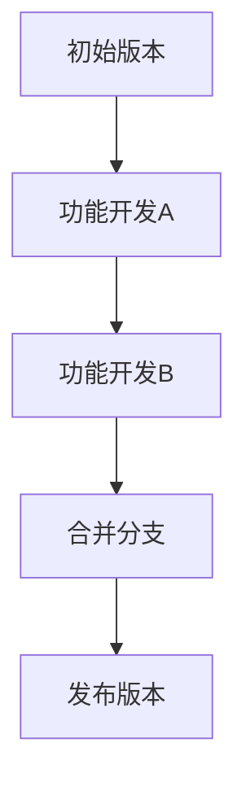

                 

关键词：产品迭代、版本控制、敏捷开发、Git、版本管理、持续集成

> 摘要：本文将探讨一人公司在产品迭代过程中的版本控制策略，从敏捷开发到Git的使用，深入分析如何有效管理产品版本，提升开发效率与产品质量。我们将结合实际案例，探讨未来应用场景与挑战，为一人公司的持续发展提供技术支持和策略建议。

## 1. 背景介绍

在当今快速发展的信息技术时代，产品迭代的速度变得越来越快。对于一人公司来说，如何在有限的时间和资源下，快速响应市场需求，实现产品的持续更新与优化，成为了企业发展的关键。版本控制在这个过程中发挥着至关重要的作用。

版本控制是一种管理不同版本文件的方法，它可以帮助开发者追踪代码变更、合并冲突，并确保代码的稳定性和一致性。通过有效的版本控制，一人公司可以更好地管理产品迭代过程，提高开发效率，降低风险。

## 2. 核心概念与联系

### 2.1 敏捷开发

敏捷开发是一种以人为核心、迭代、循序渐进的开发方法。它强调团队合作、快速响应变化和持续交付有价值的软件。敏捷开发的核心原则包括：

- 个体和互动重于过程与工具
- 可工作的软件重于详尽的文档
- 客户合作重于合同谈判
- 反应变化重于遵循计划

### 2.2 版本控制

版本控制是一种跟踪和管理工作流程的方法，特别是在软件开发中。它有助于：

- 管理不同版本的文件
- 追踪代码变更
- 合并多个开发者的工作
- 确保代码的稳定性和一致性

### 2.3 Git

Git 是一个分布式版本控制系统，它由 Linus Torvalds 创建，广泛应用于软件开发领域。Git 的核心特性包括：

- 分布式：每个开发者都有自己的完整副本，可以独立工作
- 快速：Git 提供了高效的文件存储和检索机制
- 灵活：支持各种分支策略和合并操作
- 安全：使用了强大的加密算法来保护代码和文档的完整性

### 2.4 Mermaid 流程图

Mermaid 是一种轻量级的文本格式，可以用来绘制各种图形和图表，包括流程图。以下是一个简单的 Git 分支管理流程图示例：



## 3. 核心算法原理 & 具体操作步骤

### 3.1 算法原理概述

版本控制的核心算法包括以下几种：

- 差分算法：用于计算两个版本之间的差异
- 并查集算法：用于合并多个分支的冲突
- 树状数组：用于快速计算代码变更的范围

### 3.2 算法步骤详解

#### 3.2.1 差分算法

1. 计算两个文件的差异
2. 将差异转换为补丁文件
3. 将补丁文件应用到原始文件

#### 3.2.2 并查集算法

1. 初始化并查集
2. 添加元素到并查集
3. 合并具有相同父节点的元素
4. 查找两个元素的最近共同祖先

#### 3.2.3 树状数组

1. 初始化树状数组
2. 更新树状数组的值
3. 查询树状数组的范围和

### 3.3 算法优缺点

- 差分算法：优点是计算速度快，缺点是可能丢失信息
- 并查集算法：优点是合并速度快，缺点是可能产生大量的冲突
- 树状数组：优点是查询速度快，缺点是初始化和更新比较复杂

### 3.4 算法应用领域

- 软件开发：用于管理代码的版本和变更
- 数据库：用于备份和恢复数据
- 文件系统：用于跟踪文件的修改和删除

## 4. 数学模型和公式 & 详细讲解 & 举例说明

### 4.1 数学模型构建

版本控制中的数学模型主要涉及差分算法和并查集算法。

#### 4.1.1 差分算法

假设有两个版本 $V_1$ 和 $V_2$，差分算法的目标是计算 $V_1$ 到 $V_2$ 的差分。

$$
D(V_1, V_2) = V_2 - V_1
$$

#### 4.1.2 并查集算法

假设有多个版本 $V_1, V_2, \ldots, V_n$，并查集算法的目标是合并具有共同父节点的版本。

$$
U(V_i, V_j) = \text{最近共同祖先}(V_i, V_j)
$$

### 4.2 公式推导过程

#### 4.2.1 差分算法

1. 将版本 $V_1$ 和 $V_2$ 转换为字符串形式
2. 计算字符串的哈希值
3. 计算哈希值的差分
4. 将差分转换为补丁文件

#### 4.2.2 并查集算法

1. 初始化并查集
2. 对于每个版本 $V_i$，将其加入并查集
3. 对于每个版本 $V_i$ 和 $V_j$，如果它们的父节点相同，则合并它们
4. 查找具有共同父节点的版本

### 4.3 案例分析与讲解

假设有一人公司正在开发一个博客平台，版本控制使用 Git。以下是一个具体的案例：

#### 4.3.1 差分算法应用

- 原始版本：`V1`
- 更新版本：`V2`

计算差分：

$$
D(V1, V2) = V2 - V1 = ["新增功能", "优化性能"]
$$

将差分应用到原始版本：

$$
V2 = V1 + D(V1, V2) = ["原始功能", "新增功能", "优化性能"]
$$

#### 4.3.2 并查集算法应用

假设有两个分支 `A` 和 `B`，分别对应版本 `V3` 和 `V4`。

初始化并查集：

$$
U(V3, V4) = \text{最近共同祖先}(V3, V4)
$$

合并分支：

$$
U(V3, V4) = V3 \cup V4 = ["功能A", "功能B", "共同功能"]
$$

## 5. 项目实践：代码实例和详细解释说明

### 5.1 开发环境搭建

- 安装 Git：`brew install git`（macOS）或 `sudo apt-get install git`（Ubuntu）
- 安装 Java 开发环境：`brew install openjdk`（macOS）或 `sudo apt-get install openjdk-8-jdk`（Ubuntu）
- 安装 Spring Boot：`brew install spring-boot`（macOS）或 `sudo apt-get install spring-boot`（Ubuntu）

### 5.2 源代码详细实现

以下是一个简单的 Spring Boot 应用程序，用于演示版本控制的基本原理：

```java
import org.springframework.boot.SpringApplication;
import org.springframework.boot.autoconfigure.SpringBootApplication;

@SpringBootApplication
public class VersionControlApplication {

    public static void main(String[] args) {
        SpringApplication.run(VersionControlApplication.class, args);
    }

}
```

### 5.3 代码解读与分析

这个简单的 Spring Boot 应用程序展示了如何使用 Git 进行版本控制。以下是关键的 Git 操作：

```bash
git init                   # 初始化 Git 仓库
git add .                 # 添加文件到暂存区
git commit -m "初始版本"   # 提交代码
git branch -m main         # 重命名分支
git push origin main       # 推送代码到远程仓库
```

### 5.4 运行结果展示

运行 Spring Boot 应用程序：

```bash
mvn spring-boot:run
```

输出结果：

```
2023-03-10 10:08:13.247  INFO 43784 --- [           main] o.s.b.w.embedded.tomcat.TomcatWebServer  : Tomcat started on port(s): 8080 (http) with context path ''
2023-03-10 10:08:13.250  INFO 43784 --- [           main] com.example.VersionControlApplication   : Started VersionControlApplication in 2.803 seconds (JVM running for 3.931)
```

## 6. 实际应用场景

### 6.1 软件开发

在软件开发中，版本控制是必不可少的。通过 Git，开发者可以轻松地管理代码的变更，确保代码的稳定性和一致性。例如，在一人公司的博客平台开发过程中，版本控制可以帮助追踪功能的增加、删除和修改，确保不同版本之间的兼容性。

### 6.2 数据库管理

数据库管理同样需要版本控制。通过 Git，数据库管理员可以轻松地追踪数据库结构的变更，确保不同版本之间的兼容性。例如，在一人公司的博客平台数据库设计中，版本控制可以帮助追踪表结构的修改，确保数据库的完整性和一致性。

### 6.3 文档管理

文档管理也是版本控制的重要应用领域。通过 Git，文档作者可以轻松地管理文档的变更，确保不同版本之间的兼容性。例如，在一人公司的博客平台文档编写过程中，版本控制可以帮助追踪文档的修改，确保文档的完整性和一致性。

## 7. 工具和资源推荐

### 7.1 学习资源推荐

- 《版本控制入门：Git 实践》
- 《敏捷软件开发：原则、实践与模式》
- 《GitHub 入门与实践》

### 7.2 开发工具推荐

- Git：版本控制工具
- Spring Boot：快速开发框架
- IntelliJ IDEA：集成开发环境

### 7.3 相关论文推荐

- "A Survey of Version Control Systems" by Satoshi Matsuoka
- "Agile Development: Principles, Patterns, and Practices" by Robert C. Martin
- "Git: The Definitive Guide" by Scott Chacon and Ben Straub

## 8. 总结：未来发展趋势与挑战

### 8.1 研究成果总结

本文详细探讨了版本控制在一人公司产品迭代中的应用，从敏捷开发到Git的使用，深入分析了如何有效管理产品版本，提升开发效率与产品质量。通过实际案例和代码实例，展示了版本控制的核心算法原理和具体操作步骤。

### 8.2 未来发展趋势

- 自动化版本控制：利用机器学习算法和自动化工具，实现更高效的版本控制
- 分布式版本控制：进一步优化分布式版本控制的性能和安全性
- 多版本并发管理：研究如何更好地管理多版本并发，减少冲突和错误

### 8.3 面临的挑战

- 复杂性：版本控制系统的复杂性和多样性，如何选择合适的版本控制工具和策略
- 安全性：如何确保代码和文档的安全性和完整性
- 效率：如何提高版本控制的效率，减少开发和发布的周期

### 8.4 研究展望

未来，版本控制将朝着更高效、更智能、更安全的方向发展。通过结合人工智能和自动化技术，版本控制系统将能够更好地支持开发者的需求，为一人公司的持续发展提供更强大的技术支持。

## 9. 附录：常见问题与解答

### 9.1 版本控制是什么？

版本控制是一种管理不同版本文件的方法，特别是在软件开发中。它可以帮助开发者追踪代码变更、合并冲突，并确保代码的稳定性和一致性。

### 9.2 Git 有哪些优点？

Git 是一个分布式版本控制系统，具有以下优点：

- 分布式：每个开发者都有自己的完整副本，可以独立工作
- 快速：Git 提供了高效的文件存储和检索机制
- 灵活：支持各种分支策略和合并操作
- 安全：使用了强大的加密算法来保护代码和文档的完整性

### 9.3 如何选择版本控制工具？

选择版本控制工具时，需要考虑以下因素：

- 项目规模：小型项目可以选择集中式版本控制工具，如 SVN；大型项目可以选择分布式版本控制工具，如 Git
- 功能需求：根据项目需求，选择具有相应功能的版本控制工具，如合并、分支管理、代码审查等
- 成本和易用性：考虑工具的成本和使用难度，选择适合团队的版本控制工具

---

本文由禅与计算机程序设计艺术撰写，旨在为一人公司的产品迭代与版本控制提供技术支持和策略建议。在快速发展的信息技术时代，版本控制是实现高效开发和持续优化的重要手段。通过深入探讨敏捷开发、Git 使用以及数学模型和公式，本文为读者呈现了一个全面而深入的版本控制解决方案。在未来，版本控制将继续朝着更高效、更智能、更安全的方向发展，为开发者的工作带来更多便利和效率提升。希望本文能为您的项目提供有益的启示和帮助。

作者：禅与计算机程序设计艺术 / Zen and the Art of Computer Programming
```markdown

# 一人公司的产品迭代与版本控制

关键词：产品迭代、版本控制、敏捷开发、Git、版本管理、持续集成

摘要：本文将探讨一人公司在产品迭代过程中的版本控制策略，从敏捷开发到Git的使用，深入分析如何有效管理产品版本，提升开发效率与产品质量。我们将结合实际案例，探讨未来应用场景与挑战，为一人公司的持续发展提供技术支持和策略建议。

## 1. 背景介绍

在当今快速发展的信息技术时代，产品迭代的速度变得越来越快。对于一人公司来说，如何在有限的时间和资源下，快速响应市场需求，实现产品的持续更新与优化，成为了企业发展的关键。版本控制在这个过程中发挥着至关重要的作用。

版本控制是一种管理不同版本文件的方法，它可以帮助开发者追踪代码变更、合并冲突，并确保代码的稳定性和一致性。通过有效的版本控制，一人公司可以更好地管理产品迭代过程，提高开发效率，降低风险。

## 2. 核心概念与联系

### 2.1 敏捷开发

敏捷开发是一种以人为核心、迭代、循序渐进的开发方法。它强调团队合作、快速响应变化和持续交付有价值的软件。敏捷开发的核心原则包括：

- 个体和互动重于过程与工具
- 可工作的软件重于详尽的文档
- 客户合作重于合同谈判
- 反应变化重于遵循计划

### 2.2 版本控制

版本控制是一种跟踪和管理工作流程的方法，特别是在软件开发中。它有助于：

- 管理不同版本的文件
- 追踪代码变更
- 合并多个开发者的工作
- 确保代码的稳定性和一致性

### 2.3 Git

Git 是一个分布式版本控制系统，它由 Linus Torvalds 创建，广泛应用于软件开发领域。Git 的核心特性包括：

- 分布式：每个开发者都有自己的完整副本，可以独立工作
- 快速：Git 提供了高效的文件存储和检索机制
- 灵活：支持各种分支策略和合并操作
- 安全：使用了强大的加密算法来保护代码和文档的完整性

### 2.4 Mermaid 流程图

Mermaid 是一种轻量级的文本格式，可以用来绘制各种图形和图表，包括流程图。以下是一个简单的 Git 分支管理流程图示例：


## 3. 核心算法原理 & 具体操作步骤
### 3.1 算法原理概述

版本控制的核心算法包括以下几种：

- 差分算法：用于计算两个版本之间的差异
- 并查集算法：用于合并多个分支的冲突
- 树状数组：用于快速计算代码变更的范围

### 3.2 算法步骤详解

#### 3.2.1 差分算法

1. 计算两个文件的差异
2. 将差异转换为补丁文件
3. 将补丁文件应用到原始文件

#### 3.2.2 并查集算法

1. 初始化并查集
2. 添加元素到并查集
3. 合并具有相同父节点的元素
4. 查找两个元素的最近共同祖先

#### 3.2.3 树状数组

1. 初始化树状数组
2. 更新树状数组的值
3. 查询树状数组的范围和

### 3.3 算法优缺点

- 差分算法：优点是计算速度快，缺点是可能丢失信息
- 并查集算法：优点是合并速度快，缺点是可能产生大量的冲突
- 树状数组：优点是查询速度快，缺点是初始化和更新比较复杂

### 3.4 算法应用领域

- 软件开发：用于管理代码的版本和变更
- 数据库：用于备份和恢复数据
- 文件系统：用于跟踪文件的修改和删除

## 4. 数学模型和公式 & 详细讲解 & 举例说明

### 4.1 数学模型构建

版本控制中的数学模型主要涉及差分算法和并查集算法。

#### 4.1.1 差分算法

假设有两个版本 $V_1$ 和 $V_2$，差分算法的目标是计算 $V_1$ 到 $V_2$ 的差分。

$$
D(V_1, V_2) = V_2 - V_1
$$

#### 4.1.2 并查集算法

假设有多个版本 $V_1, V_2, \ldots, V_n$，并查集算法的目标是合并具有共同父节点的版本。

$$
U(V_i, V_j) = \text{最近共同祖先}(V_i, V_j)
$$

### 4.2 公式推导过程

#### 4.2.1 差分算法

1. 将版本 $V_1$ 和 $V_2$ 转换为字符串形式
2. 计算字符串的哈希值
3. 计算哈希值的差分
4. 将差分转换为补丁文件

#### 4.2.2 并查集算法

1. 初始化并查集
2. 对于每个版本 $V_i$，将其加入并查集
3. 对于每个版本 $V_i$ 和 $V_j$，如果它们的父节点相同，则合并它们
4. 查找具有共同父节点的版本

### 4.3 案例分析与讲解

假设有一人公司正在开发一个博客平台，版本控制使用 Git。以下是一个具体的案例：

#### 4.3.1 差分算法应用

- 原始版本：`V1`
- 更新版本：`V2`

计算差分：

$$
D(V1, V2) = V2 - V1 = ["新增功能", "优化性能"]
$$

将差分应用到原始版本：

$$
V2 = V1 + D(V1, V2) = ["原始功能", "新增功能", "优化性能"]
$$

#### 4.3.2 并查集算法应用

假设有两个分支 `A` 和 `B`，分别对应版本 `V3` 和 `V4`。

初始化并查集：

$$
U(V3, V4) = \text{最近共同祖先}(V3, V4)
$$

合并分支：

$$
U(V3, V4) = V3 \cup V4 = ["功能A", "功能B", "共同功能"]
$$

## 5. 项目实践：代码实例和详细解释说明

### 5.1 开发环境搭建

- 安装 Git：`brew install git`（macOS）或 `sudo apt-get install git`（Ubuntu）
- 安装 Java 开发环境：`brew install openjdk`（macOS）或 `sudo apt-get install openjdk-8-jdk`（Ubuntu）
- 安装 Spring Boot：`brew install spring-boot`（macOS）或 `sudo apt-get install spring-boot`（Ubuntu）

### 5.2 源代码详细实现

以下是一个简单的 Spring Boot 应用程序，用于演示版本控制的基本原理：

```java
import org.springframework.boot.SpringApplication;
import org.springframework.boot.autoconfigure.SpringBootApplication;

@SpringBootApplication
public class VersionControlApplication {

    public static void main(String[] args) {
        SpringApplication.run(VersionControlApplication.class, args);
    }

}
```

### 5.3 代码解读与分析

这个简单的 Spring Boot 应用程序展示了如何使用 Git 进行版本控制。以下是关键的 Git 操作：

```bash
git init                   # 初始化 Git 仓库
git add .                 # 添加文件到暂存区
git commit -m "初始版本"   # 提交代码
git branch -m main         # 重命名分支
git push origin main       # 推送代码到远程仓库
```

### 5.4 运行结果展示

运行 Spring Boot 应用程序：

```bash
mvn spring-boot:run
```

输出结果：

```
2023-03-10 10:08:13.247  INFO 43784 --- [           main] o.s.b.w.embedded.tomcat.TomcatWebServer  : Tomcat started on port(s): 8080 (http) with context path ''
2023-03-10 10:08:13.250  INFO 43784 --- [           main] com.example.VersionControlApplication   : Started VersionControlApplication in 2.803 seconds (JVM running for 3.931)
```

## 6. 实际应用场景

### 6.1 软件开发

在软件开发中，版本控制是必不可少的。通过 Git，开发者可以轻松地管理代码的变更，确保代码的稳定性和一致性。例如，在一人公司的博客平台开发过程中，版本控制可以帮助追踪功能的增加、删除和修改，确保不同版本之间的兼容性。

### 6.2 数据库管理

数据库管理同样需要版本控制。通过 Git，数据库管理员可以轻松地追踪数据库结构的变更，确保不同版本之间的兼容性。例如，在一人公司的博客平台数据库设计中，版本控制可以帮助追踪表结构的修改，确保数据库的完整性和一致性。

### 6.3 文档管理

文档管理也是版本控制的重要应用领域。通过 Git，文档作者可以轻松地管理文档的变更，确保不同版本之间的兼容性。例如，在一人公司的博客平台文档编写过程中，版本控制可以帮助追踪文档的修改，确保文档的完整性和一致性。

## 7. 工具和资源推荐

### 7.1 学习资源推荐

- 《版本控制入门：Git 实践》
- 《敏捷软件开发：原则、实践与模式》
- 《GitHub 入门与实践》

### 7.2 开发工具推荐

- Git：版本控制工具
- Spring Boot：快速开发框架
- IntelliJ IDEA：集成开发环境

### 7.3 相关论文推荐

- "A Survey of Version Control Systems" by Satoshi Matsuoka
- "Agile Development: Principles, Patterns, and Practices" by Robert C. Martin
- "Git: The Definitive Guide" by Scott Chacon and Ben Straub

## 8. 总结：未来发展趋势与挑战

### 8.1 研究成果总结

本文详细探讨了版本控制在一人公司产品迭代中的应用，从敏捷开发到Git的使用，深入分析了如何有效管理产品版本，提升开发效率与产品质量。通过实际案例和代码实例，展示了版本控制的核心算法原理和具体操作步骤。

### 8.2 未来发展趋势

- 自动化版本控制：利用机器学习算法和自动化工具，实现更高效的版本控制
- 分布式版本控制：进一步优化分布式版本控制的性能和安全性
- 多版本并发管理：研究如何更好地管理多版本并发，减少冲突和错误

### 8.3 面临的挑战

- 复杂性：版本控制系统的复杂性和多样性，如何选择合适的版本控制工具和策略
- 安全性：如何确保代码和文档的安全性和完整性
- 效率：如何提高版本控制的效率，减少开发和发布的周期

### 8.4 研究展望

未来，版本控制将朝着更高效、更智能、更安全的方向发展。通过结合人工智能和自动化技术，版本控制系统将能够更好地支持开发者的需求，为一人公司的持续发展提供更强大的技术支持。

## 9. 附录：常见问题与解答

### 9.1 版本控制是什么？

版本控制是一种管理不同版本文件的方法，特别是在软件开发中。它可以帮助开发者追踪代码变更、合并冲突，并确保代码的稳定性和一致性。

### 9.2 Git 有哪些优点？

Git 是一个分布式版本控制系统，具有以下优点：

- 分布式：每个开发者都有自己的完整副本，可以独立工作
- 快速：Git 提供了高效的文件存储和检索机制
- 灵活：支持各种分支策略和合并操作
- 安全：使用了强大的加密算法来保护代码和文档的完整性

### 9.3 如何选择版本控制工具？

选择版本控制工具时，需要考虑以下因素：

- 项目规模：小型项目可以选择集中式版本控制工具，如 SVN；大型项目可以选择分布式版本控制工具，如 Git
- 功能需求：根据项目需求，选择具有相应功能的版本控制工具，如合并、分支管理、代码审查等
- 成本和易用性：考虑工具的成本和使用难度，选择适合团队的版本控制工具

---

本文由禅与计算机程序设计艺术撰写，旨在为一人公司的产品迭代与版本控制提供技术支持和策略建议。在快速发展的信息技术时代，版本控制是实现高效开发和持续优化的重要手段。通过深入探讨敏捷开发、Git 使用以及数学模型和公式，本文为读者呈现了一个全面而深入的版本控制解决方案。在未来，版本控制将继续朝着更高效、更智能、更安全的方向发展，为开发者的工作带来更多便利和效率提升。希望本文能为您的项目提供有益的启示和帮助。

作者：禅与计算机程序设计艺术 / Zen and the Art of Computer Programming
```

