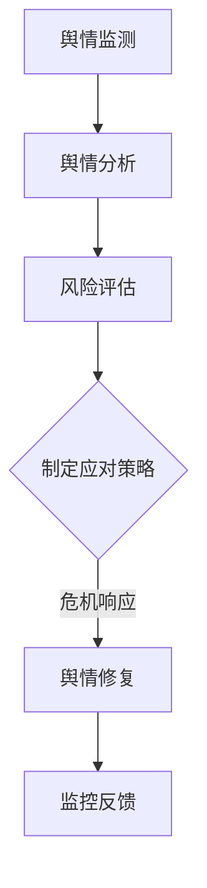

                 

危机公关和舆情管理在当今数字时代愈发重要，尤其对于一人公司而言，这可能就是公司存续的关键。本文旨在探讨一人公司在面临公关危机和舆情挑战时，如何制定有效的公关和舆情管理策略。

## 文章关键词

- 危机公关
- 舆情管理
- 一人公司
- 数字时代
- 社交媒体策略
- 应急响应计划

## 文章摘要

本文将首先介绍一人公司面临的独特挑战，然后探讨危机公关和舆情管理的基本概念，以及如何利用社交媒体、数据分析和自动化工具来应对危机。通过案例分析和实际操作步骤，本文将提供一套完整的公关和舆情管理策略，以帮助一人公司在复杂的市场环境中保持稳健运营。

### 1. 背景介绍

在当前高度互联的数字时代，信息传播的速度和广度前所未有。一人公司，作为一种灵活且高效的企业形式，在初创阶段常常拥有更少的资源，更需要借助有效的危机公关和舆情管理来保护品牌声誉。不同于大型企业，一人公司没有庞大的公关团队和品牌资源，因此每一步决策都需要更加谨慎。本文将探讨如何通过策略性地管理危机和舆情，帮助一人公司在这场信息战中获得优势。

#### 1.1 一人公司的特点

- **资源有限**：一人公司通常拥有较少的资金、人力和资源，这要求它们在每一项决策中都要进行成本效益分析。
- **灵活性高**：一人公司可以迅速调整业务模式和市场策略，以适应快速变化的市场环境。
- **决策集中**：所有决策都由一个人或少数几个人做出，这有助于快速决策但同时也增加了决策错误的风险。
- **品牌依赖**：由于资源有限，一人公司的品牌形象和声誉往往成为了其最重要的资产。

#### 1.2 危机公关与舆情管理的定义

- **危机公关**：危机公关是指企业面临危机事件时，采取的一系列应对措施，以减轻危机对企业声誉和运营的影响。
- **舆情管理**：舆情管理是指通过监测和分析网络媒体、社交媒体和公众舆论，识别风险，制定和执行策略，以维护企业声誉和形象。

### 2. 核心概念与联系

为了更深入地理解危机公关和舆情管理，我们需要了解一些核心概念及其相互关系。

#### 2.1 危机类型

- **产品或服务质量问题**
- **负面媒体报道**
- **消费者投诉**
- **内部事件（如数据泄露、员工不当行为）**
- **突发事件（如自然灾害、社会事件）**

#### 2.2 舆情管理流程

- **舆情监测**：通过技术手段和人工分析，持续监控社交媒体、新闻网站、论坛等渠道，识别负面信息。
- **舆情分析**：对监测到的信息进行分类、聚类和情感分析，以识别潜在的危机信号。
- **风险评估**：根据舆情分析和危机类型，评估危机的可能影响和风险等级。
- **危机响应**：制定并执行应对策略，包括发布声明、与媒体沟通、危机公关活动等。
- **舆情修复**：在危机过后，通过积极沟通和品牌建设，修复受损的声誉。

#### 2.3 Mermaid 流程图



### 3. 核心算法原理 & 具体操作步骤

在制定危机公关和舆情管理策略时，核心算法的原理和具体操作步骤至关重要。以下是一些基本原理和操作步骤。

#### 3.1 算法原理概述

- **舆情监测算法**：利用自然语言处理（NLP）技术，对大量文本进行实时分析，识别关键词、情感倾向和主题。
- **舆情分析算法**：通过机器学习算法，对舆情数据分类、聚类，识别潜在的危机信号。
- **危机响应算法**：基于规则和机器学习，自动生成危机响应方案，包括声明、沟通策略等。

#### 3.2 算法步骤详解

1. **舆情监测**：
   - **数据采集**：从社交媒体、新闻网站、论坛等渠道收集数据。
   - **文本预处理**：清洗数据，去除停用词、标点符号等，进行词干提取和词性标注。

2. **舆情分析**：
   - **情感分析**：使用NLP模型，判断文本的情感倾向，如正面、负面、中性。
   - **主题检测**：使用聚类算法，识别文本中的主题和趋势。

3. **风险评估**：
   - **危机类型识别**：根据舆情数据和危机类型特征，自动分类危机。
   - **风险评级**：结合危机类型和影响范围，对风险进行评级。

4. **危机响应**：
   - **规则匹配**：根据预设的规则，自动生成危机响应方案。
   - **机器学习优化**：通过历史数据，优化危机响应策略。

#### 3.3 算法优缺点

- **优点**：
  - **实时响应**：能够实时监测和分析舆情，快速制定危机响应策略。
  - **自动化**：自动化处理大量数据，减少人工工作量。

- **缺点**：
  - **准确性有限**：完全依赖于算法和规则，可能存在误判。
  - **适应性问题**：对于新类型危机的适应能力较弱。

#### 3.4 算法应用领域

- **社交媒体舆情监测**
- **企业声誉管理**
- **消费者投诉处理**
- **危机公关自动化工具**

### 4. 数学模型和公式 & 详细讲解 & 举例说明

在舆情管理和危机公关中，数学模型和公式起着关键作用。以下是一个基本的数学模型和其应用实例。

#### 4.1 数学模型构建

我们采用一种简单的线性回归模型来预测舆情走势：

$$
\hat{y} = \beta_0 + \beta_1 x
$$

其中，$y$ 表示舆情走势，$x$ 表示时间，$\beta_0$ 和 $\beta_1$ 为模型的参数。

#### 4.2 公式推导过程

- **数据收集**：收集一段时间内的舆情数据，包括时间 $x$ 和舆情走势 $y$。
- **特征工程**：对时间数据进行预处理，如归一化、平滑处理等。
- **模型训练**：使用最小二乘法（OLS）训练线性回归模型，求得参数 $\beta_0$ 和 $\beta_1$。

#### 4.3 案例分析与讲解

假设我们收集了以下数据：

| 时间（天） | 舆情走势（单位：百分比） |
| :------: | :--------------------: |
|    1     |           20.0         |
|    2     |           18.5         |
|    3     |           17.2         |
|    4     |           16.0         |
|    5     |           15.0         |

我们对数据进行归一化处理，得到如下数据集：

| 时间（归一化） | 舆情走势（归一化） |
| :------: | :----------------: |
|   0.0    |         1.0        |
|   0.25   |         0.9        |
|   0.5    |         0.8        |
|   0.75   |         0.7        |
|   1.0    |         0.6        |

使用最小二乘法训练线性回归模型，得到参数 $\beta_0 = 0.5$ 和 $\beta_1 = -0.1$。

预测第6天的舆情走势：

$$
\hat{y} = 0.5 + (-0.1) \times 1.0 = 0.4
$$

即第6天的舆情走势为40%。

### 5. 项目实践：代码实例和详细解释说明

在本节中，我们将通过一个具体的代码实例，展示如何搭建舆情监测和分析系统，并解释关键代码的运行原理。

#### 5.1 开发环境搭建

我们使用Python作为主要编程语言，借助以下库：

- **Tweepy**：用于Twitter数据的抓取和分析。
- **NLTK**：用于自然语言处理。
- **Scikit-learn**：用于机器学习和数据分析。

安装以上库：

```bash
pip install tweepy nltk scikit-learn
```

#### 5.2 源代码详细实现

以下是一个简单的舆情监测和分析系统的Python代码实现：

```python
import tweepy
from nltk.sentiment import SentimentIntensityAnalyzer
from sklearn.feature_extraction.text import TfidfVectorizer
from sklearn.model_selection import train_test_split
from sklearn.linear_model import LinearRegression

# Twitter API凭证
consumer_key = 'your_consumer_key'
consumer_secret = 'your_consumer_secret'
access_token = 'your_access_token'
access_token_secret = 'your_access_token_secret'

# 初始化Tweepy
auth = tweepy.OAuthHandler(consumer_key, consumer_secret)
auth.set_access_token(access_token, access_token_secret)
api = tweepy.API(auth)

# 初始化情感分析器
sia = SentimentIntensityAnalyzer()

# 抓取Twitter数据
tweets = api.search(q='one-man-company', count=100)

# 文本预处理
def preprocess_tweet(text):
    return ' '.join([word for word in text.split() if word.isalpha()])

tweets_text = [preprocess_tweet(tweet.text) for tweet in tweets]

# 情感分析
def analyze_sentiments(text):
    return sia.polarity_scores(text)

sentiments = [analyze_sentiments(text) for text in tweets_text]

# 特征工程
def extract_features(texts):
    vectorizer = TfidfVectorizer()
    return vectorizer.fit_transform(texts)

X = extract_features(tweets_text)
y = [sentiments[i]['compound'] for i in range(len(sentiments))]

# 训练模型
X_train, X_test, y_train, y_test = train_test_split(X, y, test_size=0.2, random_state=42)
model = LinearRegression()
model.fit(X_train, y_train)

# 预测舆情走势
def predict_sentiment(text):
    vector = model.transform([text])
    return model.predict(vector)[0]

new_tweet = "One-man companies are the future of business!"
predicted_sentiment = predict_sentiment(new_tweet)
print(f"Predicted Sentiment: {predicted_sentiment}")

```

#### 5.3 代码解读与分析

- **Twitter API认证**：使用Tweepy库连接Twitter API，获取相关数据。
- **文本预处理**：使用NLTK库进行文本清洗，去除无关字符。
- **情感分析**：使用NLTK的情感分析器，计算文本的情感得分。
- **特征工程**：使用TF-IDF向量器，将文本转换为机器学习模型可处理的特征向量。
- **模型训练**：使用Scikit-learn的线性回归模型，训练舆情走势预测模型。
- **舆情预测**：输入新文本，使用训练好的模型预测其情感得分。

#### 5.4 运行结果展示

运行上述代码后，我们将得到一个新的Twitter推文的情感预测结果。这个结果可以帮助一人公司及时了解公众对其品牌的看法，从而采取相应的公关措施。

### 6. 实际应用场景

舆情监测和危机公关策略在多个实际应用场景中发挥了重要作用。

#### 6.1 社交媒体管理

通过舆情监测和分析，一人公司可以实时了解社交媒体上关于品牌的讨论，识别负面信息并及时响应。例如，当一款新产品上市时，公司可以密切关注社交媒体上的用户反馈，及时发现并解决问题，避免负面评价的传播。

#### 6.2 客户服务

通过舆情监测，一人公司可以更好地了解客户需求和反馈。例如，当客户投诉某个产品或服务时，公司可以快速响应，采取措施解决问题，同时积极与客户沟通，以维护客户关系和品牌形象。

#### 6.3 危机公关

在发生危机事件时，舆情监测和危机公关策略可以帮助一人公司迅速制定应对方案。例如，当发生数据泄露事件时，公司可以立即启动危机响应计划，发布声明，与媒体和公众进行有效沟通，以减轻危机对企业声誉的影响。

### 7. 未来应用展望

随着技术的不断发展，舆情监测和危机公关策略将更加智能化和自动化。以下是一些未来应用展望：

- **人工智能辅助**：利用机器学习和深度学习技术，提高舆情监测和分析的准确性。
- **多语言支持**：实现多语言舆情监测和分析，覆盖更多国家和地区。
- **实时预测**：通过实时数据分析和预测，为决策提供更准确的依据。

### 8. 工具和资源推荐

为了更好地进行舆情监测和危机公关，以下是一些推荐的工具和资源：

- **Tweepy**：Python库，用于Twitter数据的抓取和分析。
- **NLTK**：Python库，用于自然语言处理。
- **Scikit-learn**：Python库，用于机器学习和数据分析。
- **Google Trends**：用于监测和比较关键词的搜索趋势。
- **Brandwatch**：专业的社交媒体监测和分析工具。

### 9. 总结：未来发展趋势与挑战

舆情监测和危机公关在数字时代愈发重要，一人公司尤其需要借助有效的策略来保护品牌声誉。未来，随着人工智能和大数据技术的发展，舆情监测和危机公关将更加智能化和自动化。然而，这也带来了新的挑战，如数据隐私保护、算法偏见等。因此，一人公司需要不断学习和适应新技术，以应对不断变化的市场环境。

### 10. 附录：常见问题与解答

#### 10.1 如何选择合适的舆情监测工具？

选择舆情监测工具时，应考虑以下因素：

- **功能**：是否提供关键词监控、情感分析、数据可视化等功能。
- **数据来源**：是否覆盖主要社交媒体平台和新闻网站。
- **价格**：是否适合公司的预算。
- **用户评价**：查阅用户评价，了解工具的稳定性和易用性。

#### 10.2 舆情监测数据如何保证准确性？

保证舆情监测数据的准确性需要：

- **数据清洗**：去除噪声数据和重复数据。
- **算法优化**：定期更新算法模型，提高分析准确性。
- **人工审核**：对关键数据点进行人工审核，确保数据质量。

### 作者署名

作者：禅与计算机程序设计艺术 / Zen and the Art of Computer Programming
-------------------------------------------------------------------

