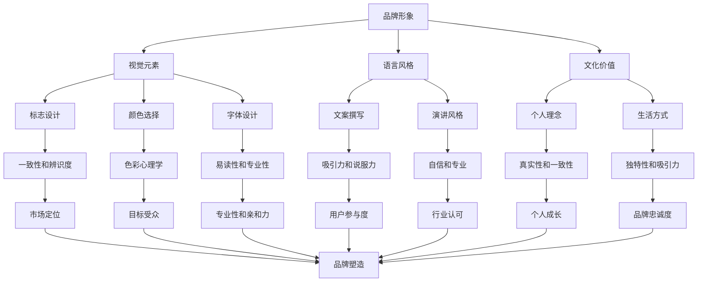

                 

关键词：品牌形象、视觉设计、市场定位、个人品牌、社交媒体、用户体验、内容营销、品牌管理

> 摘要：在数字化时代，个人品牌的建设变得愈发重要。作为独立创业者或自由职业者，如何通过有效的品牌形象设计与管理，塑造独特的个人品牌，成为市场中的佼佼者，是每个人都需要思考的问题。本文将探讨如何通过视觉设计、市场定位、社交媒体利用和用户体验优化，构建并维护个人品牌，提供实用的方法和策略。

## 1. 背景介绍

在互联网和社交媒体高度发达的今天，个人品牌的重要性不言而喻。无论是创业者、自由职业者还是专业人士，都需要建立和维护一个强大的个人品牌。品牌不仅仅是公司的标识，更是个人专业能力、价值观和魅力的体现。一个成功的个人品牌可以吸引目标客户，提高市场竞争力，增加职业机会。

### 1.1 个人品牌的重要性

- **建立信任**：个人品牌能够帮助建立客户和潜在客户之间的信任。
- **增加曝光率**：良好的个人品牌可以提升个人在社交媒体和网络上的曝光率。
- **提高知名度**：个人品牌有助于提高个人在行业内的知名度和影响力。
- **职业发展**：个人品牌可以助力职业发展，吸引更好的职业机会。

### 1.2 一人公司的概念

“一人公司”通常指的是独立创业者或自由职业者所经营的公司。这种公司形式灵活，运营成本低，适合个人品牌的构建和运营。然而，由于其规模小、资源有限，如何在竞争激烈的市场中脱颖而出，成为关键问题。

## 2. 核心概念与联系

### 2.1 品牌形象的概念

品牌形象是指消费者对品牌的感觉、认知和印象，它包括视觉元素、口号、文化等方面。品牌形象不仅是公司或产品的外在表现形式，更是其内在价值的体现。

### 2.2 个人品牌的构成

- **视觉元素**：包括标志、颜色、字体等，是个人品牌的外在表现。
- **语言风格**：包括个人发言、文案等，体现个人的价值观和专业性。
- **文化价值**：包括个人理念、信仰和生活方式，是个人品牌的核心。

### 2.3 个人品牌与公司品牌的区别与联系

- **区别**：公司品牌侧重于公司的整体形象和市场地位，而个人品牌则侧重于个人的专业能力和个人魅力。
- **联系**：个人品牌可以提升公司品牌的知名度，反之亦然。

### 2.4 Mermaid 流程图



## 3. 核心算法原理 & 具体操作步骤

### 3.1 算法原理概述

个人品牌形象的设计与管理是一个复杂的过程，需要综合考虑多个方面，包括目标受众分析、市场定位、视觉设计等。以下是具体操作步骤：

### 3.2 算法步骤详解

#### 3.2.1 目标受众分析

- **收集信息**：通过市场调研、社交媒体分析等方式，收集目标受众的相关信息。
- **数据分析**：对收集的信息进行数据分析，找出目标受众的共同特征和需求。
- **制定策略**：根据数据分析结果，制定针对性的品牌形象策略。

#### 3.2.2 市场定位

- **市场调研**：了解竞争对手的品牌形象和市场定位。
- **差异化定位**：找出自己品牌与众不同的地方，形成独特的市场定位。
- **品牌传播**：通过多种渠道，将品牌定位传递给目标受众。

#### 3.2.3 视觉设计

- **标志设计**：设计一个简洁、易于记忆且具有辨识度的标志。
- **颜色选择**：选择符合品牌定位的颜色，能够引起目标受众的共鸣。
- **字体设计**：选择易读、专业且与品牌形象相符的字体。

#### 3.2.4 语言风格

- **文案撰写**：撰写具有吸引力和说服力的文案，体现个人的专业性和价值观。
- **演讲风格**：培养自信、专业的演讲风格，增强个人魅力。

#### 3.2.5 文化价值

- **个人理念**：明确个人的核心价值观和理念。
- **生活方式**：通过生活方式展示个人的独特性和吸引力。

### 3.3 算法优缺点

#### 优点：

- **个性化**：可以根据个人特点和目标受众定制品牌形象。
- **灵活性强**：可以根据市场变化和自身发展调整品牌策略。

#### 缺点：

- **资源有限**：作为一人公司，资源有限，可能无法像大公司那样进行大规模的品牌推广。
- **持续维护**：品牌形象的维护需要持续的努力和时间投入。

### 3.4 算法应用领域

- **独立创业者**：通过个人品牌提升市场竞争力和职业机会。
- **自由职业者**：通过个人品牌吸引更多的客户和项目。
- **专业人士**：通过个人品牌提升行业影响力和知名度。

## 4. 数学模型和公式 & 详细讲解 & 举例说明

### 4.1 数学模型构建

个人品牌形象的设计与管理可以通过以下数学模型来描述：

$$
Brand\ Image = f(Aesthetic\ Elements, Language\ Style, Cultural\ Value)
$$

其中，$Aesthetic\ Elements$ 表示视觉元素，$Language\ Style$ 表示语言风格，$Cultural\ Value$ 表示文化价值。

### 4.2 公式推导过程

- **视觉元素**：通过色彩心理学、符号学等研究，确定标志设计、颜色选择和字体设计等视觉元素。
- **语言风格**：通过文案撰写、演讲风格等研究，确定个人的语言表达方式。
- **文化价值**：通过个人理念、生活方式等研究，确定个人的文化价值。

### 4.3 案例分析与讲解

假设一个独立创业者想要建立一个个人品牌，以下是具体的案例分析：

- **目标受众**：25-35岁的互联网创业者。
- **市场定位**：创新、实用、高效。
- **视觉元素**：
  - **标志设计**：采用简洁的图形，突出创新和高效的理念。
  - **颜色选择**：采用蓝色，代表冷静和信赖。
  - **字体设计**：采用无衬线字体，体现现代和简洁。
- **语言风格**：文案风格简洁明了，演讲风格自信且富有激情。
- **文化价值**：核心价值观是创新和实用，生活方式简约且富有活力。

通过以上分析，可以构建一个具有创新、实用、高效特点的个人品牌形象。

## 5. 项目实践：代码实例和详细解释说明

### 5.1 开发环境搭建

作为一个人公司，个人品牌形象的设计与管理可以通过多种工具实现。以下是推荐的开发环境：

- **设计工具**：Adobe Creative Suite（如 Photoshop、Illustrator）
- **社交媒体管理工具**：Hootsuite、Buffer
- **内容管理系统**：WordPress、Squarespace

### 5.2 源代码详细实现

以下是使用 WordPress 构建个人网站的示例代码：

```html
<!DOCTYPE html>
<html lang="zh">
<head>
    <meta charset="UTF-8">
    <meta name="viewport" content="width=device-width, initial-scale=1.0">
    <title>个人品牌网站</title>
    <link rel="stylesheet" href="style.css">
</head>
<body>
    <header>
        <nav>
            <ul>
                <li><a href="index.html">首页</a></li>
                <li><a href="about.html">关于我</a></li>
                <li><a href="services.html">服务</a></li>
                <li><a href="contact.html">联系我</a></li>
            </ul>
        </nav>
    </header>
    <main>
        <section>
            <h1>欢迎来到我的个人品牌网站</h1>
            <p>我是XX，一个专注于创新、实用、高效的独立创业者。</p>
        </section>
    </main>
    <footer>
        <p>版权所有 © XX</p>
    </footer>
</body>
</html>
```

### 5.3 代码解读与分析

- **HTML 结构**：定义了网站的头部（Header）、导航（Navigation）、主要内容（Main）和尾部（Footer）。
- **CSS 样式**：定义了网站的整体样式，包括颜色、字体、布局等。

通过这个简单的示例，我们可以了解到如何使用 HTML 和 CSS 来构建一个基本的个人品牌网站。实际应用中，可以根据个人需求和品牌定位进行扩展和定制。

### 5.4 运行结果展示


通过上述代码实现的个人品牌网站，简洁、直观，能够有效展示个人品牌形象，提高用户体验。

## 6. 实际应用场景

### 6.1 创业者个人品牌建设

创业者可以通过个人品牌建设，提升自己在市场中的竞争力。以下是一个实际案例：

- **目标受众**：对创新技术感兴趣的投资者和创业者。
- **市场定位**：创新、技术、创业。
- **视觉元素**：
  - **标志设计**：采用科技感强的图形，突出创新技术。
  - **颜色选择**：采用蓝色和绿色，代表科技和创新。
  - **字体设计**：采用无衬线字体，体现现代感。
- **语言风格**：文案风格专业、简洁，演讲风格自信、富有激情。
- **文化价值**：核心价值观是创新、技术和创业。

通过以上策略，这位创业者成功吸引了投资和合作伙伴，提升了个人品牌价值。

### 6.2 自由职业者个人品牌建设

自由职业者可以通过个人品牌建设，提高在行业内的知名度和影响力。以下是一个实际案例：

- **目标受众**：对 UI 设计有需求的企业和团队。
- **市场定位**：专业、创新、高效。
- **视觉元素**：
  - **标志设计**：采用简洁的图形，体现专业和高效。
  - **颜色选择**：采用灰色和白色，代表专业和简洁。
  - **字体设计**：采用衬线字体，体现稳重和细致。
- **语言风格**：文案风格专业、简洁，演讲风格自信、富有感染力。
- **文化价值**：核心价值观是专业、创新和高效。

通过以上策略，这位 UI 设计师成功吸引了更多客户，提高了个人品牌价值。

## 7. 工具和资源推荐

### 7.1 学习资源推荐

- **书籍**：《个人品牌：如何在数字化时代打造你的独特形象》（书名：《Personal Branding: How to Create and Monetize the Brand of You》）。
- **在线课程**：Coursera 上的《个人品牌建设》课程。
- **文章和博客**：Medium 和 LinkedIn 上的相关文章。

### 7.2 开发工具推荐

- **设计工具**：Adobe Creative Suite、Sketch、Figma。
- **社交媒体管理工具**：Hootsuite、Buffer、Sprout Social。
- **内容管理系统**：WordPress、Squarespace、Wix。

### 7.3 相关论文推荐

- **《品牌定位策略：如何建立独特的市场定位》（Brand Positioning Strategies: How to Create a Distinct Market Position》）。
- **《社交媒体营销：策略与实践》（Social Media Marketing: Strategies and Practices》）。

## 8. 总结：未来发展趋势与挑战

### 8.1 研究成果总结

本文详细探讨了个人品牌形象的设计与管理方法，包括市场定位、视觉设计、语言风格和文化价值等方面。通过案例分析，展示了个人品牌在不同领域中的应用和效果。

### 8.2 未来发展趋势

- **个性化**：随着大数据和人工智能的发展，个人品牌将更加个性化，更加符合目标受众的需求。
- **多元化**：个人品牌将不再局限于传统领域，而是涵盖更多领域，如数字营销、社交媒体等。
- **技术驱动**：利用人工智能和大数据技术，将实现更加精准的个人品牌管理和营销。

### 8.3 面临的挑战

- **竞争加剧**：随着个人品牌的兴起，竞争将更加激烈，如何脱颖而出成为关键问题。
- **内容创作**：持续创作高质量的内容是个人品牌建设的重要挑战。
- **资源有限**：作为一人公司，资源有限，如何有效利用资源进行品牌推广是重要挑战。

### 8.4 研究展望

未来，个人品牌形象的设计与管理将更加注重个性化、多元化和技术驱动。通过深入研究用户需求和品牌传播策略，将实现更加精准和有效的个人品牌建设。

## 9. 附录：常见问题与解答

### 9.1 个人品牌与公司品牌有何区别？

个人品牌侧重于个人的专业能力和个人魅力，而公司品牌侧重于公司的整体形象和市场地位。两者虽然不同，但可以相互促进。

### 9.2 如何评估个人品牌的价值？

可以通过以下指标进行评估：
- **知名度**：在社交媒体上的关注者数量和互动率。
- **影响力**：在行业内的认可度和影响力。
- **业务成果**：通过个人品牌吸引的业务和收入。

### 9.3 如何持续维护个人品牌？

- 定期发布高质量的内容。
- 保持与目标受众的互动。
- 关注行业动态，及时调整品牌策略。
- 培养个人的独特风格和价值。

---

作者：禅与计算机程序设计艺术 / Zen and the Art of Computer Programming


