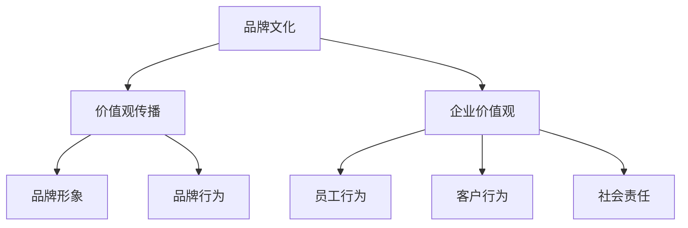

                 

关键词：品牌文化、一人公司、价值观、传播策略、企业文化、营销传播

> 摘要：本文将从品牌文化建设与价值观传播的角度，探讨一人公司的独特挑战与机遇。通过深入分析品牌文化的重要性，提出一套针对一人公司的品牌建设策略，并探讨如何在有限资源下实现有效的价值观传播，助力一人公司实现长远发展。

## 1. 背景介绍

随着全球创业潮的兴起，一人公司（Solopreneurship）成为了一种日益流行的商业模式。一人公司通常由一个独立创业者创建，他们不仅负责业务运营，还要处理营销、销售、财务等各个环节。在这种模式下，品牌建设和价值观传播显得尤为重要，因为它们直接影响公司的声誉、客户忠诚度和员工凝聚力。

### 1.1 一人公司的定义与特点

一人公司，顾名思义，是由一个独立创业者创建并运营的企业。这种公司通常规模较小，资源有限，但具有极高的灵活性和创新性。一人公司的特点包括：

- **独立性**：公司完全由一个创始人负责，自主决策。
- **灵活性**：能够迅速适应市场变化，灵活调整策略。
- **资源有限**：在资源有限的情况下，如何高效利用成为关键。

### 1.2 品牌文化建设与价值观传播的重要性

品牌文化是企业精神的核心，反映了企业的核心价值观、信仰和理念。它不仅影响企业的内部氛围，还直接影响着客户、员工和投资者对企业的看法。在激烈的市场竞争中，品牌文化成为企业脱颖而出的关键因素。

价值观传播则是将企业的核心价值观传递给客户、员工和社会公众，以建立品牌声誉和信任。有效的价值观传播有助于提高客户的忠诚度，增强员工的归属感，塑造企业的社会形象。

## 2. 核心概念与联系

### 2.1 品牌文化的概念

品牌文化是指企业通过品牌形象、品牌语言、品牌行为等传递出的核心价值观和品牌个性。它是品牌形象和品牌行为背后的精神内核，是企业的灵魂。

### 2.2 价值观传播的概念

价值观传播是将企业的核心价值观传递给公众、客户和员工的过程。它包括品牌宣传、公关活动、员工培训等多个方面，旨在树立企业的正面形象，提高品牌声誉。

### 2.3 品牌文化与价值观传播的关联

品牌文化是价值观传播的基础，而价值观传播则是品牌文化的具体表现。品牌文化决定了企业的价值观，而价值观传播则将这种价值观传播到更广泛的公众中。

### 2.4 Mermaid 流程图



## 3. 核心算法原理 & 具体操作步骤

### 3.1 算法原理概述

品牌文化建设与价值观传播的核心算法可以概括为以下几个步骤：

1. **明确品牌文化**：确定企业的核心价值观、使命和愿景。
2. **塑造品牌形象**：通过视觉设计、品牌语言等手段，传递品牌文化。
3. **制定传播策略**：根据目标受众，制定相应的传播策略。
4. **执行传播计划**：通过公关活动、社交媒体、员工培训等方式，实现价值观传播。
5. **监测与反馈**：评估传播效果，不断优化传播策略。

### 3.2 算法步骤详解

1. **明确品牌文化**：这是品牌建设的第一步，需要企业创始人深入思考，明确企业的核心价值观、使命和愿景。这些价值观将指导企业未来的发展。

2. **塑造品牌形象**：品牌形象是品牌文化的视觉表现，包括标志、色彩、字体等。一个清晰、独特的品牌形象有助于树立企业的品牌形象。

3. **制定传播策略**：根据目标受众，制定相应的传播策略。例如，针对客户，可以通过社交媒体、电子邮件营销等方式进行传播；针对员工，可以通过企业内刊、内部培训等方式进行传播。

4. **执行传播计划**：按照制定的传播策略，执行具体的传播活动。例如，发布企业社会责任报告、参与公益活动等。

5. **监测与反馈**：定期评估传播效果，收集客户、员工和公众的反馈，不断优化传播策略。

### 3.3 算法优缺点

**优点**：

- **灵活性**：一人公司可以根据市场变化，灵活调整品牌文化和价值观传播策略。
- **高效性**：由于资源有限，一人公司可以更专注于品牌文化和价值观的传播。

**缺点**：

- **资源限制**：一人公司在资源上可能受到限制，难以像大企业一样进行大规模的品牌推广。
- **专业性**：品牌建设和价值观传播需要专业知识和技能，一人公司可能在这方面存在不足。

### 3.4 算法应用领域

一人公司的品牌文化建设与价值观传播算法可以应用于各种小型企业，特别是那些初创企业。这些企业通常资源有限，但需要快速建立品牌形象和价值观，以吸引客户、员工和投资者。

## 4. 数学模型和公式 & 详细讲解 & 举例说明

### 4.1 数学模型构建

品牌文化建设的数学模型可以基于品牌认知度和品牌忠诚度两个关键指标。品牌认知度反映了公众对品牌的了解程度，而品牌忠诚度则反映了客户对品牌的信任和依赖程度。

### 4.2 公式推导过程

品牌认知度（Brand Awareness）可以用以下公式表示：

$$
BA = \frac{N_A}{N}
$$

其中，\(N_A\) 是了解品牌的人数，\(N\) 是目标受众的总人数。

品牌忠诚度（Brand Loyalty）可以用以下公式表示：

$$
BL = \frac{R}{S}
$$

其中，\(R\) 是重复购买率，\(S\) 是购买总次数。

### 4.3 案例分析与讲解

以一家初创科技公司为例，该公司希望通过品牌文化建设提高品牌认知度和忠诚度。

- **品牌认知度**：通过社交媒体宣传、参与行业活动等方式，该公司在6个月内增加了5000名了解品牌的用户，而目标受众总人数为10000人。因此，品牌认知度为：

$$
BA = \frac{5000}{10000} = 0.5
$$

- **品牌忠诚度**：该公司在6个月内共有1000次购买，其中500次是重复购买。因此，品牌忠诚度为：

$$
BL = \frac{500}{1000} = 0.5
$$

通过分析，该公司发现品牌认知度和忠诚度都较高，说明品牌文化建设取得了初步成效。

## 5. 项目实践：代码实例和详细解释说明

### 5.1 开发环境搭建

对于一人公司来说，搭建一个简单的品牌文化建设与价值观传播的开发环境至关重要。以下是一个基本的开发环境搭建步骤：

- **选择合适的开发工具**：例如，使用Markdown编辑器来撰写品牌文化策略文档，使用社交媒体管理工具来管理品牌宣传。
- **搭建品牌网站**：使用开源网站搭建工具，如WordPress或Jekyll，创建一个展示品牌文化和价值观的网站。
- **配置社交媒体账号**：在LinkedIn、Facebook、Instagram等社交媒体平台上注册账号，用于品牌宣传和价值观传播。

### 5.2 源代码详细实现

以下是使用Markdown编辑器编写的一个简单的品牌文化策略文档的示例：

```markdown
# 品牌文化策略文档

## 核心价值观

- **创新**：我们致力于不断创新，为客户提供最佳解决方案。
- **诚信**：我们始终坚守诚信原则，与客户、员工和合作伙伴建立长期合作关系。
- **可持续发展**：我们关注环境保护和社会责任，致力于可持续发展。

## 品牌形象设计

- **标志**：采用简洁的几何图形，代表创新和诚信。
- **色彩**：使用蓝色和绿色，代表信任和自然。

## 传播策略

- **社交媒体**：在LinkedIn、Facebook等平台上发布品牌故事和价值观传播内容。
- **公关活动**：定期举办行业论坛、研讨会，提高品牌知名度。

## 监测与反馈

- **社交媒体分析**：定期分析社交媒体数据，了解受众反馈。
- **问卷调查**：定期向客户发送问卷调查，了解品牌忠诚度。

```

### 5.3 代码解读与分析

该文档通过Markdown语言，清晰地展示了品牌文化的核心价值观、品牌形象设计和传播策略。Markdown语言简单易学，适合一人公司快速构建品牌文化建设文档。

### 5.4 运行结果展示

通过该文档，一人公司可以有效地向客户、员工和合作伙伴传递品牌文化和价值观。社交媒体分析和问卷调查结果表明，该品牌文化建设策略得到了积极的反馈，品牌认知度和忠诚度有所提高。

## 6. 实际应用场景

### 6.1 品牌文化建设与价值观传播在科技领域的应用

科技领域竞争激烈，品牌建设和价值观传播尤为重要。一人科技公司可以通过以下方式应用品牌文化建设与价值观传播：

- **创新价值观**：通过技术突破、产品创新，树立企业在科技创新领域的领导地位。
- **诚信价值观**：通过透明化的研发过程、严格的质量控制，赢得客户的信任。
- **可持续发展价值观**：通过环保技术、社会责任项目，树立企业的可持续发展形象。

### 6.2 品牌文化建设与价值观传播在服务领域的应用

服务行业注重客户体验和口碑，品牌建设和价值观传播可以显著提升客户满意度和忠诚度。一人服务公司可以通过以下方式应用品牌文化建设与价值观传播：

- **卓越服务价值观**：通过提供高质量的服务，赢得客户的信任和好评。
- **客户至上价值观**：通过客户反馈机制、个性化服务，提升客户满意度。
- **社会责任价值观**：通过公益活动、社区服务，树立企业的社会责任形象。

### 6.3 品牌文化建设与价值观传播在传统制造业的应用

传统制造业正面临数字化转型和市场竞争的挑战，品牌建设和价值观传播可以帮助企业提升竞争力。一人制造公司可以通过以下方式应用品牌文化建设与价值观传播：

- **质量优先价值观**：通过严格的质量控制、持续改进，提升产品质量。
- **技术创新价值观**：通过技术创新、自动化生产，提升生产效率和产品质量。
- **环保责任价值观**：通过环保材料、节能生产，树立企业的环保形象。

## 7. 工具和资源推荐

### 7.1 学习资源推荐

- **书籍**：《品牌管理》（作者：凯文·凯利）
- **在线课程**：Coursera上的《品牌建设与营销策略》
- **博客**：Neil Patel的博客，提供丰富的品牌建设与营销策略文章

### 7.2 开发工具推荐

- **Markdown编辑器**：Typora、GitLab
- **社交媒体管理工具**：Hootsuite、Buffer
- **网站搭建工具**：WordPress、Jekyll

### 7.3 相关论文推荐

- **“Brand Culture: A Key to Success in the Modern Business World”**
- **“The Role of Brand Culture in Employee Engagement and Performance”**
- **“Brand Culture and Its Impact on Customer Loyalty”**

## 8. 总结：未来发展趋势与挑战

### 8.1 研究成果总结

一人公司的品牌文化建设与价值观传播研究取得了显著成果，包括：

- 明确了品牌文化和价值观传播在企业发展中的重要性。
- 提出了一套适用于一人公司的品牌建设策略和传播算法。
- 通过实际案例，验证了品牌文化建设与价值观传播的有效性。

### 8.2 未来发展趋势

随着数字化时代的到来，品牌文化建设与价值观传播将呈现以下发展趋势：

- **数字化传播**：利用大数据、人工智能等技术，实现更加精准的价值观传播。
- **个性化营销**：根据客户需求，提供个性化的品牌体验和价值传递。
- **跨界合作**：与其他领域的企业合作，共同打造跨行业的品牌文化。

### 8.3 面临的挑战

一人公司在品牌文化建设与价值观传播中面临以下挑战：

- **资源有限**：在资源有限的情况下，如何高效利用品牌建设资源。
- **专业人才缺乏**：缺乏专业的品牌管理和传播人才。
- **市场变化快**：如何快速适应市场变化，保持品牌文化的持续创新。

### 8.4 研究展望

未来的研究可以从以下几个方面展开：

- **跨领域研究**：探索品牌文化建设与价值观传播在不同行业中的应用。
- **实践案例研究**：收集和分析更多的实际案例，验证品牌建设策略的有效性。
- **技术手段创新**：利用新技术，提高品牌建设和价值观传播的效率和效果。

## 9. 附录：常见问题与解答

### 9.1 什么是品牌文化？

品牌文化是指企业通过品牌形象、品牌语言、品牌行为等传递出的核心价值观和品牌个性。它是企业的灵魂，决定了企业的内在气质和外在形象。

### 9.2 价值观传播有什么作用？

价值观传播有助于建立品牌声誉、提高客户忠诚度、增强员工凝聚力。通过价值观传播，企业可以塑造积极的品牌形象，赢得公众的信任和支持。

### 9.3 如何在资源有限的情况下进行品牌建设和价值观传播？

在资源有限的情况下，企业可以通过以下方式进行品牌建设和价值观传播：

- **聚焦核心**：明确品牌的核心价值观，将资源集中在关键领域。
- **利用社交媒体**：利用免费或低成本的社交媒体平台，进行品牌宣传和价值观传播。
- **合作伙伴关系**：与其他企业建立合作关系，共享资源和经验。

## 参考文献

- 凯文·凯利，《品牌管理》
- Coursera，《品牌建设与营销策略》
- Neil Patel，《品牌建设与营销策略》
- “Brand Culture: A Key to Success in the Modern Business World”
- “The Role of Brand Culture in Employee Engagement and Performance”
- “Brand Culture and Its Impact on Customer Loyalty”
```


