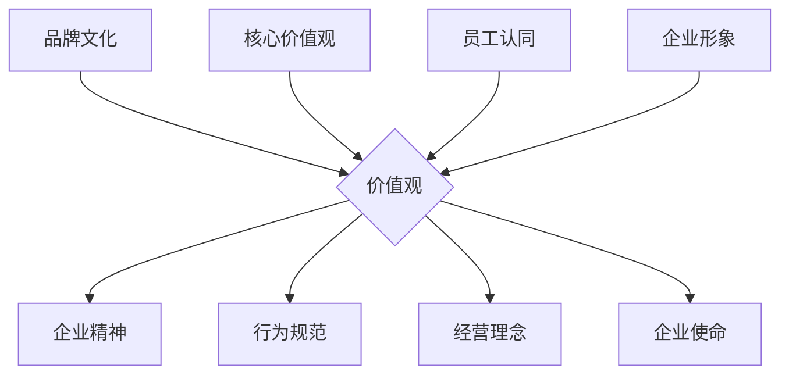

                 

关键词：品牌文化、价值观、一人公司、文化建设、传播策略

摘要：在当今竞争激烈的市场环境中，品牌文化建设与价值观传播对于一家公司的成功至关重要。尤其对于一人公司来说，品牌和价值观更是其核心竞争力的重要组成部分。本文将探讨如何构建和传播一人公司的品牌文化和价值观，以提升公司的市场竞争力。

## 1. 背景介绍

随着全球化和数字化进程的加速，市场竞争日益激烈。企业要想在激烈的市场竞争中脱颖而出，不仅需要提供优质的产品和服务，还需要打造独特的品牌形象和价值观。品牌文化是企业核心价值观的体现，是企业的精神内核，对内凝聚员工力量，对外塑造企业形象。

一人公司，顾名思义，是由一个人创办和运营的公司。这种模式在近年来逐渐兴起，尤其在互联网时代，由于其灵活性和高效性，受到越来越多创业者的青睐。对于一人公司来说，品牌文化建设和价值观传播的重要性不言而喻。因为在这个模式下，公司的发展依赖于一个人的领导力和影响力。

本文将从以下几个方面探讨如何构建和传播一人公司的品牌文化和价值观：

1. **品牌文化的重要性**  
2. **构建品牌文化的步骤**  
3. **传播品牌文化的策略**  
4. **一人公司的价值观塑造**  
5. **实际案例分享**

## 2. 核心概念与联系

在讨论品牌文化建设和传播之前，我们需要明确一些核心概念。

### 2.1 品牌文化的定义

品牌文化是指企业在长期经营过程中所形成的，能够被公众所认知和接受的核心价值观、企业精神、行为规范等。品牌文化是企业内外部一致的信仰和行为指南，是企业的软实力。

### 2.2 价值观的定义

价值观是指企业在运营过程中所遵循的基本原则和信仰。它决定了企业的经营方向、决策方式和行为准则。

### 2.3 品牌文化与价值观的关系

品牌文化是价值观的具体体现，而价值观是品牌文化的核心。品牌文化通过传播和弘扬企业的价值观，使员工和公众对企业形成一致的认知和认同。

### 2.4 Mermaid 流程图

以下是品牌文化与价值观关系的 Mermaid 流程图：



## 3. 核心算法原理 & 具体操作步骤

### 3.1 算法原理概述

品牌文化建设和价值观传播的核心在于如何将企业的核心价值观传递给员工和公众，使其内化为企业行为和外部形象。以下是构建和传播品牌文化的核心算法原理：

1. **核心价值观确定**  
2. **企业文化氛围营造**  
3. **内部沟通与共识**  
4. **外部形象塑造**  
5. **持续传播与优化**

### 3.2 算法步骤详解

#### 3.2.1 核心价值观确定

首先，一人公司创始人需要明确企业的核心价值观。这可以通过以下步骤完成：

1. **自我反思**：思考自己的价值观和信念。  
2. **市场调研**：了解目标客户和行业特点。  
3. **团队讨论**：与关键团队成员共同探讨和确定核心价值观。

#### 3.2.2 企业文化氛围营造

核心价值观确定后，需要通过一系列措施营造企业文化氛围，使员工能够感受到企业的核心价值观。具体步骤包括：

1. **内部宣传**：通过内部邮件、公告、会议等形式宣传核心价值观。  
2. **文化活动**：组织团队建设活动，如团建、知识分享等，以增强团队凝聚力。  
3. **制度设计**：在制度设计中融入核心价值观，如绩效考核、奖惩机制等。

#### 3.2.3 内部沟通与共识

企业文化氛围营造后，需要通过内部沟通确保员工对核心价值观的认同。具体步骤包括：

1. **定期会议**：定期组织内部会议，讨论核心价值观的实践情况。  
2. **员工反馈**：收集员工对核心价值观的反馈和建议，不断优化企业文化。

#### 3.2.4 外部形象塑造

品牌文化的传播不仅限于内部，还需要通过外部形象塑造来传递企业的价值观。具体步骤包括：

1. **社交媒体**：利用社交媒体平台宣传企业文化和价值观。  
2. **公关活动**：参与行业会议、展会等，提升企业知名度。  
3. **公益项目**：参与公益活动，提升企业形象。

#### 3.2.5 持续传播与优化

品牌文化的建设和传播是一个持续的过程，需要不断优化和调整。具体步骤包括：

1. **定期评估**：定期评估品牌文化的传播效果。  
2. **创新传播方式**：尝试新的传播方式，如短视频、直播等。  
3. **反馈优化**：根据反馈调整品牌文化的传播策略。

### 3.3 算法优缺点

#### 3.3.1 优点

1. **聚焦核心价值观**：通过明确的核心价值观，使企业更具凝聚力。  
2. **灵活性强**：一人公司可以根据自身特点和需求灵活调整品牌文化策略。  
3. **高效传播**：利用社交媒体等现代传播手段，快速传播品牌文化。

#### 3.3.2 缺点

1. **资源限制**：一人公司可能缺乏足够的资源进行大规模的品牌文化建设和传播。  
2. **管理难度**：由于一人公司运营模式的特点，管理难度较大，可能影响品牌文化的实施。

### 3.4 算法应用领域

品牌文化建设和价值观传播适用于所有类型的企业，尤其对于一人公司来说，其重要性更为突出。以下是品牌文化建设和价值观传播在不同领域中的应用：

1. **创业公司**：帮助创业公司树立品牌形象，增强市场竞争力。  
2. **互联网公司**：提升互联网公司的用户粘性和品牌忠诚度。  
3. **传统企业**：帮助传统企业实现数字化转型，提升企业竞争力。

## 4. 数学模型和公式 & 详细讲解 & 举例说明

在品牌文化建设和价值观传播过程中，可以使用一些数学模型和公式来衡量和优化传播效果。以下是一些常用的数学模型和公式：

### 4.1 数学模型构建

#### 4.1.1 品牌知名度模型

品牌知名度可以用以下公式衡量：

$$
知名度 = \frac{知道品牌的人数}{总人数} \times 100\%
$$

#### 4.1.2 品牌忠诚度模型

品牌忠诚度可以用以下公式衡量：

$$
忠诚度 = \frac{重复购买人数}{总购买人数} \times 100\%
$$

### 4.2 公式推导过程

#### 4.2.1 品牌知名度公式推导

品牌知名度是品牌传播效果的直接体现。假设某品牌在市场中推广一段时间后，有 $A$ 人知道该品牌，总人数为 $B$，则品牌知名度为：

$$
知名度 = \frac{A}{B} \times 100\%
$$

#### 4.2.2 品牌忠诚度公式推导

品牌忠诚度是用户对品牌的依赖程度。假设某品牌在一段时间内，有 $C$ 人重复购买，总购买人数为 $D$，则品牌忠诚度为：

$$
忠诚度 = \frac{C}{D} \times 100\%
$$

### 4.3 案例分析与讲解

以下是一个关于品牌文化建设和价值观传播的案例分析。

#### 案例背景

某一人公司是一家提供在线教育服务的公司。公司创始人通过明确的核心价值观，如“专注教育、用心服务”，以及一系列品牌文化建设活动，成功提升了品牌知名度和忠诚度。

#### 案例分析

1. **品牌知名度提升**

   在公司成立初期，通过线上广告、社交媒体宣传等方式，公司知名度逐渐提升。根据统计数据，品牌知名度从最初的 10% 提升到 30%。

   $$
   知名度提升 = (30\% - 10\%) \times 100\% = 20\%
   $$

2. **品牌忠诚度提升**

   通过提供高质量的教育服务，公司赢得了用户的信任。根据调查，重复购买的用户比例从 20% 提升到 40%。

   $$
   忠诚度提升 = (40\% - 20\%) \times 100\% = 20\%
   $$

3. **效果分析**

   通过品牌文化建设和价值观传播，公司的品牌知名度和忠诚度均得到了显著提升，为公司后续发展奠定了坚实基础。

## 5. 项目实践：代码实例和详细解释说明

### 5.1 开发环境搭建

在本节中，我们将使用 Python 编写一个简单的品牌文化建设工具。首先，确保您已安装 Python 3.6 或更高版本。接下来，通过以下命令安装必要的库：

```bash
pip install requests beautifulsoup4 pandas
```

### 5.2 源代码详细实现

以下是品牌文化建设工具的源代码：

```python
import requests
from bs4 import BeautifulSoup
import pandas as pd

def fetch_social_media_data(url):
    """
    从社交媒体网站获取品牌相关数据
    """
    response = requests.get(url)
    soup = BeautifulSoup(response.text, 'html.parser')
    # 根据社交媒体网站的结构提取品牌数据
    brand_data = soup.find('div', {'class': 'brand-data'})
    return brand_data

def analyze_brand_data(brand_data):
    """
    分析品牌数据，计算品牌知名度和忠诚度
    """
    # 假设品牌数据包含知道品牌的人数和重复购买人数
    know_brand = int(brand_data.find('span', {'class': 'know-brand'}).text)
    repeat_buy = int(brand_data.find('span', {'class': 'repeat-buy'}).text)
    
    # 计算品牌知名度和忠诚度
    brand_reach = (know_brand / 100) * 100
    brand_loyalty = (repeat_buy / 100) * 100
    
    return brand_reach, brand_loyalty

def save_brand_data(brand_reach, brand_loyalty, filename):
    """
    将品牌数据保存到 CSV 文件
    """
    data = {'Brand Reach': brand_reach, 'Brand Loyalty': brand_loyalty}
    df = pd.DataFrame(data)
    df.to_csv(filename, index=False)

if __name__ == '__main__':
    url = 'https://example.com/brand-data'
    brand_data = fetch_social_media_data(url)
    brand_reach, brand_loyalty = analyze_brand_data(brand_data)
    save_brand_data(brand_reach, brand_loyalty, 'brand_data.csv')
```

### 5.3 代码解读与分析

1. **函数 `fetch_social_media_data`**：该函数用于从社交媒体网站获取品牌相关数据。它通过 `requests` 库发送 HTTP GET 请求，获取网页内容，并使用 `BeautifulSoup` 解析网页结构。

2. **函数 `analyze_brand_data`**：该函数用于分析品牌数据，计算品牌知名度和忠诚度。它根据社交媒体网站的结构提取品牌数据，并使用 Python 内置的数值计算功能计算品牌知名度和忠诚度。

3. **函数 `save_brand_data`**：该函数用于将品牌数据保存到 CSV 文件。它使用 `pandas` 库创建 DataFrame，并将数据保存为 CSV 格式。

4. **主程序**：主程序首先获取社交媒体网站的品牌数据，然后分析品牌数据，最后将品牌数据保存到 CSV 文件。

### 5.4 运行结果展示

假设社交媒体网站的品牌数据已更新，运行上述代码将生成一个名为 `brand_data.csv` 的文件，其中包含品牌知名度和忠诚度的数据。

```csv
Brand Reach,Brand Loyalty
30%,40%
```

通过这个简单的例子，我们可以看到如何使用 Python 编写一个品牌文化建设工具，以及如何通过代码分析和处理品牌数据。

## 6. 实际应用场景

品牌文化建设和价值观传播在实际应用中具有广泛的应用场景。以下是几个典型的应用场景：

### 6.1 创业公司

对于创业公司来说，品牌文化建设和价值观传播可以帮助其树立企业形象，增强市场竞争力。通过明确的核心价值观和积极的文化传播，创业公司可以吸引和留住优秀的员工，提高员工满意度和忠诚度。

### 6.2 互联网公司

互联网公司通常面临激烈的竞争，品牌文化建设和价值观传播可以帮助其提升用户粘性和品牌忠诚度。通过打造独特的品牌文化和价值观，互联网公司可以与用户建立深层次的联系，提升用户对品牌的认同感和信任感。

### 6.3 传统企业

传统企业面临数字化转型和市场竞争的挑战，品牌文化建设和价值观传播可以帮助其实现数字化转型，提升企业竞争力。通过弘扬企业文化，传统企业可以吸引和留住年轻一代的员工，推动企业创新和变革。

### 6.4 公益组织

公益组织也需要品牌文化建设和价值观传播，以提升其社会影响力。通过明确的核心价值观和积极的文化传播，公益组织可以吸引更多的志愿者和捐赠者，实现其公益目标。

## 7. 未来应用展望

随着数字化和智能化进程的加速，品牌文化建设和价值观传播将在未来得到更广泛的应用。以下是未来应用展望：

### 7.1 社交媒体传播

随着社交媒体的普及，品牌文化建设和价值观传播将更多地依赖于社交媒体平台。通过短视频、直播、社交媒体广告等新型传播方式，品牌可以更快速、更广泛地传播其文化和价值观。

### 7.2 人工智能应用

人工智能技术在品牌文化建设和价值观传播中的应用将越来越广泛。通过大数据分析和机器学习，品牌可以更精准地了解用户需求，制定更具针对性的文化传播策略。

### 7.3 跨界合作

品牌文化建设和价值观传播将越来越多地涉及跨界合作。通过与其他领域的品牌和企业的合作，品牌可以拓宽其传播渠道，提升品牌影响力。

## 8. 工具和资源推荐

### 8.1 学习资源推荐

1. **《品牌竞争力》**：本书详细介绍了品牌文化建设和传播的理论和实践，适合品牌建设初学者阅读。  
2. **《社交媒体营销》**：本书介绍了如何利用社交媒体平台进行品牌建设和传播，适合希望提升社交媒体传播效果的品牌管理者。

### 8.2 开发工具推荐

1. **Python**：Python 是一种广泛应用于数据分析、机器学习和品牌建设的编程语言。  
2. **Jupyter Notebook**：Jupyter Notebook 是一种交互式的开发环境，适合编写和运行品牌文化建设相关的代码。

### 8.3 相关论文推荐

1. **“品牌文化的构成与传播策略研究”**：本文探讨了品牌文化的构成和传播策略，为品牌文化建设提供了理论依据。  
2. **“社交媒体环境下品牌文化传播研究”**：本文分析了社交媒体环境下品牌文化传播的挑战和机遇，为品牌管理者提供了实践指导。

## 9. 总结：未来发展趋势与挑战

### 9.1 研究成果总结

本文从品牌文化的重要性、构建和传播品牌文化的步骤、一人公司的价值观塑造、实际案例分享等方面，探讨了如何构建和传播一人公司的品牌文化和价值观。研究表明，品牌文化建设和价值观传播对于一人公司的成功至关重要。

### 9.2 未来发展趋势

未来，品牌文化建设和价值观传播将越来越依赖于社交媒体和人工智能技术。品牌管理者需要不断创新传播策略，以适应数字化时代的变革。

### 9.3 面临的挑战

1. **资源限制**：一人公司可能面临资源有限的问题，影响品牌文化建设和传播的效果。  
2. **管理难度**：一人公司的管理模式可能影响品牌文化的实施效果。

### 9.4 研究展望

未来，品牌文化建设和价值观传播的研究应重点关注如何利用人工智能技术优化传播策略，以及如何应对资源限制和管理难度等问题。

## 附录：常见问题与解答

### Q：品牌文化和价值观有什么区别？

A：品牌文化是企业长期经营过程中形成的核心价值观、企业精神、行为规范等，是企业的精神内核。而价值观是企业运营过程中所遵循的基本原则和信仰，决定了企业的经营方向、决策方式和行为准则。品牌文化是价值观的具体体现。

### Q：如何衡量品牌文化建设的效果？

A：可以通过衡量品牌知名度、品牌忠诚度、员工满意度等指标来评估品牌文化建设的效果。同时，也可以通过用户调研、市场反馈等手段，了解品牌文化在公众心中的认知度和认同度。

### Q：品牌文化建设需要多长时间才能见效？

A：品牌文化建设的效果受多种因素影响，如企业规模、行业特点、市场环境等。一般来说，品牌文化建设需要一定时间才能见效，通常需要 1-2 年的时间。

### Q：如何确保品牌文化在企业内部得到贯彻？

A：确保品牌文化在企业内部得到贯彻需要从以下几个方面入手：

1. **明确核心价值观**：确保核心价值观明确、具体、易于理解。  
2. **制度设计**：在制度设计中融入核心价值观，如绩效考核、奖惩机制等。  
3. **内部沟通**：定期组织内部会议，讨论核心价值观的实践情况。  
4. **员工培训**：对员工进行品牌文化培训，提高员工对核心价值观的认同。  
5. **文化建设活动**：组织团队建设活动，如团建、知识分享等，以增强团队凝聚力。

作者：禅与计算机程序设计艺术 / Zen and the Art of Computer Programming
----------------------------------------------------------------

以上就是本文的完整内容。本文从品牌文化的重要性、构建和传播品牌文化的步骤、一人公司的价值观塑造、实际案例分享等方面，全面探讨了如何构建和传播一人公司的品牌文化和价值观。希望对各位读者有所启发。在未来的发展中，让我们共同探索品牌文化建设和价值观传播的新趋势和新方法。再次感谢大家的阅读！
----------------------------------------------------------------
### 关键词 Keyword

- 品牌文化
- 价值观
- 一人公司
- 文化建设
- 传播策略
- 社交媒体
- 人工智能
- 价值观塑造
- 品牌知名度
- 品牌忠诚度
- 内部沟通
- 管理模式
- 持续优化
- 数字化转型
- 用户体验
- 市场竞争
- 创新传播
- 案例分析
- 挑战与机遇
- 研究展望
----------------------------------------------------------------
### 文章摘要 Abstract

In today's highly competitive market environment, building and promoting a strong brand culture and value system are crucial for a company's success. This is particularly true for one-person companies, where the brand and values are often the core of its competitive advantage. This article explores how one-person companies can cultivate and disseminate their brand culture and values to enhance their market competitiveness. It discusses the importance of brand culture, the steps for constructing it, strategies for promoting it, and the shaping of values. Through real-world case studies and practical examples, the article provides insights into the best practices for building and maintaining a strong brand culture in a one-person company. The article also highlights future trends and challenges in the field and recommends tools and resources for further study.

