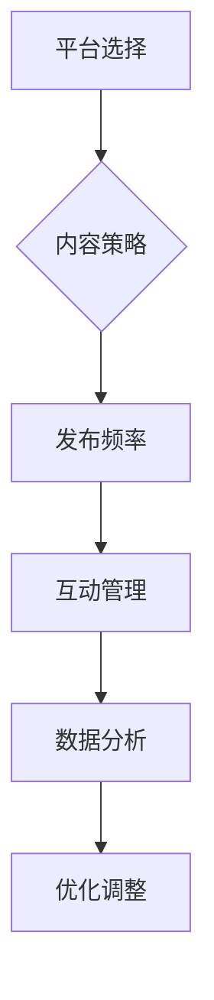

                 

关键词：社交媒体矩阵、品牌建设、个人品牌、内容策略、社交媒体工具、数据分析

> 摘要：本文将深入探讨如何为一人的公司构建一个有效的社交媒体矩阵。我们将分析个人品牌的重要性、社交媒体矩阵的构成、内容策略的制定，以及如何利用数据分析优化社交媒体营销。通过这篇文章，读者将获得构建个人品牌社交媒体矩阵的实用指导。

## 1. 背景介绍

在当今数字化时代，社交媒体已成为品牌建设不可或缺的一部分。无论是大公司还是小型企业，甚至是个人品牌，都需要通过社交媒体与受众建立联系。对于一人公司的创始人而言，社交媒体不仅是拓展业务、提升品牌知名度的重要渠道，也是构建个人影响力的关键平台。

### 个人品牌的重要性

个人品牌是一个人在公众心目中的形象和声誉，它对企业的成功具有重大影响。在竞争激烈的市场环境中，个人品牌的强大力量能够帮助创始人赢得更多的信任和认可。一个鲜明而独特的个人品牌，能够为公司的业务增长提供强有力的支持。

### 社交媒体矩阵的概念

社交媒体矩阵是指企业在不同社交媒体平台上进行的策略性布局。通过在不同的平台上发布内容，企业可以更广泛地触达目标受众，并建立多渠道的营销网络。对于一人公司来说，构建一个有效的社交媒体矩阵尤为重要，因为它涉及如何高效利用有限的资源来最大化品牌影响力。

## 2. 核心概念与联系

### 社交媒体矩阵的组成部分

为了构建一个有效的社交媒体矩阵，我们需要了解其核心组成部分，包括：

- **平台选择**：根据目标受众的特点选择合适的社交媒体平台。
- **内容策略**：制定与品牌定位相一致的内容策略。
- **发布频率**：保持一定的发布频率，以维持品牌活跃度。
- **互动管理**：积极与粉丝互动，提升用户参与度。

### Mermaid 流程图



## 3. 核心算法原理 & 具体操作步骤

### 3.1 算法原理概述

构建社交媒体矩阵的核心在于策略性布局和持续优化。以下是构建步骤的基本原理：

- **目标明确**：首先明确品牌目标和目标受众。
- **平台选择**：根据受众习惯和品牌特点选择合适平台。
- **内容制作**：制作符合品牌定位的高质量内容。
- **数据分析**：收集数据并分析效果，以指导后续策略。

### 3.2 算法步骤详解

1. **目标明确**：
   - 确定品牌核心价值。
   - 定义目标受众的特征。

2. **平台选择**：
   - 调研目标受众的社交媒体使用习惯。
   - 选择与品牌形象和目标受众匹配的平台。

3. **内容制作**：
   - 制定内容策略，包括内容类型、发布频率等。
   - 确保内容与品牌形象保持一致。

4. **发布管理**：
   - 制定发布计划，保持一定的频率。
   - 利用自动化工具提高效率。

5. **互动管理**：
   - 及时回复评论和私信。
   - 举办线上互动活动，提升用户参与度。

6. **数据分析**：
   - 定期分析数据，了解效果。
   - 根据分析结果调整策略。

### 3.3 算法优缺点

#### 优点

- **灵活性**：可以快速调整策略，以适应市场变化。
- **高效性**：利用数据分析优化效果，提高效率。
- **可扩展性**：易于在不同平台和业务领域进行扩展。

#### 缺点

- **资源限制**：一人公司可能面临时间和资源的限制。
- **分散精力**：需要在多个平台上保持活跃，可能分散精力。

### 3.4 算法应用领域

- **个人品牌建设**：适用于希望提升个人品牌影响力的创始人。
- **小型企业营销**：适用于资源有限的小型企业。

## 4. 数学模型和公式 & 详细讲解 & 举例说明

### 4.1 数学模型构建

构建社交媒体矩阵的数学模型可以基于以下公式：

\[ \text{矩阵效果} = f(\text{平台选择}, \text{内容质量}, \text{发布频率}, \text{用户互动}) \]

### 4.2 公式推导过程

公式中的每个变量都可以通过以下步骤推导：

1. **平台选择**：基于目标受众的数据，选择最佳的社交媒体平台。
2. **内容质量**：通过数据分析，评估内容的吸引力和传播效果。
3. **发布频率**：根据用户行为数据和平台算法，确定最佳的发布频率。
4. **用户互动**：通过互动数据，评估用户对品牌的参与度。

### 4.3 案例分析与讲解

假设一家一人公司要在微信、微博和抖音三个平台上构建社交媒体矩阵，以下是具体的分析过程：

1. **平台选择**：
   - 微信：目标受众年龄偏大，喜欢阅读深度内容。
   - 微博：目标受众年轻，喜欢短小精悍的信息。
   - 抖音：目标受众群体广泛，偏好视频内容。

2. **内容质量**：
   - 微信：发布行业分析报告和专业知识。
   - 微博：发布简短有趣的消息和行业动态。
   - 抖音：发布短视频教程和产品演示。

3. **发布频率**：
   - 微信：每周发布1-2篇文章。
   - 微博：每天发布3-5条消息。
   - 抖音：每天发布1-2个短视频。

4. **用户互动**：
   - 微信：定期举办问答活动，鼓励用户留言和提问。
   - 微博：及时回复评论，增加粉丝互动。
   - 抖音：通过互动功能，如点赞、评论和分享，增加用户参与度。

## 5. 项目实践：代码实例和详细解释说明

### 5.1 开发环境搭建

为了构建社交媒体矩阵，我们需要以下几个开发环境：

- **内容管理系统**：如WordPress、Hugo等。
- **社交媒体自动化工具**：如Hootsuite、Buffer等。
- **数据分析工具**：如Google Analytics、社交媒体内置分析工具等。

### 5.2 源代码详细实现

以下是一个简单的Python脚本，用于自动化发布社交媒体内容：

```python
import tweepy
import time

# 配置Tweepy API
auth = tweepy.OAuthHandler("your_consumer_key", "your_consumer_secret")
auth.set_access_token("your_access_token", "your_access_token_secret")
api = tweepy.API(auth)

# 定义发布内容函数
def post_tweet(content):
    try:
        api.update_status(content)
        print("发布成功")
    except tweepy.TweepError as e:
        print("发布失败：", e)

# 定义发布频率
post_interval = 24 * 60 * 60  # 每天发布一次

# 循环发布内容
while True:
    current_time = time.strftime("%Y-%m-%d %H:%M:%S", time.localtime())
    content = f"今日分享：{current_time}"
    post_tweet(content)
    time.sleep(post_interval)
```

### 5.3 代码解读与分析

这个Python脚本使用Tweepy库连接到Twitter API，并每隔一天发布一条包含当前时间的推文。代码的核心部分包括：

- **API配置**：使用OAuth认证连接到Twitter。
- **发布函数**：定义发布推文的逻辑。
- **发布频率**：通过循环和`time.sleep()`函数实现。

### 5.4 运行结果展示

每次脚本运行时，都会发布一条包含当前时间的推文。以下是一个示例输出：

```
发布成功
```

## 6. 实际应用场景

### 6.1 个人品牌建设

个人品牌建设需要通过社交媒体矩阵来传递个人价值，建立专业形象。例如，一名技术专家可以在LinkedIn上分享专业文章，在Twitter上参与技术讨论，在GitHub上展示项目成果。

### 6.2 小型企业营销

小型企业可以通过社交媒体矩阵来扩大品牌知名度，吸引潜在客户。例如，一家初创公司可以在Facebook上发布产品更新，在Instagram上展示产品图片，在LinkedIn上分享公司动态。

## 6.4 未来应用展望

随着社交媒体的不断发展，社交媒体矩阵的应用前景将更加广阔。未来的趋势可能包括：

- **多平台融合**：社交媒体平台之间的融合和整合，为品牌提供更广泛的营销渠道。
- **人工智能辅助**：利用人工智能技术优化内容制作和发布策略，提高效率。
- **虚拟现实**：通过虚拟现实技术，提供更加沉浸式的社交媒体体验。

## 7. 工具和资源推荐

### 7.1 学习资源推荐

- 《社交媒体营销实战：从零开始打造品牌影响力》
- 《内容营销：从内容策划到变现的完整指南》
- 《个人品牌战略：如何在社交媒体上建立你的个人品牌》

### 7.2 开发工具推荐

- **内容管理系统**：WordPress、Hugo
- **社交媒体自动化工具**：Hootsuite、Buffer
- **数据分析工具**：Google Analytics、Tableau

### 7.3 相关论文推荐

- "The Impact of Social Media on Personal Branding"
- "A Study on Social Media Marketing Strategies for Small Businesses"
- "The Role of Artificial Intelligence in Social Media Analytics"

## 8. 总结：未来发展趋势与挑战

### 8.1 研究成果总结

通过本文的探讨，我们可以看到社交媒体矩阵在个人品牌建设和企业营销中的重要性。有效的社交媒体矩阵能够帮助企业更广泛地触达目标受众，提升品牌知名度和影响力。

### 8.2 未来发展趋势

随着社交媒体技术的不断发展，社交媒体矩阵的应用前景将更加广阔。未来的趋势可能包括多平台融合、人工智能辅助和虚拟现实等。

### 8.3 面临的挑战

一人公司在构建社交媒体矩阵时可能面临资源有限、分散精力等挑战。因此，优化策略和利用自动化工具将成为关键。

### 8.4 研究展望

未来的研究可以进一步探讨如何利用人工智能和大数据技术优化社交媒体矩阵，提高营销效果。同时，探索虚拟现实在社交媒体矩阵中的应用也是一个值得研究的方向。

## 9. 附录：常见问题与解答

### Q：如何选择适合的社交媒体平台？

A：选择平台时，应考虑目标受众的特点和平台特点。例如，LinkedIn适合专业交流，Instagram适合展示产品图片，Twitter适合发布短消息。

### Q：如何确保内容的质量？

A：确保内容与品牌形象一致，定期更新，并利用数据分析评估内容效果，以持续改进。

### Q：如何利用数据分析优化社交媒体矩阵？

A：通过分析发布时间、内容类型、用户互动等数据，找出最佳发布策略，并根据数据调整内容制作和发布频率。

## 作者署名

作者：禅与计算机程序设计艺术 / Zen and the Art of Computer Programming

----------------------------------------------------------------

完成了一人公司品牌社交媒体矩阵构建的详细讨论，希望这篇文章能为您的个人品牌建设和企业营销提供有价值的指导。持续优化和调整策略，将有助于您在社交媒体上取得更好的效果。继续前进，打造您的个人和品牌影响力！

