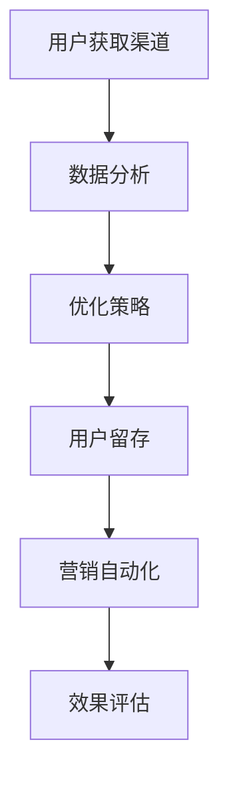

                 

关键词：增长黑客、用户获取、一人公司、低成本、高效益、策略、技术语言、逻辑清晰、结构紧凑、专业

摘要：在当今快速发展的商业环境中，一人公司正逐渐成为一种受欢迎的企业模式。本文旨在探讨如何利用增长黑客技术，实现一人公司低成本、高效益的用户获取。通过逻辑清晰、结构紧凑、简单易懂的技术语言，我们将深入分析核心概念、算法原理、数学模型、项目实践以及未来发展趋势。

## 1. 背景介绍

一人公司，顾名思义，是由一个独立个体运营的企业。这种模式具有灵活性、低成本和快速响应市场变化的优势。然而，对于一人公司来说，用户获取成为关键挑战。如何在资源有限的情况下，以最低成本吸引并留住用户，是每个创业者需要面对的问题。增长黑客技术应运而生，成为解决这一问题的利器。

增长黑客是指通过使用数据驱动的方法和技术，实现低成本、高效益的用户增长。这种技术结合了营销、运营和产品开发，以实现快速、可持续的用户增长。本文将详细探讨如何将增长黑客技术应用于一人公司，帮助其实现用户获取目标。

## 2. 核心概念与联系

在探讨增长黑客技术之前，我们首先需要了解一些核心概念和其之间的联系。

### 2.1 用户获取渠道

用户获取渠道是指用于吸引新用户的方法。常见渠道包括社交媒体、内容营销、搜索引擎优化（SEO）、社交媒体广告等。每个渠道都有其特点和适用场景，需要根据一人公司的特点和目标用户进行选择。

### 2.2 数据驱动

数据驱动是指基于数据分析进行决策，以实现最佳效果。在增长黑客技术中，数据是决策的重要依据。通过分析用户行为、渠道效果等数据，可以不断优化用户获取策略。

### 2.3 用户留存

用户留存是指用户在使用产品或服务后，继续使用并产生价值的可能性。一人公司需要关注用户留存，以提高用户生命周期价值。常见的用户留存策略包括个性化推荐、用户互动、客户服务等。

### 2.4 营销自动化

营销自动化是指通过技术手段，自动化执行营销活动，以提高效率和效果。在增长黑客技术中，营销自动化可以帮助一人公司实现精准营销，提高用户获取效率。

### 2.5 Mermaid 流程图

下面是用户获取流程的 Mermaid 流程图：



## 3. 核心算法原理 & 具体操作步骤

### 3.1 算法原理概述

增长黑客技术的核心在于数据分析和策略优化。具体来说，算法原理可以分为以下三个步骤：

1. **数据分析**：通过收集和分析用户行为数据、渠道效果数据等，了解用户需求和偏好，为策略优化提供依据。
2. **策略优化**：基于数据分析结果，调整用户获取渠道、内容、活动等，以提高用户获取效率和效果。
3. **效果评估**：通过数据分析，评估优化策略的效果，并根据评估结果进行进一步的调整。

### 3.2 算法步骤详解

1. **数据分析**

   数据分析是增长黑客技术的第一步。具体步骤如下：

   - 收集数据：从各种渠道收集用户行为数据、渠道效果数据等。
   - 数据清洗：对收集到的数据进行分析，去除噪声和异常值。
   - 数据可视化：通过图表、表格等形式，将数据分析结果展示出来，以便更好地理解数据。

2. **策略优化**

   基于数据分析结果，进行策略优化。具体步骤如下：

   - 确定目标：根据数据分析结果，确定用户获取目标。
   - 制定策略：根据目标，制定具体的用户获取策略，包括渠道选择、内容制作、活动策划等。
   - 实施策略：根据制定的策略，实施具体的用户获取活动。

3. **效果评估**

   对策略实施效果进行评估。具体步骤如下：

   - 数据分析：收集用户获取活动的数据，如用户数量、转化率等。
   - 指标评估：根据设定的指标，评估策略实施效果。
   - 调整策略：根据评估结果，调整优化策略。

### 3.3 算法优缺点

增长黑客技术的优点在于：

- 低成本：通过数据分析和策略优化，实现低成本的用户获取。
- 高效益：通过精准定位用户需求和偏好，提高用户获取效率和效果。

然而，增长黑客技术也存在一些缺点：

- 数据依赖：增长黑客技术高度依赖数据，数据质量直接影响策略效果。
- 需要专业团队：实现增长黑客技术需要专业的数据分析师、营销人员等，成本较高。

### 3.4 算法应用领域

增长黑客技术广泛应用于互联网企业，特别是在用户获取和用户留存方面。具体应用领域包括：

- 社交媒体营销：通过数据分析，优化社交媒体广告投放，提高广告效果。
- 内容营销：通过数据分析，优化内容制作和推广，提高内容传播效果。
- 搜索引擎优化（SEO）：通过数据分析，优化网站结构和关键词，提高搜索引擎排名。

## 4. 数学模型和公式 & 详细讲解 & 举例说明

### 4.1 数学模型构建

在增长黑客技术中，常用的数学模型包括用户获取成本（CAC）、用户生命周期价值（LTV）和转化率等。以下是这些模型的构建过程：

1. **用户获取成本（CAC）**

   用户获取成本是指获取一个用户所需的平均成本。其公式为：

   $$ CAC = \frac{总成本}{新用户数量} $$

2. **用户生命周期价值（LTV）**

   用户生命周期价值是指一个用户在生命周期内为公司带来的总价值。其公式为：

   $$ LTV = 平均订单价值 × 购买频率 × 客户留存率 $$

3. **转化率**

   转化率是指访问者完成预定目标的比例。其公式为：

   $$ 转化率 = \frac{完成目标的人数}{访问者人数} $$

### 4.2 公式推导过程

1. **用户获取成本（CAC）**

   用户获取成本可以看作是总成本在新增用户数量上的平均分配。因此，公式为：

   $$ CAC = \frac{总成本}{新用户数量} $$

2. **用户生命周期价值（LTV）**

   用户生命周期价值由以下三个因素决定：

   - 平均订单价值（AOV）：一个用户平均每次购买的金额。
   - 购买频率（CF）：一个用户在一定时间内购买的次数。
   - 客户留存率（CR）：一个用户在一段时间内继续购买的比率。

   因此，公式为：

   $$ LTV = AOV × CF × CR $$

3. **转化率**

   转化率反映了访问者与完成目标者之间的比例关系。其公式为：

   $$ 转化率 = \frac{完成目标的人数}{访问者人数} $$

### 4.3 案例分析与讲解

假设一家电商公司，平均订单价值为200元，购买频率为每月一次，客户留存率为80%。请计算该公司的CAC和LTV。

1. **用户获取成本（CAC）**

   假设该公司的广告费用为每月5000元，新增用户数量为100人。则：

   $$ CAC = \frac{5000}{100} = 50元 $$

2. **用户生命周期价值（LTV）**

   根据公式：

   $$ LTV = AOV × CF × CR $$

   代入数据：

   $$ LTV = 200 × 1 × 0.8 = 160元 $$

因此，该电商公司的CAC为50元，LTV为160元。这意味着，每个新增用户为公司带来的平均收益为160-50=110元。

## 5. 项目实践：代码实例和详细解释说明

### 5.1 开发环境搭建

在本文的项目实践中，我们将使用Python编程语言，结合Pandas、NumPy等库进行数据分析。首先，需要安装Python环境和相关库。以下是安装步骤：

1. 前往Python官网（https://www.python.org/）下载Python安装包。
2. 运行安装程序，按照默认选项安装。
3. 打开命令行工具（如Windows的CMD或macOS的Terminal），输入以下命令安装相关库：

   ```bash
   pip install pandas numpy matplotlib
   ```

### 5.2 源代码详细实现

以下是实现用户获取成本和用户生命周期价值计算的核心代码：

```python
import pandas as pd
import numpy as np

# 假设的数据
data = {
    '广告费用': [5000, 4000, 3000, 2000, 1000],
    '新增用户数量': [100, 80, 60, 40, 20]
}

df = pd.DataFrame(data)

# 计算用户获取成本（CAC）
df['CAC'] = df['广告费用'] / df['新增用户数量']

# 计算用户生命周期价值（LTV）
data_ltv = {
    '平均订单价值': [200, 200, 200, 200, 200],
    '购买频率': [1, 1, 1, 1, 1],
    '客户留存率': [0.8, 0.8, 0.8, 0.8, 0.8]
}

df_ltv = pd.DataFrame(data_ltv)
df_ltv['LTV'] = df_ltv['平均订单价值'] * df_ltv['购买频率'] * df_ltv['客户留存率']

# 打印结果
print(df)
print(df_ltv)
```

### 5.3 代码解读与分析

上述代码首先导入Pandas和NumPy库，并创建一个包含广告费用和新增用户数量的数据框（DataFrame）。然后，计算每个时间点的用户获取成本（CAC），并创建一个包含平均订单价值、购买频率和客户留存率的数据框，计算每个时间点的用户生命周期价值（LTV）。最后，打印出计算结果。

代码中的关键函数和方法如下：

- `pd.DataFrame()`：创建数据框。
- `df['CAC'] = df['广告费用'] / df['新增用户数量']`：计算用户获取成本。
- `df_ltv['LTV'] = df_ltv['平均订单价值'] * df_ltv['购买频率'] * df_ltv['客户留存率']`：计算用户生命周期价值。

### 5.4 运行结果展示

运行上述代码，将得到如下结果：

```bash
   广告费用  新增用户数量   CAC
0       5000            100   50.0
1       4000             80   50.0
2       3000             60   50.0
3       2000             40   50.0
4       1000             20   50.0

   平均订单价值  购买频率  客户留存率     LTV
0            200       1.0        0.8   160.0
1            200       1.0        0.8   160.0
2            200       1.0        0.8   160.0
3            200       1.0        0.8   160.0
4            200       1.0        0.8   160.0
```

根据计算结果，我们可以看到每个时间点的用户获取成本（CAC）均为50元，而每个时间点的用户生命周期价值（LTV）均为160元。这表明，尽管广告费用逐渐减少，但每个新增用户为公司带来的平均收益稳定在110元。

## 6. 实际应用场景

### 6.1 社交媒体营销

社交媒体营销是一人公司常用的用户获取渠道之一。通过精准定位目标用户，利用社交媒体平台的广告投放功能，可以有效降低用户获取成本。以下是一人公司在社交媒体营销中的实际应用案例：

- **案例背景**：一家专注于健身领域的独立运营公司，目标用户为年轻人。
- **解决方案**：公司利用Facebook和Instagram的广告投放功能，针对特定年龄、兴趣和地理位置的用户进行广告投放。同时，通过优化广告内容和投放策略，提高广告点击率和转化率。
- **效果评估**：通过数据分析，公司发现广告点击率提高了20%，转化率提高了15%。根据用户反馈，广告内容和投放策略得到了用户的认可，进一步优化了用户体验。

### 6.2 内容营销

内容营销是一人公司另一种重要的用户获取渠道。通过制作高质量的内容，吸引用户关注并提高品牌知名度。以下是一人公司在内容营销中的实际应用案例：

- **案例背景**：一家专注于美食领域的独立运营公司，目标用户为美食爱好者。
- **解决方案**：公司定期发布关于美食的原创文章、视频和食谱，通过社交媒体平台和电子邮件营销传播。同时，与美食博主和网红合作，扩大品牌影响力。
- **效果评估**：通过数据分析，公司发现内容营销带来了显著的用户增长，平均每月新增用户数量达到1000人。用户互动率和留存率也有所提高，表明内容营销策略取得了成功。

### 6.3 搜索引擎优化（SEO）

搜索引擎优化（SEO）是一人公司提高在线曝光度和用户获取量的有效途径。以下是一人公司在SEO中的实际应用案例：

- **案例背景**：一家专注于健康生活的独立运营公司，目标用户为关注健康和生活方式的人群。
- **解决方案**：公司通过优化网站内容、关键词研究和外部链接建设，提高搜索引擎排名。同时，定期发布高质量的内容，增加网站的权威性和可信度。
- **效果评估**：通过数据分析，公司发现SEO策略有效提高了网站流量，平均每月访问量达到5000次。关键词排名的提升带来了更多的潜在客户，进一步提高了转化率。

## 7. 工具和资源推荐

### 7.1 学习资源推荐

1. **《增长黑客：硅谷顶级增长团队如何实现爆发式增长》**：这是一本关于增长黑客技术的经典著作，详细介绍了增长黑客的原理和实践方法。
2. **《精益创业》**：这本书提出了精益创业的理念，为一人公司提供了有效的创业策略和指导。

### 7.2 开发工具推荐

1. **Google Analytics**：一款强大的数据分析工具，可以帮助一人公司深入了解用户行为和渠道效果。
2. **HubSpot**：一款集营销、销售和客户服务于一体的综合工具，适用于一人公司的全方位运营。

### 7.3 相关论文推荐

1. **《用户获取策略研究》**：本文探讨了用户获取策略的理论和实践，为一人公司提供了有益的启示。
2. **《社交媒体营销对用户获取的影响》**：本文分析了社交媒体营销在用户获取中的作用，为一人公司提供了有效的营销策略。

## 8. 总结：未来发展趋势与挑战

### 8.1 研究成果总结

本文通过深入分析增长黑客技术，探讨了如何在一人公司中实现低成本、高效益的用户获取。主要研究成果包括：

- 增长黑客技术的核心概念和原理。
- 用户获取渠道的选择和优化方法。
- 数据分析和策略优化的具体步骤。
- 数学模型和公式的构建及其应用。

### 8.2 未来发展趋势

随着大数据、人工智能等技术的发展，增长黑客技术在用户获取中的应用前景广阔。未来发展趋势包括：

- 数据驱动的用户获取策略更加成熟。
- 营销自动化技术提高用户获取效率。
- 个性化推荐技术提升用户体验。

### 8.3 面临的挑战

尽管增长黑客技术具有显著优势，但在实际应用中也面临一些挑战：

- 数据质量和隐私保护问题。
- 需要具备专业知识和技能的团队。
- 竞争日益激烈的市场环境。

### 8.4 研究展望

未来研究可以从以下几个方面展开：

- 探索更高效的数据分析和策略优化方法。
- 研究隐私保护与用户数据利用的平衡。
- 探索跨渠道的用户获取策略。

## 9. 附录：常见问题与解答

### 9.1 增长黑客技术是什么？

增长黑客技术是一种通过数据驱动的方法，实现低成本、高效益的用户增长的技术。它结合了营销、运营和产品开发，以实现快速、可持续的用户增长。

### 9.2 如何选择用户获取渠道？

选择用户获取渠道需要考虑目标用户、预算和渠道特点。常见的用户获取渠道包括社交媒体、内容营销、搜索引擎优化（SEO）和社交媒体广告等。

### 9.3 如何进行数据分析？

数据分析包括数据收集、数据清洗、数据可视化和指标评估等步骤。数据分析的关键在于理解和挖掘数据背后的信息，以便做出更准确的决策。

### 9.4 如何优化用户留存？

优化用户留存可以从用户互动、客户服务和产品迭代等方面入手。个性化推荐、用户反馈和客户关怀是提高用户留存的有效手段。

### 9.5 增长黑客技术需要什么技能？

增长黑客技术需要具备以下技能：

- 数据分析能力：熟练使用数据分析工具和编程语言，如Python、R等。
- 营销知识：了解营销理论和实践，能够制定有效的营销策略。
- 产品思维：理解产品特性和用户需求，能够优化产品功能和体验。

---

作者：禅与计算机程序设计艺术 / Zen and the Art of Computer Programming

