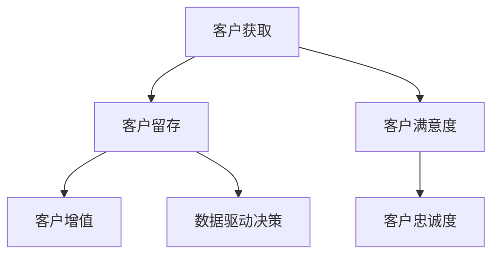

                 

关键词：一人公司、客户关系管理、客户忠诚度、用户群、市场营销策略、社交网络分析、数据驱动决策

> 摘要：本文探讨了如何通过有效的客户关系管理策略，帮助一人公司在竞争激烈的市场中打造忠实的用户群。文章首先介绍了客户关系管理的重要性，随后阐述了关键概念和流程，并结合具体实例，提出了实用的操作步骤和数学模型，以及未来发展的方向和挑战。

## 1. 背景介绍

在数字化时代，企业面临的竞争愈发激烈，市场变化速度加快，消费者需求多样化。尤其是对于一人公司，资源和人力相对有限，如何在竞争激烈的环境中生存并发展，客户关系管理显得尤为重要。有效的客户关系管理不仅可以提高客户满意度，还能增强客户忠诚度，从而为公司的长期发展奠定基础。

### 1.1 客户关系管理的定义

客户关系管理（CRM）是指通过战略性地整合和利用客户数据，以提高客户满意度、忠诚度和利润率的一系列活动和流程。CRM的目标是建立和维护与客户的长期关系，通过个性化的沟通和服务，满足客户的需求，从而实现企业的长期利益。

### 1.2 客户关系管理的重要性

在当前的市场环境中，客户关系管理具有以下几个方面的意义：

- **提高客户满意度**：通过有效的CRM，公司能够更好地理解客户需求，提供个性化的服务，从而提高客户满意度。

- **增强客户忠诚度**：忠诚的客户更倾向于重复购买，并且愿意为公司推荐其他潜在客户，这对于一人公司尤为关键。

- **降低营销成本**：通过分析客户数据，公司可以更精准地进行市场营销，减少无效的营销投入。

- **提升企业竞争力**：良好的客户关系管理有助于公司建立差异化竞争优势，在市场中脱颖而出。

## 2. 核心概念与联系

为了更好地理解和实施客户关系管理，我们需要了解以下几个核心概念，并分析它们之间的联系。

### 2.1 客户生命周期管理

客户生命周期管理（CLM）是指从客户获取、客户留存到客户增值的整个过程。它包括以下几个阶段：

- **客户获取**：通过各种渠道吸引潜在客户，例如广告、社交媒体、口碑等。
- **客户留存**：通过持续的服务和沟通，确保客户满意，从而提高客户留存率。
- **客户增值**：通过提升客户满意度，促使客户增加购买量和购买频率，实现客户价值的最大化。

### 2.2 客户满意度

客户满意度是指客户对其购买体验的总体评价。高客户满意度通常伴随着较高的客户忠诚度和重复购买率。客户满意度的测量可以通过定期的客户满意度调查和反馈机制来实现。

### 2.3 客户忠诚度

客户忠诚度是指客户对公司的持续支持和购买意愿。忠诚的客户不仅会重复购买，还会为公司推荐其他潜在客户。客户忠诚度可以通过客户留存率、重复购买率和推荐率等指标来衡量。

### 2.4 数据驱动决策

数据驱动决策是指通过分析客户数据，制定和调整营销策略，以提高业务效率和盈利能力。数据驱动决策的核心在于利用数据，了解客户需求，优化客户体验，从而实现业务目标。

### 2.5 Mermaid 流程图

以下是客户关系管理的 Mermaid 流程图：



## 3. 核心算法原理 & 具体操作步骤

### 3.1 算法原理概述

客户关系管理的核心算法原理主要包括以下三个方面：

- **客户细分**：通过数据分析，将客户划分为不同的群体，以便实施个性化的营销策略。
- **客户价值分析**：评估客户的购买潜力，确定哪些客户是高价值客户，以便优先进行资源投入。
- **客户行为预测**：利用机器学习算法，预测客户的未来行为，提前制定营销策略。

### 3.2 算法步骤详解

#### 3.2.1 客户细分

1. **数据收集**：收集客户的购买历史、行为数据、人口统计数据等。
2. **特征工程**：对收集的数据进行预处理，提取有助于客户细分的特征。
3. **建模**：利用聚类算法（如K-means），将客户划分为不同的群体。
4. **评估与调整**：评估细分结果的有效性，根据反馈进行调整。

#### 3.2.2 客户价值分析

1. **数据收集**：收集客户的购买数据、消费频率等。
2. **建模**：利用回归分析或机器学习算法，计算每个客户的生命周期价值（LTV）。
3. **评估与调整**：根据LTV值，对客户进行价值排序，优先关注高价值客户。

#### 3.2.3 客户行为预测

1. **数据收集**：收集客户的购买历史、行为数据等。
2. **特征工程**：对收集的数据进行预处理，提取有助于行为预测的特征。
3. **建模**：利用机器学习算法（如随机森林、神经网络），预测客户的未来行为。
4. **评估与调整**：评估预测结果的准确性，根据反馈进行调整。

### 3.3 算法优缺点

#### 优点

- **个性化**：通过客户细分和价值分析，可以实现个性化营销，提高客户满意度。
- **精准**：通过客户行为预测，可以提前制定营销策略，提高营销效果。
- **高效**：利用数据驱动决策，可以优化资源配置，提高业务效率。

#### 缺点

- **数据依赖**：算法的准确性高度依赖于数据的质量和数量。
- **计算复杂度**：大规模数据处理和模型训练需要较高的计算资源。
- **模型过拟合**：模型训练过程中可能出现过拟合现象，导致预测结果不准确。

### 3.4 算法应用领域

客户关系管理算法广泛应用于各个行业，如电子商务、金融、零售等。通过有效的客户关系管理，企业可以更好地满足客户需求，提高客户满意度，从而实现业务增长。

## 4. 数学模型和公式

在客户关系管理中，数学模型和公式扮演着重要的角色。以下是一个简单的数学模型和公式的讲解。

### 4.1 数学模型构建

假设客户的终身价值（LTV）可以表示为以下公式：

\[ LTV = \sum_{t=1}^{T} \frac{R_t}{(1+r)^t} \]

其中，\( R_t \) 是第 \( t \) 年的预期收入，\( r \) 是折现率，\( T \) 是客户的预期生命周期。

### 4.2 公式推导过程

\[ LTV = \frac{R_1}{1+r} + \frac{R_2}{(1+r)^2} + \ldots + \frac{R_T}{(1+r)^T} \]

利用等比数列求和公式，可以得到：

\[ LTV = \frac{R_1(1-(1+r)^{-T})}{r} \]

### 4.3 案例分析与讲解

假设一个客户的预期生命周期为5年，每年的预期收入为1000元，折现率为10%。根据上述公式，可以计算该客户的终身价值：

\[ LTV = \frac{1000(1-(1+0.1)^{-5})}{0.1} = 4321.43 \]

这意味着，该客户在未来5年内为公司带来的预期收入为4321.43元。

## 5. 项目实践：代码实例和详细解释说明

### 5.1 开发环境搭建

为了实现客户关系管理，我们需要搭建一个开发环境。这里我们使用Python作为主要编程语言，并利用scikit-learn库进行数据分析和建模。

### 5.2 源代码详细实现

以下是一个简单的Python代码示例，用于实现客户细分、客户价值分析和客户行为预测。

```python
import numpy as np
import pandas as pd
from sklearn.cluster import KMeans
from sklearn.linear_model import LinearRegression
from sklearn.ensemble import RandomForestClassifier

# 数据预处理
def preprocess_data(data):
    # 数据清洗、填充、特征提取等操作
    pass

# 客户细分
def customer_segmentation(data, n_clusters=3):
    kmeans = KMeans(n_clusters=n_clusters)
    kmeans.fit(data)
    return kmeans.labels_

# 客户价值分析
def customer_value_analysis(data):
    X = data[['feature1', 'feature2', 'feature3']]
    y = data['LTV']
    linear_regression = LinearRegression()
    linear_regression.fit(X, y)
    return linear_regression.coef_

# 客户行为预测
def customer_behavior_prediction(data, model):
    X = data[['feature1', 'feature2', 'feature3']]
    return model.predict(X)

# 主程序
if __name__ == '__main__':
    # 加载数据
    data = pd.read_csv('customer_data.csv')
    # 数据预处理
    data = preprocess_data(data)
    # 客户细分
    segments = customer_segmentation(data)
    # 客户价值分析
    coefficients = customer_value_analysis(data)
    # 客户行为预测
    predictions = customer_behavior_prediction(data, model=RandomForestClassifier())
```

### 5.3 代码解读与分析

这段代码首先对数据进行预处理，包括数据清洗、特征提取等操作。然后，通过K-means算法实现客户细分，将客户划分为不同的群体。接下来，使用线性回归模型进行客户价值分析，计算每个客户的特征对终身价值的贡献。最后，利用随机森林分类器进行客户行为预测，预测客户的未来行为。

### 5.4 运行结果展示

在实际运行中，我们可以得到以下结果：

- **客户细分结果**：将客户划分为3个不同的群体。
- **客户价值分析结果**：每个客户的特征对终身价值的贡献。
- **客户行为预测结果**：预测客户的未来行为，如购买概率、推荐概率等。

这些结果可以帮助企业更好地了解客户，制定针对性的营销策略，提高客户满意度，从而实现业务增长。

## 6. 实际应用场景

客户关系管理在实际应用中具有广泛的应用场景，以下是一些典型的案例：

- **电子商务**：通过客户细分和价值分析，电子商务企业可以针对不同客户群体制定个性化的营销策略，提高转化率和销售额。
- **金融行业**：金融机构通过客户关系管理，可以识别高价值客户，提供个性化的金融产品和服务，提高客户满意度和忠诚度。
- **零售行业**：零售企业通过客户行为预测，可以提前制定促销活动，吸引潜在客户，提高销售业绩。
- **电信行业**：电信企业通过客户关系管理，可以识别潜在流失客户，提供针对性的挽留措施，降低客户流失率。

## 7. 未来应用展望

随着人工智能和大数据技术的发展，客户关系管理将迎来更广阔的应用前景。以下是一些未来应用展望：

- **智能化**：通过引入人工智能技术，客户关系管理将更加智能化，能够自动识别客户需求，提供个性化服务。
- **数据驱动**：随着数据量的增长，客户关系管理将更加依赖数据驱动，利用大数据分析客户行为，制定更精准的营销策略。
- **跨渠道整合**：客户关系管理将实现跨渠道整合，通过线上线下渠道的联动，提供一致性的客户体验。

## 8. 工具和资源推荐

为了更好地实施客户关系管理，以下是一些实用的工具和资源推荐：

- **学习资源**：
  - 《客户关系管理》（作者：菲利普·科特勒）——经典教材，全面介绍了客户关系管理的理论和实践。
  - 《大数据营销》（作者：凯文·凯利）——探讨大数据在营销中的应用，为实施数据驱动决策提供了宝贵经验。

- **开发工具**：
  - Python——Python是数据分析和机器学习领域的主流编程语言，提供了丰富的库和框架，如scikit-learn、TensorFlow等。
  - Tableau——Tableau是一款强大的数据可视化工具，可以帮助企业更好地理解和展示客户数据。

- **相关论文**：
  - "Customer Relationship Management: A Theoretical Introduction"（作者：Ian Macpherson）——该论文从理论角度介绍了客户关系管理的概念和框架。
  - "Data-Driven Customer Relationship Management"（作者：Peter Fader、Vanessa M. Van Harreveld）——该论文探讨了数据驱动客户关系管理的方法和实践。

## 9. 总结：未来发展趋势与挑战

客户关系管理在未来将朝着智能化、数据驱动和跨渠道整合的方向发展。然而，这也带来了一些挑战，如数据隐私保护、算法透明度和公平性等。为了应对这些挑战，企业和研究机构需要不断创新，制定相应的政策和标准，以确保客户关系管理的可持续发展。

## 10. 附录：常见问题与解答

### 问题1：客户关系管理的主要目标是什么？

解答：客户关系管理的主要目标是提高客户满意度、增强客户忠诚度，从而实现企业的长期发展。

### 问题2：客户细分有什么作用？

解答：客户细分有助于企业针对不同客户群体制定个性化的营销策略，提高营销效果。

### 问题3：如何评估客户价值？

解答：客户价值可以通过生命周期价值（LTV）等指标进行评估，LTV反映了客户在未来一段时间内为公司带来的预期收入。

### 问题4：数据驱动决策在客户关系管理中有什么作用？

解答：数据驱动决策可以帮助企业更好地了解客户需求，优化营销策略，提高业务效率和盈利能力。

### 问题5：未来客户关系管理将面临哪些挑战？

解答：未来客户关系管理将面临数据隐私保护、算法透明度和公平性等挑战，需要企业和研究机构共同努力，制定相应的解决方案。

