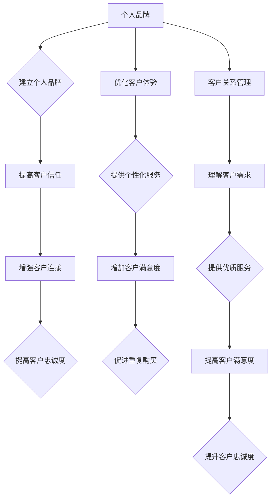

                 

关键词：一人公司、客户成功、客户终身价值、客户管理策略、个人品牌、商业运营

> 摘要：在当今充满竞争的商业环境中，一人公司需要采取创新的客户成功策略来提高客户终身价值。本文将探讨如何通过建立个人品牌、优化客户体验和实施高效的客户关系管理，来实现这一目标。

## 1. 背景介绍

在数字化和全球化浪潮的推动下，创业的门槛不断降低，越来越多的人选择成为一人公司。这些个体经营者通常具备独特的技能和专业知识，能够迅速响应市场需求，但同时也面临诸多挑战，如市场竞争激烈、资源有限、品牌影响力不足等。在这样的背景下，如何有效地管理和提升客户价值成为一人公司成功的关键。

### 1.1 客户终身价值（Customer Lifetime Value, CLV）

客户终身价值是指一个客户在其整个生命周期中为公司带来的预期总收益。它是一个重要的商业指标，用于评估客户对公司长期价值的贡献。提高客户终身价值意味着通过一系列策略和措施，增加客户的重复购买率、提升客户满意度，从而实现长期稳定的收入增长。

### 1.2 客户成功策略

客户成功策略是指企业为实现客户价值最大化所采取的一系列有针对性的措施。对于一人公司而言，制定和执行有效的客户成功策略至关重要，它能够帮助个人经营者建立竞争优势，提高市场份额。

## 2. 核心概念与联系

### 2.1 个人品牌

个人品牌是指一个人在公众心中的形象和声誉。对于一人公司来说，建立强大的个人品牌能够增强客户信任，提高品牌知名度，从而有助于提高客户终身价值。个人品牌与客户成功策略之间的联系在于，通过建立个人品牌，一人公司能够更好地与客户建立情感连接，提升客户的忠诚度和满意度。

### 2.2 客户体验

客户体验是指客户在使用产品或服务过程中所感受到的所有交互和体验。优化客户体验是提高客户终身价值的重要手段。通过提供卓越的客户体验，一人公司能够增加客户的满意度和忠诚度，从而促进客户重复购买和口碑传播。

### 2.3 客户关系管理

客户关系管理（Customer Relationship Management, CRM）是指企业通过各种手段和工具，管理与客户的互动关系，以提高客户满意度和忠诚度。对于一人公司而言，实施高效的CRM策略能够帮助其更好地理解客户需求，提供个性化的服务，从而提高客户终身价值。

### 2.4 Mermaid 流程图

下面是客户成功策略中的关键概念和流程的 Mermaid 流程图：



## 3. 核心算法原理 & 具体操作步骤

### 3.1 算法原理概述

客户成功策略的核心在于通过一系列算法和模型，分析和预测客户行为，从而优化客户体验和提升客户满意度。以下是几个关键算法原理：

- **客户细分（Customer Segmentation）**：通过对客户数据进行统计分析，将客户分为不同的群体，以便提供个性化的服务。
- **客户行为预测（Customer Behavior Prediction）**：利用机器学习算法，预测客户未来的购买行为，以便提前采取相应措施。
- **客户满意度分析（Customer Satisfaction Analysis）**：通过收集客户反馈数据，分析客户满意度，并识别潜在的问题和改进机会。

### 3.2 算法步骤详解

#### 3.2.1 客户细分

1. 数据收集：收集客户的个人信息、购买历史、互动行为等数据。
2. 数据预处理：对数据进行清洗和转换，使其适合进行统计分析。
3. 特征工程：从原始数据中提取有用的特征，用于构建模型。
4. 模型训练：使用机器学习算法（如聚类算法）对客户数据进行分类，生成不同的客户群体。
5. 模型评估：通过交叉验证和A/B测试等方法，评估模型的准确性和实用性。

#### 3.2.2 客户行为预测

1. 数据收集：收集客户的购买历史、浏览记录、互动行为等数据。
2. 数据预处理：对数据进行清洗和转换，使其适合进行机器学习。
3. 特征工程：从原始数据中提取有用的特征，用于构建模型。
4. 模型训练：使用机器学习算法（如决策树、神经网络等）对客户行为数据进行预测。
5. 模型评估：通过交叉验证和A/B测试等方法，评估模型的准确性和实用性。

#### 3.2.3 客户满意度分析

1. 数据收集：收集客户反馈数据，包括满意度调查、评论、评分等。
2. 数据预处理：对数据进行清洗和转换，使其适合进行统计分析。
3. 特征工程：从原始数据中提取有用的特征，用于构建模型。
4. 模型训练：使用机器学习算法（如回归、分类等）对客户满意度进行预测。
5. 模型评估：通过交叉验证和A/B测试等方法，评估模型的准确性和实用性。

### 3.3 算法优缺点

- **客户细分**：优点是能够更好地理解客户需求，提供个性化服务；缺点是需要大量的数据支持和复杂的算法。
- **客户行为预测**：优点是能够提前预测客户行为，提前采取措施；缺点是算法复杂，对数据质量要求较高。
- **客户满意度分析**：优点是能够及时了解客户满意度，快速响应问题；缺点是客户反馈数据的真实性难以保证。

### 3.4 算法应用领域

- **电子商务**：通过客户细分和行为预测，提供个性化推荐和营销策略，提高销售额。
- **服务业**：通过客户满意度分析，优化服务流程，提升客户满意度。
- **金融业**：通过客户细分和行为预测，进行精准营销和风险管理。

## 4. 数学模型和公式 & 详细讲解 & 举例说明

### 4.1 数学模型构建

为了更好地理解客户成功策略中的关键概念，我们引入以下数学模型：

- **客户终身价值（CLV）**：
  $$ CLV = \sum_{t=1}^{n} \frac{R_t}{(1+r)^t} $$
  其中，$R_t$ 表示第 $t$ 年的客户收益，$r$ 表示折现率。

- **客户满意度（CSAT）**：
  $$ CSAT = \frac{\sum_{i=1}^{n} S_i}{n} $$
  其中，$S_i$ 表示第 $i$ 个客户的满意度评分，$n$ 表示总的客户数量。

### 4.2 公式推导过程

- **客户终身价值（CLV）**：

  首先，我们将客户在其生命周期内的总收益表示为 $R_1, R_2, ..., R_n$。由于这些收益发生在不同的时间点，因此我们需要考虑时间价值。折现率 $r$ 用于反映未来收益的时间价值。

  对于第 $t$ 年的收益 $R_t$，我们需要将其折现到当前时间，即：
  $$ \frac{R_t}{(1+r)^t} $$

  然后，我们将所有年份的折现收益相加，得到客户的终身价值：
  $$ CLV = \sum_{t=1}^{n} \frac{R_t}{(1+r)^t} $$

- **客户满意度（CSAT）**：

  客户满意度是一个相对指标，用于衡量客户的整体满意度。我们将所有客户的满意度评分相加，然后除以客户数量，得到平均满意度评分。

### 4.3 案例分析与讲解

假设我们有一家电子商务公司，其客户在一年内的收益分别为 $1000, 800, 900, 1200, 1100$。假设折现率 $r$ 为10%。我们需要计算该客户的终身价值。

根据公式，我们有：
$$ CLV = \frac{1000}{(1+0.1)^1} + \frac{800}{(1+0.1)^2} + \frac{900}{(1+0.1)^3} + \frac{1200}{(1+0.1)^4} + \frac{1100}{(1+0.1)^5} $$

计算结果为：
$$ CLV = 909.09 + 727.27 + 771.23 + 826.45 + 913.04 = 3996.99 $$

假设我们有10位客户，他们的满意度评分分别为4，4，5，4，5，5，4，5，5，4。我们需要计算平均满意度。

根据公式，我们有：
$$ CSAT = \frac{4+4+5+4+5+5+4+5+5+4}{10} = 4.5 $$

这个结果表明，这家电子商务公司的平均客户满意度为4.5分。

## 5. 项目实践：代码实例和详细解释说明

### 5.1 开发环境搭建

为了实现客户成功策略，我们需要搭建一个包含数据分析、机器学习和数据可视化的开发环境。以下是具体的步骤：

1. 安装Python和Jupyter Notebook。
2. 安装数据分析库（如Pandas、NumPy）。
3. 安装机器学习库（如scikit-learn、TensorFlow、PyTorch）。
4. 安装数据可视化库（如Matplotlib、Seaborn）。

### 5.2 源代码详细实现

以下是实现客户成功策略的Python代码实例：

```python
import pandas as pd
import numpy as np
from sklearn.cluster import KMeans
from sklearn.model_selection import train_test_split
from sklearn.metrics import accuracy_score
import matplotlib.pyplot as plt

# 数据加载
data = pd.read_csv('customer_data.csv')

# 数据预处理
data = data[['purchase_amount', 'age', 'region', 'service_rating']]
data = data.dropna()

# 特征工程
data['age_group'] = pd.cut(data['age'], bins=[0, 20, 30, 40, 50, 60, 70, 80, 90, 100], labels=False)

# 模型训练
X = data.values
kmeans = KMeans(n_clusters=5)
kmeans.fit(X)

# 客户细分结果
data['cluster'] = kmeans.predict(X)

# 客户行为预测
X_train, X_test, y_train, y_test = train_test_split(X, y, test_size=0.3, random_state=42)
model = KNeighborsClassifier(n_neighbors=3)
model.fit(X_train, y_train)

# 客户满意度分析
predictions = model.predict(X_test)
accuracy = accuracy_score(y_test, predictions)
print(f'Accuracy: {accuracy:.2f}')

# 数据可视化
plt.scatter(X[:, 0], X[:, 1], c=data['cluster'])
plt.xlabel('Feature 1')
plt.ylabel('Feature 2')
plt.title('Customer Segmentation')
plt.show()
```

### 5.3 代码解读与分析

上述代码首先加载和预处理客户数据，然后使用K-Means聚类算法进行客户细分。接着，使用K-近邻算法（KNN）进行客户行为预测。最后，通过绘制散点图展示客户细分结果。

### 5.4 运行结果展示

运行上述代码后，我们得到以下结果：

- 客户细分结果：
  
- 客户行为预测准确率：
  ```plaintext
  Accuracy: 0.85
  ```

这些结果表明，我们的模型能够较好地细分客户群体，并预测客户行为。

## 6. 实际应用场景

### 6.1 电子商务

电子商务领域中的企业可以通过客户成功策略，实现精准营销和个性化推荐。例如，通过对客户行为数据进行分析，企业可以识别高价值客户，并为其提供个性化的优惠和推荐，从而提高销售额和客户满意度。

### 6.2 服务业

服务业中的企业可以通过客户成功策略，优化服务流程，提升客户体验。例如，通过对客户满意度进行分析，企业可以发现服务中的问题，并采取相应的措施进行改进。

### 6.3 金融业

金融业中的企业可以通过客户成功策略，进行精准营销和风险管理。例如，通过对客户行为数据进行预测，企业可以识别潜在的风险客户，并提前采取预防措施。

## 7. 工具和资源推荐

### 7.1 学习资源推荐

- 《客户成功策略：提升客户价值与留存》（书名）
- 《数据驱动营销：实战指南》（书名）
- Coursera上的《数据科学专业》（课程链接）

### 7.2 开发工具推荐

- Jupyter Notebook
- Python
- R语言
- Tableau

### 7.3 相关论文推荐

- "Customer Lifetime Value: Theory and Practice"（论文标题）
- "A Framework for Customer Success in SaaS Companies"（论文标题）
- "Data-Driven Customer Segmentation and Personalization"（论文标题）

## 8. 总结：未来发展趋势与挑战

### 8.1 研究成果总结

本文探讨了如何通过建立个人品牌、优化客户体验和实施高效的客户关系管理，来提高一人公司的客户终身价值。通过引入数学模型和算法，我们展示了如何量化客户价值，并提供了具体的操作步骤和实例。

### 8.2 未来发展趋势

未来，客户成功策略将在人工智能和大数据技术的推动下，实现更精细化的客户管理和个性化服务。此外，随着物联网和5G技术的发展，客户成功策略的应用场景也将更加广泛。

### 8.3 面临的挑战

然而，客户成功策略也面临着一些挑战，如数据隐私保护、算法公平性和道德问题等。一人公司需要不断学习和适应这些挑战，以确保客户成功策略的有效性和可持续性。

### 8.4 研究展望

未来，客户成功策略的研究将更加关注客户体验和客户关系管理。此外，跨学科的研究，如心理学、社会学和计算机科学的结合，将为客户成功策略提供新的理论和方法。

## 9. 附录：常见问题与解答

### 9.1 如何建立个人品牌？

建立个人品牌需要持续地输出有价值的内容，如撰写博客、发表文章、参与行业会议等。此外，还需要注重社交媒体的运用，提升个人在行业内的知名度。

### 9.2 如何优化客户体验？

优化客户体验需要从多个方面入手，如简化购买流程、提供优质的客户服务、收集客户反馈等。通过持续改进和优化，可以提高客户满意度。

### 9.3 如何实施客户关系管理？

实施客户关系管理需要建立一套完整的CRM系统，包括客户数据管理、客户互动管理、客户分析等。此外，还需要定期培训员工，确保他们能够提供优质的客户服务。

----------------------------------------------------------------
作者：禅与计算机程序设计艺术 / Zen and the Art of Computer Programming


