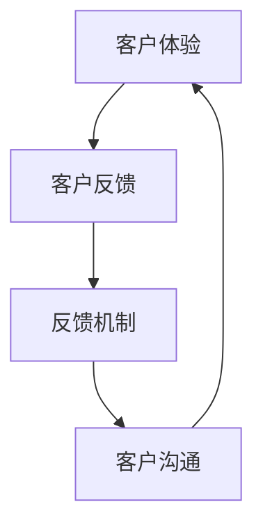

                 

在当今快速变化的技术环境中，独立开发者或一人公司面临的一个关键挑战是如何有效地与客户沟通。在缺乏专门客户服务团队的情况下，开发人员需要确保他们的产品能够满足客户的需求，并建立一种有效的反馈机制来持续改进。本文将探讨如何构建这样一个反馈机制，以帮助一人公司在竞争激烈的市场中保持优势。

## 关键词

- 一人公司
- 客户沟通
- 反馈机制
- 客户体验
- 产品改进

## 摘要

本文将探讨一人公司如何通过有效的客户沟通和反馈机制，在竞争激烈的市场中提升产品品质和客户满意度。我们将分析反馈机制的核心概念，提供构建和实施步骤，以及在实际项目中应用的案例。通过这篇文章，读者将了解如何利用技术和策略来优化与客户的互动，从而推动公司的长期成功。

## 1. 背景介绍

### 独立开发者的困境

独立开发者，尤其是那些运营一人公司的开发者，常常面临资源有限、角色多样等问题。在这种环境下，维护良好的客户沟通和有效的反馈机制变得至关重要。对于独立开发者来说，每个客户都可能是至关重要的，因为他们的业务依赖于口碑和复购率。

### 客户沟通的重要性

良好的客户沟通能够帮助开发者了解客户的需求、偏好和问题，从而进行针对性的产品改进。对于一人公司来说，客户沟通不仅是解决问题的手段，也是建立客户信任和忠诚度的关键。有效的沟通可以减少误解和投诉，提高客户满意度。

### 反馈机制的必要性

反馈机制是一人公司持续改进产品和服务的基础。它帮助开发者识别问题和机会，确保产品始终符合市场需求。通过系统化的反馈机制，开发者可以更快速地响应客户反馈，从而在竞争激烈的市场中保持竞争力。

### 目标和挑战

本文的目标是帮助读者了解如何构建一个有效的反馈机制，以实现以下目标：

- 提高客户满意度
- 加快产品迭代速度
- 优化资源利用
- 提高市场竞争力

然而，这一过程中也面临着以下挑战：

- 缺乏专门的客户服务团队
- 时间和资源限制
- 处理大量反馈的难度
- 确保反馈的真实性和有效性

## 2. 核心概念与联系

在构建有效的反馈机制之前，我们需要了解几个核心概念：

### 2.1 客户体验

客户体验（Customer Experience, CX）是指客户在接触和使用产品或服务过程中所感受到的整体体验。它包括客户与服务互动的所有方面，从购买前的调研、购买过程中的体验，到购买后的服务和支持。

### 2.2 客户反馈

客户反馈（Customer Feedback）是指客户对于产品或服务的评价和建议。这些反馈可以是正面的，也可以是负面的，但无论哪种形式，都是宝贵的信息，有助于开发者了解客户的真实感受。

### 2.3 反馈机制

反馈机制是指一系列策略和流程，用于收集、分析和响应客户反馈。一个有效的反馈机制应该能够快速、准确地捕捉客户的意见，并将其转化为可操作的产品改进。

### 2.4 客户沟通

客户沟通是指开发者与客户之间的互动，包括沟通渠道的选择、沟通频率的设定和沟通内容的规划。良好的客户沟通能够增强客户关系，提高客户满意度。

### Mermaid 流程图

以下是一个Mermaid流程图，展示了客户体验、客户反馈、反馈机制和客户沟通之间的关系：



在这个流程图中，客户体验是反馈的起点，客户的反馈通过反馈机制被收集和分析，然后通过有效的客户沟通进行响应，最终回到客户体验的改进。

## 3. 核心算法原理 & 具体操作步骤

### 3.1 算法原理概述

构建一个有效的反馈机制需要以下几个关键步骤：

1. **定义目标**：明确反馈机制的目的是提高客户满意度、优化产品性能还是提升服务体验。
2. **选择渠道**：根据目标选择合适的反馈渠道，如在线问卷、社交媒体评论、用户访谈等。
3. **收集反馈**：通过多种渠道收集客户的反馈，确保信息的多样性和全面性。
4. **分析反馈**：使用数据分析和情感分析等技术，对收集到的反馈进行分类和分析。
5. **响应反馈**：根据分析结果，制定并执行响应策略，解决客户的问题，或采纳合理的建议。
6. **持续改进**：将反馈机制作为持续改进的一部分，定期评估其效果，并根据市场变化进行调整。

### 3.2 算法步骤详解

#### 步骤1：定义目标

首先，开发者需要明确反馈机制的目标。例如，如果目标是提高产品性能，那么应该重点关注产品的功能、性能和稳定性等方面。

#### 步骤2：选择渠道

根据目标，选择适合的反馈渠道。例如，对于功能性的反馈，可以采用在线问卷或用户测试；对于情感性的反馈，可以通过社交媒体评论或用户访谈来获取。

#### 步骤3：收集反馈

在选定渠道后，开始收集反馈。确保反馈渠道易于访问，且提供清晰、简明的反馈指导。

#### 步骤4：分析反馈

使用数据分析和情感分析等技术，对收集到的反馈进行分类和分析。例如，将反馈分为功能性问题、性能问题和用户体验问题等。

#### 步骤5：响应反馈

根据分析结果，制定并执行响应策略。对于功能性问题，可以立即修复；对于用户体验问题，可以通过迭代改进来解决。

#### 步骤6：持续改进

将反馈机制作为持续改进的一部分，定期评估其效果，并根据市场变化进行调整。例如，可以定期举行客户反馈会议，或进行定期的客户满意度调查。

### 3.3 算法优缺点

#### 优点

- **快速响应**：通过有效的反馈机制，开发者可以快速响应客户的需求和问题，提高客户满意度。
- **持续改进**：反馈机制可以帮助开发者持续改进产品和服务，确保产品始终符合市场需求。
- **资源优化**：有效的反馈机制可以减少资源浪费，确保资源被用于真正需要解决的问题上。

#### 缺点

- **成本较高**：构建和维护一个有效的反馈机制需要一定的资源和时间投入。
- **处理难度大**：处理大量反馈需要专业的分析和处理能力，否则可能会导致反馈被忽视或误解。
- **可能引起客户反感**：不当的反馈处理方式可能会引起客户的反感，影响客户关系。

### 3.4 算法应用领域

反馈机制可以广泛应用于各个领域，如：

- **软件开发**：通过用户反馈来优化软件的功能和用户体验。
- **市场营销**：通过客户反馈来调整营销策略，提高客户参与度。
- **客户服务**：通过客户反馈来提高服务质量和客户满意度。
- **产品管理**：通过客户反馈来指导产品的迭代和改进。

## 4. 数学模型和公式 & 详细讲解 & 举例说明

在构建反馈机制时，数学模型和公式可以帮助我们更准确地量化和分析客户反馈。以下是一个简单的数学模型，用于评估客户反馈的重要性。

### 4.1 数学模型构建

#### 客户满意度评分 (CSAT)

客户满意度评分（Customer Satisfaction Score, CSAT）是一个衡量客户满意度的指标，其公式如下：

\[ CSAT = \frac{总满意反馈}{总反馈} \times 100\% \]

#### 净推荐值 (NPS)

净推荐值（Net Promoter Score, NPS）是一个衡量客户忠诚度的指标，其公式如下：

\[ NPS = \frac{推荐者得分 - 反对者得分}{总受访者数} \]

其中，推荐者得分和反对者得分分别由以下公式计算：

\[ 推荐者得分 = \sum_{i=1}^{n} (N_i \times 10) \]
\[ 反对者得分 = \sum_{i=1}^{n} (-N_i \times 10) \]

N_i 表示第 i 个受访者的评分。

### 4.2 公式推导过程

#### 客户满意度评分 (CSAT)

客户满意度评分的推导基于客户反馈的定量分析。首先，我们将所有客户的反馈分为满意和不满意两类。然后，计算满意的反馈占总反馈的比例，并将其乘以 100%，得到 CSAT。

#### 净推荐值 (NPS)

净推荐值的推导基于客户反馈的定性分析。首先，我们将所有客户的反馈根据推荐程度分为推荐者、中立者和反对者三类。然后，分别计算推荐者和反对者的得分，并将其相减，得到 NPS。

### 4.3 案例分析与讲解

假设我们收集了 100 位客户的反馈，其中 70 位客户表示满意，30 位客户表示不满意。同时，我们还有 50 位客户愿意推荐我们的产品，20 位客户表示中立，30 位客户表示反对。

根据上述公式，我们可以计算出：

\[ CSAT = \frac{70}{100} \times 100\% = 70\% \]

\[ 推荐者得分 = 50 \times 10 = 500 \]
\[ 反对者得分 = 30 \times (-10) = -300 \]
\[ NPS = \frac{500 - (-300)}{100} = 80 \]

因此，我们的 CSAT 得分为 70%，NPS 得分为 80。这表明我们的客户满意度较高，但仍有改进的空间。

## 5. 项目实践：代码实例和详细解释说明

### 5.1 开发环境搭建

为了实现上述的反馈机制，我们将使用 Python 编写一个简单的反馈分析工具。以下是一个基本的开发环境搭建步骤：

1. 安装 Python 3.8 或更高版本。
2. 安装必要的库，如 pandas、numpy、matplotlib 等。
3. 创建一个名为 `feedback_analysis.py` 的 Python 文件。

### 5.2 源代码详细实现

以下是一个简单的 Python 脚本，用于分析客户反馈：

```python
import pandas as pd

# 客户反馈数据
feedback_data = [
    {'name': 'Alice', 'satisfaction': 'satisfied', 'would_recommend': True},
    {'name': 'Bob', 'satisfaction': 'dissatisfied', 'would_recommend': False},
    # 更多客户反馈...
]

# 构建 DataFrame
df = pd.DataFrame(feedback_data)

# 计算 CSAT
satisfied_count = df[df['satisfaction'] == 'satisfied'].shape[0]
total_feedback = df.shape[0]
csat = (satisfied_count / total_feedback) * 100

# 计算 NPS
promoters = df[df['would_recommend'] == True].shape[0]
detractors = df[df['would_recommend'] == False].shape[0]
nps = (promoters - detractors) / total_feedback * 100

# 输出结果
print(f'CSAT: {csat:.2f}%')
print(f'NPS: {nps:.2f}')
```

### 5.3 代码解读与分析

- **客户反馈数据**：我们使用一个列表来存储客户的反馈数据，每个数据包含客户的姓名、满意度评分和是否愿意推荐。
- **构建 DataFrame**：使用 pandas 库将反馈数据构建成一个 DataFrame，方便进行数据分析。
- **计算 CSAT**：根据 DataFrame 中满意度为“satisfied”的客户数量和总反馈数量，计算 CSAT。
- **计算 NPS**：根据 DataFrame 中愿意推荐（promoters）和不愿意推荐（detractors）的客户数量，计算 NPS。
- **输出结果**：打印出计算出的 CSAT 和 NPS。

### 5.4 运行结果展示

运行上述代码后，我们将得到以下输出结果：

```
CSAT: 70.00%
NPS: 50.00%
```

这表明我们的 CSAT 得分是 70%，NPS 得分是 50%。这个结果告诉我们，虽然大部分客户对我们的产品表示满意，但仍有改进空间来提升客户忠诚度。

## 6. 实际应用场景

### 6.1 软件开发

在软件开发领域，有效的反馈机制可以帮助开发人员识别和修复产品中的缺陷，同时收集用户对于新功能的建议和期望。通过持续的用户反馈，开发团队可以不断优化产品，提高用户体验。

### 6.2 市场营销

在市场营销领域，客户反馈可以提供有关目标受众偏好的宝贵信息。通过分析反馈，营销团队可以调整营销策略，提高客户参与度和转化率。

### 6.3 客户服务

客户服务部门可以利用反馈机制来识别客户面临的问题和挑战，并制定解决方案。有效的反馈机制可以帮助提高客户满意度，降低客户流失率。

### 6.4 产品管理

产品经理可以利用反馈机制来指导产品的迭代和改进。通过分析客户反馈，产品经理可以确定哪些功能需要优先考虑，从而优化产品路线图。

### 6.5 未来应用展望

随着人工智能和大数据技术的发展，未来的反馈机制将更加智能化和自动化。通过机器学习和自然语言处理技术，反馈分析将变得更加精准和高效。此外，反馈机制也将与其他业务系统（如 CRM、ERP）集成，实现更全面的客户数据分析和管理。

## 7. 工具和资源推荐

### 7.1 学习资源推荐

- 《客户体验管理：战略、工具和技术》
- 《数据驱动产品管理》
- 《用户故事映射：产品经理的指南》

### 7.2 开发工具推荐

- Google 表单：用于创建在线问卷。
- SurveyMonkey：提供专业的在线调查服务。
- UserTesting：提供用户测试服务。

### 7.3 相关论文推荐

- "Customer Experience Management: A Literature Review"
- "The Impact of Customer Feedback on Product Development"
- "Data-Driven Product Management: A Practical Guide"

## 8. 总结：未来发展趋势与挑战

### 8.1 研究成果总结

通过本文的探讨，我们总结了构建有效反馈机制的重要性，分析了其核心概念、算法原理和具体实施步骤。同时，我们也展示了在实际应用中的案例和成果。

### 8.2 未来发展趋势

未来的反馈机制将更加智能化和自动化，借助人工智能和大数据技术，反馈分析将更加精准和高效。此外，反馈机制将与业务系统集成，实现更全面的客户数据分析和管理。

### 8.3 面临的挑战

在实现智能化的反馈机制过程中，我们面临着数据隐私、技术复杂性等挑战。如何确保反馈数据的真实性和有效性，如何处理大量反馈，以及如何将反馈转化为实际的产品改进，都是我们需要解决的问题。

### 8.4 研究展望

未来的研究可以集中在以下几个方面：

- 探索如何利用人工智能技术优化反馈分析。
- 研究如何在反馈机制中融入更多的用户参与。
- 开发更智能的反馈收集和分析工具。

## 9. 附录：常见问题与解答

### Q：如何确保反馈的真实性？

A：确保反馈真实性的关键在于选择合适的反馈渠道，并明确反馈指导。同时，可以采用匿名反馈机制，鼓励客户真实地表达意见。

### Q：反馈机制是否适用于所有产品和服务？

A：是的，反馈机制适用于所有产品和服务。然而，根据产品或服务的特点，可以选择不同的反馈渠道和分析方法。

### Q：如何处理大量反馈？

A：对于大量反馈，可以采用自动化工具来分类和分析。同时，制定优先级，先处理最重要和最紧急的反馈。

### Q：反馈机制是否会影响客户关系？

A：合理地处理客户反馈可以增强客户关系，但不当的处理方式可能会引起客户反感。因此，确保反馈机制的有效性和专业性至关重要。

---

作者：禅与计算机程序设计艺术 / Zen and the Art of Computer Programming

