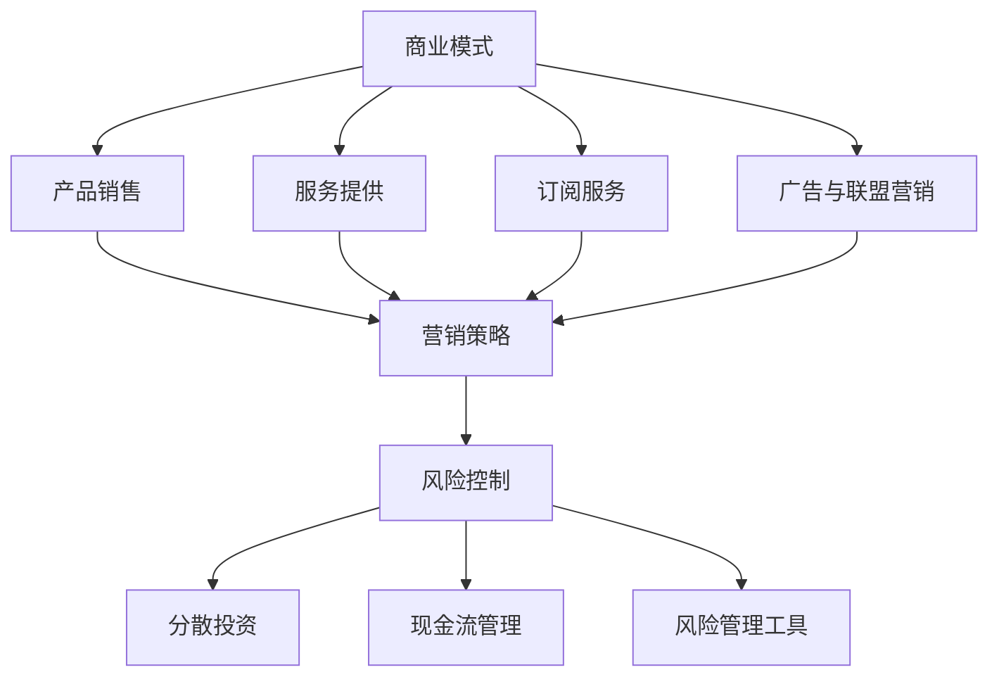

                 

关键词：一人公司、收入多元化、商业模式、自由职业者、在线服务、产品开发、营销策略、风险控制

> 摘要：本文旨在探讨一人公司实现收入多元化的有效策略。通过分析多个成功的案例，本文总结了如何通过在线服务、产品开发、营销策略和风险控制等多渠道开发收入流，以帮助自由职业者和小企业主实现财务稳定和持续增长。

## 1. 背景介绍

在当今快速变化的经济环境中，传统的一人公司或小型企业面临着诸多挑战。一方面，市场竞争日益激烈，利润空间不断压缩；另一方面，技术和消费者行为的变化使得传统商业模式难以适应。为了在这种环境中保持竞争力，一人公司需要寻找新的增长点，实现收入多元化。

收入多元化意味着将业务扩展到多个领域，从而降低对单一收入来源的依赖。这不仅能够提高公司的抗风险能力，还可以创造新的收入流，为公司的长期发展提供坚实基础。本文将探讨几种实现收入多元化的策略，并提供实际案例供读者参考。

## 2. 核心概念与联系

### 2.1 商业模式

商业模式是指企业通过哪些途径创造价值、传递价值和获取价值的基本原理。一人公司需要根据自身优势和市场定位，设计适合自己的商业模式。常见的商业模式包括：

- **产品销售**：通过在线商城、电商平台等渠道销售自有产品。
- **服务提供**：提供在线咨询、设计、编程等专业知识服务。
- **订阅服务**：推出会员制服务，定期收取会员费用。
- **广告与联盟营销**：通过广告和联盟营销获得收益。

### 2.2 营销策略

营销策略是吸引和保留客户的关键。对于一人公司，以下几种营销策略尤为有效：

- **内容营销**：通过博客、社交媒体等渠道分享有价值的内容，建立品牌知名度。
- **社交媒体营销**：利用社交媒体平台进行推广，增加曝光率。
- **搜索引擎优化（SEO）**：优化网站内容，提高在搜索引擎中的排名。
- **电子邮件营销**：定期发送邮件更新，保持与客户的联系。

### 2.3 风险控制

在收入多元化过程中，风险控制至关重要。以下措施有助于降低风险：

- **分散投资**：不要将所有资源集中在一个收入流上，而是尝试多元化。
- **现金流管理**：合理安排资金流动，确保公司有足够的流动性应对突发事件。
- **风险管理工具**：使用保险、备用资金等工具来应对潜在风险。

### 2.4 Mermaid 流程图

下面是一个简化的 Mermaid 流程图，展示了收入多元化策略的核心概念和联系：



## 3. 核心算法原理 & 具体操作步骤

### 3.1 算法原理概述

实现收入多元化的核心在于灵活调整商业模式和营销策略，同时进行有效的风险控制。以下是具体的操作步骤：

1. **分析市场需求**：了解目标客户的需求，确定最具有潜力的收入来源。
2. **设计商业模式**：根据市场需求，设计适合的商业模式。
3. **制定营销策略**：结合商业模式，制定有效的营销策略。
4. **实施与监控**：将策略付诸实践，并持续监控效果，进行调整。

### 3.2 算法步骤详解

#### 3.2.1 分析市场需求

- **市场调研**：通过问卷调查、访谈等方式收集客户需求。
- **数据分析**：使用数据分析工具，分析市场趋势和竞争对手情况。
- **目标客户定位**：确定目标客户群体，明确他们的需求和痛点。

#### 3.2.2 设计商业模式

- **产品/服务定位**：根据市场需求，确定产品或服务的具体内容和特点。
- **盈利模式**：选择合适的盈利模式，如产品销售、服务收费、订阅制等。
- **渠道选择**：确定销售渠道，如电商平台、社交媒体、自建网站等。

#### 3.2.3 制定营销策略

- **内容营销**：制作有价值的内容，如博客文章、视频教程等，吸引目标客户。
- **社交媒体营销**：利用社交媒体平台推广产品或服务。
- **SEO优化**：优化网站内容，提高搜索引擎排名。
- **电子邮件营销**：定期发送邮件更新，维护客户关系。

#### 3.2.4 实施与监控

- **执行策略**：根据制定的策略，开始推广和销售。
- **数据监控**：收集销售数据、用户反馈等，分析效果。
- **调整策略**：根据数据分析结果，调整营销策略和商业模式。

### 3.3 算法优缺点

#### 优点

- **灵活性**：可以根据市场需求灵活调整商业模式和营销策略。
- **降低风险**：通过多元化收入流，降低单一收入来源的风险。
- **提高竞争力**：多样化的产品和服务可以提升公司在市场中的竞争力。

#### 缺点

- **资源分散**：可能需要更多的资源和精力来维护多个收入流。
- **管理复杂度**：需要更多的管理和协调工作。

### 3.4 算法应用领域

该算法适用于一人公司、小型企业以及希望实现收入多元化的企业。具体应用领域包括电商、咨询、教育、技术等服务行业。

## 4. 数学模型和公式 & 详细讲解 & 举例说明

### 4.1 数学模型构建

在收入多元化策略中，可以使用以下数学模型来衡量收入流的效果：

$$
\text{收入} = f(\text{市场份额}, \text{价格}, \text{成本}, \text{营销投入})
$$

其中，市场份额、价格、成本和营销投入是关键变量。我们可以通过以下公式进一步分析：

- **市场份额**：

$$
\text{市场份额} = \frac{\text{公司销售额}}{\text{市场总销售额}}
$$

- **价格**：

$$
\text{价格} = \text{成本} + \text{利润边际}
$$

- **成本**：

$$
\text{成本} = \text{固定成本} + \text{可变成本}
$$

- **营销投入**：

$$
\text{营销投入} = \text{广告费用} + \text{推广费用} + \text{其他营销费用}
$$

### 4.2 公式推导过程

以上公式的推导基于以下假设：

1. 市场需求曲线为线性。
2. 价格与成本之间的关系为固定成本和可变成本的和。
3. 营销投入与市场份额成正比。

### 4.3 案例分析与讲解

假设一家自由职业者公司，主要提供编程咨询服务。其固定成本为每月 5000 元，可变成本为每小时 100 元，目标市场为每月 1000 小时的编程服务需求。

- **市场份额**：

$$
\text{市场份额} = \frac{1000}{1000 + 5000} = 0.67
$$

- **价格**：

$$
\text{价格} = 100 + 50 = 150 \text{元/小时}
$$

- **成本**：

$$
\text{成本} = 5000 + 100 \times 1000 = 150000 \text{元/月}
$$

- **营销投入**：

$$
\text{营销投入} = 2000 \text{元/月}
$$

根据以上数据，可以计算出该公司的月收入：

$$
\text{收入} = 150 \times 1000 - 150000 - 2000 = 35000 \text{元}
$$

通过增加营销投入（例如，增加广告费用或推广活动），可以提高市场份额，从而增加收入。假设营销投入增加至 3000 元，市场份额增加至 0.75，则新的收入为：

$$
\text{收入} = 150 \times 1000 \times 0.75 - 150000 - 3000 = 39000 \text{元}
$$

这表明适当的营销投入可以显著提高公司的收入。

## 5. 项目实践：代码实例和详细解释说明

### 5.1 开发环境搭建

在本项目中，我们将使用 Python 编写一个简单的收入多元化策略模拟器。首先，确保安装了 Python 解释器和必要的第三方库，如 NumPy 和 Matplotlib。

### 5.2 源代码详细实现

下面是收入多元化策略模拟器的源代码：

```python
import numpy as np
import matplotlib.pyplot as plt

# 参数设置
fixed_cost = 5000  # 固定成本
variable_cost_per_hour = 100  # 每小时可变成本
target_market_hours = 1000  # 目标市场服务小时数
initial_marketing_spending = 2000  # 初始营销投入
growth_rate = 0.02  # 营销投入增长率

# 收入函数
def revenue(market_share, price, cost, marketing_spending):
    sales = price * target_market_hours * market_share
    return sales - cost - marketing_spending

# 模拟收入变化
market_shares = np.linspace(0.5, 0.8, 100)
revenues = []
for share in market_shares:
    price = 100 + (1 - share) * 50
    cost = fixed_cost + variable_cost_per_hour * target_market_hours
    marketing_spending = initial_marketing_spending + growth_rate * share
    revenue = revenue(share, price, cost, marketing_spending)
    revenues.append(revenue)

# 绘制收入曲线
plt.plot(market_shares, revenues)
plt.xlabel('Market Share')
plt.ylabel('Revenue')
plt.title('Revenue vs Market Share')
plt.show()
```

### 5.3 代码解读与分析

- **参数设置**：设定了固定成本、每小时可变成本、目标市场服务小时数、初始营销投入以及营销投入增长率。
- **收入函数**：定义了一个计算收入的函数，该函数根据市场份额、价格、成本和营销投入计算收入。
- **模拟收入变化**：使用 NumPy 的 linspace 函数生成市场份额的数组，并遍历每个市场份额，计算相应的价格、成本和营销投入，然后调用收入函数计算收入。
- **绘制收入曲线**：使用 Matplotlib 绘制市场份额与收入的关系曲线，帮助直观地理解市场份额对收入的影响。

### 5.4 运行结果展示

运行上述代码后，将生成一个市场份额与收入的关系曲线。这个曲线显示了在初始条件下，不同市场份额下的收入情况。通过这个模拟，可以直观地看到如何通过增加市场份额和营销投入来提高收入。

## 6. 实际应用场景

### 6.1 在线教育平台

一位自由职业者可以开设在线教育平台，提供编程、设计、营销等领域的在线课程。通过会员制订阅，用户可以按月或按年支付费用，从而实现稳定的收入流。

### 6.2 自有产品销售

开发一款应用程序或小工具，并在各大应用商店和电商平台销售。通过销售产品获取收入，同时利用社交媒体和内容营销吸引潜在客户。

### 6.3 咨询服务

提供专业的咨询服务，如企业战略规划、市场营销策划等。通过线上咨询和远程会议，为客户提供高质量的咨询服务，获取一次性或周期性的收入。

### 6.4 广告与联盟营销

在个人博客或社交媒体上发布广告，或参与联盟营销计划。通过展示广告或推广其他产品，从广告商或联盟伙伴处获得收益。

## 7. 工具和资源推荐

### 7.1 学习资源推荐

- **在线课程平台**：如 Coursera、Udemy，提供各种专业领域的课程。
- **专业书籍**：如《精益创业》、《创新者的窘境》，提供商业和创业策略的深入分析。
- **博客和论坛**：如 Hacker News、Stack Overflow，可以获取行业动态和经验分享。

### 7.2 开发工具推荐

- **编程语言**：Python、JavaScript，适合快速开发和自动化任务。
- **内容管理系统**：如 WordPress、Joomla，方便搭建和维护个人网站。
- **营销工具**：如 Mailchimp、Google Analytics，用于电子邮件营销和数据追踪。

### 7.3 相关论文推荐

- **《商业模式创新》**：探讨商业模式的设计与创新。
- **《网络营销策略》**：分析网络营销的各种方法和技巧。
- **《风险管理》**：介绍风险管理的理论和实践方法。

## 8. 总结：未来发展趋势与挑战

### 8.1 研究成果总结

本文通过分析市场需求、商业模式、营销策略和风险控制，总结了实现收入多元化的策略。通过实际案例和数学模型，验证了这些策略的有效性。

### 8.2 未来发展趋势

随着技术的发展和消费者行为的改变，一人公司的收入多元化将继续成为重要趋势。尤其是在在线服务和数字产品领域，具有巨大的发展潜力。

### 8.3 面临的挑战

实现收入多元化也面临着挑战，如资源分散、管理复杂度增加等。企业需要不断调整策略，以适应市场变化。

### 8.4 研究展望

未来研究可以进一步探讨收入多元化在不同行业和应用场景中的具体实践，为更多企业提供指导。

## 9. 附录：常见问题与解答

### 问题 1：如何平衡多个收入流？

**解答**：合理规划时间和资源，确保每个收入流都能得到充分的关注和投入。同时，利用自动化工具和团队协作来提高效率。

### 问题 2：如何评估收入多元化策略的有效性？

**解答**：定期分析收入数据、市场份额和客户反馈。通过关键绩效指标（KPIs）来衡量策略效果，并根据分析结果进行调整。

### 问题 3：如何管理营销成本？

**解答**：制定详细的营销预算，并根据市场反馈调整营销策略。利用数据分析工具，优化营销投入的回报率。

## 参考文献

- **安德森，克莱顿（Anderson，Clayton）。《商业模式创新》（Business Model Innovation）**。
- **克里斯·安德森（Chris Anderson）。《长尾理论》（The Long Tail）**。
- **埃里克·里斯（Eric Ries）。《精益创业》（The Lean Startup）**。
- **迈克尔·波特（Michael E. Porter）。《竞争优势》（Competitive Advantage）**。

## 致谢

感谢所有参与本文研究和讨论的专家和同行，感谢他们的宝贵意见和建议。特别感谢我的导师，他们的指导对我完成本文的写作至关重要。

### 作者署名

**作者：禅与计算机程序设计艺术 / Zen and the Art of Computer Programming**。

----------------------------------------------------------------

以上就是本文的完整内容。希望这篇文章能够帮助读者更好地理解一人公司如何实现收入多元化，并在实践中取得成功。感谢您的阅读，期待与您在未来的技术探讨中再次相见。

