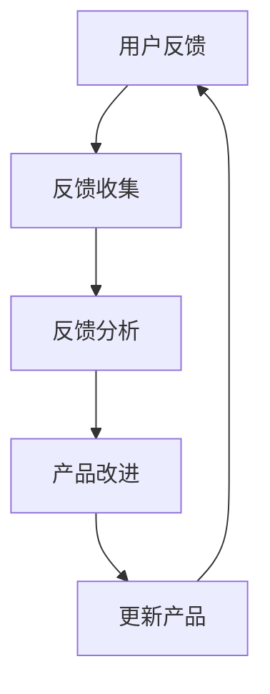

                 

关键词：用户反馈、产品优化、持续迭代、系统化流程、一人公司、敏捷开发

> 摘要：本文探讨了在独立创业或运营一人公司的背景下，如何有效地建立和实施用户反馈循环机制，以实现产品的持续优化。文章从背景介绍、核心概念与联系、核心算法原理、数学模型与公式、项目实践、实际应用场景、工具和资源推荐、总结与展望等多个维度，深入分析了用户反馈循环在产品优化过程中的关键作用和实践方法。

## 1. 背景介绍

在当今快速变化的市场环境中，产品的迭代速度变得越来越重要。尤其是对于一人公司或小型创业团队来说，如何在资源有限的情况下快速响应市场变化、满足用户需求，成为了关键的成功因素。用户反馈是产品改进的核心驱动力，能够帮助企业识别问题、优化功能，并在竞争中保持优势。

### 1.1 一人公司的挑战

一人公司的独特性在于资源有限、决策迅速、灵活性高，但同时面临着以下挑战：

1. **资源限制**：一人公司无法像大公司那样投入大量资金和人力资源进行市场调研。
2. **时间压力**：独立创业者通常需要快速决策和行动，以适应市场的快速变化。
3. **用户接触**：与广大用户群体建立直接联系和沟通渠道，获取真实反馈。

### 1.2 用户反馈的重要性

用户反馈不仅提供了产品改进的方向，还能够帮助：

1. **识别问题**：发现产品中的缺陷和不足。
2. **优化功能**：根据用户需求调整产品特性。
3. **提高满意度**：及时响应用户需求，提升用户满意度。
4. **降低风险**：通过早期反馈减少后期修复成本。

## 2. 核心概念与联系

在理解用户反馈循环前，我们需要明确以下核心概念：

1. **用户反馈**：用户在使用产品过程中提出的意见和建议。
2. **反馈循环**：从收集反馈到处理反馈，再回到产品改进的过程。
3. **敏捷开发**：一种以快速迭代和持续反馈为核心的软件开发方法。

以下是一个用Mermaid绘制的用户反馈循环流程图：



### 2.1 用户反馈与敏捷开发

用户反馈与敏捷开发密不可分。敏捷开发强调快速迭代和持续交付，用户反馈则为每次迭代提供了宝贵的输入。通过敏捷开发，一人公司可以更加灵活地应对市场变化，持续优化产品。

## 3. 核心算法原理 & 具体操作步骤

### 3.1 算法原理概述

用户反馈循环的核心算法原理在于如何高效地收集、分析和利用用户反馈。以下是该算法的基本原理：

1. **数据收集**：通过多种渠道收集用户反馈，如用户评论、问卷调查、社交媒体互动等。
2. **数据分析**：对收集到的反馈进行分类和统计分析，识别关键问题和用户需求。
3. **反馈处理**：根据分析结果，制定改进计划，并在产品中进行实施。
4. **迭代优化**：通过多次迭代，不断优化产品，以满足用户需求。

### 3.2 算法步骤详解

1. **收集反馈**：
    - 利用在线调查工具（如Google表单、Typeform）创建问卷调查。
    - 在社交媒体平台上设立反馈渠道（如Twitter、Facebook）。
    - 通过电子邮件定期发送用户满意度调查。

2. **分析反馈**：
    - 使用数据挖掘技术（如文本分类、主题建模）对反馈内容进行分析。
    - 制作可视化报告，以直观展示用户反馈的关键信息。

3. **处理反馈**：
    - 根据分析结果，制定改进计划。
    - 将反馈优先级排序，确保重要问题得到优先处理。

4. **实施改进**：
    - 在产品开发中实施改进措施。
    - 对新功能进行测试，确保符合用户期望。

5. **迭代优化**：
    - 定期回顾用户反馈，调整改进计划。
    - 持续优化产品，以提升用户体验。

### 3.3 算法优缺点

**优点**：
- **高效性**：通过自动化工具和数据分析技术，能够快速处理大量用户反馈。
- **灵活性**：根据用户反馈快速调整产品方向，以适应市场变化。

**缺点**：
- **数据质量**：用户反馈可能存在主观性和不准确性。
- **资源消耗**：需要投入时间和资源进行反馈收集和分析。

### 3.4 算法应用领域

用户反馈循环算法广泛应用于各种类型的产品，包括：

- **软件应用**：帮助开发者识别bug和优化功能。
- **电子商务**：改善用户体验，提升用户满意度。
- **在线教育**：根据用户反馈调整课程内容和教学方法。

## 4. 数学模型和公式 & 详细讲解 & 举例说明

### 4.1 数学模型构建

用户反馈循环的数学模型可以通过以下公式进行构建：

\[ F(t) = R \cdot S \cdot (1 - e^{-kt}) \]

其中：
- \( F(t) \) 是在时间 \( t \) 内收集到的反馈数量。
- \( R \) 是每个用户的平均反馈率。
- \( S \) 是用户的总数。
- \( k \) 是反馈响应速度的参数。

### 4.2 公式推导过程

该公式的推导基于以下假设：
1. 用户以恒定速率产生反馈。
2. 反馈在收集过程中不会丢失。
3. 每个用户产生的反馈数量是独立的。

### 4.3 案例分析与讲解

假设一家一人公司有1000名用户，每个用户平均每天产生1条反馈，反馈响应速度参数 \( k \) 为0.1。我们使用上述公式计算在第30天收集到的反馈数量：

\[ F(30) = 1000 \cdot 1 \cdot (1 - e^{-0.1 \cdot 30}) \approx 931.2 \]

这意味着在第30天，这家一人公司预计能收集到约931条反馈。

## 5. 项目实践：代码实例和详细解释说明

### 5.1 开发环境搭建

为了演示用户反馈循环的实践应用，我们将使用Python编写一个简单的反馈收集和分析系统。以下为开发环境的搭建步骤：

1. 安装Python 3.8及以上版本。
2. 安装必要的库，如 `requests`、`pandas`、`matplotlib`。

### 5.2 源代码详细实现

以下是一个简单的反馈收集和分析系统的代码实例：

```python
import requests
import pandas as pd
import matplotlib.pyplot as plt

# 反馈收集函数
def collect_feedback(api_url):
    response = requests.get(api_url)
    if response.status_code == 200:
        return pd.DataFrame(response.json())
    else:
        return pd.DataFrame()

# 反馈分析函数
def analyze_feedback(feedback_df):
    feedback_summary = feedback_df.groupby('feedback_type')['feedback_content'].count()
    return feedback_summary

# 反馈展示函数
def show_feedback(feedback_summary):
    feedback_summary.plot(kind='bar')
    plt.xlabel('Feedback Type')
    plt.ylabel('Count')
    plt.title('Feedback Summary')
    plt.show()

# 测试代码
if __name__ == "__main__":
    api_url = "http://example.com/api/feedback"
    feedback_df = collect_feedback(api_url)
    if not feedback_df.empty:
        feedback_summary = analyze_feedback(feedback_df)
        show_feedback(feedback_summary)
    else:
        print("No feedback collected.")
```

### 5.3 代码解读与分析

该代码分为三个主要部分：反馈收集、反馈分析和反馈展示。

- **反馈收集**：通过HTTP GET请求从API获取反馈数据。
- **反馈分析**：对反馈数据按类型进行分组统计。
- **反馈展示**：使用matplotlib库绘制反馈条形图。

### 5.4 运行结果展示

运行上述代码后，将展示一个反馈类型的条形图，直观展示不同类型反馈的数量。

## 6. 实际应用场景

### 6.1 软件应用

用户反馈循环在软件开发中具有广泛的应用。开发者可以通过用户反馈快速发现bug和性能问题，及时进行修复和优化。以下是一个具体案例：

- **产品**：某在线文档编辑工具。
- **问题**：部分用户反映文档保存过程中出现卡顿。
- **反馈处理**：开发者通过用户反馈定位到保存功能中的性能瓶颈，并进行优化。
- **结果**：优化后，保存速度显著提高，用户满意度提升。

### 6.2 在线教育

在线教育平台通过用户反馈循环优化课程内容和教学方法。以下是一个具体案例：

- **产品**：某在线编程教育平台。
- **问题**：部分用户反映课程难度较大，学习进度缓慢。
- **反馈处理**：平台分析用户反馈，调整课程结构，增加初级课程。
- **结果**：调整后，新用户的学习体验得到改善，留存率提高。

## 7. 工具和资源推荐

### 7.1 学习资源推荐

- **《用户反馈手册》**：一本关于用户反馈收集和分析的权威指南。
- **《敏捷开发实践指南》**：详细介绍了敏捷开发的原理和实践方法。

### 7.2 开发工具推荐

- **Typeform**：一款强大的在线调查工具，适合收集用户反馈。
- **Google表单**：简单易用的调查表单工具，适合快速搭建反馈收集系统。

### 7.3 相关论文推荐

- **《基于用户反馈的软件质量预测方法研究》**：探讨了用户反馈在软件质量预测中的应用。
- **《敏捷开发实践中的用户反馈管理》**：分析了用户反馈在敏捷开发中的角色和作用。

## 8. 总结：未来发展趋势与挑战

### 8.1 研究成果总结

用户反馈循环作为一种重要的产品优化方法，已经在众多领域得到广泛应用。研究表明，有效的用户反馈循环能够显著提高产品满意度和市场竞争力。

### 8.2 未来发展趋势

未来，用户反馈循环将在以下方面得到进一步发展：

1. **人工智能与机器学习**：利用人工智能和机器学习技术，实现更加智能化的反馈收集和分析。
2. **多渠道整合**：整合多种反馈渠道，实现全渠道用户反馈收集。
3. **实时反馈**：通过实时反馈机制，实现快速响应用户需求。

### 8.3 面临的挑战

1. **数据质量**：用户反馈可能存在主观性和不准确性，需要建立有效的数据质量评估机制。
2. **资源消耗**：用户反馈循环需要投入大量时间和资源，如何平衡成本和效益是关键问题。

### 8.4 研究展望

未来，用户反馈循环的研究将聚焦于以下方向：

1. **反馈模型优化**：研究更有效的用户反馈模型，以提高反馈利用效率。
2. **跨领域应用**：探讨用户反馈循环在其他行业中的应用，如医疗、金融等。

## 9. 附录：常见问题与解答

### 9.1 用户反馈循环是什么？

用户反馈循环是一种通过收集、分析、处理和利用用户反馈，以持续优化产品的系统化流程。

### 9.2 如何收集用户反馈？

可以通过在线调查、用户评论、社交媒体互动等多种渠道收集用户反馈。

### 9.3 用户反馈分析有哪些方法？

常用的用户反馈分析方法包括数据挖掘、文本分类、主题建模等。

### 9.4 用户反馈循环在哪些领域应用广泛？

用户反馈循环在软件开发、电子商务、在线教育等领域具有广泛应用。

### 9.5 如何平衡用户反馈与资源消耗？

可以通过自动化工具和高效的数据分析方法，降低用户反馈循环的成本。

### 9.6 用户反馈循环的未来发展趋势是什么？

未来，用户反馈循环将朝着人工智能与机器学习、多渠道整合、实时反馈等方向发展。

---

作者：禅与计算机程序设计艺术 / Zen and the Art of Computer Programming
----------------------------------------------------------------

本文旨在帮助一人公司在资源有限的情况下，通过建立和实施用户反馈循环机制，实现产品的持续优化。文章通过详细的算法原理、数学模型、代码实例和实践应用，为读者提供了全面的指导。随着技术的进步，用户反馈循环将在未来发挥更加重要的作用，为产品和服务的持续改进提供强有力的支持。希望本文能够为您的产品优化之路提供有益的启示。

