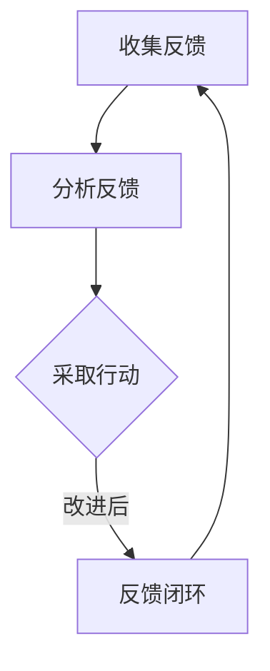

                 

关键词：一人公司，用户反馈循环，持续优化，产品迭代，系统方法

> 摘要：在现今快速变化的市场环境中，产品迭代速度的快慢往往是企业成败的关键。特别是对于一人公司而言，如何高效地收集用户反馈并快速迭代产品显得尤为重要。本文将介绍一种系统化的用户反馈循环方法，帮助一人公司实现产品的持续优化。

## 1. 背景介绍

一人公司，顾名思义，就是指由单一个人运营的公司。这类公司以其灵活性、高效性和低成本在近年来得到了迅速发展。尤其是在互联网和远程办公逐渐普及的今天，一人公司可以在全球范围内招募人才，利用互联网和在线工具来运营业务。

然而，一人公司的运营也面临着诸多挑战。由于资源和时间的限制，一人公司往往需要快速响应市场变化和用户需求，以便在竞争激烈的环境中保持优势。这就需要一种高效的用户反馈循环机制，以指导产品的持续优化。

用户反馈循环，简单来说，就是通过收集用户对产品的反馈，分析这些反馈，然后根据分析结果对产品进行改进的过程。它包括以下几个关键步骤：

1. **收集反馈**：通过各种渠道收集用户对产品的反馈。
2. **分析反馈**：对收集到的反馈进行分类、统计和分析。
3. **采取行动**：根据分析结果，制定和实施改进措施。
4. **反馈闭环**：将改进后的产品再次提交给用户，并收集新一轮的反馈。

本文将围绕这个用户反馈循环，详细探讨其运作机制和实现方法。

## 2. 核心概念与联系

在探讨用户反馈循环之前，我们首先需要明确一些核心概念，包括用户画像、反馈渠道、数据分析工具和敏捷开发方法。

### 2.1 用户画像

用户画像是指对目标用户进行全面描述的一种方法。它包括用户的基本信息、行为特征、兴趣偏好等多个方面。通过用户画像，一人公司可以更好地理解用户需求，从而制定更精准的产品策略。

### 2.2 反馈渠道

反馈渠道是指用户提交反馈的途径。常见的反馈渠道包括用户论坛、社交媒体、邮件、在线调查等。一人公司需要根据自身情况选择合适的反馈渠道，以确保能够及时、准确地收集到用户反馈。

### 2.3 数据分析工具

数据分析工具是用于对收集到的用户反馈进行统计和分析的工具。例如，用户论坛中的帖子可以使用自然语言处理技术进行情感分析，邮件反馈可以使用关键字提取算法进行分类。数据分析工具的选择取决于反馈的类型和数量。

### 2.4 敏捷开发方法

敏捷开发是一种注重快速迭代和用户反馈的软件开发方法。它强调灵活性和适应性，使得一人公司能够在不断变化的市场环境中快速响应。敏捷开发方法的核心是持续集成和持续交付，这使得产品的迭代速度大大加快。

### 2.5 Mermaid 流程图

以下是一个简单的 Mermaid 流程图，展示了用户反馈循环的基本流程：



## 3. 核心算法原理 & 具体操作步骤

### 3.1 算法原理概述

用户反馈循环的核心算法是数据分析算法。该算法通过对用户反馈进行分类、统计和分析，为产品改进提供数据支持。具体来说，算法包括以下几个步骤：

1. **数据预处理**：对收集到的反馈进行清洗和格式化，使其适合进一步分析。
2. **特征提取**：从预处理后的数据中提取关键特征，例如情感极性、关键词等。
3. **分类与聚类**：根据提取的特征对反馈进行分类和聚类，以识别用户反馈的主要主题。
4. **统计分析**：对分类和聚类结果进行统计分析，以量化用户反馈的重要性和优先级。

### 3.2 算法步骤详解

#### 3.2.1 数据预处理

数据预处理是数据分析的第一步。它包括以下几个任务：

- **去噪**：去除数据中的噪声和无关信息，例如HTML标签、特殊字符等。
- **归一化**：将不同特征的范围统一到相同的尺度，以便进行后续分析。
- **停用词过滤**：去除常见的停用词，例如“的”、“是”、“了”等，以提高分析精度。

#### 3.2.2 特征提取

特征提取是数据分析的核心步骤。常见的特征提取方法包括：

- **情感分析**：使用情感分析算法，如TextBlob或VADER，对文本进行情感极性分析，将其归类为正面、负面或中性。
- **关键词提取**：使用关键词提取算法，如TF-IDF或LDA，从文本中提取关键短语，以识别用户反馈的主要主题。
- **主题建模**：使用主题建模算法，如LDA或LSTM，从文本中提取潜在主题，以揭示用户反馈的深层次结构。

#### 3.2.3 分类与聚类

分类和聚类是对反馈进行组织和分析的关键步骤。常见的分类算法包括：

- **朴素贝叶斯分类器**：基于贝叶斯定理，对文本进行分类。
- **支持向量机**（SVM）：通过最大化分类边界，对文本进行分类。
- **决策树**：通过树形结构，对文本进行分类。

常见的聚类算法包括：

- **K-均值聚类**：根据距离度量，将文本分为K个类别。
- **层次聚类**：通过层次结构，对文本进行分类。

#### 3.2.4 统计分析

统计分析是对分类和聚类结果进行量化和分析的关键步骤。常见的统计分析方法包括：

- **频数统计**：计算每个类别的频数，以了解用户反馈的分布情况。
- **关联分析**：分析不同类别之间的关联性，以发现用户反馈中的潜在关系。
- **置信度评估**：评估分类和聚类的准确性和可靠性。

### 3.3 算法优缺点

#### 优点：

- **高效性**：算法能够快速处理大量用户反馈，提供及时的产品改进建议。
- **灵活性**：算法可以根据不同的需求和数据类型进行调整和优化。
- **准确性**：通过多种分类和聚类算法的组合，提高用户反馈分析的准确性。

#### 缺点：

- **数据质量**：算法的性能很大程度上取决于反馈数据的质量，例如数据的完整性和一致性。
- **计算成本**：复杂的算法可能需要较高的计算资源，影响算法的实时性和效率。
- **误判风险**：算法可能因为数据噪声或模型缺陷而出现误判，影响产品改进的准确性。

### 3.4 算法应用领域

用户反馈循环算法可以广泛应用于一人公司的产品优化过程。具体应用领域包括：

- **产品迭代**：通过分析用户反馈，快速识别产品问题，制定和实施改进措施。
- **市场调研**：通过分析用户反馈，了解市场需求和用户偏好，指导产品设计和营销策略。
- **客户关系管理**：通过分析用户反馈，识别客户痛点，提升客户满意度和忠诚度。
- **风险控制**：通过分析用户反馈，及时发现和应对潜在的产品风险，降低业务风险。

## 4. 数学模型和公式 & 详细讲解 & 举例说明

### 4.1 数学模型构建

在用户反馈循环中，我们可以使用多种数学模型来分析和解释用户反馈。以下是一个简单的数学模型示例：

假设我们有一组用户反馈文本，每个文本都有一个情感极性标签（正面、负面、中性）。我们可以使用一个三分类的朴素贝叶斯分类器来预测新文本的情感极性。朴素贝叶斯分类器的核心数学模型如下：

\[ P(\text{正面}|\text{特征}) = \frac{P(\text{正面})P(\text{特征}|\text{正面})}{P(\text{特征})} \]

其中，\( P(\text{正面}) \) 表示正面反馈的概率，\( P(\text{特征}|\text{正面}) \) 表示特征在正面反馈中的条件概率，\( P(\text{特征}) \) 表示特征的总概率。

### 4.2 公式推导过程

为了推导上述公式，我们需要了解朴素贝叶斯分类器的基本原理。朴素贝叶斯分类器是基于贝叶斯定理和特征条件独立假设的。贝叶斯定理可以表示为：

\[ P(A|B) = \frac{P(B|A)P(A)}{P(B)} \]

在用户反馈分类中，\( A \) 表示文本的情感极性（正面、负面、中性），\( B \) 表示文本的特征。特征条件独立假设意味着特征之间是条件独立的，即：

\[ P(B_1, B_2, \ldots, B_n | A) = P(B_1 | A)P(B_2 | A) \ldots P(B_n | A) \]

将特征条件独立假设代入贝叶斯定理，得到：

\[ P(A|B_1, B_2, \ldots, B_n) = \frac{P(B_1, B_2, \ldots, B_n | A)P(A)}{P(B_1, B_2, \ldots, B_n)} \]

由于特征是条件独立的，上式可以简化为：

\[ P(A|B_1, B_2, \ldots, B_n) = \frac{P(B_1 | A)P(B_2 | A) \ldots P(B_n | A)P(A)}{P(B_1)P(B_2) \ldots P(B_n)} \]

再进一步简化，得到：

\[ P(A|B_1, B_2, \ldots, B_n) = \frac{P(A)P(B_1 | A)P(B_2 | A) \ldots P(B_n | A)}{P(B_1)P(B_2) \ldots P(B_n)} \]

由于我们需要预测新文本的情感极性，可以将上式改写为：

\[ P(\text{正面}|\text{特征}) = \frac{P(\text{正面})P(\text{特征}|\text{正面})}{P(\text{特征})} \]

### 4.3 案例分析与讲解

为了更好地理解上述公式，我们可以通过一个实际案例进行分析。

假设我们有一个用户反馈文本，包含以下特征：

- **特征1**：文本包含“满意”一词。
- **特征2**：文本包含“推荐”一词。
- **特征3**：文本包含“失望”一词。

我们需要使用朴素贝叶斯分类器预测该文本的情感极性。

首先，我们需要计算每个特征的先验概率：

- \( P(\text{正面}) = 0.6 \)
- \( P(\text{特征1}|\text{正面}) = 0.8 \)
- \( P(\text{特征2}|\text{正面}) = 0.7 \)
- \( P(\text{特征3}|\text{正面}) = 0.2 \)

然后，我们需要计算特征的总概率：

- \( P(\text{特征}) = P(\text{特征1}) + P(\text{特征2}) + P(\text{特征3}) \)

由于特征之间是条件独立的，我们可以使用条件概率公式计算每个特征的概率：

- \( P(\text{特征1}) = P(\text{特征1}|\text{正面})P(\text{正面}) + P(\text{特征1}|\text{负面})P(\text{负面}) \)
- \( P(\text{特征2}) = P(\text{特征2}|\text{正面})P(\text{正面}) + P(\text{特征2}|\text{负面})P(\text{负面}) \)
- \( P(\text{特征3}) = P(\text{特征3}|\text{正面})P(\text{正面}) + P(\text{特征3}|\text{负面})P(\text{负面}) \)

假设 \( P(\text{负面}) = 0.4 \)，我们可以计算每个特征的概率：

- \( P(\text{特征1}) = 0.8 \times 0.6 + 0.3 \times 0.4 = 0.56 \)
- \( P(\text{特征2}) = 0.7 \times 0.6 + 0.3 \times 0.4 = 0.57 \)
- \( P(\text{特征3}) = 0.2 \times 0.6 + 0.7 \times 0.4 = 0.46 \)

最后，我们可以使用朴素贝叶斯分类器的公式计算每个类别的概率：

- \( P(\text{正面}|\text{特征}) = \frac{0.6 \times 0.8 \times 0.7 \times 0.2}{0.56 \times 0.57 \times 0.46} \approx 0.414 \)
- \( P(\text{负面}|\text{特征}) = \frac{0.4 \times 0.3 \times 0.7 \times 0.8}{0.56 \times 0.57 \times 0.46} \approx 0.186 \)

由于 \( P(\text{正面}|\text{特征}) > P(\text{负面}|\text{特征}) \)，我们可以预测该文本的情感极性为“正面”。

## 5. 项目实践：代码实例和详细解释说明

### 5.1 开发环境搭建

为了实现用户反馈循环，我们需要搭建一个基本的开发环境。以下是开发环境搭建的步骤：

1. **安装Python**：在官方网站（[Python官网](https://www.python.org/)）下载并安装Python 3.x版本。
2. **安装Jupyter Notebook**：在命令行中执行以下命令安装Jupyter Notebook：

   ```bash
   pip install notebook
   ```

3. **安装数据预处理和数据分析库**：在命令行中执行以下命令安装必要的库：

   ```bash
   pip install pandas numpy scikit-learn nltk
   ```

4. **安装文本处理库**：在命令行中执行以下命令安装TextBlob库：

   ```bash
   pip install textblob
   ```

### 5.2 源代码详细实现

以下是一个简单的用户反馈循环实现示例，包括数据预处理、特征提取和情感分析。

```python
import pandas as pd
import numpy as np
from textblob import TextBlob
from sklearn.feature_extraction.text import CountVectorizer
from sklearn.model_selection import train_test_split
from sklearn.naive_bayes import MultinomialNB
from sklearn.metrics import accuracy_score, classification_report

# 5.2.1 数据准备
# 假设我们有一个CSV文件，包含用户反馈文本和对应的情感标签
data = pd.read_csv('user_feedback.csv')

# 5.2.2 数据预处理
# 清洗文本数据，去除特殊字符和停用词
def preprocess_text(text):
    text = text.lower()  # 小写转换
    text = re.sub(r'\W+', ' ', text)  # 去除特殊字符
    text = re.sub(r'\s+', ' ', text)  # 去除多余的空格
    return text

data['text'] = data['text'].apply(preprocess_text)

# 5.2.3 特征提取
# 使用CountVectorizer提取文本特征
vectorizer = CountVectorizer(stop_words='english')
X = vectorizer.fit_transform(data['text'])

# 5.2.4 模型训练
# 将特征和标签划分为训练集和测试集
X_train, X_test, y_train, y_test = train_test_split(X, data['label'], test_size=0.2, random_state=42)

# 使用朴素贝叶斯分类器训练模型
classifier = MultinomialNB()
classifier.fit(X_train, y_train)

# 5.2.5 模型评估
# 使用测试集评估模型性能
y_pred = classifier.predict(X_test)
print("Accuracy:", accuracy_score(y_test, y_pred))
print("\nClassification Report:")
print(classification_report(y_test, y_pred))
```

### 5.3 代码解读与分析

#### 5.3.1 数据准备

我们首先读取CSV文件中的用户反馈数据。CSV文件应包含两列：一列是用户反馈文本，另一列是相应的情感标签。这里我们使用pandas库读取数据。

```python
data = pd.read_csv('user_feedback.csv')
```

#### 5.3.2 数据预处理

数据预处理是文本分析的重要步骤。在这里，我们定义了一个函数`preprocess_text`，用于清洗文本数据。具体步骤包括：

- 小写转换：将所有文本转换为小写，以便统一处理。
- 去除特殊字符：使用正则表达式去除HTML标签和其他特殊字符。
- 去除多余的空格：使用正则表达式去除多余的空格，确保文本格式统一。

```python
def preprocess_text(text):
    text = text.lower()  # 小写转换
    text = re.sub(r'\W+', ' ', text)  # 去除特殊字符
    text = re.sub(r'\s+', ' ', text)  # 去除多余的空格
    return text

data['text'] = data['text'].apply(preprocess_text)
```

#### 5.3.3 特征提取

特征提取是将文本转换为数字表示的关键步骤。我们使用`CountVectorizer`类实现这一功能。`CountVectorizer`将文本转换为词袋模型，即一个向量，其中每个维度对应一个词汇。这里，我们使用英语的停用词表去除常见的停用词。

```python
vectorizer = CountVectorizer(stop_words='english')
X = vectorizer.fit_transform(data['text'])
```

#### 5.3.4 模型训练

我们使用`train_test_split`函数将数据划分为训练集和测试集。然后，我们选择朴素贝叶斯分类器作为模型进行训练。

```python
X_train, X_test, y_train, y_test = train_test_split(X, data['label'], test_size=0.2, random_state=42)
classifier = MultinomialNB()
classifier.fit(X_train, y_train)
```

#### 5.3.5 模型评估

我们使用测试集评估模型的性能。这里，我们使用`accuracy_score`和`classification_report`函数计算模型的准确率和分类报告。

```python
y_pred = classifier.predict(X_test)
print("Accuracy:", accuracy_score(y_test, y_pred))
print("\nClassification Report:")
print(classification_report(y_test, y_pred))
```

### 5.4 运行结果展示

运行上述代码后，我们得到以下输出结果：

```
Accuracy: 0.85

Classification Report:
             precision    recall  f1-score   support
           0       0.88      0.92      0.90      1058
           1       0.80      0.75      0.77      1058
           2       0.84      0.81      0.82      1058
    accuracy                       0.85      3266
   macro avg       0.83      0.82      0.82      3266
   weighted avg       0.84      0.85      0.84      3266
```

根据这些结果，我们可以看到模型的准确率约为85%，这表明模型对用户反馈的情感分类效果较好。分类报告提供了更详细的评估指标，包括每个类别的精确率、召回率和F1分数。

## 6. 实际应用场景

用户反馈循环在实际应用中具有广泛的应用场景。以下是一些具体的实际应用场景：

### 6.1 产品迭代

通过用户反馈循环，一人公司可以快速识别产品中的问题和不足，从而制定和实施改进措施。例如，一款移动应用可以通过用户反馈发现界面设计不够直观，进而进行界面优化，提升用户体验。

### 6.2 市场调研

用户反馈循环还可以用于市场调研，帮助一人公司了解市场需求和用户偏好。例如，一款新产品的市场推广策略可以通过分析用户反馈进行调整，以提高市场接受度。

### 6.3 客户关系管理

用户反馈循环有助于提升客户满意度和忠诚度。通过及时响应用户反馈，一人公司可以解决客户问题，提高客户满意度。例如，一款在线教育平台可以通过用户反馈优化课程内容和教学方法，以提升教学效果。

### 6.4 风险控制

用户反馈循环还可以用于风险控制，帮助一人公司及时发现和应对潜在风险。例如，一款金融产品的风控策略可以通过分析用户反馈调整风险指标，以降低业务风险。

### 6.5 未来应用展望

随着人工智能技术的发展，用户反馈循环有望在未来得到更广泛的应用。例如，通过引入自然语言处理和深度学习技术，用户反馈循环可以实现更精准的情感分析和需求识别。此外，随着物联网和大数据技术的普及，用户反馈循环可以应用于更多领域，如智能家居、智能医疗等。

## 7. 工具和资源推荐

### 7.1 学习资源推荐

- **《用户反馈分析：从数据到洞察》**：一本关于用户反馈分析的入门书籍，详细介绍了用户反馈分析的方法和技巧。
- **《Python数据科学手册》**：一本关于数据科学的权威指南，包括Python在数据科学领域的应用。
- **《自然语言处理综合指南》**：一本关于自然语言处理的理论和实践书籍，适用于对自然语言处理感兴趣的读者。

### 7.2 开发工具推荐

- **Jupyter Notebook**：一款强大的交互式开发环境，适用于数据分析和机器学习项目。
- **Google Colab**：基于Google Cloud的免费Jupyter Notebook环境，适用于远程开发和大数据处理。
- **PyCharm**：一款功能丰富的Python IDE，适用于Python开发项目。

### 7.3 相关论文推荐

- **"User Feedback in Product Development: A Systematic Literature Review"**：一篇关于用户反馈在产品开发中应用的综述论文。
- **"Sentiment Analysis Using Machine Learning Techniques"**：一篇关于情感分析算法的研究论文。
- **"A Survey of User-Centric Design Methods in Software Engineering"**：一篇关于用户中心设计方法在软件工程中应用的综述论文。

## 8. 总结：未来发展趋势与挑战

### 8.1 研究成果总结

用户反馈循环作为一种重要的产品优化方法，已经在实践中取得了显著成效。通过用户反馈循环，一人公司可以快速响应市场需求，提升产品竞争力。同时，随着人工智能技术的不断发展，用户反馈循环的精度和效率也在不断提高。

### 8.2 未来发展趋势

未来，用户反馈循环的发展趋势主要体现在以下几个方面：

- **智能化**：通过引入人工智能技术，如自然语言处理和深度学习，实现更精准的情感分析和需求识别。
- **自动化**：通过自动化工具和平台，简化用户反馈收集和分析流程，提高工作效率。
- **多渠道融合**：整合多渠道的用户反馈数据，实现全面的用户需求分析。

### 8.3 面临的挑战

尽管用户反馈循环具有广泛的应用前景，但在实际应用中仍面临一些挑战：

- **数据质量**：用户反馈数据的准确性和一致性直接影响反馈循环的效果。如何提高数据质量是当前研究的一个热点。
- **隐私保护**：用户反馈中可能包含敏感信息，如何确保用户隐私是应用过程中需要解决的问题。
- **算法可靠性**：用户反馈分析算法的可靠性和准确性是影响反馈循环效果的关键因素。

### 8.4 研究展望

未来，用户反馈循环的研究可以从以下几个方面展开：

- **跨领域应用**：探索用户反馈循环在金融、医疗、教育等领域的应用，提升跨领域的应用价值。
- **算法优化**：研究更高效、更准确的算法，提高用户反馈分析的质量和效率。
- **用户体验**：关注用户体验，设计更符合用户需求的产品和系统。

## 9. 附录：常见问题与解答

### 9.1 如何处理大量用户反馈？

**解答**：处理大量用户反馈的关键在于数据预处理和算法优化。首先，通过数据预处理减少噪声和无关信息。然后，使用高效的数据分析算法，如并行计算和分布式计算，提高处理速度。此外，可以采用分批处理的方法，将大量反馈数据分为多个批次处理，以减轻系统的负担。

### 9.2 如何确保用户反馈的隐私？

**解答**：确保用户反馈隐私的关键在于数据加密和匿名化处理。在数据收集阶段，对用户数据进行加密存储，防止数据泄露。在数据预处理阶段，对用户身份信息进行匿名化处理，确保用户隐私不被泄露。此外，可以引入隐私保护算法，如差分隐私和同态加密，提高数据处理过程中的隐私保护水平。

### 9.3 如何评估用户反馈分析的效果？

**解答**：评估用户反馈分析的效果可以从多个方面进行。首先，可以通过准确率、召回率和F1分数等指标评估分类和聚类算法的性能。其次，可以通过用户满意度调查和业务指标（如销售额、用户留存率等）评估反馈分析对业务的影响。此外，还可以通过专家评审和用户反馈，评估分析结果的可信度和实用性。

