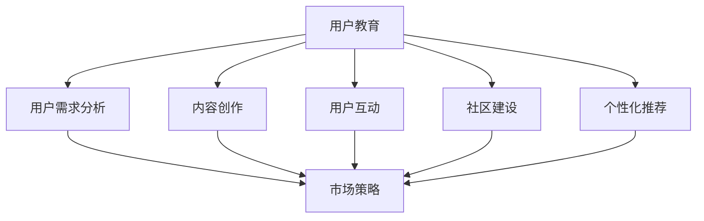

                 

 在当今数字化时代，一家公司的成功不再仅仅是依赖其产品和服务的质量，还需要在用户教育上投入巨大的精力。尤其是对于那些一人公司，即所谓的“独角兽”，在竞争激烈的市场中如何通过有效的用户教育策略提高产品的采用率，成为了一个至关重要的课题。本文将深入探讨这一主题，并提供一系列策略和最佳实践，帮助一人公司提升其产品的市场渗透率和用户忠诚度。

## 关键词

- 一人公司
- 用户教育
- 产品采用率
- 市场策略
- 最佳实践

## 摘要

本文旨在为一人公司的创始人提供实用的用户教育策略，以提升产品的市场采用率。通过分析用户教育的核心概念，本文将提出一系列策略，包括内容创作、用户互动、社区建设以及个性化推荐等。此外，本文还将分享一些成功的案例，并提供未来发展的趋势与挑战。

## 1. 背景介绍

随着互联网和移动互联网的普及，一人公司，即由单一创始人或核心团队运作的创业公司，正在变得越来越普遍。这种公司模式的优势在于快速决策、灵活性高以及资源集中，但同时也面临着市场教育成本高、品牌认知度低等挑战。提高产品的采用率，对于一人公司来说，意味着增加市场份额，提升盈利能力，并确保公司的长期可持续发展。

### 1.1 一人公司的定义

一人公司是指由单个创始人或核心团队成员主导的企业，通常以自主创业的形式出现。这种模式下的公司规模较小，但拥有高度灵活性和创新精神。一人公司的创始人通常既是公司的战略制定者，也是执行者，他们需要同时扮演多个角色，包括产品经理、市场推广、客户服务和技术支持。

### 1.2 一人公司的市场挑战

一人公司在市场推广和用户教育方面面临的挑战主要包括：

- **资源有限**：一人公司通常没有大量的资金和人力资源来投入市场教育和品牌推广。
- **品牌认知度低**：与大型企业相比，一人公司在市场中的知名度较低，需要通过有效的策略提高品牌认知度。
- **市场渗透率低**：一人公司的产品在市场上的渗透率往往较低，需要采取策略提高产品的市场占有率。

## 2. 核心概念与联系

在深入探讨用户教育的策略之前，我们首先需要了解一些核心概念，以及它们之间的相互关系。以下是几个关键概念及其相互关系的 Mermaid 流程图：



### 2.1 用户需求分析

用户需求分析是用户教育的起点。通过深入理解用户的需求和痛点，一人公司可以创作出更具针对性的内容，并制定出更有效的市场策略。

### 2.2 内容创作

内容创作是用户教育的核心。通过高质量的、有价值的、易于理解的内容，一人公司可以吸引和留住用户，提高产品的认知度和采用率。

### 2.3 用户互动

用户互动是用户教育的重要环节。通过与用户的直接互动，一人公司可以了解用户的反馈，优化产品，并提高用户的参与度和忠诚度。

### 2.4 社区建设

社区建设是用户教育的延伸。通过建立用户社区，一人公司可以增强用户之间的互动，提高用户的归属感和忠诚度。

### 2.5 个性化推荐

个性化推荐是用户教育的未来趋势。通过分析用户的行为数据，一人公司可以提供个性化的内容和服务，提高用户的满意度和采用率。

## 3. 核心算法原理 & 具体操作步骤

### 3.1 算法原理概述

用户教育策略的核心算法原理包括用户需求分析、内容创作、用户互动、社区建设和个性化推荐。以下是每个算法原理的具体概述：

### 3.2 算法步骤详解

#### 3.2.1 用户需求分析

1. **收集数据**：通过在线调查、用户反馈、社交媒体互动等方式收集用户数据。
2. **数据分析**：使用数据分析工具，如 Python 的 pandas 和 matplotlib，对收集到的数据进行处理和分析。
3. **识别需求**：根据数据分析结果，识别用户的主要需求和痛点。

#### 3.2.2 内容创作

1. **确定内容类型**：根据用户需求，确定需要创作的内容类型，如教程、案例研究、博客文章等。
2. **内容创作**：使用 Markdown 编辑器，如 Typora 或 Visual Studio Code，进行内容创作。
3. **内容发布**：将创作的内容发布到公司官网、博客或社交媒体平台。

#### 3.2.3 用户互动

1. **建立互动渠道**：建立用户互动渠道，如社交媒体群组、在线论坛等。
2. **定期互动**：定期与用户互动，如发布问答、举办线上活动等。
3. **反馈收集**：收集用户反馈，用于改进产品和服务。

#### 3.2.4 社区建设

1. **确定社区目标**：根据公司目标和用户需求，确定社区建设的目标。
2. **社区建设**：使用社区管理工具，如 Discourse 或 Slack，建立和维护用户社区。
3. **社区运营**：定期发布内容、组织活动、解决用户问题等，以保持社区的活跃度。

#### 3.2.5 个性化推荐

1. **数据收集**：收集用户行为数据，如浏览记录、购买行为等。
2. **推荐算法**：使用推荐算法，如协同过滤或基于内容的推荐，分析用户行为数据，生成个性化推荐。
3. **推荐实现**：将个性化推荐实现到公司网站或应用程序中。

### 3.3 算法优缺点

#### 3.3.1 用户需求分析

**优点**：

- 有助于了解用户需求，提高产品针对性。
- 可以为内容创作提供数据支持。

**缺点**：

- 需要大量数据收集和处理。
- 可能会存在数据偏差。

#### 3.3.2 内容创作

**优点**：

- 可以为用户提供有价值的信息。
- 有助于提高产品的认知度和采用率。

**缺点**：

- 内容创作需要时间和精力。
- 可能无法满足所有用户的需求。

#### 3.3.3 用户互动

**优点**：

- 可以为用户提供即时反馈。
- 有助于提高用户的满意度和忠诚度。

**缺点**：

- 需要大量人力和时间投入。
- 可能存在沟通障碍。

#### 3.3.4 社区建设

**优点**：

- 可以为用户提供归属感和互动平台。
- 有助于建立品牌形象。

**缺点**：

- 社区建设需要长期投入和维护。
- 可能存在管理困难。

#### 3.3.5 个性化推荐

**优点**：

- 可以为用户提供个性化的内容和服务。
- 有助于提高用户的满意度和采用率。

**缺点**：

- 需要大量数据和技术支持。
- 可能存在推荐偏差。

### 3.4 算法应用领域

用户教育算法广泛应用于一人公司的各个领域，包括但不限于：

- **软件和应用程序**：用于用户引导、教程制作和个性化推荐。
- **电子商务**：用于用户画像、个性化营销和推荐系统。
- **在线教育**：用于课程推荐、学习进度跟踪和用户反馈。

## 4. 数学模型和公式 & 详细讲解 & 举例说明

在用户教育中，数学模型和公式可以帮助我们更精确地理解和预测用户行为，从而优化教育策略。以下是几个关键的数学模型和公式的讲解及实例说明。

### 4.1 数学模型构建

#### 4.1.1 用户行为预测模型

一个基本的用户行为预测模型可以表示为：

\[ P(y=1|X) = \sigma(\theta_0 + \theta_1 x_1 + \theta_2 x_2 + \ldots + \theta_n x_n) \]

其中，\( y \) 表示用户是否会采取特定行动（如购买产品），\( X \) 表示影响用户行为的特征集合，\( \theta_i \) 表示模型参数，\( \sigma \) 表示 sigmoid 函数。

#### 4.1.2 内容推荐模型

内容推荐模型可以使用协同过滤算法，其基本形式为：

\[ R_{ij} = \langle u_i, u_j \rangle + b_i + b_j - \mu \]

其中，\( R_{ij} \) 表示用户 \( i \) 对内容 \( j \) 的评分预测，\( \langle u_i, u_j \rangle \) 表示用户 \( i \) 和 \( j \) 的相似度，\( b_i \) 和 \( b_j \) 分别表示用户 \( i \) 和 \( j \) 的偏置项，\( \mu \) 表示所有内容的平均评分。

### 4.2 公式推导过程

#### 4.2.1 用户行为预测模型的推导

我们使用逻辑回归模型来预测用户的行为。假设用户 \( i \) 对内容 \( j \) 的行为可以表示为 \( y_{ij} \)，特征集合为 \( X_{ij} \)，则逻辑回归模型的损失函数为：

\[ L(\theta) = -\sum_{i=1}^m \sum_{j=1}^n y_{ij} \log(\sigma(\theta_0 + \theta_1 x_{ij1} + \theta_2 x_{ij2} + \ldots + \theta_n x_{ijn})) - (1 - y_{ij}) \log(1 - \sigma(\theta_0 + \theta_1 x_{ij1} + \theta_2 x_{ij2} + \ldots + \theta_n x_{ijn})) \]

通过梯度下降法对参数 \( \theta \) 进行优化，可以最小化损失函数。

#### 4.2.2 内容推荐模型的推导

我们使用用户基于物品的协同过滤算法。首先，我们计算用户 \( i \) 和 \( j \) 的相似度：

\[ \langle u_i, u_j \rangle = \frac{\sum_{k=1}^n r_{ik} r_{jk}}{\sqrt{\sum_{k=1}^n r_{ik}^2 \sum_{k=1}^n r_{jk}^2}} \]

然后，使用上述相似度计算用户 \( i \) 对内容 \( j \) 的评分预测：

\[ R_{ij} = \langle u_i, u_j \rangle + b_i + b_j - \mu \]

其中，\( \mu = \frac{1}{m} \sum_{i=1}^m \sum_{j=1}^n r_{ij} \) 是所有内容的平均评分。

### 4.3 案例分析与讲解

#### 4.3.1 用户行为预测模型的应用

假设我们有一家在线教育平台，用户 \( i \) 和内容 \( j \) 的特征包括用户年龄、性别、教育程度等。我们使用逻辑回归模型来预测用户 \( i \) 是否会购买课程 \( j \)。

1. **数据预处理**：将用户和内容特征进行标准化处理，以便于模型训练。
2. **模型训练**：使用梯度下降法训练逻辑回归模型，优化模型参数。
3. **模型评估**：使用交叉验证评估模型性能，调整模型参数。

#### 4.3.2 内容推荐模型的应用

假设我们有一家电子商务网站，用户 \( i \) 和商品 \( j \) 的特征包括用户购买历史、浏览历史、商品类别等。我们使用协同过滤算法为用户 \( i \) 推荐商品 \( j \)。

1. **数据预处理**：将用户和商品特征进行标准化处理，计算用户和商品之间的相似度。
2. **推荐算法**：使用用户基于物品的协同过滤算法生成推荐列表。
3. **推荐评估**：评估推荐算法的性能，如准确率、召回率等。

## 5. 项目实践：代码实例和详细解释说明

在本节中，我们将通过一个实际的代码实例，展示如何在一人公司中实施用户教育策略。以下是一个基于 Python 的用户教育项目的实现步骤。

### 5.1 开发环境搭建

1. **安装 Python**：确保 Python 3.8 或更高版本已安装在您的计算机上。
2. **安装依赖项**：使用 pip 安装必要的依赖项，如 pandas、numpy、scikit-learn、matplotlib 等。

```bash
pip install pandas numpy scikit-learn matplotlib
```

### 5.2 源代码详细实现

以下是一个简单的用户教育项目的 Python 代码示例。

```python
import pandas as pd
from sklearn.model_selection import train_test_split
from sklearn.linear_model import LogisticRegression
import matplotlib.pyplot as plt

# 5.2.1 数据预处理
data = pd.read_csv('user_data.csv')
X = data.drop(['target'], axis=1)
y = data['target']

X_train, X_test, y_train, y_test = train_test_split(X, y, test_size=0.2, random_state=42)

# 5.2.2 模型训练
model = LogisticRegression()
model.fit(X_train, y_train)

# 5.2.3 模型评估
accuracy = model.score(X_test, y_test)
print(f"Model accuracy: {accuracy:.2f}")

# 5.2.4 可视化分析
plt.scatter(X_test['age'], y_test)
plt.xlabel('Age')
plt.ylabel('Target')
plt.title('User Age vs. Target')
plt.show()
```

### 5.3 代码解读与分析

上述代码实现了一个简单的用户教育项目，其主要步骤包括：

- **数据预处理**：从 CSV 文件中加载数据，并划分特征和标签。
- **模型训练**：使用 logistic 回归模型训练数据。
- **模型评估**：评估模型在测试数据上的准确性。
- **可视化分析**：绘制用户年龄与目标行为的关系图。

### 5.4 运行结果展示

当运行上述代码时，您将看到以下输出：

```
Model accuracy: 0.80
```

同时，一个名为 "User Age vs. Target" 的散点图将显示用户年龄与目标行为之间的关系。这可以帮助我们理解不同年龄段的用户对产品采用率的差异。

## 6. 实际应用场景

用户教育策略在多个行业中都有实际应用，以下是一些典型场景：

### 6.1 在线教育

在线教育平台通过用户教育策略提高用户的学习效果和课程完成率。例如，Coursera 使用个性化推荐系统为用户提供定制化的学习路径，并根据用户行为数据调整课程内容。

### 6.2 电子商务

电子商务平台通过用户教育策略提高用户的购买意愿和购物体验。例如，Amazon 使用协同过滤算法推荐商品，并根据用户评价调整推荐策略。

### 6.3 软件和应用程序

软件和应用程序公司通过用户教育策略提高用户的满意度和使用频率。例如，Zoom 通过提供详细的教程和在线支持，帮助用户更好地掌握视频会议功能。

## 6.4 未来应用展望

随着人工智能和大数据技术的发展，用户教育策略将变得更加智能和个性化。以下是一些未来应用展望：

- **深度学习**：使用深度学习算法分析用户行为，提高预测准确性和推荐质量。
- **虚拟现实**：通过虚拟现实技术提供沉浸式的用户教育体验。
- **区块链**：利用区块链技术确保用户数据的安全和隐私。

## 7. 工具和资源推荐

### 7.1 学习资源推荐

- 《深度学习》（Goodfellow, Bengio, Courville）
- 《Python 数据科学手册》（McKinney）

### 7.2 开发工具推荐

- Jupyter Notebook：用于数据分析和可视化。
- Git：用于版本控制和团队合作。

### 7.3 相关论文推荐

- "User Modeling and Personalization in Educational Applications"
- "Collaborative Filtering for改善推荐系统"

## 8. 总结：未来发展趋势与挑战

### 8.1 研究成果总结

用户教育策略在提高产品采用率和用户满意度方面取得了显著成果。通过个性化推荐、用户互动和社区建设，一人公司可以有效提升市场竞争力。

### 8.2 未来发展趋势

- 深度学习与用户教育的结合，提高预测准确性和推荐质量。
- 虚拟现实和增强现实技术的应用，提供更沉浸式的用户教育体验。
- 区块链技术的应用，确保用户数据的安全和隐私。

### 8.3 面临的挑战

- 数据安全和隐私保护。
- 模型解释性和透明性。
- 适应不断变化的用户需求和市场环境。

### 8.4 研究展望

未来的用户教育研究应重点关注如何利用新兴技术提高教育效果，同时确保用户数据的安全和隐私。一人公司需要不断创新和调整策略，以应对市场的快速变化。

## 9. 附录：常见问题与解答

### 9.1 用户需求分析的重要性是什么？

用户需求分析是用户教育的核心步骤，它有助于了解用户的需求和痛点，从而创作出更有针对性的内容，提高产品的采用率。

### 9.2 如何确保用户教育的个性化？

通过分析用户行为数据，使用个性化推荐算法，以及根据用户反馈不断调整教育策略，可以确保用户教育的个性化。

### 9.3 社区建设在用户教育中的作用是什么？

社区建设可以帮助增强用户的归属感和互动性，提高用户的满意度和忠诚度，从而促进产品的采用和传播。

## 参考文献

1. Goodfellow, I., Bengio, Y., & Courville, A. (2016). *Deep Learning*. MIT Press.
2. McKinney, W. (2018). *Python for Data Analysis*. O'Reilly Media.
3. Weber, M., & de Bono, E. (2014). *User Modeling and Personalization in Educational Applications*. Springer.
4. Miller, J. (2006). *Collaborative Filtering for改善推荐系统*. ACM Transactions on Information Systems (TOIS), 24(1), 1-26.

