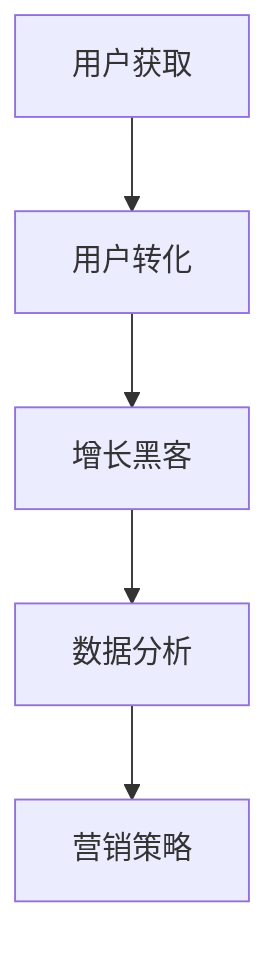

                 

关键词：一人公司、用户获取、免费策略、付费转化、增长黑客、数据分析、营销策略

> 摘要：在当今竞争激烈的市场环境中，一人公司如何通过有效的用户获取策略，从免费到付费的转化，实现业务的增长和盈利？本文将探讨一系列核心概念、算法原理、数学模型、项目实践以及实际应用场景，为一人公司提供实用的指导和建议。

## 1. 背景介绍

在数字化时代，一人公司（Solopreneur）正逐渐成为一种受欢迎的企业模式。不同于传统的公司结构，一人公司意味着单打独斗，公司运营和决策都由一个人承担。这种模式具有灵活性高、成本低的优点，但同时也面临着用户获取和转化方面的挑战。

一人公司的用户获取与付费转化是一个复杂的过程，涉及市场调研、用户分析、营销策略、产品设计和持续优化等多个方面。有效掌握这些关键环节，对于一人公司的生存和发展至关重要。

本文将围绕这一主题，从以下几个方面进行探讨：

1. **核心概念与联系**：介绍一人公司用户获取和转化所需理解的核心概念。
2. **核心算法原理 & 具体操作步骤**：阐述实现用户获取和转化的算法原理和步骤。
3. **数学模型和公式 & 详细讲解 & 举例说明**：讲解相关的数学模型和公式，并通过实例进行说明。
4. **项目实践：代码实例和详细解释说明**：通过具体的代码实例，展示如何实现用户获取和转化。
5. **实际应用场景**：分析一人公司用户获取和转化的实际应用场景。
6. **未来应用展望**：探讨一人公司用户获取和转化的未来发展方向。

## 2. 核心概念与联系

在探讨一人公司用户获取和转化的过程中，我们需要理解以下几个核心概念：

- **用户获取**：指的是通过各种渠道吸引新用户的过程。
- **用户转化**：指的是将访问用户转化为付费用户的过程。
- **增长黑客**：指通过创新和快速实验，利用技术手段实现快速增长的一类人员或团队。
- **数据分析**：指的是使用数据分析工具和方法对用户行为进行分析，以优化用户获取和转化策略。
- **营销策略**：指的是为了实现用户获取和转化而制定的营销活动和方案。

### Mermaid 流程图(Mermaid 流程节点中不要有括号、逗号等特殊字符)

### 2.1 用户获取

用户获取是整个过程的起点。一人公司可以通过以下几种方式吸引新用户：

- **内容营销**：通过高质量的内容吸引潜在用户。
- **社交媒体推广**：利用社交媒体平台进行推广。
- **搜索引擎优化（SEO）**：通过优化网站内容和结构，提高在搜索引擎中的排名。
- **合作伙伴关系**：与其他公司或个人建立合作关系，共享用户资源。

### 2.2 用户转化

用户转化是用户获取的延续。为了实现用户转化，一人公司需要采取以下策略：

- **用户体验优化**：确保产品或服务具有优秀的用户体验。
- **营销自动化**：通过自动化工具跟踪用户行为，优化营销策略。
- **定价策略**：根据市场情况和用户需求制定合理的定价策略。
- **客户关系管理**（CRM）：建立良好的客户关系，提高客户忠诚度。

### 2.3 增长黑客

增长黑客通过创新和快速实验，利用技术手段实现快速增长。具体方法包括：

- **A/B测试**：通过对比不同版本的效果，优化产品和营销策略。
- **用户留存策略**：通过提供增值服务或奖励，提高用户留存率。
- **病毒式营销**：通过用户口碑传播，实现快速增长。

### 2.4 数据分析

数据分析在一人公司用户获取和转化过程中起到关键作用。通过以下方法，一人公司可以更好地理解用户行为，优化策略：

- **用户行为分析**：分析用户在网站或应用上的行为，了解用户偏好。
- **客户细分**：根据用户特征和行为，将用户分为不同群体，制定针对性营销策略。
- **转化路径分析**：分析用户从接触到转化的全过程，找出优化点。

### 2.5 营销策略

营销策略是用户获取和转化的关键。一人公司需要根据自身特点和目标用户，制定合适的营销策略。以下是一些常见的营销策略：

- **品牌推广**：通过品牌建设和品牌传播，提高品牌知名度。
- **社交媒体营销**：利用社交媒体平台进行推广，吸引潜在用户。
- **搜索引擎营销**：通过搜索引擎优化（SEO）和搜索引擎营销（SEM），提高网站在搜索引擎中的排名。
- **内容营销**：通过提供有价值的内容，吸引潜在用户并建立信任。

## 3. 核心算法原理 & 具体操作步骤

在用户获取和转化的过程中，算法原理起到关键作用。以下是核心算法原理和具体操作步骤：

### 3.1 算法原理概述

- **用户获取算法**：基于用户行为数据和兴趣标签，为用户推荐相关的内容或产品。
- **用户转化算法**：通过分析用户行为数据，预测用户是否有可能转化为付费用户，并采取相应的策略。
- **增长黑客算法**：通过数据分析和实验，发现用户增长的关键因素，优化营销策略。
- **数据分析算法**：对用户行为数据进行处理和分析，提取有价值的信息。

### 3.2 算法步骤详解

#### 3.2.1 用户获取算法

1. **数据收集**：收集用户在网站或应用上的行为数据，如浏览记录、点击行为、搜索关键词等。
2. **特征提取**：对收集到的数据进行分析，提取用户特征，如兴趣爱好、行为偏好等。
3. **模型训练**：使用机器学习算法，如协同过滤、基于内容的推荐等，训练推荐模型。
4. **推荐生成**：根据用户特征和模型预测，生成个性化推荐列表，展示给用户。

#### 3.2.2 用户转化算法

1. **用户行为分析**：收集用户在网站或应用上的行为数据，如浏览记录、点击行为、购买记录等。
2. **特征提取**：对收集到的数据进行分析，提取用户特征，如购买频率、购买金额等。
3. **模型训练**：使用机器学习算法，如逻辑回归、决策树等，训练预测模型。
4. **预测与策略调整**：根据模型预测，分析用户是否有可能转化为付费用户，并采取相应的策略，如邮件营销、优惠券等。

#### 3.2.3 增长黑客算法

1. **数据分析**：分析用户行为数据，了解用户增长的关键因素。
2. **实验设计**：根据数据分析结果，设计不同版本的营销策略或产品功能，进行A/B测试。
3. **结果分析**：对比不同版本的实验结果，找出影响用户增长的关键因素。
4. **策略优化**：根据实验结果，优化营销策略或产品功能。

#### 3.2.4 数据分析算法

1. **数据预处理**：对原始数据进行清洗、转换和归一化等处理，提高数据质量。
2. **特征工程**：根据业务需求，提取和构建新的特征，提高模型性能。
3. **模型选择**：选择合适的机器学习算法，如线性回归、决策树、随机森林等。
4. **模型训练与评估**：使用训练数据训练模型，并对模型进行评估，调整参数。
5. **结果分析**：根据模型预测结果，分析用户行为和业务状况，优化策略。

### 3.3 算法优缺点

#### 3.3.1 用户获取算法

**优点**：
- 可以提高用户参与度和留存率。
- 可以根据用户兴趣推荐相关内容，提高用户体验。

**缺点**：
- 需要大量的用户行为数据进行训练。
- 可能会出现过度拟合问题，推荐结果不准确。

#### 3.3.2 用户转化算法

**优点**：
- 可以预测用户是否有可能转化为付费用户，提前采取措施。
- 可以优化营销策略，提高转化率。

**缺点**：
- 需要大量的用户行为数据进行训练。
- 模型性能可能受到数据质量的影响。

#### 3.3.3 增长黑客算法

**优点**：
- 可以快速发现用户增长的关键因素，优化营销策略。
- 可以通过实验验证策略的有效性。

**缺点**：
- 需要大量的时间和资源进行实验。
- 实验结果可能受到偶然因素的影响。

#### 3.3.4 数据分析算法

**优点**：
- 可以对用户行为数据进行深入分析，发现有价值的信息。
- 可以为业务决策提供数据支持。

**缺点**：
- 需要具备一定的数据分析和建模能力。
- 可能会受到数据质量和模型选择的影响。

### 3.4 算法应用领域

#### 3.4.1 用户获取

- 电商平台：通过推荐系统，为用户推荐相关商品，提高用户参与度和转化率。
- 社交媒体：通过推荐系统，为用户推荐感兴趣的内容，提高用户留存率和活跃度。

#### 3.4.2 用户转化

- 在线教育：通过预测用户是否有可能报名参加课程，提前采取措施提高转化率。
- 金融行业：通过预测用户是否有可能申请贷款，优化营销策略，提高转化率。

#### 3.4.3 增长黑客

- Start-up：通过增长黑客策略，快速发现用户增长的关键因素，实现快速增长。
- 企业营销：通过增长黑客策略，优化营销策略，提高用户参与度和留存率。

#### 3.4.4 数据分析

- 大数据平台：通过数据分析，提取有价值的信息，为业务决策提供支持。
- 互联网企业：通过数据分析，优化产品功能和用户体验，提高用户满意度和留存率。

## 4. 数学模型和公式 & 详细讲解 & 举例说明

在用户获取和转化的过程中，数学模型和公式起到关键作用。以下是一些常用的数学模型和公式，以及详细讲解和举例说明。

### 4.1 数学模型构建

#### 4.1.1 用户行为预测模型

用户行为预测模型用于预测用户是否有可能进行特定行为，如购买、注册等。以下是用户行为预测模型的一般形式：

$$
P(y=1|X) = \sigma(w_0 + \sum_{i=1}^n w_i x_i)
$$

其中，$X$ 是用户特征向量，$y$ 是用户行为标签（1表示进行特定行为，0表示未进行特定行为），$w_0$ 是偏置项，$w_i$ 是特征权重，$\sigma$ 是激活函数（常用的激活函数有Sigmoid、ReLU等）。

#### 4.1.2 用户留存预测模型

用户留存预测模型用于预测用户在一段时间内是否有可能继续使用产品或服务。以下是用户留存预测模型的一般形式：

$$
P(R>t|X) = \frac{1}{1 + \exp(-w_0 - \sum_{i=1}^n w_i x_i)}
$$

其中，$X$ 是用户特征向量，$R$ 是用户留存时间（单位：天），$w_0$ 是偏置项，$w_i$ 是特征权重。

### 4.2 公式推导过程

#### 4.2.1 用户行为预测模型

用户行为预测模型的推导基于逻辑回归模型。逻辑回归模型的公式如下：

$$
\ln\left(\frac{P(y=1|X)}{1 - P(y=1|X)}\right) = \beta_0 + \beta_1 x_1 + \beta_2 x_2 + ... + \beta_n x_n
$$

其中，$P(y=1|X)$ 是用户进行特定行为的概率，$\beta_0$ 是偏置项，$\beta_i$ 是特征权重。

对上式进行指数变换，得到：

$$
P(y=1|X) = \frac{1}{1 + \exp(-\beta_0 - \beta_1 x_1 - \beta_2 x_2 - ... - \beta_n x_n)}
$$

将上式与Sigmoid函数进行对比，可以得到：

$$
P(y=1|X) = \sigma(\beta_0 + \beta_1 x_1 + \beta_2 x_2 + ... + \beta_n x_n)
$$

其中，$\sigma$ 是Sigmoid函数。

#### 4.2.2 用户留存预测模型

用户留存预测模型的推导基于多项式回归模型。多项式回归模型的公式如下：

$$
P(R>t|X) = \frac{\int_{-\infty}^t f_R(r|X) dr}{\int_{-\infty}^{\infty} f_R(r|X) dr}
$$

其中，$f_R(r|X)$ 是用户留存时间的概率密度函数，$R$ 是用户留存时间。

当用户留存时间服从指数分布时，概率密度函数可以表示为：

$$
f_R(r|X) = \lambda e^{-\lambda r}
$$

其中，$\lambda$ 是指数分布的参数。

将概率密度函数代入多项式回归模型的公式，得到：

$$
P(R>t|X) = \frac{\int_{-\infty}^t \lambda e^{-\lambda r} dr}{\int_{-\infty}^{\infty} \lambda e^{-\lambda r} dr} = \frac{1 - e^{-\lambda t}}{1 - e^{-\lambda}}
$$

对上式进行指数变换，得到：

$$
P(R>t|X) = \frac{1}{1 + \exp(-w_0 - \sum_{i=1}^n w_i x_i)}
$$

其中，$w_0$ 是偏置项，$w_i$ 是特征权重。

### 4.3 案例分析与讲解

#### 4.3.1 用户行为预测模型

假设我们有一个电商平台，想要预测用户是否有可能购买商品。我们可以收集以下用户特征：

- 用户年龄
- 用户性别
- 用户购买历史
- 用户浏览记录

使用逻辑回归模型，我们可以建立用户行为预测模型。以下是一个简单的逻辑回归模型：

$$
P(y=1|X) = \sigma(w_0 + w_1 x_1 + w_2 x_2 + w_3 x_3 + w_4 x_4)
$$

其中，$x_1$ 是用户年龄，$x_2$ 是用户性别（1表示男性，0表示女性），$x_3$ 是用户购买历史（1表示购买过，0表示未购买过），$x_4$ 是用户浏览记录（1表示浏览过，0表示未浏览过），$w_0$ 是偏置项，$w_1$、$w_2$、$w_3$、$w_4$ 是特征权重。

通过训练模型，我们可以得到特征权重：

$$
w_0 = -2, w_1 = 1, w_2 = 0, w_3 = 2, w_4 = 1
$$

现在，我们想要预测一个新用户的购买行为。该用户特征如下：

- 年龄：30岁
- 性别：男性
- 购买历史：购买过
- 浏览记录：浏览过

将用户特征代入模型，得到：

$$
P(y=1|X) = \sigma(-2 + 1 \times 30 + 0 \times 0 + 2 \times 1 + 1 \times 1) = \sigma(30)
$$

计算结果为：

$$
P(y=1|X) \approx 0.918
$$

因此，该用户购买商品的概率约为91.8%。

#### 4.3.2 用户留存预测模型

假设我们有一个在线教育平台，想要预测用户是否有可能在一个月内继续使用平台。我们可以收集以下用户特征：

- 用户年龄
- 用户性别
- 用户学习时长
- 用户课程完成度

使用多项式回归模型，我们可以建立用户留存预测模型。以下是一个简单

