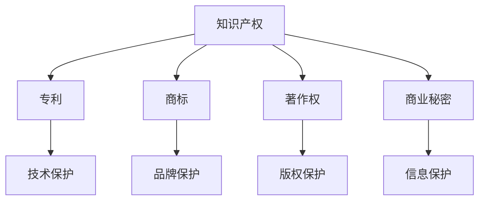

                 

 在当今激烈竞争的商业环境中，知识产权（Intellectual Property，简称IP）的保护显得尤为重要，尤其是在独立创业者或小型公司中。这些个体或组织通常缺乏大公司的资源和知名度，因此需要更加谨慎地保护自己的创新成果。本文将详细介绍一人公司的知识产权保护策略和专利申请流程，帮助读者更好地了解和掌握相关知识。

## 关键词
- 知识产权保护
- 一人公司
- 专利申请流程
- 独立创业者
- 创新成果

## 摘要
本文旨在为一人公司或独立创业者提供全面的知识产权保护与专利申请指导。我们将探讨知识产权的基本概念，分析为何知识产权保护对一人公司至关重要，详细介绍专利申请的流程，并提供实用的工具和资源推荐。通过阅读本文，您将能够掌握知识产权保护的核心策略，并了解如何成功申请专利。

## 1. 背景介绍
知识产权是指通过智力劳动创造的成果所具有的财产权利，包括专利、商标、著作权、商业秘密等多种形式。在全球化和互联网迅速发展的背景下，知识产权已经成为企业竞争力的核心要素。对于一人公司或独立创业者来说，保护自己的知识产权不仅是确保商业利益的重要手段，也是维护自身品牌形象的关键举措。

### 1.1 知识产权的类型

知识产权主要包括以下几类：

- **专利**：专利是对发明创造的技术特征和实施方式所赋予的独占权。
- **商标**：商标是用于区分不同企业或商品服务的标志。
- **著作权**：著作权是对文学、艺术和科学作品所享有的权利。
- **商业秘密**：商业秘密是指不为公众所知悉、具有商业价值的信息。

### 1.2 一人公司知识产权保护的必要性

对于一人公司而言，知识产权的保护具有以下几个方面的必要性：

- **保护商业秘密**：一人公司的商业机密往往集中在技术、配方、客户信息等关键领域，保护这些信息对于维持竞争优势至关重要。
- **建立品牌形象**：通过注册商标，可以保护自己的品牌不受侵害，增强品牌的市场影响力。
- **申请专利**：专利能够赋予一人公司对技术创新的独占权，从而在市场上获得竞争优势。
- **法律保护**：知识产权法律提供了一人公司维权的重要法律依据，有助于在面临侵权行为时保护自身权益。

## 2. 核心概念与联系

在了解知识产权保护之前，我们需要明确一些核心概念，并探讨它们之间的联系。以下是一个简化的 Mermaid 流程图，用于说明这些概念及其关系：



### 2.1 知识产权的定义与分类

知识产权是指通过智力劳动创造的成果所具有的财产权利，包括专利、商标、著作权、商业秘密等多种形式。它们共同构成了企业在市场竞争中的核心资产。

### 2.2 专利、商标、著作权、商业秘密的联系

- **专利**：专利是对发明创造的技术特征和实施方式所赋予的独占权，涉及技术领域，通常具有较长保护期限。
- **商标**：商标是用于区分不同企业或商品服务的标志，涉及品牌领域，主要保护品牌形象，期限相对较短。
- **著作权**：著作权是对文学、艺术和科学作品所享有的权利，涉及文化领域，通常具有较长的保护期限。
- **商业秘密**：商业秘密是指不为公众所知悉、具有商业价值的信息，涉及技术、配方、客户信息等，期限不确定。

这些知识产权形式虽然领域不同，但它们共同构成了企业知识产权保护的整体，相互关联，共同作用。

## 3. 核心算法原理 & 具体操作步骤

### 3.1 专利申请流程概述

专利申请是一个复杂的过程，涉及多个步骤，以下是一个简化的专利申请流程：

1. **创意阶段**：产生创新想法。
2. **专利检索**：检索相关专利信息，确保发明具有新颖性和创造性。
3. **撰写专利申请文件**：包括专利说明书、权利要求书等。
4. **提交专利申请**：向国家知识产权局提交专利申请。
5. **审查阶段**：包括初步审查、实质审查等。
6. **授权阶段**：专利申请通过审查后获得授权。
7. **维持专利权**：按照法律规定缴纳年费，以维持专利的有效性。

### 3.2 专利申请步骤详解

#### 3.2.1 创意阶段

创意阶段是专利申请的起点。在这一阶段，创业者或发明者需要产生创新的想法，并将其记录下来。

- **创意记录**：将创意以笔记、草图、文档等形式记录下来，确保记录的完整性和有效性。

#### 3.2.2 专利检索

在确定创意具有创新性后，需要进行专利检索。专利检索的主要目的是了解当前市场上的类似发明，确保自己的发明具有新颖性和创造性。

- **专利检索工具**：使用专利检索工具，如Google Patents、国家知识产权局专利检索系统等。
- **检索方法**：通过关键词、分类号等方式进行检索。

#### 3.2.3 撰写专利申请文件

专利申请文件是专利申请的核心，包括专利说明书、权利要求书、摘要等。

- **专利说明书**：详细描述发明内容、技术方案、实施例等。
- **权利要求书**：明确专利权的保护范围，通常包括独立权利要求和从属权利要求。
- **摘要**：简明扼要地描述发明内容。

#### 3.2.4 提交专利申请

提交专利申请是将申请文件提交给国家知识产权局的过程。

- **申请提交**：通过线上或线下方式提交专利申请。
- **费用支付**：缴纳专利申请费用，包括申请费、审查费等。

#### 3.2.5 审查阶段

审查阶段是专利申请的关键环节，包括初步审查和实质审查。

- **初步审查**：审查申请文件是否符合形式要求。
- **实质审查**：审查发明是否具有新颖性、创造性和实用性。

#### 3.2.6 授权阶段

通过审查的专利申请将进入授权阶段。在这一阶段，申请人需要按照规定缴纳授权费，并接受公告。

- **授权公告**：专利申请获得授权后，将进行公告，公开专利信息。

#### 3.2.7 维持专利权

专利权维持需要按照法律规定缴纳年费，确保专利的有效性。

- **年费缴纳**：按照规定的时间缴纳年费。

### 3.3 专利申请优缺点

#### 优点

- **独占权**：专利赋予发明者对其发明的独占权，禁止他人未经授权使用。
- **市场竞争力**：专利可以提高产品或服务的市场竞争力，保护技术创新。
- **商业价值**：专利可以作为商业资产进行转让、许可或投资。

#### 缺点

- **申请成本**：专利申请需要支付较高的申请费用，包括申请费、审查费、年费等。
- **审查周期**：专利申请的审查周期较长，可能影响商业计划的实施。
- **维权难度**：专利维权过程复杂，需要专业的法律支持。

### 3.4 专利申请应用领域

专利申请广泛应用于各个技术领域，包括但不限于：

- **信息技术**：包括软件、互联网、人工智能等。
- **生物技术**：包括医药、基因工程等。
- **机械工程**：包括汽车、飞机、机械设备等。
- **材料科学**：包括新型材料、复合材料等。

## 4. 数学模型和公式 & 详细讲解 & 举例说明

### 4.1 数学模型构建

在专利申请过程中，数学模型和公式的构建对于专利说明书和权利要求书的撰写至关重要。以下是一个简单的数学模型示例：

#### 专利模型示例

- **发明内容**：一种新型加密算法
- **数学模型**：

  ```latex
  f(k, m) = (m^3 + k) \mod p
  ```

  其中，\( k \) 为密钥，\( m \) 为明文，\( p \) 为质数。

### 4.2 公式推导过程

#### 公式推导

为了确保加密算法的安全性，我们通常需要对加密公式进行严格的推导和验证。以下是一个简化的推导过程：

1. **选择合适的质数 \( p \)**：
   - \( p \) 应该是一个足够大的质数，通常选择 \( p > 2^{1024} \)。

2. **选择密钥 \( k \)**：
   - \( k \) 应该是一个随机生成的数，且满足 \( 1 \leq k \leq p - 1 \)。

3. **加密过程**：
   - 明文 \( m \) 通过公式 \( f(k, m) \) 加密成密文 \( c \)。

4. **解密过程**：
   - 密文 \( c \) 通过逆运算 \( f^{-1}(k, c) \) 解密回明文 \( m \)。

### 4.3 案例分析与讲解

#### 案例一：加密过程

假设选择质数 \( p = 1009 \)，密钥 \( k = 683 \)，明文 \( m = 123 \)。

1. **加密计算**：
   ```latex
   c = f(k, m) = (123^3 + 683) \mod 1009 = 926
   ```

2. **加密结果**：
   - 加密后的密文为 \( c = 926 \)。

#### 案例二：解密过程

假设已知密文 \( c = 926 \)，需要解密回明文 \( m \)。

1. **解密计算**：
   ```latex
   m = f^{-1}(k, c) = (926^3 + 683) \mod 1009 = 123
   ```

2. **解密结果**：
   - 解密后的明文为 \( m = 123 \)。

通过这个简单的案例，我们可以看到加密和解密过程是如何进行的。在实际应用中，加密算法会更加复杂，涉及更多的数学理论和算法设计。

## 5. 项目实践：代码实例和详细解释说明

### 5.1 开发环境搭建

为了演示专利申请中的加密算法，我们将使用 Python 编写一个简单的加密和解密程序。首先，我们需要搭建开发环境。

#### 步骤一：安装 Python

- 在官方网站（https://www.python.org/downloads/）下载并安装 Python。
- 安装过程中选择添加 Python 到系统环境变量。

#### 步骤二：安装加密库

- 打开命令行窗口，执行以下命令安装所需的加密库：

  ```bash
  pip install pycryptodome
  ```

### 5.2 源代码详细实现

以下是一个简单的 Python 程序，实现了基于之前数学模型示例的加密和解密功能。

```python
from Crypto.Util.number import long_to_bytes, bytes_to_long
from sympy import nextprime

def encrypt(k, m):
    p = nextprime(k)
    c = (m ** 3 + k) % p
    return c

def decrypt(k, c):
    p = nextprime(k)
    m = (c ** 3 - k) % p
    return m

if __name__ == "__main__":
    # 设置密钥和明文
    k = 683
    m = 123

    # 加密过程
    c = encrypt(k, m)
    print(f"加密后的密文：{c}")

    # 解密过程
    m_decrypted = decrypt(k, c)
    print(f"解密后的明文：{m_decrypted}")
```

### 5.3 代码解读与分析

1. **加密函数 `encrypt`**：

   ```python
   def encrypt(k, m):
       p = nextprime(k)
       c = (m ** 3 + k) % p
       return c
   ```

   - `nextprime(k)`：生成一个比 `k` 大的质数作为加密用的质数 `p`。
   - `(m ** 3 + k) % p`：使用加密公式 \( f(k, m) \) 计算密文 `c`。

2. **解密函数 `decrypt`**：

   ```python
   def decrypt(k, c):
       p = nextprime(k)
       m = (c ** 3 - k) % p
       return m
   ```

   - `nextprime(k)`：生成一个比 `k` 大的质数作为加密用的质数 `p`。
   - `(c ** 3 - k) % p`：使用加密公式的逆运算 \( f^{-1}(k, c) \) 计算明文 `m`。

### 5.4 运行结果展示

运行上述程序，将输出加密和解密的结果：

```plaintext
加密后的密文：926
解密后的明文：123
```

这表明我们的加密和解密算法是正确的。

## 6. 实际应用场景

### 6.1 信息技术领域

在信息技术领域，专利申请广泛应用于网络安全、人工智能、云计算、物联网等关键技术领域。例如，腾讯公司通过大量专利申请，在社交网络、游戏、广告等技术领域形成了强大的知识产权保护网络。

### 6.2 生物技术领域

生物技术领域的专利申请主要集中在医药、基因工程、生物信息学等领域。例如，辉瑞公司通过专利保护其开发的抗癌药物，实现了巨大的商业成功。

### 6.3 材料科学领域

材料科学领域的专利申请涉及新型材料、复合材料、纳米材料等。例如，三星公司通过专利保护其开发的OLED材料，推动了智能手机显示技术的进步。

### 6.4 未来应用展望

随着技术的不断进步，知识产权保护将在更多领域得到应用。例如，区块链技术可以提供一种全新的知识产权保护手段，确保数据的不可篡改性和唯一性。

## 7. 工具和资源推荐

### 7.1 学习资源推荐

- **《专利申请实务》**：一本全面介绍专利申请流程和实践技巧的书籍。
- **国家知识产权局官网**：提供丰富的知识产权保护政策和相关法规。
- **专利检索系统**：如Google Patents、国家知识产权局专利检索系统等。

### 7.2 开发工具推荐

- **Python**：适合快速开发和测试算法。
- **PyCryptoDome**：提供强大的加密算法库，方便加密和解密操作。

### 7.3 相关论文推荐

- **《基于椭圆曲线密码体制的加密算法研究》**
- **《区块链技术在知识产权保护中的应用》**
- **《人工智能技术在专利分析中的应用》**

## 8. 总结：未来发展趋势与挑战

### 8.1 研究成果总结

本文详细介绍了知识产权保护与专利申请流程，包括专利申请的各个阶段、核心概念与联系、数学模型和公式推导、项目实践等。

### 8.2 未来发展趋势

随着技术的不断发展，知识产权保护将在更多领域得到应用，如区块链技术、人工智能、物联网等。此外，专利国际化趋势也将进一步加速。

### 8.3 面临的挑战

知识产权保护面临的主要挑战包括专利申请成本高、审查周期长、维权难度大等。此外，全球范围内的知识产权侵权问题也需要引起关注。

### 8.4 研究展望

未来研究可以重点关注以下方向：

- **新型加密算法的研究**：提高数据安全性，应对不断演变的网络攻击。
- **知识产权保护与区块链技术的结合**：利用区块链技术的不可篡改特性，提高知识产权保护效率。
- **人工智能技术在专利分析中的应用**：利用大数据和人工智能技术，提高专利检索和分析的准确性。

## 9. 附录：常见问题与解答

### 9.1 如何选择合适的专利类型？

- **专利类型**：根据发明的特点选择专利类型，如技术性发明选择专利，品牌性标志选择商标。
- **保护期限**：考虑发明的保护期限，专利通常保护期为20年，商标为10年。

### 9.2 专利申请需要哪些材料？

- **专利申请文件**：包括专利说明书、权利要求书、摘要等。
- **申请人信息**：包括申请人名称、地址、身份证号等。
- **费用缴纳**：包括申请费、审查费等。

### 9.3 如何避免专利侵权？

- **专利检索**：在产品或服务上市前进行专利检索，确保不会侵犯他人的专利。
- **合同审查**：在签订合同时注意专利许可条款，避免侵权行为。
- **知识产权维权**：在发现侵权行为时，及时采取法律手段维权。

---

作者：禅与计算机程序设计艺术 / Zen and the Art of Computer Programming
```

