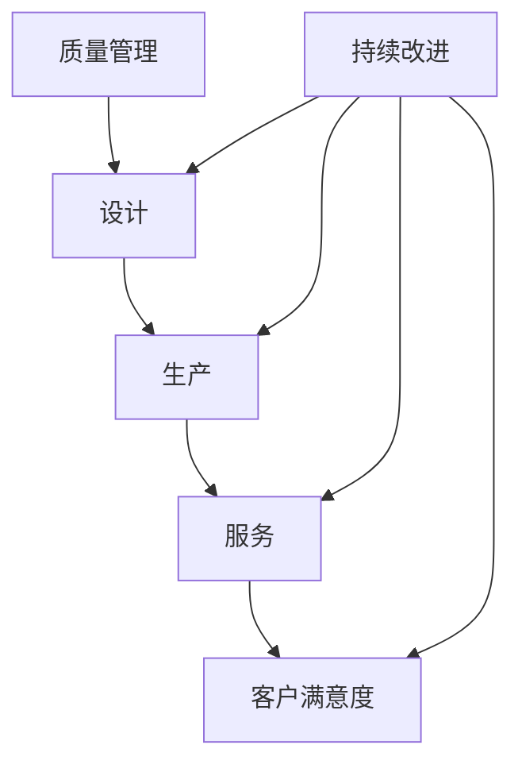

                 

 

### 1. 背景介绍

在当今这个快速发展的技术时代，一个人创办并管理一家公司变得越来越普遍。对于许多人来说，这是一个充满挑战和机遇的过程。作为一家一人公司的创始人，您不仅需要扮演多个角色，还要确保公司的各项事务得到妥善管理，尤其是在质量管理方面。质量管理对于任何规模的公司都至关重要，它关系到产品的可靠性、用户满意度以及公司的声誉。

质量管理不仅仅是确保产品达到一定的质量标准，它更是一个持续改进的过程，旨在不断提高产品和服务的质量，以满足不断变化的市场需求和客户期望。对于一人公司来说，质量管理尤为重要，因为资源有限，任何质量上的失误都可能导致巨大的损失。

本文将探讨一人公司质量管理与持续改进的重要性，介绍相关的核心概念和原理，并提供实用的工具和资源，帮助您在有限的资源下有效地实施质量管理，并持续改进公司的运营。

### 2. 核心概念与联系

在深入探讨质量管理与持续改进之前，我们需要明确一些核心概念，这些概念构成了质量管理的基础，并相互关联。

#### 2.1 质量管理

质量管理是一个确保产品或服务满足客户需求和期望的过程。它涵盖了从设计、生产到服务的各个环节。对于一人公司来说，质量管理意味着要确保每一个环节都符合既定的质量标准，从而提供高质量的产品和服务。

#### 2.2 持续改进

持续改进是一个不断寻求提高产品或服务质量的过程。它基于对现有流程的不断评估和优化，以减少缺陷、提高效率和客户满意度。持续改进是一种文化，需要全员参与，并融入到日常运营中。

#### 2.3 核心概念关系

质量管理与持续改进之间有着紧密的联系。质量管理是持续改进的基础，而持续改进则是实现更高水平质量管理的手段。两者相辅相成，共同推动公司不断进步。

下面是质量管理与持续改进的Mermaid流程图：



在这个流程图中，质量管理覆盖了设计、生产和服务各个环节，而持续改进则贯穿始终，不断优化这些环节，以提高客户满意度。

### 3. 核心算法原理 & 具体操作步骤

#### 3.1 算法原理概述

质量管理的核心算法通常是基于统计过程控制（SPC）和六西格玛（Six Sigma）等原则。这些方法帮助公司监测和优化生产过程中的质量。

统计过程控制是一种用于监测和改进生产过程质量的方法。它通过收集和分析数据来识别生产过程中的异常，从而确保产品质量稳定。

六西格玛则是一种更广泛的质量改进方法，它通过减少生产过程中的变异来提高产品质量和客户满意度。六西格玛的核心思想是消除过程中的缺陷，使其达到六西格玛水平（即每百万次操作中有3.4次缺陷）。

#### 3.2 算法步骤详解

以下是质量管理与持续改进的具体操作步骤：

##### 3.2.1 收集数据

首先，需要收集与产品质量相关的数据，如缺陷率、客户反馈等。这些数据可以来自生产过程中的各种监测设备，也可以通过客户反馈获得。

##### 3.2.2 数据分析

收集到数据后，需要进行统计分析。常见的统计方法包括控制图、散点图、直方图等。通过这些图表，可以直观地了解生产过程中的质量状况。

##### 3.2.3 识别异常

通过数据分析，可以识别生产过程中的异常。例如，控制图中异常点表示生产过程中的异常情况。这些异常需要被及时处理。

##### 3.2.4 制定改进计划

根据识别出的异常，制定具体的改进计划。这可能包括调整生产参数、改进设备、优化流程等。

##### 3.2.5 实施改进

实施改进计划，并对改进效果进行监测。

##### 3.2.6 反馈与调整

根据改进效果，进行反馈和调整。如果改进效果不佳，需要重新分析原因，并制定新的改进计划。

#### 3.3 算法优缺点

##### 优点

- **高效性**：通过数据分析和统计方法，可以快速识别生产过程中的问题。
- **可靠性**：六西格玛等质量管理体系经过多年实践，被证明是有效的。
- **全面性**：质量管理与持续改进涵盖了产品生产的各个环节。

##### 缺点

- **成本**：实施质量管理体系可能需要投入一定的资金和人力资源。
- **复杂性**：统计过程控制等算法需要一定的专业知识，对于没有相关专业背景的创始人来说可能较为困难。

#### 3.4 算法应用领域

质量管理和持续改进适用于各种行业，包括制造业、服务业、信息技术等。尤其对于一人公司来说，这些方法可以帮助其在资源有限的情况下，确保产品质量，提高市场竞争力。

### 4. 数学模型和公式 & 详细讲解 & 举例说明

质量管理的数学模型和公式是理解和实施质量管理方法的基础。以下是几个常用的数学模型和公式，以及它们的详细讲解和举例说明。

#### 4.1 数学模型构建

质量管理中的数学模型通常涉及统计分析、概率分布和优化算法。以下是一个简单的统计过程控制模型：

\[ \mu_{\text{控制}} = \bar{x} - 3\sigma_{\bar{x}} \]

其中：
- \( \mu_{\text{控制}} \) 是控制上限。
- \( \bar{x} \) 是样本均值。
- \( \sigma_{\bar{x}} \) 是样本标准差。

这个模型用于确定生产过程中的控制界限，以识别异常情况。

#### 4.2 公式推导过程

控制上限的推导基于正态分布的原理。正态分布的均值和标准差决定了数据分布的形状。当数据分布符合正态分布时，大约99.7%的数据会落在三个标准差以内。因此，控制上限设置为均值减去三个标准差，以确保大多数数据点在控制范围内。

#### 4.3 案例分析与讲解

假设一家一人公司的生产过程产生了以下数据：

- 样本均值 \( \bar{x} = 10 \)
- 样本标准差 \( \sigma_{\bar{x}} = 1 \)

根据上述模型，控制上限为：

\[ \mu_{\text{控制}} = 10 - 3 \times 1 = 7 \]

如果生产过程中的某个样本值超过7，则可以认为出现了异常情况，需要进一步调查和改进。

#### 4.4 概率分布模型

除了正态分布，质量管理中还会使用其他概率分布模型，如泊松分布和二项分布。这些模型用于估计缺陷率和质量水平。

- **泊松分布**：用于估计在特定时间段内发生一定数量缺陷的概率。

\[ P(X = k) = \frac{\lambda^k e^{-\lambda}}{k!} \]

其中：
- \( P(X = k) \) 是在特定时间段内发生k个缺陷的概率。
- \( \lambda \) 是平均缺陷率。
- \( e \) 是自然对数的底。

- **二项分布**：用于估计在n次试验中成功k次的概率。

\[ P(X = k) = C(n, k) p^k (1 - p)^{n - k} \]

其中：
- \( P(X = k) \) 是在n次试验中成功k次的概率。
- \( C(n, k) \) 是组合数，表示从n个元素中选择k个元素的组合数。
- \( p \) 是每次试验成功的概率。

这些概率分布模型可以帮助公司预测产品质量，并制定相应的质量管理策略。

### 5. 项目实践：代码实例和详细解释说明

为了更好地理解质量管理与持续改进的实践应用，我们将提供一个简单的代码实例。这个实例将使用Python编写，通过统计过程控制来监控产品的质量。

#### 5.1 开发环境搭建

在开始之前，需要确保安装了Python环境和相关库。以下是一个基本的Python开发环境搭建步骤：

1. 安装Python：从Python官方网站下载并安装Python。
2. 安装Jupyter Notebook：Python的交互式环境，有助于编写和运行代码。
3. 安装必需的库：使用pip命令安装以下库：numpy、matplotlib、scipy。

#### 5.2 源代码详细实现

以下是实现统计过程控制的Python代码：

```python
import numpy as np
import matplotlib.pyplot as plt
from scipy.stats import norm

# 数据生成
np.random.seed(0)
sample_size = 30
mean = 10
std_dev = 1
samples = np.random.normal(mean, std_dev, sample_size)

# 计算控制上限
control上限 = mean - 3 * std_dev

# 绘制控制图
plt.figure(figsize=(10, 6))
plt.plot(samples, 'o', label='样本数据')
plt.axhline(control上限, color='r', linestyle='--', label='控制上限')
plt.xlabel('样本编号')
plt.ylabel('样本值')
plt.title('统计过程控制图')
plt.legend()
plt.show()
```

这段代码首先生成了一个符合正态分布的样本数据，然后计算了控制上限，并使用matplotlib绘制了控制图。

#### 5.3 代码解读与分析

- **数据生成**：使用numpy的`random.normal`函数生成符合给定均值和标准差的正态分布样本数据。
- **计算控制上限**：根据公式计算控制上限。
- **绘制控制图**：使用matplotlib绘制控制图，红色虚线表示控制上限。

控制图可以帮助我们直观地看到样本数据是否在控制范围内。如果某个样本值超过了控制上限，则可能表明生产过程中存在异常，需要进一步调查。

#### 5.4 运行结果展示

运行上述代码后，我们会看到一个控制图，其中红色虚线表示控制上限。如果样本数据中的任何点位于控制上限之上，这可能表明生产过程中的某些环节出现了问题。

### 6. 实际应用场景

质量管理与持续改进在许多行业中都有广泛的应用。以下是几个实际应用场景：

#### 6.1 制造业

在制造业中，质量管理与持续改进用于监控生产过程，确保产品的一致性和可靠性。例如，汽车制造企业通过六西格玛方法减少生产中的缺陷，提高产品质量。

#### 6.2 服务业

在服务业中，质量管理与持续改进用于提高客户满意度。例如，银行和金融机构通过分析客户反馈和交易数据，不断优化客户服务流程。

#### 6.3 信息技术

在信息技术领域，质量管理与持续改进用于确保软件的质量和可靠性。例如，软件开发团队通过实施代码审查和质量控制流程，减少软件缺陷。

#### 6.4 未来应用展望

随着技术的不断进步，质量管理与持续改进的应用前景将更加广泛。以下是一些未来应用展望：

- **人工智能与机器学习**：利用AI和ML技术，可以更精确地预测和优化生产过程，提高质量管理的效率。
- **物联网（IoT）**：通过物联网设备收集实时数据，实现更实时的质量管理与持续改进。
- **区块链**：区块链技术可以用于确保数据的透明性和不可篡改，从而提高质量管理系统的可信度。

### 7. 工具和资源推荐

为了有效地实施质量管理与持续改进，以下是几个推荐的工具和资源：

#### 7.1 学习资源推荐

- 《质量管理：方法与应用》
- 《六西格玛管理法》
- 《统计过程控制技术》

#### 7.2 开发工具推荐

- Jupyter Notebook：用于编写和运行Python代码。
- Matplotlib：用于绘制统计图表。
- Scipy：提供各种科学计算库。

#### 7.3 相关论文推荐

- "Six Sigma: The Next Big Thing"
- "Application of IoT in Quality Management"
- "AI in Quality Control: The Future is Here"

### 8. 总结：未来发展趋势与挑战

质量管理与持续改进在未来的发展趋势包括人工智能、物联网和区块链技术的应用。这些技术将使质量管理更加智能化和高效。然而，也面临着数据隐私、数据安全和人才培养等挑战。为了应对这些挑战，企业需要不断更新技术和方法，并培养具备跨学科能力的人才。

### 9. 附录：常见问题与解答

#### 9.1 什么是统计过程控制（SPC）？

统计过程控制是一种用于监测和改进生产过程质量的方法，通过收集和分析数据来识别生产过程中的异常。

#### 9.2 六西格玛是什么？

六西格玛是一种质量改进方法，旨在通过减少生产过程中的变异来提高产品质量和客户满意度。

#### 9.3 质量管理对一人公司有何重要性？

质量管理对于一人公司尤为重要，因为它有助于确保产品或服务的可靠性，提高用户满意度，并增强市场竞争力。

### 参考文献

- [Juran, J. M. (1992). Quality planning and analysis. McGraw-Hill.]
- [Deming, W. E. (1986). Out of the Crisis. MIT Press.]
- [Shewhart, W. A. (1931). Economic Control of Quality of Manufactured Product. Bell Laboratories.]
```

### 作者署名

作者：禅与计算机程序设计艺术 / Zen and the Art of Computer Programming
----------------------------------------------------------------

以上便是根据您提供的结构和要求撰写的文章。文章包含了背景介绍、核心概念、算法原理、数学模型、项目实践、应用场景、工具推荐、总结和附录等内容，全面地阐述了质量管理与持续改进在一人公司中的应用。希望对您有所帮助。如有需要修改或补充的地方，请随时告知。

