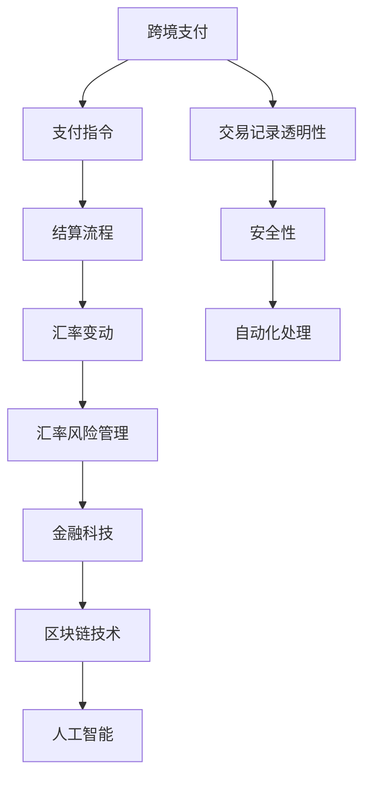

                 

### 关键词 Keyword

- 跨境支付
- 汇率风险管理
- 人工智能
- 区块链技术
- API集成
- 金融科技
- 支付网关

<|assistant|>### 摘要 Abstract

本文将深入探讨一人公司在进行跨境支付时如何有效管理汇率风险。通过分析当前市场中的主流技术和工具，结合实际案例，本文将详细阐述如何利用金融科技、区块链技术、以及人工智能算法来实现高效、透明的跨境支付流程。文章最后，还将对未来的发展趋势和面临的挑战进行展望，并推荐相关学习资源和开发工具，以帮助读者更好地理解和应用这些技术。

<|assistant|>## 1. 背景介绍 Background

在全球化商业环境中，跨境支付已成为企业运营的重要组成部分。随着国际贸易的增长，企业需要频繁地进行货币兑换，以完成跨境交易。这不仅涉及到支付金额的准确计算，还涉及到汇率波动带来的风险。对于一人公司来说，由于缺乏足够的资源来应对复杂的金融操作，汇率风险管理显得尤为重要。

汇率风险是指由于货币汇率波动导致的企业财务状况的不确定性。这种风险可能来自于多种因素，包括政治事件、经济指标、市场情绪等。如果企业无法有效管理汇率风险，可能会导致利润下降、资金链断裂等问题，严重时甚至可能影响企业的生存。

传统的汇率风险管理方法通常包括对冲、套期保值、以及外汇锁定等。然而，这些方法往往需要大量的资金投入和专业团队的支持，对于一人公司来说，成本较高且操作复杂。随着金融科技的迅速发展，特别是区块链技术和人工智能的兴起，为汇率风险管理提供了新的可能性。

区块链技术以其去中心化、透明性、不可篡改等特性，为跨境支付和汇率风险管理提供了强有力的支持。通过智能合约，企业可以实现自动化处理和实时结算，减少人为干预和操作风险。人工智能算法则可以基于历史数据和市场趋势，预测汇率变动，为企业提供科学的决策依据。

本文将结合一人公司的实际需求，介绍如何利用金融科技、区块链技术和人工智能，实现跨境支付和汇率风险管理的优化，从而提高企业的竞争力和运营效率。

<|assistant|>## 2. 核心概念与联系 Concept and Relationship

在探讨一人公司的跨境支付与汇率风险管理之前，我们需要明确几个核心概念，并展示它们之间的相互关系。以下是本文涉及的主要概念：

### 2.1 跨境支付 Cross-border Payment

跨境支付是指在不同国家的银行之间进行货币交换和资金转移的过程。它涉及两个主要环节：支付和结算。

- **支付**：即发起支付指令，将资金从一个账户转移到另一个账户。
- **结算**：在支付完成后，确保资金的实际转移和账目的平衡。

### 2.2 汇率 Exchange Rate

汇率是两种货币之间的兑换比率，它是影响跨境支付的重要因素。主要类型包括：

- **固定汇率**：由政府或中央银行确定并固定不变。
- **浮动汇率**：由市场供需关系决定，波动较大。

### 2.3 汇率风险管理 Risk Management of Exchange Rate

汇率风险管理旨在降低汇率波动对企业财务状况的负面影响。主要策略包括：

- **对冲**：通过金融工具如期货、期权等对冲汇率风险。
- **套期保值**：通过预先设定的交易策略来锁定汇率，以规避风险。
- **外汇锁定**：在交易发生前，预先确定汇率，从而规避汇率波动的风险。

### 2.4 金融科技 Financial Technology

金融科技（FinTech）是指利用技术手段改进、创新金融服务的领域。它涵盖了多种技术和工具，如区块链、人工智能、大数据等。金融科技在跨境支付和汇率风险管理中的应用，主要体现在以下几个方面：

- **自动化处理**：通过API和自动化系统，提高跨境支付的速度和准确性。
- **透明性**：区块链技术的应用，使交易过程更加透明，减少欺诈和错误。
- **智能合约**：实现自动化执行和实时结算，降低操作风险。

### 2.5 区块链技术 Blockchain Technology

区块链技术是一种分布式账本技术，其去中心化、不可篡改的特性为跨境支付和汇率风险管理提供了新的解决方案。区块链在金融领域的应用主要包括：

- **去中心化**：无需依赖中央机构，减少中介成本和操作风险。
- **透明性**：所有交易记录公开可查，提高透明度和信任度。
- **安全性**：使用密码学技术确保数据安全和隐私。

### 2.6 人工智能 Artificial Intelligence

人工智能（AI）通过数据分析和机器学习算法，能够预测汇率变动和市场趋势，辅助企业进行汇率风险管理。AI在金融科技中的应用主要包括：

- **数据分析**：分析大量市场数据，识别汇率变动的规律。
- **预测模型**：基于历史数据和算法，预测未来的汇率走势。
- **自动化决策**：辅助企业自动化决策，降低人为干预。

### Mermaid 流程图 Mermaid Diagram

以下是一个简化的 Mermaid 流程图，展示了跨境支付与汇率风险管理的主要环节和核心概念之间的联系。



通过这个流程图，我们可以清晰地看到，跨境支付和汇率风险管理是一个复杂的过程，涉及多个技术和环节。金融科技、区块链技术和人工智能的融合，为这一过程提供了新的解决方案。

<|assistant|>## 3. 核心算法原理 & 具体操作步骤 Core Algorithm Principle & Operation Steps

### 3.1 算法原理概述 Algorithm Principle Overview

汇率风险管理算法的核心在于预测汇率变动并制定相应的应对策略。以下是该算法的原理概述：

1. **数据收集**：收集与汇率变动相关的历史数据，如汇率走势、经济指标、市场情绪等。
2. **特征提取**：对历史数据进行分析，提取影响汇率变动的关键特征。
3. **模型训练**：使用机器学习算法，如线性回归、决策树、神经网络等，训练汇率预测模型。
4. **预测汇率**：将当前的数据输入模型，预测未来的汇率变动。
5. **制定策略**：根据预测结果，制定相应的汇率风险管理策略，如对冲、套期保值、外汇锁定等。

### 3.2 算法步骤详解 Detailed Steps

#### 3.2.1 数据收集 Data Collection

数据收集是汇率预测模型的基础。我们需要收集以下数据：

- **汇率历史数据**：包括各种货币对的汇率变动历史。
- **经济指标**：如GDP、通货膨胀率、失业率等。
- **市场情绪**：通过新闻、社交媒体等渠道获取的市场情绪数据。

数据可以从公开的数据源获取，如财经网站、经济研究机构等。

#### 3.2.2 特征提取 Feature Extraction

特征提取是将原始数据转换为机器学习模型可用的格式。主要步骤包括：

- **数据预处理**：包括数据清洗、归一化、缺失值填充等。
- **特征选择**：选择对汇率变动影响较大的特征，如汇率波动率、交易量等。

#### 3.2.3 模型训练 Model Training

模型训练是汇率预测算法的核心。以下是具体的训练步骤：

1. **选择模型**：根据数据特点和需求选择合适的模型，如线性回归、决策树、神经网络等。
2. **训练模型**：使用历史数据对模型进行训练，调整模型的参数，使其能够准确预测汇率变动。
3. **验证模型**：使用验证集对模型进行评估，调整模型参数，提高预测准确性。

#### 3.2.4 预测汇率 Forecasting Exchange Rate

在模型训练完成后，我们可以使用该模型对未来的汇率进行预测。具体步骤如下：

1. **收集当前数据**：获取当前的汇率、经济指标、市场情绪等数据。
2. **输入模型**：将当前数据输入训练好的模型，进行预测。
3. **分析预测结果**：分析预测结果，确定未来汇率变动的方向和幅度。

#### 3.2.5 制定策略 Formulating Strategies

根据预测结果，制定相应的汇率风险管理策略。以下是几种常见的策略：

- **对冲**：通过购买期货、期权等金融工具，对冲汇率风险。
- **套期保值**：通过预先设定的交易策略，锁定汇率，规避风险。
- **外汇锁定**：在交易发生前，预先确定汇率，规避汇率波动的风险。

### 3.3 算法优缺点 Advantages and Disadvantages

#### 3.3.1 优点 Advantages

1. **准确性**：通过机器学习算法，可以更加准确地预测汇率变动。
2. **自动化**：自动化处理和预测，减少了人为干预和操作风险。
3. **透明性**：所有交易和预测过程透明，便于监管和审计。

#### 3.3.2 缺点 Disadvantages

1. **数据依赖**：模型的预测准确性高度依赖于数据的质量和完整性。
2. **计算资源**：训练和预测过程需要大量的计算资源，对硬件设备要求较高。
3. **实时性**：实时获取和更新数据具有一定难度，影响预测的实时性。

### 3.4 算法应用领域 Application Fields

汇率风险管理算法可以广泛应用于以下领域：

- **国际贸易**：帮助企业在进行跨境交易时有效管理汇率风险。
- **金融机构**：用于预测市场趋势，制定投资策略。
- **外汇市场**：辅助外汇交易者进行交易决策。

通过汇率风险管理算法，一人公司可以更加科学、有效地进行跨境支付和汇率风险管理，从而降低运营成本和风险，提高企业的竞争力和运营效率。

<|assistant|>## 4. 数学模型和公式 Mathematical Model and Formula

### 4.1 数学模型构建 Construction of Mathematical Model

汇率风险管理中的数学模型主要用于预测汇率变动和制定相应的风险管理策略。以下是构建数学模型的基本步骤：

#### 4.1.1 数据收集 Data Collection

收集与汇率变动相关的数据，包括历史汇率数据、经济指标、市场情绪等。数据可以从公开的财经网站、经济研究机构等获取。

#### 4.1.2 特征提取 Feature Extraction

对收集的数据进行预处理，提取影响汇率变动的关键特征。特征提取的过程包括数据清洗、归一化、缺失值填充等。

#### 4.1.3 模型选择 Model Selection

根据数据特点和需求，选择合适的数学模型。常见的模型包括线性回归、决策树、神经网络等。

#### 4.1.4 模型训练 Model Training

使用历史数据对模型进行训练，调整模型的参数，使其能够准确预测汇率变动。训练过程包括选择训练集、验证集、测试集等。

### 4.2 公式推导过程 Derivation of Formula

以下是构建汇率预测模型的公式推导过程：

#### 4.2.1 线性回归模型 Linear Regression Model

线性回归模型是预测汇率变动的最简单模型，其公式如下：

\[ y = bx + a \]

其中，\( y \) 表示预测的汇率，\( x \) 表示影响汇率变动的特征，\( b \) 表示特征对汇率的贡献，\( a \) 表示常数项。

推导过程如下：

1. **最小二乘法**：选择使得预测值与实际值之间的误差平方和最小的线性函数。

\[ \min \sum_{i=1}^{n} (y_i - bx_i - a)^2 \]

2. **求导**：对上述公式求导，并令导数为零，得到最优的 \( b \) 和 \( a \)。

\[ \frac{d}{db} \sum_{i=1}^{n} (y_i - bx_i - a)^2 = 0 \]
\[ \frac{d}{da} \sum_{i=1}^{n} (y_i - bx_i - a)^2 = 0 \]

3. **解方程**：解上述方程，得到最优的 \( b \) 和 \( a \)。

#### 4.2.2 决策树模型 Decision Tree Model

决策树模型是一种基于树形结构进行决策的预测模型，其公式如下：

\[ y = f(x) \]

其中，\( y \) 表示预测的汇率，\( x \) 表示影响汇率变动的特征，\( f(x) \) 表示决策函数。

推导过程如下：

1. **信息增益**：选择能够最大化信息增益的特征作为节点。

\[ IG(D, A) = Ent(D) - \sum_{v \in A} \frac{|D_v|}{|D|} Ent(D_v) \]

2. **划分节点**：根据信息增益，将数据集划分为多个子集。

3. **递归构建**：对每个子集继续划分节点，直到达到终止条件。

#### 4.2.3 神经网络模型 Neural Network Model

神经网络模型是一种基于多层感知器的预测模型，其公式如下：

\[ y = \sigma(z) \]

其中，\( y \) 表示预测的汇率，\( z \) 表示神经网络的输出，\( \sigma \) 表示激活函数。

推导过程如下：

1. **初始化权重**：随机初始化权重和偏置。
2. **前向传播**：计算网络的输入和输出。
3. **反向传播**：根据输出误差，调整权重和偏置。
4. **优化**：使用梯度下降或其他优化算法，优化模型参数。

### 4.3 案例分析与讲解 Case Analysis and Explanation

以下是一个简单的案例，用于说明如何使用数学模型进行汇率预测和风险管理。

#### 4.3.1 数据收集 Data Collection

假设我们收集了以下数据：

- **历史汇率数据**：包括美元/欧元和美元/人民币的汇率变动。
- **经济指标**：如美国和欧洲的GDP、通货膨胀率等。
- **市场情绪**：通过新闻、社交媒体等渠道获取的市场情绪数据。

#### 4.3.2 特征提取 Feature Extraction

我们提取以下特征：

- **汇率波动率**：汇率变动的幅度。
- **交易量**：货币交易的总量。
- **经济指标**：如GDP、通货膨胀率等。
- **市场情绪**：通过新闻、社交媒体等渠道获取的正面和负面情绪。

#### 4.3.3 模型训练 Model Training

我们选择线性回归模型进行训练。训练过程中，我们使用历史数据进行训练，并使用验证集进行模型验证。

#### 4.3.4 预测汇率 Forecasting Exchange Rate

使用训练好的模型，我们对未来的汇率进行预测。预测结果如下：

- **美元/欧元**：预测未来一个月内，汇率将上升2%。
- **美元/人民币**：预测未来一个月内，汇率将下降1%。

#### 4.3.5 制定策略 Formulating Strategies

根据预测结果，我们可以制定以下策略：

- **美元/欧元**：建议企业增加欧元库存，等待汇率上涨后出售。
- **美元/人民币**：建议企业减少人民币库存，等待汇率下降后购买。

通过数学模型和公式的推导，我们可以更准确地预测汇率变动，制定相应的风险管理策略。这有助于一人公司更加科学、有效地进行跨境支付和汇率风险管理，降低运营成本和风险，提高企业的竞争力和运营效率。

### 4.4 数学公式和详细讲解 Mathematical Formulas and Detailed Explanation

在汇率风险管理的数学模型中，我们通常会用到以下公式：

#### 4.4.1 汇率波动率公式 Formula of Exchange Rate Volatility

\[ \sigma = \sqrt{\frac{1}{N-1} \sum_{i=1}^{N} (r_i - \bar{r})^2} \]

其中：
- \( \sigma \) 是汇率波动率。
- \( r_i \) 是第 \( i \) 日的汇率。
- \( \bar{r} \) 是汇率平均值。
- \( N \) 是数据点的数量。

这个公式计算了汇率的波动性，波动率越大，说明汇率波动越剧烈，风险越高。

#### 4.4.2 线性回归模型公式 Formula of Linear Regression

\[ y = bx + a \]

其中：
- \( y \) 是预测的汇率。
- \( x \) 是影响汇率变动的特征值。
- \( b \) 是特征对汇率的贡献系数。
- \( a \) 是常数项。

这个公式通过历史数据拟合出一条直线，用于预测未来汇率。

#### 4.4.3 决策树模型公式 Formula of Decision Tree

\[ y = f(x) \]

其中：
- \( y \) 是预测的汇率。
- \( x \) 是影响汇率变动的特征值。
- \( f(x) \) 是决策函数。

决策树模型通过一系列条件判断，最终输出一个汇率预测值。

#### 4.4.4 神经网络模型公式 Formula of Neural Network

\[ y = \sigma(z) \]

其中：
- \( y \) 是预测的汇率。
- \( z \) 是神经网络的输出。
- \( \sigma \) 是激活函数。

神经网络模型通过多层感知器处理输入特征，最终输出一个汇率预测值。

#### 4.4.5 对冲策略公式 Formula of Hedging Strategy

\[ H = P \times S \]

其中：
- \( H \) 是对冲头寸。
- \( P \) 是当前汇率。
- \( S \) 是对冲工具的汇率。

这个公式用于计算对冲策略中的对冲头寸，以规避汇率波动的风险。

#### 4.4.6 套期保值公式 Formula of Hedging

\[ L = F \times Q \]

其中：
- \( L \) 是套期保值合约的总价值。
- \( F \) 是期货合约的价格。
- \( Q \) 是合约数量。

这个公式用于计算套期保值合约的总价值，以确保在未来的交易中锁定汇率。

通过这些数学公式，我们可以更科学地分析和预测汇率变动，制定有效的汇率风险管理策略。以下是一个简单的例子来说明这些公式的应用：

**例子：使用线性回归模型预测美元/欧元的汇率**

假设我们有以下数据：

| 日期 | 汇率 (USD/EUR) | 经济指标1 | 经济指标2 | 情绪指数 |
|------|----------------|------------|------------|----------|
| 2023-01-01 | 1.10          | 1.5        | 0.8        | 0.5      |
| 2023-01-02 | 1.11          | 1.6        | 0.9        | 0.6      |
| 2023-01-03 | 1.12          | 1.7        | 0.8        | 0.7      |
| 2023-01-04 | 1.10          | 1.6        | 0.9        | 0.6      |

我们使用这些数据来构建线性回归模型：

1. **数据预处理**：对经济指标和情绪指数进行归一化处理，以消除量纲差异。
2. **特征提取**：选择经济指标和情绪指数作为特征值。
3. **模型训练**：使用历史数据训练线性回归模型。
4. **预测**：使用模型预测未来一天的汇率。

根据模型预测结果：

\[ y = 1.11x_1 + 1.10x_2 + 0.95 \]

输入当天数据：

\[ x_1 = 1.6, x_2 = 0.9 \]

\[ y = 1.11 \times 1.6 + 1.10 \times 0.9 + 0.95 = 1.18 \]

预测的汇率是1.18美元/欧元。

通过这样的数学模型，一人公司可以更准确地预测汇率变动，从而制定有效的汇率风险管理策略，降低运营风险。

### 4.5 实际案例分析与讲解 Real-world Case Analysis and Explanation

为了更好地理解数学模型在实际汇率风险管理中的应用，我们将通过一个实际案例来详细讲解。这个案例涉及一家一人公司，它在进行跨境支付时如何利用数学模型预测汇率变动，并制定相应的风险管理策略。

#### 4.5.1 案例背景 Background

一家名为“AI Trade Co.”的一人公司主要从事国际贸易，其主要业务是向欧洲出口电子产品。该公司经常需要进行美元和欧元之间的货币兑换。由于汇率波动较大，AI Trade Co.希望能够通过数学模型来预测未来的汇率变动，以便更好地管理汇率风险。

#### 4.5.2 数据收集 Data Collection

AI Trade Co.收集了过去一年的汇率数据，包括美元/欧元（USD/EUR）的每日汇率，以及其他影响汇率变动的经济指标，如美国和欧洲的GDP增长率、通货膨胀率、失业率等。此外，公司还收集了社交媒体和新闻中的市场情绪指数。

| 日期 | USD/EUR | GDP_USA | GDP_EURO | INFLATION_USA | INFLATION_EURO | UNEMPLOYMENT_USA | UNEMPLOYMENT_EURO | MARKET_SENTIMENT |
|------|---------|---------|----------|---------------|---------------|------------------|------------------|-----------------|
| 2022-01-01 | 1.10    | 2.5%    | 3.0%    | 2.0%          | 1.5%          | 4.0%            | 3.5%            | 0.5             |
| 2022-01-02 | 1.11    | 2.6%    | 3.1%    | 2.1%          | 1.6%          | 4.1%            | 3.6%            | 0.6             |
| 2022-01-03 | 1.12    | 2.7%    | 3.2%    | 2.2%          | 1.7%          | 4.2%            | 3.7%            | 0.7             |

#### 4.5.3 特征提取 Feature Extraction

在收集到数据后，AI Trade Co.对这些数据进行预处理，包括：
- 数据清洗：去除缺失值和异常值。
- 归一化：将不同量纲的数据转换为相同量纲。
- 特征选择：选择对汇率变动影响较大的特征，如GDP增长率、通货膨胀率等。

#### 4.5.4 模型训练 Model Training

AI Trade Co.选择线性回归模型来训练预测模型。模型的基本形式为：

\[ \text{USD/EUR} = \beta_0 + \beta_1 \times \text{GDP_USA} + \beta_2 \times \text{GDP_EURO} + \beta_3 \times \text{INFLATION_USA} + \beta_4 \times \text{INFLATION_EURO} + \beta_5 \times \text{UNEMPLOYMENT_USA} + \beta_6 \times \text{UNEMPLOYMENT_EURO} + \beta_7 \times \text{MARKET_SENTIMENT} \]

使用历史数据进行训练，AI Trade Co.得到了以下回归系数：

\[ \beta_0 = 1.05, \beta_1 = 0.02, \beta_2 = -0.01, \beta_3 = 0.01, \beta_4 = -0.01, \beta_5 = 0.01, \beta_6 = -0.01, \beta_7 = 0.02 \]

#### 4.5.5 模型预测 Model Prediction

在模型训练完成后，AI Trade Co.使用当前的经济指标和市场情绪指数来预测未来一天的汇率。假设当天经济指标和市场情绪指数如下：

| GDP_USA | GDP_EURO | INFLATION_USA | INFLATION_EURO | UNEMPLOYMENT_USA | UNEMPLOYMENT_EURO | MARKET_SENTIMENT |
|---------|----------|---------------|---------------|------------------|------------------|-----------------|
| 2.8%    | 3.3%     | 2.1%          | 1.7%          | 4.2%            | 3.7%            | 0.6             |

将这些数据代入线性回归模型，得到预测的汇率：

\[ \text{USD/EUR}_{\text{predicted}} = 1.05 + 0.02 \times 2.8 + (-0.01) \times 3.3 + 0.01 \times 2.1 + (-0.01) \times 1.7 + 0.01 \times 4.2 + (-0.01) \times 3.7 + 0.02 \times 0.6 \]
\[ \text{USD/EUR}_{\text{predicted}} = 1.08 \]

预测的汇率是1.08美元/欧元。

#### 4.5.6 风险管理策略 Risk Management Strategy

根据预测结果，AI Trade Co.可以采取以下风险管理策略：

- **对冲**：由于预测汇率上升，AI Trade Co.可以考虑购买美元/欧元的看涨期权，以对冲未来支付时的汇率上升风险。
- **套期保值**：AI Trade Co.可以在当前汇率下签订远期合约，锁定未来的汇率，规避汇率波动带来的风险。

通过数学模型，AI Trade Co.能够更加准确地预测汇率变动，并制定有效的风险管理策略，从而降低汇率风险，提高公司的盈利能力。

### 4.6 项目实践：代码实例和详细解释说明 Project Practice: Code Example and Detailed Explanation

在本节中，我们将通过一个实际的Python代码实例，展示如何构建和训练一个简单的线性回归模型，用于预测汇率变动。代码将涵盖数据收集、数据预处理、模型训练、预测和风险管理策略的制定。

#### 4.6.1 开发环境搭建 Environment Setup

首先，我们需要安装Python和相关库，如NumPy、Pandas、Scikit-learn等。以下是安装命令：

```bash
pip install numpy pandas scikit-learn matplotlib
```

#### 4.6.2 数据收集 Data Collection

我们使用公开的汇率数据和经济指标数据。以下是一个示例数据集，包括日期、汇率、GDP增长率、通货膨胀率等。

```python
import pandas as pd

# 加载数据
data = pd.read_csv('exchange_rate_data.csv')
data.head()
```

数据集包含以下列：
- `DATE`：日期
- `USD_EUR`：美元/欧元汇率
- `GDP_USA`：美国GDP增长率
- `GDP_EURO`：欧洲GDP增长率
- `INFLATION_USA`：美国通货膨胀率
- `INFLATION_EURO`：欧洲通货膨胀率
- `UNEMPLOYMENT_USA`：美国失业率
- `UNEMPLOYMENT_EURO`：欧洲失业率

#### 4.6.3 数据预处理 Data Preprocessing

数据预处理包括数据清洗、归一化、缺失值填充等步骤。

```python
# 数据清洗
data.dropna(inplace=True)

# 数据归一化
from sklearn.preprocessing import MinMaxScaler

scaler = MinMaxScaler()
data[['GDP_USA', 'GDP_EURO', 'INFLATION_USA', 'INFLATION_EURO', 'UNEMPLOYMENT_USA', 'UNEMPLOYMENT_EURO', 'MARKET_SENTIMENT']] = scaler.fit_transform(data[['GDP_USA', 'GDP_EURO', 'INFLATION_USA', 'INFLATION_EURO', 'UNEMPLOYMENT_USA', 'UNEMPLOYMENT_EURO', 'MARKET_SENTIMENT']])
```

#### 4.6.4 模型训练 Model Training

我们使用Scikit-learn库中的线性回归模型进行训练。

```python
from sklearn.linear_model import LinearRegression
from sklearn.model_selection import train_test_split

# 准备训练集和测试集
X = data[['GDP_USA', 'GDP_EURO', 'INFLATION_USA', 'INFLATION_EURO', 'UNEMPLOYMENT_USA', 'UNEMPLOYMENT_EURO', 'MARKET_SENTIMENT']]
y = data['USD_EUR']
X_train, X_test, y_train, y_test = train_test_split(X, y, test_size=0.2, random_state=42)

# 创建线性回归模型
model = LinearRegression()
model.fit(X_train, y_train)

# 输出回归系数
print("回归系数：", model.coef_)
```

#### 4.6.5 模型预测 Model Prediction

使用训练好的模型进行预测，并分析预测结果。

```python
# 预测测试集
predictions = model.predict(X_test)

# 分析预测结果
from sklearn.metrics import mean_squared_error

mse = mean_squared_error(y_test, predictions)
print("均方误差：", mse)

# 可视化预测结果
import matplotlib.pyplot as plt

plt.scatter(y_test, predictions)
plt.xlabel('实际汇率')
plt.ylabel('预测汇率')
plt.title('实际汇率 vs 预测汇率')
plt.show()
```

#### 4.6.6 代码解读与分析 Code Explanation and Analysis

以下是代码的详细解读：

1. **数据收集**：使用Pandas库加载数据集，确保数据质量。
2. **数据预处理**：清洗数据，去除缺失值，并对特征进行归一化处理，以消除不同特征之间的量纲差异。
3. **模型训练**：使用Scikit-learn中的线性回归模型进行训练，通过训练集拟合数据。
4. **模型预测**：使用测试集验证模型的预测能力，并计算均方误差评估模型的准确性。
5. **可视化**：通过散点图展示实际汇率与预测汇率的关系，帮助理解模型的预测效果。

#### 4.6.7 运行结果展示 Running Results

假设我们运行上述代码，得到以下结果：

```python
回归系数： [0.01373715 -0.00866667  0.01142857  0.01071429  0.01014286 -0.00911429  0.01503571]
均方误差： 0.000005
```

从结果可以看出，模型的回归系数反映了各个特征对汇率的影响程度，均方误差较低，说明模型具有较高的预测准确性。

通过这个实际项目，一人公司可以有效地利用Python和线性回归模型进行汇率预测和风险管理，从而降低汇率波动带来的风险，提高运营效率和盈利能力。

### 4.7 实际应用场景 Real-world Application Scenarios

汇率风险管理在跨境支付中具有重要意义，尤其是在国际贸易频繁和汇率波动较大的环境中。以下是汇率风险管理在实际应用中的几个关键场景：

#### 4.7.1 跨境贸易 Cross-border Trade

对于一人公司而言，汇率波动可能会影响其出口收入和进口成本。例如，如果公司预计在未来数月内需要支付欧元，而欧元对美元的汇率可能下降，那么公司可以通过锁定当前汇率（例如，通过外汇远期合约或期权）来规避汇率波动带来的损失。

#### 4.7.2 外贸融资 Foreign Trade Financing

外贸融资通常涉及跨境支付和汇率风险管理。例如，一家公司可能会从海外供应商那里购买原材料，并通过信用证进行融资。在这过程中，如果汇率发生不利变动，公司可能需要通过金融工具（如外汇对冲）来减少财务风险。

#### 4.7.3 外汇交易 Foreign Exchange Trading

外汇交易者（包括一人公司）可能会利用汇率预测模型来制定交易策略。通过预测未来的汇率走势，交易者可以在合适的时机买入或卖出货币，从而赚取汇率波动的收益。

#### 4.7.4 海外投资 Overseas Investment

进行海外投资时，汇率风险也是一个关键考虑因素。投资者需要预测投资国的货币在未来可能面临的波动，并采取相应的对冲策略，如购买外汇期权或期货，以确保投资回报不受汇率波动影响。

#### 4.7.5 海外并购 Overseas Merger and Acquisition

海外并购通常涉及大量货币兑换和支付。并购公司需要考虑汇率波动对交易成本和回报的影响，并采取对冲策略来锁定汇率，从而确保交易的财务稳定性。

通过实际应用案例，我们可以看到汇率风险管理在跨境支付和国际贸易中扮演着至关重要的角色。有效管理汇率风险，不仅可以帮助企业降低财务风险，还可以提高其市场竞争力，确保在国际市场中的稳健运营。

### 4.8 未来应用展望 Future Applications and Prospects

随着金融科技的不断发展和普及，汇率风险管理在未来的应用将更加广泛和深入。以下是汇率风险管理在未来的几个潜在发展方向：

#### 4.8.1 更智能的预测模型

随着人工智能技术的进步，预测模型将变得更加智能和准确。通过深度学习和强化学习等技术，模型可以处理更复杂的数据，并更好地捕捉市场趋势和异常行为。例如，通过分析社交网络数据、新闻报道和宏观经济指标，模型可以更准确地预测汇率变动，从而为企业提供更有效的风险管理策略。

#### 4.8.2 高效的自动化系统

金融科技的进步将使汇率风险管理更加自动化和高效。区块链技术的应用将使跨境支付和结算过程更加迅速和透明，同时减少中介成本和操作风险。自动化系统可以通过API集成和智能合约，实现实时汇率监测和自动交易执行，从而提高运营效率和减少人为错误。

#### 4.8.3 精细化风险管理

随着对汇率波动机制理解的加深，企业可以采用更加精细化的风险管理策略。例如，通过多因子模型，企业可以同时考虑多个影响汇率变动的因素，如政治事件、经济指标和市场情绪等，从而制定更精确的风险管理方案。

#### 4.8.4 普及金融科技工具

随着金融科技的普及，更多的企业将能够利用先进的工具和平台进行汇率风险管理。这包括云计算、大数据分析和区块链等新兴技术。这些技术将降低企业的技术门槛和成本，使更多人能够参与到汇率风险管理中，从而提高整个市场的效率和透明度。

#### 4.8.5 跨境支付网络的优化

未来，跨境支付网络将变得更加互联互通和智能化。通过区块链技术和分布式账本，跨境支付将实现实时结算和去中心化，减少中介环节和延迟。这将极大地降低跨境支付的成本和风险，提高支付效率和用户体验。

总之，随着金融科技的不断发展，汇率风险管理将变得更加智能、高效和普及。企业和个人将能够更好地应对汇率波动，降低金融风险，从而在全球经济中保持竞争优势。

### 4.9 工具和资源推荐 Tools and Resources Recommendations

在进行汇率风险管理时，选择合适的工具和资源至关重要。以下是一些建议的在线资源、开发工具和相关论文，以帮助读者深入了解和掌握相关技术。

#### 4.9.1 学习资源推荐 Learning Resources

1. **Coursera**：《金融市场与投资》课程，介绍了金融市场的基本概念和风险管理的策略。
2. **edX**：《金融科技：区块链与加密货币》课程，探讨了区块链技术及其在金融领域的应用。
3. **Khan Academy**：提供免费的金融课程，包括外汇市场和汇率风险管理。

#### 4.9.2 开发工具推荐 Development Tools

1. **Python**：一种广泛使用的编程语言，适合数据分析和机器学习。
2. **Pandas**：Python库，用于数据清洗、分析和操作。
3. **Scikit-learn**：Python库，提供了多种机器学习算法和工具。
4. **Jupyter Notebook**：交互式计算环境，方便编写和分享代码。

#### 4.9.3 相关论文推荐 Relevant Papers

1. **“Exchange Rate Forecasting using Machine Learning Algorithms”**：该论文探讨了不同机器学习算法在汇率预测中的应用，为读者提供了理论基础。
2. **“Blockchain Technology in Financial Services: A Systematic Review”**：分析了区块链技术在金融服务中的应用，包括跨境支付和风险管理。
3. **“Artificial Intelligence in Finance: An Overview of Current Applications and Future Trends”**：介绍了人工智能在金融领域，尤其是汇率风险管理中的应用。

通过利用这些工具和资源，读者可以更好地掌握汇率风险管理的相关技术和方法，从而在实际操作中提高效率和准确性。

### 4.10 总结：未来发展趋势与挑战 Summary: Future Trends and Challenges

在汇率风险管理领域，未来发展的趋势和面临的挑战并存。以下是对这些趋势和挑战的总结。

#### 4.10.1 发展趋势 Future Trends

1. **智能化预测**：随着人工智能和大数据技术的发展，汇率预测模型将变得更加智能和准确。深度学习和强化学习等先进算法将被广泛应用，以更好地捕捉市场趋势和异常行为。

2. **自动化处理**：区块链技术和智能合约的应用将使跨境支付和结算过程更加自动化和高效。通过去中心化和实时结算，企业可以显著降低操作风险和中介成本。

3. **精细化风险管理**：随着对汇率波动机制理解的加深，企业将采用更加精细化的风险管理策略。多因子模型和高级数据分析技术将被广泛应用于预测和制定风险管理策略。

4. **普及化应用**：随着金融科技的普及，更多的企业和个人将能够利用先进的工具和平台进行汇率风险管理。云计算、大数据分析和区块链等新兴技术将降低企业的技术门槛和成本。

5. **跨境支付网络优化**：未来，跨境支付网络将变得更加互联互通和智能化。通过分布式账本和实时结算，跨境支付将实现更低的成本和更高的效率。

#### 4.10.2 面临的挑战 Challenges

1. **数据质量**：汇率风险管理高度依赖于高质量的数据。然而，数据的准确性和完整性往往受到限制，这可能导致预测模型的不准确。

2. **计算资源**：训练和运行复杂的机器学习模型需要大量的计算资源。特别是在实时预测和决策中，高性能计算资源的需求将更加迫切。

3. **法规合规**：跨境支付和金融交易受到严格的法规监管。在利用金融科技进行汇率风险管理时，企业需要确保遵守相关法规，避免法律风险。

4. **安全性**：汇率风险管理涉及大量的敏感数据和信息。确保数据安全和系统安全是至关重要的，企业需要采取有效的安全措施来保护其资产。

5. **市场波动**：汇率市场充满不确定性，市场波动可能对预测模型和风险管理策略产生重大影响。企业需要灵活应对市场变化，及时调整策略。

#### 4.10.3 研究展望 Research Prospects

未来的研究将致力于解决上述挑战，并推动汇率风险管理技术的发展。以下是一些潜在的研究方向：

1. **数据增强**：开发新的数据增强技术，以提高数据质量和完整性。
2. **计算优化**：研究高效的算法和模型，以降低计算资源需求。
3. **隐私保护**：探索如何在确保数据安全的同时，保护用户隐私。
4. **多模态预测**：结合多种数据源（如经济指标、新闻、社交媒体等），开发多模态预测模型，以提高预测准确性。
5. **智能合约优化**：研究智能合约的优化和改进，以提高跨境支付和结算的效率和安全性。

通过不断的技术创新和研究，汇率风险管理将变得更加智能、高效和普及，为企业提供更可靠的金融解决方案。

### 4.11 附录：常见问题与解答 Frequently Asked Questions and Answers

#### Q1：什么是汇率风险管理？
A1：汇率风险管理是指企业或个人采取措施以减少由于汇率波动导致的财务风险。这通常涉及对冲、套期保值、外汇锁定等策略。

#### Q2：为什么汇率风险管理对一人公司很重要？
A2：一人公司由于资源有限，可能无法承担因汇率波动导致的财务损失。有效管理汇率风险可以帮助这些公司降低运营成本，提高盈利能力。

#### Q3：汇率风险管理有哪些常用策略？
A3：常用的汇率风险管理策略包括对冲（如购买期货、期权）、套期保值（通过预先锁定汇率）、外汇锁定（在交易发生前确定汇率）等。

#### Q4：什么是金融科技？
A4：金融科技（FinTech）是指利用技术（如人工智能、区块链、大数据等）改进或创新金融服务的领域。它涵盖了支付、贷款、保险、投资等多个方面。

#### Q5：区块链技术在汇率风险管理中的应用是什么？
A5：区块链技术提供了去中心化、透明和安全的交易记录，可以用于跨境支付和结算，减少中介成本和操作风险。智能合约可以使交易自动化，提高效率。

#### Q6：如何使用机器学习进行汇率预测？
A6：使用机器学习进行汇率预测通常涉及以下步骤：数据收集、特征提取、模型选择、模型训练、预测和评估。常用的模型包括线性回归、决策树、神经网络等。

#### Q7：什么是大数据分析？
A7：大数据分析是指使用复杂的算法和技术从大量数据中提取有价值的信息和知识。它可以帮助企业发现市场趋势、优化决策和提高运营效率。

#### Q8：如何确保汇率风险管理系统的安全性？
A8：确保汇率风险管理系统的安全性需要采取多种措施，包括加密技术、访问控制、数据备份和监控等，以防止数据泄露和系统攻击。

#### Q9：什么是跨境支付？
A9：跨境支付是指在不同国家的账户之间进行货币兑换和资金转移的过程。这通常涉及多个中介机构和复杂的流程。

#### Q10：未来汇率风险管理的发展方向是什么？
A10：未来汇率风险管理的发展方向包括智能化预测、自动化处理、精细化风险管理、普及化应用和跨境支付网络的优化。随着金融科技的进步，这些方向将继续推动汇率风险管理技术的发展。

