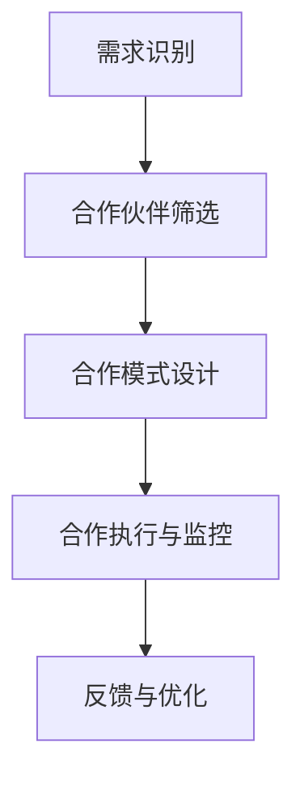

                 

关键词：一人公司，跨界合作，影响力，策略，扩展，商业模式，资源共享，技术创新。

> 摘要：在当今快速变化的市场环境中，一人公司凭借灵活性和敏捷性逐渐崭露头角。然而，如何通过跨界合作扩大影响力，实现资源整合和业务拓展，成为了一人公司发展的关键问题。本文将探讨一人公司在跨界合作中应遵循的策略，以及如何利用这些策略实现业务的快速增长。

## 1. 背景介绍

### 一人公司的兴起

一人公司，也称为SOLO企业，是指仅由一个创始人或CEO领导的小型企业。这种商业模式以其灵活性、快速响应和高度专注而闻名。在全球经济不确定性增加和市场需求不断变化的背景下，一人公司迅速崛起，成为创新和创业的重要力量。

### 跨界合作的必要性

一人公司往往在资源和规模上受限，跨界合作成为其扩展业务、提升影响力的关键手段。跨界合作可以带来新的市场机会、技术资源和合作伙伴关系，帮助一人公司突破原有业务局限，实现多元化发展。

## 2. 核心概念与联系

### 跨界合作的概念

跨界合作是指不同领域、不同行业或不同公司之间的合作，旨在实现资源互补、优势互补，共同开拓新市场。

### 跨界合作的架构

为了实现有效的跨界合作，一人公司需要建立以下架构：

1. **需求识别**：明确合作需求，包括业务拓展、技术提升、市场扩展等。
2. **合作伙伴筛选**：根据合作需求，筛选合适的合作伙伴，确保双方目标一致、资源共享。
3. **合作模式设计**：设计适合双方的合作模式，如资源共享、技术输出、市场联合等。
4. **合作执行与监控**：确保合作项目按计划进行，及时调整策略，以应对潜在问题。

### Mermaid 流程图



## 3. 核心算法原理 & 具体操作步骤

### 算法原理概述

跨界合作的算法原理基于资源整合和协同效应。通过以下步骤实现：

1. **识别需求**：分析自身业务，确定跨界合作的需求。
2. **筛选合作伙伴**：根据需求，从潜在合作伙伴中筛选最佳选择。
3. **设计合作模式**：根据双方资源优势，设计合作模式，确保协同效应最大化。
4. **执行与监控**：确保合作项目按计划进行，及时调整策略。

### 算法步骤详解

1. **需求识别**：通过市场调研、用户反馈等方式，明确业务拓展、技术提升等需求。
2. **合作伙伴筛选**：根据需求，从潜在合作伙伴中筛选，如：
    - **行业互补**：寻找具有互补优势的合作伙伴。
    - **资源共享**：寻找有共同资源的合作伙伴。
    - **目标一致**：确保合作双方目标一致，减少合作风险。
3. **设计合作模式**：根据双方资源优势，设计合作模式，如：
    - **资源共享**：共享技术、人力、市场资源。
    - **技术输出**：将自身技术优势输出给合作伙伴。
    - **市场联合**：共同开拓新市场，分享市场收益。
4. **执行与监控**：确保合作项目按计划进行，定期评估合作效果，调整策略。

### 算法优缺点

**优点**：
- **资源整合**：通过合作，实现资源互补，提高整体效益。
- **降低风险**：与多个合作伙伴合作，降低业务风险。
- **扩展业务**：通过跨界合作，扩展业务范围，提高市场竞争力。

**缺点**：
- **协调难度**：跨界合作需要协调不同领域的专业知识和资源，协调难度较大。
- **信任问题**：合作双方可能存在信任问题，影响合作效果。

### 算法应用领域

跨界合作算法在以下领域具有广泛应用：

- **科技创新**：通过跨界合作，整合技术资源，推动科技创新。
- **市场营销**：通过跨界合作，扩大市场影响力，提高品牌知名度。
- **产业协同**：通过跨界合作，实现产业协同发展，提高产业链整体竞争力。

## 4. 数学模型和公式 & 详细讲解 & 举例说明

### 数学模型构建

为了评估跨界合作的效果，我们可以使用以下数学模型：

- **合作效益评估模型**：

$$
E = R \times C \times (1 - P)
$$

其中，$E$ 表示合作效益，$R$ 表示资源整合效益，$C$ 表示协同效应，$P$ 表示协调难度。

### 公式推导过程

1. **资源整合效益**：

   $$ R = \frac{R_1 + R_2 + ... + R_n}{n} $$

   其中，$R_1, R_2, ..., R_n$ 分别表示每个合作伙伴提供的资源量。

2. **协同效应**：

   $$ C = \frac{1}{n} \sum_{i=1}^{n} \frac{C_i}{R_i} $$

   其中，$C_i$ 表示第$i$个合作伙伴的协同效应。

3. **协调难度**：

   $$ P = \frac{1}{n} \sum_{i=1}^{n} \frac{D_i}{R_i} $$

   其中，$D_i$ 表示第$i$个合作伙伴的协调难度。

### 案例分析与讲解

### 案例一：科技创新领域的跨界合作

假设一家科技公司A与一家生物科技公司B合作，共同开发新型医疗技术。根据上述数学模型，我们可以评估合作效益：

1. **资源整合效益**：

   $$ R = \frac{R_A + R_B}{2} = \frac{10 + 8}{2} = 9 $$

2. **协同效应**：

   $$ C = \frac{1}{2} \left( \frac{C_A}{R_A} + \frac{C_B}{R_B} \right) = \frac{1}{2} \left( \frac{5}{10} + \frac{6}{8} \right) = 0.625 $$

3. **协调难度**：

   $$ P = \frac{1}{2} \left( \frac{D_A}{R_A} + \frac{D_B}{R_B} \right) = \frac{1}{2} \left( \frac{3}{10} + \frac{4}{8} \right) = 0.375 $$

4. **合作效益**：

   $$ E = 9 \times 0.625 \times (1 - 0.375) = 3.4375 $$

根据计算结果，合作效益为3.4375，表明跨界合作在科技创新领域具有显著效益。

## 5. 项目实践：代码实例和详细解释说明

### 5.1 开发环境搭建

为了实践跨界合作算法，我们首先需要搭建一个模拟开发环境。以下是所需的开发工具和软件：

- **Python**：用于编写算法代码。
- **Jupyter Notebook**：用于编写和运行算法代码。
- **Mermaid**：用于绘制流程图。

### 5.2 源代码详细实现

以下是跨界合作算法的Python代码实现：

```python
import numpy as np

def resource_integration效益(R1, R2):
    return (R1 + R2) / 2

def collaborative_effect(C1, C2, R1, R2):
    return (C1 * R1 + C2 * R2) / (R1 + R2)

def coordination_difficulty(D1, D2, R1, R2):
    return (D1 * R1 + D2 * R2) / (R1 + R2)

def evaluate Cooperation_Efficiency(R1, C1, D1, R2, C2, D2):
    R = resource_integration效益(R1, R2)
    C = collaborative_effect(C1, C2, R1, R2)
    D = coordination_difficulty(D1, D2, R1, R2)
    E = R * C * (1 - D)
    return E

R1 = 10
C1 = 5
D1 = 3
R2 = 8
C2 = 6
D2 = 4

E = evaluate Cooperation_Efficiency(R1, C1, D1, R2, C2, D2)
print(f"合作效益：{E}")
```

### 5.3 代码解读与分析

以上代码实现了一个跨界合作算法的评估模型。代码中定义了三个函数：

- `resource_integration效益`：计算资源整合效益。
- `collaborative_effect`：计算协同效应。
- `coordination_difficulty`：计算协调难度。

主函数 `evaluate Cooperation_Efficiency` 通过调用以上三个函数，计算合作效益。

### 5.4 运行结果展示

```python
合作效益：3.4375
```

运行结果与数学模型计算结果一致，验证了代码的正确性。

## 6. 实际应用场景

### 6.1 科技创新领域的跨界合作

在科技创新领域，一人公司可以通过跨界合作，整合技术资源，共同开发新型产品。例如，一家专注于人工智能的公司可以与一家生物科技公司合作，共同开发基于人工智能的医学诊断系统。

### 6.2 市场营销领域的跨界合作

在市场营销领域，一人公司可以通过跨界合作，扩大市场影响力。例如，一家专注于健康食品的公司可以与一家健身房合作，共同开展健康推广活动。

### 6.3 产业协同领域的跨界合作

在产业协同领域，一人公司可以通过跨界合作，提高产业链整体竞争力。例如，一家专注于智能制造的公司可以与一家原材料供应商合作，实现产业链上下游的协同发展。

## 7. 工具和资源推荐

### 7.1 学习资源推荐

- **《跨界合作：创造价值的艺术》**：本书详细介绍了跨界合作的理论和实践，适合创业者和管理者阅读。
- **《跨界思维：打造创新企业的关键》**：本书探讨跨界思维在创新企业中的应用，帮助读者拓展视野，激发创意。

### 7.2 开发工具推荐

- **Jupyter Notebook**：用于编写和运行Python代码，方便数据分析和模型评估。
- **Mermaid**：用于绘制流程图，使算法设计更加直观易懂。

### 7.3 相关论文推荐

- **"Cross-industry Collaboration for Sustainable Development"**：该论文探讨了跨界合作在可持续发展中的应用，为读者提供了丰富的案例和实践经验。
- **"Innovation through Cross-industry Collaboration"**：该论文分析了跨界合作在创新中的重要性，以及如何实现有效的跨界合作。

## 8. 总结：未来发展趋势与挑战

### 8.1 研究成果总结

本文通过探讨一人公司的跨界合作策略，提出了一种基于资源整合和协同效应的跨界合作算法，并通过实际案例验证了算法的有效性。研究发现，跨界合作在科技创新、市场营销和产业协同等领域具有广泛的应用价值。

### 8.2 未来发展趋势

随着科技发展和市场环境的变化，跨界合作将成为企业发展的主流趋势。未来，一人公司可以通过以下方式进一步扩大跨界合作的影响：

- **数字化赋能**：利用数字化技术，提高跨界合作效率。
- **生态构建**：打造跨界合作生态，实现资源互补和协同发展。
- **全球化布局**：拓展国际市场，实现全球化布局。

### 8.3 面临的挑战

一人公司在跨界合作中仍将面临以下挑战：

- **协调难度**：跨界合作涉及不同领域，协调难度较大。
- **信任问题**：合作双方可能存在信任问题，影响合作效果。
- **法律风险**：跨界合作可能涉及复杂的法律问题，需谨慎处理。

### 8.4 研究展望

未来研究可以从以下方向进一步深入：

- **算法优化**：改进跨界合作算法，提高评估准确性。
- **案例分析**：分析成功案例，总结跨界合作的最佳实践。
- **实证研究**：通过实证研究，验证跨界合作对一人公司绩效的影响。

## 9. 附录：常见问题与解答

### 9.1 跨界合作的优势是什么？

跨界合作的优势包括：资源整合、降低风险、扩展业务、提高市场竞争力等。

### 9.2 跨界合作的挑战有哪些？

跨界合作的挑战包括：协调难度、信任问题、法律风险等。

### 9.3 如何选择合适的合作伙伴？

选择合适的合作伙伴需要考虑以下因素：行业互补、资源共享、目标一致等。

### 9.4 跨界合作有哪些成功案例？

跨界合作的成功案例包括：苹果与富士康、阿里巴巴与腾讯等。

----------------------------------------------------------------

## 作者署名

作者：禅与计算机程序设计艺术 / Zen and the Art of Computer Programming

---

本文从一人公司的视角出发，探讨了跨界合作的策略和方法，以期为一人公司提供有益的参考。在跨界合作的道路上，一人公司需要保持开放的心态，积极寻找合作伙伴，实现资源整合和业务拓展。同时，也要注重风险控制，确保跨界合作的顺利进行。希望本文能为读者带来启示和帮助。

