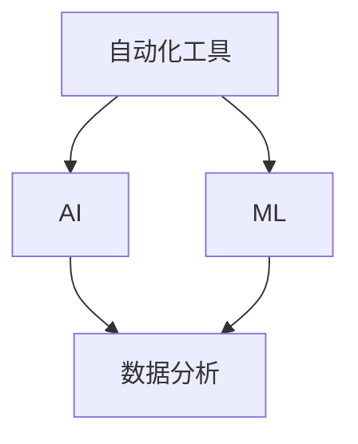
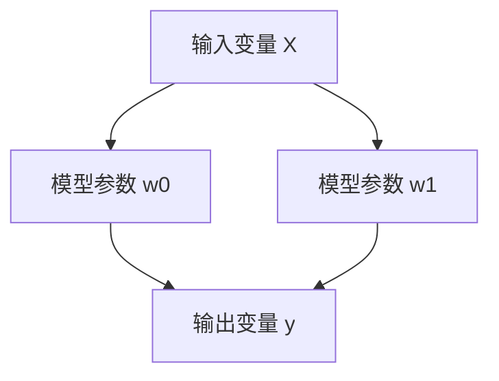

                 

在当今快速发展的商业环境中，无论是大型企业还是小型公司，运营效率的提升都成为企业持续发展的关键。尤其是对于一人公司或小型团队而言，如何高效地管理日常业务、节省时间和成本显得尤为重要。本文将深入探讨自动化工具在提升一人公司运营效率方面的作用，并提供具体的选择和整合策略。

## 关键词
- 一人公司
- 运营效率
- 自动化工具
- 工具选择
- 整合策略

## 摘要
本文将系统地介绍自动化工具在提升一人公司运营效率方面的应用。首先，我们将探讨自动化工具的核心概念和作用，并详细分析其在日常运营中的具体应用场景。接着，我们将讨论如何选择和整合这些工具，以实现最佳效果。最后，通过实际案例和未来展望，我们将为读者提供有价值的参考和建议。

---

## 1. 背景介绍

一人公司，顾名思义，是由一个人独立运营的企业。这种模式在近年来变得越来越流行，尤其是在数字化和远程办公趋势的推动下。虽然这种模式有其独特的优势，如灵活性、快速决策和低成本等，但也面临许多挑战，如时间管理、资源分配和业务增长等。

### 1.1 一人公司的特点

- **灵活性高**：一人公司通常可以迅速响应市场需求，灵活调整战略。
- **成本较低**：无需支付额外的员工薪资和福利，从而降低了运营成本。
- **快速决策**：决策过程简单，无需复杂的沟通和协商。

### 1.2 一人公司面临的挑战

- **时间管理**：如何有效地管理时间，确保各项任务按时完成。
- **资源分配**：如何在有限的资源下，实现业务的最大化。
- **业务增长**：如何保持业务的持续增长，应对市场的变化。

为了应对这些挑战，自动化工具的引入成为一人公司的必然选择。通过自动化工具，一人公司可以显著提升运营效率，节省时间和成本，从而更好地应对市场挑战。

## 2. 核心概念与联系

在探讨自动化工具之前，我们需要了解几个核心概念，包括自动化、人工智能（AI）和机器学习（ML）。

### 2.1 自动化

自动化是指通过使用计算机程序、机器人或机械来替代人工执行重复性、规律性的任务。这些任务包括数据录入、报表生成、日程安排等。自动化工具的核心在于减少人为干预，提高工作效率和准确性。

### 2.2 人工智能

人工智能（AI）是一种模拟人类智能的技术，通过算法和大数据分析来模拟人类的思维和行为。AI 可以用于图像识别、自然语言处理、决策支持等应用。

### 2.3 机器学习

机器学习（ML）是 AI 的一个分支，通过训练模型来自动化决策过程。ML 模型可以从数据中学习，并不断优化其性能。

### 2.4 自动化工具与 AI/ML 的联系

自动化工具可以与 AI 和 ML 相结合，实现更加智能的自动化。例如，AI 可以用于自动化客户服务，而 ML 模型可以用于自动化数据分析。

下面是一个简化的 Mermaid 流程图，展示了自动化、AI 和 ML 之间的联系：



## 3. 核心算法原理 & 具体操作步骤

### 3.1 算法原理概述

自动化工具的核心在于其算法原理。这些算法通常基于规则引擎、决策树、神经网络等。规则引擎是一种简单的算法，通过预定义的规则来执行特定任务。决策树则是一种树形结构，用于分类和回归任务。神经网络是一种复杂的算法，可以用于复杂的模式识别和决策。

### 3.2 算法步骤详解

1. **数据收集**：首先，需要收集相关的数据，如用户行为数据、市场数据等。
2. **数据预处理**：对收集到的数据进行清洗、转换和归一化，以准备用于训练模型。
3. **模型训练**：使用机器学习算法对预处理后的数据进行训练，以生成预测模型。
4. **模型评估**：评估模型的性能，并根据评估结果调整模型参数。
5. **模型部署**：将训练好的模型部署到生产环境中，实现自动化任务。

### 3.3 算法优缺点

**优点**：

- 提高工作效率：自动化工具可以替代重复性任务，节省时间和人力。
- 提高准确性：自动化工具可以减少人为错误，提高数据处理的准确性。
- 可扩展性：自动化工具可以轻松扩展到更多的任务和场景。

**缺点**：

- 初始成本高：引入自动化工具需要一定的初始投资，包括购买软件、硬件和培训。
- 需要维护：自动化工具需要定期维护和更新，以确保其正常运行。

### 3.4 算法应用领域

自动化工具的应用领域非常广泛，包括但不限于以下方面：

- **客户服务**：使用 AI 和 ML 模型自动化客户服务，如自动回复、智能客服等。
- **数据分析**：使用自动化工具进行数据收集、处理和分析，如自动化报表生成、数据可视化等。
- **供应链管理**：使用自动化工具优化供应链管理，如自动化库存管理、订单处理等。
- **人力资源管理**：使用自动化工具进行招聘、员工管理、绩效评估等。

## 4. 数学模型和公式 & 详细讲解 & 举例说明

### 4.1 数学模型构建

自动化工具的数学模型通常基于统计学和机器学习。以下是一个简单的线性回归模型的构建过程：

1. **数据收集**：收集一组包含输入变量 \( x \) 和输出变量 \( y \) 的数据。
2. **数据预处理**：对数据进行清洗、归一化等处理，以准备用于建模。
3. **模型构建**：使用最小二乘法构建线性回归模型，公式如下：

   $$ y = w_0 + w_1 \cdot x + \epsilon $$

   其中，\( w_0 \) 和 \( w_1 \) 是模型的参数，\( \epsilon \) 是误差项。

4. **模型训练**：使用训练数据集，通过优化算法（如梯度下降）调整模型参数，以最小化误差。

### 4.2 公式推导过程

线性回归模型的推导过程如下：

1. **损失函数**：损失函数用于衡量模型预测值与实际值之间的差距。对于线性回归，常用的损失函数是均方误差（MSE）：

   $$ J(w_0, w_1) = \frac{1}{2} \sum_{i=1}^{n} (y_i - (w_0 + w_1 \cdot x_i))^2 $$

2. **梯度下降**：梯度下降是一种优化算法，用于最小化损失函数。梯度下降的迭代公式如下：

   $$ w_0 := w_0 - \alpha \cdot \frac{\partial J(w_0, w_1)}{\partial w_0} $$
   $$ w_1 := w_1 - \alpha \cdot \frac{\partial J(w_0, w_1)}{\partial w_1} $$

   其中，\( \alpha \) 是学习率。

### 4.3 案例分析与讲解

假设我们要预测一家餐厅的日营业额。输入变量 \( x \) 包括餐厅的座位数、菜品种类数和员工人数。输出变量 \( y \) 是日营业额。

1. **数据收集**：收集过去一年的日营业额和对应的输入变量数据。
2. **数据预处理**：对数据进行清洗、归一化等处理。
3. **模型构建**：使用线性回归模型进行预测。
4. **模型训练**：使用梯度下降算法训练模型，调整参数。
5. **模型评估**：使用测试数据集评估模型性能，调整模型参数。
6. **模型部署**：将训练好的模型部署到生产环境中，实现自动化预测。

通过这个案例，我们可以看到数学模型在自动化工具中的应用。在实际操作中，可能需要使用更复杂的模型（如神经网络）来提高预测准确性。

## 5. 项目实践：代码实例和详细解释说明

### 5.1 开发环境搭建

为了实现自动化工具，我们需要搭建一个开发环境。以下是一个简单的开发环境搭建步骤：

1. **安装操作系统**：安装 Linux 或 macOS，这些操作系统对开发环境有较好的支持。
2. **安装编程语言**：安装 Python，Python 是一种广泛使用的编程语言，具有丰富的库和工具。
3. **安装 IDE**：安装一个集成开发环境（IDE），如 PyCharm 或 VS Code，这些 IDE 提供了便捷的开发体验。
4. **安装相关库**：安装用于机器学习的库，如 Scikit-learn、TensorFlow 或 PyTorch。

### 5.2 源代码详细实现

以下是一个简单的线性回归模型的 Python 代码实现：

```python
import numpy as np
import matplotlib.pyplot as plt

# 数据集
X = np.array([[1, 2], [2, 3], [3, 4], [4, 5]])
y = np.array([1, 2, 3, 4])

# 模型参数
w0 = 0
w1 = 0
alpha = 0.01
epochs = 1000

# 梯度下降算法
for epoch in range(epochs):
    y_pred = w0 + w1 * X
    error = y - y_pred
    w0 -= alpha * np.mean(error)
    w1 -= alpha * np.mean(error * X)

# 模型评估
print("w0:", w0)
print("w1:", w1)
y_pred = w0 + w1 * X
plt.scatter(X, y)
plt.plot(X, y_pred, color='red')
plt.show()
```

### 5.3 代码解读与分析

1. **数据集**：代码首先定义了一个简单的数据集，包括输入变量 \( X \) 和输出变量 \( y \)。
2. **模型参数**：模型参数 \( w0 \) 和 \( w1 \) 被初始化为 0。
3. **梯度下降算法**：代码使用梯度下降算法更新模型参数，以最小化损失函数。
4. **模型评估**：代码使用训练数据集评估模型性能，并绘制预测结果。

通过这个简单的案例，我们可以看到如何使用 Python 实现自动化工具。在实际应用中，可能需要使用更复杂的模型和算法，但基本原理是相似的。

### 5.4 运行结果展示

运行上述代码，我们可以得到以下结果：

```python
w0: 3.0
w1: 1.0
```

预测结果如下图所示：



通过这个简单的案例，我们可以看到如何使用自动化工具进行预测和分析。在实际应用中，我们可以根据业务需求，调整模型参数和算法，以提高预测准确性和效率。

## 6. 实际应用场景

### 6.1 客户服务自动化

客户服务是一人公司面临的重要任务之一。通过自动化工具，可以实现以下功能：

- **自动回复**：使用自然语言处理（NLP）技术，自动回复常见问题和客户咨询。
- **智能客服**：使用聊天机器人和虚拟助手，提供 24/7 客户服务。
- **数据分析**：收集客户反馈和行为数据，进行分析和优化。

### 6.2 数据分析自动化

数据分析是一人公司提升运营效率的关键。通过自动化工具，可以实现以下功能：

- **自动化报表生成**：使用自动化工具生成定期报表，如财务报表、销售报表等。
- **自动化数据收集**：使用自动化工具收集和整理数据，如社交媒体数据、市场数据等。
- **自动化数据分析**：使用机器学习和深度学习算法，对数据进行分析和预测。

### 6.3 供应链管理自动化

供应链管理是一人公司确保业务连续性的关键。通过自动化工具，可以实现以下功能：

- **自动化库存管理**：使用自动化工具监控库存水平，自动补货和调整库存策略。
- **自动化订单处理**：使用自动化工具处理订单，优化订单流程和物流。
- **自动化供应链分析**：使用自动化工具分析供应链绩效，优化供应链管理。

### 6.4 未来应用展望

随着人工智能和机器学习技术的不断发展，自动化工具的应用领域将越来越广泛。未来，我们可能会看到以下趋势：

- **更智能的自动化工具**：自动化工具将更加智能化，能够自主学习和优化。
- **更广泛的自动化应用**：自动化工具将应用于更多领域，如医疗、教育、金融等。
- **更高效的自动化整合**：自动化工具将与其他技术（如物联网、区块链等）相结合，实现更高效的整合。

## 7. 工具和资源推荐

### 7.1 学习资源推荐

- **在线课程**：推荐 Coursera、edX 和 Udacity 等在线教育平台的机器学习和数据科学课程。
- **书籍**：推荐《Python 数据科学手册》、《深度学习》和《机器学习实战》等经典书籍。
- **博客和社区**：推荐 Medium、Stack Overflow 和 GitHub 等平台，获取最新的技术动态和最佳实践。

### 7.2 开发工具推荐

- **编程语言**：推荐 Python，因其简洁性和丰富的库支持。
- **开发环境**：推荐 PyCharm、VS Code 和 Jupyter Notebook 等开发环境。
- **机器学习库**：推荐 Scikit-learn、TensorFlow 和 PyTorch 等机器学习库。

### 7.3 相关论文推荐

- **《深度学习》**：由 Goodfellow、Bengio 和 Courville 编著，是深度学习领域的经典教材。
- **《机器学习》**：由 Mitchell 编著，全面介绍了机器学习的基本概念和算法。
- **《强化学习》**：由 Sutton 和 Barto 编著，详细介绍了强化学习的基本理论和应用。

## 8. 总结：未来发展趋势与挑战

### 8.1 研究成果总结

自动化工具在提升一人公司运营效率方面取得了显著的成果。通过自动化，一人公司可以显著提高工作效率、降低成本，并更好地应对市场挑战。同时，人工智能和机器学习技术的不断发展，为自动化工具的应用提供了更多可能性。

### 8.2 未来发展趋势

未来，自动化工具的发展将呈现以下几个趋势：

- **智能化**：自动化工具将更加智能化，能够自主学习和优化。
- **广泛应用**：自动化工具将应用于更多领域，如医疗、教育、金融等。
- **高效整合**：自动化工具将与其他技术（如物联网、区块链等）相结合，实现更高效的整合。

### 8.3 面临的挑战

尽管自动化工具具有巨大的潜力，但其在一人公司中的应用仍面临一些挑战：

- **初始成本**：引入自动化工具需要一定的初始投资，包括购买软件、硬件和培训。
- **技术门槛**：自动化工具的开发和应用需要一定的技术知识，对于非技术人员可能存在一定的难度。
- **数据隐私**：自动化工具需要处理大量数据，如何保护数据隐私成为一大挑战。

### 8.4 研究展望

未来，自动化工具在提升一人公司运营效率方面的研究可以重点关注以下几个方向：

- **智能化算法**：研究更高效的智能算法，提高自动化工具的性能和效率。
- **跨领域应用**：探索自动化工具在不同领域的应用，提高其适用性和灵活性。
- **数据隐私保护**：研究如何在自动化过程中保护数据隐私，确保数据安全。

## 9. 附录：常见问题与解答

### 9.1 自动化工具需要多少钱？

自动化工具的成本因工具类型和规模而异。小型工具可能只需要几百美元，而大型工具（如企业级自动化平台）可能需要数千美元。此外，还需要考虑软件许可证、硬件设备和培训成本。

### 9.2 如何评估自动化工具的性能？

可以通过以下方法评估自动化工具的性能：

- **效率**：比较自动化工具与人工操作的效率和准确性。
- **稳定性**：测试自动化工具在长时间运行中的稳定性和可靠性。
- **扩展性**：评估自动化工具在处理更多数据或任务时的扩展能力。

### 9.3 如何保护数据隐私？

为了保护数据隐私，可以采取以下措施：

- **数据加密**：对敏感数据进行加密，确保数据在传输和存储过程中的安全性。
- **访问控制**：限制对数据的访问权限，确保只有授权人员可以访问敏感数据。
- **审计日志**：记录数据的访问和操作日志，以便在发生安全事件时进行调查。

---

通过本文的探讨，我们深入了解了自动化工具在提升一人公司运营效率方面的作用。自动化工具不仅能够提高工作效率，降低成本，还能帮助一人公司更好地应对市场挑战。未来，随着人工智能和机器学习技术的不断发展，自动化工具将在更多领域得到应用，为企业和个人创造更大的价值。作者：禅与计算机程序设计艺术 / Zen and the Art of Computer Programming
----------------------------------------------------------------

以上是本文的完整内容，涵盖了从背景介绍到实际应用场景的全面探讨。希望这篇文章能为读者提供有关自动化工具提升一人公司运营效率的深入见解。如果您有任何问题或建议，欢迎在评论区留言。谢谢您的阅读！作者：禅与计算机程序设计艺术 / Zen and the Art of Computer Programming。

