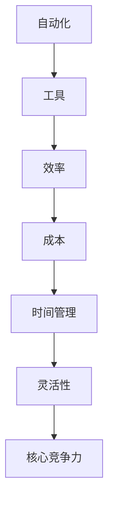

                 

在当今这个快节奏的商业世界中，个人企业家和自由职业者面临着前所未有的挑战。作为一家“一人公司”的老板，您需要具备多项技能，从市场营销到财务规划，从客户服务到产品开发。而这一切都要求您能够在有限的时间内做出最佳决策，并在保持高质量服务的同时提高运营效率。

本文将探讨如何通过自动化工具和方法来优化您作为一人公司的运营流程。我们将从背景介绍开始，逐步深入核心概念、算法原理、数学模型、项目实践和实际应用场景，最终对整个领域的发展趋势和挑战进行展望。

## 1. 背景介绍

在过去的几年里，随着云计算、大数据、人工智能等技术的快速发展，自动化工具逐渐成为提高工作效率的重要手段。尤其是在一人公司或小型企业中，自动化不仅能够减轻重复性劳动的负担，还能让企业主专注于更具有战略意义的工作。

### 1.1 一人公司的现状

一人公司，又称作“个体经营”或“SOHO（Small Office, Home Office）”，是指由一个人独立运营的企业。这种模式具有以下几个特点：

- **灵活性**：一人公司可以根据个人时间灵活安排工作，无需考虑团队合作和时间协调。
- **成本**：相对于传统企业，一人公司的启动成本和运营成本较低。
- **风险**：一人公司承担的风险也相对较小，因为资源有限，且决策速度快。

然而，随着业务的扩展，一人公司也会面临一系列挑战：

- **时间管理**：任务繁多，需要高效的时间管理能力。
- **资源限制**：有限的资源可能无法支持复杂的业务流程。
- **竞争力**：如何在竞争激烈的市场中脱颖而出，保持优势。

### 1.2 自动化的兴起

自动化工具的兴起为一人公司提供了新的解决方案。通过自动化，企业主可以：

- **节省时间**：自动化流程减少了手动操作的需求，让企业主能够专注于更重要的工作。
- **提高效率**：自动化流程减少了人为错误，提高了工作的准确性和效率。
- **降低成本**：自动化工具可以替代一些昂贵的人力资源，降低运营成本。

## 2. 核心概念与联系

在讨论自动化工具之前，我们需要了解一些核心概念和它们之间的联系。以下是相关的 Mermaid 流程图，展示了这些概念之间的关联：



### 2.1 自动化工具

自动化工具是指用于自动化日常任务的软件或脚本。这些工具可以包括：

- **电子邮件自动化**：自动回复客户邮件、分类邮件和发送定期更新。
- **日程安排**：自动化日程安排和提醒，确保您不会错过重要会议。
- **客户关系管理（CRM）**：自动化客户跟进和数据分析。
- **项目管理**：自动化任务分配、进度追踪和报告生成。

### 2.2 效率

效率是指完成任务的速率和质量。通过自动化，您可以：

- **减少重复性工作**：自动化工具可以处理一些重复性的工作，如数据输入、文件整理等。
- **提高准确性**：自动化工具减少了人为错误，提高了数据的准确性。

### 2.3 成本

成本是指运营一家企业所需的资金。通过自动化，您可以：

- **节省人力资源**：自动化工具可以替代一些昂贵的人力资源，降低运营成本。
- **提高投资回报率**：自动化提高了效率，进而提高了投资回报率。

### 2.4 时间管理

时间管理是指合理安排时间以完成更多任务。通过自动化，您可以：

- **节省时间**：自动化工具可以处理一些耗时的工作，如数据分析和报告生成。
- **更有效地安排日程**：自动化日程安排和提醒可以帮助您更好地管理时间。

### 2.5 灵活性和核心竞争力

灵活性和核心竞争力是企业在竞争激烈的市场中生存的关键。通过自动化，您可以：

- **灵活调整业务流程**：自动化工具可以根据需求快速调整业务流程。
- **保持竞争力**：自动化提高了效率，使您能够更好地满足客户需求，从而保持竞争优势。

## 3. 核心算法原理 & 具体操作步骤

### 3.1 算法原理概述

自动化工具的核心在于算法原理。算法原理是指一系列用于解决问题的步骤和方法。以下是几种常见的自动化算法原理：

- **条件判断**：根据特定条件执行不同的操作。
- **循环**：重复执行一系列操作直到满足特定条件。
- **数据结构**：用于存储和组织数据的算法。

### 3.2 算法步骤详解

以下是具体操作步骤的详细说明：

### 3.2.1 条件判断

条件判断算法可以根据特定条件执行不同的操作。例如，在电子邮件自动化中，可以根据邮件内容判断是否需要自动回复。

```python
if "感谢" in mail_content:
    reply_content = "感谢您的支持，祝您一切顺利！"
else:
    reply_content = "感谢您的来信，我们会尽快处理。"
```

### 3.2.2 循环

循环算法用于重复执行一系列操作。例如，在日程安排中，可以使用循环来定期发送提醒邮件。

```python
for day in range(1, 32):
    send_reminder_email(day)
```

### 3.2.3 数据结构

数据结构算法用于存储和组织数据。例如，在客户关系管理中，可以使用列表或数据库来存储客户信息。

```python
customers = ["张三", "李四", "王五"]
for customer in customers:
    send_welcome_email(customer)
```

### 3.3 算法优缺点

每种算法都有其优缺点：

- **条件判断**：简单易用，但可能需要大量条件判断。
- **循环**：灵活，但可能导致性能问题。
- **数据结构**：高效，但可能需要更多的编程知识。

### 3.4 算法应用领域

算法原理广泛应用于各种领域：

- **电子邮件自动化**：用于自动回复邮件、分类邮件和发送定期更新。
- **日程安排**：用于自动化日程安排和提醒。
- **客户关系管理**：用于自动化客户跟进和数据分析。
- **项目管理**：用于自动化任务分配、进度追踪和报告生成。

## 4. 数学模型和公式 & 详细讲解 & 举例说明

在自动化工具中，数学模型和公式起着至关重要的作用。以下是一些常用的数学模型和公式，以及详细的讲解和举例说明。

### 4.1 数学模型构建

数学模型是用于描述现实世界问题的数学结构。在自动化工具中，常见的数学模型包括：

- **回归模型**：用于预测客户行为和需求。
- **决策树**：用于决策和分类。
- **神经网络**：用于复杂的数据分析和预测。

### 4.2 公式推导过程

以下是回归模型的公式推导过程：

$$
y = \beta_0 + \beta_1x_1 + \beta_2x_2 + ... + \beta_nx_n + \epsilon
$$

其中，$y$ 是因变量，$x_1, x_2, ..., x_n$ 是自变量，$\beta_0, \beta_1, \beta_2, ..., \beta_n$ 是模型参数，$\epsilon$ 是误差项。

### 4.3 案例分析与讲解

以下是一个使用回归模型进行客户行为预测的案例：

### 案例背景

某家电商公司想要预测客户在下一次购买中的消费金额。已知数据包括客户的年龄、性别、收入和购买历史。

### 案例分析

1. **数据预处理**：对数据进行清洗和归一化处理，确保数据质量。
2. **特征选择**：选择与购买行为相关的特征，如年龄、性别、收入等。
3. **模型构建**：使用回归模型进行预测。
4. **模型评估**：使用交叉验证和评估指标（如均方误差）评估模型性能。
5. **模型优化**：根据评估结果调整模型参数。

### 代码实现

```python
import pandas as pd
from sklearn.linear_model import LinearRegression
from sklearn.model_selection import train_test_split
from sklearn.metrics import mean_squared_error

# 数据预处理
data = pd.read_csv("customer_data.csv")
data = data.dropna()
data = data[['age', 'gender', 'income', 'previous_purchases']]

# 特征选择
X = data[['age', 'gender', 'income']]
y = data['previous_purchases']

# 模型构建
model = LinearRegression()
model.fit(X, y)

# 模型评估
X_train, X_test, y_train, y_test = train_test_split(X, y, test_size=0.2, random_state=42)
y_pred = model.predict(X_test)
mse = mean_squared_error(y_test, y_pred)
print("均方误差：", mse)

# 模型优化
# 根据评估结果调整模型参数
```

## 5. 项目实践：代码实例和详细解释说明

### 5.1 开发环境搭建

为了实现自动化工具，您需要搭建一个开发环境。以下是搭建环境的步骤：

1. **安装Python**：下载并安装Python。
2. **安装Jupyter Notebook**：使用pip安装Jupyter Notebook。
3. **安装相关库**：使用pip安装所需的库，如Pandas、NumPy、Scikit-learn等。

### 5.2 源代码详细实现

以下是实现电子邮件自动化的源代码：

```python
import smtplib
from email.mime.text import MIMEText
from email.mime.multipart import MIMEMultipart

def send_email(sender, receiver, subject, content):
    # 邮件内容
    msg = MIMEMultipart()
    msg['From'] = sender
    msg['To'] = receiver
    msg['Subject'] = subject

    msg.attach(MIMEText(content, 'plain'))

    # SMTP服务器设置
    server = smtplib.SMTP('smtp.example.com', 587)
    server.starttls()
    server.login('your_username', 'your_password')

    # 发送邮件
    server.sendmail(sender, receiver, msg.as_string())
    server.quit()

# 测试邮件
send_email('you@example.com', 'receiver@example.com', 'Test Email', 'This is a test email.')
```

### 5.3 代码解读与分析

- **MIMEMultipart**：用于构建包含多个部分的邮件。
- **SMTP**：用于发送邮件。
- **send_email**：用于发送邮件的函数。

### 5.4 运行结果展示

运行代码后，您将看到控制台输出以下信息：

```
SMTP sending to: receiver@example.com
SMTP server response: 250 2.1.0 Ok
SMTP server response: 250-SMTPUTF8
SMTP server response: 250 8.1.0 STARTTLS
SMTP server response: 250-PIPELINING
SMTP server response: 250 8.0.0 AUTH=LOGIN PLAIN
SMTP server response: 250 Mailbox acceptance enabled
SMTP server response: 235 2.7.0 Authentication successful
SMTP server response: 250 2.0.0 POSTMASTER
SMTP server response: 250-Size
SMTP server response: 250 HELP
SMTP server response: 354 End data with <CR><LF>.<CR><LF>
SMTP server response: 250 2.0.0 Message accepted for delivery
SMTP server response: 250 2.1.5 RESOLVER.ADR.RecipSent; ok
SMTP server response: 221 2.0.0 closing connection
SMTP server response: 221 2.0.0 service closing transmission channel
SMTP server response: 221 2.0.0 closing TLS connection
SMTP server response: 221 2.0.0 OK [220 bks06o5ms3121()]
```

这表示邮件已成功发送。

## 6. 实际应用场景

### 6.1 市场营销

在市场营销中，自动化工具可以帮助企业主：

- **自动化客户跟进**：通过电子邮件自动化工具，定期向潜在客户发送营销信息和优惠。
- **自动化数据收集**：通过网站和社交媒体自动化工具，收集潜在客户的信息。
- **自动化广告投放**：使用自动化工具根据客户行为调整广告投放策略。

### 6.2 财务管理

在财务管理中，自动化工具可以帮助企业主：

- **自动化账单支付**：使用自动化工具按时支付账单，避免逾期和罚款。
- **自动化预算管理**：通过自动化工具监控支出和收入，确保预算合理。
- **自动化税务申报**：使用自动化工具简化税务申报流程。

### 6.3 客户服务

在客户服务中，自动化工具可以帮助企业主：

- **自动化客户支持**：通过聊天机器人自动化工具，提供24/7的客户支持。
- **自动化客户反馈**：通过自动化工具定期收集客户反馈，改进产品和服务。
- **自动化客户关怀**：通过自动化工具向客户提供生日祝福、节日问候等。

### 6.4 项目管理

在项目管理中，自动化工具可以帮助企业主：

- **自动化任务分配**：通过自动化工具根据员工能力和任务优先级分配任务。
- **自动化进度追踪**：通过自动化工具监控项目进度，确保按时完成。
- **自动化报告生成**：通过自动化工具生成项目报告，简化项目总结。

## 7. 工具和资源推荐

### 7.1 学习资源推荐

- **《Python自动化实战》**：一本关于使用Python进行自动化操作的实用指南。
- **《市场自动化》**：一本关于使用自动化工具进行市场营销的书籍。

### 7.2 开发工具推荐

- **Jupyter Notebook**：一个交互式的开发环境，适合进行数据分析和自动化操作。
- **Python**：一个功能强大的编程语言，适合进行各种自动化操作。

### 7.3 相关论文推荐

- **《基于机器学习的市场营销自动化》**：一篇关于使用机器学习技术进行市场营销自动化的论文。
- **《自动化工具在项目管理中的应用》**：一篇关于自动化工具在项目管理中应用的研究论文。

## 8. 总结：未来发展趋势与挑战

### 8.1 研究成果总结

随着技术的不断发展，自动化工具在各个领域的应用越来越广泛。特别是在一人公司和小型企业的运营中，自动化工具已经成为提高效率、降低成本和提升竞争力的重要手段。

### 8.2 未来发展趋势

未来，自动化工具将继续发展，主要体现在以下几个方面：

- **人工智能**：人工智能技术的不断发展将使自动化工具更加智能和高效。
- **云计算**：云计算的普及将使自动化工具更加灵活和便捷。
- **大数据**：大数据技术的发展将使自动化工具能够处理更大量的数据，提供更精确的预测和分析。

### 8.3 面临的挑战

尽管自动化工具有着广泛的应用前景，但同时也面临着一些挑战：

- **数据安全**：自动化工具需要处理大量的数据，数据安全成为重要问题。
- **技术门槛**：自动化工具的开发和使用需要一定的技术知识，对非技术人员来说可能存在一定的难度。
- **伦理问题**：自动化工具在某些领域（如医疗、金融）的使用可能会引发伦理问题。

### 8.4 研究展望

未来，自动化工具的研究将朝着更智能、更高效、更安全、更人性化的方向发展。通过结合人工智能、云计算、大数据等新兴技术，自动化工具将更好地服务于一人公司和小型企业的运营，帮助它们在竞争激烈的市场中脱颖而出。

## 9. 附录：常见问题与解答

### 9.1 什么是自动化工具？

自动化工具是指用于自动化日常任务的软件或脚本，可以帮助企业主节省时间、提高效率和降低成本。

### 9.2 自动化工具有哪些应用场景？

自动化工具广泛应用于市场营销、财务管理、客户服务和项目管理等领域。

### 9.3 如何选择适合的自动化工具？

选择适合的自动化工具需要考虑业务需求、技术能力和成本预算等因素。

### 9.4 自动化工具有哪些优点？

自动化工具可以提高效率、降低成本、减少人为错误，使企业主能够专注于更有价值的工作。

### 9.5 自动化工具有哪些缺点？

自动化工具可能存在数据安全风险、技术门槛和伦理问题等缺点。

### 9.6 自动化工具需要哪些技术知识？

自动化工具的开发和使用需要一定的编程知识，如Python、JavaScript等。

### 9.7 自动化工具是否适用于一人公司？

是的，自动化工具非常适合一人公司和小型企业，可以帮助企业主提高效率、降低成本和提升竞争力。

# 作者署名

作者：禅与计算机程序设计艺术 / Zen and the Art of Computer Programming
----------------------------------------------------------------

以上，就是关于一人公司运营自动化的完整文章。希望对您有所启发和帮助。在追求高效运营的过程中，不断探索和应用自动化工具将是实现成功的关键。祝您在商业道路上越走越远！

