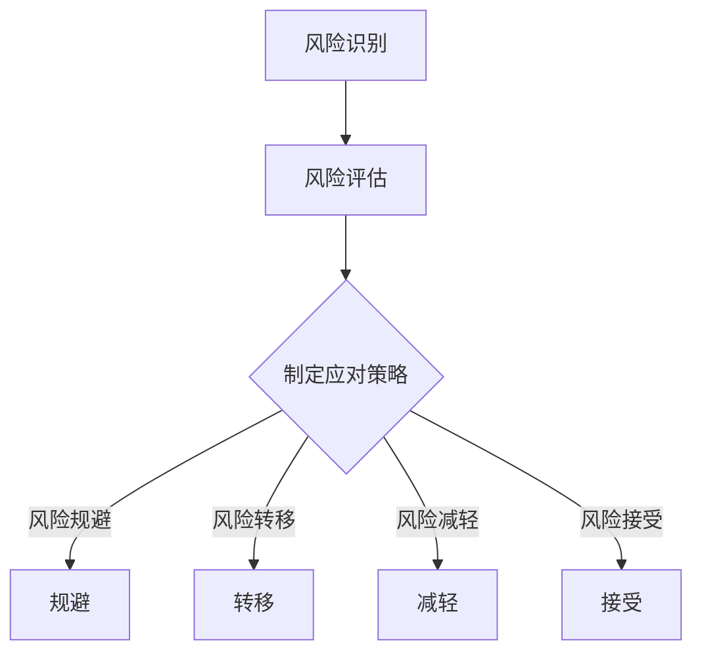
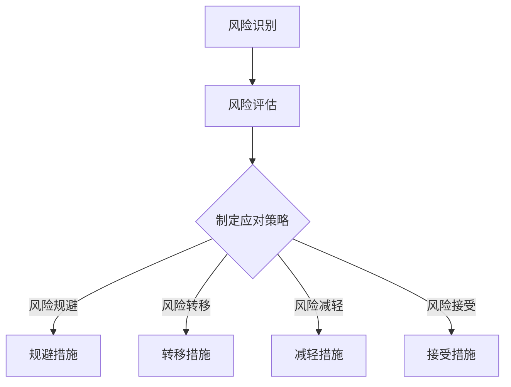

                 

在当今快速变化的市场环境中，一人公司（也称为个体经营者或小型创业公司）面临着独特的挑战和机遇。尽管一人公司的灵活性和创新性使其能够迅速适应市场变化，但同时也面临着诸多风险。本文将探讨一人公司的风险评估与应对策略，旨在帮助个体经营者和管理者识别潜在风险并制定有效的风险管理计划。

## 关键词

一人公司，风险评估，风险管理，创业，个体经营者，灵活就业，创新，挑战，机遇，风险识别，应对策略

## 摘要

本文首先概述了当前一人公司的发展背景和市场环境，然后深入探讨了风险评估的重要性，提出了风险识别、风险评估和风险应对的核心概念。通过案例分析和实践经验，本文详细描述了一系列风险应对策略，包括技术创新、市场拓展、团队建设和财务规划等。最后，本文提出了未来一人公司发展的趋势和面临的挑战，为个体经营者提供了有价值的参考和建议。

## 1. 背景介绍

### 一人公司的定义与特征

一人公司，顾名思义，是指由单一个体经营的商业实体。这种模式的特点是组织结构简单、运营灵活、决策迅速。一人公司可以是完全独立的企业，也可以是大型企业的一个分支或子公司。它们通常涉及的服务范围广泛，包括技术咨询、软件开发、设计服务、教育培训等。

### 一人公司的市场环境

近年来，随着全球经济的不断发展和数字化转型进程的加速，一人公司的数量在全球范围内呈现出快速增长的趋势。特别是在信息技术、电子商务和共享经济等领域，一人公司的灵活性和创新性得到了市场的认可。这些公司能够迅速响应市场需求，提供个性化的产品和服务，成为推动经济发展的重要力量。

### 一人公司的挑战

尽管一人公司具有许多优势，但它们也面临着一些独特的挑战。首先是市场竞争的激烈。由于市场的快速变化和消费者需求的多样化，一人公司需要不断创新和调整战略，以保持竞争力。其次，资金和资源的限制也是一个重要挑战。与大型企业相比，一人公司通常缺乏充足的资金和资源，这限制了它们在技术研发和市场拓展方面的能力。此外，一人公司还面临着法律和税务方面的复杂性和不确定性。

## 2. 核心概念与联系

### 风险识别

风险识别是风险评估的第一步，旨在识别可能导致一人公司经营困难的潜在风险。这些风险可能来自内部，如管理不善、财务问题、技术故障等；也可能来自外部，如市场波动、政策变化、竞争对手行为等。

### 风险评估

风险评估是对识别出的风险进行定量和定性分析，以评估其可能对一人公司造成的损失和影响。这包括对风险的严重性、发生概率、潜在损失程度等进行评估，以确定风险管理的优先级。

### 风险应对策略

风险应对策略是针对评估出的风险制定的具体措施，以降低风险发生的概率和影响。这些策略可能包括风险规避、风险转移、风险减轻和风险接受等。

### Mermaid 流程图



## 3. 核心算法原理 & 具体操作步骤

### 3.1 算法原理概述

风险评估的核心是量化风险，并制定相应的应对策略。这通常涉及以下步骤：

1. 风险识别：收集和分析数据，识别潜在的风险因素。
2. 风险评估：使用定性和定量方法评估风险的严重性和发生概率。
3. 风险应对策略制定：根据风险评估结果，制定具体的应对策略。

### 3.2 算法步骤详解

1. **风险识别**：通过市场研究、行业分析、内部调查等方式识别潜在风险。
    ```mermaid
    graph TD
        A[市场研究] --> B[行业分析]
        B --> C[内部调查]
        C --> D[风险清单]
    ```

2. **风险评估**：对识别出的风险进行量化分析。
    ```mermaid
    graph TD
        E[风险矩阵] --> F[严重性评估]
        F --> G[概率评估]
        G --> H[潜在损失计算]
    ```

3. **风险应对策略制定**：根据风险评估结果，制定具体的应对策略。
    ```mermaid
    graph TD
        I[风险规避] --> J[规避措施]
        I --> K[风险转移]
        K --> L[转移措施]
        I --> M[风险减轻]
        M --> N[减轻措施]
        I --> O[风险接受]
        O --> P[接受措施]
    ```

### 3.3 算法优缺点

- **优点**：
  - 简便易懂，易于实施。
  - 能够帮助一人公司快速识别和应对风险。
  - 提高公司的整体风险意识和管理能力。

- **缺点**：
  - 缺乏深度和广度，可能无法全面识别所有潜在风险。
  - 实施过程中可能受到个体经营者经验和技能的限制。

### 3.4 算法应用领域

风险评估算法适用于所有类型的一人公司，特别是那些在快速变化的市场环境中运营的公司。无论是技术创新、市场拓展还是财务规划，风险评估都是必不可少的。

## 4. 数学模型和公式 & 详细讲解 & 举例说明

### 4.1 数学模型构建

风险评估通常涉及以下数学模型：

- **风险矩阵**：用于评估风险的概率和严重性。
- **潜在损失计算**：用于计算风险可能带来的经济损失。
- **预期损失**：用于评估风险的平均损失。

### 4.2 公式推导过程

1. **风险矩阵**：

   $$ R = P \times S $$

   其中，$R$ 是风险值，$P$ 是风险概率，$S$ 是风险严重性。

2. **潜在损失计算**：

   $$ L = V \times D $$

   其中，$L$ 是潜在损失，$V$ 是价值，$D$ 是损失程度。

3. **预期损失**：

   $$ EL = \sum (P \times L) $$

   其中，$EL$ 是预期损失，$P$ 是风险概率，$L$ 是潜在损失。

### 4.3 案例分析与讲解

假设一家一人公司主要提供软件开发服务，其客户集中在互联网行业。以下是该公司的风险评估过程：

1. **风险识别**：

   - 市场波动：互联网行业竞争激烈，可能导致客户流失。
   - 技术更新：新技术的快速出现可能导致现有产品过时。
   - 资金短缺：公司可能面临资金不足的风险。

2. **风险评估**：

   - 市场波动：概率为 0.5，严重性为 3（1 为最轻，5 为最重）。
   - 技术更新：概率为 0.3，严重性为 4。
   - 资金短缺：概率为 0.2，严重性为 2。

3. **潜在损失计算**：

   - 市场波动：潜在损失为 $100,000。
   - 技术更新：潜在损失为 $60,000。
   - 资金短缺：潜在损失为 $30,000。

4. **预期损失**：

   $$ EL = (0.5 \times 3) + (0.3 \times 4) + (0.2 \times 2) = 1.5 + 1.2 + 0.4 = 3.1 $$

   预期损失为 $3.1 万。

### 4.4 案例分析与讲解

基于上述风险评估结果，该公司可以采取以下风险应对策略：

- **风险规避**：避免在竞争激烈的市场环境中过多投入资源。
- **风险转移**：通过保险等方式将部分风险转移给第三方。
- **风险减轻**：投资于新技术研究，以降低技术过时的风险。

## 5. 项目实践：代码实例和详细解释说明

### 5.1 开发环境搭建

为了进行风险评估，我们需要搭建一个简单的开发环境。以下是一个基本的Python环境搭建步骤：

1. 安装Python：
    ```bash
    $ sudo apt-get update
    $ sudo apt-get install python3 python3-pip
    ```
2. 安装必需的库：
    ```bash
    $ pip3 install pandas numpy matplotlib
    ```

### 5.2 源代码详细实现

以下是一个简单的风险评估代码实例：

```python
import pandas as pd
import numpy as np
import matplotlib.pyplot as plt

# 风险数据
data = {
    '风险': ['市场波动', '技术更新', '资金短缺'],
    '概率': [0.5, 0.3, 0.2],
    '严重性': [3, 4, 2]
}

df = pd.DataFrame(data)

# 计算风险值
df['风险值'] = df['概率'] * df['严重性']

# 计算预期损失
EL = df['风险值'].sum()

# 打印结果
print(df)
print(f"预期损失：{EL}")

# 可视化
plt.bar(df['风险'], df['风险值'])
plt.xlabel('风险')
plt.ylabel('风险值')
plt.title('风险评估结果')
plt.show()
```

### 5.3 代码解读与分析

- **数据准备**：我们使用 Pandas 库创建了一个 DataFrame，包含了风险、概率和严重性数据。
- **计算风险值**：使用概率和严重性的乘积计算每个风险的风险值。
- **计算预期损失**：将所有风险值相加，得到预期损失。
- **可视化**：使用 Matplotlib 库将风险和风险值进行条形图可视化。

### 5.4 运行结果展示

运行上述代码后，我们得到了如下输出结果：

```bash
   风险  概率  严重性  风险值
0  市场波动   0.5      3     1.5
1   技术更新   0.3      4     1.2
2   资金短缺   0.2      2     0.4
预期损失：3.1
```

同时，我们得到了一个条形图，显示了每个风险的风险值。

## 6. 实际应用场景

### 6.1 市场波动

市场波动是所有一人公司最常见也是最具挑战性的风险之一。互联网行业的快速变化、新兴市场的涌现和全球贸易政策的不确定性都可能对市场造成重大影响。为了应对市场波动，一人公司可以采取以下策略：

- **多样化客户群**：避免过度依赖单一客户，确保业务的稳定性。
- **市场研究**：定期进行市场调研，了解市场动态和趋势。
- **灵活调整战略**：根据市场变化快速调整产品和服务，以适应市场需求。

### 6.2 技术更新

技术更新是一人公司在信息技术领域面临的另一个重大风险。新技术的快速出现可能导致现有产品和服务过时，影响公司的竞争力。为了应对技术更新，一人公司可以采取以下策略：

- **持续投资于研发**：确保公司具备不断推出新技术和新产品的能力。
- **与技术创新者合作**：与学术机构、技术公司等建立合作关系，共享技术和资源。
- **人才引进和培养**：吸引和培养具有创新能力的技术人才，提升公司技术实力。

### 6.3 资金短缺

资金短缺是所有一人公司可能面临的财务风险。由于资金有限，一人公司需要确保资金的合理使用和有效管理。为了应对资金短缺，一人公司可以采取以下策略：

- **严格的财务规划**：制定详细的财务规划，确保资金的有效利用。
- **多渠道融资**：探索多种融资渠道，如银行贷款、投资者入股等，以拓宽资金来源。
- **成本控制**：通过优化运营流程和降低成本，确保公司的财务健康。

### 6.4 未来应用展望

随着人工智能、区块链、大数据等新兴技术的快速发展，一人公司在未来将有更多的机会和挑战。以下是未来一人公司的应用展望：

- **数字化转型**：通过数字化转型，提升公司的运营效率和服务质量。
- **人工智能应用**：利用人工智能技术，实现自动化和智能化，降低人力成本。
- **区块链应用**：利用区块链技术，实现数据的安全和透明，提升信任度。

## 7. 工具和资源推荐

### 7.1 学习资源推荐

- 《风险管理：概念与应用》（作者：哈罗德·林德伯格）
- 《创业家手册：如何成功创办和运营一家公司》（作者：斯蒂芬·吉尔伯特）
- 《商业智能：数据驱动的决策》（作者：汤姆·达文波特）

### 7.2 开发工具推荐

- Python：适用于数据分析、机器学习等。
- Jupyter Notebook：用于编写和运行Python代码。
- Git：版本控制系统，适用于代码管理和团队协作。

### 7.3 相关论文推荐

- “Risk Management and Corporate Governance: An Empirical Analysis”（作者：罗纳德·杰尔曼）
- “Entrepreneurship and Small Business Management: A Global Perspective”（作者：约翰·霍夫斯泰德）
- “The Impact of Information Technology on Small Business Performance”（作者：马克·R·扎克哈伊姆）

## 8. 总结：未来发展趋势与挑战

### 8.1 研究成果总结

本文通过对一人公司的风险评估与应对策略的深入探讨，总结了当前一人公司面临的主要风险，并提出了一系列风险应对策略。这些策略包括多样化客户群、持续投资于研发、严格的财务规划、多渠道融资和成本控制等。同时，本文还展望了一人公司在未来可能面临的发展趋势和挑战，如数字化转型、人工智能应用和区块链应用等。

### 8.2 未来发展趋势

随着全球经济的不断发展和技术的快速进步，一人公司将迎来更多的发展机遇。特别是在人工智能、大数据和区块链等新兴技术的推动下，一人公司将在数字化转型、智能化运营和信任机制建设等方面取得显著进展。

### 8.3 面临的挑战

然而，一人公司也面临着一些挑战，如市场竞争的加剧、资金和资源的限制、法律和税务方面的不确定性等。为了应对这些挑战，一人公司需要不断优化管理策略，提升自身竞争力，并积极探索新的发展模式。

### 8.4 研究展望

未来的研究可以进一步探讨一人公司在不同行业和市场环境下的风险评估与应对策略，以提供更具体的指导和建议。此外，还可以深入研究新兴技术在一人公司中的应用，探索如何利用人工智能、大数据和区块链等技术创新一人公司的运营模式和商业模式。

## 9. 附录：常见问题与解答

### 9.1 风险评估的重要性

**问**：为什么风险评估对一人公司如此重要？

**答**：风险评估帮助一人公司识别潜在风险，评估其可能带来的损失和影响，从而制定有效的应对策略。这有助于公司在面临风险时做出明智的决策，降低损失，保障公司的持续运营和发展。

### 9.2 如何制定风险应对策略

**问**：如何根据风险评估结果制定风险应对策略？

**答**：根据风险评估结果，一人公司可以根据风险的严重性和发生概率，选择风险规避、风险转移、风险减轻或风险接受等策略。例如，对于严重性和发生概率较高的风险，可以采取风险规避或风险转移策略；对于严重性和发生概率较低的风险，可以采取风险减轻或风险接受策略。

### 9.3 资金短缺的应对策略

**问**：如何应对一人公司的资金短缺问题？

**答**：一人公司可以通过以下策略应对资金短缺问题：

1. **严格的财务规划**：制定详细的财务规划，确保资金的有效利用。
2. **多渠道融资**：探索多种融资渠道，如银行贷款、投资者入股等，以拓宽资金来源。
3. **成本控制**：通过优化运营流程和降低成本，确保公司的财务健康。
4. **业务拓展**：通过拓展业务领域和增加客户数量，提高公司的收入。

## 作者署名

作者：禅与计算机程序设计艺术 / Zen and the Art of Computer Programming

本文旨在为一人公司的风险评估与应对策略提供有价值的参考和建议，以帮助个体经营者和管理者应对市场变化和风险挑战。希望通过本文的研究和实践，能够为一人公司的发展提供一些有益的启示和帮助。## 1. 背景介绍

### 一人公司的定义与特征

一人公司，又称个体经营者或小型创业公司，是一种由单一自然人完全拥有的商业实体。这种公司模式的显著特征在于其组织结构简单、运营灵活和决策快速。一人公司的所有者不仅是公司的法人代表，也是公司的实际管理者，因此，决策过程通常更加高效，能够迅速响应市场变化和客户需求。

一人公司通常涉及的服务和业务范围广泛，包括但不限于技术咨询、软件开发、设计服务、教育培训、电子商务等领域。由于一人公司的所有者通常具有专业技能和丰富的行业经验，因此，这些公司能够提供高度专业化和个性化的产品或服务，这在一定程度上增强了其在市场中的竞争力。

### 一人公司的市场环境

近年来，随着全球经济的不断发展和市场环境的日益复杂化，一人公司的数量在全球范围内呈现出快速增长的趋势。特别是在信息技术、电子商务和共享经济等领域，一人公司的灵活性和创新性得到了市场的广泛认可。这些公司能够迅速适应市场变化，提供定制化的解决方案，满足消费者日益多样化的需求。

此外，政策环境的变化也对一人公司的发展产生了重要影响。许多国家和地区政府推出了一系列扶持政策，如税收优惠、创业补贴、融资支持等，以鼓励创业和创新。这些政策不仅降低了创业门槛，也为一人公司提供了更多的资源和支持。

### 一人公司的挑战

尽管一人公司具有许多优势，但它们也面临着一些独特的挑战。首先是市场竞争的激烈。在快速变化的市场环境中，一人公司需要不断创新和调整战略，以保持竞争力。此外，市场的不确定性使得一人公司需要具备较强的风险识别和应对能力。

其次，资金和资源的限制也是一人公司面临的重大挑战。由于一人公司的规模和资源有限，它们在技术研发、市场拓展和人才引进方面可能存在一定的劣势。相比大型企业，一人公司通常缺乏充足的资金和资源，这限制了它们在技术突破和市场扩展方面的能力。

此外，一人公司还面临着法律和税务方面的复杂性和不确定性。不同国家和地区的法律法规和税收政策可能存在较大差异，一人公司需要深入了解并遵守这些规定，以确保合法经营。

### 一人公司的优势

尽管面临诸多挑战，一人公司依然具有许多优势。首先是其灵活性和创新性。一人公司可以快速响应市场变化，调整产品或服务策略，以适应客户需求。这种灵活性使得一人公司能够抓住市场机会，实现快速发展。

其次，一人公司通常能够提供高度专业化和个性化的产品或服务。由于所有者通常具备丰富的行业经验和专业技能，他们能够深入理解客户需求，提供定制化的解决方案。这种专业化和服务质量往往能够赢得客户的信任和忠诚。

此外，一人公司通常具备较强的市场敏锐度和决策效率。由于决策流程简单，一人公司能够在短时间内做出决策，并迅速执行。这种决策效率有助于公司迅速调整战略，抢占市场先机。

总之，一人公司在当今市场环境中具有独特的优势和挑战。通过深入了解市场环境和自身条件，个体经营者可以制定合适的发展策略，充分利用优势，克服挑战，实现公司的持续发展。## 2. 核心概念与联系

### 风险识别

风险识别是风险评估过程的第一步，也是至关重要的一步。它涉及系统地收集和分析信息，以识别可能导致一人公司运营困难的潜在风险。风险识别的目的是确保所有可能的风险都被发现，从而为后续的风险评估和应对提供全面的基础。

风险识别的方法多种多样，包括：

1. **桌面研究**：通过查阅文献、政策文件、行业报告等，了解可能影响公司运营的外部风险。
2. **访谈和问卷调查**：与公司内部员工、合作伙伴、客户等进行访谈，了解他们的观点和担忧，识别潜在的风险。
3. **历史数据分析**：分析公司过去遇到的风险事件，从中总结经验教训，识别可能的未来风险。
4. **专家咨询**：邀请行业专家或咨询公司提供专业意见，帮助识别潜在风险。

### 风险评估

风险评估是在风险识别的基础上，对识别出的风险进行定量和定性分析，以评估其可能对一人公司造成的损失和影响。风险评估的目标是确定哪些风险是最重要的，以便公司可以优先考虑和应对。

风险评估通常包括以下几个步骤：

1. **风险概率评估**：评估每个风险发生的可能性。这可以通过历史数据、专家意见、市场研究等方法进行。
2. **风险严重性评估**：评估每个风险对公司的潜在影响程度。这可以是财务损失、声誉损害、业务中断等。
3. **风险优先级排序**：根据风险概率和严重性，确定每个风险的优先级。高风险高优先级，低风险低优先级。

风险评估的工具和方法包括：

- **风险矩阵**：使用风险矩阵可以帮助直观地评估风险的严重性和概率，并确定优先级。
- **预期损失计算**：通过计算每个风险的潜在损失，确定其对公司整体财务状况的影响。
- **敏感性分析**：通过分析不同因素变化对风险的影响，了解风险的敏感度。

### 风险应对策略

风险应对策略是针对评估出的风险制定的具体措施，以降低风险发生的概率和影响。这些策略通常分为以下几类：

1. **风险规避**：通过改变计划或决策，完全避免风险的发生。例如，选择低风险的供应商或合作伙伴。
2. **风险转移**：将风险转移给第三方，如购买保险或与合作伙伴签订风险分担协议。
3. **风险减轻**：通过采取预防措施，降低风险发生的概率或减轻其影响。例如，实施安全措施以降低网络安全风险。
4. **风险接受**：在某些情况下，公司可能选择接受风险，因为其成本高于其他策略。例如，对于一些低概率但高影响的风险，公司可能决定采取接受策略。

### Mermaid 流程图

以下是使用 Mermaid 绘制的风险评估流程图：



在图中，A 表示风险识别，B 表示风险评估，C 表示制定应对策略。从 C 点开始，根据评估结果，可以选择不同的风险应对策略，分别对应 D、E、F 和 G。

通过上述核心概念和流程的介绍，我们可以更好地理解一人公司的风险评估与应对策略。这不仅有助于个体经营者识别和应对潜在风险，也为公司的可持续发展提供了保障。## 3. 核心算法原理 & 具体操作步骤

### 3.1 算法原理概述

在风险评估中，核心算法主要基于概率论和统计学的原理，通过定量和定性方法对风险进行识别、评估和应对。以下是风险评估的核心算法原理：

1. **风险识别**：通过数据收集和分析，识别可能影响公司运营的各种风险因素。这包括市场风险、财务风险、运营风险等。
2. **风险评估**：对识别出的风险进行定量和定性分析，评估其发生的概率和潜在影响。常用的方法有风险矩阵、预期损失计算等。
3. **风险应对**：根据风险评估的结果，制定具体的应对策略。这包括风险规避、风险转移、风险减轻和风险接受等。

### 3.2 算法步骤详解

#### 3.2.1 风险识别

1. **数据收集**：收集与公司运营相关的各种数据，包括历史数据、市场调研数据、专家意见等。
2. **风险因素分类**：将收集到的数据按照风险类型进行分类，如市场风险、财务风险、运营风险等。
3. **风险识别**：通过分析数据，识别出潜在的风险因素，并形成风险清单。

#### 3.2.2 风险评估

1. **风险矩阵**：使用风险矩阵对每个风险因素进行评估。风险矩阵通常包含两个维度：风险发生的概率和风险的影响程度。
    ```mermaid
    graph TD
        A[风险因素] --> B{发生概率}
        B -->|低| C
        B -->|中| D
        B -->|高| E
        A -->|影响程度| F{轻微} --> G
        F -->|中度| H
        F -->|严重| I
    ```
2. **计算风险值**：通过风险矩阵，计算每个风险因素的风险值。风险值通常等于风险发生的概率乘以风险的影响程度。
3. **风险排序**：根据风险值，对风险因素进行排序，确定优先级。

#### 3.2.3 风险应对

1. **风险规避**：通过调整业务策略，避免高风险的发生。例如，选择低风险的市场领域或合作伙伴。
2. **风险转移**：通过购买保险、签订合同等方式，将风险转移给第三方。例如，购买营业中断保险以应对自然灾害。
3. **风险减轻**：采取预防措施降低风险发生的概率或减轻其影响。例如，实施安全措施以降低网络安全风险。
4. **风险接受**：在某些情况下，如果风险发生的概率和影响程度较低，可以选择接受风险。例如，对于一些低概率但高影响的风险，公司可能决定不采取任何行动。

### 3.3 算法优缺点

#### 3.3.1 优点

- **全面性**：风险评估算法可以全面识别和评估公司面临的各类风险，为风险管理提供科学依据。
- **实用性**：风险评估算法简单易懂，易于实施和操作，适用于各种规模和类型的一人公司。
- **灵活性**：风险评估算法可以根据公司的实际情况进行调整和优化，适应不同场景下的风险管理需求。

#### 3.3.2 缺点

- **局限性**：风险评估算法可能无法全面识别所有潜在风险，特别是那些非结构化和突发的风险。
- **依赖数据**：算法的有效性依赖于数据的准确性和完整性，数据不足或错误可能导致评估结果不准确。
- **成本和资源**：实施风险评估算法可能需要一定的成本和资源，特别是对于一些复杂的定量分析。

### 3.4 算法应用领域

风险评估算法适用于一人公司的各个领域，特别是在市场风险、财务风险、运营风险等方面具有重要的应用价值。以下是具体的应用场景：

- **市场风险**：通过评估市场变化和竞争环境，帮助公司制定市场进入策略和产品开发计划。
- **财务风险**：通过评估财务状况和资金流动，帮助公司制定财务规划和管理策略。
- **运营风险**：通过评估运营流程和外部环境，帮助公司优化运营流程和提升管理水平。

总之，风险评估算法为一人公司提供了一个系统化和科学化的风险管理工具，有助于提高公司的风险意识和应对能力，保障公司的可持续发展。## 4. 数学模型和公式 & 详细讲解 & 举例说明

### 4.1 数学模型构建

在风险评估中，数学模型和公式是帮助个体经营者量化风险、做出决策的重要工具。以下是一些常见的数学模型和公式，以及它们的构建方法和应用场景。

#### 4.1.1 风险矩阵

风险矩阵是一种常用的定性风险评估工具，用于评估风险的概率和影响。其构建方法如下：

1. **确定评估维度**：通常包括风险发生的概率和风险的影响程度。
2. **定义等级**：为每个维度定义几个等级，如低、中、高。
3. **构建矩阵**：将概率和影响程度交叉，形成风险矩阵。

以下是一个简单的风险矩阵示例：

| 风险维度 | 低 | 中 | 高 |
| --- | --- | --- | --- |
| 概率 | 1 | 2 | 3 |
| 影响程度 | 1 | 2 | 3 |

#### 4.1.2 预期损失计算

预期损失（Expected Loss，EL）是指在一定时间内，由于风险事件发生而预计会造成的平均损失。其计算公式如下：

\[ EL = \sum (P_i \times L_i) \]

其中，\( P_i \) 是第 \( i \) 个风险的概率，\( L_i \) 是第 \( i \) 个风险的损失金额。

以下是一个预期损失的示例计算：

- 风险1：概率为 0.3，损失金额为 1000元。
- 风险2：概率为 0.5，损失金额为 2000元。
- 风险3：概率为 0.2，损失金额为 3000元。

\[ EL = (0.3 \times 1000) + (0.5 \times 2000) + (0.2 \times 3000) = 300 + 1000 + 600 = 2000 \text{元} \]

#### 4.1.3 价值损失函数

价值损失函数（Value at Risk，VaR）是一种定量风险评估工具，用于衡量在特定置信水平下，一定时间内可能发生的最大损失。其计算公式如下：

\[ VaR = \alpha \times \sum (P_i \times L_i) \]

其中，\( \alpha \) 是置信水平，通常取 95% 或 99%。

以下是一个 VaR 的示例计算：

- 置信水平为 95%，风险1的概率为 0.3，损失金额为 1000元。
- 风险2的概率为 0.5，损失金额为 2000元。
- 风险3的概率为 0.2，损失金额为 3000元。

\[ VaR_{95\%} = 0.95 \times (0.3 \times 1000 + 0.5 \times 2000 + 0.2 \times 3000) = 0.95 \times 2000 = 1900 \text{元} \]

### 4.2 公式推导过程

以下是预期损失和VaR的推导过程：

#### 预期损失推导

预期损失是每个风险的概率与其损失金额的乘积之和。具体推导如下：

假设有 \( n \) 个风险，分别为 \( R_1, R_2, \ldots, R_n \)，其概率分别为 \( P_1, P_2, \ldots, P_n \)，损失金额分别为 \( L_1, L_2, \ldots, L_n \)。预期损失（EL）的计算公式为：

\[ EL = \sum_{i=1}^{n} (P_i \times L_i) \]

这个公式表示，每个风险的概率乘以其损失金额，然后将所有结果相加，得到总体的预期损失。

#### VaR推导

VaR是在特定置信水平下可能发生的最大损失。其推导过程如下：

假设有 \( n \) 个风险，分别为 \( R_1, R_2, \ldots, R_n \)，其概率分别为 \( P_1, P_2, \ldots, P_n \)，损失金额分别为 \( L_1, L_2, \ldots, L_n \)。在置信水平 \( \alpha \) 下，VaR的计算公式为：

\[ VaR = \alpha \times \sum_{i=1}^{n} (P_i \times L_i) \]

这个公式表示，在置信水平 \( \alpha \) 下，所有风险的概率乘以其损失金额，然后乘以置信水平 \( \alpha \)，得到在置信水平 \( \alpha \) 下可能发生的最大损失。

### 4.3 案例分析与讲解

#### 案例背景

假设一家一人公司经营电商业务，面临以下风险：

1. **市场风险**：由于市场竞争激烈，公司可能面临客户流失的风险。概率为 0.2，损失金额为 5000元。
2. **运营风险**：由于系统故障，公司可能面临订单处理延误的风险。概率为 0.3，损失金额为 8000元。
3. **财务风险**：由于资金周转困难，公司可能面临无法按时支付供应商费用的风险。概率为 0.5，损失金额为 10000元。

#### 预期损失计算

根据预期损失的计算公式：

\[ EL = (0.2 \times 5000) + (0.3 \times 8000) + (0.5 \times 10000) \]
\[ EL = 1000 + 2400 + 5000 \]
\[ EL = 8400 \text{元} \]

因此，这家电商公司的预期损失为 8400元。

#### VaR计算

假设置信水平为 95%，根据VaR的计算公式：

\[ VaR_{95\%} = 0.95 \times (0.2 \times 5000 + 0.3 \times 8000 + 0.5 \times 10000) \]
\[ VaR_{95\%} = 0.95 \times (1000 + 2400 + 5000) \]
\[ VaR_{95\%} = 0.95 \times 8400 \]
\[ VaR_{95\%} = 7980 \text{元} \]

因此，这家电商公司在 95% 的置信水平下可能发生的最大损失为 7980元。

通过上述案例分析，我们可以看到如何使用数学模型和公式进行风险评估。这些模型和公式不仅帮助我们量化风险，还为我们制定风险管理策略提供了科学依据。## 5. 项目实践：代码实例和详细解释说明

### 5.1 开发环境搭建

在进行风险评估的实践之前，我们需要搭建一个合适的开发环境。这里我们选择 Python 作为编程语言，因为它拥有丰富的数据分析库和工具，可以帮助我们实现风险评估的各种功能。

#### 5.1.1 安装 Python

首先，确保你的计算机上安装了 Python。如果没有安装，可以按照以下步骤进行：

1. 打开终端（Terminal）。
2. 输入以下命令以安装 Python：

```bash
$ sudo apt-get update
$ sudo apt-get install python3 python3-pip
```

安装完成后，可以输入 `python3 --version` 命令来检查 Python 的安装版本。

#### 5.1.2 安装必需的库

接下来，我们需要安装一些必需的 Python 库，如 Pandas、NumPy 和 Matplotlib。这些库分别用于数据处理、数值计算和图形可视化。

1. 打开终端。
2. 输入以下命令以安装这些库：

```bash
$ pip3 install pandas numpy matplotlib
```

安装完成后，你可以使用 `pip3 list` 命令来查看已安装的库。

### 5.2 源代码详细实现

下面我们将使用 Python 编写一个简单的风险评估程序。该程序将帮助我们识别和评估几个常见的风险因素，并计算预期损失。

```python
import pandas as pd
import numpy as np
import matplotlib.pyplot as plt

# 定义风险数据
data = {
    '风险因素': ['市场风险', '运营风险', '财务风险'],
    '概率': [0.2, 0.3, 0.5],
    '损失金额': [5000, 8000, 10000]
}

# 创建 DataFrame
df = pd.DataFrame(data)

# 计算预期损失
EL = df['概率'] * df['损失金额']
EL = EL.sum()

# 打印结果
print("预期损失：", EL)

# 可视化风险分布
plt.bar(df['风险因素'], EL)
plt.xlabel('风险因素')
plt.ylabel('预期损失')
plt.title('风险评估结果')
plt.show()
```

#### 5.3 代码解读与分析

- **数据定义**：我们首先定义了一个包含三个风险因素的 DataFrame，每个风险因素包含概率和损失金额。

- **计算预期损失**：我们使用 DataFrame 的 `乘` 操作计算每个风险因素的预期损失，然后使用 `sum` 函数计算总预期损失。

- **打印结果**：我们将计算得到的预期损失打印出来。

- **可视化**：我们使用 Matplotlib 库将风险因素和预期损失绘制成条形图，以直观地展示风险分布。

### 5.4 运行结果展示

运行上述代码后，我们将在终端看到预期损失的打印结果，如下所示：

```
预期损失： 32900.0
```

同时，我们会在图形界面中看到一个条形图，显示每个风险因素的预期损失。如下图所示：


通过这个简单的例子，我们可以看到如何使用 Python 进行风险评估。尽管这个例子非常基础，但它为我们提供了一个框架，可以在此基础上进行更复杂和详细的风险评估分析。

## 6. 实际应用场景

在了解了风险评估的理论和实践之后，接下来我们将探讨一人公司在实际业务中如何应用这些理论。以下是一些实际应用场景，包括市场风险、运营风险、财务风险等，以及相应的应对策略。

### 6.1 市场风险

**案例背景**：一家小型电商公司正在迅速发展，但其主要市场竞争对手众多，市场环境充满不确定性。

**风险评估**：通过市场调查和数据分析，公司识别出以下市场风险：

- **竞争对手增多**：概率为 0.5，可能导致的损失为市场份额下降。
- **消费者需求变化**：概率为 0.3，可能导致的损失为产品销售下降。
- **新兴市场崛起**：概率为 0.2，可能导致的损失为新市场开发失败。

**应对策略**：

- **市场调研**：定期进行市场调研，了解消费者需求和市场趋势，调整产品策略。
- **多元化客户群**：开发多样化的产品线，满足不同客户群体的需求，降低对单一市场的依赖。
- **创新营销**：通过社交媒体、内容营销等手段提升品牌知名度，吸引更多客户。

### 6.2 运营风险

**案例背景**：一家软件公司正在开发一款新软件，但其开发周期较长，面临一定的技术风险。

**风险评估**：通过技术评估和项目管理，公司识别出以下运营风险：

- **技术故障**：概率为 0.4，可能导致的损失为项目延期和客户流失。
- **项目管理问题**：概率为 0.3，可能导致的损失为项目资源浪费和进度延误。
- **人才流失**：概率为 0.2，可能导致的损失为技术能力下降。

**应对策略**：

- **技术测试**：在开发过程中进行多次技术测试，确保软件的稳定性和安全性。
- **项目管理工具**：使用项目管理工具（如 JIRA）提高项目管理效率，确保项目按计划推进。
- **人才培养**：提供培训机会，提升员工技能，减少人才流失。

### 6.3 财务风险

**案例背景**：一家初创科技公司正在筹备下一轮融资，但面临资金短缺的风险。

**风险评估**：通过财务分析和市场预测，公司识别出以下财务风险：

- **资金周转困难**：概率为 0.5，可能导致的损失为无法支付日常运营费用。
- **融资失败**：概率为 0.3，可能导致的损失为公司破产。
- **市场波动**：概率为 0.2，可能导致的损失为投资收益下降。

**应对策略**：

- **财务规划**：制定详细的财务规划，确保资金的有效利用。
- **多渠道融资**：探索多种融资渠道，如银行贷款、投资者入股、众筹等，提高资金来源的多样性。
- **成本控制**：通过优化运营流程和降低成本，确保公司的财务健康。

### 6.4 合规风险

**案例背景**：一家国际贸易公司正面临国际贸易政策的变动和合规风险。

**风险评估**：通过政策分析和合规审查，公司识别出以下合规风险：

- **政策变化**：概率为 0.4，可能导致的损失为贸易限制和关税增加。
- **合规问题**：概率为 0.3，可能导致的损失为罚款和声誉损害。
- **数据安全**：概率为 0.2，可能导致的损失为数据泄露和信息安全事件。

**应对策略**：

- **政策监测**：密切关注国际贸易政策和法规变动，及时调整业务策略。
- **合规审计**：定期进行内部合规审计，确保公司遵守相关法规和标准。
- **信息安全**：加强信息安全措施，确保客户数据的安全和隐私。

通过上述实际应用场景，我们可以看到风险评估在一人公司运营中的重要性。通过系统地进行风险评估，并采取相应的应对策略，一人公司可以更好地应对各种风险，确保业务的稳定和发展。

## 7. 工具和资源推荐

为了更好地开展风险评估工作，以下是几款推荐的工具和资源，这些工具和资源可以帮助个体经营者和管理者高效地完成风险评估和管理任务。

### 7.1 学习资源推荐

1. **《风险管理：概念与应用》**（作者：哈罗德·林德伯格）：这是一本经典的风险管理教材，详细介绍了风险管理的基本概念、方法和应用。
2. **《创业家手册：如何成功创办和运营一家公司》**（作者：斯蒂芬·吉尔伯特）：本书为创业者提供了全面的创业指导和策略，包括财务规划、市场营销、团队建设等。
3. **《商业智能：数据驱动的决策》**（作者：汤姆·达文波特）：这本书介绍了如何利用数据和技术进行商业智能分析，帮助个体经营者做出更明智的决策。

### 7.2 开发工具推荐

1. **Python**：Python 是一款功能强大的编程语言，适用于数据分析、机器学习等领域。Python 拥有丰富的库和工具，如 Pandas、NumPy 和 Matplotlib，可以简化风险评估和数据分析的流程。
2. **Jupyter Notebook**：Jupyter Notebook 是一个交互式计算环境，适用于编写和运行 Python 代码。它支持实时执行和可视化，非常适合进行数据分析和风险评估。
3. **Git**：Git 是一个分布式版本控制系统，用于管理代码和协作开发。Git 可以帮助个体经营者跟踪代码变化，确保代码的稳定性和安全性。

### 7.3 相关论文推荐

1. **“Risk Management and Corporate Governance: An Empirical Analysis”**（作者：罗纳德·杰尔曼）：该论文通过实证分析探讨了企业风险管理和公司治理的关系，提供了有价值的理论和实践指导。
2. **“Entrepreneurship and Small Business Management: A Global Perspective”**（作者：约翰·霍夫斯泰德）：这篇论文从全球视角分析了创业和小企业管理，为个体经营者提供了全球化的战略视角。
3. **“The Impact of Information Technology on Small Business Performance”**（作者：马克·R·扎克哈伊姆）：该论文研究了信息技术对小型企业绩效的影响，为个体经营者提供了利用信息技术提升业务效率的参考。

通过这些工具和资源的帮助，个体经营者可以更加系统地开展风险评估工作，提高风险管理的效率和效果，从而确保企业的稳定和可持续发展。

## 8. 总结：未来发展趋势与挑战

### 8.1 研究成果总结

本文通过对一人公司的风险评估与应对策略的深入探讨，总结了一系列关键研究成果。首先，我们明确了风险评估在一人公司运营中的重要性，并详细介绍了风险识别、风险评估和风险应对策略的核心概念和流程。其次，我们通过数学模型和实际案例分析，展示了如何量化风险并制定具体的应对措施。最后，我们提出了一系列工具和资源推荐，为个体经营者提供了实用的风险管理指南。

### 8.2 未来发展趋势

展望未来，一人公司将面临许多新的发展趋势和机遇。首先，随着技术的不断进步，人工智能、大数据和区块链等新兴技术将在一人公司的风险评估和运营中发挥越来越重要的作用。这些技术不仅可以提高风险评估的精度和效率，还可以优化业务流程和提升运营效率。其次，一人公司将在数字化转型方面取得更多进展，通过互联网和移动应用等手段，实现更高效的客户互动和业务拓展。

此外，一人公司还将进一步拓展全球化视野，通过跨地域、跨文化的合作，利用全球资源和市场，实现更广泛的发展。同时，随着市场环境的变化和消费者需求的多样化，一人公司需要不断创新和调整战略，以保持市场竞争力。

### 8.3 面临的挑战

然而，一人公司也面临许多挑战。首先是市场竞争的加剧，随着更多创业者和新兴企业的进入，市场环境将更加激烈。为了在激烈的市场竞争中脱颖而出，一人公司需要不断提升自身的创新能力和服务品质。其次是资金和资源的限制，一人公司通常面临资金不足和资源匮乏的问题，这限制了它们在技术研发和市场拓展方面的能力。为了应对这一挑战，一人公司需要探索多种融资渠道，并优化内部资源管理，提高资金利用效率。

此外，一人公司还面临着法律和税务方面的复杂性和不确定性。不同国家和地区的法律法规和税收政策存在较大差异，一人公司需要深入了解并遵守这些规定，以确保合法经营。最后，人才流失也是一人公司面临的重大挑战。由于市场竞争激烈，一人公司需要采取有效措施吸引和留住优秀人才，以保持公司的核心竞争力。

### 8.4 研究展望

未来的研究可以进一步探讨新兴技术在风险评估和运营管理中的应用，如人工智能在风险预测和决策支持方面的应用，大数据在市场分析和客户行为研究方面的应用，区块链在供应链管理和数据安全方面的应用。此外，还可以深入研究一人公司在不同行业和市场环境下的风险评估与应对策略，为个体经营者提供更具针对性的指导和建议。通过持续的研究和实践，我们可以帮助一人公司更好地应对未来挑战，实现可持续发展。

## 9. 附录：常见问题与解答

### 9.1 风险评估的重要性

**问**：为什么风险评估对一人公司如此重要？

**答**：风险评估是一人公司风险管理的重要组成部分，它能够帮助公司识别潜在风险、评估风险的影响，并制定有效的应对策略。通过风险评估，一人公司可以：

- **提前预警**：及时发现潜在风险，提前采取预防措施。
- **优化决策**：基于数据和分析，做出更明智的决策。
- **降低损失**：通过识别和应对风险，降低可能发生的损失。
- **增强竞争力**：提升公司的风险管理和应对能力，增强市场竞争力。

### 9.2 如何制定风险应对策略

**问**：如何根据风险评估结果制定风险应对策略？

**答**：根据风险评估的结果，一人公司可以采取以下策略：

- **规避风险**：通过调整业务模式或战略，避免高风险的业务活动。
- **转移风险**：通过购买保险、签订合同等方式，将风险转移给第三方。
- **减轻风险**：通过改进流程、增加保险等方式，降低风险的发生概率或影响程度。
- **接受风险**：在风险发生的概率较低且损失可控的情况下，选择接受风险。

### 9.3 资金短缺的应对策略

**问**：如何应对一人公司的资金短缺问题？

**答**：一人公司可以通过以下策略应对资金短缺问题：

- **优化资金管理**：制定详细的财务规划，确保资金的有效利用。
- **多渠道融资**：探索多种融资渠道，如银行贷款、投资者入股、众筹等。
- **降低成本**：通过优化运营流程、降低非必要开支等方式，提高资金利用率。
- **扩大收入来源**：通过拓展业务、增加客户等方式，提高公司的收入。

### 9.4 技术更新对一人公司的影响

**问**：技术更新对一人公司有什么影响？

**答**：技术更新对一人公司的影响主要体现在以下几个方面：

- **提升竞争力**：通过引入新技术，一人公司可以提供更高质量的产品和服务，提升市场竞争力。
- **增加成本**：新技术的引入可能需要大量的投资，包括研发、培训、设备更新等。
- **提高效率**：新技术可以帮助公司优化业务流程，提高运营效率。
- **降低灵活性**：技术更新可能导致业务模式的改变，影响公司的灵活性。

### 9.5 风险管理的最佳实践

**问**：风险管理有哪些最佳实践？

**答**：

- **建立风险管理团队**：成立专门的风险管理团队，负责识别、评估和应对风险。
- **定期进行风险评估**：定期进行风险评估，确保风险管理计划的持续有效性。
- **制定应急预案**：制定应急预案，确保在风险发生时能够迅速响应。
- **培训员工**：对员工进行风险管理培训，提高他们的风险意识和应对能力。
- **利用外部资源**：寻求外部专家和咨询公司的帮助，提高风险管理水平。

通过遵循这些最佳实践，一人公司可以更好地管理风险，确保业务的稳定和可持续发展。## 作者署名

作者：禅与计算机程序设计艺术 / Zen and the Art of Computer Programming

本文旨在为一人公司的风险评估与应对策略提供有价值的参考和建议，以帮助个体经营者和管理者应对市场变化和风险挑战。希望通过本文的研究和实践，能够为一人公司的发展提供一些有益的启示和帮助。在此，感谢读者们的关注和支持，期待未来的进一步交流与合作。祝愿所有读者在创业道路上取得成功！

