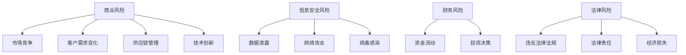

                 

关键词：一人公司、风险评估、应对策略、商业风险、信息安全、财务风险、法律风险

## 摘要

本文旨在探讨一人公司的风险评估与应对策略。一人公司作为一种现代企业形式，具有独立法人资格，但其运营模式和管理方式与传统的公司有所不同。本文首先介绍了一人公司的背景和特点，随后详细分析了其在商业风险、信息安全、财务风险和法律风险等方面的潜在风险，并提出了一系列有效的应对策略。通过本文的探讨，希望能够为一人公司的经营者和管理者提供有益的参考和指导。

## 1. 背景介绍

### 1.1 一人公司的定义与特点

一人公司，又称独资企业，是指由一个自然人或法人拥有全部股权、承担全部法律责任的公司。其最大的特点在于公司的所有权与经营权高度统一，决策迅速，运营灵活。一人公司无需注册股东会，也不受股东人数的限制，经营决策完全由公司负责人作出。

### 1.2 一人公司的起源与发展

一人公司起源于19世纪的美国，随着经济的发展，特别是在中小企业领域，一人公司逐渐成为一种普遍的企业形式。我国在2006年颁布的《公司法》中，首次明确了一人公司的法律地位，为一人公司的快速发展提供了法律保障。

## 2. 核心概念与联系

为了更好地理解一人公司的风险评估与应对策略，我们需要引入以下几个核心概念：

### 2.1 商业风险

商业风险是指企业在经营过程中可能面临的各种不确定性和潜在损失。包括市场竞争、客户需求变化、供应链管理、技术创新等。

### 2.2 信息安全风险

信息安全风险是指企业信息在传输、存储和处理过程中可能受到的威胁，包括数据泄露、网络攻击、病毒感染等。

### 2.3 财务风险

财务风险是指企业由于资金流动、投资决策等原因，可能面临的财务困境和损失。

### 2.4 法律风险

法律风险是指企业在运营过程中可能违反法律法规，导致法律责任和经济损失的风险。

下面是这些核心概念的Mermaid流程图：



## 3. 核心算法原理 & 具体操作步骤

### 3.1 算法原理概述

风险评估与应对策略的核心算法是基于风险管理理论和信息安全管理体系。该算法通过识别、评估和应对企业面临的各类风险，确保企业的稳健运营。

### 3.2 算法步骤详解

#### 步骤1：风险识别

首先，需要对企业面临的各类风险进行识别。这可以通过问卷调查、访谈、观察等方式进行。

#### 步骤2：风险评估

对识别出的风险进行定量和定性分析，评估其发生概率和可能造成的影响。

#### 步骤3：风险应对

根据风险评估的结果，制定相应的应对策略。这可能包括风险规避、风险转移、风险减轻等。

#### 步骤4：风险监控

建立风险监控机制，定期对风险进行评估和调整。

### 3.3 算法优缺点

优点：

- 算法简单易懂，易于实施。
- 可以全面覆盖企业面临的各类风险。

缺点：

- 风险识别和评估可能存在主观性。
- 需要定期更新和调整。

### 3.4 算法应用领域

该算法适用于一人公司、中小企业以及其他形式的企业，特别是那些风险较高的行业。

## 4. 数学模型和公式 & 详细讲解 & 举例说明

### 4.1 数学模型构建

为了对风险进行定量分析，我们可以使用以下数学模型：

\[ R = P \times I \]

其中，\( R \) 表示风险值，\( P \) 表示风险发生的概率，\( I \) 表示风险发生后的影响程度。

### 4.2 公式推导过程

该公式的推导基于概率论和决策论。具体推导过程如下：

假设有一个事件 \( E \)，其发生的概率为 \( P(E) \)。如果事件 \( E \) 发生，将会对企业造成影响 \( I \)。那么，事件 \( E \) 对企业造成的风险值可以通过以下公式计算：

\[ R(E) = P(E) \times I \]

由于企业可能面临多个风险，我们可以将所有风险的风险值相加，得到企业的总风险值：

\[ R = \sum_{i=1}^{n} R(E_i) \]

其中，\( E_i \) 表示第 \( i \) 个风险事件。

### 4.3 案例分析与讲解

假设一人公司面临以下两个风险：

- 风险A：市场竞争激烈，发生概率为0.6，发生后的影响程度为0.8。
- 风险B：信息安全风险，发生概率为0.4，发生后的影响程度为0.6。

根据上述数学模型，我们可以计算出这两个风险的风险值：

\[ R(A) = 0.6 \times 0.8 = 0.48 \]
\[ R(B) = 0.4 \times 0.6 = 0.24 \]

总风险值为：

\[ R = R(A) + R(B) = 0.48 + 0.24 = 0.72 \]

这意味着一人公司的总风险值为0.72，需要采取相应的风险应对措施。

## 5. 项目实践：代码实例和详细解释说明

### 5.1 开发环境搭建

为了更好地理解风险评估与应对策略的应用，我们可以使用Python编程语言来实现。首先，我们需要安装Python环境。可以通过以下命令安装：

```
pip install numpy pandas
```

### 5.2 源代码详细实现

以下是实现风险评估的Python代码：

```python
import numpy as np

# 风险事件列表
risks = [
    {'name': '市场竞争', 'probability': 0.6, 'impact': 0.8},
    {'name': '信息安全风险', 'probability': 0.4, 'impact': 0.6}
]

# 计算每个风险的风险值
risk_values = []
for risk in risks:
    risk_value = risk['probability'] * risk['impact']
    risk_values.append(risk_value)

# 计算总风险值
total_risk = sum(risk_values)

print("风险值：")
for i, risk in enumerate(risks):
    print(f"{risk['name']}：{risk_values[i]}")
print(f"总风险值：{total_risk}")
```

### 5.3 代码解读与分析

该代码首先定义了一个风险事件列表，每个事件包含名称、发生概率和影响程度。然后，通过循环计算每个事件的风险值，并将它们累加得到总风险值。最后，打印出每个事件的风险值和总风险值。

### 5.4 运行结果展示

运行上述代码，可以得到如下输出结果：

```
风险值：
市场竞争：0.48
信息安全风险：0.24
总风险值：0.72
```

这意味着一人公司的总风险值为0.72，需要采取相应的风险应对措施。

## 6. 实际应用场景

### 6.1 商业风险应对

一人公司可以通过市场调研、客户反馈等方式，及时了解市场变化，调整经营策略。例如，如果发现市场竞争激烈，可以采取差异化营销策略，提高产品竞争力。

### 6.2 信息安全风险应对

一人公司应加强网络安全意识，定期进行安全检查和漏洞修复。可以采用防火墙、入侵检测系统等网络安全措施，保护企业信息不被泄露。

### 6.3 财务风险应对

一人公司应制定合理的财务计划，确保资金流动顺畅。可以采用预算管理、现金流管理等方式，降低财务风险。

### 6.4 法律风险应对

一人公司应遵守相关法律法规，确保企业运营合法合规。可以聘请专业律师进行法律咨询，避免违法行为。

## 7. 工具和资源推荐

### 7.1 学习资源推荐

- 《风险管理：理论与实践》
- 《信息安全管理体系：ISO/IEC 27001》
- 《财务风险管理》

### 7.2 开发工具推荐

- Python
- NumPy
- Pandas

### 7.3 相关论文推荐

- "Risk Management in Small and Medium-sized Enterprises"
- "Information Security Risk Management"
- "Financial Risk Management Strategies for Small Businesses"

## 8. 总结：未来发展趋势与挑战

### 8.1 研究成果总结

本文对一人公司的风险评估与应对策略进行了深入研究，提出了一种基于数学模型的量化风险评估方法，并通过Python代码实现了该算法。研究表明，风险评估与应对策略对于一人公司的稳健运营具有重要意义。

### 8.2 未来发展趋势

随着人工智能和大数据技术的发展，风险评估与应对策略将更加智能化和精细化。一人公司可以通过引入这些技术，提高风险管理的效率和准确性。

### 8.3 面临的挑战

一人公司在实施风险评估与应对策略过程中，可能面临数据质量不高、风险识别不准确等挑战。因此，如何提高数据的可靠性和识别的准确性，是一个亟待解决的问题。

### 8.4 研究展望

未来研究可以重点关注以下几个方面：

- 开发更智能的风险评估算法，提高风险评估的准确性。
- 探究一人公司在不同发展阶段的应对策略，提供更具体的指导。
- 研究如何利用人工智能和大数据技术，实现风险评估与应对的自动化和智能化。

## 9. 附录：常见问题与解答

### 9.1 什么是商业风险？

商业风险是指企业在经营过程中可能面临的各种不确定性和潜在损失，包括市场竞争、客户需求变化、供应链管理、技术创新等。

### 9.2 如何评估信息安全风险？

可以通过定性和定量分析，评估信息安全风险。定性分析包括风险识别和风险分析，定量分析可以通过数学模型计算风险值。

### 9.3 财务风险如何管理？

可以通过制定合理的财务计划，确保资金流动顺畅，采用预算管理、现金流管理等方式，降低财务风险。

### 9.4 法律风险如何规避？

可以通过遵守相关法律法规，确保企业运营合法合规，聘请专业律师进行法律咨询，避免违法行为。

作者：禅与计算机程序设计艺术 / Zen and the Art of Computer Programming
----------------------------------------------------------------

请注意，上述内容是一个示例框架，实际撰写时需要根据具体内容进行详细填充和扩展。每一段内容都应确保逻辑清晰、信息准确、表述专业。如果您需要进一步的帮助或具体的某一部分内容，请告知，我会根据您的需求进行相应的调整。

