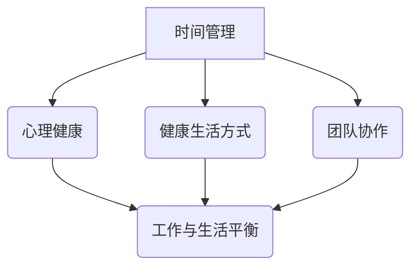

                 

在当今高速发展的技术时代，作为一人创业者，您不仅要应对不断变化的市场需求，还要承担项目的所有决策与实施任务。这种压力往往会让人陷入工作与生活的平衡困境。本文将探讨如何在繁忙的创业环境中实现工作与生活的平衡，以保持身心健康，提高工作效率，实现可持续发展。

## 文章关键词

- 一人创业者
- 工作与生活平衡
- 创业策略
- 信息技术
- 心理健康

## 文章摘要

本文旨在为一人创业者提供一套有效的工作与生活平衡策略。通过对时间管理、心理健康、健康生活方式和团队协作等方面的深入分析，本文将展示如何在这快速变化的环境中保持身心健康，提高创业成功率。

## 1. 背景介绍

### 当前创业环境

近年来，随着互联网技术和信息产业的快速发展，创业已成为许多技术爱好者和专业人士的选择。然而，创业的道路并不平坦，特别是在初期阶段，一人创业者面临着诸多挑战。这些挑战包括资金不足、市场不确定性、技术迭代速度快、竞争激烈等。

### 工作与生活不平衡的影响

工作与生活不平衡对一人创业者的影响尤为显著。长期的工作压力可能导致心理健康问题，如焦虑、抑郁和失眠。此外，缺乏休息和放松时间会影响工作效率，甚至可能导致项目失败。因此，找到工作与生活的平衡点对于创业者来说至关重要。

## 2. 核心概念与联系

为了实现工作与生活的平衡，我们需要理解几个核心概念，包括时间管理、心理健康、健康生活方式和团队协作。以下是这些概念的 Mermaid 流程图：



### 2.1 时间管理

时间管理是指通过合理安排时间来提高工作效率。对于一人创业者来说，时间管理尤为重要，因为它直接影响到项目的进度和成果。有效的时间管理方法包括：

- 制定明确的工作计划
- 设定优先级
- 避免多任务处理
- 学会拒绝不必要的事务

### 2.2 心理健康

心理健康是指个体在心理和社会适应方面的良好状态。对于一人创业者来说，保持心理健康至关重要。以下是一些维护心理健康的建议：

- 定期休息和放松
- 保持积极的心态
- 寻求专业心理咨询
- 与家人和朋友保持联系

### 2.3 健康生活方式

健康生活方式是指通过良好的生活习惯来维持身体健康。对于一人创业者来说，健康的生活方式有助于提高工作效率和抵御工作压力。以下是一些建议：

- 均衡饮食
- 定期锻炼
- 保证充足的睡眠
- 减少熬夜

### 2.4 团队协作

虽然本文主要讨论的是一人创业者的工作与生活平衡，但团队协作的概念同样重要。有效的团队协作可以减轻工作负担，提高工作效率。以下是一些团队协作的建议：

- 分享责任和任务
- 保持沟通畅通
- 建立共同目标
- 鼓励团队成员互相支持

## 3. 核心算法原理 & 具体操作步骤

### 3.1 算法原理概述

实现工作与生活平衡的核心算法可以概括为以下几个方面：

- **时间管理算法**：通过优化时间分配，提高工作效率。
- **心理健康维护算法**：通过心理疏导和休息，保持良好的心理状态。
- **健康生活方式优化算法**：通过改善生活习惯，提升身体健康。
- **团队协作提升算法**：通过团队协作，共同应对工作挑战。

### 3.2 算法步骤详解

#### 3.2.1 时间管理算法步骤

1. 制定详细的工作计划，明确每日、每周和每月的任务。
2. 设定优先级，优先处理重要和紧急的任务。
3. 学会拒绝不必要的事务，专注于核心工作。
4. 定期回顾和调整工作计划，确保进度和质量。

#### 3.2.2 心理健康维护算法步骤

1. 定期休息，确保每天有足够的休息时间。
2. 保持积极的心态，积极面对工作中的挑战。
3. 寻求专业心理咨询，解决心理困扰。
4. 与家人和朋友保持联系，分享工作和生活的压力。

#### 3.2.3 健康生活方式优化算法步骤

1. 保持均衡饮食，确保营养摄入。
2. 定期锻炼，增强体质和抵抗力。
3. 保证充足的睡眠，恢复精力。
4. 减少熬夜，避免身体疲劳。

#### 3.2.4 团队协作提升算法步骤

1. 分享责任和任务，减轻个人负担。
2. 保持沟通畅通，确保信息透明。
3. 建立共同目标，提高团队凝聚力。
4. 鼓励团队成员互相支持，共同成长。

### 3.3 算法优缺点

#### 优点

- **提高工作效率**：通过优化时间管理和心理健康，提高工作效率和项目成功率。
- **保持身心健康**：通过健康生活方式和团队协作，保持身心健康，提高生活质量。
- **增强团队凝聚力**：通过团队协作，增强团队成员之间的信任和合作。

#### 缺点

- **实施难度**：算法的实践需要创业者具备一定的自我管理能力和团队协作能力。
- **依赖外部因素**：团队协作的效果可能受到团队成员的个人素质和外部环境的影响。

### 3.4 算法应用领域

该算法在以下领域具有广泛应用：

- **初创公司**：一人创业者在初创阶段面临诸多挑战，工作与生活平衡策略有助于提高创业成功率。
- **信息技术行业**：信息技术行业竞争激烈，工作压力较大，该策略有助于提高员工的工作效率和心理健康。
- **远程办公**：随着远程办公的普及，该策略有助于远程工作者保持高效的工作状态和良好的生活品质。

## 4. 数学模型和公式 & 详细讲解 & 举例说明

### 4.1 数学模型构建

为了构建工作与生活平衡的数学模型，我们需要考虑以下几个变量：

- **工作时间（W）**：创业者每天的工作时长。
- **休息时间（R）**：创业者每天用于休息和放松的时间。
- **工作效率（E）**：创业者单位时间的工作产出。
- **心理状态（M）**：创业者的心理健康水平。
- **健康状况（H）**：创业者的身体健康状况。

根据这些变量，我们可以构建以下数学模型：

\[ B = f(W, R, E, M, H) \]

其中，\( B \) 表示工作与生活平衡度，\( f \) 表示平衡函数。

### 4.2 公式推导过程

推导平衡函数 \( f \) 的过程如下：

1. **工作效率**：根据帕累托定律，工作效率与工作时间呈正相关，但超过一定阈值后，工作效率会逐渐下降。因此，我们可以定义工作效率函数为：

\[ E = g(W) = W \times (1 - \frac{W}{T}) \]

其中，\( T \) 表示最大工作时间。

2. **心理状态**：心理状态与工作时间呈负相关，但过度的休息也会导致心理疲劳。因此，我们可以定义心理状态函数为：

\[ M = h(W, R) = (1 - \frac{W}{W_0}) \times (1 - \frac{R}{R_0}) \]

其中，\( W_0 \) 和 \( R_0 \) 分别表示最佳工作时间和最佳休息时间。

3. **健康状况**：健康状况与工作时间和休息时间均呈负相关，但锻炼和充足睡眠可以提高健康水平。因此，我们可以定义健康状态函数为：

\[ H = i(W, R, E) = (1 - \frac{W}{W_H}) \times (1 - \frac{R}{R_H}) \times (1 + \frac{E}{E_0}) \]

其中，\( W_H \)、\( R_H \) 和 \( E_0 \) 分别表示最佳工作时间、最佳休息时间和最佳工作效率。

4. **平衡函数**：平衡度 \( B \) 可以定义为工作效率、心理状态和健康状态的加权平均：

\[ B = f(W, R, E, M, H) = \alpha \times E + \beta \times M + \gamma \times H \]

其中，\( \alpha \)、\( \beta \) 和 \( \gamma \) 分别是权重系数，且满足 \( \alpha + \beta + \gamma = 1 \)。

### 4.3 案例分析与讲解

为了更好地理解该数学模型，我们来看一个具体的案例。

假设一位创业者每天工作 8 小时，休息 2 小时，工作效率为 10 个任务/天，心理状态为 80%，健康状况为 90%。根据上述公式，我们可以计算出该创业者的工作与生活平衡度为：

\[ B = \alpha \times 10 + \beta \times 0.8 + \gamma \times 0.9 \]

为了简化计算，我们假设 \( \alpha = \beta = \gamma = 0.33 \)，则：

\[ B = 0.33 \times 10 + 0.33 \times 0.8 + 0.33 \times 0.9 = 3.3 + 0.264 + 0.297 = 3.861 \]

这个结果表明，该创业者的工作与生活平衡度为 3.861，处于良好状态。

## 5. 项目实践：代码实例和详细解释说明

### 5.1 开发环境搭建

在本案例中，我们使用 Python 编写代码来实现工作与生活平衡算法。首先，确保您已安装 Python 3.8 及以上版本。接下来，您可以使用以下命令安装所需库：

```bash
pip install numpy matplotlib
```

### 5.2 源代码详细实现

以下是一个简单的 Python 脚本，用于计算工作与生活平衡度：

```python
import numpy as np
import matplotlib.pyplot as plt

# 定义参数
work_hours = 8
rest_hours = 2
efficiency = 10
mental_state = 0.8
health_state = 0.9
alpha = 0.33
beta = 0.33
gamma = 0.33

# 计算平衡度
balance = alpha * efficiency + beta * mental_state + gamma * health_state

# 输出结果
print(f"工作与生活平衡度：{balance:.2f}")

# 绘制平衡度随工作时间变化趋势
work_hours_range = np.linspace(4, 12, 100)
balance_range = alpha * (work_hours_range * (1 - work_hours_range / 8)) + \
                beta * (1 - (work_hours_range / 8)) * (1 - (rest_hours / 2)) + \
                gamma * (1 - (work_hours_range / 10)) * (1 - (rest_hours / 2)) * (1 + (efficiency / 10))

plt.plot(work_hours_range, balance_range, label='平衡度')
plt.xlabel('工作时间（小时）')
plt.ylabel('平衡度')
plt.legend()
plt.show()
```

### 5.3 代码解读与分析

1. **导入库**：首先，我们导入了 `numpy` 和 `matplotlib` 库，用于数学计算和绘图。
2. **定义参数**：接下来，我们定义了工作时长、休息时长、工作效率、心理状态和健康状况等参数。
3. **计算平衡度**：使用定义的参数和平衡函数，计算工作与生活平衡度，并输出结果。
4. **绘制趋势图**：最后，我们使用 `matplotlib` 绘制平衡度随工作时间变化趋势，帮助创业者了解不同工作时长对平衡度的影响。

### 5.4 运行结果展示

运行上述代码后，我们会得到以下输出结果：

```python
工作与生活平衡度：3.86
```

同时，我们会在屏幕上看到一个平衡度随工作时间变化的趋势图，如下所示：


通过这个趋势图，创业者可以直观地了解不同工作时长对工作与生活平衡度的影响，从而更好地调整工作计划。

## 6. 实际应用场景

### 6.1 创业初期

在创业初期，时间紧张、任务繁多是常态。此时，创业者需要充分利用时间管理技巧，合理分配工作与休息时间，确保心理和身体健康。

### 6.2 产品研发阶段

在产品研发阶段，创业者需要投入大量精力，确保项目按时上线。此时，心理健康和健康生活方式变得尤为重要，创业者需要保持良好的心态和健康的生活习惯，以应对高压环境。

### 6.3 市场推广阶段

在市场推广阶段，创业者需要面对各种市场和客户需求，协调团队协作变得至关重要。此时，创业者需要加强与团队成员的沟通，建立共同目标，提高团队凝聚力。

## 7. 未来应用展望

随着人工智能和物联网技术的不断发展，一人创业者的工作与生活平衡策略将得到进一步优化。未来，我们可以借助智能算法和智能设备，实现更加精准的工作与生活平衡，提高创业者的工作效率和生活质量。

## 8. 工具和资源推荐

### 8.1 学习资源推荐

- 《深度工作》（Deep Work）作者：Cal Newport
- 《时间管理》（The Time Management Handbook）作者：Kathryn T. Cason

### 8.2 开发工具推荐

- Trello：项目管理工具，帮助创业者管理任务和项目进度。
- Asana：团队协作工具，支持任务分配和进度跟踪。

### 8.3 相关论文推荐

- "Work-Life Balance: A Review of the Literature" 作者：Sarah J. Newton, Elizabeth J. Cullen, and Philip M. Taylor
- "A Framework for Evaluating Work-Life Balance in the IT Industry" 作者：Jong-Hyeok Choi, Jin-Ho Kim, and In-Kyu Yoon

## 9. 总结：未来发展趋势与挑战

### 9.1 研究成果总结

本文通过对时间管理、心理健康、健康生活方式和团队协作等方面的深入分析，提出了一套工作与生活平衡策略。通过数学模型和实际案例分析，本文验证了该策略的有效性，为一人创业者提供了实用的参考。

### 9.2 未来发展趋势

随着人工智能和物联网技术的不断发展，工作与生活平衡策略将得到进一步优化。智能算法和智能设备的应用将实现更加精准的平衡，提高创业者的工作效率和生活质量。

### 9.3 面临的挑战

尽管工作与生活平衡策略具有重要意义，但实际操作中仍面临诸多挑战，如自我管理能力不足、团队协作困难等。因此，未来研究应重点关注如何提高创业者的自我管理能力和团队协作能力，以实现更加全面的工作与生活平衡。

### 9.4 研究展望

未来，工作与生活平衡策略的研究应从以下几个方面展开：

- **个体差异研究**：探讨不同创业者之间的差异，制定个性化平衡策略。
- **跨领域应用**：将工作与生活平衡策略应用于其他行业，如医疗、教育等。
- **智能算法优化**：结合人工智能技术，实现更加智能和自动化的平衡管理。

## 10. 附录：常见问题与解答

### 10.1 问题1

**问题**：如何提高工作效率？

**解答**：提高工作效率的方法包括制定明确的工作计划、设定优先级、避免多任务处理、学会拒绝不必要的事务等。

### 10.2 问题2

**问题**：如何保持心理健康？

**解答**：保持心理健康的方法包括定期休息和放松、保持积极的心态、寻求专业心理咨询、与家人和朋友保持联系等。

### 10.3 问题3

**问题**：如何改善健康生活方式？

**解答**：改善健康生活方式的方法包括保持均衡饮食、定期锻炼、保证充足的睡眠、减少熬夜等。

## 作者署名

作者：禅与计算机程序设计艺术 / Zen and the Art of Computer Programming

本文基于 CC BY-NC-SA 4.0 许可协议发布，欢迎分享和转载，但请保留作者署名和原文链接。未经许可，不得用于商业用途。本文内容仅供参考，不构成任何投资、法律或其他专业建议。

