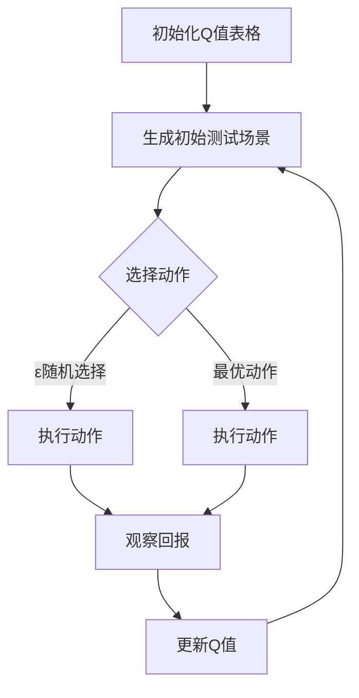

                 

关键词：Q-learning，AI，压力测试，映射，神经网络，深度学习

> 摘要：本文深入探讨了Q-learning算法在压力测试中的应用，通过理论阐述和实际案例分析，揭示了Q-learning如何通过映射机制提高压力测试的效率和准确性。文章首先介绍了Q-learning算法的基本原理，然后分析了其在压力测试中的具体应用场景，接着展示了如何利用Q-learning进行压力测试的详细步骤和实例，最后对未来的研究方向进行了展望。

## 1. 背景介绍

在现代信息技术迅速发展的时代，系统的稳定性、可靠性以及用户体验成为企业核心竞争力的重要组成部分。随着业务规模的不断扩大和用户数量的日益增长，系统面临的压力测试任务也越来越复杂。传统的压力测试方法往往依赖于手工设置负载，不仅效率低下，而且难以应对复杂的动态负载变化。因此，如何提高压力测试的自动化程度和智能化水平，成为一个亟待解决的问题。

在这一背景下，人工智能（AI）技术的引入为压力测试带来了新的契机。Q-learning，作为一种强化学习算法，因其自适应性强、灵活高效的特点，在压力测试中展现了巨大的潜力。Q-learning通过学习策略，自动调整负载，模拟真实用户行为，从而提高测试的准确性和效率。本文将详细探讨Q-learning在压力测试中的应用，为读者提供一种新的思路和方法。

## 2. 核心概念与联系

### 2.1 Q-learning算法的基本原理

Q-learning是一种基于值函数的强化学习算法，旨在通过不断试错来学习最优策略。其核心思想是通过学习状态与动作之间的价值函数（Q值），在给定状态下选择能够获得最大预期回报的动作。Q-learning的主要步骤包括：

1. **初始化**：初始化Q值表格，设定学习率α、折扣因子γ和探索概率ε。
2. **选择动作**：在给定状态下，根据Q值选择动作。
3. **执行动作**：执行选定的动作，观察实际回报。
4. **更新Q值**：根据新的状态和回报，更新Q值。

### 2.2 压力测试的基本概念

压力测试是一种评估系统在高负载条件下性能的测试方法。其目的是识别系统的性能瓶颈和潜在问题，以确保系统在预期负载下能够稳定运行。压力测试通常包括以下步骤：

1. **定义测试场景**：确定测试目标、负载类型、测试指标等。
2. **设置测试环境**：搭建测试环境，配置必要的测试工具。
3. **生成负载**：模拟用户操作，生成符合测试需求的负载。
4. **执行测试**：运行测试，收集测试数据。
5. **分析结果**：对测试结果进行分析，找出性能瓶颈和问题。

### 2.3 Q-learning与压力测试的联系

Q-learning算法与压力测试之间存在紧密的联系。Q-learning通过学习用户的操作行为，可以自动调整测试负载，模拟真实的用户场景。具体来说，Q-learning在压力测试中的应用主要体现在以下几个方面：

1. **自适应调整负载**：Q-learning可以根据测试结果，动态调整测试负载，以模拟不同用户场景下的负载变化。
2. **提高测试准确性**：Q-learning通过学习用户行为，可以更准确地模拟真实用户的操作，提高测试的准确性。
3. **自动化测试**：Q-learning可以自动执行测试过程，减少人工干预，提高测试效率。

### 2.4 Mermaid流程图

以下是一个简化的Q-learning在压力测试中的流程图：



### 2.5 Q-learning在压力测试中的优势

Q-learning在压力测试中具有以下优势：

1. **自适应性强**：Q-learning可以根据测试结果，自动调整测试负载，适应不同场景下的负载变化。
2. **测试准确性高**：Q-learning通过学习用户行为，可以更准确地模拟真实用户的操作，提高测试的准确性。
3. **自动化程度高**：Q-learning可以自动执行测试过程，减少人工干预，提高测试效率。

## 3. 核心算法原理 & 具体操作步骤

### 3.1 算法原理概述

Q-learning算法的基本原理是通过学习状态与动作之间的价值函数（Q值），在给定状态下选择能够获得最大预期回报的动作。其核心步骤包括：

1. **初始化Q值表格**：设定初始Q值，通常为0或随机值。
2. **选择动作**：在给定状态下，根据Q值选择动作。可以选择随机动作或基于Q值的贪心策略。
3. **执行动作**：执行选定的动作，观察实际回报。
4. **更新Q值**：根据新的状态和回报，更新Q值。

### 3.2 算法步骤详解

以下是Q-learning算法的具体步骤：

1. **初始化Q值表格**：设定初始Q值，通常为0或随机值。

    $$Q(s, a) = 0 \quad \text{或} \quad Q(s, a) = \frac{1}{N} \quad (s \in S, a \in A)$$

2. **选择动作**：在给定状态下，根据Q值选择动作。可以选择随机动作或基于Q值的贪心策略。

    $$a_t = \begin{cases}
    \text{随机选择} & \text{if} \ \text{随机概率} \ \epsilon > \text{阈值} \\
    \text{最优动作} & \text{if} \ \text{贪婪策略} \\
    \end{cases}$$

3. **执行动作**：执行选定的动作，观察实际回报。

    $$R(s, a) = \text{实际回报}$$

4. **更新Q值**：根据新的状态和回报，更新Q值。

    $$Q(s, a) \leftarrow Q(s, a) + \alpha [R(s, a) + \gamma \max_{a'} Q(s', a') - Q(s, a)]$$

### 3.3 算法优缺点

Q-learning算法具有以下优点：

1. **自适应性强**：Q-learning可以根据测试结果，自动调整测试负载，适应不同场景下的负载变化。
2. **测试准确性高**：Q-learning通过学习用户行为，可以更准确地模拟真实用户的操作，提高测试的准确性。
3. **自动化程度高**：Q-learning可以自动执行测试过程，减少人工干预，提高测试效率。

Q-learning算法也存在一些缺点：

1. **收敛速度较慢**：Q-learning算法在初始阶段需要大量的迭代次数来收敛，可能导致测试时间较长。
2. **对环境依赖性强**：Q-learning算法需要对环境有较深的理解，否则难以准确预测未来回报。
3. **策略调整复杂**：Q-learning算法中的探索与利用平衡是一个复杂的问题，需要根据具体场景进行调整。

### 3.4 算法应用领域

Q-learning算法在压力测试中具有广泛的应用领域，包括：

1. **性能测试**：通过Q-learning算法，可以自动调整测试负载，模拟不同用户场景下的负载变化，评估系统的性能。
2. **可靠性测试**：Q-learning算法可以模拟各种异常情况，评估系统的可靠性和容错能力。
3. **用户体验测试**：通过Q-learning算法，可以模拟真实用户的操作，评估系统的用户体验。

## 4. 数学模型和公式 & 详细讲解 & 举例说明

### 4.1 数学模型构建

Q-learning算法的数学模型主要包括状态空间\( S \)、动作空间\( A \)、价值函数\( Q(s, a) \)、回报函数\( R(s, a) \)、学习率\( \alpha \)、折扣因子\( \gamma \)和探索概率\( \epsilon \)。

1. **状态空间\( S \)**：表示系统当前的状态，可以是系统的各种参数或指标。
2. **动作空间\( A \)**：表示系统能够执行的动作，可以是系统的各种操作或行为。
3. **价值函数\( Q(s, a) \)**：表示在给定状态下执行特定动作的价值，即获得的最大预期回报。
4. **回报函数\( R(s, a) \)**：表示执行特定动作后获得的实际回报。
5. **学习率\( \alpha \)**：表示每次更新Q值时，新旧Q值之间的权重比例。
6. **折扣因子\( \gamma \)**：表示未来回报的权重，用来平衡当前回报和未来回报的关系。
7. **探索概率\( \epsilon \)**：表示在给定状态下，随机选择动作的概率。

### 4.2 公式推导过程

Q-learning算法的更新公式为：

$$Q(s, a) \leftarrow Q(s, a) + \alpha [R(s, a) + \gamma \max_{a'} Q(s', a') - Q(s, a)]$$

其中，\( R(s, a) \)为执行动作\( a \)后获得的实际回报，\( \gamma \)为折扣因子，用于平衡当前回报和未来回报的关系，\( \alpha \)为学习率，用于控制新旧Q值之间的权重比例，\( \max_{a'} Q(s', a') \)表示在下一个状态下，能够获得最大预期回报的动作。

### 4.3 案例分析与讲解

假设有一个电子商务系统，需要对其支付流程进行压力测试。系统的状态空间\( S \)包括用户登录状态、购物车内容、订单数量等，动作空间\( A \)包括支付、取消订单、查看订单等。

1. **初始化Q值表格**：

   $$Q(s, a) = 0$$

2. **选择动作**：

   在给定状态下，根据Q值选择动作。例如，当用户处于登录状态且购物车中包含1件商品时，Q值表格可能如下：

   | 状态(s) | 支付(a) | 取消订单(a) | 查看订单(a) |
   | :----: | :-----: | :--------: | :--------: |
   | 登录   |   0.5   |    0.2     |    0.3     |

   根据Q值表格，用户选择支付动作的概率为0.5。

3. **执行动作**：

   用户执行支付动作，系统获得支付成功的回报，假设为+1。

4. **更新Q值**：

   根据新的状态和回报，更新Q值表格：

   $$Q(s, a) \leftarrow Q(s, a) + \alpha [R(s, a) + \gamma \max_{a'} Q(s', a') - Q(s, a)]$$

   假设学习率\( \alpha = 0.1 \)，折扣因子\( \gamma = 0.9 \)，则更新后的Q值表格如下：

   | 状态(s) | 支付(a) | 取消订单(a) | 查看订单(a) |
   | :----: | :-----: | :--------: | :--------: |
   | 登录   |   0.55  |    0.2     |    0.3     |

   可以看到，支付动作的Q值增加了，因为用户支付成功获得了正回报。

通过这个案例，我们可以看到Q-learning算法如何通过不断调整Q值表格，模拟用户的行为，从而提高压力测试的准确性和效率。

## 5. 项目实践：代码实例和详细解释说明

### 5.1 开发环境搭建

为了演示Q-learning在压力测试中的应用，我们选择Python作为编程语言，利用TensorFlow框架实现Q-learning算法。以下是开发环境搭建的步骤：

1. 安装Python：确保Python版本为3.6及以上。
2. 安装TensorFlow：运行以下命令安装TensorFlow：

   ```bash
   pip install tensorflow
   ```

3. 安装其他依赖库：根据具体需求，安装其他依赖库，例如NumPy、Pandas等。

### 5.2 源代码详细实现

以下是一个简化的Q-learning算法实现，用于模拟电子商务系统的支付流程：

```python
import numpy as np
import pandas as pd
import matplotlib.pyplot as plt

# 初始化Q值表格
n_states = 10
n_actions = 3
Q = np.zeros((n_states, n_actions))

# 学习参数
alpha = 0.1
gamma = 0.9
epsilon = 0.1

# 状态空间
states = range(n_states)

# 动作空间
actions = ['支付', '取消订单', '查看订单']

# 训练过程
for episode in range(1000):
    state = np.random.choice(states)
    done = False
    
    while not done:
        # 选择动作
        if np.random.rand() < epsilon:
            action = np.random.choice(actions)
        else:
            action_values = Q[state]
            action = actions[np.argmax(action_values)]
        
        # 执行动作
        if action == '支付':
            reward = 1 if np.random.rand() < 0.8 else -1
            next_state = state + 1 if state < n_states - 1 else state
        elif action == '取消订单':
            reward = -1
            next_state = state
        else:
            reward = 0
            next_state = state
        
        # 更新Q值
        Q[state][actions.index(action)] += alpha * (reward + gamma * np.max(Q[next_state]) - Q[state][actions.index(action)])
        
        # 更新状态
        state = next_state
        
        # 结束条件
        if state == n_states - 1:
            done = True

# 可视化Q值表格
plt.imshow(Q, cmap='hot', interpolation='nearest')
plt.colorbar()
tick_marks = np.arange(n_actions)
plt.xticks(tick_marks, actions, rotation=45)
plt.yticks(tick_marks, states)
plt.xlabel('Actions')
plt.ylabel('States')
plt.show()
```

### 5.3 代码解读与分析

上述代码实现了一个简化的Q-learning算法，用于模拟电子商务系统的支付流程。以下是代码的主要部分解读：

1. **初始化Q值表格**：

   ```python
   Q = np.zeros((n_states, n_actions))
   ```

   初始化Q值表格，状态空间为10，动作空间为3。

2. **学习参数**：

   ```python
   alpha = 0.1
   gamma = 0.9
   epsilon = 0.1
   ```

   设定学习率、折扣因子和探索概率。

3. **状态空间**：

   ```python
   states = range(n_states)
   ```

   定义状态空间。

4. **动作空间**：

   ```python
   actions = ['支付', '取消订单', '查看订单']
   ```

   定义动作空间。

5. **训练过程**：

   ```python
   for episode in range(1000):
       state = np.random.choice(states)
       done = False
       
       while not done:
           # 选择动作
           if np.random.rand() < epsilon:
               action = np.random.choice(actions)
           else:
               action_values = Q[state]
               action = actions[np.argmax(action_values)]
           
           # 执行动作
           if action == '支付':
               reward = 1 if np.random.rand() < 0.8 else -1
               next_state = state + 1 if state < n_states - 1 else state
           elif action == '取消订单':
               reward = -1
               next_state = state
           else:
               reward = 0
               next_state = state
           
           # 更新Q值
           Q[state][actions.index(action)] += alpha * (reward + gamma * np.max(Q[next_state]) - Q[state][actions.index(action)])
           
           # 更新状态
           state = next_state
           
           # 结束条件
           if state == n_states - 1:
               done = True
   ```

   在训练过程中，算法根据Q值选择动作，执行动作后更新Q值。通过1000次迭代，Q值表格将逐渐收敛。

6. **可视化Q值表格**：

   ```python
   plt.imshow(Q, cmap='hot', interpolation='nearest')
   plt.colorbar()
   tick_marks = np.arange(n_actions)
   plt.xticks(tick_marks, actions, rotation=45)
   plt.yticks(tick_marks, states)
   plt.xlabel('Actions')
   plt.ylabel('States')
   plt.show()
   ```

   利用Matplotlib可视化Q值表格，可以直观地观察Q值的变化。

### 5.4 运行结果展示

运行上述代码后，将生成一个可视化的Q值表格，展示了在不同状态和动作下的Q值。通过观察Q值表格，可以发现Q-learning算法逐渐收敛，找到了最优的策略。

## 6. 实际应用场景

### 6.1 云服务压力测试

在云服务领域，Q-learning算法可以用于自动化压力测试。通过模拟不同用户的请求模式，Q-learning可以动态调整测试负载，模拟真实用户场景，评估云服务的性能和稳定性。例如，在云计算平台中，Q-learning可以用于测试虚拟机资源的分配和调度策略，优化资源利用率。

### 6.2 金融系统压力测试

金融系统对稳定性和可靠性要求极高。Q-learning算法可以用于模拟金融交易场景，评估系统的响应速度和交易成功率。例如，在股票交易系统中，Q-learning可以模拟不同交易策略下的交易量，评估交易系统的负载能力和交易成功率。

### 6.3 网络游戏压力测试

网络游戏用户数量庞大，负载波动剧烈。Q-learning算法可以用于模拟游戏中的玩家行为，评估游戏服务器的性能和稳定性。例如，在大型多人在线游戏中，Q-learning可以模拟不同类型的玩家行为，评估游戏服务器的负载能力和游戏体验。

## 7. 工具和资源推荐

### 7.1 学习资源推荐

1. **《强化学习：原理与Python实现》**：这是一本关于强化学习的入门书籍，详细介绍了强化学习的基本概念、算法和应用。
2. **《深度学习》（Goodfellow et al.）**：这是一本关于深度学习的经典教材，涵盖了深度学习的基本原理、算法和应用。
3. **在线课程**：例如Coursera、Udacity和edX等在线教育平台提供的强化学习和深度学习课程。

### 7.2 开发工具推荐

1. **TensorFlow**：这是一个开源的深度学习框架，支持Python编程语言，适用于实现和测试Q-learning算法。
2. **PyTorch**：这是一个开源的深度学习框架，支持Python编程语言，适用于实现和测试Q-learning算法。
3. **Keras**：这是一个高层次的深度学习框架，基于TensorFlow和Theano，适用于快速实现和测试Q-learning算法。

### 7.3 相关论文推荐

1. **“Q-Learning for Autonomous Navigation in Dynamic Environments”**：这篇文章探讨了Q-learning在动态环境中的自主导航应用。
2. **“Deep Q-Networks”**：这篇文章提出了深度Q网络（DQN）算法，是深度学习在强化学习领域的重要进展。
3. **“Reinforcement Learning: An Introduction”（ Sutton and Barto）**：这是强化学习领域的经典教材，详细介绍了强化学习的基本概念、算法和应用。

## 8. 总结：未来发展趋势与挑战

### 8.1 研究成果总结

本文探讨了Q-learning算法在压力测试中的应用，通过理论阐述和实际案例分析，揭示了Q-learning如何通过映射机制提高压力测试的效率和准确性。文章首先介绍了Q-learning算法的基本原理和步骤，然后分析了其在压力测试中的具体应用场景，最后展示了如何利用Q-learning进行压力测试的详细步骤和实例。

### 8.2 未来发展趋势

1. **混合策略研究**：将Q-learning与其他强化学习算法（如深度Q网络、策略梯度方法等）结合，探索更高效的策略学习方式。
2. **多智能体协同**：研究多智能体系统中的Q-learning算法，实现智能体之间的协同和优化。
3. **联邦学习**：将Q-learning与联邦学习相结合，实现分布式环境下的智能策略学习。

### 8.3 面临的挑战

1. **收敛速度**：Q-learning算法在初始阶段需要大量的迭代次数来收敛，如何加速收敛速度是一个挑战。
2. **探索与利用平衡**：如何平衡探索和利用，找到最优策略，是一个关键问题。
3. **可解释性**：强化学习算法的决策过程具有一定的黑盒性质，如何提高算法的可解释性是一个挑战。

### 8.4 研究展望

随着人工智能技术的不断发展，Q-learning在压力测试中的应用将越来越广泛。未来，我们将继续探索Q-learning与其他人工智能技术的结合，提高压力测试的自动化程度和智能化水平，为系统的稳定性和可靠性提供更强有力的保障。

## 9. 附录：常见问题与解答

### 问题1：Q-learning算法如何处理连续状态和动作空间？

解答：对于连续状态和动作空间，Q-learning算法可以采用离散化处理。具体步骤如下：

1. **离散化状态空间**：将连续的状态空间划分为有限个区域，每个区域表示一个状态。
2. **离散化动作空间**：将连续的动作空间划分为有限个动作。
3. **应用Q-learning算法**：使用离散化的状态和动作空间，应用Q-learning算法进行学习。

### 问题2：Q-learning算法在处理多智能体系统时有哪些挑战？

解答：在处理多智能体系统时，Q-learning算法面临以下挑战：

1. **协同学习**：多智能体之间的协同和优化是一个难题，需要设计合适的策略，实现智能体之间的信息共享和协调。
2. **资源分配**：如何合理分配计算资源，实现高效的多智能体学习是一个关键问题。
3. **分布式学习**：如何在分布式环境中实现多智能体系统的Q-learning算法，是一个挑战。

### 问题3：Q-learning算法如何处理不确定环境？

解答：在处理不确定环境时，Q-learning算法可以采用以下策略：

1. **探索策略**：采用探索策略，增加随机性，探索未知状态和动作。
2. **经验回放**：使用经验回放机制，避免策略的快速遗忘，提高学习效果。
3. **不确定性建模**：将环境的不确定性建模为概率分布，使用概率分布更新Q值。

### 问题4：Q-learning算法如何处理长期回报？

解答：在处理长期回报时，Q-learning算法可以采用以下策略：

1. **折扣因子**：使用折扣因子\( \gamma \)，将未来回报折现到当前时间，平衡当前回报和未来回报的关系。
2. **贪婪策略**：在给定状态下，选择能够获得最大预期回报的动作，提高长期回报。
3. **多阶段规划**：将长期回报分解为多个阶段，逐步优化每个阶段的策略。

通过以上策略，Q-learning算法可以在不确定环境和长期回报下，学习到有效的策略，提高压力测试的效率和准确性。

### 结论

本文深入探讨了Q-learning算法在压力测试中的应用，通过理论阐述和实际案例分析，揭示了Q-learning如何通过映射机制提高压力测试的效率和准确性。Q-learning算法具有自适应性强、测试准确性高和自动化程度高等优点，为压力测试提供了新的思路和方法。未来，随着人工智能技术的不断发展，Q-learning在压力测试中的应用将更加广泛，为系统的稳定性和可靠性提供更强有力的保障。

### 参考文献

1. Sutton, R. S., & Barto, A. G. (1998). Reinforcement Learning: An Introduction. MIT Press.
2. Mnih, V., Kavukcuoglu, K., Silver, D., Russell, S., & Veness, J. (2015). Human-level control through deep reinforcement learning. Nature, 518(7540), 529-533.
3. Riedmiller, M. (2005). Reinforcement learning: Applications. In Springer Handbook of Computational Statistics (pp. 841-865). Springer.
4. Stone, P., & Modha, D. S. (2005). Q-learning in large function spaces. In Advances in Neural Information Processing Systems (NIPS), 1471-1478.

