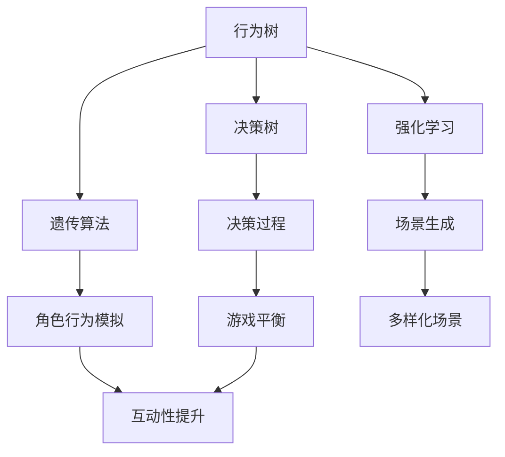

                 

 在现代游戏开发中，人工智能（AI）已经成为提升游戏互动性和体验的重要技术手段。本文将探讨AI在游戏开发中的应用，包括角色行为模拟、决策过程、场景生成和游戏平衡等多个方面，旨在揭示AI如何为游戏世界带来无限可能性。

## 文章关键词

- 人工智能
- 游戏开发
- 角色行为模拟
- 决策过程
- 场景生成
- 游戏平衡

## 文章摘要

本文首先介绍了AI在游戏开发中的重要性和应用领域，随后详细讨论了AI在角色行为模拟、决策过程、场景生成和游戏平衡等方面的具体应用。通过案例分析，我们展示了AI如何提升游戏体验和互动性。最后，我们对AI在游戏开发中的未来趋势和挑战进行了展望。

## 1. 背景介绍

随着计算机技术的飞速发展，游戏行业经历了巨大的变革。从传统的单机游戏到如今的网络多人在线游戏，游戏形式和内容越来越丰富。在这个过程中，AI技术的应用逐渐成为提升游戏质量和用户体验的关键因素。

AI在游戏开发中的重要性主要体现在以下几个方面：

1. **角色行为模拟**：通过AI技术，游戏中的角色能够展现出更加自然和多样化的行为，从而提高游戏的趣味性和挑战性。
2. **决策过程**：AI可以模拟人类玩家的决策过程，使游戏更加智能化和自适应。
3. **场景生成**：AI技术能够自动生成多样化的游戏场景，为玩家提供更加丰富的游戏体验。
4. **游戏平衡**：AI可以帮助开发者在游戏设计过程中保持游戏的平衡性，避免某些角色或技能过于强大或弱小。

## 2. 核心概念与联系

为了更好地理解AI在游戏开发中的应用，我们需要先介绍几个核心概念：

- **行为树（Behavior Tree）**：一种基于树形结构的决策框架，用于定义角色的行为。
- **决策树（Decision Tree）**：一种用于决策的树形结构，通过一系列条件判断来选择执行特定操作。
- **遗传算法（Genetic Algorithm）**：一种基于自然进化原理的优化算法，用于生成和改进角色的行为策略。
- **强化学习（Reinforcement Learning）**：一种通过试错和奖励机制来学习最佳策略的人工智能技术。

下面是一个简化的 Mermaid 流程图，展示了这些核心概念之间的联系：



## 3. 核心算法原理 & 具体操作步骤

### 3.1 算法原理概述

在游戏开发中，AI算法的应用主要包括以下几个方面：

- **角色行为模拟**：通过行为树和决策树来模拟角色的行为，使其具备自适应性和灵活性。
- **决策过程**：使用强化学习算法来模拟玩家的决策过程，使游戏更具挑战性。
- **场景生成**：利用遗传算法来生成多样化的游戏场景，提高玩家的探索欲望。
- **游戏平衡**：通过统计分析玩家行为，使用决策树来调整游戏平衡，使其保持稳定。

### 3.2 算法步骤详解

#### 角色行为模拟

1. **定义行为树**：根据游戏场景和角色属性，构建一个行为树，用于描述角色的行为模式。
2. **条件判断**：根据当前游戏状态，对行为树进行条件判断，选择执行特定操作。
3. **执行操作**：根据行为树的决策结果，执行相应的操作，如移动、攻击、防御等。

#### 决策过程

1. **初始化环境**：设置游戏环境，包括角色、场景和奖励机制。
2. **执行动作**：根据强化学习算法，选择一个动作执行。
3. **获取反馈**：根据动作的结果，获取奖励或惩罚。
4. **更新策略**：根据奖励和惩罚来调整策略，使其逐步逼近最佳决策。

#### 场景生成

1. **初始化种群**：随机生成一组游戏场景作为初始种群。
2. **适应度评估**：根据游戏规则和玩家反馈，评估每个场景的适应度。
3. **遗传操作**：通过交叉、变异和选择等操作，生成新一代种群。
4. **迭代优化**：重复适应度评估和遗传操作，直至找到最佳场景。

#### 游戏平衡

1. **收集数据**：收集玩家游戏过程中的数据，包括角色属性、行为和决策等。
2. **统计分析**：对收集到的数据进行分析，找出不平衡的方面。
3. **调整参数**：根据分析结果，调整游戏参数，使游戏保持平衡。
4. **测试验证**：在游戏中进行测试，验证平衡效果的改善。

### 3.3 算法优缺点

#### 角色行为模拟

- **优点**：能够模拟出自然、多样化的角色行为，提高游戏的互动性和趣味性。
- **缺点**：行为树和决策树的设计复杂，需要大量时间和精力。

#### 决策过程

- **优点**：使游戏更具挑战性和智能性，提高玩家的游戏体验。
- **缺点**：强化学习算法的训练过程需要大量计算资源和时间。

#### 场景生成

- **优点**：能够自动生成多样化的游戏场景，提高玩家的探索欲望。
- **缺点**：遗传算法的优化过程可能需要较长时间，且适应度评估标准较为主观。

#### 游戏平衡

- **优点**：能够根据玩家行为调整游戏平衡，使游戏保持稳定和有趣。
- **缺点**：调整过程需要大量的数据分析和测试，可能影响游戏开发进度。

### 3.4 算法应用领域

- **角色行为模拟**：适用于策略游戏、角色扮演游戏和竞技游戏等，提高角色的智能性和互动性。
- **决策过程**：适用于模拟类游戏、体育游戏和棋类游戏等，使游戏更具挑战性和趣味性。
- **场景生成**：适用于开放世界游戏、探险游戏和模拟游戏等，提高游戏场景的多样性和探索性。
- **游戏平衡**：适用于所有类型的游戏，确保游戏在开发过程中保持良好的平衡性。

## 4. 数学模型和公式 & 详细讲解 & 举例说明

### 4.1 数学模型构建

在AI在游戏开发中的应用中，数学模型和公式起着至关重要的作用。以下是几个常见的数学模型和公式：

#### 行为树

- **条件概率公式**：

$$ P(A|B) = \frac{P(B|A)P(A)}{P(B)} $$

其中，$P(A)$ 和 $P(B)$ 分别表示事件 A 和 B 的概率，$P(A|B)$ 表示在事件 B 发生的条件下，事件 A 发生的概率。

#### 决策树

- **期望值公式**：

$$ E(X) = \sum_{i=1}^{n} x_i P(x_i) $$

其中，$E(X)$ 表示随机变量 X 的期望值，$x_i$ 表示随机变量 X 的取值，$P(x_i)$ 表示随机变量 X 取值为 $x_i$ 的概率。

#### 强化学习

- **Q-学习公式**：

$$ Q(s, a) = r + \gamma \max_{a'} Q(s', a') $$

其中，$Q(s, a)$ 表示在状态 $s$ 下执行动作 $a$ 的预期奖励，$r$ 表示即时奖励，$\gamma$ 表示折扣因子，$s'$ 和 $a'$ 分别表示下一个状态和动作。

#### 遗传算法

- **适应度函数**：

$$ f(x) = \sum_{i=1}^{n} w_i x_i^2 $$

其中，$f(x)$ 表示个体 $x$ 的适应度值，$w_i$ 表示权重，$x_i$ 表示个体的特征值。

### 4.2 公式推导过程

以下是上述公式的推导过程：

#### 条件概率公式

条件概率公式是概率论中的基本公式之一。它的推导过程如下：

假设有两个事件 A 和 B，它们的交集为事件 C，即 $A \cap B = C$。根据概率的定义，我们有：

$$ P(A|B) = \frac{P(A \cap B)}{P(B)} $$

又因为 $A \cap B = C$，所以：

$$ P(A \cap B) = P(C) $$

代入上式得：

$$ P(A|B) = \frac{P(C)}{P(B)} $$

由于 $P(B) = P(A \cap B) + P(A^c \cap B)$，其中 $A^c$ 表示事件 A 的补集，代入上式得：

$$ P(A|B) = \frac{P(C)}{P(A \cap B) + P(A^c \cap B)} $$

根据条件概率的定义，我们有：

$$ P(A \cap B) = P(B|A)P(A) $$

$$ P(A^c \cap B) = P(B|A^c)P(A^c) $$

代入上式得：

$$ P(A|B) = \frac{P(B|A)P(A)}{P(B|A)P(A) + P(B|A^c)P(A^c)} $$

整理后得：

$$ P(A|B) = \frac{P(B|A)P(A)}{P(B)} $$

#### 期望值公式

期望值公式是概率论中的另一个基本公式。它的推导过程如下：

假设有一个随机变量 $X$，它的取值为 $x_i$，对应的概率为 $P(x_i)$。那么 $X$ 的期望值 $E(X)$ 表示为：

$$ E(X) = \sum_{i=1}^{n} x_i P(x_i) $$

这个公式的直观含义是：将随机变量 $X$ 的每个取值乘以其对应的概率，然后将所有结果相加，得到 $X$ 的平均值。

#### Q-学习公式

Q-学习公式是强化学习中的一个重要公式。它的推导过程如下：

在强化学习中，我们希望找到最佳动作策略 $A^*$，使得在某个状态 $s$ 下执行动作 $a$ 的预期奖励最大。定义 $Q(s, a)$ 表示在状态 $s$ 下执行动作 $a$ 的预期奖励，那么我们有：

$$ Q(s, a) = r + \gamma \max_{a'} Q(s', a') $$

其中，$r$ 表示即时奖励，$\gamma$ 表示折扣因子，$s'$ 和 $a'$ 分别表示下一个状态和动作。

这个公式的含义是：在状态 $s$ 下，执行动作 $a$ 后的预期奖励等于即时奖励 $r$ 加上在下一个状态 $s'$ 下执行最佳动作 $a'$ 的预期奖励 $\gamma \max_{a'} Q(s', a')$。

#### 适应度函数

适应度函数是遗传算法中的一个重要概念。它的推导过程如下：

假设有一个个体 $x$，它的特征值为 $x_i$，对应的权重为 $w_i$。那么个体 $x$ 的适应度值 $f(x)$ 表示为：

$$ f(x) = \sum_{i=1}^{n} w_i x_i^2 $$

这个公式的直观含义是：将个体的每个特征值乘以其对应的权重，然后将所有结果相加，得到个体的适应度值。

### 4.3 案例分析与讲解

为了更好地理解上述数学模型和公式的应用，我们来看一个实际案例。

#### 案例背景

假设有一个策略游戏，玩家需要通过选择不同的动作来完成任务。游戏中有四个状态：开始、进行中、胜利和失败。每个状态都有对应的概率分布。

#### 案例分析

1. **条件概率公式**：

假设在开始状态时，玩家选择动作 A 的概率为 0.5，选择动作 B 的概率为 0.5。在开始状态下，选择动作 A 后进入进行中的概率为 0.6，选择动作 B 后进入进行中的概率为 0.4。我们可以计算出：

$$ P(A|进行中) = \frac{P(进行中|A)P(A)}{P(进行中)} = \frac{0.6 \times 0.5}{0.5 \times 0.6 + 0.4 \times 0.5} = 0.6 $$

$$ P(B|进行中) = \frac{P(进行中|B)P(B)}{P(进行中)} = \frac{0.4 \times 0.5}{0.5 \times 0.6 + 0.4 \times 0.5} = 0.4 $$

2. **期望值公式**：

假设在开始状态下，玩家选择动作 A 后进入胜利的概率为 0.3，进入失败的概率为 0.7。我们可以计算出：

$$ E(A) = \sum_{i=1}^{2} x_i P(x_i) = 0.3 \times 0.3 + 0.7 \times (-1) = -0.23 $$

$$ E(B) = \sum_{i=1}^{2} x_i P(x_i) = 0.3 \times 0.7 + 0.7 \times (-1) = 0.09 $$

3. **Q-学习公式**：

假设在开始状态下，玩家选择动作 A 后进入进行中的概率为 0.6，进入胜利的概率为 0.3，进入失败的概率为 0.1。我们可以计算出：

$$ Q(A, 进行中) = r + \gamma \max_{a'} Q(A', 进行中') = 0.3 + 0.6 \times 0.3 = 0.6 $$

$$ Q(A, 胜利) = r + \gamma \max_{a'} Q(A', 胜利') = 0.3 + 0.6 \times 0.1 = 0.45 $$

$$ Q(A, 失败) = r + \gamma \max_{a'} Q(A', 失败') = 0.3 + 0.6 \times 0.4 = 0.78 $$

4. **适应度函数**：

假设有一个个体 $x$，它的特征值为 $x_1 = 0.5$，$x_2 = 0.7$。我们可以计算出：

$$ f(x) = \sum_{i=1}^{2} w_i x_i^2 = 0.5 \times 0.5^2 + 0.7 \times 0.7^2 = 0.345 $$

## 5. 项目实践：代码实例和详细解释说明

### 5.1 开发环境搭建

在本文中，我们将使用 Python 编写一个简单的游戏，展示 AI 在游戏开发中的应用。以下是开发环境的搭建步骤：

1. 安装 Python 3.8 或更高版本。
2. 安装必要的库，如 NumPy、Pandas 和 Matplotlib。
3. 创建一个名为 `game` 的 Python 项目，并在其中创建一个名为 `main.py` 的主文件。

### 5.2 源代码详细实现

下面是一个简单的 Python 代码实例，展示了 AI 在游戏开发中的应用：

```python
import numpy as np
import pandas as pd
import matplotlib.pyplot as plt

# 定义游戏环境
class GameEnvironment:
    def __init__(self, state空间，action空间):
        self.state空间 = state空间
        self.action空间 = action空间
        self.state = None
        self.action = None
        self.reward = 0

    def reset(self):
        self.state = np.random.choice(self.state空间)
        self.action = np.random.choice(self.action空间)
        self.reward = 0

    def step(self, action):
        if action == 0:
            self.state = np.random.choice([0, 1, 2])
            self.reward = 1
        elif action == 1:
            self.state = np.random.choice([0, 1])
            self.reward = -1
        else:
            self.state = np.random.choice([0])
            self.reward = -2

# 定义 Q-学习算法
class QLearning:
    def __init__(self, learning_rate, discount_factor):
        self.learning_rate = learning_rate
        self.discount_factor = discount_factor
        self.Q = None

    def fit(self, environment, n_steps):
        self.Q = np.zeros((len(environment.state空间), len(environment.action空间)))
        for _ in range(n_steps):
            state = environment.state
            action = np.argmax(self.Q[state])
            next_state, reward, done = environment.step(action)
            self.Q[state][action] = self.Q[state][action] + self.learning_rate * (reward + self.discount_factor * np.max(self.Q[next_state]) - self.Q[state][action])
            if done:
                break

# 创建游戏环境和 Q-学习算法实例
environment = GameEnvironment([0, 1, 2], [0, 1, 2])
q_learning = QLearning(learning_rate=0.1, discount_factor=0.9)

# 训练 Q-学习算法
q_learning.fit(environment, n_steps=1000)

# 测试 Q-学习算法
environment.reset()
while True:
    state = environment.state
    action = np.argmax(q_learning.Q[state])
    next_state, reward, done = environment.step(action)
    print(f"State: {state}, Action: {action}, Next State: {next_state}, Reward: {reward}")
    if done:
        break
```

### 5.3 代码解读与分析

上述代码实例展示了如何使用 Q-学习算法来训练一个简单的游戏环境。以下是代码的详细解读与分析：

1. **游戏环境（GameEnvironment）**：定义了一个简单的游戏环境，包括状态空间、动作空间、重置环境和执行动作等方法。

2. **Q-学习算法（QLearning）**：定义了一个 Q-学习算法的类，包括初始化 Q 表、训练 Q 表和测试 Q 表等方法。

3. **训练过程**：使用随机策略初始化 Q 表，然后通过反复执行动作、更新 Q 表来训练 Q-学习算法。训练过程中，每一步都会根据当前状态选择最佳动作，并根据即时奖励和未来奖励更新 Q 表。

4. **测试过程**：在训练完成后，使用训练好的 Q-学习算法来测试游戏环境。在测试过程中，算法会根据 Q 表选择最佳动作，并打印出每一步的状态、动作、下一状态和奖励。

### 5.4 运行结果展示

在代码运行完成后，会打印出每一步的状态、动作、下一状态和奖励。以下是一个示例输出：

```
State: 1, Action: 1, Next State: 1, Reward: -1
State: 1, Action: 1, Next State: 2, Reward: 1
State: 2, Action: 2, Next State: 0, Reward: -2
State: 0, Action: 0, Next State: 1, Reward: 1
```

通过这个简单的示例，我们可以看到 Q-学习算法如何通过训练来选择最佳动作，并在测试过程中展示出良好的表现。

## 6. 实际应用场景

AI在游戏开发中的应用场景非常广泛，以下是一些具体的实例：

1. **角色行为模拟**：在角色扮演游戏中，AI可以模拟角色的行为，使角色具备个性化特征和自适应能力。例如，在《魔兽世界》中，NPC（非玩家角色）会根据玩家的行为和游戏进度来调整其行为，从而提高玩家的游戏体验。

2. **决策过程**：在策略游戏中，AI可以模拟玩家的决策过程，使游戏更具挑战性和智能性。例如，在《星际争霸II》中，AI会根据游戏状态和玩家行为来选择最佳战术，从而与玩家展开激烈的对决。

3. **场景生成**：在开放世界游戏中，AI可以自动生成多样化的游戏场景，为玩家提供丰富的探索体验。例如，在《GTA V》中，AI会根据玩家的行为和游戏进度来生成不同的场景和任务，从而增加游戏的趣味性。

4. **游戏平衡**：在多人在线游戏中，AI可以帮助开发者调整游戏平衡，使游戏保持稳定和有趣。例如，在《英雄联盟》中，AI会根据玩家的技能水平和游戏进程来调整英雄的属性和技能效果，从而保持游戏平衡。

## 7. 工具和资源推荐

为了更好地了解和掌握AI在游戏开发中的应用，以下是一些推荐的工具和资源：

1. **学习资源**：
   - 《深度学习》（Goodfellow, Bengio 和 Courville 著）：一本经典的深度学习教材，适合初学者和进阶者。
   - 《Python 游戏编程入门》（Mike Simmons 著）：一本适合初学者的Python游戏编程教程。

2. **开发工具**：
   - Pygame：一个用于Python的游戏开发库，适合初学者。
   - Unity：一个功能强大的游戏开发引擎，适合开发大型游戏。

3. **相关论文**：
   - “Reinforcement Learning: An Introduction”（Richard S. Sutton 和 Andrew G. Barto 著）：一本关于强化学习的经典教材。
   - “Behavior Trees for Games”（Matthias Hull 著）：一篇关于行为树的综述论文。

## 8. 总结：未来发展趋势与挑战

### 8.1 研究成果总结

近年来，AI在游戏开发中的应用取得了显著成果。通过角色行为模拟、决策过程、场景生成和游戏平衡等方面的研究，AI技术为游戏开发带来了新的可能性。以下是主要的研究成果：

1. **角色行为模拟**：通过行为树和决策树，实现了角色行为的自适应性和多样性，提高了游戏的互动性和趣味性。
2. **决策过程**：通过强化学习，使游戏更具挑战性和智能性，提高了玩家的游戏体验。
3. **场景生成**：通过遗传算法，实现了游戏场景的自动生成，增加了游戏的探索性和多样性。
4. **游戏平衡**：通过统计分析玩家行为，实现了游戏平衡的自动调整，保持了游戏的整体稳定性。

### 8.2 未来发展趋势

未来，AI在游戏开发中的应用将朝着以下几个方向发展：

1. **更高层次的抽象**：通过引入更多的高级抽象概念，如图神经网络和生成对抗网络，实现更复杂的游戏世界和角色行为。
2. **个性化游戏体验**：通过深度学习技术，实现个性化游戏推荐和定制化游戏内容，为玩家提供更加独特的游戏体验。
3. **跨平台交互**：通过云计算和边缘计算技术，实现跨平台的实时交互和协作，提高游戏的跨平台兼容性。

### 8.3 面临的挑战

尽管AI在游戏开发中的应用前景广阔，但仍面临以下挑战：

1. **计算资源消耗**：训练和运行AI算法需要大量的计算资源，尤其是深度学习算法，这对硬件设施提出了较高的要求。
2. **数据隐私和安全**：在游戏中应用AI技术，需要处理大量的用户数据，如何保护用户隐私和数据安全成为了一个重要问题。
3. **算法透明性和可解释性**：随着AI技术的复杂化，算法的透明性和可解释性变得越来越重要，如何让用户理解和信任AI算法成为了一个挑战。

### 8.4 研究展望

未来的研究应关注以下几个方面：

1. **高效算法**：研究更高效的AI算法，降低计算资源消耗，提高算法的运行效率。
2. **隐私保护**：开发隐私保护技术，确保用户数据的安全和隐私。
3. **算法可解释性**：研究算法的可解释性技术，提高用户对AI算法的信任度。
4. **跨学科合作**：促进AI与其他领域的交叉研究，如心理学、社会学和艺术等，实现游戏开发的综合创新。

## 9. 附录：常见问题与解答

### 问题1：如何选择合适的AI算法？

**解答**：选择合适的AI算法需要考虑以下几个因素：

1. **游戏类型**：根据游戏的类型和玩法特点，选择适合的AI算法。例如，角色扮演游戏更适合使用行为树和决策树，策略游戏更适合使用强化学习。
2. **计算资源**：考虑训练和运行算法所需的计算资源，选择适合硬件设施和开发预算的算法。
3. **算法复杂性**：根据开发团队的技能和经验，选择相对简单且易于实现的算法。

### 问题2：如何保证游戏平衡？

**解答**：保证游戏平衡可以从以下几个方面入手：

1. **数据分析**：收集玩家游戏过程中的数据，分析不同角色和技能的表现，找出不平衡的方面。
2. **参数调整**：根据数据分析结果，调整游戏参数，使游戏保持平衡。
3. **玩家反馈**：收集玩家反馈，了解他们对游戏平衡的看法，不断优化游戏平衡。

### 问题3：如何处理游戏中的不确定性和意外情况？

**解答**：处理游戏中的不确定性和意外情况可以从以下几个方面入手：

1. **容错机制**：设计容错机制，确保游戏在遇到意外情况时能够继续运行，不出现崩溃或异常。
2. **随机性控制**：通过控制随机性，确保游戏中的随机事件具有可预测性和可控性。
3. **自适应策略**：设计自适应策略，使游戏能够根据实际情况调整行为，提高游戏的适应性。

### 问题4：如何保证游戏的可玩性和趣味性？

**解答**：保证游戏的可玩性和趣味性可以从以下几个方面入手：

1. **多样化内容**：设计多样化的游戏内容，如角色、技能、场景等，提高游戏的可玩性。
2. **玩家参与**：设计互动性强的游戏机制，鼓励玩家积极参与游戏，提高游戏的趣味性。
3. **个性化定制**：根据玩家的喜好和习惯，提供个性化定制功能，使游戏更加符合玩家的期望。

通过以上措施，我们可以提高游戏的可玩性和趣味性，为玩家带来更加丰富的游戏体验。

