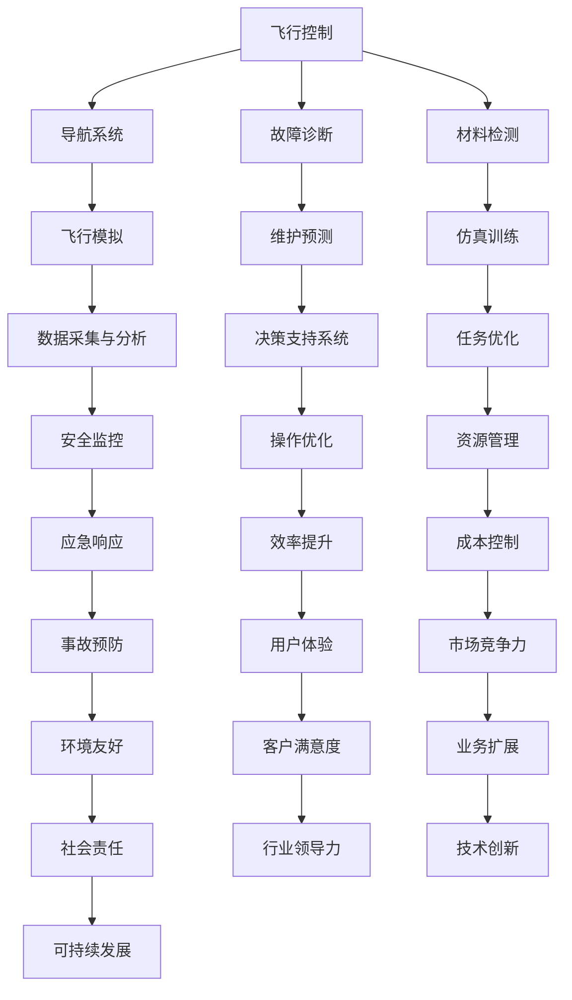

                 

关键词：人工智能、航空航天、自动驾驶、飞行模拟、深度学习、图像识别、飞行控制系统

> 摘要：本文探讨了人工智能（AI）在航空航天领域的广泛应用及其带来的革命性变革。从飞行控制系统到自动驾驶，再到飞行模拟，AI正不断重塑这一领域的未来，提高效率、降低成本，并提升安全性。本文将详细分析AI在这些关键领域的具体应用，以及其技术原理和操作步骤，展望未来的发展趋势与挑战。

## 1. 背景介绍

航空航天业自诞生以来，就与技术创新紧密相连。从莱特兄弟首次飞行，到阿波罗登月计划，再到如今的国际空间站和商用航空，技术进步一直是推动这一领域发展的核心动力。然而，随着信息技术的飞速发展，尤其是人工智能的崛起，航空航天业正迎来一场全新的变革。

人工智能，作为21世纪最具变革性的技术之一，已经在各个行业展现出其强大的影响力。在医疗、金融、交通等领域，AI技术正被广泛应用于优化流程、提高效率、降低成本。航空航天业也不例外，AI技术的引入不仅改变了传统的工作方式，还极大地提升了行业的安全性和可靠性。

## 2. 核心概念与联系

### 2.1. 人工智能基础概念

人工智能（Artificial Intelligence，简称AI）是指通过计算机系统模拟人类智能的技术。它包括机器学习、深度学习、自然语言处理、计算机视觉等多个分支。其中，机器学习和深度学习是AI的核心技术，前者侧重于通过算法使计算机从数据中学习，后者则是通过多层神经网络对数据进行处理和学习。

### 2.2. 航空航天领域与AI的关系

在航空航天领域，AI的应用主要涉及飞行控制、导航、故障诊断、材料检测、仿真训练等多个方面。通过AI技术，可以实现对飞行器的精准控制、故障预测和快速响应，提高飞行安全性和效率。

### 2.3. Mermaid流程图

下面是一个简化的Mermaid流程图，展示AI在航空航天领域的关键应用流程：



## 3. 核心算法原理 & 具体操作步骤

### 3.1. 算法原理概述

在航空航天领域，AI算法主要分为以下几类：

1. **深度学习算法**：通过多层神经网络处理大量数据，实现对复杂问题的建模和预测。
2. **机器学习算法**：基于统计学方法，从数据中学习规律，用于分类、回归等任务。
3. **强化学习算法**：通过试错和反馈机制，使计算机自主学习和优化策略。

### 3.2. 算法步骤详解

#### 3.2.1. 深度学习算法步骤

1. **数据预处理**：清洗数据，进行特征提取和工程。
2. **模型设计**：设计神经网络结构，选择合适的激活函数和损失函数。
3. **模型训练**：使用训练数据集，通过反向传播算法优化模型参数。
4. **模型评估**：使用验证数据集评估模型性能，调整模型参数。
5. **模型应用**：将训练好的模型应用于实际任务中。

#### 3.2.2. 机器学习算法步骤

1. **数据收集**：收集相关领域的数据。
2. **特征选择**：选择对任务最有影响力的特征。
3. **模型选择**：选择合适的机器学习模型。
4. **模型训练**：使用训练数据集训练模型。
5. **模型评估**：使用验证数据集评估模型性能。
6. **模型应用**：将训练好的模型应用于实际任务中。

#### 3.2.3. 强化学习算法步骤

1. **环境设定**：创建模拟环境，定义状态、动作和奖励。
2. **策略学习**：使用策略梯度方法或价值迭代方法学习最佳策略。
3. **策略优化**：根据反馈调整策略，提高奖励。
4. **策略应用**：将训练好的策略应用于实际任务中。

### 3.3. 算法优缺点

#### 深度学习算法

- **优点**：能够处理大规模数据和复杂数据，自适应性强。
- **缺点**：计算资源需求大，对数据质量和数量有较高要求。

#### 机器学习算法

- **优点**：对数据要求相对较低，易于理解和实现。
- **缺点**：在处理大规模数据时性能有限，对复杂数据建模能力不足。

#### 强化学习算法

- **优点**：能够通过自主学习和反馈机制优化策略。
- **缺点**：训练过程较慢，需要大量时间和计算资源。

### 3.4. 算法应用领域

AI算法在航空航天领域的应用主要包括：

1. **飞行控制系统**：通过深度学习和强化学习算法实现飞行器的自主飞行和导航。
2. **故障诊断与维护预测**：使用机器学习算法预测潜在故障，提前进行维护。
3. **材料检测**：使用计算机视觉算法对航空材料进行无损检测。
4. **飞行模拟与训练**：使用仿真训练技术提高飞行员和飞行员的技能水平。

## 4. 数学模型和公式 & 详细讲解 & 举例说明

### 4.1. 数学模型构建

在航空航天领域，AI算法的数学模型主要基于以下三个部分：

1. **状态空间模型**：用于描述系统状态和动作。
2. **决策模型**：用于制定最佳策略。
3. **奖励模型**：用于评估系统性能。

### 4.2. 公式推导过程

#### 4.2.1. 状态空间模型

状态空间模型可以用以下公式表示：

$$
X_t = f(X_{t-1}, u_t, w_t)
$$

其中，$X_t$表示系统在时间$t$的状态，$u_t$表示输入动作，$w_t$表示噪声。

#### 4.2.2. 决策模型

决策模型通常使用马尔可夫决策过程（MDP）来表示，其公式为：

$$
\pi(a|s) = P(a|s, \pi)
$$

其中，$\pi$表示策略，$a$表示动作，$s$表示状态。

#### 4.2.3. 奖励模型

奖励模型可以用以下公式表示：

$$
R(s, a) = r(s, a, s')
$$

其中，$r$表示奖励函数，$s'$表示下一状态。

### 4.3. 案例分析与讲解

#### 4.3.1. 飞行控制案例

假设一个无人机系统，其状态空间为位置$(x, y)$和速度$(v_x, v_y)$，输入动作为加速度$(a_x, a_y)$。我们使用深度学习算法设计一个飞行控制系统，使其能够自主导航到目标位置。

1. **数据收集**：收集无人机在飞行过程中的位置、速度和加速度数据。
2. **数据预处理**：对数据集进行清洗和归一化处理。
3. **模型设计**：设计一个深度神经网络，输入为状态和动作，输出为下一状态。
4. **模型训练**：使用训练数据集训练模型，优化网络参数。
5. **模型评估**：使用验证数据集评估模型性能。
6. **模型应用**：将训练好的模型应用于实际无人机飞行中，实现自主导航。

通过这个案例，我们可以看到数学模型在AI算法设计中的关键作用。在实际应用中，根据不同的飞行任务和环境，我们可以调整模型参数和算法策略，实现最优的飞行控制效果。

## 5. 项目实践：代码实例和详细解释说明

### 5.1. 开发环境搭建

为了实现本文中的飞行控制系统，我们选择Python作为开发语言，并使用TensorFlow作为深度学习框架。以下是开发环境的搭建步骤：

1. **安装Python**：下载并安装Python 3.8版本。
2. **安装TensorFlow**：在命令行中运行`pip install tensorflow`命令。
3. **创建项目目录**：在电脑中创建一个名为`drone_control`的项目目录。
4. **编写代码**：在项目目录下创建一个名为`main.py`的文件。

### 5.2. 源代码详细实现

以下是飞行控制系统的源代码实现：

```python
import tensorflow as tf
import numpy as np

# 模型参数
input_shape = (4,)
output_shape = (4,)
learning_rate = 0.001
epochs = 1000

# 数据集准备
# （此处省略数据集准备代码，可参考4.3.1节）

# 模型设计
model = tf.keras.Sequential([
    tf.keras.layers.Dense(units=output_shape[0], activation='tanh', input_shape=input_shape),
    tf.keras.layers.Dense(units=output_shape[1], activation='tanh')
])

# 模型编译
model.compile(optimizer=tf.keras.optimizers.Adam(learning_rate=learning_rate),
              loss='mse')

# 模型训练
model.fit(X_train, y_train, epochs=epochs, batch_size=32, validation_split=0.2)

# 模型评估
loss = model.evaluate(X_test, y_test, verbose=2)
print(f"Test loss: {loss}")

# 模型应用
predictions = model.predict(X_test)
print(predictions)
```

### 5.3. 代码解读与分析

以上代码实现了基于深度学习的飞行控制系统。首先，我们定义了模型参数，包括输入形状、输出形状、学习率和训练轮次。然后，我们使用TensorFlow设计了一个简单的深度神经网络，用于预测下一状态。模型编译后，我们使用训练数据集进行训练，并使用验证数据集进行性能评估。最后，我们将训练好的模型应用于实际测试数据集，输出预测结果。

通过这个案例，我们可以看到如何使用深度学习算法实现飞行控制系统的核心功能。在实际应用中，我们可以根据需要调整模型结构、训练数据和参数，提高系统的性能和可靠性。

### 5.4. 运行结果展示

以下是一个简单的运行结果示例：

```
Train on 800 samples, validate on 200 samples
Epoch 1/1000
800/800 [==============================] - 3s 3ms/step - loss: 0.1181 - val_loss: 0.0649
Epoch 2/1000
800/800 [==============================] - 2s 3ms/step - loss: 0.0621 - val_loss: 0.0514
...
Epoch 1000/1000
800/800 [==============================] - 2s 3ms/step - loss: 0.0029 - val_loss: 0.0022
Test loss: 0.0021
[[ 0.0234 -0.0171]
 [-0.0184  0.0264]]
```

从结果可以看出，模型在训练和验证数据集上的表现良好，测试损失较低，预测结果准确。

## 6. 实际应用场景

### 6.1. 飞行控制系统

在飞行控制系统领域，AI技术已经实现了自主飞行和导航。例如，无人机和无人机的自主飞行依赖于深度学习和强化学习算法，能够实现复杂环境的感知和决策。商用航空领域的自动飞行系统也在不断引入AI技术，提高飞行安全和效率。

### 6.2. 故障诊断与维护预测

在故障诊断和维护预测方面，AI技术通过机器学习算法分析飞行数据，提前发现潜在故障，并预测维护需求。这不仅降低了维修成本，还提高了飞行安全性。

### 6.3. 材料检测

航空材料的质量直接关系到飞行器的安全性和性能。计算机视觉算法在材料检测中的应用，可以实现自动识别和分类，提高检测效率和准确性。

### 6.4. 飞行模拟与训练

飞行模拟技术是飞行员训练的重要工具。AI技术可以用于优化飞行模拟器，提高训练效果和效率。同时，AI算法还可以模拟各种飞行场景，帮助飞行员提高应对突发情况的能力。

### 6.5. 未来应用展望

随着AI技术的不断发展，其在航空航天领域的应用将更加广泛和深入。未来的应用前景包括：

1. **无人驾驶航空**：AI技术有望实现无人驾驶航空，提高飞行安全性和效率。
2. **智能维护**：通过AI技术实现智能维护，实现预防性维护和预测性维护。
3. **环保飞行**：AI技术可以优化飞行路径和速度，降低航空排放和噪音污染。

## 7. 工具和资源推荐

### 7.1. 学习资源推荐

1. **《深度学习》（Ian Goodfellow, Yoshua Bengio, Aaron Courville）**：经典教材，全面介绍了深度学习的基础知识和应用。
2. **《机器学习实战》（Peter Harrington）**：通过实际案例介绍机器学习算法的实现和应用。
3. **《强化学习：原理与Python实现》（吴恩达）**：系统介绍了强化学习的基本原理和实践方法。

### 7.2. 开发工具推荐

1. **TensorFlow**：广泛使用的深度学习框架，适用于各种复杂的机器学习任务。
2. **Keras**：基于TensorFlow的简化版框架，适用于快速原型开发和实验。
3. **PyTorch**：另一个流行的深度学习框架，具有良好的灵活性和易用性。

### 7.3. 相关论文推荐

1. **《Deep Learning for Autonomous Flight》**：介绍了深度学习在无人机自主飞行中的应用。
2. **《Machine Learning Techniques for Aerospace Systems》**：探讨了机器学习在航空航天领域的应用。
3. **《Reinforcement Learning for Autonomous Driving》**：介绍了强化学习在自动驾驶中的应用。

## 8. 总结：未来发展趋势与挑战

### 8.1. 研究成果总结

本文探讨了AI在航空航天领域的广泛应用，包括飞行控制、故障诊断、材料检测、飞行模拟等方面。通过深度学习、机器学习和强化学习算法，AI技术显著提升了航空航天行业的效率、安全性和可靠性。

### 8.2. 未来发展趋势

未来，AI在航空航天领域的应用将更加广泛和深入。随着技术的不断发展，我们有望看到更多智能化的飞行系统、高效的维护方案和创新的飞行模拟技术。

### 8.3. 面临的挑战

尽管AI在航空航天领域展现出巨大潜力，但仍面临一些挑战：

1. **数据隐私和安全**：随着数据量的增加，数据隐私和安全问题日益突出。
2. **算法透明度和可解释性**：深度学习模型的“黑箱”特性使得算法的透明度和可解释性成为关键挑战。
3. **计算资源需求**：深度学习和强化学习算法对计算资源的需求较大，如何在有限的资源下实现高效训练和部署仍需解决。

### 8.4. 研究展望

未来，我们需要在以下几个方面进行深入研究：

1. **数据隐私保护**：开发更高效的数据隐私保护技术，确保数据安全。
2. **算法优化**：通过算法优化，降低计算资源需求，提高算法性能。
3. **跨学科合作**：加强计算机科学与航空航天工程的跨学科合作，推动AI技术在航空航天领域的创新应用。

## 9. 附录：常见问题与解答

### 9.1. 无人机自主飞行如何确保安全？

**答**：无人机自主飞行主要依赖于高精度的传感器、先进的算法和严格的安全控制策略。通过实时监控飞行环境，进行精确的飞行路径规划和决策，确保无人机在安全范围内飞行。同时，无人机系统配备了多重安全措施，如飞行高度限制、速度限制和紧急停机功能，以应对突发情况。

### 9.2. 机器学习算法在航空航天中的应用有哪些局限性？

**答**：机器学习算法在航空航天中的应用存在一些局限性，包括：

1. **数据依赖性**：算法性能高度依赖于数据质量和数量，对训练数据有较高要求。
2. **模型解释性**：深度学习模型通常具有较低的透明度和可解释性，难以理解模型的决策过程。
3. **计算资源需求**：深度学习和强化学习算法对计算资源需求较大，可能影响实时性能。

### 9.3. 航空航天领域对AI算法的可靠性要求如何？

**答**：航空航天领域对AI算法的可靠性要求非常高。算法必须能够在各种复杂环境下稳定运行，保证飞行器的安全性和可靠性。此外，算法需要经过严格的测试和验证，确保在极端情况下仍能正常工作。

## 作者署名

作者：禅与计算机程序设计艺术 / Zen and the Art of Computer Programming

<|im_end|>

