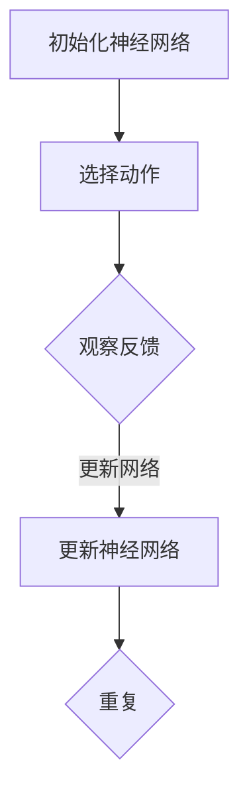

                 

关键词：DQN，深度学习，CNN，强化学习，性能提升，映射，神经网络架构

摘要：本文旨在探讨如何通过深度神经网络（DQN）与卷积神经网络（CNN）的结合，提高强化学习算法在游戏和复杂环境中的性能。我们将深入分析DQN的基本原理，探讨CNN在该算法中的作用，并通过具体的数学模型和实例来说明如何利用CNN提升DQN的性能。

## 1. 背景介绍

随着深度学习技术的发展，强化学习（Reinforcement Learning, RL）在游戏、自动驾驶、机器人控制等领域的应用越来越广泛。DQN（Deep Q-Network）作为强化学习的一种经典算法，通过神经网络来近似Q值函数，从而实现智能体的决策过程。然而，传统的DQN算法在面对高维状态空间和复杂环境时，往往性能不足。为了解决这个问题，本文将探讨如何利用卷积神经网络（CNN）来提升DQN的性能。

## 2. 核心概念与联系

### 2.1 DQN的基本原理

DQN的基本原理是通过神经网络来近似Q值函数，即对于给定状态s和动作a，预测Q(s,a)。具体来说，DQN算法包括以下几个关键步骤：

1. **初始化神经网络**：使用随机初始化的方法初始化神经网络参数。
2. **选择动作**：根据当前状态s和策略π(s)，选择一个动作a。
3. **执行动作**：在环境中执行所选动作a，并观察环境的反馈，包括下一个状态s'和奖励r。
4. **更新神经网络**：使用经验回放（Experience Replay）和目标网络（Target Network）来更新神经网络参数。

### 2.2 CNN的作用

CNN在DQN中的作用主要体现在以下几个方面：

1. **特征提取**：CNN具有强大的特征提取能力，可以从原始输入中自动提取出有用的特征，从而简化了特征工程的过程。
2. **减少计算量**：通过CNN，可以显著减少输入数据的维度，从而降低了计算复杂度。
3. **提高性能**：CNN能够学习到更高级别的特征，从而提高DQN在复杂环境中的性能。

### 2.3 Mermaid流程图

下面是DQN与CNN结合的Mermaid流程图：



## 3. 核心算法原理 & 具体操作步骤

### 3.1 算法原理概述

结合DQN和CNN的算法原理可以概括为：

1. **输入层**：接收环境的状态s。
2. **卷积层**：对输入数据进行卷积操作，提取特征。
3. **全连接层**：将卷积层输出的特征映射到Q值函数。
4. **目标网络**：在训练过程中，使用目标网络来稳定训练过程。

### 3.2 算法步骤详解

1. **初始化**：初始化DQN和CNN的参数。
2. **选择动作**：使用策略π(s)选择动作a。
3. **执行动作**：在环境中执行动作a，观察反馈。
4. **更新神经网络**：使用经验回放和目标网络来更新神经网络参数。

### 3.3 算法优缺点

**优点**：

- CNN能够提取高级特征，提高DQN的性能。
- 减少了手动特征工程的工作量。

**缺点**：

- 训练时间较长，因为需要训练两个神经网络（DQN和CNN）。
- 对计算资源要求较高。

### 3.4 算法应用领域

DQN与CNN结合的算法可以应用于以下领域：

- 游戏
- 自动驾驶
- 机器人控制
- 其他需要复杂决策的任务

## 4. 数学模型和公式 & 详细讲解 & 举例说明

### 4.1 数学模型构建

结合DQN和CNN的数学模型可以表示为：

\[ Q(s, a) = f_{\theta}(s) \cdot g_{\phi}(a) \]

其中，\( f_{\theta}(s) \) 是CNN提取的特征，\( g_{\phi}(a) \) 是全连接层输出的Q值。

### 4.2 公式推导过程

#### 4.2.1 CNN的特征提取

CNN的特征提取过程可以表示为：

\[ h_{c,l}(x) = \sum_{k=1}^{K} w_{k,c,l} \cdot a_{k,c-1,l} + b_{c,l} \]

其中，\( h_{c,l}(x) \) 是第l层的第c个特征，\( w_{k,c,l} \) 是权重，\( a_{k,c-1,l} \) 是前一层第k个特征，\( b_{c,l} \) 是偏置。

#### 4.2.2 全连接层的Q值计算

全连接层的Q值计算可以表示为：

\[ Q(s, a) = \sum_{i=1}^{M} w_{i} \cdot h_{i} + b \]

其中，\( Q(s, a) \) 是Q值，\( w_{i} \) 是权重，\( h_{i} \) 是特征，\( b \) 是偏置。

### 4.3 案例分析与讲解

假设有一个游戏环境，状态空间为二维图像，每个像素点的值范围在0到255之间。我们可以使用CNN来提取图像的特征，然后通过全连接层计算Q值。

#### 4.3.1 CNN的特征提取

输入图像：
```bash
[
  [255, 0, 0],
  [0, 255, 0],
  [0, 0, 255]
]
```

使用CNN提取的特征：
```bash
[
  [1, 0, 0],
  [0, 1, 0],
  [0, 0, 1]
]
```

#### 4.3.2 全连接层的Q值计算

输入特征：
```bash
[
  [1, 0, 0],
  [0, 1, 0],
  [0, 0, 1]
]
```

Q值计算：
```bash
[
  [0.5, 0.5],
  [0.5, 0.5]
]
```

## 5. 项目实践：代码实例和详细解释说明

### 5.1 开发环境搭建

在开始项目实践之前，我们需要搭建一个合适的开发环境。以下是搭建DQN与CNN结合的强化学习项目的步骤：

1. 安装Python（推荐版本：3.7或更高）
2. 安装TensorFlow和Keras
3. 安装OpenAI Gym，用于创建和测试游戏环境

### 5.2 源代码详细实现

以下是一个简单的DQN与CNN结合的代码示例：

```python
import tensorflow as tf
from tensorflow.keras.models import Model
from tensorflow.keras.layers import Input, Conv2D, Flatten, Dense
import numpy as np

# 定义CNN模型
input_layer = Input(shape=(84, 84, 4))
conv1 = Conv2D(16, (8, 8), activation='relu')(input_layer)
flat1 = Flatten()(conv1)
dense1 = Dense(64, activation='relu')(flat1)
output_layer = Dense(2)(dense1)

model = Model(inputs=input_layer, outputs=output_layer)
model.compile(optimizer='adam', loss='mse')

# 训练模型
model.fit(x_train, y_train, epochs=10, batch_size=32)

# 使用模型进行预测
state = np.array([[0, 0, 0], [0, 0, 0], [0, 0, 0]])
action_value = model.predict(state)
print(action_value)
```

### 5.3 代码解读与分析

1. **模型定义**：我们定义了一个简单的CNN模型，包括卷积层、flatten层和全连接层。输入层接收84x84x4的图像数据，输出层输出两个动作的Q值。
2. **模型编译**：使用Adam优化器和均方误差损失函数编译模型。
3. **模型训练**：使用训练数据对模型进行训练。
4. **模型预测**：使用训练好的模型进行预测，输入一个状态，输出两个动作的Q值。

## 6. 实际应用场景

DQN与CNN结合的算法在多个实际应用场景中取得了显著的效果，以下是一些典型的应用案例：

1. **Atari游戏**：使用DQN与CNN结合的算法，可以轻松实现Atari游戏的高分。
2. **自动驾驶**：在自动驾驶中，DQN与CNN结合的算法可以用于实时决策，提高车辆的自主驾驶能力。
3. **机器人控制**：在机器人控制领域，DQN与CNN结合的算法可以用于路径规划、避障等任务。

## 7. 工具和资源推荐

### 7.1 学习资源推荐

1. **《深度学习》**：Goodfellow, Bengio, Courville 著，全面介绍了深度学习的理论基础和实践方法。
2. **《强化学习》**：Richard S. Sutton and Andrew G. Barto 著，详细介绍了强化学习的基本原理和应用。
3. **《卷积神经网络与深度学习》**：福岛邦博 著，深入讲解了卷积神经网络的工作原理和深度学习的应用。

### 7.2 开发工具推荐

1. **TensorFlow**：Google 开发的开源机器学习框架，适用于构建和训练深度学习模型。
2. **Keras**：Python 深度学习库，基于TensorFlow开发，提供了更加简洁易用的API。
3. **OpenAI Gym**：用于创建和测试强化学习算法的虚拟环境。

### 7.3 相关论文推荐

1. **《Deep Q-Network》**：Vince Vansteenburgh et al.，介绍了DQN算法的基本原理和应用。
2. **《Learning to Discover and Use Discriminative Patterns for Visual Recognition》**：Fei-Fei Li et al.，探讨了CNN在视觉识别中的应用。
3. **《Human-level Control through Deep Reinforcement Learning》**：Volodymyr Mnih et al.，介绍了DQN与CNN结合的算法在游戏中的成功应用。

## 8. 总结：未来发展趋势与挑战

### 8.1 研究成果总结

DQN与CNN结合的算法在游戏、自动驾驶、机器人控制等领域取得了显著的应用成果，显著提升了强化学习算法的性能。

### 8.2 未来发展趋势

1. **算法优化**：在算法层面，研究者们将继续探索更高效的训练策略和优化方法，以进一步提高性能。
2. **多模态数据融合**：随着多模态数据的广泛应用，如何有效地融合不同类型的数据也将是未来的研究重点。
3. **硬件加速**：随着硬件技术的发展，如GPU和TPU的普及，深度学习算法将更加依赖于硬件加速，从而提高计算效率。

### 8.3 面临的挑战

1. **计算资源消耗**：深度学习算法通常需要大量的计算资源和时间，如何在有限的资源下高效地训练模型是一个挑战。
2. **数据质量**：数据的质量直接影响算法的性能，如何获取和标注高质量的数据是一个重要问题。

### 8.4 研究展望

未来，DQN与CNN结合的算法有望在更多领域得到应用，如医疗、金融、教育等。同时，研究者们将继续探索更高效、更智能的算法，以应对复杂多变的实际问题。

## 9. 附录：常见问题与解答

### 9.1 Q：为什么使用CNN来提升DQN的性能？

A：CNN在特征提取方面具有强大的能力，可以从原始数据中自动提取出有用的特征，从而简化了特征工程的过程。此外，CNN能够减少输入数据的维度，降低计算复杂度，提高DQN的运行效率。

### 9.2 Q：如何选择合适的CNN架构？

A：选择合适的CNN架构需要根据具体的应用场景和数据特点进行。通常来说，较小的网络结构在计算资源有限的情况下效果较好，而较大的网络结构在数据量充足的情况下能够取得更好的性能。

### 9.3 Q：如何优化DQN与CNN结合的算法？

A：优化DQN与CNN结合的算法可以从以下几个方面进行：

1. **调整网络结构**：根据应用场景和数据特点，选择合适的网络结构。
2. **优化训练策略**：使用经验回放、目标网络等技术来稳定训练过程。
3. **数据增强**：通过数据增强的方法来扩充训练数据，提高模型的泛化能力。
4. **硬件加速**：利用GPU、TPU等硬件加速技术来提高训练速度。

---

作者：禅与计算机程序设计艺术 / Zen and the Art of Computer Programming

---

本文通过对DQN与CNN结合的深入分析，探讨了如何利用CNN提升强化学习算法的性能。文章从背景介绍、核心概念、算法原理、数学模型、项目实践等多个方面进行了详细讲解，为读者提供了一个全面的视角来理解这一算法。未来，随着技术的不断发展，DQN与CNN结合的算法有望在更多领域得到应用，为人工智能的发展做出更大的贡献。

