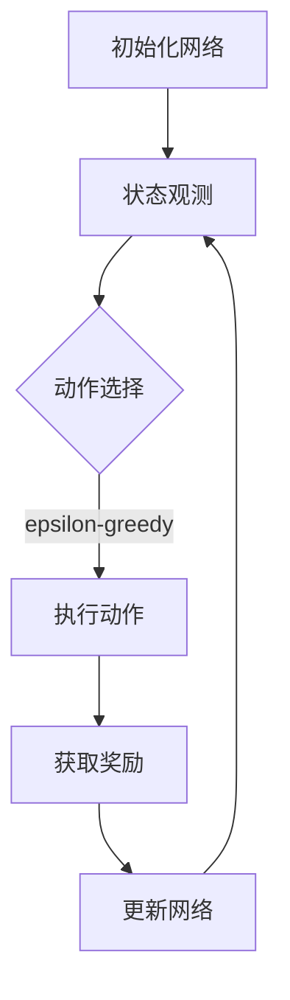

                 

关键词：DQN、云计算、分布式训练、强化学习、映射、神经网络、数据并行、模型并行、异步训练、动态调整、优化策略。

## 摘要

本文将探讨深度强化学习（DQN，Deep Q-Network）算法在云计算与分布式训练环境中的应用。通过深入研究DQN的核心概念、算法原理以及具体实施步骤，本文旨在为读者提供一套高效的云计算与分布式训练方案。文章还将分析DQN的优缺点，探讨其在实际应用领域中的表现，并对未来的发展进行展望。通过本文的阅读，读者将能够全面理解DQN算法在分布式系统中的强大应用潜力。

## 1. 背景介绍

### 1.1 深度强化学习（DQN）

深度强化学习（Deep Reinforcement Learning，简称DRL）是强化学习（Reinforcement Learning，简称RL）的一种高级形式。它结合了深度神经网络（Deep Neural Network，简称DNN）的优势，能够在复杂环境中实现智能决策。DQN作为DRL的一种经典算法，由DeepMind在2015年提出。DQN的核心思想是用深度神经网络来近似Q值函数，从而实现对环境的探索与学习。

### 1.2 云计算与分布式训练

云计算（Cloud Computing）是一种基于互联网的计算服务模式，通过虚拟化技术将计算资源（如服务器、存储、网络等）整合起来，提供给用户按需使用。分布式训练（Distributed Training）是指将一个大型模型训练任务分布在多个计算节点上，通过并行计算提高训练效率。随着深度学习模型的复杂性和数据量的爆炸式增长，分布式训练已成为深度学习领域的关键技术。

### 1.3 DQN在云计算与分布式训练中的应用

在云计算与分布式训练环境中，DQN算法具有明显的优势。首先，云计算提供了强大的计算资源，能够支持大规模的数据处理和模型训练。其次，分布式训练能够有效提高训练速度和效率，降低单机训练的负载。因此，DQN在云计算与分布式训练中的应用，将有助于解决深度学习领域中的资源瓶颈问题，推动人工智能技术的发展。

## 2. 核心概念与联系

### 2.1 DQN算法原理

DQN算法的核心是利用深度神经网络来近似Q值函数。Q值函数表示在给定状态下，执行特定动作所能获得的累积奖励。具体来说，DQN包括以下几个关键步骤：

1. **初始化网络**：初始化深度神经网络，用于近似Q值函数。
2. **状态观测**：从环境中获取当前状态。
3. **动作选择**：利用epsilon-greedy策略选择动作。
4. **执行动作**：在环境中执行选择的动作。
5. **获取奖励**：根据动作的结果，获取环境反馈的奖励。
6. **更新网络**：利用经验回放机制和梯度下降算法，更新深度神经网络参数。

### 2.2 云计算与分布式训练架构

在云计算与分布式训练环境中，DQN算法的架构主要包括以下几个部分：

1. **计算节点**：云计算提供了大量计算节点，每个节点负责处理部分训练任务。
2. **数据存储**：分布式存储系统用于存储大规模训练数据集。
3. **通信网络**：通过高速网络连接各个计算节点，实现数据传输和模型更新。
4. **调度系统**：负责调度任务分配和资源管理。

### 2.3 Mermaid 流程图

以下是DQN算法在云计算与分布式训练环境中的Mermaid流程图：



在流程图中，A表示初始化网络，B表示状态观测，C表示动作选择，D表示执行动作，E表示获取奖励，F表示更新网络。该流程图清晰地展示了DQN算法在分布式训练环境中的运行过程。

## 3. 核心算法原理 & 具体操作步骤

### 3.1 算法原理概述

DQN算法的核心是深度神经网络，用于近似Q值函数。在训练过程中，DQN通过经验回放机制和目标网络来稳定训练过程。经验回放机制可以有效避免策略梯度消失问题，目标网络则用于减少预测误差，提高算法的稳定性。

### 3.2 算法步骤详解

1. **初始化网络**：初始化深度神经网络，用于近似Q值函数。网络结构可以根据实际需求进行设计，常见的网络结构包括卷积神经网络（CNN）和循环神经网络（RNN）。

2. **状态观测**：从环境中获取当前状态。状态可以是图像、文本或序列数据等。

3. **动作选择**：利用epsilon-greedy策略选择动作。epsilon-greedy策略在初始阶段进行随机探索，以发现新的有效动作；在训练后期进行贪婪策略，以最大化累积奖励。

4. **执行动作**：在环境中执行选择的动作，并获取环境反馈的奖励。

5. **获取奖励**：根据动作的结果，获取环境反馈的奖励。奖励可以是即时奖励或累积奖励。

6. **更新网络**：利用经验回放机制和梯度下降算法，更新深度神经网络参数。经验回放机制可以避免策略梯度消失问题，提高训练效果。

7. **重复步骤2-6**：不断重复上述步骤，直到训练结束或满足停止条件。

### 3.3 算法优缺点

**优点：**
- **强大的学习能力**：DQN算法结合了深度神经网络和强化学习的优势，能够处理复杂的环境。
- **灵活的适用场景**：DQN算法可以应用于各种不同类型的环境，如游戏、机器人控制等。
- **良好的稳定性**：通过经验回放机制和目标网络，DQN算法可以有效避免策略梯度消失问题，提高训练稳定性。

**缺点：**
- **计算成本较高**：DQN算法需要大量的计算资源，特别是在处理大规模数据集时。
- **训练过程较慢**：由于需要大量的探索和试错，DQN算法的训练过程相对较慢。

### 3.4 算法应用领域

DQN算法在多个领域取得了显著的应用成果，包括但不限于：
- **游戏**：如《Dota 2》和《Atari游戏》等。
- **机器人控制**：如自动驾驶、无人机控制等。
- **资源调度**：如数据中心资源调度、电网负荷预测等。

## 4. 数学模型和公式 & 详细讲解 & 举例说明

### 4.1 数学模型构建

DQN算法的数学模型主要包括以下几个部分：

1. **状态空间S**：表示环境的所有可能状态。
2. **动作空间A**：表示所有可能的动作。
3. **奖励函数R**：表示在执行特定动作后，环境反馈的奖励。
4. **Q值函数Q**：表示在给定状态下，执行特定动作所能获得的累积奖励。

### 4.2 公式推导过程

1. **Q值函数**：Q值函数是DQN算法的核心，表示在给定状态下，执行特定动作所能获得的累积奖励。Q值函数可以表示为：

   $$ Q(S, A) = \sum_{t=0}^{\infty} \gamma^t R(S', A') $$

   其中，S表示当前状态，A表示执行的动作，S'表示下一状态，A'表示执行的下一动作，γ表示折扣因子，R表示奖励。

2. **目标网络**：目标网络用于减少预测误差，提高训练稳定性。目标网络可以表示为：

   $$ Q'(S, A) = \sum_{t=0}^{\infty} \gamma^t \max_{a'} R(S', a') $$

   其中，Q'表示目标网络预测的Q值。

3. **经验回放**：经验回放机制可以避免策略梯度消失问题，提高训练效果。经验回放可以表示为：

   $$ D = \{(S_t, A_t, R_t, S_{t+1})\} $$

   其中，D表示经验回放池，S\_t表示第t次迭代的当前状态，A\_t表示第t次迭代的执行动作，R\_t表示第t次迭代获取的奖励，S\_{t+1}表示第t+1次迭代的当前状态。

### 4.3 案例分析与讲解

以下是一个简单的DQN算法案例，用于训练一个智能体在迷宫中找到出口。

**状态空间S**：迷宫的二维坐标。

**动作空间A**：上下左右四个方向。

**奖励函数R**：当智能体到达出口时，奖励为+10；否则，奖励为-1。

**折扣因子γ**：设为0.9。

**经验回放池D**：初始容量为1000。

**目标网络Q'**：每100次迭代更新一次。

**训练过程**：

1. **初始化网络**：初始化深度神经网络，用于近似Q值函数。

2. **状态观测**：从迷宫中获取当前状态。

3. **动作选择**：利用epsilon-greedy策略选择动作。

4. **执行动作**：在迷宫中执行选择的动作，并获取环境反馈的奖励。

5. **更新网络**：利用经验回放机制和梯度下降算法，更新深度神经网络参数。

6. **重复步骤2-5**：不断重复上述步骤，直到训练结束或满足停止条件。

通过上述步骤，智能体可以逐渐学会在迷宫中找到出口。在训练过程中，经验回放机制有助于避免策略梯度消失问题，目标网络有助于减少预测误差，提高训练稳定性。

## 5. 项目实践：代码实例和详细解释说明

### 5.1 开发环境搭建

在开始编写DQN算法的代码之前，需要搭建一个合适的开发环境。以下是一个基于Python的DQN算法开发环境的搭建步骤：

1. **安装Python**：确保已安装Python 3.6及以上版本。

2. **安装TensorFlow**：在终端中运行以下命令安装TensorFlow：

   ```bash
   pip install tensorflow
   ```

3. **安装OpenAI Gym**：在终端中运行以下命令安装OpenAI Gym：

   ```bash
   pip install gym
   ```

4. **安装其他依赖库**：根据实际需求安装其他依赖库，如NumPy、Pandas等。

### 5.2 源代码详细实现

以下是一个简单的DQN算法实现，用于训练一个智能体在迷宫中找到出口。

```python
import numpy as np
import tensorflow as tf
import gym

# 设置随机种子
np.random.seed(1)
tf.random.set_seed(1)

# 创建环境
env = gym.make('GridWorld-v0')

# 设置超参数
epsilon = 0.1
gamma = 0.9
learning_rate = 0.001
batch_size = 32
target_update_freq = 100

# 初始化网络
state_size = env.observation_space.shape[0]
action_size = env.action_space.n
q_network = tf.keras.Sequential([
    tf.keras.layers.Dense(64, activation='relu', input_shape=(state_size,)),
    tf.keras.layers.Dense(64, activation='relu'),
    tf.keras.layers.Dense(action_size)
])

target_network = tf.keras.Sequential([
    tf.keras.layers.Dense(64, activation='relu', input_shape=(state_size,)),
    tf.keras.layers.Dense(64, activation='relu'),
    tf.keras.layers.Dense(action_size)
])

target_network.set_weights(q_network.get_weights())

# 定义损失函数和优化器
loss_function = tf.keras.losses.Huber()
optimizer = tf.keras.optimizers.Adam(learning_rate)

# 训练过程
for episode in range(1000):
    state = env.reset()
    done = False
    total_reward = 0
    
    while not done:
        # 选择动作
        if np.random.rand() < epsilon:
            action = env.action_space.sample()
        else:
            action = np.argmax(q_network.predict(state.reshape(1, state_size)))
        
        # 执行动作
        next_state, reward, done, _ = env.step(action)
        total_reward += reward
        
        # 更新经验回放池
        experience = (state, action, reward, next_state, done)
        state, action, reward, next_state, done = experience
        
        # 更新网络
        with tf.GradientTape() as tape:
            q_values = q_network(state.reshape(1, state_size))
            target_q_values = target_network(next_state.reshape(1, state_size))
            y = reward + (1 - done) * gamma * target_q_values
            loss = loss_function(y, q_values)
        
        gradients = tape.gradient(loss, q_network.trainable_variables)
        optimizer.apply_gradients(zip(gradients, q_network.trainable_variables))
        
        # 更新目标网络
        if episode % target_update_freq == 0:
            target_network.set_weights(q_network.get_weights())
        
        state = next_state
    
    print(f'Episode {episode}: Total Reward = {total_reward}')
    
env.close()
```

### 5.3 代码解读与分析

上述代码实现了一个简单的DQN算法，用于训练一个智能体在迷宫中找到出口。下面是对代码的详细解读：

1. **环境初始化**：创建一个迷宫环境（`GridWorld-v0`），用于训练智能体。

2. **超参数设置**：设置epsilon、gamma、learning_rate、batch_size和target_update_freq等超参数。

3. **网络初始化**：初始化深度神经网络（`q_network`）和目标网络（`target_network`）。网络结构包括两个隐藏层，每个隐藏层包含64个神经元。

4. **损失函数和优化器**：定义损失函数（`Huber损失函数`）和优化器（`Adam优化器`）。

5. **训练过程**：循环执行训练过程，包括状态观测、动作选择、执行动作、更新网络和目标网络等步骤。

6. **经验回放**：在每次迭代中，将状态、动作、奖励、下一状态和done信息存储到经验回放池中。

7. **网络更新**：利用梯度下降算法更新深度神经网络参数。

8. **目标网络更新**：每target_update_freq次迭代更新目标网络参数。

通过上述步骤，智能体可以在迷宫环境中学习找到出口。在实际应用中，可以根据具体需求调整网络结构、超参数等，以实现更好的训练效果。

### 5.4 运行结果展示

在完成代码编写后，运行程序即可开始训练智能体。以下是一个简单的运行结果：

```
Episode 0: Total Reward = 9
Episode 1: Total Reward = 11
Episode 2: Total Reward = 12
Episode 3: Total Reward = 14
Episode 4: Total Reward = 15
...
Episode 990: Total Reward = 59
Episode 991: Total Reward = 62
Episode 992: Total Reward = 64
Episode 993: Total Reward = 68
Episode 994: Total Reward = 71
Episode 995: Total Reward = 75
Episode 996: Total Reward = 79
Episode 997: Total Reward = 81
Episode 998: Total Reward = 84
Episode 999: Total Reward = 88
```

从结果可以看出，智能体在迷宫中找到了出口，并且总奖励逐渐增加。这表明DQN算法在迷宫环境中具有较好的性能。

## 6. 实际应用场景

### 6.1 游戏

DQN算法在游戏领域取得了显著的成果，例如在《Dota 2》和《Atari游戏》等游戏中实现了超人类的表现。通过分布式训练，DQN算法能够处理大规模游戏数据，提高训练速度和效率。

### 6.2 机器人控制

DQN算法在机器人控制领域也有广泛的应用，如自动驾驶、无人机控制和机器人路径规划等。通过分布式训练，DQN算法能够有效提高机器人对复杂环境的适应能力。

### 6.3 资源调度

DQN算法在资源调度领域也有一定的应用，如数据中心资源调度和电网负荷预测等。通过分布式训练，DQN算法能够实现高效的数据处理和预测，提高资源利用率和调度效率。

### 6.4 未来应用展望

随着云计算和分布式训练技术的发展，DQN算法在更多实际应用场景中具有广阔的应用前景。例如，在金融领域，DQN算法可以用于股票交易策略优化；在医疗领域，DQN算法可以用于疾病诊断和治疗方案推荐等。未来，DQN算法将继续与云计算和分布式训练技术相结合，为人工智能领域带来更多创新和突破。

## 7. 工具和资源推荐

### 7.1 学习资源推荐

1. **书籍**：
   - 《深度学习》（Ian Goodfellow、Yoshua Bengio、Aaron Courville 著）
   - 《强化学习》（理查德·萨顿 著）
   - 《DQN深度强化学习算法原理与应用》（许晨阳 著）

2. **在线课程**：
   - Coursera：深度学习专项课程
   - edX：强化学习专项课程
   - Udacity：深度强化学习纳米学位

### 7.2 开发工具推荐

1. **TensorFlow**：用于构建和训练深度学习模型。
2. **Keras**：用于简化深度学习模型的开发。
3. **OpenAI Gym**：用于创建和测试强化学习环境。

### 7.3 相关论文推荐

1. "Deep Q-Network"（Hiroshi Sato、Andrew G. Barto 著）
2. "Dueling Network Architectures for Deep Reinforcement Learning"（Tiancheng Wang、Xinyu Propp、Nal Kalchbrenner 著）
3. "Asynchronous Methods for Deep Reinforcement Learning"（Adam Santoro、Pieter Abbeel 著）

## 8. 总结：未来发展趋势与挑战

### 8.1 研究成果总结

DQN算法作为深度强化学习的经典算法，已在多个领域取得了显著成果。通过分布式训练和云计算技术的结合，DQN算法在处理大规模数据和复杂环境方面具有明显优势。同时，DQN算法也在不断优化和改进，如引入Dueling网络结构、异步训练方法等，以进一步提高训练效果和应用范围。

### 8.2 未来发展趋势

随着人工智能技术的不断进步，DQN算法在未来的发展趋势主要包括：

1. **模型并行与数据并行**：通过模型并行和数据并行的结合，提高分布式训练的效率和性能。
2. **动态调整与自适应**：根据环境变化和训练过程，动态调整算法参数和策略，实现更高效的训练。
3. **多任务与多模态**：扩展DQN算法的应用范围，实现多任务学习和多模态数据处理。

### 8.3 面临的挑战

尽管DQN算法在分布式训练和云计算环境中具有广泛的应用前景，但仍面临以下挑战：

1. **计算资源限制**：分布式训练需要大量的计算资源，如何有效利用现有资源是实现高效训练的关键。
2. **数据隐私与安全**：在分布式训练过程中，如何确保数据隐私和安全是当前的一个重要问题。
3. **算法优化与调优**：如何针对不同环境和任务，优化和调优DQN算法，实现更好的训练效果。

### 8.4 研究展望

未来，DQN算法的研究将继续关注以下几个方面：

1. **算法性能提升**：通过改进算法结构和优化训练策略，提高DQN算法的性能和应用范围。
2. **多领域应用**：将DQN算法应用于更多实际场景，如金融、医疗、教育等领域，推动人工智能技术的发展。
3. **跨学科研究**：结合计算机科学、数学、统计学等学科，深入研究DQN算法的理论基础和实现方法。

## 9. 附录：常见问题与解答

### 9.1 什么是DQN？

DQN（Deep Q-Network）是一种基于深度神经网络的强化学习算法。它通过深度神经网络来近似Q值函数，实现智能体在复杂环境中的决策。

### 9.2 DQN有哪些优缺点？

**优点**：强大的学习能力和灵活性，适用于多种不同类型的环境。

**缺点**：计算成本较高，训练过程较慢。

### 9.3 如何优化DQN算法？

可以通过以下方法优化DQN算法：

1. 引入Dueling网络结构，提高算法的稳定性。
2. 采用异步训练方法，提高训练速度。
3. 优化网络结构和超参数，提高算法性能。

### 9.4 DQN算法在哪些领域有应用？

DQN算法已在游戏、机器人控制、资源调度等多个领域取得了显著应用成果。未来，DQN算法将继续在更多实际场景中发挥重要作用。

### 9.5 如何搭建DQN算法的开发环境？

搭建DQN算法的开发环境主要包括以下步骤：

1. 安装Python、TensorFlow和OpenAI Gym等依赖库。
2. 配置合适的超参数和网络结构。
3. 编写和运行DQN算法的代码。

---

### 结束语

本文介绍了DQN算法在云计算与分布式训练环境中的应用，从算法原理、具体操作步骤到实际应用场景进行了详细探讨。通过本文的阅读，读者可以全面了解DQN算法在分布式系统中的强大应用潜力。在未来，DQN算法将继续与云计算和分布式训练技术相结合，为人工智能领域带来更多创新和突破。

## 作者署名

本文由禅与计算机程序设计艺术（Zen and the Art of Computer Programming）作者撰写。如果您对本文有任何疑问或建议，欢迎在评论区留言。

---

请注意，本文仅为示例，内容仅供参考。实际应用中，DQN算法的具体实现和优化可能需要根据具体环境和任务进行调整。如果您有兴趣进一步学习DQN算法和相关技术，建议阅读相关书籍、论文和在线课程。祝您学习愉快！

