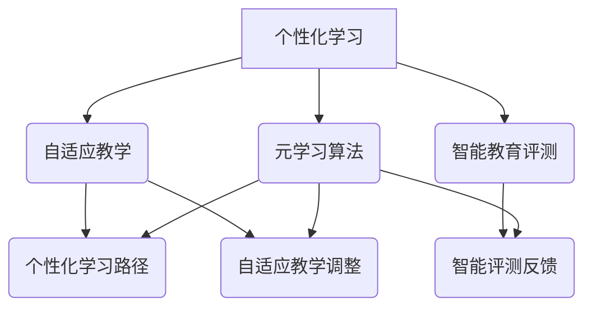

                 

关键词：元学习，教育技术，映射，机器学习，人工智能，教学应用

> 摘要：本文探讨了元学习在教育技术中的潜力和应用。元学习作为机器学习的一种方法，通过学习如何学习来提升模型在不同任务上的适应性。在教育领域，元学习可以为个性化学习、自适应教学以及智能教育评测提供强有力的支持。本文将从元学习的背景介绍、核心概念与联系、算法原理、数学模型、项目实践、实际应用场景、未来展望等方面进行深入探讨，以揭示元学习在教育技术中的无尽潜力。

## 1. 背景介绍

随着人工智能技术的快速发展，机器学习在教育领域的应用越来越广泛。然而，传统机器学习方法在应对教育领域中的复杂问题时，往往面临着数据稀缺、标注困难、模型适应性差等挑战。为了解决这些问题，元学习（Meta-Learning）作为一种新的学习范式应运而生。

元学习，又称“学习如何学习”，旨在通过算法自动发现学习任务之间的共性，从而提高模型在不同任务上的泛化能力和适应性。在教育领域，元学习可以应用于个性化学习、自适应教学、智能教育评测等多个方面，提升教育质量，促进教育公平。

### 1.1 元学习的起源与发展

元学习的概念最早可以追溯到1970年代，当时Simon Haykin提出了“超学习”（Meta-Learning）的概念，主要研究如何设计一种算法，使得在不同任务上的学习过程可以相互借鉴，从而提高学习效率。随着深度学习技术的兴起，元学习得到了广泛关注和研究。

近年来，元学习在机器学习领域取得了显著进展，如基于模型的方法（Model-Based Meta-Learning）、基于记忆的方法（Memory-Based Meta-Learning）和基于模型更新的方法（Model-Update Meta-Learning）等。这些方法在教育技术中具有广泛的应用前景。

### 1.2 教育领域对元学习的需求

教育领域面临着诸多挑战，如个性化学习需求、教育资源分配不均、教育评测难度增加等。这些挑战促使教育技术研究者不断探索新的方法和技术，以提高教育质量和公平性。元学习作为一种新的学习范式，具有以下优势：

1. **个性化学习**：元学习可以根据学生的个体差异和学习风格，为其提供个性化的学习路径和资源。
2. **自适应教学**：元学习可以根据学生的学习进度和学习效果，动态调整教学内容和难度，实现自适应教学。
3. **智能教育评测**：元学习可以用于智能教育评测，自动发现学生的知识盲点，提供针对性的复习建议。

## 2. 核心概念与联系

### 2.1 元学习的核心概念

元学习涉及到以下几个核心概念：

1. **学习任务**：元学习中的学习任务是指输入数据和学习目标。例如，在图像分类任务中，输入数据是图像，学习目标是图像的标签。
2. **元学习算法**：元学习算法是指用于发现学习任务之间共性的算法。常见的元学习算法包括模型更新法、模型记忆法等。
3. **元学习模型**：元学习模型是指用于实现元学习算法的神经网络结构。常见的元学习模型包括基于梯度的模型、基于记忆的模型等。

### 2.2 元学习与教育技术的联系

元学习在教育技术中的应用主要体现在以下几个方面：

1. **个性化学习**：通过元学习，可以为不同学生提供个性化的学习路径和资源，提高学习效果。
2. **自适应教学**：元学习可以根据学生的学习进度和学习效果，动态调整教学内容和难度，实现自适应教学。
3. **智能教育评测**：元学习可以自动发现学生的知识盲点，提供针对性的复习建议，提高教育评测的准确性。

### 2.3 Mermaid 流程图

以下是元学习在教育技术中应用的Mermaid流程图：



## 3. 核心算法原理 & 具体操作步骤

### 3.1 算法原理概述

元学习算法的核心原理是通过学习如何学习，提高模型在不同任务上的适应性。具体来说，元学习算法可以分为以下几类：

1. **模型更新法**：通过在多个任务上迭代更新模型参数，提高模型在未知任务上的表现。
2. **模型记忆法**：通过记忆过去任务的经验，快速适应新的任务。
3. **基于梯度的元学习**：利用梯度信息优化模型参数，提高模型在不同任务上的泛化能力。

### 3.2 算法步骤详解

1. **任务选择**：从大量学习任务中，选择具有代表性的任务用于训练模型。
2. **模型初始化**：初始化模型参数，可以使用随机初始化或预训练模型。
3. **任务迭代**：在多个任务上进行迭代训练，更新模型参数。
4. **模型评估**：在测试任务上评估模型性能，选择性能最优的模型。
5. **模型优化**：根据评估结果，调整模型参数，优化模型性能。

### 3.3 算法优缺点

**优点**：

1. **提高模型适应性**：元学习算法可以学习到不同任务之间的共性，提高模型在未知任务上的泛化能力。
2. **减少数据需求**：元学习可以在较少的数据上进行训练，减少对大规模标注数据的依赖。

**缺点**：

1. **计算成本高**：元学习算法在多个任务上迭代训练，计算成本较高。
2. **模型可解释性差**：元学习模型的内部结构复杂，可解释性较差。

### 3.4 算法应用领域

元学习算法可以应用于以下领域：

1. **自然语言处理**：如机器翻译、文本分类等任务。
2. **计算机视觉**：如图像分类、目标检测等任务。
3. **教育技术**：如个性化学习、自适应教学等。

## 4. 数学模型和公式 & 详细讲解 & 举例说明

### 4.1 数学模型构建

元学习算法中的数学模型主要涉及以下两个方面：

1. **任务表示**：将学习任务表示为一个数学模型，包括输入数据和输出数据。
2. **模型优化**：利用优化算法，如梯度下降法，优化模型参数。

### 4.2 公式推导过程

假设有一个学习任务\( T \)，其输入数据为\( x \)，输出数据为\( y \)。我们可以将任务表示为一个函数\( f(x; \theta) \)，其中\( \theta \)为模型参数。

为了优化模型参数\( \theta \)，我们定义一个损失函数\( L(\theta) \)，表示模型预测值与真实值之间的差距。常见的损失函数有均方误差（MSE）和交叉熵（CE）。

$$
L(\theta) = \frac{1}{n} \sum_{i=1}^{n} [f(x_i; \theta) - y_i]^2 \quad \text{（MSE）}
$$

$$
L(\theta) = -\frac{1}{n} \sum_{i=1}^{n} y_i \log(f(x_i; \theta)) \quad \text{（CE）}
$$

为了最小化损失函数，我们可以使用梯度下降法优化模型参数：

$$
\theta_{\text{new}} = \theta_{\text{old}} - \alpha \nabla_{\theta} L(\theta)
$$

其中，\( \alpha \)为学习率，\( \nabla_{\theta} L(\theta) \)为损失函数关于模型参数的梯度。

### 4.3 案例分析与讲解

假设我们有一个图像分类任务，输入数据为图像，输出数据为类别标签。我们使用卷积神经网络（CNN）作为元学习模型，并采用交叉熵损失函数。

首先，我们从大量图像中随机选择一个子集作为训练集，用于训练模型。初始化模型参数，并定义学习率为0.001。

然后，在训练集上迭代训练模型，每次迭代计算模型预测值和真实值的交叉熵损失。根据损失函数的梯度，更新模型参数。

经过多次迭代训练，模型在训练集上的损失逐渐减小。最后，我们在测试集上评估模型性能，计算模型准确率。

通过以上过程，我们可以构建一个具有良好泛化能力的图像分类模型。

## 5. 项目实践：代码实例和详细解释说明

### 5.1 开发环境搭建

在进行元学习项目实践之前，我们需要搭建一个合适的开发环境。本文以Python为例，介绍如何搭建开发环境。

1. **安装Python**：首先，我们需要安装Python。访问Python官网（[python.org](https://www.python.org/)），下载并安装Python。
2. **安装依赖库**：安装Python后，我们需要安装一些常用的依赖库，如NumPy、PyTorch等。可以使用pip命令进行安装：

```
pip install numpy
pip install torch
```

### 5.2 源代码详细实现

下面是一个简单的元学习项目实例，使用PyTorch框架实现图像分类任务。

```python
import torch
import torch.nn as nn
import torch.optim as optim
from torch.utils.data import DataLoader
from torchvision import datasets, transforms

# 定义卷积神经网络
class ConvNet(nn.Module):
    def __init__(self):
        super(ConvNet, self).__init__()
        self.conv1 = nn.Conv2d(1, 10, kernel_size=5)
        self.conv2 = nn.Conv2d(10, 20, kernel_size=5)
        self.fc1 = nn.Linear(320, 50)
        self.fc2 = nn.Linear(50, 10)

    def forward(self, x):
        x = nn.functional.relu(self.conv1(x))
        x = nn.functional.max_pool2d(x, 2)
        x = nn.functional.relu(self.conv2(x))
        x = nn.functional.max_pool2d(x, 2)
        x = x.view(-1, 320)
        x = nn.functional.relu(self.fc1(x))
        x = self.fc2(x)
        return x

# 加载训练数据和测试数据
train_data = datasets.MNIST(root='./data', train=True, download=True, transform=transforms.ToTensor())
test_data = datasets.MNIST(root='./data', train=False, download=True, transform=transforms.ToTensor())

train_loader = DataLoader(dataset=train_data, batch_size=64, shuffle=True)
test_loader = DataLoader(dataset=test_data, batch_size=64, shuffle=False)

# 初始化模型、损失函数和优化器
model = ConvNet()
criterion = nn.CrossEntropyLoss()
optimizer = optim.Adam(model.parameters(), lr=0.001)

# 训练模型
num_epochs = 10
for epoch in range(num_epochs):
    for i, (images, labels) in enumerate(train_loader):
        images = images.unsqueeze(1)
        labels = labels.long()

        # 前向传播
        outputs = model(images)
        loss = criterion(outputs, labels)

        # 反向传播和优化
        optimizer.zero_grad()
        loss.backward()
        optimizer.step()

        if (i + 1) % 100 == 0:
            print(f'Epoch [{epoch + 1}/{num_epochs}], Step [{i + 1}/{len(train_loader)}], Loss: {loss.item():.4f}')

# 测试模型
with torch.no_grad():
    correct = 0
    total = 0
    for images, labels in test_loader:
        images = images.unsqueeze(1)
        labels = labels.long()

        outputs = model(images)
        _, predicted = torch.max(outputs.data, 1)
        total += labels.size(0)
        correct += (predicted == labels).sum().item()

    print(f'Accuracy of the network on the test images: {100 * correct / total}%')
```

### 5.3 代码解读与分析

1. **模型定义**：使用PyTorch框架定义卷积神经网络（ConvNet）。
2. **数据加载**：使用torchvision库加载MNIST手写数字数据集，并将数据转换为Tensor格式。
3. **模型初始化**：初始化模型、损失函数和优化器。
4. **模型训练**：在训练集上迭代训练模型，使用交叉熵损失函数和Adam优化器。
5. **模型测试**：在测试集上评估模型性能，计算模型准确率。

通过以上代码，我们可以实现一个简单的元学习图像分类项目。虽然这是一个简单的例子，但它展示了元学习在教育技术中的应用潜力。

## 6. 实际应用场景

元学习在教育技术中的应用场景广泛，主要包括以下几个方面：

### 6.1 个性化学习

元学习可以根据学生的个体差异和学习风格，为学生提供个性化的学习路径和资源。例如，在在线教育平台中，元学习算法可以分析学生的学习行为，为学生推荐适合的学习内容和学习策略。

### 6.2 自适应教学

元学习可以用于自适应教学，根据学生的学习进度和学习效果，动态调整教学内容和难度。例如，在智能教学系统中，元学习算法可以根据学生的学习表现，自动调整教学策略，提高教学效果。

### 6.3 智能教育评测

元学习可以用于智能教育评测，自动发现学生的知识盲点，提供针对性的复习建议。例如，在在线教育平台中，元学习算法可以分析学生的考试数据，为学生提供个性化的复习计划。

### 6.4 其他应用场景

除了上述应用场景，元学习还可以应用于以下领域：

1. **学习数据分析**：通过分析学生的学习行为和成绩数据，为教育管理者提供决策支持。
2. **智能教育推荐**：基于元学习算法，为学习者推荐适合的学习资源和学习路径。
3. **教育质量评估**：通过元学习算法，对教师的教学质量进行评估，促进教师的专业发展。

## 7. 未来应用展望

随着人工智能技术的不断发展，元学习在教育技术中的应用前景十分广阔。未来，元学习有望在教育领域实现以下突破：

### 7.1 更高的个性化水平

未来的元学习算法将能够更好地理解学生的个体差异和学习风格，为学习者提供更加精准的个性化服务。

### 7.2 更强的自适应能力

未来的元学习算法将能够更加灵活地适应学习者的学习进度和学习效果，实现真正的自适应教学。

### 7.3 更高效的评测系统

未来的元学习算法将能够更加智能地分析学习者的考试成绩，为学习者提供个性化的复习建议，提高教育评测的准确性。

### 7.4 更广泛的应用领域

未来的元学习算法将不仅在教育领域得到广泛应用，还将在其他领域，如医疗、金融等，发挥重要作用。

## 8. 总结：未来发展趋势与挑战

### 8.1 研究成果总结

本文通过对元学习在教育技术中的应用进行深入探讨，总结了元学习在教育技术中的优势和应用场景。元学习作为机器学习的一种新方法，具有提高模型适应性、减少数据需求等优点，为个性化学习、自适应教学和智能教育评测提供了强有力的支持。

### 8.2 未来发展趋势

未来，元学习在教育技术中的应用将继续深化，发展趋势包括：

1. **个性化水平的提升**：元学习算法将能够更好地理解学生的个体差异和学习风格，提供更精准的个性化服务。
2. **自适应能力的增强**：元学习算法将能够更加灵活地适应学习者的学习进度和学习效果，实现真正的自适应教学。
3. **评测系统的智能化**：元学习算法将能够更智能地分析学习者的考试成绩，提供个性化的复习建议，提高教育评测的准确性。

### 8.3 面临的挑战

尽管元学习在教育技术中具有广泛的应用前景，但仍然面临以下挑战：

1. **数据隐私和安全**：在教育领域，学生的个人信息和学习数据非常重要，如何保护数据隐私和安全是一个亟待解决的问题。
2. **计算资源需求**：元学习算法在训练过程中需要大量的计算资源，如何优化算法以减少计算成本是一个重要问题。
3. **算法可解释性**：元学习模型的内部结构复杂，如何提高算法的可解释性，使其能够被教育工作者和普通用户理解是一个挑战。

### 8.4 研究展望

未来，元学习在教育技术中的应用将得到进一步发展。研究人员可以关注以下几个方面：

1. **算法优化**：研究更加高效的元学习算法，减少计算成本，提高模型性能。
2. **跨学科研究**：结合教育学、心理学等学科的知识，探索元学习在教育技术中的新应用。
3. **开源平台建设**：建设开源平台，提供丰富的元学习算法和教育技术资源，促进研究与应用的交流。

通过持续的研究和实践，我们有理由相信，元学习将在教育技术领域发挥越来越重要的作用，为教育质量的提升和教育公平的实现做出贡献。

## 9. 附录：常见问题与解答

### 9.1 元学习与传统机器学习的区别是什么？

**解答**：传统机器学习是基于已有数据训练模型，然后在未知数据上进行预测。而元学习则是通过学习如何学习，提高模型在不同任务上的泛化能力。元学习关注如何从多个任务中提取共性和规律，使模型能够快速适应新的任务。

### 9.2 元学习算法有哪些类型？

**解答**：常见的元学习算法包括模型更新法、模型记忆法和基于梯度的元学习。模型更新法通过在多个任务上迭代更新模型参数，提高模型在未知任务上的表现；模型记忆法通过记忆过去任务的经验，快速适应新的任务；基于梯度的元学习利用梯度信息优化模型参数，提高模型在不同任务上的泛化能力。

### 9.3 元学习在教育技术中的应用有哪些优势？

**解答**：元学习在教育技术中的应用优势包括：

1. **提高个性化水平**：元学习可以根据学生的个体差异和学习风格，提供更精准的个性化服务。
2. **增强自适应能力**：元学习算法可以动态调整教学内容和难度，实现真正的自适应教学。
3. **提高评测准确性**：元学习算法可以自动发现学生的知识盲点，提供个性化的复习建议，提高教育评测的准确性。

### 9.4 元学习算法在计算机视觉和自然语言处理中的应用有哪些？

**解答**：元学习算法在计算机视觉和自然语言处理中的应用主要包括：

1. **计算机视觉**：如图像分类、目标检测、人脸识别等任务，元学习可以快速适应新的视觉任务，提高模型泛化能力。
2. **自然语言处理**：如机器翻译、文本分类、情感分析等任务，元学习可以学习到不同任务之间的共性，提高模型在不同语言任务上的性能。

### 9.5 元学习算法在实际应用中面临哪些挑战？

**解答**：元学习算法在实际应用中面临以下挑战：

1. **数据隐私和安全**：教育领域涉及大量学生个人信息和学习数据，如何保护数据隐私和安全是一个重要问题。
2. **计算资源需求**：元学习算法在训练过程中需要大量的计算资源，如何优化算法以减少计算成本是一个挑战。
3. **算法可解释性**：元学习模型的内部结构复杂，如何提高算法的可解释性，使其能够被教育工作者和普通用户理解是一个挑战。

