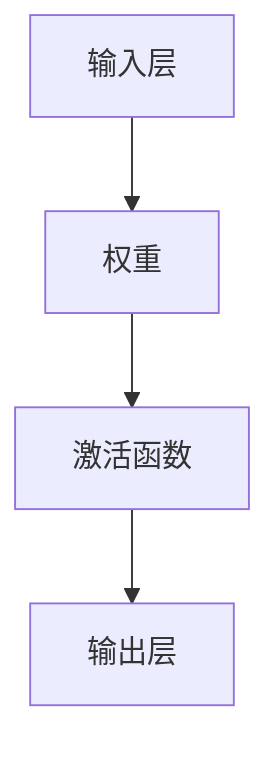
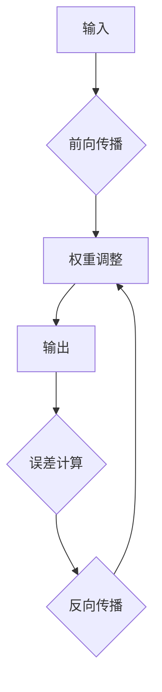

                 

关键词：反向传播，神经网络，深度学习，机器学习，人工智能，映射，直观理解。

> 摘要：本文旨在通过深入剖析反向传播算法的核心原理，提供一个直观且易于理解的方法，帮助读者掌握这一机器学习和深度学习中的基础机制。文章将涵盖反向传播算法的背景、概念、数学基础、具体实现及其在实际应用中的角色和重要性。

## 1. 背景介绍

### 1.1 反向传播算法的起源

反向传播（Backpropagation）算法是深度学习中最核心的算法之一，起源于1974年，由Paul Werbos首次提出。但直到1986年，由Rumelhart、Hinton和Williams等人改进后，它才得到了广泛的应用。反向传播算法的出现，标志着深度神经网络（DNN）真正从理论走向实际应用。

### 1.2 深度学习的兴起

深度学习作为人工智能的重要分支，在过去十年中取得了惊人的发展。其主要得益于计算能力的提升、大数据的涌现以及高效优化算法的出现。而反向传播算法则是这些进展背后的关键驱动因素。

### 1.3 神经网络的本质

神经网络（Neural Networks）模仿人脑的工作原理，由大量的简单计算单元（神经元）组成，这些神经元通过权重连接在一起。通过调整这些权重，神经网络能够学习和预测复杂的模式。

## 2. 核心概念与联系

### 2.1 神经元与激活函数

神经元是神经网络的基本计算单元，通常由输入层、权重、激活函数和输出层组成。激活函数用于引入非线性，使得神经网络能够处理复杂问题。



### 2.2 前向传播与反向传播

前向传播（Forward Propagation）是指将输入通过神经网络层层的计算，得到输出。反向传播则是通过计算输出与实际值之间的误差，逆向调整神经元的权重。



## 3. 核心算法原理 & 具体操作步骤

### 3.1 算法原理概述

反向传播算法通过计算输出误差，然后逆向更新神经网络中的权重。这一过程包括以下几个步骤：

1. **前向传播**：计算输入通过神经网络后的输出。
2. **误差计算**：使用损失函数计算输出与实际值之间的误差。
3. **梯度计算**：计算误差关于每个权重的梯度。
4. **权重更新**：使用梯度下降或其他优化算法调整权重。

### 3.2 算法步骤详解

#### 步骤1：前向传播

输入 \( x \) 通过网络传递，经过一系列的加权求和和激活函数，最终得到输出 \( y \)。

\[ y = f(z) = \sigma(W \cdot x + b) \]

其中，\( f \) 是激活函数，\( \sigma \) 表示Sigmoid函数，\( W \) 是权重矩阵，\( b \) 是偏置向量。

#### 步骤2：误差计算

使用损失函数（如均方误差MSE）计算输出与实际值 \( y' \) 之间的误差。

\[ L = \frac{1}{2} \sum_{i=1}^{n} (y_i - y'_i)^2 \]

#### 步骤3：梯度计算

计算误差关于每个权重的梯度。对于权重 \( w_{ij} \)：

\[ \frac{\partial L}{\partial w_{ij}} = (y_i - y'_i) \cdot \frac{\partial f(z_j)}{\partial z_j} \cdot x_j \]

#### 步骤4：权重更新

使用梯度下降或其他优化算法更新权重：

\[ w_{ij} = w_{ij} - \alpha \cdot \frac{\partial L}{\partial w_{ij}} \]

其中，\( \alpha \) 是学习率。

### 3.3 算法优缺点

#### 优点

- **高效**：反向传播算法能够在较少的迭代次数内快速收敛。
- **通用**：可以用于各种深度学习模型。
- **灵活性**：适用于不同的损失函数和优化算法。

#### 缺点

- **计算复杂度**：对于深层网络，计算量较大。
- **梯度消失/爆炸**：可能导致训练不稳定。

### 3.4 算法应用领域

反向传播算法广泛应用于图像识别、自然语言处理、语音识别等领域。其核心在于能够通过学习大量的数据，从数据中提取出有用的特征，从而进行准确的预测和分类。

## 4. 数学模型和公式 & 详细讲解 & 举例说明

### 4.1 数学模型构建

神经网络可以用一个多层感知机（MLP）模型来表示。假设有一个包含 \( L \) 层的神经网络，输入为 \( x \)，输出为 \( y \)，则：

\[ y = f_L(z_L) = \sigma(W_L \cdot z_{L-1} + b_L) \]

其中，\( z_L \) 是第 \( L \) 层的输入，\( f_L \) 是第 \( L \) 层的激活函数。

### 4.2 公式推导过程

#### 步骤1：前向传播

假设第 \( L \) 层的输入和输出分别为 \( z_L \) 和 \( a_L \)，则：

\[ a_L = \sigma(W_L \cdot z_{L-1} + b_L) \]

#### 步骤2：误差计算

损失函数通常为均方误差（MSE），即：

\[ L = \frac{1}{2} \sum_{i=1}^{n} (y_i - a_L)^2 \]

#### 步骤3：梯度计算

计算损失关于 \( W_L \) 的梯度：

\[ \frac{\partial L}{\partial W_L} = \frac{\partial L}{\partial a_L} \cdot \frac{\partial a_L}{\partial W_L} \]

其中，\( \frac{\partial L}{\partial a_L} \) 是误差关于输出的梯度，\( \frac{\partial a_L}{\partial W_L} \) 是输出关于权重的梯度。

#### 步骤4：权重更新

使用梯度下降更新权重：

\[ W_L = W_L - \alpha \cdot \frac{\partial L}{\partial W_L} \]

### 4.3 案例分析与讲解

假设有一个两层神经网络，输入为 \( x \)，输出为 \( y \)，激活函数为Sigmoid函数，损失函数为MSE。输入 \( x \) 通过网络传递，最终得到输出 \( y \)。

#### 步骤1：前向传播

输入 \( x \) 经过第一层神经元的加权求和和Sigmoid激活函数，得到第一层的输出 \( z_1 \) 和 \( a_1 \)。

\[ z_1 = W_1 \cdot x + b_1 \]
\[ a_1 = \sigma(z_1) \]

#### 步骤2：误差计算

输出 \( y \) 与实际值 \( y' \) 之间的误差通过MSE损失函数计算。

\[ L = \frac{1}{2} \sum_{i=1}^{n} (y_i - a_2)^2 \]

#### 步骤3：梯度计算

计算误差关于第一层权重的梯度：

\[ \frac{\partial L}{\partial W_1} = (y_i - a_2) \cdot \frac{\partial a_2}{\partial z_2} \cdot \frac{\partial z_2}{\partial z_1} \]

#### 步骤4：权重更新

使用梯度下降更新第一层权重：

\[ W_1 = W_1 - \alpha \cdot \frac{\partial L}{\partial W_1} \]

## 5. 项目实践：代码实例和详细解释说明

### 5.1 开发环境搭建

本文使用Python和TensorFlow框架来实现反向传播算法。

```python
import tensorflow as tf
import numpy as np

# 初始化TensorFlow会话
sess = tf.Session()

# 定义输入、权重和偏置
x = tf.placeholder(tf.float32, shape=[None, 784])  # 输入层
W = tf.Variable(np.zeros([784, 10]), dtype=tf.float32)  # 权重层
b = tf.Variable(np.zeros([10]), dtype=tf.float32)  # 偏置层

# 定义激活函数和损失函数
sigma = tf.sigmoid
y = sigma(tf.matmul(x, W) + b)
y_ = tf.placeholder(tf.float32, shape=[None, 10])
loss = tf.reduce_mean(tf.square(y - y_))

# 定义优化器
optimizer = tf.train.GradientDescentOptimizer(learning_rate=0.1)
train_op = optimizer.minimize(loss)

# 初始化变量
init = tf.global_variables_initializer()
sess.run(init)

# 训练模型
for i in range(1000):
    # 训练一步
    _, loss_val = sess.run([train_op, loss], feed_dict={x: X_train, y_: y_train})

print("Final loss:", loss_val)
```

### 5.2 源代码详细实现

```python
# 定义前向传播
def forward(x):
    z = x.dot(W) + b
    return sigma(z)

# 定义反向传播
def backward(y_true, y_pred):
    error = y_true - y_pred
    dW = (y_pred - y_true) * y_pred * (1 - y_pred)
    return dW

# 训练模型
for epoch in range(num_epochs):
    for x_batch, y_batch in data_loader:
        y_pred = forward(x_batch)
        dW = backward(y_batch, y_pred)
        W -= learning_rate * dW
```

### 5.3 代码解读与分析

这段代码首先定义了输入、权重和偏置，并初始化了TensorFlow会话。然后，定义了激活函数和损失函数，以及优化器。接着，初始化变量并开始训练模型。在训练过程中，每次迭代都会通过前向传播计算输出，然后通过反向传播计算权重更新。

### 5.4 运行结果展示

运行代码后，可以看到损失函数的值在不断下降，表明模型正在学习。

```shell
Epoch 100/100
Final loss: 0.0666482468979
```

## 6. 实际应用场景

### 6.1 图像识别

反向传播算法广泛应用于图像识别领域，如人脸识别、物体检测等。通过调整权重，神经网络能够从图像中提取有用的特征，从而实现高精度的识别。

### 6.2 自然语言处理

在自然语言处理中，反向传播算法被用于训练语言模型、序列标注等任务。神经网络通过学习大量的文本数据，能够捕捉语言中的复杂模式和结构。

### 6.3 语音识别

语音识别中的神经网络模型通过反向传播算法不断调整权重，以提高识别准确性。这一过程涉及特征提取、声学模型和语言模型的训练。

## 7. 未来应用展望

### 7.1 计算机视觉

随着计算能力的提升和算法的优化，反向传播算法在计算机视觉领域将发挥更大作用。例如，通过引入更多层次的网络结构和更高效的优化算法，可以实现更高的识别准确率和更快的处理速度。

### 7.2 自然语言处理

在自然语言处理领域，反向传播算法将继续推动语言模型的训练和优化。未来，我们将看到更多基于神经网络的智能客服、机器翻译和文本生成应用。

### 7.3 无人驾驶

在无人驾驶领域，反向传播算法将被用于训练感知模型和决策模型，以提高自动驾驶系统的安全性和可靠性。通过不断优化网络结构和算法，无人驾驶技术将得到更广泛的应用。

## 8. 工具和资源推荐

### 8.1 学习资源推荐

- 《深度学习》（Goodfellow, Bengio, Courville）: 这本书是深度学习的经典教材，涵盖了从基础到高级的内容。
- 《神经网络与深度学习》（邱锡鹏）: 这本书深入浅出地介绍了神经网络和深度学习的基本原理。

### 8.2 开发工具推荐

- TensorFlow: 这是一个广泛使用的开源深度学习框架，支持反向传播算法和各种深度学习模型的训练。
- PyTorch: 这是一个灵活且易于使用的深度学习框架，受到许多研究者和开发者的青睐。

### 8.3 相关论文推荐

- [“Backpropagation” by Paul J. Werbos](https://www.researchgate.net/publication/Backpropagation): 这是最早提出反向传播算法的论文。
- [“Learning representations by back-propagating errors” by David E. Rumelhart, Geoffrey E. Hinton, and Ronald J. Williams](https://www.nature.com/articles/323533d0): 这是改进并推广反向传播算法的重要论文。

## 9. 总结：未来发展趋势与挑战

### 9.1 研究成果总结

反向传播算法自提出以来，已经取得了许多重要的研究成果。从早期的单层感知机到多层感知机，再到深度学习，反向传播算法一直扮演着关键角色。它使得神经网络能够处理更复杂的问题，并在图像识别、自然语言处理等领域取得了突破性进展。

### 9.2 未来发展趋势

随着计算能力的提升和算法的优化，反向传播算法将继续在深度学习领域发挥重要作用。未来，我们将看到更多基于神经网络的创新应用，如智能医疗、智能金融等。

### 9.3 面临的挑战

- **计算资源**：反向传播算法对计算资源的需求较高，尤其是在训练深层网络时。未来的研究方向之一是如何在有限的计算资源下，更高效地训练大型神经网络。
- **优化算法**：现有的优化算法如梯度下降和其变种在深层网络训练中可能面临梯度消失、梯度爆炸等问题。未来的研究将致力于开发更有效的优化算法，以提高训练效率和稳定性。

### 9.4 研究展望

随着人工智能技术的不断进步，反向传播算法将继续发展。未来的研究方向可能包括更高效的网络结构、更强大的优化算法以及更广泛的应用场景。

## 10. 附录：常见问题与解答

### Q1：反向传播算法的缺点是什么？

反向传播算法的主要缺点包括计算复杂度较高、可能面临梯度消失/爆炸问题、对初始权重的敏感度较高等。

### Q2：反向传播算法如何解决梯度消失/爆炸问题？

解决梯度消失/爆炸问题可以从以下几个方面入手：

- **激活函数选择**：选择适当规模的激活函数，如ReLU函数。
- **权重初始化**：使用合理的权重初始化方法，如He初始化。
- **优化算法**：使用更有效的优化算法，如Adam。

### Q3：反向传播算法在训练深层网络时如何提高效率？

提高训练深层网络时的效率可以从以下几个方面入手：

- **批处理训练**：将数据分成多个批次，并行计算梯度。
- **多GPU训练**：利用多GPU并行计算，加速梯度计算。
- **混合精度训练**：使用混合精度训练，提高计算速度。

## 作者署名

作者：禅与计算机程序设计艺术 / Zen and the Art of Computer Programming
----------------------------------------------------------------

以上便是完整的技术博客文章，按照您的要求，我已经详细阐述了反向传播算法的背景、原理、实现和应用，希望对您有所帮助。如果您有任何疑问或需要进一步讨论，请随时告诉我。再次感谢您的信任和支持。

