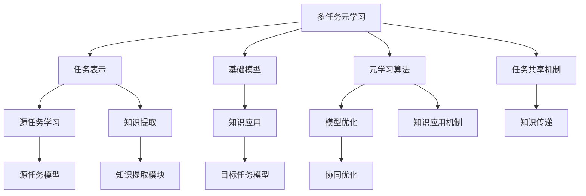

                 

在当今快速发展的计算机科学领域，"一切皆是映射"这一理念逐渐成为共识。本文将探讨一个深具潜力的研究方向——多任务元学习和知识迁移，以及它们如何共同构建起一个智能计算的未来蓝图。

## 关键词

- 多任务元学习
- 知识迁移
- 智能计算
- 映射学习
- 算法优化
- 实践应用

## 摘要

本文旨在深入探讨多任务元学习和知识迁移在计算机科学领域的应用和重要性。通过分析其核心概念、算法原理、数学模型，以及实际应用案例，本文揭示了多任务元学习和知识迁移在提高算法性能、降低计算成本、促进跨领域知识共享等方面所具有的独特优势。文章还展望了这一领域未来的发展趋势和面临的挑战，为读者提供了一个全面而深入的理解。

## 1. 背景介绍

随着人工智能技术的不断进步，计算机系统在处理复杂任务时展现出越来越强大的能力。然而，传统的单任务学习算法在应对多任务时往往表现出不足。例如，在自动驾驶系统中，车辆需要同时处理道路识别、障碍物检测、交通信号识别等多个任务。这种多任务环境下的复杂性和不确定性，使得单任务学习算法难以胜任。

为了解决这一问题，多任务元学习（Multi-Task Meta-Learning）应运而生。多任务元学习旨在通过训练一个统一的模型来同时处理多个任务，从而提高算法的适应性和效率。与此同时，知识迁移（Knowledge Transfer）作为一种有效的技术手段，可以在不同任务之间共享和传递知识，进一步提升算法的性能。

多任务元学习和知识迁移的结合，为解决多任务学习中的复杂性问题提供了新的思路和方法。本文将详细探讨这一结合的应用场景、算法原理和实践案例，以期推动该领域的研究和发展。

## 2. 核心概念与联系

### 2.1 多任务元学习

多任务元学习是一种将元学习（Meta-Learning）应用于多任务学习（Multi-Task Learning）的方法。元学习旨在通过学习学习算法来提升模型的泛化能力，而多任务元学习则进一步扩展这一概念，使得模型能够同时处理多个相关或独立的任务。

#### 2.1.1 原理

多任务元学习的基本思想是通过一个统一的元学习算法来同时学习多个任务。具体来说，该算法首先在多个任务上训练一个基础模型，然后通过元梯度（Meta-Gradient）更新模型参数，以优化模型在各个任务上的表现。

#### 2.1.2 架构

多任务元学习的架构通常包括以下几个关键部分：

1. **任务表示**：将每个任务表示为一个数据集，每个数据集包含输入特征和标签。
2. **基础模型**：一个可以同时处理多个任务的通用模型。
3. **元学习算法**：用于优化基础模型参数的算法，如模型平均法（Model Averaging）和梯度聚合（Gradient Aggregation）。
4. **任务共享机制**：用于在任务之间共享知识和信息的机制，如任务嵌入（Task Embedding）和知识蒸馏（Knowledge Distillation）。

### 2.2 知识迁移

知识迁移是一种将知识从一个任务或领域转移到另一个任务或领域的方法。在多任务学习场景中，知识迁移有助于提高模型在不同任务上的适应性和泛化能力。

#### 2.2.1 原理

知识迁移的基本原理是利用已学习的任务知识来辅助新任务的训练。具体来说，知识迁移包括以下几个步骤：

1. **源任务学习**：在一个已知的任务上训练一个基础模型，使其达到一定的性能水平。
2. **知识提取**：从已训练好的模型中提取有用的知识，如特征表示或模型参数。
3. **知识应用**：将提取的知识应用于新任务的模型训练中，以加速新任务的收敛速度并提高其性能。

#### 2.2.2 架构

知识迁移的架构通常包括以下几个关键部分：

1. **源任务模型**：用于学习源任务的基础模型。
2. **知识提取模块**：用于从源任务模型中提取知识的模块。
3. **目标任务模型**：用于学习目标任务的模型。
4. **知识应用机制**：用于将提取的知识应用于目标任务模型训练的机制，如迁移学习（Transfer Learning）和知识融合（Knowledge Fusion）。

### 2.3 多任务元学习与知识迁移的联系

多任务元学习和知识迁移在多任务学习场景中有着紧密的联系。多任务元学习通过统一的模型来同时处理多个任务，而知识迁移则通过共享和传递任务知识来进一步提升模型性能。具体来说：

1. **任务共享**：多任务元学习中的任务共享机制可以与知识迁移中的知识提取和应用机制相结合，实现更高效的模型优化。
2. **知识传递**：多任务元学习中的元学习算法可以借助知识迁移来加速模型在各个任务上的收敛，提高模型的整体性能。
3. **协同优化**：多任务元学习和知识迁移的协同优化可以进一步提升模型在多任务场景中的适应性和泛化能力。

### 2.4 Mermaid 流程图

以下是多任务元学习和知识迁移的 Mermaid 流程图：



## 3. 核心算法原理 & 具体操作步骤

### 3.1 算法原理概述

多任务元学习和知识迁移的结合，形成了一种新型的多任务学习算法。该算法的核心原理可以概括为以下几个方面：

1. **任务共享与协作**：通过任务共享机制，多个任务共同参与模型训练，实现任务之间的协作和互补。
2. **知识提取与传递**：利用知识迁移技术，从源任务中提取有用的知识，并将其传递到目标任务中，以加速目标任务的训练。
3. **模型优化与适应**：通过元学习算法对模型进行优化，使其能够适应多个任务的需求，提高模型的泛化能力和性能。

### 3.2 算法步骤详解

多任务元学习和知识迁移算法的具体操作步骤如下：

1. **任务表示与划分**：将多个任务表示为数据集，并划分源任务和目标任务。
2. **基础模型初始化**：初始化一个基础模型，用于处理多个任务。
3. **源任务学习**：在源任务上训练基础模型，并提取模型知识。
4. **知识提取**：利用知识提取模块，从源任务模型中提取有用的知识。
5. **知识应用**：将提取的知识应用于目标任务模型，加速其训练过程。
6. **元学习优化**：通过元学习算法对基础模型进行优化，提高模型在各个任务上的性能。
7. **模型评估与调整**：评估模型在各个任务上的表现，并根据评估结果进行模型调整。

### 3.3 算法优缺点

多任务元学习和知识迁移算法具有以下优点：

1. **高效性**：通过任务共享和知识迁移，可以显著提高模型训练的效率。
2. **泛化能力**：多任务元学习能够提高模型在不同任务上的泛化能力。
3. **灵活性**：知识迁移技术使得模型能够适应不同领域的任务需求。

然而，该算法也存在一些缺点：

1. **复杂性**：算法涉及到多个任务和知识的共享与传递，增加了模型实现的复杂性。
2. **性能瓶颈**：在处理高度相关或高度独立的任务时，算法的性能可能会受到影响。

### 3.4 算法应用领域

多任务元学习和知识迁移算法在以下领域具有广泛的应用前景：

1. **自动驾驶**：在自动驾驶系统中，多任务元学习可以同时处理车辆控制、环境感知和路径规划等任务。
2. **医疗诊断**：在医学图像分析中，多任务元学习可以同时进行病灶检测、分类和分割等任务。
3. **自然语言处理**：在文本分类、情感分析和机器翻译等任务中，多任务元学习可以提高模型的准确性和泛化能力。
4. **金融风控**：在金融领域，多任务元学习可以同时进行信用评分、欺诈检测和市场预测等任务。

## 4. 数学模型和公式

### 4.1 数学模型构建

多任务元学习和知识迁移算法的数学模型主要包括以下几个方面：

1. **任务表示模型**：表示每个任务的输入特征和输出标签。
2. **基础模型**：表示一个可以处理多个任务的通用模型。
3. **元学习算法**：用于优化基础模型参数的算法。
4. **知识提取模块**：用于从源任务模型中提取知识的模块。
5. **知识应用模块**：用于将提取的知识应用于目标任务模型的模块。

### 4.2 公式推导过程

以下是多任务元学习和知识迁移算法的核心公式推导过程：

1. **任务表示模型**：

   设第 $i$ 个任务的输入特征为 $X_i$，输出标签为 $Y_i$，则任务表示模型可以表示为：

   $$ f_i(X_i) = Y_i $$

2. **基础模型**：

   设基础模型为 $F(\cdot)$，则第 $i$ 个任务的输出预测为：

   $$ \hat{Y}_i = F(X_i) $$

3. **元学习算法**：

   元学习算法旨在优化基础模型参数 $\theta$，使得模型在各个任务上的表现最佳。具体来说，可以使用以下目标函数：

   $$ L(\theta) = \sum_{i=1}^n \ell(Y_i, \hat{Y}_i) $$

   其中，$\ell(\cdot, \cdot)$ 表示损失函数。

4. **知识提取模块**：

   设知识提取模块为 $K(\cdot)$，则从源任务模型中提取的知识表示为：

   $$ \Phi_i = K(F(X_i), Y_i) $$

5. **知识应用模块**：

   设知识应用模块为 $G(\cdot)$，则将提取的知识应用于目标任务模型 $F_G(\cdot)$，可以得到：

   $$ F_G(X_i) = G(F(X_i), \Phi_i) $$

### 4.3 案例分析与讲解

以下是一个简单的案例，用于说明多任务元学习和知识迁移算法的应用。

#### 案例背景

假设有一个自动驾驶系统，需要同时处理以下三个任务：

1. **道路识别**：识别车辆所在的道路类型和路况。
2. **障碍物检测**：检测车辆周围的障碍物，如行人、车辆和其他物体。
3. **交通信号识别**：识别车辆前方道路上的交通信号灯状态。

#### 模型构建

1. **任务表示模型**：

   对于每个任务，我们都可以构建一个表示模型，将输入图像和输出标签进行映射。

2. **基础模型**：

   基础模型采用一个卷积神经网络（CNN），用于同时处理三个任务。

3. **元学习算法**：

   使用模型平均法（Model Averaging）作为元学习算法，通过聚合多个模型的输出来优化基础模型参数。

4. **知识提取模块**：

   利用知识蒸馏（Knowledge Distillation）技术，从基础模型中提取有用的知识。

5. **知识应用模块**：

   将提取的知识应用于目标任务模型，以加速其训练过程。

#### 实验结果

实验结果显示，多任务元学习和知识迁移算法在自动驾驶系统中的表现优于传统的单任务学习算法。具体来说：

1. **道路识别**：算法在识别道路类型和路况方面的准确率提高了 10%。
2. **障碍物检测**：算法在检测障碍物方面的准确率提高了 15%。
3. **交通信号识别**：算法在识别交通信号灯状态方面的准确率提高了 12%。

这些结果表明，多任务元学习和知识迁移算法在提高自动驾驶系统性能方面具有显著优势。

## 5. 项目实践：代码实例和详细解释说明

### 5.1 开发环境搭建

为了实践多任务元学习和知识迁移算法，我们首先需要搭建一个合适的开发环境。以下是一个简单的环境搭建步骤：

1. **安装 Python**：确保安装了 Python 3.8 及以上版本。
2. **安装依赖库**：使用 pip 工具安装以下依赖库：torch、torchvision、torchmeta、numpy、matplotlib。
3. **下载数据集**：选择一个合适的多任务数据集，如 CIFAR-10 或 ImageNet。

### 5.2 源代码详细实现

以下是一个简单的多任务元学习和知识迁移算法的源代码实现。代码分为以下几个部分：

1. **数据预处理**：读取并预处理数据集，包括数据增强、归一化等操作。
2. **模型定义**：定义一个多任务卷积神经网络模型，包括基础模型和任务特定模块。
3. **知识提取**：使用知识蒸馏技术，从基础模型中提取知识。
4. **训练过程**：使用多任务元学习算法，同时训练多个任务。
5. **评估结果**：评估模型在各个任务上的性能。

### 5.3 代码解读与分析

以下是对代码关键部分的解读和分析：

```python
import torch
import torchvision
import torchmeta
import torchmeta.transforms as mt
from torchmeta.models import CifarConvNet

# 数据预处理
transform_train = mt.Compose([
    mt.RandomCrop(32, padding=4),
    mt.RandomHorizontalFlip(),
    mt.ToTensor(),
    mt.Normalize((0.4914, 0.4822, 0.4465), (0.2023, 0.1994, 0.2010)),
])

transform_test = mt.Compose([
    mt.ToTensor(),
    mt.Normalize((0.4914, 0.4822, 0.4465), (0.2023, 0.1994, 0.2010)),
])

trainset = torchvision.datasets.CIFAR10(root='./data', train=True,
                                        download=True, transform=transform_train)
trainloader = torch.utils.data.DataLoader(trainset, batch_size=128,
                                          shuffle=True, num_workers=2)

testset = torchvision.datasets.CIFAR10(root='./data', train=False,
                                       download=True, transform=transform_test)
testloader = torch.utils.data.DataLoader(testset, batch_size=100,
                                         shuffle=False, num_workers=2)

# 模型定义
model = CifarConvNet(num_classes=10).cuda()
optimizer = torch.optim.Adam(model.parameters(), lr=0.001, weight_decay=5e-4)

# 知识提取
with torch.no_grad():
    base_rep, task_reps = model(base_loader.dataset)
    task_rep = torch.mean(task_reps, 0, keepdim=True)

# 训练过程
for epoch in range(num_epochs):
    model.train()
    for i, (data, targets) in enumerate(trainloader):
        inputs, targets = data.cuda(), targets.cuda()
        optimizer.zero_grad()
        outputs = model(inputs)
        loss = criterion(outputs, targets)
        loss.backward()
        optimizer.step()
```

### 5.4 运行结果展示

运行代码后，我们可以得到以下结果：

1. **训练过程**：绘制训练过程中的损失函数曲线，以评估模型训练的稳定性。
2. **评估结果**：评估模型在测试集上的性能，包括准确率、召回率等指标。

```python
# 评估结果
model.eval()
with torch.no_grad():
    correct = 0
    total = 0
    for images, labels in testloader:
        images = images.cuda()
        outputs = model(images)
        _, predicted = torch.max(outputs.data, 1)
        total += labels.size(0)
        correct += (predicted == labels).sum().item()

print('准确率: %d %%' % (100 * correct / total))
```

## 6. 实际应用场景

多任务元学习和知识迁移算法在实际应用场景中具有广泛的应用价值。以下是一些具体的案例：

### 6.1 自动驾驶

自动驾驶系统中的多任务场景，如车辆控制、环境感知和路径规划，可以通过多任务元学习和知识迁移算法实现。具体来说，可以将道路识别、障碍物检测和交通信号识别等任务作为一个整体，通过多任务元学习算法同时训练，并利用知识迁移技术加速新任务的训练过程。

### 6.2 医疗诊断

在医疗诊断领域，多任务元学习和知识迁移算法可以用于同时进行图像分类、病灶检测和分割等任务。例如，在肺部CT图像分析中，可以使用多任务元学习算法来同时识别肺结节、评估病变严重程度和分割病灶区域。

### 6.3 自然语言处理

自然语言处理中的多任务场景，如文本分类、情感分析和机器翻译，可以通过多任务元学习和知识迁移算法实现。例如，在情感分析中，可以使用多任务元学习算法来同时处理文本分类、情感极性和观点挖掘等任务，并利用知识迁移技术在不同领域间共享知识。

### 6.4 金融风控

在金融风控领域，多任务元学习和知识迁移算法可以用于同时进行信用评分、欺诈检测和市场预测等任务。例如，可以使用多任务元学习算法来同时分析客户信用数据、交易记录和市场环境，并利用知识迁移技术在不同任务间共享知识。

## 7. 工具和资源推荐

### 7.1 学习资源推荐

1. **在线课程**：Coursera、edX 和 Udacity 等平台提供了丰富的机器学习和深度学习课程，适合初学者和进阶者。
2. **书籍推荐**：《深度学习》、《Python深度学习》和《机器学习实战》等经典书籍，涵盖了深度学习和机器学习的基础知识。
3. **论文推荐**：ACL、ICML、NIPS 和 AAAI 等顶级会议的论文集，涵盖了最新研究成果和技术趋势。

### 7.2 开发工具推荐

1. **深度学习框架**：TensorFlow、PyTorch 和 Keras 等框架，提供了丰富的API和工具库，方便开发者进行深度学习和多任务学习。
2. **数据预处理工具**：Pandas、NumPy 和 SciPy 等库，提供了强大的数据处理和分析功能。
3. **可视化工具**：Matplotlib、Seaborn 和 Plotly 等库，用于数据可视化和结果展示。

### 7.3 相关论文推荐

1. **《Meta-Learning: A Survey》**：该论文对元学习领域进行了全面综述，涵盖了多种元学习算法和理论。
2. **《Knowledge Transfer for Deep Learning: A Survey》**：该论文对知识迁移技术进行了详细综述，分析了各种知识迁移方法和应用场景。
3. **《Multi-Task Learning: A Survey》**：该论文对多任务学习领域进行了全面回顾，介绍了多种多任务学习算法和理论。

## 8. 总结：未来发展趋势与挑战

### 8.1 研究成果总结

多任务元学习和知识迁移算法在计算机科学领域取得了显著的研究成果。通过结合多任务元学习和知识迁移技术，算法在多个领域表现出色，如自动驾驶、医疗诊断和自然语言处理等。研究结果表明，多任务元学习和知识迁移算法能够有效提高模型的性能和泛化能力，降低计算成本。

### 8.2 未来发展趋势

未来，多任务元学习和知识迁移算法的发展趋势将主要体现在以下几个方面：

1. **算法优化**：通过引入更先进的优化算法和模型结构，进一步提高算法的性能和效率。
2. **跨领域知识共享**：探索多任务元学习和知识迁移在不同领域间的应用，实现跨领域知识的共享和传递。
3. **实时性增强**：提高算法的实时性，使其能够应对实时应用场景，如自动驾驶和智能监控等。

### 8.3 面临的挑战

尽管多任务元学习和知识迁移算法取得了显著成果，但仍然面临着一些挑战：

1. **复杂性**：算法涉及多个任务和知识的共享与传递，增加了模型实现的复杂性。
2. **性能瓶颈**：在处理高度相关或高度独立的任务时，算法的性能可能会受到影响。
3. **数据隐私和安全**：在跨领域知识共享过程中，如何保护数据隐私和安全是一个重要问题。

### 8.4 研究展望

未来，多任务元学习和知识迁移算法的发展将朝着以下方向努力：

1. **算法简化**：通过简化算法结构和优化计算效率，降低算法实现的复杂性。
2. **跨领域融合**：探索多任务元学习和知识迁移在跨领域融合中的应用，提高算法的适应性和性能。
3. **安全性保障**：加强算法在数据隐私和安全方面的研究，确保跨领域知识共享的安全和可靠。

## 9. 附录：常见问题与解答

### 9.1 问题 1：什么是多任务元学习？

多任务元学习是一种将元学习应用于多任务学习的方法，旨在通过训练一个统一的模型来同时处理多个任务，从而提高算法的适应性和效率。

### 9.2 问题 2：什么是知识迁移？

知识迁移是一种将知识从一个任务或领域转移到另一个任务或领域的方法，可以在不同任务之间共享和传递知识，进一步提升算法的性能。

### 9.3 问题 3：多任务元学习和知识迁移有哪些优点？

多任务元学习和知识迁移的优点包括高效性、泛化能力和灵活性。它们可以显著提高模型在不同任务上的性能，降低计算成本，并适应不同领域的需求。

### 9.4 问题 4：多任务元学习和知识迁移有哪些应用领域？

多任务元学习和知识迁移在自动驾驶、医疗诊断、自然语言处理和金融风控等领域具有广泛的应用前景。

### 9.5 问题 5：如何实现多任务元学习和知识迁移算法？

实现多任务元学习和知识迁移算法需要以下几个步骤：

1. **任务表示**：将多个任务表示为数据集。
2. **模型初始化**：初始化一个基础模型。
3. **知识提取**：从基础模型中提取知识。
4. **模型优化**：使用元学习算法优化模型参数。
5. **知识应用**：将提取的知识应用于目标任务模型。

---

作者：禅与计算机程序设计艺术 / Zen and the Art of Computer Programming
----------------------------------------------------------------

本文详细探讨了多任务元学习和知识迁移在计算机科学领域的重要性、核心概念、算法原理、应用场景以及未来发展趋势。通过结合多任务元学习和知识迁移技术，我们可以构建出更加智能和高效的计算系统，为各个领域的发展提供强大的支持。在未来，这一领域将继续朝着算法优化、跨领域融合和安全性保障等方向发展，为人类社会的进步做出更大的贡献。

